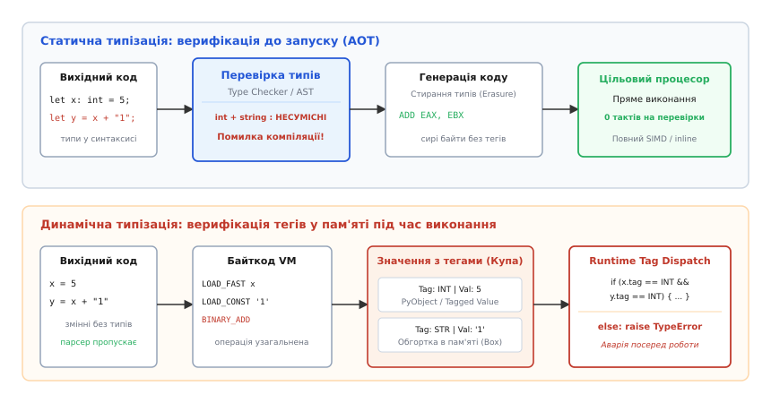
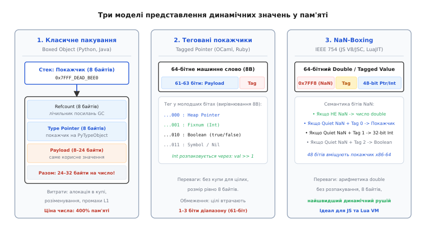
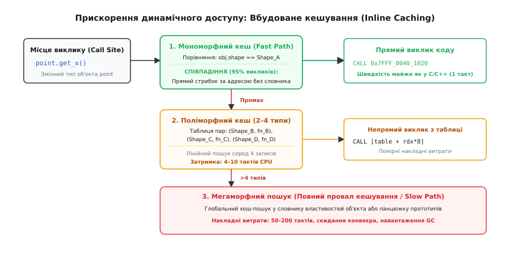
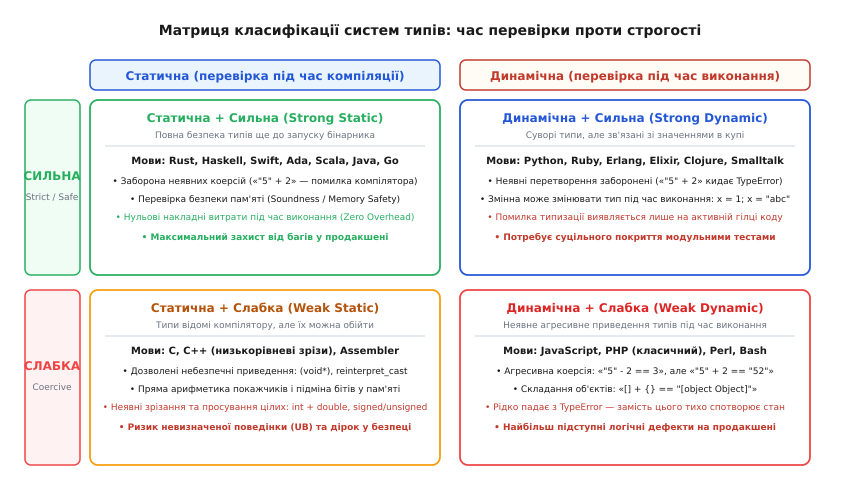

# Статична й динамічна типізація: коли виявляється помилка

<preknowlist>
- [Компіляція](topic:programming/compilation) — трансляція вихідного коду в машинний бінарний файл, розбір синтаксичного дерева та генерація інструкцій.
- [Плаваюча кома](topic:programming/floating-point) — формат чисел IEEE 754, мантиса, експонента та бітова маска Quiet NaN.
- [Байткод і віртуальна машина](topic:programming/bytecode-vm) — інтерпретація команд, стек операндів та виконання байткоду.
- [Оптимізації компілятора](topic:programming/compiler-optimizations) — вбудовування функцій (inlining), усунення перевірок і мономорфізація.
</preknowlist>

У платіжному шлюзі банку функція розрахунку комісії приймає суму переказу `amount` і множить її на тарифну ставку `0.02`. У динамічному середовищі на кшталт Python вираз `amount * 0.02` не викликає жодних зауважень під час запуску програми. Якщо вдень сервіс стабільно обробляє цілі та дійсні числа, а о третій годині ночі від зовнішнього партнера надходить JSON із числовим полем, переданим у вигляді рядка `"100"`, інтерпретатор намагається виконати операцію над несумісними типами і перериває транзакцію винятком `TypeError: can't multiply sequence by non-int of type 'float'`. У JavaScript той самий вираз `"100" * 0.02` неявно приведе рядок до числа і поверне `2.0`, проте сусідній вираз `"100" + 2` виконає конкатенацію рядків і поверне `"1002"`, тихо спотворивши фінансовий баланс у базі даних без жодного повідомлення про збій.

У статично типізованих мовах на кшталт Rust, C++, Go або Java ця категорія дефектів усувається принципово іншим способом: компілятор аналізує типи виразів ще на етапі збирання проєкту. Якщо тип параметра функції не збігається з очікуваним типом аргументу, компілятор відмовляється генерувати двійковий файл і видає діагностичне повідомлення із зазначенням точного номера рядка та несумісних сигнатур задовго до того, як код потрапить на сервер або у вбудований мікроконтролер.

Розподіл систем програмування на **статичні** та **динамічні** визначається фундаментальною відповіддю на одне питання: **що саме є носієм типу — синтаксичні імена та вирази у вихідному тексті програми чи фізичні блоки пам'яті під час її виконання**. Розуміння того, як ця різниця впливає на внутрішнє представлення даних у процесорі, структуру об'єктів у RAM, оптимізації JIT-компіляторів та архітектуру великих програмних систем, дозволяє обирати оптимальний інструмент під конкретну інженерну задачу.

## Де живуть типи: вирази проти значень у пам'яті

Головна відмінність між статичною та динамічною типізацією полягає в тому, до якої сутності прив'язана інформація про тип (англ. *type metadata*):

```
Статична типізація:   Змінна / Вираз  ──[Має фіксований тип T]──>  Комірка пам'яті (сирі байти)
Динамічна типізація:  Змінна / Ім'я   ──[Нейтральний покажчик]──>  Об'єкт у купі [Тег типу | Байти]
```

### Статична типізація: типи як предикати над синтаксисом

У статично типізованій мові типом наділені **змінні, поля структур, параметри функцій та вирази** абстрактного синтаксичного дерева (AST). Тип є властивістю тексту програми.

Коли компілятор обробляє рядок `int32_t counter = 0;`, він фіксує в таблиці символів, що ім'я `counter` позначає 4-байтне знакове ціле число зі зміщенням `-8(%rbp)` на стековому кадрі. Для кожної наступної операції `counter + step` компілятор виконує статичну верифікацію: він перевіряє правила типів (англ. *typing rules*) для оператора `+` над аргументами відомих типів.

Після завершення фази перевірки типів відбувається процес **стирання типів** (англ. *type erasure*). Компілятор транслює вираз у пряму апаратну інструкцію `ADD DWORD PTR [rbp-8], eax`. У готовому двійковому файлі більше немає жодної згадки про тип `int32_t`: процесор оперує чистими 32-бітними регістрами. Самі байти в пам'яті не містять жодних службових заголовків чи позначок.

### Динамічна типізація: типи як властивості об'єктів у пам'яті

У динамічно типізованій мові змінні не мають типів — вони є лише іменними посиланнями (покажчиками) на об'єкти в пам'яті. **Тип належить виключно значенню** (об'єкту), створеному в купі під час роботи програми.

Один і той самий ідентифікатор `x` може послідовно вказувати на різні типи даних:

```python
x = 42          # x вказує на об'єкт типу int
x = "повідомлення"  # x тепер вказує на об'єкт типу str
x = [1, 2, 3]   # x тепер вказує на об'єкт типу list
```

Оскільки компілятор (або інтерпретатор) не може заздалегідь знати, об'єкт якого типу опиниться в змінній `x` у момент виконання рядка `x.process()`, кожне значення в пам'яті змушене нести з собою явний заголовок — **тег типу** (англ. *type tag*). Будь-яка операція перетворюється на динамічну диспетчеризацію: віртуальна машина зчитує тег типу з пам'яті, перевіряє, чи підтримує даний тип запитану дію, і лише після цього переходить до виконання відповідного коду.


*Етапи перевірки типів: у статичних мовах типи перевіряються до запуску і стираються в сирий машинний код; у динамічних мовах тег типу перевіряється на кожній операції під час виконання.*

> 🔧 **Навіщо це.** Якщо ви розробляєте прошивку мікроконтролера з 32 КБ оперативної пам'яті або високочастотний торговий рушій (HFT), кожен байт метаданих і кожен зайвий перехід за покажчиком критичні. Статична типізація дозволяє процесору виконувати обчислення над «голими» числами в регістрах з максимальною щільністю кешу. Динамічна типізація жертвує пам'яттю та тактами заради свободи маніпулювання гетерогенними даними без необхідності заздалегідь описувати жорсткі структури.

## Ціна динамічної типізації: пам'ять, упаковка та промахи кешу

Різниця в моменті перевірки типів безпосередньо формує фізичне розташування даних в оперативній пам'яті комп'ютера.

### Накладні витрати на упаковку (Boxing)

У статичних мовах масив з одного мільйона 64-бітних цілих чисел `int64_t arr[1000000]` займає в пам'яті рівно `1 000 000 × 8 = 8 000 000` байтів (близько 7.63 МБ). Числа лежать у неперервному блоці пам'яті одне за одним, і апаратний префетчер процесора завчасно завантажує їх у кеш L1.

У динамічній мові на зразок Python список `arr = [i for i in range(1000000)]` влаштований принципово інакше:
1. Сам список `PyListObject` містить масив покажчиків (8 МБ).
2. Кожен елемент списку є окремим об'єктом `PyLongObject` у купі. Структура об'єкта містить:
   - 8 байтів лічильника посилань (`ob_refcnt`);
   - 8 байтів покажчика на об'єкт типу `PyTypeObject` (`ob_type`);
   - 8 байтів розміру та службових прапорців (`ob_size`);
   - 8 байтів власне 64-бітного числа.

Сумарний розмір одного числа становить **28–32 байти**. Разом із покажчиком у списку одне ціле число вимагає **36–40 байтів** замість 8. Масив займає близько 40 МБ оперативної пам'яті — у **5 разів більше**, ніж у статичній мові.

Крім перевитрати пам'яті, обхід такого списку спричиняє масові **промахи кешу даних (L1/L2 Data Cache Misses)**. Замість послідовного читання суміжних комірок пам'яті процесор змушений здійснювати непрямі стрибки за покажчиками в довільні адреси купи (явище *pointer chasing*), що сповільнює виконання числових алгоритмів на один-два порядки.

```
Представлення в пам'яті масиву чисел:

Статичний масив (C/C++/Rust):
┌──────────┬──────────┬──────────┬──────────┐
│  Num 0   │  Num 1   │  Num 2   │  Num 3   │   (8 байтів на елемент, 100% локальність)
└──────────┴──────────┴──────────┴──────────┘

Динамічний список (Python PyList):
┌──────────┬──────────┬──────────┬──────────┐
│ Ptr to 0 │ Ptr to 1 │ Ptr to 2 │ Ptr to 3 │   (Масив покажчиків)
└────┬─────┴────┬─────┴────┬─────┴────┬─────┘
     │          │          │          │
     ▼          ▼          ▼          ▼
 ┌────────┐ ┌────────┐ ┌────────┐ ┌────────┐
 │Ref: 8B │ │Ref: 8B │ │Ref: 8B │ │Ref: 8B │   (Розрізнені об'єкти в купі,
 │Type: 8B│ │Type: 8B│ │Type: 8B│ │Type: 8B│    28-32 байти кожен)
 │Val: 8B │ │Val: 8B │ │Val: 8B │ │Val: 8B │
 └────────┘ └────────┘ └────────┘ └────────┘
```

### Оптимізація представлення: теговані покажчики та NaN-Boxing

Щоб зменшити витрати пам'яті та усунути виділення купи для скалярних типів, творці сучасних віртуальних машин розробили спеціальні низькорівневі методи пакування значень:

1. **Теговані покажчики (Tagged Pointers):** Використовують той факт, що адреси об'єктів у 64-бітній пам'яті вирівняні по межі 8 байтів, тому молодші 3 біти покажчика завжди дорівнюють нулю `...000`. Віртуальна машина записує в ці молодші біти тег типу (наприклад, `001` — мале ціле число Fixnum, `010` — булевий прапорець, `000` — справжній покажчик). Для цілого числа значення зберігається прямо всередині 61 старшого біта слова без виділення об'єкта в купі (використовується в OCaml, Ruby, Objective-C).
2. **NaN-Boxing:** Використовує надлишкові біти мантиси у форматі чисел з плаваючою комою IEEE 754 Quiet NaN для кодування тегів типів та 48-бітних адрес пам'яті в межах єдиного 64-бітного регістра. Детальний математичний аналіз формату та робочий код пакування розглядає [практичний проект реалізації NaN-boxing](topic:programming/static-vs-dynamic-typing/proj-nan-boxing.md).


*Три моделі представлення динамічних значень у пам'яті: класичне пакування об'єктів у купі, теговані покажчики та компактний 64-бітний NaN-boxing.*

## Оптимізації JIT-компіляторів: Inline Caching та девіртуалізація

Оскільки кожне звернення до поля `obj.field` або виклик методу `obj.method()` у динамічній мові в найгіршому випадку вимагає пошуку рядкового ключа в хеш-таблиці об'єкта та ланцюжку прототипів (50–200 тактів CPU), швидкість чистого інтерпретатора була б неприпустимо низькою.

Для подолання цієї затримки JIT-компілятори (V8 у Node.js/Chrome, PyPy, LuaJIT, Java HotSpot) використовують механізм **вбудованого кешування** (англ. *Inline Caching*, IC).

### Як працює Inline Caching

1. **Мономорфний виклик (Monomorphic IC):** Якщо точка виклику `obj.get_x()` спостерігає об'єкти лише однієї внутрішньої структури (англ. *Hidden Class* або *Shape*), JIT-компілятор перезаписує машинний код точки виклику прямою інструкцією порівняння форми об'єкта та прямим читанням зі сталим зміщенням пам'яті. Час доступу падає з 100 тактів до 1–2 тактів:
   ```
   // Машинний код мономорфного кешу:
   cmp   [rdi + SHAPE_OFFSET], SHAPE_POINT_2D   ; швидка перевірка тегу
   jne   fallback_to_polymorphic                ; промах -> перехід
   mov   rax, [rdi + X_OFFSET]                  ; пряме читання поля!
   ```
2. **Поліморфний виклик (Polymorphic IC):** Якщо через точку виклику проходять об'єкти 2–4 різних типів, кеш розгортається в невелику таблицю перевірок.
3. **Мегаморфний зрив (Megamorphic Stub):** Якщо кількість типів перевищує поріг (зазвичай 4–8), JIT-компілятор визнає оптимізацію неможливою і скидає код у повільний загальний пошук по хеш-таблиці.


*Механізм Inline Caching (IC): від мономорфного швидкого шляху (1 такт) через поліморфну таблицю до мегаморфного хеш-пошуку.*

Статичні мови програмування не потребують жодного з цих складних евристичних механізмів: точні зміщення полів у структурах та адреси невіртуальних функцій обчислюються лінкером статично, транслюючись у безумовні прямі команди `MOV` та `CALL`.

## Ортогональність систем типів: сильна та слабка типізація

В інженерних дискусіях терміни «статична» та «сильна» типізація часто помилково ототожнюють. Насправді система типів характеризується двома незалежними (ортогональними) осями:

1. **Вісь часу перевірки (Коли):**
   - **Статична:** Типи перевіряються під час компіляції/трансляції.
   - **Динамічна:** Типи перевіряються під час виконання програми.
2. **Вісь строгості правил (Як):**
   - **Сильна (Strong):** Мова гарантує збереження інваріантів типів. Неявні небезпечні перетворення (англ. *implicit coercion*) заборонені; біти одного типу не можуть бути прочитані як інший тип без явного перетворення.
   - **Слабка (Weak):** Мова дозволяє неявні автоматичні приведення між несумісними типами або дозволяє пряме маніпулювання сирою пам'яттю в обхід системи типів.


*Ортогональна матриця типізації: розподіл мов за часом перевірки (статична/динамічна) та строгістю правил приведення (сильна/слабка).*

### Аналіз 4 квадрантів матриці

1. **Статична + Сильна (Rust, Haskell, Ada, Java, Go, Swift):**  
   Компілятор жорстко контролює типи та пам'ять. Спроба додати рядок до числа `let x = 5 + "10"` в Rust або Java не скомпілюється. Відсутність неявних конверсій та суворий контроль меж масивів гарантують математичну надійність виконання (властивість *Soundness*).
2. **Статична + Слабка (C, C++):**  
   Типи відомі на етапі компіляції, проте програміст має легальні засоби обійти систему типів через нетипізовані покажчики `(void*)`, кастинг пам'яті `reinterpret_cast` або об'єднання `union`. Неявне зрізання чисел `int` до `short` чи знакове розширення виконується компілятором автоматично без попереджень, що може спричинити невизначену поведінку (Undefined Behavior, UB).
3. **Динамічна + Сильна (Python, Ruby, Erlang, Elixir, Clojure):**  
   Змінні динамічні, проте мова не робить припущень про те, що саме мав на увазі програміст. Вираз `10 + "5"` у Python не приведе рядок до числа автоматично, а негайно викличе виняток `TypeError`. Значення зберігають свою внутрішню цілісність.
4. **Динамічна + Слабка (JavaScript, класичний PHP, Perl, Bash):**  
   Мова агресивно намагається «вгадати» намір розробника за допомогою неявних правил перетворення:
   ```javascript
   "5" - 2      // 3 (рядок приведено до числа)
   "5" + 2      // "52" (число приведено до рядка)
   [] + {}      // "[object Object]"
   true + true  // 2
   ```
   Це джерело підступних дефектів, оскільки програма продовжує працювати зі спотвореним станом замість того, щоб впасти з явною помилкою.

## Еволюція систем типів: від Рассела до теореми Мілнера

Математичний фундамент статичної типізації заклав Бертран Рассел у 1908 році для розв'язання парадоксів у теорії множин, а Алонзо Черч у 1940 році формалізував його в типізованому лямбда-численні. Справжню революцію у практичному програмуванні здійснив британський вчений Робін Мілнер у 1978 році, створивши систему виведення типів **Гіндлі-Мілнера** для мови ML.

Мілнер сформулював і довів фундаментальну теорему коректності: **«Well-typed programs cannot go wrong»** (коректно типізовані програми не можуть потрапити в аварійний стан невизначеної поведінки). Історію формування систем типів, ізоморфізм Каррі-Говарда та суперечку між Lisp, Smalltalk та ML висвітлює [історичний огляд еволюції систем типів](topic:programming/static-vs-dynamic-typing/hist-hindley-milner.md).

## Гібридні моделі: Gradual Typing та динамічні типи у статичних мовах

Сучасне програмування подолало жорсткий дуалізм між чистими статичними та динамічними мовами через створення гібридних підходів.

### Поступова типізація (Gradual Typing)

Поступова типізація дозволяє поступово додавати статичні анотації типів до кодової бази динамічної мови. Яскравими прикладами є **TypeScript** для екосистеми JavaScript та **Type Hints (MyPy/Pyright)** у Python.

У TypeScript розробник сам обирає рівень строгості:

```typescript
// Повністю динамічний фрагмент (поступова міграція)
function legacy_calculate(data: any) {
    return data.price * data.count; // Типи не перевіряються
}

// Статично типізований контракт
interface OrderItem {
    readonly price: number;
    readonly count: number;
}

function safe_calculate(item: OrderItem): number {
    return item.price * item.count; // Перевіряється на етапі збірки
}
```

Головна архітектурна особливість TypeScript полягає в тому, що його типи існують **виключно під час трансляції** (англ. *compile-time only*). Транспілятор `tsc` перевіряє типи, після чого видаляє всі інтерфейси й анотації, генеруючи стандартний JavaScript. Якщо у рантаймі через мережу прийде некоректний JSON, TypeScript-типи не врятують від аварії — для валідації зовнішніх даних потрібні додаткові бібліотеки парсингу схем (як-от Zod чи io-ts).

### Динамічні типи у статичних мовах

Статичні мови надають спеціальні контейнери для роботи з гетерогенними даними, чия структура стає відомою лише під час виконання (наприклад, розбір довільного JSON або побудова плагінної архітектури):

:::tabs
```c
#include <stdio.h>
#include <stdlib.h>
#include <string.h>

/* Універсальне динамічне значення у C через дискриміноване об'єднання */
typedef enum { TYPE_INT, TYPE_STRING, TYPE_INVALID } DataType;

typedef struct {
    DataType type;
    union {
        int int_val;
        char *str_val;
    } as;
} DynamicBox;

DynamicBox make_int(int v) {
    DynamicBox b;
    b.type = TYPE_INT;
    b.as.int_val = v;
    return b;
}

DynamicBox make_str(const char *s) {
    DynamicBox b;
    b.type = TYPE_STRING;
    b.as.str_val = strdup(s);
    return b;
}

void print_box(const DynamicBox *b) {
    if (b->type == TYPE_INT) {
        printf("Int: %d\n", b->as.int_val);
    } else if (b->type == TYPE_STRING) {
        printf("String: %s\n", b->as.str_val);
    }
}

void free_box(DynamicBox *b) {
    if (b->type == TYPE_STRING && b->as.str_val) {
        free(b->as.str_val);
        b->as.str_val = NULL;
    }
}

int main(void) {
    DynamicBox b1 = make_int(100);
    DynamicBox b2 = make_str("Статична мова з динамічним контейнером");

    print_box(&b1);
    print_box(&b2);

    free_box(&b1);
    free_box(&b2);
    return 0;
}
```
```cpp
#include <iostream>
#include <string>
#include <variant>
#include <any>
#include <vector>

// 1. Безпечний закритий поліморфізм через std::variant (C++17)
using SafeDynamicValue = std::variant<int, double, std::string>;

void process_variant(const SafeDynamicValue& val) {
    std::visit([](const auto& arg) {
        std::cout << "Значення: " << arg << '\n';
    }, val);
}

// 2. Повністю відкритий динамічний тип через std::any (аналог Object у C# / Java)
void process_any(const std::any& val) {
    if (val.type() == typeid(int)) {
        std::cout << "std::any містить int: " << std::any_cast<int>(val) << '\n';
    } else if (val.type() == typeid(std::string)) {
        std::cout << "std::any містить string: " << std::any_cast<std::string>(val) << '\n';
    }
}

int main() {
    SafeDynamicValue v1 = 42;
    SafeDynamicValue v2 = std::string("C++ Variant");
    process_variant(v1);
    process_variant(v2);

    std::any a1 = 1000;
    std::any a2 = std::string("C++ Any");
    process_any(a1);
    process_any(a2);

    return 0;
}
```
:::

## Вплив на архітектуру, рефакторинг та екосистему тестування

Вибір між статичною та динамічною мовою фундаментально визначає спосіб підтримки та еволюції кодової бази на довгій дистанції.

### 1. Типи як документація, яку перевіряє машина

У динамічній мові сигнатура функції `def calculate_metric(user, config, options):` не повідомляє розробнику нічого про те, які саме поля повинні містити ці об'єкти. Щоб зрозуміти контракт виклику, програміст змушений читати тіло функції або сподіватися на актуальність коментарів у Docstring. З часом коментарі застарівають, стаючи джерелом дезінформації.

У статичній мові сигнатура `fn calculate_metric(user: &UserRecord, config: &ServerConfig) -> Result<Metric, ConfigError>` є **живою специфікацією**, правильність якої гарантується компілятором на кожній збірці.

### 2. Вартість рефакторингу в мільйонних проєктах

Якщо в системі на 1 000 000 рядків коду необхідно перейменувати поле сутності або змінити тип ідентифікатора клієнта з `int32` на `UUID` (рядок):
- **У статичній мові:** Ви змінюєте поле в одному місці (описі структури) і запускаєте компілятор. Компілятор повертає вичерпний список помилок у всіх 340 місцях проєкту, де старе поле використовувалося. Після виправлення всіх помилок система гарантовано збирається і не містить зламаних викликів.
- **У динамічній мові:** Автоматичний текстовий пошук або заміна ризикує перейменувати однойменні поля в абсолютно неспоріднених об'єктах або пропустити динамічний доступ через `getattr(obj, field_name)` чи передачу словника через `kwargs`. Будь-яке пропущене місце вибухне винятком `AttributeError` лише тоді, коли реальний користувач у продакшені активує саме цю гілку логіки.

### 3. Піраміда тестування: «податок на динаміку»

У динамічних мовах значна частина модульних тестів (англ. *unit tests*) витрачається на перевірку так званої «санітарії типів»: чи передано аргумент потрібного типу, чи не повертає функція `None` замість списку, чи існує викликаний метод.

У статичних мовах уся ця категорія тестів стає непотрібною: неможливо написати виклик функції з неправильним числом аргументів чи невідповідним типом так, щоб він взагалі скомпілювався. Інженерні ресурси звільняються для написання сутнісних інтеграційних, навантажувальних та властивісних тестів (англ. *property-based testing*).

```
Розподіл зусиль у тестуванні:

Динамічна мова (Python, JS):
┌───────────────────────────────────────┐
│     Тести бізнес-логіки та сценаріїв  │
├───────────────────────────────────────┤
│     Тести на правильність типів/None  │ <── Додатковий податок на розробку!
└───────────────────────────────────────┘

Статична мова (Rust, Go, Java):
┌───────────────────────────────────────┐
│     Тести бізнес-логіки та сценаріїв  │
└───────────────────────────────────────┘
  ▲
  └── Перевірка типів виконується компілятором автоматично (0 рядків тестів)
```

## Інженерний вибір: критерії підбору системи типізації

Жодна парадигма не є універсально кращою за іншу — вони оптимізовані під протилежні фази життєвого циклу програмного забезпечення:

| Критерій | Статична типізація (Rust, C++, Go, Java) | Динамічна типізація (Python, JS, Ruby) |
| :--- | :--- | :--- |
| **Момент виявлення помилок** | Під час компіляції (AOT) | Під час виконання (Runtime) |
| **Продуктивність CPU** | Максимальна (прямі інструкції, SIMD) | Середня/Низька (диспатч тегів, IC) |
| **Споживання пам'яті** | Мінімальне (сирі байти без оверхеду) | У 3–5 разів вище (Boxing, заголовки) |
| **Швидкість прототипування** | Повільніша (потрібно описати типи) | Максимальна (гнучкість REPL, скрипти) |
| **Безпека рефакторингу** | Абсолютна (гарантії компілятора) | Потребує суцільного покриття тестами |
| **Сфера застосування** | Системний софт, ядра, HFT, геймдев | Data Science, автоматизація, UI, прототипи |

> 🔧 **Навіщо це.** Створюючи ядро розподіленої бази даних, телеметрію автономного дрона чи білінгову систему, обирають статичну типізацію, оскільки ціна помилки в рантаймі є неприпустимо високою, а передбачуваність споживання пам'яті критична. Натомість для сценаріїв дослідницького аналізу даних у Jupyter Notebook, скриптів розгортання інфраструктури або гнучких клієнтських веб-інтерфейсів динамічна типізація забезпечує максимальну швидкість експерименту, дозволяючи зосередитися на бізнес-результаті без попередньої побудови складної ієрархії типів.
