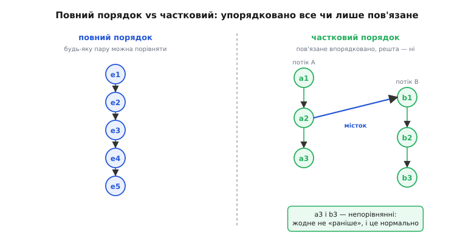

# 🧮 «Сталося-раніше»: частковий порядок, на якому стоїть модель пам'яті

Слово «видно» здається очевидним, аж поки не спитати, що воно точно означає для двох ядер. Один потік записав `data = 42`. Другий потім читає `data`. Побачить він 42 чи стару нулівку? «Потім» — за чиїм годинником? Якби існував один спільний годинник, до якого всі ядра звіряються з наносекундною точністю, відповідь була б проста: подивись, чий запис за часом раніший. Але такого годинника немає — а точніше, він є, проте на нього не можна спиратися. Кожне ядро має власний конвеєр, власний буфер запису, власний кеш; «одночасність» на рівні транзисторів розмита, і два записи, що фізично сталися з різницею в один такт, різні ядра можуть побачити в різному порядку. Тому питання «що кому видно» не має відповіді, доки ми не збудуємо **власне, штучне поняття «раніше»** — не за фізичним часом, а за причинним зв'язком. Це поняття зветься **«сталося-раніше»** (англ. *happens-before*), і саме воно, а не годинник, визначає в C++, який запис яке читання може побачити.

Тут — про те, що це за відношення, **чому** воно неминуче виявляється **частковим** порядком, а не повним, як воно складається з двох цеглин (порядку всередині потоку й містка між потоками), і як із цих цеглин `release`/`acquire` вибудовує гарантію, що цілий пакет записів проступає назовні **разом**. І головне — чому без такого спільного часткового порядку саме слово «видно» лишається невизначеним, а програма з ним — просто зламаною.

## Спершу — навіщо взагалі порядок, а не годинник

Природна перша думка: візьмімо фізичний час. У кожної події (запис, читання) є момент на світовому годиннику; хто раніший за часом, той і «стався раніше». Просто й звично — і саме тому спокусливо. Але ця модель ламається об залізо, і ламається принципово.

Причина не в тому, що годинники неточні (їх можна синхронізувати досить добре). Причина глибша: **на різних ядрах порядок двох записів об'єктивно різний залежно від того, звідки дивитися**. Ядро A випустило два записи, у різні комірки, в порядку X, потім Y. Ці записи пройшли крізь буфер запису, крізь мережу когерентності [кешів](book:programming/cache-coherence), і до ядра B добулися — цілком легально — у порядку Y, потім X. Не тому, що щось зламалося: буфер має право проштовхувати записи не в тому порядку, у якому їх туди поклали, а конвеєр — виконувати команди [позачергово](book:programming/out-of-order-execution). Тепер уявімо ще ядро C, яке дивиться з іншого боку тієї ж мережі — і бачить, можливо, третій порядок. Спитати «який із двох записів стався раніше **насправді**» — все одно що спитати, яка з двох блискавок ударила перша для двох спостерігачів на різних краях поля: відповідь залежить від спостерігача, а спільної, від усіх незалежної, немає.

> 🔧 **Навіщо це.** Саме тому не можна налагоджувати паралельний баг міркуванням «ну цей рядок виконується раніше за той». «Раніше» без встановленого причинного зв'язку — беззмістовне слово, і код, побудований на такому «раніше», зрідка й невідтворно віддає сміття саме на багатоядерному залізі, тимчасом як на одному ядрі працює бездоганно. Формалізм happens-before — це рівно той інструмент, що каже, коли «раніше» справді щось означає, а коли це ілюзія.

Отже, спиратися на фізичну одночасність не можна. Вихід, який знайшли ще в теорії розподілених систем, а потім перенесли в модель пам'яті процесорів і мов, — **відмовитися від глобального часу зовсім** і будувати порядок лише там, де між подіями є **причинний зв'язок**, який машина зобов'язується поважати. Дві події, між якими такого зв'язку немає, лишаються **непорівнянними** — про них просто не можна сказати, котра «раніше», і, що важливо, цього й **не треба**. Ось звідки береться слово «частковий»: упорядковано не все, а лише пов'язане.

Історично це поняття прийшло не з процесорів. Ще 1978 року Леслі Лемпорт (Leslie Lamport) у праці «Time, Clocks, and the Ordering of Events in a Distributed System» показав, що в розподіленій системі відношення «сталося-раніше» задає саме **частковий** порядок подій — і що синхронізувати вузли можна без опертя на фізичний час, лише через причинність повідомлень. Робота стала однією з найцитованіших у всій інформатиці й отримала премію Дейкстри 2000 року — це усталений факт, не переказ. Модель пам'яті C++11 успадкувала цю саму ідею майже дослівно: атомарна операція — це те саме «повідомлення» між потоками, а `release`/`acquire` — акти його відправлення й отримання.

## Що таке частковий порядок — і чому саме він

Перш ніж будувати happens-before, варто чітко бачити, що таке частковий порядок узагалі, бо вся модель пам'яті — це рівно один такий порядок, і всі її дивацтва випливають із його властивостей.

**Повний (лінійний) порядок** — це коли будь-які два різні елементи можна порівняти: для будь-яких a і b або a < b, або b < a. Числа на прямій такі: візьми два різні — одне завжди менше. Черга в касу така: для будь-яких двох людей видно, хто попереду.

**Частковий порядок** слабший: він теж упорядковує, але **дозволяє пари, які між собою непорівнянні** — ні a < b, ні b < a. Класичний образ — відношення «предок» у родоводі. Прадід — предок онука (порівнянні). Але двоє троюрідних братів? Жоден не предок другого — вони **непорівнянні**, хоч обидва цілком реальні особи в одному дереві. Порядок є, просто він не з'єднує **кожну** пару.

Щоб відношення заслуговувало назви «(строгий) частковий порядок», від нього вимагають рівно трьох властивостей — і кожна тут не формальна причепка, а вимога, без якої «раніше» втратило б сенс:

```
1. Іррефлексивність: НЕ (a < a)
   — подія не може статися раніше за саму себе.

2. Антисиметричність (для строгого — випливає): якщо a < b, то НЕ (b < a)
   — якщо A раніше за B, то B не може бути раніше за A;
     двобічного «раніше» не буває, інакше це замкнене коло причин.

3. Транзитивність: якщо a < b і b < c, то a < c
   — якщо A раніше за B, а B раніше за C, то A раніше за C.
     Причинність передається ланцюгом.
```

Третя властивість, **транзитивність**, — це двигун усієї конструкції; саме на ній тримається головна практична гарантія `release`/`acquire`, і до неї ми повернемося. А поки — головне питання: чому happens-before **мусить** бути частковим, а не повним? Чому не оголосити просто: усі події всіх потоків шикуються в один довгий ряд?

Тому що **повний порядок був би брехнею про залізо**. Оголосити, що для будь-яких двох записів у різних потоках один завжди «раніший», означало б пообіцяти читачеві, що цей порядок узгоджений і видимий усім однаково. А ми щойно бачили: два незалежні записи на різних ядрах різні спостерігачі бачать у різному порядку, і змусити залізо тримати єдиний узгоджений ряд **для всіх** доступів — це саме те, що коштує повного бар'єра пам'яті на кожній операції. Модель пам'яті свідомо цього **не** вимагає: вона впорядковує лише те, що ви **попросили** впорядкувати (через синхронізацію), а решту лишає непорівнянною — і саме тому дозволяє залізу бігти швидко. Частковість тут — не недосконалість, а **точна межа обіцянки**: рівно стільки порядку, скільки ви оплатили синхронізацією, ні краплі більше.


*Повний порядок (ліворуч) шикує всі події в один ряд — будь-яку пару можна порівняти. Частковий (праворуч) з'єднує лише причинно пов'язане: усередині кожного потоку події впорядковані, а між потоками — тільки там, де є місток синхронізації. Дві події з різних потоків **поза** містком лишаються непорівнянними, і це нормально: про них не треба знати, котра раніша.*

## Перша цеглина: sequenced-before — порядок усередині потоку

Happens-before складають із двох простіших відношень. Перше живе **всередині** одного потоку й зветься **sequenced-before** («впорядковано-перед»).

Тут усе інтуїтивно, бо це і є той порядок, у якому ви пишете код і звикли думати. Якщо в межах одного потоку обчислення A стоїть перед обчисленням B у порядку виконання програми, то A **sequenced-before** B. Запис `data = 42;` sequenced-before наступний рядок `ready.store(true, release);` — просто тому, що в одному потоці перше йде перед другим. Це відношення — теж частковий порядок (усередині потоку деякі дрібні підобчислення можуть бути невпорядковані між собою, звідси «частковий», але для нашої мети досить бачити його як «порядок рядків у потоці»).

Ключова властивість, заради якої sequenced-before взагалі існує як гарантія: **у межах одного потоку машина зобов'язана поводитися так, ніби дії йшли саме в цьому порядку**. Це те саме [правило «ніби»](book:programming/as-if-rule) — компілятор і процесор вільно все переставляють усередині, але **видимий цим потоком** результат мусить бути такий, наче порядок збережено. Тому в однопотоковій програмі sequenced-before — це вся правда про порядок, і більше нічого не треба.

Але — і це критично — sequenced-before **не перетинає межу потоку**. Він каже, що для **самого** потоку A `data` записано перед `ready`. Він **нічого** не обіцяє про те, у якому порядку ці записи побачить потік B. Для стороннього ока порядок усередині чужого потоку не гарантований зовсім — рівно тому, що правило «ніби» захищає лише **власний** погляд потоку. Ось чому одного sequenced-before для міжпотокового обміну катастрофічно замало: він упорядковує події лише по свій бік межі.

## Друга цеглина: synchronizes-with — місток між потоками

Щоб порядок перетнув межу потоку, потрібне друге відношення — **synchronizes-with** («синхронізується-з»). Це вже **міжпотокове** ребро, і будує його рівно **одна** конкретна подія: успішна пара `release`-запис ↔ `acquire`-читання над **тією самою** атомарною змінною.

Правило точне, і кожне слово в ньому важить: **атомарна операція A, що виконує `release`-запис у змінну M, synchronizes-with атомарна операція B, що виконує `acquire`-читання тієї ж M і зчитує значення, яке записала саме A** (або значення з її релізної послідовності — про це нижче). Розберімо, чому саме так:

- **«тієї ж M»** — місток тягнеться через конкретну спільну змінну-синхронізатор. Реліз в одну змінну не синхронізується з захопленням іншої; канал прив'язаний до комірки.
- **«зчитує значення, яке записала A»** — місток виникає **лише за фактом спостереження**. Поки `acquire`-читання не побачило значення від `release`-запису, ребра **немає**. Синхронізація — це не намір, а доконана подія обміну: одне ядро **справді** побачило те, що поклало інше.
- **`release` з одного боку, `acquire` з другого** — обидва напівбар'єри мусять бути на місці. Реліз без відповідного захоплення (чи навпаки) ребра не дає: місток однобічний в'яжеться з двох половинок, і бракує однієї — немає містка.

Ось чому пара `release`/`acquire` — не просто «прапорець із бар'єром», а буквально **єдиний спосіб провести причинну лінію між двома потоками** в цій моделі. Атомарна змінна тут — точка стику: місце, де порядок одного потоку зчіплюється з порядком іншого.


*Дві цеглини разом. Вертикальні стрілки — sequenced-before усередині кожного потоку (порядок рядків). Одна діагональна — synchronizes-with: вона виникає в мить, коли `acquire`-читання споживача бачить значення `release`-запису виробника. Тільки ця діагональ перетинає межу потоків; без неї два стовпчики подій ніяк не пов'язані.*

## Складання: happens-before як зшивання цеглин

Тепер найголовніше — як із двох відношень постає одне. Означення happens-before пряме:

```
A happens-before B, якщо:
   • A sequenced-before B            (в одному потоці), АБО
   • A inter-thread happens-before B (через міжпотокові містки).

А inter-thread happens-before — це будь-який ланцюг-конкатенація з
   sequenced-before  →  synchronizes-with  →  sequenced-before  →  …
тобто відрізки порядку всередині потоків, зшиті містками між ними.
```

Іншими словами: **happens-before — це транзитивне замикання об'єднання sequenced-before і synchronizes-with**. Ви можете йти вздовж порядку в одному потоці (sequenced-before), перестрибнути в інший потік по містку (synchronizes-with), знову йти вздовж порядку там — і будь-який такий пройдений шлях означає «A сталося-раніше B». А оскільки це замикання транзитивне за побудовою, воно автоматично строгий частковий порядок: іррефлексивний, антисиметричний (двобічних причинних кіл модель забороняє) і транзитивний.

І тут спрацьовує та сама транзитивність, заради якої все затівалося. Простежмо ланцюг у нашій передачі даних крок за кроком:

**Ситуація:** виробник пише `data = 42`, тоді `buf[i] = x`, тоді `ready.store(true, release)`. Споживач крутить `while(!ready.load(acquire)){}`, побачив `true`, читає `use(data)` і `buf[i]`.

```
(1) data = 42            sequenced-before  ready.store   [в потоці-виробнику]
(2) buf[i] = x           sequenced-before  ready.store   [там само]
(3) ready.store(release) synchronizes-with ready.load     [місток: load побачив true]
(4) ready.load(acquire)  sequenced-before  use(data)      [в потоці-споживачі]

Транзитивність зшиває (1)+(3)+(4):
    data = 42  happens-before  use(data)          ✓
І так само (2)+(3)+(4):
    buf[i] = x happens-before  read(buf[i])        ✓
```

Ось воно. Один-єдиний місток synchronizes-with на прапорці `ready` — і транзитивність **безкоштовно** протягує причинний зв'язок від **кожного** запису, що стояв перед релізом, до **кожного** читання, що стоїть після захоплення. Не треба синхронізувати `data` і `buf` окремо; вони не атомарні зовсім. Реліз «замкнув» усе, що sequenced-before нього, захоплення «відкрило» усе, що sequenced-before після нього, а місток між ними зшив два ланцюги в один порядок. **Цілий пакет записів проступає назовні разом** — саме тому, що happens-before транзитивний.

> 🔧 **Навіщо це.** Це і є теоретична причина, чому один атомарний прапорець безпечно передає між потоками цілий буфер даних — фундамент кожної неблокувальної (lock-free) черги чи кільцевого буфера. Продюсер публікує елемент release-записом індексу; консюмер підхоплює acquire-читанням; транзитивність happens-before гарантує, що весь вміст елемента, записаний **до** публікації індексу, консюмер побачить готовим. Без цієї властивості довелося б синхронізувати кожне поле окремо — і жодна lock-free структура не була б ні швидкою, ні коректною.

## Навіщо все це: happens-before визначає, що читання **бачить**

Дотепер happens-before виглядав як абстрактна алгебра ребер. Тепер — головна віддача, заради якої ця алгебра існує. Модель пам'яті використовує цей частковий порядок для однієї конкретної, украй практичної мети: **визначити, яке значення читання має право побачити**.

Правило коротке: **читання бачить той запис, що happens-before нього** (а не перекритий пізнішим таким записом). Якщо `data = 42` happens-before `use(data)` — читач **зобов'язаний** побачити 42, а не стару нулівку. Ребро happens-before — це і є та гарантія видимості: воно перетворює «десь колись записали» на «ти це побачиш». Немає ребра — немає гарантії; читач може побачити будь-що.

І звідси випливає найсуворіша частина всієї моделі — те, як C++ карає за **відсутність** порядку. Означимо два поняття, які стандарт бере дослівно:

- Два доступи **конфліктують**, якщо вони чіпають ту саму комірку пам'яті й **хоча б один із них — запис**. (Два читання не конфліктують — читати одне й те саме одночасно безпечно.)
- Програма має **гонку даних** (*data race*), якщо в ній є два конфліктні доступи, і **жоден із них не happens-before другий**, і вони не обидва атомарні, і виконуються вони різними потоками.

А тепер вирок, який робить усе це не академічним, а життєво важливим: **гонка даних — це невизначена поведінка** ([undefined behavior](book:programming/undefined-behavior)). Не «прочитаєш старе значення», не «інколи зламається» — а формально **вся програма** втрачає визначений сенс: компілятор мав право припускати, що гонок немає, і на цьому припущенні побудував увесь свій оптимізований код.

Дозвольте показати, чому інакше й **не могло** бути, — бо це і є та першопричина, з якої ми почали. Модель пам'яті мусить якось відповісти на питання «що бачить читач?». Вона відповідає єдиним способом, який має сенс на реальному залізі: «те, що happens-before нього». Але що робити з парою конфліктних доступів, між якими **немає** ребра happens-before? Сказати «читач бачить старе»? Неправда — на іншому ядрі побачить нове. Сказати «бачить нове»? Так само неправда з іншого боку. Сказати «бачить одне з двох»? Тоді значення недетерміноване, а з нього далі росте недетермінована програма. **Будь-яка** конкретна відповідь була б брехнею принаймні для одного спостерігача — бо, як ми бачили, без причинного містка об'єктивного порядку двох записів просто **не існує**. Єдине чесне, що лишається моделі, — оголосити таку ситуацію **поза межами визначеного**: якщо ти не провів причинну лінію, я не можу сказати, що ти побачиш, і не буду вдавати, що можу.


*Happens-before — це і є визначення видимості. Угорі: ребро від запису до читання (проведене синхронізацією) робить значення **визначеним** — читач бачить записане. Унизу: два конфліктні доступи без жодного ребра між ними — модель не може сказати, що видно, бо об'єктивного порядку тут немає; C++ оголошує це гонкою даних і невизначеною поведінкою. «Видно» має сенс **лише** там, де є happens-before.*

Ось чому вся конструкція неминуча, а не забаганка комітету. Без спільного часткового порядку поняття «видно/не видно» **буквально невизначене** — не «складне», а беззмістовне, як «ліворуч» без спостерігача. Happens-before — це той мінімальний штучний порядок, який робить питання видимості осмисленим: там, де ребро є, відповідь однозначна для всіх; там, де його нема, відповіді нема ні для кого, і чесна модель це визнає, а не вигадує. `std::atomic` з його `release`/`acquire` — це рівно інструмент, яким програміст **проводить ці ребра** там, де вони йому потрібні, і лишає решту непорівнянною, щоб не платити за порядок, якого не просив.

## Тонкість про запас: релізна послідовність

Одне уточнення, без якого картина сильно спрощена, а на практиці спіткнешся. Місток synchronizes-with виникає, коли `acquire`-читання бачить значення `release`-запису. Але що, як **між** релізом і нашим захопленням інші потоки встигли зробити ще кілька атомарних read-modify-write над тією ж змінною (скажімо, кілька `fetch_add`)? Наш `acquire` тоді бачить уже **не** те число, що поклав початковий `release`, а пізніше. Чи розривається місток?

Ні — і рятує це поняття **релізної послідовності** (*release sequence*). Ланцюг атомарних read-modify-write, що йдуть один за одним від початкового `release`-запису над змінною, вважається його **продовженням**: `acquire`, який побачив будь-яку ланку цього ланцюга, синхронізується **з початковим релізом**, а отже, отримує всю його причинну спадщину — всі записи, що стояли перед тим релізом. Без цього правила лічильники посилань і черги, де кілька потоків штовхають ту саму атомарну змінну, не працювали б: місток рвався б від першого-ліпшого чужого інкремента. Релізна послідовність зшиває ланцюг у єдиний канал, і транзитивність happens-before знову протягує пакет даних до кінця.

Це той рівень, на якому формалізм перестає бути прикрасою й починає рятувати конкретний код: варто лишень покластися на «я побачив прапорець, отже, дані готові» без розуміння, що саме релізна послідовність і транзитивність це забезпечують, — і перший же складніший сценарій із кількома писачами дасть баг, якого на одному ядрі ніколи не побачиш.

Отже, «сталося-раніше» — не метафора часу, а точний **частковий** порядок, зшитий із двох цеглин: sequenced-before упорядковує події всередині потоку, synchronizes-with перекидає причинний місток між потоками через пару `release`/`acquire`, а транзитивність замикання протягує зв'язок крізь ланцюги й доставляє цілі пакети записів разом. Частковим цей порядок є не з бідності, а з чесності: він упорядковує рівно те, що ви оплатили синхронізацією, і лишає решту непорівнянною, дозволяючи залізу бігти. І вся ця будова служить одному — зробити слово «видно» визначеним: де є ребро happens-before, читання однозначно бачить записане для всіх; де ребра нема, об'єктивного порядку не існує, тож C++ оголошує це гонкою даних і невизначеною поведінкою — не з суворості, а тому, що будь-яка інша відповідь була б брехнею бодай для одного ядра.
