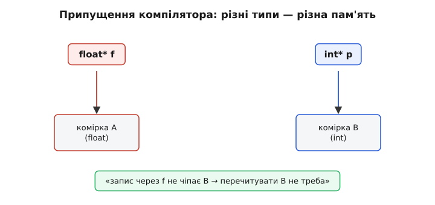
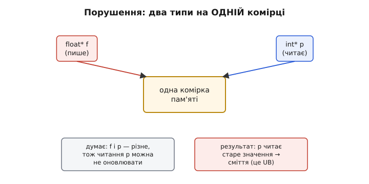
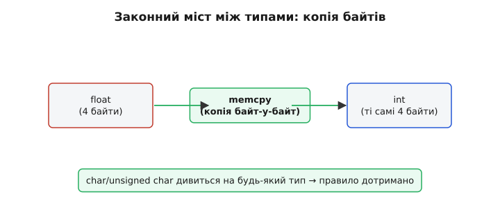

# Суворе аліасування: чому один і той самий байт не можна читати двома типами

Аліасування (англ. *aliasing*, від *alias* — «інакше кажучи», «під іншим ім'ям») — це коли до однієї комірки пам'яті ведуть два різні імені: два покажчики дивляться на ту саму адресу. Слово «суворе» (англ. *strict*) додає до цього одне жорстке обмеження мов C і C++: компілятор має **право припускати**, що два покажчики **різних типів** ніколи не дивляться на ту саму комірку. Звучить як дрібна формальність — а насправді це правило тихо переписує ваш код за спиною, і той, хто про нього не знає, рано чи пізно отримує баг, від якого волосся стає дибки: код бездоганний на вигляд, компілюється без жодного попередження, а працює неправильно — і то лише під оптимізацією.

Мотивація тут з самого початку практична. Компілятор постійно намагається [зробити код швидшим](topic:programming/compiler-optimizations): не бігати зайвий раз у повільну пам'ять, тримати значення в регістрі, переставляти доступи. Але щоб щось прибрати чи переставити, він мусить бути **впевнений**, що це нічого не зламає. Головна перешкода до такої впевненості — саме аліасування: якщо два покажчики можуть вести на одну комірку, то запис через один здатен непомітно змінити те, що читають через другий, і жодну оптимізацію робити не можна. Суворе аліасування дає компіляторові презумпцію: «покажчики різних типів на одну комірку не дивляться» — і цим розв'язує йому руки.

### Звідки взагалі проблема: запис «крізь спину»

Уявімо звичну функцію, яка щось лічить у циклі й час від часу оновлює лічильник за покажчиком:

```c
void scale(float* data, int n, int* counter) {
    for (int i = 0; i < n; i++) {
        data[i] *= 2.0f;
        *counter += 1;        // те саме *counter щоразу?
    }
}
```

Компілятор дуже хотів би прочитати `*counter` **один раз** у регістр, нарощувати регістр у циклі й записати назад лише наприкінці — це помітно швидше, ніж лізти в пам'ять на кожному оберті. Але постає питання: а раптом `counter` вказує кудись усередину масиву `data`? Тоді запис `data[i] *= 2.0f` міняв би й `*counter`, і кешувати його в регістрі було б помилкою.

Ось тут і вмикається суворе аліасування. `data` має тип `float*`, `counter` — `int*`. Типи **різні**, тому за правилом компілятор має право твердо вважати: ці два покажчики на одну комірку не дивляться. Отже, запис у `data[i]` гарантовано не чіпає `*counter` — і лічильник можна сміливо тримати в регістрі. Правило перетворюється на дозвіл оптимізувати.


*Два покажчики різних типів компілятор вважає такими, що дивляться на **різну** пам'ять. Звідси висновок: запис через `float* f` не може зачепити комірку, яку читають через `int* p`, — а отже, `int` можна не перечитувати, а тримати в регістрі. Саме це припущення й називають суворим аліасуванням.*

> 🔧 **Навіщо це.** Це правило — не примха теоретиків, а те, завдяки чому цикли з покажчиками взагалі швидкі. Без нього компілятор мусив би на кожному записі через будь-який покажчик припускати найгірше — що зачеплено все, до чого веде будь-який інший покажчик, — і перечитувати все з пам'яті щоразу. Суворе аліасування дозволяє йому за типами зрозуміти, що чого не чіпає, і викинути гори зайвих читань. Ви платите за цю швидкість однією умовою: не обманювати компілятор щодо типів.

### Як воно ламається: type punning

Проблема виникає тієї миті, коли ви **навмисне** дивитеся на одну й ту саму пам'ять двома різними типами. Класичний приклад — так званий каламбур типів (англ. *type punning*): узяти байти числа `float` і подивитися на них як на `int`, щоб, скажімо, поколупатися в бітах представлення. Спокуса зробити це «в лоб» — через приведення покажчика:

```c
float x = 1.0f;
int   bits = *(int*)&x;      // дивимось на байти float як на int — UB!
```

Виглядає невинно: ми взяли адресу `x`, сказали «вважай це адресою `int`» і прочитали. Багато де воно навіть «спрацює». Але за буквою стандарту це **порушення** суворого аліасування — читати `float` через `int`-lvalue не дозволено, а порушення правила означає [невизначену поведінку](topic:programming/undefined-behavior): компілятор більше нічого вам не винен. Він мав повне право вважати, що `int`-покажчик і `float`-змінна не перетинаються, — а ви його на цьому обманули.

Наслідок буває підступніший за просто «неправильне число». Оскільки компілятор **упевнений**, що запис через один тип не чіпає інший, він може переставити або викинути операції, спираючись на цю впевненість:

```c
void trick(float* f, int* p) {
    *f = 1.0f;               // (1) пишемо float
    *p = 42;                 // (2) пишемо int — «іншу» комірку
    // компілятор: (1) і (2) незалежні → їх можна переставити
}
```

Якщо `f` і `p` насправді ведуть на **одну** адресу (ви це підлаштували приведенням), то результат залежить від того, який запис ляже останнім, — а порядок вирішує оптимізатор, не ви. Під `-O0` вийде одне, під `-O2` — інше. Отримуємо найгидкіший різновид бага: «працює в debug, ламається в release» — точно як із [пропущеним `volatile`](topic:programming/volatile), тільки причина інша.


*Коли `float* f` і `int* p` насправді ведуть на **одну** комірку, а ви це приховали приведенням, компілятор усе одно вважає їх незалежними. Він не оновлює читання через `p`, переставляє записи на власний розсуд — і повертає значення, якого в пам'яті ніколи не було. Формально це невизначена поведінка: правило суворого аліасування порушено.*

Найпідступніше, що компілятор при цьому **не зобов'язаний попереджати**. Часом `-Wstrict-aliasing` щось ловить, але покладатися на це не можна: багато порушень проходять тихо, і ви дізнаєтеся про них, лише коли програма поводиться безглуздо на новому рівні оптимізації чи на новій версії компілятора.

### Що саме дозволяє стандарт

Правило описане в стандартах C (розділ 6.5 у C99; ті самі рамки були ще в C90, розділ 6.3) і майже дослівно повторене в C++. Суть: значення об'єкта дозволено читати через lvalue лише кількох сумісних типів — грубо кажучи, через **той самий** тип, через сумісні знакові/беззнакові варіанти того самого цілого, а решта — заборонено. Термін «**ефективний тип**» (англ. *effective type*), який запровадив саме C99 (у C90 казали «оголошений тип»), означає той тип, яким комірка була востаннє записана; читати її іншим, несумісним типом — і є порушенням. *(Уточнення «ефективний тип» проти «оголошений» історично з'явилося, щоб дати визначений тип навіть пам'яті з `malloc`, у якої оголошеного типу немає взагалі.)*

Але є один рятівний виняток, без якого низькорівневе програмування було б неможливе.

**Символьні типи бачать усе.** Через `char`, `signed char`, `unsigned char` (а в C++20 — і `std::byte`) дозволено дивитися на байти **будь-якого** об'єкта. Логіка проста: символьний тип — це «сирий байт», а будь-яке значення в пам'яті і є послідовністю байтів. Тому серіалізація, копіювання, розбір буфера через `unsigned char*` — цілком законні; правило суворого аліасування на символьні типи не поширюється. Важливо, що виняток **односторонній**: `char*` може дивитися на `float`, але з цього **не** випливає, що `float*` може дивитися на щось, записане як `char` чи `int`.

### Як робити каламбур типів правильно

Раз пряме приведення покажчика — це UB, як тоді законно подивитися на байти `float` як на `int`? Є три перевірені шляхи.

**Через `memcpy` — портативно й безпечно.** Найнадійніший спосіб — просто **скопіювати байти** з однієї змінної в іншу:

```c
float x = 1.0f;
int   bits;
memcpy(&bits, &x, sizeof bits);   // копія байт-у-байт → правило дотримано
```

Здавалося б, зайве копіювання ціною швидкості. Але тут криється чудова несподіванка: сучасні компілятори **впізнають** цей шаблон і на оптимізації перетворюють `memcpy` фіксованого розміру на звичайне переставлення між регістрами — без жодного справжнього виклику функції й без копії в пам'яті. Тобто ви пишете безпечний, стандартний код, а на виході отримуєте рівно ту саму єдину машинну інструкцію, що й від небезпечного приведення. `memcpy` тут — це не «повільно, зате правильно», а «правильно **й** так само швидко».


*Законний міст між типами — копія байтів через `memcpy`. Вона законна, бо копіювання йде на рівні символьних байтів, а їм дозволено дивитися на будь-який тип. Компілятор упізнає цей шаблон і зводить `memcpy` фіксованого розміру до простого переставлення в регістрі — безпечно й без втрати швидкості.*

**Через `std::bit_cast` — сучасно й виразно (C++20).** У новому C++ для точно цього завдання є окремий інструмент — він бере байти одного типу й повертає значення іншого того самого розміру, з тим самим бітовим представленням, і робить це вже без ручного `memcpy`:

```cpp
int bits = std::bit_cast<int>(x);   // C++20: явно й безпечно
```

Це той самий `memcpy` по суті, але висловлений як намір «переінтерпретувати біти», а не як копіювання, — читабельніше й важче помилитися.

**Через `union` — але обережно, і по-різному в C і C++.** Спокусливо покласти `float` і `int` в об'єднання й писати одне поле, а читати інше. Тут криється важлива відмінність між мовами, на якій легко спіткнутися: у **C** читати не те поле, яке щойно записали, — дозволено й є легальним способом каламбуру; у **C++** — це формально невизначена поведінка (стандарт вимагає читати лише **активне** поле). Тому `union` як засіб type punning надійний у C, а в C++ переносити його не варто — там беруть `std::bit_cast` або `memcpy`.

> 🔧 **Навіщо це.** У прошивці type punning виринає постійно: розібрати число з мережевого буфера, дістати біти представлення `float` для швидкого наближеного обчислення, зчитати сирі байти з апаратного [регістра](topic:programming/memory-mapped-io). Просте правило вбереже від годин відлагодження: **ніколи не переінтерпретуйте тип приведенням покажчика** (`*(int*)&x`). Хочете подивитися на ті самі байти іншим типом — беріть `memcpy`, а в новому C++ — `std::bit_cast`. Виглядає багатослівніше, коштує рівно стільки ж, а UB не буде.

### Чому не «просто вимкнути це правило»

Логічне запитання: якщо суворе аліасування таке підступне, чому не викинути його? Технічно можна — у GCC і Clang є прапорець `-fno-strict-aliasing`, і, наприклад, ядро Linux свідомо збирають саме з ним, бо в системному коді каламбурів забагато. Але це не безкоштовно: ви **відбираєте** в компілятора цілий пласт оптимізацій. Без гарантії «різні типи — різна пам'ять» він на кожному записі через покажчик мусить припускати, що міг зачепити будь-що іншого типу, — і повертає в код гори перечитувань, які інакше викинув би. Для критичних до швидкості циклів це відчутна втрата.

Тому загальний підхід інший: правило лишають увімкненим (як воно й типово під `-O2`), а свій код пишуть так, щоб його не порушувати, — через `memcpy`/`bit_cast`. Так ви маєте і швидкість, і коректність. *(Історія тут повчальна: масові баги від суворого аліасування почалися саме тоді, коли [GCC на межі 1998–1999 років почав всерйоз використовувати це правило для оптимізацій](topic:programming/strict-aliasing/hist-gcc-strict-aliasing.md) — код, що роками «працював», раптом ламався на новому компіляторі, хоча ніколи не був коректним за стандартом.)*

Варто розрізняти два близькі, але різні поняття. Суворе аліасування — про те, що компілятор **вважає розділеним за замовчуванням** (різні типи). Є й зворотний бік — коли покажчики **однакового** типу таки можуть перетинатися, і компілятор мусить це враховувати; там на допомогу приходить обіцянка [`restrict`](topic:programming/strict-aliasing/proj-restrict.md) («цей покажчик — єдиний шлях до цієї пам'яті»). Ширше про аліасування покажчиків загалом, поза одним лише типовим правилом, — у сусідній темі [аліасинг покажчиків і UB](topic:programming/pointer-aliasing).

Ще одна тонкість, про яку легко забути: навіть законний `memcpy` між типами передбачає, що байти одного типу утворюють **дійсне** значення іншого. Зазвичай для чисел так і є, але з [вирівнюванням](topic:programming/memory-alignment) і граничними бітовими представленнями треба бути уважним — переінтерпретація байтів не творить значення з нічого, вона лише інакше **читає** ті самі біти.

### Підсумок у трьох реченнях

Суворе аліасування — це право компілятора вважати, що покажчики різних типів не дивляться на одну комірку, і саме воно дозволяє йому агресивно оптимізувати доступ до пам'яті. Порушити його — подивитися на ту саму пам'ять несумісним типом через приведення покажчика — означає впасти в невизначену поведінку, де код тихо ламається під оптимізацією. Тому будь-яку переінтерпретацію типів роблять через символьні байти: `memcpy` (портативно, у C і C++) або `std::bit_cast` (виразно, у C++20) — безпечно й без втрати швидкості.
