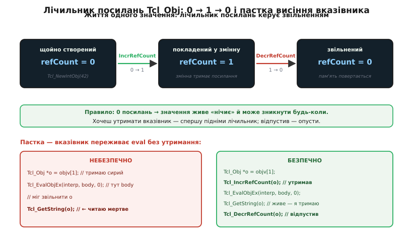
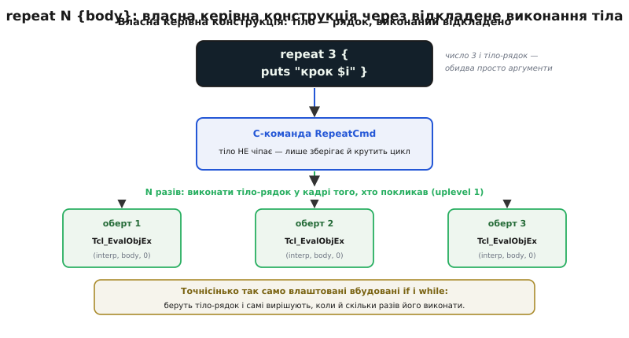

# ⚙️ Вбудувати тлумач і дати йому власні команди

## Задача

У вас є прошивка чи велика програма на C — скажімо, контролер стенда, що ганяє реле, читає давачі, крутить моторчик. Робить вона це чудово, але кожен новий сценарій випробування вимагає перекомпіляції: змінив послідовність «увімкни живлення → зачекай → зміряй струм → вимкни» — і знову збирай, знову прошивай, знову чекай. Інженер біля стенда хоче іншого: набрати сценарій **текстом**, згодувати його залізу й побачити результат — без жодної збірки. Йому потрібна не нова прошивка, а **консоль**, у якій живуть команди його приладу і звичайні цикли з умовами.

Саме це дає вбудований тлумач. Ми беремо готову крихітну мову, вставляємо її всередину нашої C-програми як бібліотеку, і — головне — **навчаємо її своїх команд**: `led`, `relay`, `measure`, `wait`. Після цього над нашим C-кодом з'являється повноцінна скриптова мова, у якій `measure` — це виклик нашої функції, а `while` і `if` уже вбудовані. Розберімо цей цикл до дна: як створити тлумач, як згодувати йому рядок, як забрати відповідь, як прив'язати C-функцію під іменем команди, як правильно розібрати аргументи — і, найтонше, як зробити **власну керівну конструкцію**, що приймає тіло й виконує його відкладено, точнісінько як вбудований `if`.

Це не переказ документації, а карта тих місць, де новачок обов'язково розіб'є собі лоба: час життя значень і лічильник посилань, мерехтіння типів у гарячому циклі, безпека виконання чужого рядка. Кожну пастку покажемо на робочому C-коді прошивки, а не на псевдокоді.

## Ідея: тлумач — це об'єкт, команда — це функція за іменем

Уся модель тримається на двох простих думках, і якщо їх схопити, решта стає очевидною.

Перша: **тлумач — це звичайний C-об'єкт**, який ви створюєте, тримаєте в руках як вказівник і врешті знищуєте. Він має стан: словник відомих команд, таблицю змінних, стек викликів, «результат останньої дії». Ви створюєте його викликом, згодовуєте йому рядки коду іншими викликами, а відповідь читаєте з його результату. Ніякої магії — це бібліотека, що поводиться як будь-яка інша, тільки всередині в неї сидить мова.

Друга: **команда мови — це просто ім'я, прив'язане до C-функції**. Коли тлумач розбирає рядок і бачить перше слово `measure`, він шукає це слово у своєму словнику команд, знаходить там вказівник на вашу C-функцію й кличе її, передавши їй решту слів рядка як аргументи. Вбудований `set` влаштований точно так само — це ім'я `set`, прив'язане до C-функції всередині бібліотеки. Між «вбудованою» командою й «вашою» різниці немає **ніякої**: обидві — рядки словника, що вказують на код. Ось чому розширити мову так дешево — ви просто додаєте ще один запис у той самий словник.

З цих двох думок випливає весь цикл: створи тлумач (з'явився словник із вбудованими командами) → допиши в словник свої команди (тепер мова знає `measure`) → давай тлумачу рядки (він розбирає їх і кличе потрібні C-функції) → читай результат. Далі — код, що робить кожен із цих кроків насправді.

## Робочий C: повний цикл вбудовування

Почнімо з кістяка — створити тлумач, виконати рядок, забрати відповідь, прибрати за собою. Це три виклики бібліотеки, і кожен робить рівно те, що обіцяє назва.

```c
#include <tcl.h>
#include <stdio.h>

int main(void) {
    Tcl_Interp *interp = Tcl_CreateInterp();   // 1. народити тлумач зі словником вбудованих команд

    // 2. згодувати рядок Tcl як код; повертає TCL_OK або TCL_ERROR
    int rc = Tcl_Eval(interp, "expr {40 + 2}");

    if (rc == TCL_OK) {
        const char *res = Tcl_GetStringResult(interp);   // 3. результат — завжди рядок
        printf("порахувало: %s\n", res);                 // друкує: порахувало: 42
    } else {
        // на помилці в результаті лежить текст помилки — теж читаємо як рядок
        printf("помилка: %s\n", Tcl_GetStringResult(interp));
    }

    Tcl_DeleteInterp(interp);   // 4. знищити тлумач, звільнити всю його пам'ять
    return 0;
}
```

Зверніть увагу на дрібницю, що виказує всю філософію мови: результат — **завжди рядок**, і на успіху (`42`), і на помилці (текст повідомлення). Тлумач не повертає вам «число» чи «об'єкт помилки» — він кладе у свій результат текст, а ви вирішуєте за кодом повернення (`TCL_OK`/`TCL_ERROR`), успіх це чи біда. Один канал відповіді, один тип відповіді. Про те, чому «завжди рядок» тут не коштує швидкості, — за мить, коли дійдемо до `Tcl_Obj`.

### Прив'язати власну команду

Тепер найцінніше — навчити мову нашого слова. Зареєструємо команду `led`, за якою стоїть наша апаратна дія. Ось повна, робоча реєстрація з правильним розбором аргументів:

```c
#include <tcl.h>
#include <string.h>

// уявна апаратна функція прошивки
extern void hw_set_led(int on);

// C-функція, що стане Tcl-командою "led".
// Сигнатура задана бібліотекою — міняти її не можна:
//   clientData — довільний вказівник, який ми передали при реєстрації (тут не треба);
//   interp     — тлумач, у чий результат ми кладемо відповідь чи помилку;
//   objc       — скільки слів у команді, ВКЛЮЧНО з іменем "led";
//   objv       — масив слів-значень; objv[0] — саме ім'я "led", objv[1] — перший аргумент.
static int LedCmd(void *clientData, Tcl_Interp *interp,
                  int objc, Tcl_Obj *const objv[]) {
    if (objc != 2) {                                  // чекаємо рівно 1 аргумент після імені
        // стандартний спосіб поскаржитися на кількість: сам складе гарне повідомлення
        Tcl_WrongNumArgs(interp, 1, objv, "on|off");
        return TCL_ERROR;
    }

    const char *arg = Tcl_GetString(objv[1]);         // беремо аргумент як рядок
    if (strcmp(arg, "on") == 0) {
        hw_set_led(1);
    } else if (strcmp(arg, "off") == 0) {
        hw_set_led(0);
    } else {
        // кладемо СВІЙ текст помилки в результат тлумача й сигналимо біду
        Tcl_SetObjResult(interp, Tcl_NewStringObj("led: чекав on або off", -1));
        return TCL_ERROR;
    }
    return TCL_OK;      // успіх; результат лишаємо порожнім
}

int main(void) {
    Tcl_Interp *interp = Tcl_CreateInterp();

    // прив'язати ім'я "led" до нашої C-функції; NULL — це clientData й deleteProc
    Tcl_CreateObjCommand(interp, "led", LedCmd, NULL, NULL);

    // тепер у будь-якому скрипті слово "led" кличе наш C-код:
    Tcl_Eval(interp, "led on");
    Tcl_Eval(interp, "for {set i 0} {$i < 3} {incr i} { led on; led off }");

    Tcl_DeleteInterp(interp);
    return 0;
}
```

Розберімо, що тут насправді відбувається, бо кожна деталь несе вагу.

**Сигнатуру диктує бібліотека.** Функцію `LedCmd` викликає не ваш код, а тлумач, коли зустріне слово `led` у скрипті. Тому її форма — `(void *, Tcl_Interp *, int, Tcl_Obj *const [])` — жорстко задана: тлумач знає лише цю форму й покличе саме так. Ви не викликаєте `LedCmd` самі — ви лише лишаєте на неї вказівник у словнику команд через `Tcl_CreateObjCommand`, а далі мова сама кличе її в потрібну мить. Це класичний **зворотний виклик** (callback): ваша функція живе у вашому коді, але смикає її чужий рушій.

**`objc` рахує ім'я команди.** У рядку `led on` слів два: `led` і `on`, тож `objc == 2`. Саме ім'я лежить в `objv[0]`, перший справжній аргумент — у `objv[1]`. Тому перевірка «рівно один аргумент» — це `objc != 2`, не `!= 1`. Ця «зайва одиниця» ловить новачків постійно.

**`Tcl_WrongNumArgs` — не дрібниця, а конвенція.** Замість ручного `"led: неправильна кількість"` ви кличете стандартну функцію, і вона складе повідомлення в тому ж форматі, що й уся мова: `wrong # args: should be "led on|off"`. Другий аргумент (`1`) каже, скільки перших слів `objv` показати в повідомленні як «правильний початок» — тут одне слово, ім'я команди. Користувач вашого стенда побачить помилку рівно такого вигляду, як від вбудованих команд, — і це не косметика, а повага до того, хто читатиме вивід посеред ночі.

**Помилку віддають через результат + `TCL_ERROR`.** Немає винятків, немає кодів у стилі errno. Ви кладете **текст** проблеми в результат тлумача через `Tcl_SetObjResult` і повертаєте `TCL_ERROR`. Мова підхопить це як помилку: спрацює `catch`, зупиниться скрипт, спливе повідомлення. Успіх — `TCL_OK`; якщо команда має щось повернути (наприклад, `measure` — число), вона так само кладе його в результат, тільки повертає `TCL_OK`.

> 🔧 **Навіщо це.** Ця пара «текст у результат + код повернення» — увесь протокол спілкування вашого C-коду з мовою. Команда `measure`, що читає давач, покладе виміряне число рядком у результат і поверне `TCL_OK` — і скрипт зможе написати `set t [measure temp]`, підхопивши це число у змінну. Команда, що наткнулася на зламаний давач, покладе в результат «давач не відповідає» й поверне `TCL_ERROR` — і сценарій зупиниться з ясним поясненням замість тихого сміття в даних. Один канал на відповідь і на біду — простий і надійний.

### Передати дані в обидва боки через `Tcl_Obj`

Аргумент прийшов не сирим `char *`, а як `Tcl_Obj *` — той самий подвійнопортовий об'єкт-значення, що всередині тримає й рядок, і кешовану розібрану форму. Це дає нам розбирати аргументи **за типом**, не колупаючи рядок руками. Скажімо, команда `pwm` хоче ціле число — шпаруватість від 0 до 255:

```c
extern void hw_set_pwm(int duty);

static int PwmCmd(void *cd, Tcl_Interp *interp,
                  int objc, Tcl_Obj *const objv[]) {
    if (objc != 2) {
        Tcl_WrongNumArgs(interp, 1, objv, "duty");
        return TCL_ERROR;
    }

    int duty;
    // розібрати аргумент як ціле; якщо це не число — САМА покладе помилку в результат
    if (Tcl_GetIntFromObj(interp, objv[1], &duty) != TCL_OK) {
        return TCL_ERROR;        // текст «expected integer but got …» уже в результаті
    }
    if (duty < 0 || duty > 255) {
        Tcl_SetObjResult(interp, Tcl_NewStringObj("pwm: шпаруватість поза 0..255", -1));
        return TCL_ERROR;
    }

    hw_set_pwm(duty);

    // повернути в скрипт фактично встановлене значення — теж через Tcl_Obj
    Tcl_SetObjResult(interp, Tcl_NewIntObj(duty));
    return TCL_OK;
}
```

Тут `Tcl_GetIntFromObj` робить дві речі одразу. Якщо аргумент — це `"128"`, вона розбирає його в машинне ціле й, за принципом подвійного подання, **кешує** розібране число прямо в об'єкті: наступний раз те саме значення дасть ціле безкоштовно. Якщо ж прийшло `"привіт"`, вона повертає `TCL_ERROR` і сама кладе в результат тлумача акуратне повідомлення `expected integer but got "привіт"` — вам лишається тільки прокинути `TCL_ERROR` нагору. Ви не пишете розбір числа вручну й не вигадуєте текст помилки — усе вже в бібліотеці, узгоджене з рештою мови.

Назад — так само: `Tcl_NewIntObj(duty)` створює **нове** значення-об'єкт із цілого, а `Tcl_SetObjResult` кладе його в результат. Скрипт напише `set d [pwm 128]` і дістане `128` у змінну. Дані течуть в обидва боки через один тип — `Tcl_Obj` — і жодного разу нам не довелося власноруч перетворювати число в текст чи навпаки.

Ось тут ховається перша серйозна пастка, і без неї картина брехлива.

## Пастка перша: час життя `Tcl_Obj` і лічильник посилань

Значення в Tcl нікуди не зникають самі по собі в зрозумілий момент — бо мова **не має збирача сміття**, який ходив би й прибирав непотрібне. Замість нього кожен `Tcl_Obj` носить у собі **лічильник посилань** (*reference count*): скільки місць у цю мить тримають на нього вказівник. Змінна тримає значення — плюс одиниця. Значення поклали в список — ще одиниця. Останній, хто відпускає посилання й опускає лічильник до нуля, тим самим наказує звільнити пам'ять. Це не автоматика — це дисципліна, яку тримаєте **ви** у своєму C-коді.

Правило коротке, і його варто закарбувати: **значення з нульовим лічильником — «нічиє», воно живе на ласці випадку й може зникнути будь-якої миті**. Свіжостворений об'єкт із `Tcl_NewIntObj` виходить із лічильником нуль — він поки нічий. Щойно ви віддаєте його кудись, хто «оприбутковує» посилання (той-таки `Tcl_SetObjResult` чи запис у змінну), лічильник підіймається, і об'єкт у безпеці. У прикладі `PwmCmd` усе гаразд саме тому: ми одразу віддали свіже число в результат, і воно не встигло побути безхазяйним.


*Життя значення — три стани. Свіжий `Tcl_Obj` виходить із лічильником 0 («нічий»). `Tcl_IncrRefCount` підіймає до 1 — значення прив'язане й у безпеці. `Tcl_DecrRefCount` опускає назад до 0 і звільняє пам'ять. Ліворуч унизу — типова смертельна помилка: сирий вказівник на аргумент переживає `eval`, під час якого значення могли звільнити, і подальше читання лізе в мертву пам'ять. Праворуч — як правильно: підняти лічильник перед `eval`, опустити після.*

Небезпека стає гострою, коли вказівник на значення має **пережити виконання чужого коду**. Ось чому: доки крутиться `Tcl_Eval` чи `Tcl_EvalObjEx`, усередині виконується скрипт, який робить із змінними що завгодно — переприсвоює, стирає, перебудовує. Значення, на яке ви тримали сирий вказівник, могло за цей час втратити всі посилання й **бути звільненим**. Ваш вказівник перетворюється на висячий (*dangling*) — він показує на пам'ять, яку вже повернули й, можливо, зайняли чимось іншим. Читання за ним — це [невизначена поведінка](book:programming/undefined-behavior): може «спрацювати» на стенді й упасти на польовому пристрої, може тихо віддати сміття замість числа.

Правильно — **утримати** значення на час небезпеки:

```c
static int RunTwiceCmd(void *cd, Tcl_Interp *interp,
                       int objc, Tcl_Obj *const objv[]) {
    if (objc != 2) {
        Tcl_WrongNumArgs(interp, 1, objv, "body");
        return TCL_ERROR;
    }

    Tcl_Obj *body = objv[1];
    Tcl_IncrRefCount(body);        // ← «це моє»: підняли лічильник, тепер eval його не звільнить

    int rc = Tcl_EvalObjEx(interp, body, 0);      // виконали тіло раз
    if (rc == TCL_OK) {
        rc = Tcl_EvalObjEx(interp, body, 0);      // і вдруге — body ГАРАНТОВАНО ще живий
    }

    Tcl_DecrRefCount(body);        // ← відпустили; якщо ми були останні — звільниться тут
    return rc;
}
```

Симетрія тут священна: скільки разів підняли лічильник, стільки й опустити, і опустити **на всіх шляхах виходу** — зокрема на помилкових. Забули `Tcl_DecrRefCount` — значення ніколи не звільниться, це витік пам'яті; у прошивці, що працює тижнями без перезапуску, витік по краплі з'їдає всю купу й валить пристрій. Опустили зайвий раз — звільнили те, що ще комусь потрібне, і знову висячий вказівник. Ця бухгалтерія посилань — плата за відсутність збирача сміття, і в C-коді, що вбудовує Tcl, вона ваша щоденна турбота.

> 🔧 **Навіщо це.** У прошивці стенда команда на кшталт `every 500 {measure temp}` мусить зберегти тіло `{measure temp}` і виконувати його раз на пів секунди **між** іншими скриптами. Це значення житиме довго й переживе безліч чужих `eval` — і якщо не підняти йому лічильник при збереженні, воно зникне з-під ніг, а таймер почне виконувати мертву пам'ять. Тут дисципліна посилань — не педантизм, а різниця між стендом, що працює місяцями, і загадковим падінням «раз на тиждень без причини», яке потім тижнями ловлять.

Є ще споріднений момент — **мерехтіння** (*shimmering*). Коли ваш C-код смикає одне й те саме значення то `Tcl_GetIntFromObj` (проси як число), то `Tcl_GetString` (проси як рядок), то знову як число, кешоване внутрішнє подання щоразу викидається й будується наново, бо місце в об'єкті лише під **одне**. У розборі аргументів це рідко болить — кожен аргумент зазвичай питають одним типом раз. Але якщо ви в гарячому циклі мільйон разів чергуєте два прочитання одного `Tcl_Obj`, мерехтіння з'їсть увесь виграш подвійного подання. Ліки прості: розберіть значення в потрібний C-тип **раз**, покладіть у звичайну C-змінну (`int`, `double`) і крутіть цикл уже над нею, а не над `Tcl_Obj`.

## Прийом: власна керівна конструкція

Тепер — найкрасивіше, те, заради чого варто було все затівати. У більшості мов `if`, `while`, `for` — це вбудований синтаксис, недоторканний, зашитий у граматику. Ви не можете додати свій `unless` чи `repeat`, бо парсер про них не знає. У Tcl усе інакше: керівні конструкції — це **звичайні команди**, яким передають тіло як рядок, і команда сама вирішує, коли й скільки разів це тіло виконати. Отже, **ви теж можете написати таку команду** — вона нічим не гірша за вбудований `if`.

Секрет — у **відкладеному виконанні**. Коли скрипт пише `repeat 3 { led on; led off }`, тіло `{ led on; led off }` приходить у нашу C-команду **невиконаним**, просто як текст усередині `Tcl_Obj`. Фігурні дужки в Tcl саме для цього: узяти шматок коду в один аргумент, **не чіпаючи** його. Наша команда дістає цей текст і виконує його стільки разів, скільки їй заманеться, — сама, у потрібну мить. Це і є вся суть керівної конструкції: не «обчислити аргументи, тоді викликатися», а «отримати код і розпоряджатися його виконанням».


*Власна керівна конструкція `repeat 3 {…}`. Число й тіло приходять у C-команду обидва як звичайні аргументи, тіло — невиконаним. Команда сама крутить цикл і N разів виконує тіло-рядок, причому **в кадрі того, хто її покликав** (як `uplevel 1`), — тож тіло бачить локальні змінні викликача. Точнісінько так влаштовані вбудовані `if` і `while`: беруть тіло-рядок і самі вирішують, коли й скільки разів його виконати. Межі між «вбудованим» і «своїм» тут немає.*

Ось робоча команда `repeat` — виконати тіло задану кількість разів:

```c
static int RepeatCmd(void *cd, Tcl_Interp *interp,
                     int objc, Tcl_Obj *const objv[]) {
    if (objc != 3) {                                  // repeat + число + тіло
        Tcl_WrongNumArgs(interp, 1, objv, "count body");
        return TCL_ERROR;
    }

    int count;
    if (Tcl_GetIntFromObj(interp, objv[1], &count) != TCL_OK) {
        return TCL_ERROR;                             // перший аргумент не число
    }

    Tcl_Obj *body = objv[2];
    Tcl_IncrRefCount(body);                           // утримуємо тіло на весь цикл

    int rc = TCL_OK;
    for (int i = 0; i < count; i++) {
        rc = Tcl_EvalObjEx(interp, body, 0);          // виконати тіло в кадрі викликача
        if (rc == TCL_BREAK) { rc = TCL_OK; break; }  // тіло сказало break — чемно вийти
        if (rc == TCL_CONTINUE) { rc = TCL_OK; continue; }
        if (rc != TCL_OK) break;                      // помилка чи return — припинити цикл
    }

    Tcl_DecrRefCount(body);
    return rc;
}
```

Придивімося до тонкощів, бо тут кожен рядок відповідає на «а що, як…».

**Тіло виконується в кадрі викликача.** `Tcl_EvalObjEx(interp, body, 0)` — прапорець `0`, не `TCL_EVAL_GLOBAL`. Це критично: без `TCL_EVAL_GLOBAL` тіло виконується в **тому самому наборі змінних**, звідки покликали `repeat`, а не в окремій пісочниці й не в глобальній області. Тому якщо перед `repeat 3 {incr n}` існувала локальна змінна `n`, тіло її бачитиме й змінюватиме — рівно як вписане на місці. Це відповідник команди `uplevel 1` на рівні скрипта: «виконати цей код так, ніби він стоїть у кадрі того, хто мене покликав». Саме ця прозорість робить `repeat` **справжньою** керівною конструкцією, а не викликом функції зі своєю ізольованою областю: користувач очікує, що тіло `while` бачить його змінні, — і наш `repeat` цю очікуваність зберігає.

**Тіло може повернути `break`, `continue`, `return`.** Коли всередині тіла спрацьовує `break`, `Tcl_EvalObjEx` повертає не `TCL_OK`, а особливий код `TCL_BREAK`. Наш цикл мусить його **зрозуміти**: `break` означає «вийти з циклу», тож ми виходимо й перетворюємо код назад на `TCL_OK` (сам вихід — не помилка). `TCL_CONTINUE` — «до наступного оберту», тож `continue`. Якщо цього не обробити, `break` усередині `repeat` або нічого не зробить, або протече назовні як загадкова «помилка». Ось де видно, що керівна конструкція — це не просто цикл на C, а цикл, що **чесно грає** за правилами мови: підхоплює керівні сигнали тіла й реагує на них, як реагував би вбудований `while`.

**Помилка з тіла припиняє цикл.** Якщо тіло наткнулося на `TCL_ERROR` (зламаний давач у `measure`), ми не крутимо далі, а виходимо, віддавши цей код нагору разом із повідомленням, що вже лежить у результаті. Сценарій зупиниться там, де стало погано, — саме те, чого чекає інженер.

Тепер `repeat` живе в мові як рідний:

```tcl
set n 0
repeat 5 {
    incr n              ;# бачить і змінює зовнішнє n — бо кадр викликача
    led on; led off
    if {$n == 3} break  ;# break з тіла коректно виходить із repeat
}
puts "зробили $n обертів"   ;# друкує: зробили 3 обертів
```

Ту саму механіку легко вигнути під будь-яку логіку керування. `unless {умова} {тіло}` — виконати тіло, лише якщо умова хибна (розбираємо умову через `Tcl_ExprBooleanObj`, і якщо `false` — `Tcl_EvalObjEx` тіла). `retry N {тіло}` — крутити тіло, доки воно не завершиться без помилки, але не більше N спроб (ловимо `TCL_ERROR` і пробуємо ще). `with-power {тіло}` — увімкнути живлення, виконати тіло, **гарантовано** вимкнути живлення навіть на помилці (виконали тіло, запам'ятали код, вимкнули живлення, повернули код). Останнє — це, по суті, конструкція «спробувати з прибиранням», зшита під ваше залізо, і вона неможлива в мові, де керівні конструкції недоторканні. У Tcl вона — двадцять рядків C.

> 🔧 **Навіщо це.** Стенд випробувань живе такими власними конструкціями. `with-power { measure; log }` знімає з інженера обов'язок не забути вимкнути живлення в кожній гілці помилки — конструкція вимкне його завжди, як `try…finally` в інших мовах, тільки прив'язана до реле живлення. `retry 3 { calibrate }` ховає рутину повторів калібрування, що іноді збоїть від шуму. Кожна така конструкція читається у сценарії як вбудоване слово мови, хоч за нею стоїть ваш C-код, що смикає залізо. Це і є та влада над мовою, заради якої тлумач вбудовують: не тільки додати команди-дії, а **розширити сам спосіб керування** під форму задачі.

## Пастка друга: `eval` над недовіреним рядком

Гомоіконність — те, що код у Tcl є звичайний рядок, — дає силу будувати команди на льоту й виконувати їх. Але та сама сила стає діркою, щойно рядок приходить **ззовні**, від того, кому не можна довіряти: з мережі, з файлу конфігурації, від користувача веб-форми. Бо якщо ви склеїли команду з чужого шматка й віддали в `eval`, то виконаєте **все**, що там написали, — зокрема й те, чого не задумували.

Уявіть команду, що бере ім'я давача з мережевого запиту й читає його:

```c
// НЕБЕЗПЕЧНО: склеюємо команду з недовіреного рядка й виконуємо
char script[256];
snprintf(script, sizeof script, "measure %s", untrusted_name);   // ← дірка
Tcl_Eval(interp, script);
```

Якщо `untrusted_name` — чесне `"temp"`, вийде `measure temp`, усе гаразд. Але ніщо не заважає зловмиснику надіслати як «ім'я давача» рядок `temp; exec rm -rf /; puts hacked`. Після склеювання вийде `measure temp; exec rm -rf /; puts hacked` — три команди замість однієї, і серед них `exec`, що запускає зовнішні програми. Ви хотіли зміряти температуру, а виконали видалення файлів. Це та сама діра, що й **впорскування** в будь-якій мові (згадайте класичне впорскування в текст запиту до бази): дані, склеєні в код без огородження, стають кодом.

Ліків два, і краще застосовувати обидва.

**Перший — не склеювати код із даних узагалі.** Замість того щоб будувати текст команди рядком, передавайте недовірене значення як **окремий аргумент**, а не як частину коду. У C це означає викликати команду через масив `Tcl_Obj`, де ім'я команди й аргумент — різні елементи, ніколи не злиті в один рядок:

```c
// БЕЗПЕЧНО: ім'я та аргумент — окремі значення, чужий рядок НЕ стає кодом
Tcl_Obj *cmd[2];
cmd[0] = Tcl_NewStringObj("measure", -1);
cmd[1] = Tcl_NewStringObj(untrusted_name, -1);   // хай там хоч крапка з комою — це один аргумент
for (int i = 0; i < 2; i++) Tcl_IncrRefCount(cmd[i]);

Tcl_EvalObjv(interp, 2, cmd, 0);                 // виконати як єдиний виклик measure з одним аргументом

for (int i = 0; i < 2; i++) Tcl_DecrRefCount(cmd[i]);
```

Тут `temp; exec rm -rf /` потрапить у `measure` як **один** аргумент-рядок з таким дивним ім'ям давача — команда його не знайде й чемно поверне помилку. Крапка з комою всередині вже не роздільник команд, бо ми ніколи не давали цей рядок парсеру як код — ми віддали його як **готове значення**. Це той самий принцип, що параметризований запит до бази замість склеювання: розділити код і дані на рівні виклику, а не сподіватися вичистити небезпечні символи.

**Другий — виконувати чужі скрипти в замкненому тлумачі.** Коли треба таки виконати цілий сценарій ззовні (а не окрему команду), не пускайте його в головний тлумач із повним доступом до заліза й файлів. Створіть **безпечний тлумач** (*safe interpreter*) — окремий, з якого прибрано всі небезпечні вбудовані команди: `exec` (запуск програм), `open` (файли), `socket` (мережа), `file` (операції з файловою системою). Що лишиться — чиста логіка: змінні, цикли, арифметика, рядки, і **тільки ті** ваші команди, які ви свідомо туди впустили.

```c
// створити тлумач одразу в безпечному стані — без exec, open, socket, file …
Tcl_Interp *safe = Tcl_CreateInterp();
Tcl_MakeSafe(safe);      // прибрати всі відомі небезпечні вбудовані команди

// впустити в пісочницю ЛИШЕ дозволене — читання давача, але не запис у залізо
Tcl_CreateObjCommand(safe, "measure", MeasureCmd, NULL, NULL);

Tcl_Eval(safe, untrusted_script);   // тепер чужий скрипт може лише те, що ми дозволили
```

Тут варто чесно назвати межу цього засобу. `Tcl_MakeSafe` прибирає небезпечні **вбудовані** команди мови, але **не знає нічого про ваші** — він не здогадається, що ваша команда `flash` перепрошиває пристрій і пускати її в пісочницю не можна. Тому обов'язок вирішити, які ваші команди безпечні, лишається на вас: у безпечний тлумач впускайте лише ті, що читають і рахують, і ніколи — ті, що незворотно чіпають залізо чи стирають дані. Офіційна документація прямо застерігає: сам виклик `Tcl_MakeSafe` не є гарантією безпеки, якщо ви потім самі впустите туди небезпечну команду. Пісочниця захищає рівно настільки, наскільки ретельно ви добираєте, що в неї покласти.

> 🔧 **Навіщо це.** Стенд, що приймає сценарії випробувань через мережу від іншого відділу, не сміє довіряти їм повний доступ до заліза й файлової системи — інакше помилковий (чи зловмисний) сценарій зітре журнал або перепрошиє пристрій. Безпечний тлумач із впущеними лише `measure` й `log` дає чужому сценарію рівно ту владу, яку ви свідомо віддали: міряй і пиши в журнал, але не чіпай нічого поза цим. А правило «дані — окремим аргументом, не склеюй у код» рятує навіть у довіреному оточенні: імена й значення з файлів і мережі повні крапок з комою й дужок цілком випадково, і без огородження вони рано чи пізно зламають ваш склеєний рядок навіть без злого умислу.

## Складність і що з нею робити

Звести докупи: вбудувати тлумач — це чотири прості кроки (створити, дописати команди, годувати рядками, читати результат), але живе воно на трьох тонких місцях, кожне з яких мовчки карає за недбалість.

**Час життя значень.** Немає збирача сміття — є лічильник посилань, і бухгалтерія на вас. Тримаєш вказівник на `Tcl_Obj` довше за один виклик або через `eval` — підніми лічильник на початку, опусти в кінці, на **всіх** шляхах виходу. Забув опустити — витік, що вб'є довгограйну прошивку по краплі. Опустив зайве — висячий вказівник і падіння «без причини». Симетрія `Incr`/`Decr` — не стиль, а виживання.

**Мерехтіння типів.** Подвійне подання `Tcl_Obj` економить розбір, доки ви питаєте значення **одним** типом. Чергуєш два прочитання одного значення в гарячому циклі — кеш переблискує, розбір іде щоразу заново, виграш зникає. Ліки: розбери в C-тип раз, крути цикл над `int`/`double`, а не над `Tcl_Obj`.

**Безпека `eval`.** Код у Tcl — рядок, тож чужий рядок, склеєний у команду, стає кодом і виконає все, що в ньому сховали. Не склеюй дані в код — передавай їх окремим аргументом через `Tcl_EvalObjv`. Треба виконати цілий чужий сценарій — замкни його в безпечному тлумачі й впусти туди лише ті свої команди, що читають і рахують, ніколи — ті, що незворотно чіпають залізо.

Що за це все ви отримуєте, варте цих турбот. Кількома викликами бібліотеки над вашим C-кодом виростає жива, розширювана командна мова: інженер набирає сценарій текстом і бачить результат без жодної збірки, ваші команди-дії стоять поряд із вбудованими циклами як рівні, а власні керівні конструкції гнуть сам спосіб керування під форму задачі. Тонкі місця — це не вади мови, а рахунок, який завжди приходить разом із такою владою: коли ви пускаєте текст керувати залізом, ви відповідаєте за час життя значень і за те, чий текст пускаєте. Хто цей рахунок платить свідомо, той дістає найтихіше й найгнучкіше ядро керування, яке лише можна вставити всередину програми.
