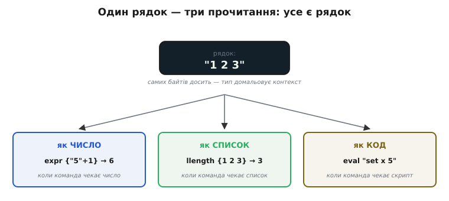
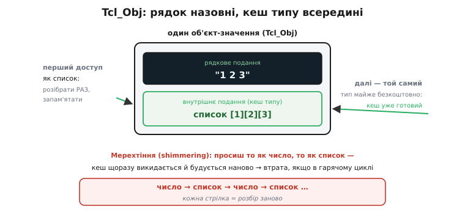

# Tcl

<preknowlist>
- [Байткод і віртуальна машина](topic:programming/bytecode-vm) — навіщо мову перекладають раз у команди вигаданої машини, а не тлумачать текст щоразу.
- [Компіляція](topic:programming/compilation) — різниця «перекласти наперед» проти «виконувати текст рядок за рядком».
- [Лексичний аналіз](topic:programming/lexer-design) — як потік символів ділять на слова-лексеми перед розбором.
</preknowlist>

Уявіть, що ви пишете велику інженерну програму — скажімо, редактор мікросхем — і хочете дати користувачам змогу її **розширювати**: писати власні команди, автоматизувати рутину, зшивати дії в скрипти. Кожен, хто так робив у 1980-х, винаходив для цього **свою** маленьку мовку: тут своя команда, там свій синтаксис умов, десь третій спосіб задати цикл. Виходив зоопарк — у кожної програми свій кострубатий «командний язик», несумісний із сусідніми, погано продуманий, бо роблений похапцем збоку від головної роботи. Саме ця досада й породила Tcl: а що, як зробити **одну** крихітну мову, спеціально придатну, щоб її **вбудовувати** в будь-яку програму як її командний рушій — і хай усі беруть готову, замість плодити свої?

Ця мета — бути не самостійним світом, а **вбудовуваним ядром керування** — пояснює в Tcl майже все: чому вона така дрібна, чому в неї лишень один тип даних, чому її синтаксис вміщається у дванадцять правил. Розберімося, як із однієї вимоги «легко вбудовуватися й легко розширюватися» виростає вся будова мови.

## Звідки взялася й що означає назва

Tcl (вимовляють «тікл», *Tool Command Language* — «командна мова для інструментів») створив **Джон Аустергаут** (John Ousterhout, американський науковець) навесні 1988 року в Каліфорнійському університеті в Берклі. Він тоді робив інструменти автоматизації проєктування мікросхем — зокрема редактор топології кристала на ім'я Magic, — і на власні очі бачив той самий зоопарк саморобних командних язиків. Задум був прямий: винести спільну частину — розбір команд, змінні, умови, цикли, процедури — в **одну переносну бібліотеку мовою C**, яку автор будь-якої програми просто прилінкує й дістане готову скриптову мову, а від себе допише лише **свої** команди, специфічні для його інструмента.

У січні 1990-го, після доповіді Аустергаута на зимовій конференції USENIX, вихідний код виклали у відкритий доступ через FTP — і мова швидко розійшлася поза Берклі. За Tcl (разом із її подругою — бібліотекою графічного інтерфейсу Tk) Аустергаут 1997 року дістав премію ACM Software System Award. Статус фактів тут усталений — це добре задокументована історія, без імперських нашарувань чи спірних «хто перший».

> 🔧 **Навіщо це.** Вбудовувана командна мова досі жива саме там, де народилася: у великих інструментах електроніки й САПР. Пакети симуляції та синтезу мікросхем (той-таки клас, з якого вийшов Magic) десятиліттями керуються скриптами Tcl — інженер описує складання чипа не мишкою, а командним файлом, який відтворюється й версіонується. Це не музейний експонат: тестові стенди на **expect** (надбудова над Tcl для автоматизації діалогу з програмами) і сьогодні ганяють залізо у виробництві.

## Одна ідея, доведена до краю: усе є рядок

Більшість мов має купу вбудованих типів: цілі числа, дробові, булеві, рядки, масиви, записи. Tcl пішла в протилежний бік — до **радикальної простоти**. У ній тип даних, по суті, **один**: рядок символів. Число `42` — це рядок із двох знаків «4» і «2». Список — це рядок, де елементи розділені пробілами. Навіть **сам код програми** — це рядок. Цей принцип так і звуть: **«усе є рядок»** (*everything is a string*).

Спершу це здається дивацтвом — як рахувати, якщо число насправді текст? Але подивіться, що ця єдність дає. Коли тип **один**, зникають цілі класи питань, над якими б'ються інші мови: не треба правил зведення типів, не треба вирішувати, як передати значення з програми в скрипт і назад, не треба узгоджувати, як виглядає число «зовні». Дані течуть крізь програму як текст — і текст же природно йде туди, куди Tcl завжди дивиться: у **командний рядок** іншої програми, у файл, у мережеве з'єднання. Мова, задумана як клей між інструментами, зробила своєю валютою те, чим інструменти й спілкуються, — текст.


*Значення в Tcl не має «власного» типу — самих байтів рядка досить, а тип домальовує та команда, що зараз його читає. Той самий рядок `"1 2 3"` команда обчислення прочитає як число, команда роботи зі списком — як три елементи, а команда виконання — як код. Тип живе не в даних, а в тому, хто їх питає.*

Ціна цієї єдності — швидкість: наївно тримати число завжди текстом означало б у кожному додаванні спершу розібрати рядок у число, а результат знову зібрати в рядок. Як Tcl обходить цей коштовний перебір, побачимо трохи далі — і саме там ховається найрозумніша інженерна ідея всієї мови.

## Синтаксис, що вміщається в кілька правил

Друга опора Tcl — **одноманітність виконання**. У ній немає окремого синтаксису для «оголосити змінну», окремого для «якщо», окремого для «поки». Є **лише команди**, і всі вони однакові на вигляд. Рядок Tcl — це **команда**: перше слово — її **ім'я**, решта слів — **аргументи**. Крапка.

```tcl
set x 5              ;# команда set, аргументи: x і 5  →  змінна x дістає "5"
puts $x              ;# команда puts, аргумент: значення x  →  друкує 5
incr x               ;# команда incr, аргумент: x  →  x стає 6
```

Тут відкривається головна несподіванка: навіть **керівні конструкції — це звичайні команди**, не вбудований синтаксис. `if`, `while`, `for`, `proc` (означення процедури) — усе це імена команд, яким передають аргументи-рядки. Умова — це команда `if`, якій дали два аргументи: рядок з умовою й рядок з тілом. Означення процедури — команда `proc`, якій дали ім'я, список параметрів і тіло. Мова не знає, що таке «цикл»; вона знає лише, як викликати команду на ім'я `while` і передати їй два рядки.

```tcl
if {$x > 5} {
    puts "більше"
} else {
    puts "менше або рівно"
}
```

Це не «синтаксис if» — це виклик команди `if` з чотирма аргументами: рядок `$x > 5`, тіло-рядок, слово `else`, ще одне тіло-рядок. Фігурні дужки тут — просто спосіб узяти шматок тексту в один аргумент, **не чіпаючи** його вмісту. Тому й [створити власну керівну конструкцію](topic:programming/tcl/proj-embed-interp.md) можна так само, як `if`: написати процедуру, що бере тіло-рядок і сама вирішує, коли його виконати. Межі між «вбудованим» і «своїм» у Tcl майже немає — і це прямий наслідок того, що все є команда, а тіло будь-чого — просто рядок.

### Дві дії над кожним рядком

Уся робота тлумача Tcl над одним рядком — це **дві дії поспіль**, завжди ті самі. Спершу — **підстановка**: пройти рядок і замінити три речі. Знак `$` перед іменем — на **значення змінної**. Квадратні дужки `[...]` — на **результат вкладеної команди** (її виконують негайно, а те, що вона повернула, вставляють на місце дужок). Зворотну скісну `\` — на спецсимвол (`\n` — новий рядок, `\t` — табуляція). Друга дія — **виклик**: узяти вже підставлений рядок, розбити на слова, перше вважати іменем команди, решту — аргументами, і покликати цю команду.

![Рядок «set b [expr {$a + 2}]» спершу проходить підстановку вкладеної команди, тоді викликається як set із двома аргументами](img/eval-two-steps.svg)
*Кожен рядок Tcl проходить рівно дві дії. Спершу підстановка: вкладена команда у квадратних дужках виконується, і `[expr {$a + 2}]` при `a = 3` перетворюється на `5`; знак `$` замінився б на значення змінної. Тоді виклик: перше слово `set` — ім'я команди, решта — аргументи-рядки. Один механізм на весь синтаксис.*

Що дужки `[...]` рекурсивно запускають ще одну команду посеред рядка — це та сама ідея, що робить [оболонку командного рядка](topic:programming/tcl/hist-shell-origins.md) такою гнучкою: результат однієї команди прямо підставляється в іншу. Tcl узяла цю звичку оболонки й зробила її серцем мови.

Тепер видно, звідки бралися ті **дванадцять правил** (їх у спільноті жартома звуть *dodekalogue*, від грецького *dṓdeka* — «дванадцять», за зразком «декалогу» — десяти заповідей). Це не дванадцять конструкцій, а дванадцять коротких приписів, що вичерпно описують ці дві дії: як ділити на слова, як працюють `$`, `[]`, `\`, чим відрізняються подвійні лапки (усередині підстановка йде) від фігурних дужок (усередині нічого не підставляється, текст береться дослівно), як `#` починає коментар. Уся граматика мови — на пів сторінки. Порівняйте з граматикою C чи Python на десятки сторінок — і відчуєте, наскільки інакший тут підхід.

> 🔧 **Навіщо це.** Крихітна граматика — це те, заради чого Tcl вбудовують. Розбирач мови вміщається в маленьку бібліотеку C без зовнішніх залежностей, і його легко покласти всередину прошивки чи великої програми як «пульт керування». У світі мікроконтролерів родич цієї ідеї — MicroPython; але там, де треба саме текстовий командний інтерфейс поверх свого C-коду (консоль для налагодження, сценарії тесту), вбудований Tcl-подібний тлумач дає повноцінну мову скриптів ціною кількох десятків кілобайтів.

## Гомоіконність: код і дані — одне

З «усе є рядок» плюс «тіло будь-чого — теж рядок» випливає властивість, яку в теорії мов звуть **гомоіконністю** (*homoiconicity*, від грец. *homós* — «однаковий» і *eikṓn* — «образ»): програма подана в тій самій формі, якими вона оперує з даними. У Tcl код — це рядок, і дані — це рядок, отже, **код можна будувати як звичайний текст і потім виконувати**.

Це не абстракція, а щоденний прийом. Команда `eval` бере рядок і виконує його як код. Значить, програма може **скласти собі команду на льоту** — склеїти з шматків текст, а тоді запустити:

```tcl
set cmd "puts"
set arg "привіт"
eval "$cmd $arg"        ;# збирає рядок "puts привіт" і виконує його → друкує: привіт
```

Мова, у якій програма легко читає й переписує **власний код**, дає **метапрограмування** майже задарма — те, за чим в інших мовах треба спеціальні засоби (макроси, рефлексія). У Tcl процедура, що приймає шматок коду, аналізує його чи будує новий, — буденна річ, бо код для неї просто рядок, з яким працюють звичайними командами роботи з текстом. На цьому стоять цілі надбудови: вбудовані предметні мовки (коли поверх Tcl роблять свій набір команд під конкретну задачу), об'єктні системи, дописані **самою мовою** поверх базових команд, автоматичні генератори коду.

Аналогія тут точна з [оболонкою](topic:programming/tcl/hist-shell-origins.md), де теж можна згенерувати командний рядок і виконати його, — але Tcl доводить її далі: в оболонці керівні конструкції все ж окремий синтаксис, а в Tcl і вони — команди, тож переписувати можна геть усе, зокрема й логіку керування. Ламається аналогія там, де оболонка лишається діалоговим інструментом запуску програм, а Tcl — повноцінна мова з процедурами, областями видимості й структурами даних, просто вбудована в чужий код.

## Як Tcl не задихнулася від рядків: подвійне подання

Повернімося до ціни, яку ми відклали. Якщо число `42` — насправді текст «42», то додати `40 + 2` наївно означало б: розібрати «40» у машинне число, розібрати «2», додати, зібрати результат «42» назад у текст. У циклі на мільйон обертів цей перебір «текст → число → текст» з'їв би всю продуктивність. Перші версії Tcl (до 1997-го) справді тримали значення чистими рядками й були через це помітно повільні.

Розв'язок, що прийшов у **Tcl 8.0** (вийшла 18 серпня 1997 року), — одна з найелегантніших ідей у дизайні мов. Значення всередині перестало бути голим рядком; ним став **об'єкт із двома поданнями одразу**. Одне подання — звичне **рядкове** (текст, як його бачить програміст). Друге — **внутрішнє**, кешоване: розібрана, готова до вжитку форма потрібного типу — машинне ціле, готовий список, скомпільований [байткод](topic:programming/bytecode-vm). Цей об'єкт-значення у сирцях зветься `Tcl_Obj`; у спільноті його називають **подвійнопортовим** (*dual-ported*) — до одного значення два «входи»: як рядок і як тип.

Хитрість — у тому, **коли** ці подання будують. Коли значення `"42"` уперше просять **як число**, Tcl розбирає його раз, кладе машинне ціле в кеш поряд із рядком і **запам'ятовує**. Наступного разу, коли те саме значення знову треба як число, розбирати нічого — готове ціле вже лежить у кеші, коштує майже нічого. Рядок і його розібрана форма живуть **разом**, і кожен береться тоді, коли саме він потрібен: пишеш у файл — беруть рядок, додаєш — беруть кешоване ціле.


*Значення в сучасному Tcl — об'єкт із двома поданнями. Зверху — рядок, яким його бачить програміст; знизу — кеш розібраного типу (тут: готовий список). Розбір роблять раз, за першим доступом, і запам'ятовують — повторний доступ того самого типу майже безкоштовний. Але якщо просити значення то як число, то як список навпереміну, кеш щоразу викидається й будується заново — це «мерехтіння» (shimmering), і в гарячому циклі воно коштує.*

У цієї схеми є своя пастка, і чесно її назвати. Якщо те саме значення **навперемін** використовувати то як один тип, то як інший — раз як число, раз як список, знову як число, — то кеш щоразу **викидається й будується заново**, бо в об'єкті місце лише під **одне** внутрішнє подання. Це явище прозвали **мерехтінням** (*shimmering* — «мерехтіти, переливатися»): значення ніби переблискує між типами, і кожен перехід — це повний розбір із нуля. У звичайному коді воно непомітне, але в гарячому циклі, де мільйон разів чергують два прочитання одного значення, мерехтіння здатне з'їсти весь виграш. Знати про нього — частина ремесла Tcl-програміста.

> 🔧 **Навіщо це.** Подвійнопортове значення — це загальний рецепт, а не лише трюк Tcl: тримай при значенні і його «людське» подання, і кешовану «машинну» форму, будуй машинну ліниво за першим запитом і клади поряд. Той самий прийом зустрічається всюди, де дорогий розбір хочеться робити раз: кешований результат парсингу конфігурації, лінива десеріалізація, «розібрати при першому доступі й запам'ятати». Tcl показала його в чистому вигляді — і заразом показала пастку мерехтіння, про яку варто пам'ятати щоразу, коли кладеш кеш поряд зі значенням.

## Місце Tcl серед мов: скриптова, не системна

Аустергаут згодом сформулював ширшу думку, задля якої й робив Tcl: мови діляться на два роди, і не варто мірити один рід міркою іншого. **Системні** мови (C, C++) будують складники з нуля, дбають про кожен байт і такт, тримають сувору систему типів — ними пишуть **самі компоненти**. **Скриптові** мови (Tcl, а пізніше Python, Perl та інші) не будують компонентів, а **склеюють готові** — швидко зшивають докупи те, що вже написане системною мовою. Їм не потрібна швидкість C, бо важка робота вже всередині компонентів; їм потрібна **гнучкість і стислість** — менше рядків, слабша типізація, миттєвий запуск без окремої компіляції. Ця думка — «скриптування як окремий, повноцінний рід програмування» — була свого часу свіжою й досі корисна як лінза: питати не «яка мова краща», а «ти зараз будуєш компонент чи склеюєш готові».

Саме тому Tcl мірити швидкодією C безглуздо — це різні ремесла. Її сила в іншому: вбудувати тлумач у велику C-програму — питання кількох викликів, і одразу маєш поверх свого коду живу, розширювану командну мову.

## Як це виглядає з боку C: вбудувати тлумач

Найважливіше про Tcl видно не з боку скрипта, а **з боку програми на C**, яка його в себе вбудовує, — бо саме заради цього мову й зробили. Створити тлумач, згодувати йому рядок Tcl, забрати результат — кілька викликів бібліотеки:

```c
#include <tcl.h>

int main(void) {
    Tcl_Interp *interp = Tcl_CreateInterp();     // створити тлумач Tcl

    // виконати рядок Tcl як код і забрати результат
    if (Tcl_Eval(interp, "expr {40 + 2}") == TCL_OK) {
        const char *res = Tcl_GetStringResult(interp);   // результат — завжди рядок
        printf("Tcl порахував: %s\n", res);              // друкує: Tcl порахував: 42
    }

    Tcl_DeleteInterp(interp);
    return 0;
}
```

А ось те, заради чого все й затівалося, — **дописати мові власну команду** мовою C. Реєструємо C-функцію під іменем `led`, і тепер у будь-якому Tcl-скрипті слово `led` викликає **наш** код (наприклад, вмикає світлодіод):

```c
// C-функція, що стане командою Tcl на ім'я "led"
static int LedCmd(void *data, Tcl_Interp *interp, int objc, Tcl_Obj *const objv[]) {
    if (objc != 2) {                                     // очікуємо рівно 1 аргумент
        Tcl_WrongNumArgs(interp, 1, objv, "on|off");
        return TCL_ERROR;
    }
    const char *arg = Tcl_GetString(objv[1]);            // аргумент як рядок
    set_led(strcmp(arg, "on") == 0);                     // наша апаратна дія
    return TCL_OK;
}

int main(void) {
    Tcl_Interp *interp = Tcl_CreateInterp();
    // прив'язати ім'я "led" до нашої C-функції
    Tcl_CreateObjCommand(interp, "led", LedCmd, NULL, NULL);

    Tcl_Eval(interp, "led on");    // Tcl-скрипт кличе наш C-код → світлодіод засвітився
    Tcl_DeleteInterp(interp);
    return 0;
}
```

Ось де сходяться всі нитки. Аргумент прийшов як `Tcl_Obj` — той самий подвійнопортовий об'єкт, — і ми беремо його рядкове подання. Команда `led` для тлумача не відрізняється від вбудованого `set`: обидві — просто імена, прив'язані до C-функцій. І весь скрипт користувача, хоч який складний, — це рядки, що проходять ті самі дві дії. Уся будова мови, яку ми розібрали — один тип, одна форма виконання, гомоіконність, — існує саме для цієї миті: щоб велика C-програма кількома викликами дістала собі повноцінну, розширювану командну мову. Мова, яку задумали як клей між інструментами, і лишилася найкращим клеєм — тихим ядром керування там, де його вбудували.
