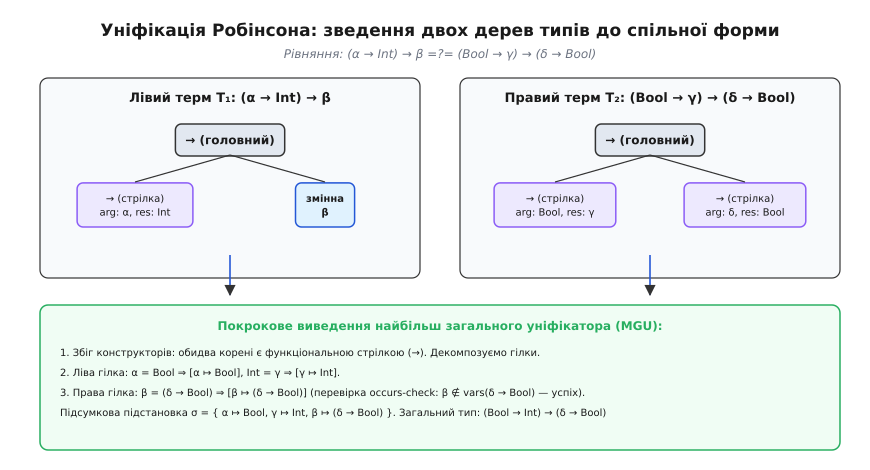
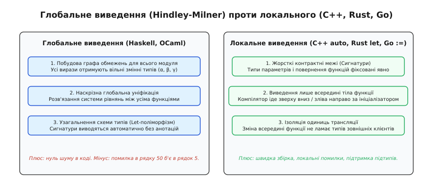
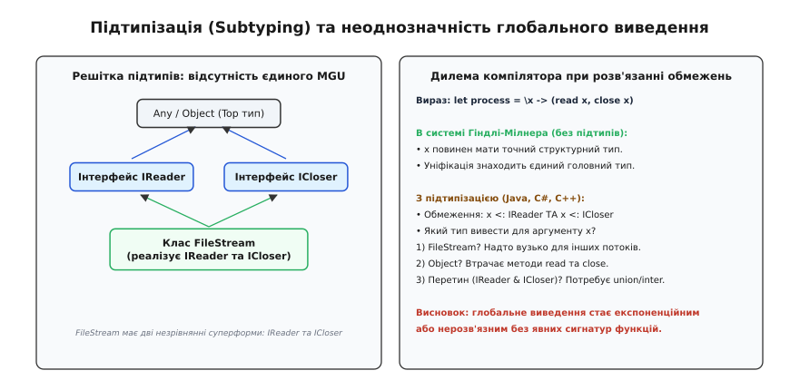
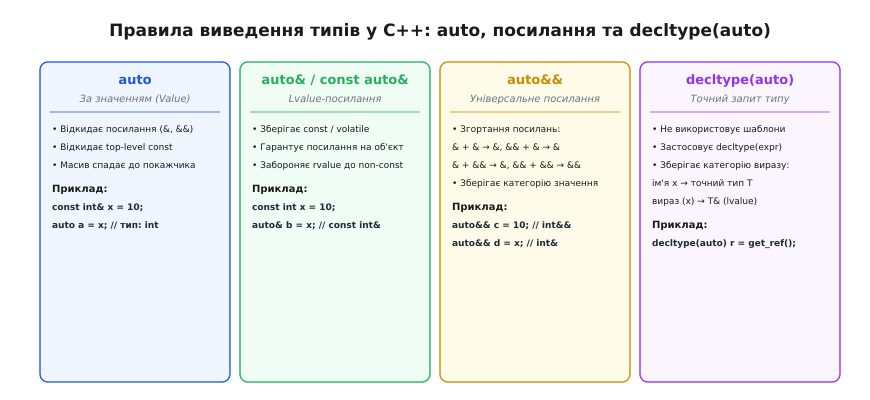

# Виведення типів: як компілятор здогадується сам

<preknowlist>
- [Компіляція](topic:programming/compilation) — трансляція вихідного тексту в машинний код та аналіз структури програми.
- [Поліморфізм і динамічне зв'язування](topic:programming/polymorphism) — параметричний поліморфізм, підтипізація та динамічна диспетчеризація.
</preknowlist>

Оголошення змінної в строго типізованій мові без виведення типів вимагає точного повторення імені типу ліворуч і праворуч від знака присвоєння. Коли тип тривіальний (`int x = 42;`), ця надлишковість здається непомітною. Але щойно програма переходить до вкладених узагальнених контейнерів чи ітераторів — `std::map<std::string, std::vector<std::pair<int, double>>>::const_iterator it = data.cbegin()` — обсяг синтаксичного шуму починає переважати змістовну логіку самої операції. Програміст змушений витрачати увагу на механічне переписування довгих ланцюжків типів, а будь-який рефакторинг базової структури даних вимагає каскадних правок у десятках місць, де цей тип було зафіксовано вручну.

Тривалий час це протистояння вважалося неминучим компромісом комп'ютерних наук. Інженер або обирав динамічні мови (де типи взагалі не вказуються, але платою стають непередбачувані аварійні збої під час виконання в продакшені), або статичні мови (де компілятор гарантує типобезпеку заздалегідь, але вимагає багатослівних явних анотацій для кожного виразу).

Виведення типів (*type inference*, від латинського *inferre* — виводити, робити логічний висновок) розриває цю фальшиву дилему. Воно дозволяє компілятору самостійно реконструювати точні статичні типи всіх виразів програми на основі семантичних зв'язків та операцій, які до них застосовуються, повністю зберігаючи гарантії суворої перевірки типів перед запуском.

## Формальне ядро: система типів Гіндлі — Мілнера

Фундаментом сучасного виведення типів є система Дамаса — Гіндлі — Мілнера (часто просто *Hindley-Milner*, або *HM*), сформульована в контексті лямбда-числення та втілена в мовах родини ML (Standard ML, OCaml, Haskell, F#).

Детальний шлях відкриття цього принципу — від комбінаторної логіки Каррі 1958 року до статті Дамаса й Мілнера 1982 року — викладено в [історичному нарисі](topic:programming/type-inference/hist-hindley-milner.md).

Суть системи HM полягає в тому, що кожному виразу в абстрактному синтаксичному дереві (AST) призначається змінна типу (позначається грецькими літерами `α`, `β`, `γ`), після чого зв'язки між функціями та аргументами перетворюються на систему рівнянь над деревами типів.

У системі HM діє фундаментальна властивість: якщо вираз взагалі є коректним з погляду типів, алгоритм гарантовано знаходить для нього **головний тип** (*principal type*, або найбільш загальний тип). Головний тип описує повну множину всіх допустимих типів виразу: будь-який конкретний мономорфний тип (наприклад, функція над цілими числами) утворюється з нього простою заміною змінних типів конкретними типами.

Розглянемо найпростішу функцію тотожності:

```
id = \x -> x
```

Компілятор не знає, чим є `x`. Він призначає аргументу `x` свіжу змінну типу `α`. Оскільки тіло функції повертає той самий `x`, тип результату також дорівнює `α`. Відповідно, тип самої функції виводиться як `α → α`.

Якщо тепер ми застосуємо цю функцію до константи:

```
res = id 42
```

Компілятор записує рівняння: функція типу `α → α` викликається з аргументом типу `Int`. Отже, вхідний тип `α` повинен дорівнювати `Int`. Звідси компілятор миттєво підставляє `α ↦ Int` і виводить, що результат `res` має тип `Int`.

## Механізм зведення: уніфікація Робінсона та Occurs-Check

Механізмом, який розв'язує згенеровані системою рівняння, є **алгоритм уніфікації Робінсона** (*unification*, від латинського *unus* — один і *facere* — робити). Уніфікація бере два довільні дерева типів і знаходить для них **найбільш загальний уніфікатор** (*Most General Unifier*, MGU) — мінімальний набір замін змінних (підстановку `σ`), який робить обидва дерева ідентичними.

Математичні означення підстановок, асоціативність їхньої композиції `σ₂ ∘ σ₁` та формальні правила MGU розібрано в [математичній довідці](topic:programming/type-inference/math-unification.md).


*Деревоподібна декомпозиція термів під час уніфікації: зіставлення кореневих конструкторів стрілок (→) та покрокова генерація підстановок для змінних.*

Алгоритм уніфікації працює рекурсивно за такими правилами:
1. Якщо обидва типи є ідентичними примітивами (`Int` та `Int`), підстановка порожня.
2. Якщо один із типів є змінною `α`, а інший — типом `T`, змінна прив'язується до типу: `[α ↦ T]`.
3. Якщо обидва типи є складеними конструкторами однакового виду (наприклад, `A₁ → B₁` та `A₂ → B₂`), алгоритм декомпозує їх: спочатку уніфікує ліві гілки `A₁ = A₂`, отримуючи підстановку `σ₁`, застосовує її до правих гілок і уніфікує `σ₁(B₁) = σ₁(B₂)`.
4. Якщо конструктори різні (наприклад, спроба уніфікувати `Int` зі стрілкою `Bool → Int`), виникає фатальна помилка компіляції: розбіжність типів (*type mismatch*).

### Перевірка входження (Occurs-Check)

Під час зв'язування змінної `α` з термом `T` компілятор зобов'язаний виконати критичну перевірку: переконатися, що сама змінна `α` не входить усередину `T`. Ця дія називається **перевіркою входження** (*occurs-check*).

Якщо програміст спробує написати функцію самозастосування:

```
\x -> x x
```

Компілятор позначить тип `x` як `α`. У виразі `x x` змінна `x` виступає одночасно функцією (яка повинна мати тип `α → β`) і аргументом цієї функції (який має тип `α`). Компілятор генерує рівняння:

```
α = α → β
```

Спроба підставити `α` призведе до нескінченного циклічного розгортання: `α = (α → β) → β = ((α → β) → β) → β ...`. Occurs-check миттєво ловить цю циклічну залежність і відкидає вираз ще на етапі компіляції як некоректний.

## Алгоритм W та Let-поліморфізм

Простої типізації лямбда-виразів недостатньо для повноцінної мови програмування. У просто типізованому лямбда-численні аргумент функції є мономорфним у межах свого тіла. Якщо передати функцію тотожності `id` як звичайний аргумент лямбди `\f -> (f 42, f True)`, компілятор видасть помилку: перший виклик `f 42` прив'яже `f` до типу `Int → Int`, після чого виклик `f True` спричинить конфлікт `Int ≠ Bool`.

Робін Мілнер розв'язав цю проблему введенням **let-поліморфізму** (поліморфізму рангу 1). Для цього виведення типів було оформлено у вигляді **Алгоритму W**:

Повна програмна реалізація алгоритму W мовами C++ та Python з AST, підстановками й уніфікацією наведена в [інженерному проєкті](topic:programming/type-inference/proj-algorithm-w.md).

Механізм let-поліморфізму працює через дві взаємодоповнюючі операції:
1. **Узагальнення (Generalization):** коли обробляється конструкція `let x = e₁ in e₂`, тип виразу `e₁` обчислюється, і всі змінні типу, які не зафіксовані в поточному оточенні (контексті `Γ`), закриваються квантором загальності: `∀α₁...αₙ. τ`. Змінна `x` записується в таблицю символів не як простий тип, а як **поліморфна схема типів**.
2. **Інстанціювання (Instantiation):** щоразу, коли ім'я `x` зустрічається всередині тіла `e₂`, квантифіковані змінні схеми замінюються абсолютно новими, свіжими змінними типів (`β₁`, `β₂`).

Завдяки цьому вираз:

```
let id = \x -> x in
let a = id 42 in
let b = id True in
(a, b)
```

успішно типізується: при виклику `id 42` схема `∀α. α → α` інстанціюється як `t₁ → t₁` і перетворюється на `Int → Int`, а при виклику `id True` інстанціюється як незалежна пара `t₂ → t₂` і стає `Bool → Bool`.

## Чому мейнстрім обрав локальне виведення типів

Якщо алгоритм Гіндлі — Мілнера настільки елегантний і виводить найбільш загальні типи для всієї програми без жодної анотації, чому мови на кшталт C++, Rust, C#, Java чи Go не впровадили його для глобальної типізації всієї програми?

Причина полягає у трьох фундаментальних конфліктах між теоретичним чистим лямбда-численням та вимогами промислової розробки програмного забезпечення.


*Контраст підходів: глобальне розв'язання рівнянь для всього модуля (HM) проти локальної дедукції в межах одного тіла функції з фіксованими сигнатурами.*

### 1. Межі функцій як контракти та роздільна компіляція

У великих проєктах модулі та бібліотеки компілюються незалежно. Якщо мова використовує глобальне виведення типів, зміна внутрішньої реалізації приватної допоміжної функції в глибині бібліотеки може непомітно змінити її виведений тип. Ця зміна ланцюговою реакцією прокотиться по всьому графу викликів і раптово зламає клієнтський код в іншій одиниці трансляції.

Явні сигнатури типів функцій на межах модулів діють як **непорушні контракти**. Компілятор перевіряє тіло функції на відповідність оголошеній сигнатурі, а викликач спирається виключно на цю сигнатуру, не заглядаючи у вихідний код реалізації.

### 2. Локалізація діагностики помилок

У чистому алгоритмі HM помилка типізації виникає тоді, коли два несумісні обмеження стикаються в уніфікаторі. Але уніфікатор не знає, який саме рядок коду мав на увазі програміст.

Якщо розробник помилився у рядку 120, передавши хибний аргумент у функцію, глобальний алгоритм може безперешкодно протягнути цей хибний тип через десяток інших функцій і повідомити про «неможливість уніфікувати типи» у рядку 15, де оголошено зовсім іншу функцію. Локалізація діагностики стає вкрай складною. У мовах з явними сигнатурами помилка завжди локалізована в межах поточного тіла функції.

### 3. Несумісність із підтипізацією та перевантаженням

Головний бар'єр — об'єктно-орієнтована підтипізація (*subtyping*, успадкування класів, реалізація інтерфейсів) та перевантаження функцій (*ad-hoc polymorphism*).


*Дилема решітки типів: наявність кількох спільних супертипів руйнує властивість єдиного головного типу (Principal Type).*

В системі без підтипів відношення між типами — це сувора структурна еквівалентність (`T₁ = T₂`). Підтипізація перетворює рівність на відношення порядку (`T₁ <: T₂`, де `T₁` є підтипом `T₂`).

Якщо функція приймає об'єкт і викликає на ньому методи `read()` та `close()`, у мові з підтипізацією аргумент повинен задовольняти обмеження `x <: IReader` та `x <: ICloser`. Який тип повинен вивести компілятор?
- Конкретний клас `FileStream`? Це надто вузько, бо функція не зможе працювати з `NetworkStream`.
- Базовий `Object`? Це надто широко, бо `Object` не має методів `read()` і `close()`.
- Множинний перетин `IReader & ICloser`? Це вимагає вкрай складних типів перетину (*intersection types*), які роблять алгоритм виведення експоненційним або нерозв'язним.

Тому індустріальні мови обрали практичний компроміс: **локальне виведення типів** (*Local Type Inference*). Сигнатури функцій, полів класів та публічних інтерфейсів фіксуються явно, а всередині тіла функцій компілятор вільно виводить типи локальних змінних.

## Дедукція типів у C++: auto, посилання та decltype

У сучасному C++ (починаючи з стандарту C++11) виведення типів отримало потужний набір механізмів, побудованих навколо ключових слів `auto` та `decltype`.


*Класифікація правил дедукції в C++: відкидання модифікаторів у auto проти точного збереження в auto&, auto&& та decltype(auto).*

Правила виведення для `auto` точно повторюють правила виведення аргументів шаблонів функцій (*template argument deduction*). Компілятор розглядає оголошення `auto x = expr;` так, ніби викликається вигадана шаблонна функція `template<typename T> void f(ParamType param);`.

### 1. Виведення за значенням (`auto`)

Коли `auto` вказується без модифікаторів, тип виводиться за значенням (*by-value*):
- Посилання (`&` та `&&`) повністю відкидаються.
- Кваліфікатори верхнього рівня `const` та `volatile` (*top-level const*) відкидаються.
- Масиви та покажчики на функції спадають (*decay*) до звичайних покажчиків.

```cpp
const int val = 10;
const int& ref = val;

auto a = val;   // тип: int (top-level const відкинуто, створюється копія)
auto b = ref;   // тип: int (посилання і const відкинуто, копія)
```

Якщо необхідно зберегти константність або посилання, їх слід вказати явно: `const auto c = val;` (тип `const int`) або `const auto& d = val;` (тип `const int&`).

### 2. Lvalue-посилання (`auto&`)

Коли зазначено `auto&`, виведений тип гарантовано стає посиланням на існуючий об'єкт:
- Посилання вихідного виразу відкидається (щоб не утворювати посилання на посилання).
- Константність вихідного об'єкта (*constness*) **зберігається**.
- Тимчасові об'єкти (*rvalue*) не можуть прив'язуватися до неконстантного `auto&`.

```cpp
const int x = 42;
auto& r1 = x;       // тип: const int& (const збережено)
// auto& r2 = 100;  // Помилка компіляції: неможливо зв'язати non-const lvalue ref з rvalue
const auto& r3 = 100; // тип: const int& (подовжує життя тимчасового об'єкта)
```

### 3. Універсальні (передавальні) посилання (`auto&&`)

Оголошення `auto&&` створює універсальне посилання (*forwarding reference*). Воно підпорядковується **правилам згортання посилань** (*reference collapsing rules*):
- `&` + `&` → `&`
- `&` + `&&` → `&`
- `&&` + `&` → `&`
- `&&` + `&&` → `&&`

Якщо ініціалізатор є *lvalue* (іменована змінна чи об'єкт у пам'яті), `auto` виводиться як `T&`, і в результаті згортання `T& &&` утворюється звичайне `lvalue`-посилання `T&`. Якщо ініціалізатор є *rvalue* (тимчасове значення), `auto` виводиться як `T`, утворюючи `rvalue`-посилання `T&&`.

```cpp
int x = 10;
auto&& ref_lval = x;   // x є lvalue => auto виводиться як int& => ref_lval має тип int&
auto&& ref_rval = 20;  // 20 є rvalue => auto виводиться як int => ref_rval має тип int&&
```

> 🔧 **Навіщо це.** Універсальне посилання `auto&&` є незамінним у generic-коді, лямбда-виразах C++14 (`[](auto&& arg) { ... }`) та ітераціях по контейнерах `for (auto&& item : container)`. Воно дозволяє захопити елемент контейнера з найменшими накладними витратами: контейнери з прямими об'єктами надають посилання за місцем, а проксі-ітератори (як-от `std::vector<bool>`) коректно прив'язують свої тимчасові проксі-об'єкти без зайвого копіювання.

### 4. Точний запит типу: `decltype` та `decltype(auto)`

Ключове слово `decltype` працює принципово інакше: воно не використовує правила виведення шаблонів і повертає точний тип сутності або виразу:
1. Якщо аргументом є **недужкове ім'я змінної** або доступ до поля (`decltype(x)`), воно повертає точний оголошений тип цієї змінної.
2. Якщо аргументом є **довільний вираз**, `decltype` враховує категорію значення виразу (*value category*):
   - Якщо вираз є *lvalue* (наприклад, дужковий вираз `(x)` або розіменування покажчика `*p`), `decltype` повертає `T&`.
   - Якщо вираз є *xvalue* (наприклад, результат `std::move(x)`), `decltype` повертає `T&&`.
   - Якщо вираз є *prvalue* (наприклад, літерал чи виклик функції, що повертає за значенням), `decltype` повертає чистий `T`.

У стандарті C++14 з'явилася конструкція `decltype(auto)`. Вона дозволяє оголосити змінну або тип повернення функції з автоматичним виведенням, але за правилами `decltype(expr)`, а не за правилами `auto`.

```cpp
int g_val = 100;
int& get_ref() { return g_val; }

auto v = get_ref();           // тип: int (посилання відкинуто, копіювання!)
decltype(auto) r = get_ref(); // тип: int& (точний тип результату функції, посилання збережено)
```

Це критично важливо при написанні функцій-обгорток (проксі та делегатів), які повинні ідеально прокидати повернене значення далі (*perfect forwarding return*).

## Виведення аргументів шаблонів функцій та класів (CTAD)

До стандарту C++17 шаблони класів вимагали обов'язкового явного зазначення параметрів типів при створенні екземплярів:

```cpp
// До C++17:
std::pair<int, std::string> p1(1, "test");
// Допоміжні функції фабрик для уникнення багатослівності:
auto p2 = std::make_pair(1, "test");
```

Шаблони функцій (`std::make_pair`) вміли виводити типи своїх аргументів з моменту заснування мови. Проте для класів ця можливість була відсутня, оскільки конструктори класу можуть мати складні перевантаження, що не відповідають прямо параметрам самого шаблону.

У C++17 було впроваджено **виведення аргументів шаблонів класів** (*Class Template Argument Deduction*, CTAD). Компілятор автоматично генерує невидимі шаблонні правила дедукції на основі конструкторів класу:

```cpp
// C++17 CTAD:
std::pair p(1, "test");          // компілятор виводить std::pair<int, const char*>
std::vector v = { 1, 2, 3, 4 };   // компілятор виводить std::vector<int>
std::lock_guard lock(mutex);      // компілятор виводить std::lock_guard<std::mutex>
```

### Явні напрямні виведення (Deduction Guides)

Якщо конструктори класу не дають компілятору достатньо інформації або якщо стандартне виведення є небажаним, розробник може оголосити **напрямну виведення** (*deduction guide*):

:::tabs
```cpp
#include <iostream>
#include <iterator>
#include <vector>

// Шаблонний клас динамічного буфера
template <typename T>
class Buffer {
public:
    template <typename Iter>
    Buffer(Iter begin, Iter end) {
        // Завантаження елементів з ітераторів
    }
};

// Явна напрямна дедукції (Deduction Guide):
// Підказуємо компілятору, що тип T буфера є типом елемента, на який вказує ітератор Iter
template <typename Iter>
Buffer(Iter, Iter) -> Buffer<typename std::iterator_traits<Iter>::value_type>;

int main() {
    std::vector<int> numbers = {10, 20, 30};
    
    // Завдяки напрямній компілятор самостійно виводить Buffer<int>
    Buffer buf(numbers.begin(), numbers.end());
    return 0;
}
```
:::

## Локальне виведення типів в інших мовах

Підхід до локальної дедукції різниться залежно від архітектури системи типів конкретної мови:

- **Rust (`let` та двоспрямоване виведення):**
  Компілятор `rustc` використовує потужне внутрішнє локальне виведення типів на основі уніфікації в межах усього тіла функції. Компілятор аналізує вирази не лише зверху вниз, але й знизу вгору (*bidirectional inference*):
  ```rust
  let mut list = Vec::new(); // На цьому рядку тип елементів Vec ще невідомий: Vec<?>
  list.push(42u32);          // На цьому рядку компілятор уніфікує ? = u32 і виводить Vec<u32>
  ```
- **Go (`:=`):**
  Гранично просте односпрямоване виведення на основі ініціалізатора. Оператор `x := 10` призначає змінній тип константи (`int`) без складних правил пошуку спільних типів.
- **C# (`var`) та Java (`var` з Java 10):**
  Виведення типу змінної суто за типом виразу праворуч від оператора присвоєння. Якщо праворуч стоїть лямбда-вираз без явної сигнатури делегата (`var f = x => x + 1;`), компілятор C# видасть помилку, оскільки лямбда сама по собі не має внутрішнього типу доти, доки її не прив'язано до конкретного цільового типу (*target typing*).

## Межі можливостей, обчислювальна складність та інженерна ціна

Виведення типів — це не безкоштовна магія. Воно має чітко окреслені математичні межі та вимагає свідомого балансу між лаконічністю та читабельністю коду.

### 1. Теоретична складність: EXPTIME у гіршому випадку

Класичний алгоритм Гіндлі — Мілнера має теоретичну часову складність **EXPTIME-complete** у найгіршому випадку. Спеціально сконструйований ланцюжок вкладених поліморфних зв'язувань `let` призводить до експоненційного подвоєння довжини схеми типів на кожному рівні вкладеності:

```
pair = \x -> (x, x)
p1   = pair pair
p2   = p1 p1
p3   = p2 p2
...
```

Для коду довжиною `n` розмір результуючого типу зростає як вежа степенів `2^(2^n)`. Проте в реальних програмах на практиці алгоритм W працює майже лінійно `O(n)`, оскільки розробники не створюють глибоких штучних пірамід узагальнення функцій вищих порядків над самими собою.

### 2. Нерозв'язність поліморфізму вищих рангів

Поліморфізм рангу 1 (де квантори `∀` можуть стояти лише на самому верху схеми типу, як у `let`) є розв'язним. Але якщо дозволити функціям приймати поліморфні функції як аргументи першого класу (поліморфізм рангу 2 або рангу N, система *System F*):

```
apply_poly = \(f : (∀α. α → α)) -> (f 42, f True)
```

Повне виведення типів для System F стає **алгоритмічно нерозв'язним** (теорема Джозефа Веллса, *J. B. Wells*, 1999). Компілятор фізично не здатний здогадатися, де саме слід розставити квантори, без явних анотацій типів від програміста.

### 3. Читабельність коду та «дія на відстані»

Головна небезпека надмірного використання `auto` чи `var` — втрата читабельності коду під час огляду (*code review*) або роботи в середовищах без підключеного інтелектуального мовного сервера (LSP):

```cpp
// Погано: тип результату абсолютно незрозумілий без переходу до реалізації query()
auto result = service.query(params);

// Добре: тип і так очевидний з ініціалізатора
auto parser = std::make_unique<JsonParser>();
auto count = static_cast<std::size_t>(100);
```

Коли тип змінної не є самоочевидним із правої частини виразу, приховування його за `auto` перетворює код на ребус для колег і позбавляє читача можливості швидко зрозуміти структуру даних.

---

Виведення типів — це інженерний інструмент, що перекладає механічну рутину розрахунку типів з людини на машину. Компілятор діє не як оракул, а як точний розв'язувач алгебраїчних систем рівнянь над деревами синтаксису. Розуміючи різницю між глобальним алгоритмом Гіндлі — Мілнера та локальними правилами спадання й згортання посилань у сучасних мовах, програміст отримує повний контроль над типобезпекою, створюючи лаконічні й водночас гранично надійні системи.
