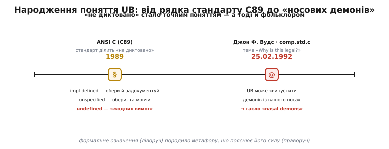

# 📜 Демони з носа: як з'явилося слово «undefined»

Мало яка технічна метафора живе тридцять із гаком років і досі вилітає в кожній серйозній розмові про C. «Nasal demons» — «носові демони» — це вже не жарт одного програміста, а спільна коротка формула, якою пояснюють новачкові найдивнішу рису мови: що компілятор має цілком законне право, натрапивши на певний код, зробити геть будь-що. Звідки ця формула взялася, чому саме «демони», і — головне — чому комітет, який писав перший стандарт C, свідомо обрав холодне слово **undefined** («невизначено») замість очевидного «помилка», — про це варто розповісти по-справжньому, бо за жартом стоїть точне інженерне рішення.

Дві дати тут — опора всієї історії, і обидві добре задокументовані: грудень 1989-го, коли поняття вперше отримало формальне ім'я в стандарті, і 25 лютого 1992 року, коли на нього наклали образ, що прижився назавжди.

*Два усталені факти на одній осі. Ліворуч — формальне народження поняття в ANSI C (C89): стандарт уперше розділив усе «не диктовано» на три відтінки, і найгостріший назвав словом undefined. Праворуч — допис Джона Ф. Вудса, що наклав на сухе означення яскравий образ; звідти й пішло гасло «nasal demons».*

## Що було до стандарту: кожен компілятор — сам собі закон

Щоб оцінити, навіщо взагалі знадобилося поняття UB, треба уявити C **до** будь-якого стандарту. У 1970-х і на початку 1980-х «мовою C» фактично була пара — книжка Браяна Кернігана (Brian Kernighan) і Денніса Рітчі (Dennis Ritchie) «The C Programming Language» (1978, так званий K&R C) плюс той компілятор, що стояв у вас на машині. Книжка описувала мову радше як звичай, ніж як закон: багато кутових випадків вона просто не згадувала.

А кутових випадків — безліч. Що станеться, якщо додати два `int` так, що результат не влазить у машинне слово? Що поверне зсув від'ємного числа праворуч? Що буде, якщо розіменувати покажчик, який нікуди не вказує? K&R на такі питання здебільшого мовчала — і відповідь давало **залізо**. На машині з додаванням «за модулем» переповнення тихо перекочувалося; на машині з апаратною пасткою — програма падала. Один і той самий текст на PDP-11, на IBM-мейнфреймі та на ранньому мікропроцесорі поводився по-різному, і не було жодного документа, який би сказав, хто з них «правий».

Для практика це означало щоденний головний біль: код, вилизаний під один компілятор, на іншому міг мовчки робити не те. Переносність (portability) трималася на чесному слові та досвіді, а не на гарантіях. Саме цей хаос комітет зі стандартизації й сів розгрібати — і, розгрібаючи, мусив дати імена тим самим кутовим випадкам, які раніше просто провалювалися в поведінку заліза.

> 🔧 **Навіщо це.** Без стандарту «працює у мене» не означало «працює деінде» — і не було способу довести, хто винен, коли не працювало. Поняття UB народилося не як пастка, а як **чесний список** місць, де мова свідомо не дає гарантій: знаючи цей список, програміст уперше отримав можливість писати код, переносний **за визначенням**, а не за випадковим збігом.

## X3J11: комітет, що мусив назвати неназване

1983 року Американський національний інститут стандартів (ANSI) створив комітет із позначенням **X3J11**, щоб перетворити звичай на стандарт. Робота тривала роки; результат вийшов наприкінці 1989-го як **ANSI X3.159-1989** — документ, який усі відтоді звуть просто **C89** (роком пізніше той самий текст, майже слово в слово, прийняли як міжнародний ISO/IEC 9899:1990, звідси друга назва — C90). *(Статус: усталений факт; позначення й рік звірені.)*

Перед комітетом стояла задача тонша, ніж здається. Не можна було просто «прописати все» — це вбило б C. Уся цінність мови була в тому, що вона лягала близько до заліза й давала швидкість, а залізо було різне. Якби стандарт **зобов'язав** усі машини поводитися при переповненні однаково, то платформи, де це дорого, або сповільнилися б, або зламали б сумісність. Тож комітет вчинив інакше: він **розсортував** усі місця, де «поведінка не диктується однозначно», за ступенем свободи, яку лишає реалізації.

Так у тексті стандарту з'явився поділ на три відтінки — і саме цей поділ, а не якесь одне речення, і є справжнім народженням поняття. Раніше все «недиктоване» звалювалося в одну купу; C89 уперше сказав, що куп насправді **три**, і вони різні за небезпекою.

- **Означене реалізацією** (implementation-defined): стандарт дозволяє кілька варіантів, але вимагає, щоб конкретний компілятор обрав один і **задокументував** його. Класика — розмір `int` чи те, чи `char` знаковий. Ти не знаєш наперед, але можеш прочитати в документації й покластися.
- **Неспецифіковане** (unspecified): теж кілька дозволених варіантів, але документувати компілятор **не мусить**. Класика — порядок, у якому обчисляться аргументи виклику `f(a(), b())`. Щось розумне станеться, просто не обіцяно що саме.
- **Невизначене** (undefined): стандарт **не обіцяє нічого взагалі**.

Ось на цьому третьому й тримається вся подальша драма.

## Чому «undefined», а не «error»

Тут — ключове рішення комітету, і саме через нього ламаються списи досі. Здавалося б, найприродніше було назвати ці випадки помилками: «переповнив `int` — це помилка, зупини програму». Чому X3J11 обрав інше, навмисно беземоційне слово?

Відповідь комітет виклав чорним по білому в супровідному документі — **Rationale** (обґрунтування) до стандарту. Формулювання варте того, щоб навести його близько до тексту: невизначена поведінка «дає розробникові компілятора **дозвіл не виловлювати** певні помилки програми, які важко діагностувати»; і водночас вона «позначає ділянки можливого відповідного стандартові розширення мови: розробник має право доповнити мову, надавши визначення офіційно невизначеній поведінці». *(Статус: усталений факт; це переказ близько до тексту англомовного Rationale — «gives the implementor license not to catch certain program errors that are difficult to diagnose… identifies areas of possible conforming language extension».)*

Розберімо, що це означає насправді, бо тут два різні мотиви сховані в одному слові.

**Перший мотив — свобода не перевіряти.** Слово «error» зобов'язувало б компілятор помилку **виявити**. А виявити, скажімо, вихід за межі масиву в загальному випадку неможливо без перевірки на кожному доступі — тобто без тієї самої ціни, якої C якраз уникає. Назвавши це не помилкою, а «невизначеним», комітет зняв із компілятора обов'язок ловити — і тим лишив код швидким. Тягар коректності свідомо переклали на програміста.

**Другий мотив — свобода розширювати.** «Невизначене» стандартом — не означає «заборонене». Це вільна ділянка, яку конкретна платформа може заповнити на свій розсуд, не порушуючи стандарту. На процесорі з апаратною пасткою переповнення природно робити пасткою; на іншому — тихим перекочуванням. Слово «undefined» лишало обом дорогу законною.

І тут криється підступ, якого в 1989-му ще ніхто не бачив на повний зріст. Сьогоднішній читач розуміє UB через оптимізатор: компілятор **припускає**, що UB не буває, і на цій підставі викидає перевірки, вважає гілки недосяжними, перекроює код навколо. Це — логічний наслідок формули «жодних вимог», але тодішні компілятори були надто прості, щоб ним по-справжньому скористатися. Формально дозвіл був даний одразу; його руйнівна сила проявилася згодом, коли компілятори порозумнішали. Механізм, за яким «жодних вимог» перетворюється на активне переписування коду, живе в [оптимізаторі](topic:programming/compiler-optimizations) — і саме через нього нешкідливий на вигляд текст 1989 року через двадцять років почав раптово ламатися під новішими складачами.

> 🔧 **Навіщо це.** Слово вибрали не заради грубості, а заради двох свобод: не змушувати компілятор ловити невловне і не змушувати всі платформи бути однаковими. Практичний висновок для інженера незмінний: UB — це **не «помилка, яку хтось за тебе впіймає»**. За задумом ловити його ніхто не зобов'язаний. Отже, або не допускай його зовсім, або став власні перевірки — стандарт тобі нічого не винен.

## 25 лютого 1992: питання про `sizeof`

Минуло два роки. Стандарт уже був, його читали, і в ньому длубалися прискіпливі уми — зокрема в Usenet-групі **comp.std.c**, де збиралися саме ті, хто сперечався про букву стандарту (звідси й назва: *std* — standard). Саме там, а не в самому документі, народилася метафора.

Приводом стало вузьке технічне питання. У гілці з промовистою назвою **«Why is this legal?»** («Чому це дозволено?») обговорювали, що має статися, якщо взяти `sizeof` від структури, тіло якої ще не оголошене — від **неповного типу** (incomplete type). Один із дописувачів, **Блер П. Гоутон** (Blair P. Houghton), розмірковував над тим, як стандарт кваліфікує такий код. І тут у розмову вступив **Джон Ф. Вудс** (John F. Woods). *(Статус: усталений факт; автор, дата, група та тема звірені за архівом дискусії.)*

Логіка Вудса була сталево проста й показова саме тим, як практик читає стандарт. Означення undefined каже: «поведінка, для якої стандарт **не накладає жодних вимог**». Ну то читаймо буквально, мовляв Вудс. Якщо вимог немає **жодних** — значить, немає й вимоги поводитися хоч трохи розумно. А отже дозволено все — аж до найабсурднішого наслідку, який тільки можна уявити. І він назвав цей найабсурдніший наслідок.

## Сам допис

Слова Вудса варто навести якомога ближче до оригіналу — бо саме їхня буквальна, доведена до краю логіка й зробила їх безсмертними:

> «Дозволена невизначена поведінка сягає від ігнорування ситуації геть, із непередбачуваними наслідками, до того, щоб демони вилетіли вам із носа. Коротко: не можна брати `sizeof()` від структури, чиї елементи не оголошені, — а якщо візьмеш, демони можуть вилетіти тобі з носа.»

В оригіналі: *«Permissible undefined behavior ranges from ignoring the situation completely with unpredictable results, to having demons fly out of your nose. In short, you can't use sizeof() on a structure whose elements haven't been defined, and if you do, demons may fly out of your nose.»* *(Статус: усталений факт; цитата відтворена за архівом comp.std.c від 25.02.1992.)*

Придивімося, чому це не просто дотеп. Перша половина фрази — **майже дослівний переказ** самого стандарту: «ігнорування ситуації геть, із непередбачуваними наслідками» — це один в один з переліку дозволених наслідків UB у тексті C89. Вудс бере офіційне формулювання й доводить його межу до логічного абсурду: якщо стандарт справді не вимагає **нічого**, то в цьому «нічого» вміщається й неможливе. «Демони з носа» — це не заперечення стандарту, а його **точне** прочитання, доведене до кінця. У цьому вся сила образу: він смішний саме тому, що формально бездоганний.

Тонкість, яку варто чесно позначити: у тодішній дискусії був і контраргумент. Крістофер Волпе (Christopher R. Volpe) заперечував, що конкретно `sizeof` від неповного типу — це радше **порушення обмеження** (constraint violation), яке зобов'язує компілятор видати діагностику, а не «чисте» UB без жодних вимог. Тобто конкретний приклад Вудса був дискусійний. Але риторична сила фрази від цього не постраждала: вона запам'яталася не як вирок про `sizeof`, а як найточніша ілюстрація того, що означає «жодних вимог» узагалі. *(Статус: усталений факт про наявність заперечення; хто формально мав рацію щодо `sizeof` — то окреме, вужче питання букви стандарту.)*

## Як «nasal demons» стало гаслом

Сам Вудс, за всіма свідченнями, словосполучення «nasal demons» не вживав — він написав розгорнуту фразу про демонів, що вилітають із носа. Стислу формулу-ярлик **«nasal demons»** («носові демони») спільнота викувала згодом, переказуючи його думку. Образ виявився ідеально чіпким: він абсурдний, він наочний, і він точно передає головне — що наслідок UB не обмежений ані здоровим глуздом, ані навіть межами вашої програми. Формула розійшлася файлом жаргону програмістів (Jargon File), потім — незліченними форумами, і врешті стала тим, чим є нині: спільною короткою назвою для «компілятор має право на будь-що». *(Статус: усталений факт щодо авторства розгорнутої фрази й пізнішого закріплення ярлика; точну особу, яка першою вжила саме два слова «nasal demons», архіви однозначно не називають — це radше колективне карбування, ніж чийсь конкретний винахід.)*

Варто відзначити й **де** це сталося. Метафора народилася не в підручнику й не в стандарті, а в живій суперечці інженерів про букву документа. Це показово: сам стандарт написаний навмисно сухо й обережно, а зрозуміти його **силу** спільноті допоміг образ, вигаданий на маргінесі технічної гілки. Сухе означення й яскравий фольклор виявилися двома половинами одного розуміння — і саме тому «носові демони» пережили не одне покоління компіляторів.

## Що з цієї історії лишається практикові

Історія «носових демонів» — не просто кумедна виноска. У ній сховані три уроки, які досі визначають, як писати надійний код на C і C++.

Перший: **слово обрано свідомо, і воно означає рівно те, що каже.** «Невизначено» — це не евфемізм для «трохи неправильно» і не синонім «помилки, яку хтось упіймає». Це «жодних вимог», і Вудс лише проілюстрував, наскільки буквально це треба читати. Хто ставиться до UB як до дрібної неточності, той рано чи пізно зустріне свого демона.

Другий: **між 1989-м і сьогоденням нічого не змінилося у формулюванні — змінилися компілятори.** Дозвіл «припускати, що UB не буває» був даний одразу, але скористалися ним по-справжньому лише розумні оптимізатори пізніших років. Тому старий код, що «працював двадцять років», може раптово зламатися під новим складачем — не через баг у складачі, а через те, що він нарешті використав право, дане йому ще в C89.

Третій, найпрактичніший: **раз ловити UB за тебе ніхто не зобов'язаний — лови сам.** Саме тому в сучасній розробці існують попередження компілятора й санітайзери: вони добровільно роблять те, від чого стандарт компілятор звільнив, — виявляють UB у момент, коли воно стається. Це пряма, інженерна відповідь на дотеп 1992 року: якщо демони можуть вилетіти з носа, розумно поставити на носі сторожа ще до того, як вони туди залетять.

І, мабуть, головне, чому ця історія варта переказу: вона показує, що за найабсурднішим програмістським жартом стоїть не хаос, а точне рішення. Комітет обрав слово, практик довів його межу до краю, спільнота стисла це в образ — і разом вийшла найкоротша можлива лекція про те, що таке договір між програмістом і мовою. Демони з носа — це просто дуже наочна назва для ціни, яку C бере за свою швидкість.
