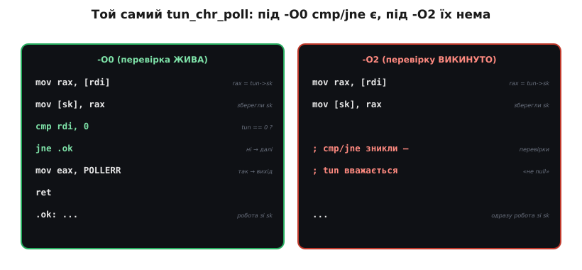
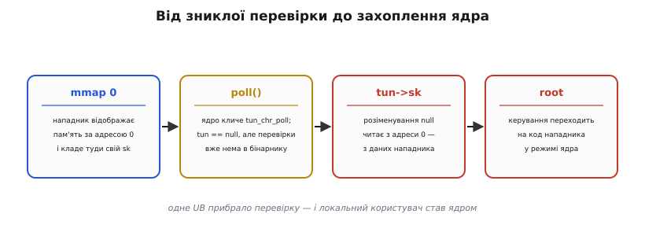

# ⚙️ Як UB зжерло перевірку безпеки: розбір CVE-2009-1897

Літо 2009-го. У свіжому ядрі Linux 2.6.30 живе драйвер `tun` — той, що робить віртуальні мережеві інтерфейси (через нього працюють VPN, тунелі, віртуалки). У драйвері є коротка, геть буденна функція `tun_chr_poll`. У ній є перевірка на нульовий покажчик — програміст її свідомо написав, щоб не впасти. І все одно ця функція стала дірою, крізь яку звичайний непривілейований користувач діставав права ядра — повний контроль над машиною.

Найдивніше: у вихідному коді перевірка **є**. У зібраному ядрі її **немає**. Її нікуди не поділи руками, не закоментували, не забули. Її **прибрав компілятор** — цілком законно, з холодною логікою, ще й на найзвичайнішому рівні оптимізації `-O2`, з яким збирають усе на світі. Розберімо цей випадок по кісточках: візьмемо справжній код драйвера, побачимо, що з ним робить GCC, зазирнемо в асемблер до і після, зрозуміємо, чому вмикачем катастрофи став саме `-O2`, і виведемо виправлення — те саме, що реально пішло в ядро, з одного пересунутого рядка.

Це не навчальний приклад «на пальцях». Це реальний баг у коді, який крутився на мільйонах машин.

## Задача: що взагалі робить ця функція

Щоб зрозуміти пастку, треба спершу зрозуміти, чого функція мала досягати. `poll` — це системний виклик, яким програма питає ядро: «чи готовий цей дескриптор до читання/запису?». Коли програма робить `poll()` на `/dev/net/tun`, ядро всередині кличе `tun_chr_poll` — драйверний обробник, що має відповісти, які події доступні.

Функції треба дістати внутрішній стан tun-пристрою, прив'язаного до цього відкритого файлу, глянути на його чергу пакетів і повернути бітову маску готовності (`POLLIN`, `POLLOUT` тощо). Дістати стан — означає пройти ланцюжком покажчиків: від структури файлу до приватних даних, звідти до самого `tun_struct`, а вже в ньому лежить сокет `sk`, через який і рухаються дані.

І ось перша тонкість. Цей ланцюжок може обірватися. Драйвер `tun` дозволяє «від'єднати» пристрій від файлу: файл лишається відкритим, а `tun_struct` уже нема. Тоді функція, що дістає `tun`, поверне `NULL`. Розробник це знав — тому й поставив перевірку. Задача перевірки чесна: «якщо пристрою вже нема, не лізь у нього, а чемно поверни помилку». Уся біда — лише в **тому, у якому рядку** цю перевірку поставили відносно першого доступу до покажчика.

> 🔧 **Навіщо це.** Драйвер у ядрі — це код, який виконується з найвищими правами й до якого дотягується будь-який процес через звичайний файл у `/dev`. Одна пропущена перевірка тут — не «неправильний піксель», а місток від прав звичайного користувача до прав ядра. Тому в системному коді порядок «перевірити, потім чіпати» — не стилістика, а межа між робочою системою й захопленою.

## Як виглядає вихідний код

Ось та сама функція з `drivers/net/tun.c` версії 2.6.30 — початок, де й ховається вся драма (я лишив суттєве, прибравши дрібниці, що до справи не стосуються):

```c
static unsigned int tun_chr_poll(struct file *file, poll_table *wait)
{
    struct tun_file *tfile = file->private_data;
    struct tun_struct *tun = __tun_get(tfile);
    struct sock *sk = tun->sk;          // (A) розіменували tun
    unsigned int mask = 0;

    if (!tun)                            // (B) аж тепер перевірка на null
        return POLLERR;

    DBG(KERN_INFO "%s: tun_chr_poll\n", tun->dev->name);

    poll_wait(file, &tun->socket.wait, wait);

    if (!skb_queue_empty(&sk->receive_queue))
        mask |= POLLIN | POLLRDNORM;
    // ... далі формується маска й повертається ...
    return mask;
}
```

Прочитаймо очима людини, рядок за рядком, і все виглядатиме бездоганно.

`__tun_get(tfile)` дістає `tun_struct` — і, як ми сказали, **може повернути `NULL`**, якщо пристрій від'єднали. Це записано в саму сигнатуру задачі.

Рядок `(A)`: `struct sock *sk = tun->sk;` — беремо сокет із пристрою й кладемо в локальну змінну `sk`, щоб далі зручно ним користуватися. Природний, охайний C: витягли потрібне поле на початку функції.

Рядок `(B)`: `if (!tun) return POLLERR;` — «якщо пристрою нема, повертаємо помилку `POLLERR`». Оборонна перевірка, точно та, якої вимагає задача.

Око людини читає це як «спершу підготуємо `sk`, потім про всяк випадок переконаємось, що `tun` живий». Логіка людини поблажлива: `sk` ми ж поки не *чіпали*, лише скопіювали адресу поля — то й нехай лежить, перевірка нижче все одно врятує.

А тепер найважливіше речення всього розбору. **Рядок `(A)` — це вже розіменування `tun`.** Записати `tun->sk` означає: візьми адресу в `tun`, додай зсув поля `sk`, **піди за цією адресою в пам'ять і прочитай звідти**. Якщо `tun` дорівнює `NULL`, то це читання з околиці нульової адреси — а розіменування нульового покажчика в C є **невизначеною поведінкою**. Перевірка `(B)` стоїть на один рядок **пізніше**, ніж стається доступ, який вона мала б застерегти. Уся вразливість — у цій одній інверсії порядку.

## Що робить GCC під -O2

Людина читає код поблажливо. Компілятор — ні. Оптимізатор GCC на рівні `-O2` міркує строго формально, і його ланцюжок думок тут такий, крок за кроком:

1. У рядку `(A)` виконується `tun->sk` — тобто `tun` **розіменовано**.
2. За правилами мови розіменування `NULL` — це UB. А оптимізатор має право **вважати, що UB ніколи не стається** (це і є той договір, на якому стоїть швидкість C). Докладніше про це припущення — у [оптимізаціях компілятора](book:programming/compiler-optimizations): оптимізатор будує весь свій висновок на тому, що жоден шлях виконання не веде до UB, тож будь-який такий шлях можна вважати недосяжним.
3. Отже, робить висновок компілятор, у рядку `(A)` `tun` **гарантовано не `NULL`** — інакше програма вже втекла б у UB, а такого «не буває».
4. `tun` між `(A)` і `(B)` не змінюється.
5. Тоді в рядку `(B)` умова `!tun` — це `!(щось, що точно не NULL)`, тобто **завжди хибна**.
6. Гілка, тіло якої виконується лише за завжди-хибної умови, — **мертвий код**. Її можна викинути повністю.

І компілятор викидає. У зібраному ядрі рядка `if (!tun) return POLLERR;` **немає** — ні перевірки, ні виходу з `POLLERR`. Не тому, що GCC «поламаний» чи «зловмисний», а тому, що ми самі, написавши `tun->sk` до перевірки, **пообіцяли** компілятору: «`tun` тут не null». Компілятор нам повірив на слово й прибрав перевірку, яку — за нашою ж обіцянкою — виконувати нема сенсу.


*Порядок фатальний: `tun` спершу розіменовано (`tun->sk`), і лише потім перевірено на `null`. Оптимізатор виводить з розіменування, що `tun` не може бути null, а отже перевірка `if (!tun)` завжди хибна — і викидає її як мертвий код.*

Зверніть увагу, наскільки це відрізняється від того, чого боявся б новачок. Новачок думає: «якщо `tun` раптом `NULL`, рядок `(A)` просто впаде або дасть сміття — локальна неприємність». Насправді наслідок **не локальний**: помилковий доступ у рядку `(A)` не «псує `sk`», він **виправдовує викидання перевірки в рядку `(B)`** — зовсім іншого рядка, який, здавалося б, до `sk` стосунку не має. UB тут спрацювало як важіль: одна помилка з покажчиком дозволила компілятору переписати логіку навколо неї.

## Як це видно в асемблері

Абстрактні міркування добре, але переконливо — коли видно машинний код. Зберемо ту саму функцію двома способами й порівняймо те місце, де мала б жити перевірка. Покажчик `tun` за угодою про виклики лежить у регістрі (нехай `rdi` — перший аргумент у типовому x86-64 ABI; про це — [угода про виклики](book:programming/calling-convention)).

Під `-O0` (оптимізацій катма) GCC перекладає код майже дослівно, рядок у рядок. Розіменування, збереження `sk`, а потім — чесна перевірка:

```
mov   rax, [rdi]        ; rax = tun->sk   (розіменували tun, рядок A)
mov   [sk], rax         ; зберегли sk у локальну змінну
cmp   rdi, 0            ; tun == 0 ?      (перевірка, рядок B)
jne   .ok               ; ні → працюємо далі
mov   eax, POLLERR      ; так → готуємо код помилки
ret                     ;        і виходимо
.ok:
    ...                 ; тіло функції, робота зі sk
```

Тут усе на місці: `cmp rdi, 0` порівнює `tun` з нулем, `jne .ok` перестрибує в тіло, якщо не нуль, а інакше повертається `POLLERR`. Перевірка жива й робоча. Під `-O0` баг **не проявляється** — саме тому «в дебазі працює».

Тепер той самий вихідний код під `-O2`:

```
mov   rax, [rdi]        ; rax = tun->sk   (розіменували tun, рядок A)
mov   [sk], rax         ; зберегли sk
; --- cmp rdi, 0  та  jne .ok  ЗНИКЛИ ---
; tun беззастережно вважається не-null
...                     ; одразу тіло функції, робота зі sk
```

Двох інструкцій — `cmp rdi, 0` і `jne .ok` — просто **немає**. Разом із ними зникла й гілка з `POLLERR`. Функція під `-O2` **безумовно** провалюється в тіло й починає працювати з даними так, ніби `tun` завжди дійсний. Це не оптимізація в сенсі «те саме, але швидше» — це **інша поведінка**: там, де `-O0`-версія обрала б безпечний вихід, `-O2`-версія лізе в структуру за (можливо) нульовою адресою.


*Той самий вихідний `tun_chr_poll`, зібраний двічі. Під `-O0` порівняння з нулем і умовний перехід — на місці. Під `-O2` їх нема: оптимізатор довів, що `tun` не null, тож перевірка йому «зайва».*

Ось де абстракція стає відчутною на дотик: «компілятор прибрав перевірку» — це буквально дві відсутні машинні інструкції. Не метафора, а порожнє місце в бінарнику там, де в сирці стоїть `if`.

## Чому саме -O2 вмикає видалення

Природне питання: чому пастка спрацьовує на `-O2`, а на `-O0` спить? Хіба правила мови не однакові на всіх рівнях? Правила — так, однакові. Різне — **наскільки агресивно компілятор ними користується**.

`-O0` створений, щоб машинний код якомога точніше відповідав сирцю: зручно налагоджувати, кожен рядок C — на своєму місці в асемблері. Тому GCC на `-O0` майже не робить висновків «уперед»: бачить `if` — генерує `cmp`/`jne`, не мудруючи, чи можна їх викинути. Аналіз, який доводить, що `tun` не null, просто **не запускається**.

`-O2` — рівень «звичайного релізу», з яким збирають майже все, зокрема й ядро. Тут вмикається цілий набір проходів-оптимізацій, і два з них разом і роблять фатальну справу:

- **Поширення діапазонів значень** (value-range / null-ness аналіз). Прохід відстежує, що компілятор знає про кожну змінну на кожному кроці. Побачивши розіменування `tun->sk`, він записує собі у висновки факт: «починаючи звідси, `tun` не-null» — бо інакше був би UB, якого «не буває».
- **Усунення мертвого коду** (dead-code elimination). Прохід викидає гілки, умова яких відома наперед. Отримавши від попереднього проходу «`tun` не-null», він бачить, що `!tun` — завжди хибне, і видаляє всю гілку `if (!tun)`.

Поодинці жоден із них не лиходій. Разом вони утворюють ланцюжок: перший **виводить факт** із розіменування, другий на підставі цього факту **прибирає перевірку**. `-O2` — це просто перший стандартний рівень, де обидва проходи ввімкнені й достатньо злагоджені, щоб зімкнутися. На `-O3` буде так само (навіть агресивніше); на `-O1` — залежить від версії GCC, деякі вже видаляли, деякі ще ні. Але канонічний, найпоширеніший вмикач — саме `-O2`, бо це рівень, на якому світ збирає продакшн.

> 🔧 **Навіщо це.** Звідси залізне правило перевірки коду: **тестувати на тому ж рівні оптимізації, з яким збиратимеш реліз.** Прогнати тести під `-O0`, побачити зелене й розслабитися — самообман: цілий клас UB-багів під `-O0` спить і прокидається лише під `-O2`. Це та сама природа підступності, що й у [ключового слова `volatile`](book:programming/volatile), де рівень оптимізації теж вирішує, вилізе баг чи ні. Якщо реліз — `-O2`, то й CI має ганяти `-O2`.

## Від зниклої перевірки до захоплення ядра

Досі ми говорили «діра в безпеці» абстрактно. Доведімо, що зникла перевірка справді дає владу над машиною, — простеживши атаку крок за кроком. Сама по собі відсутня перевірка означала б лише падіння ядра при розіменуванні нуля (аварія, `oops`). Щоб перетворити падіння на **захоплення**, нападник робить хитрий хід.

Ключ — у тому, що на багатьох системах процес може попросити ядро відобразити пам'ять **починаючи з нульової адреси**. Це робиться викликом `mmap` із адресою 0. Тобто адреса `NULL`, яка «мала б» бути забороненою й недоступною, стає для процесу **звичайною доступною сторінкою**, куди він може писати що завгодно. (Механіку відображення адрес у сторінки пам'яті розбирає [віртуальна пам'ять](book:programming/virtual-memory).)

Далі ланцюжок складається так:

1. **Нападник відображає сторінку за адресою 0** (`mmap` з `MAP_FIXED` на адресу 0) і **кладе туди підроблену структуру** — таку, щоб поле за зсувом `sk` указувало на дані під його контролем, а глибше — на його ж код.
2. **Нападник викликає `poll()` на `/dev/net/tun`** так, щоб `__tun_get` повернув `NULL` (пристрій від'єднано). Ядро заходить у `tun_chr_poll`, де `tun == NULL`. Але **перевірки `if (!tun)` у бінарнику нема** — вона викинута ще при збиранні. Тож замість чемного `POLLERR` функція йде далі.
3. **Ядро розіменовує `NULL`** — читає `tun->sk` з адреси 0. Але там уже не порожнеча, а **дані нападника**, які він завбачливо поклав через `mmap`. Ядро радо бере звідти «сокет» і починає ним користуватися.
4. **Керування перехоплено.** Нападник так підбирає вміст фальшивої структури, що одне з наступних розіменувань чи викликів через неї (наприклад, виклик функції за покажчиком із «сокета») переводить виконання **на код нападника — але вже в режимі ядра**. Звідти до `root` — справа кількох інструкцій: підмінити облікові дані свого процесу на нульові (ідентифікатор суперкористувача).


*Ланцюг перетворення зниклої перевірки на підвищення привілеїв: відобразити пам'ять за адресою 0 з фальшивою структурою → змусити ядро зайти у функцію з `tun == null` → ядро розіменує null і візьме дані нападника → керування переходить на його код у режимі ядра.*

Отже, схема повна: якби перевірка `if (!tun)` лишалась у бінарнику, крок 2 обірвався б чемним `POLLERR` і нічого б не сталося. Її відсутність — єдина, але достатня ланка, що обертає «від'єднаний пристрій» на «чужий код у ядрі». Одне UB в одному рядку драйвера коштувало повного контролю над системою для будь-кого, хто має доступ до `/dev/net/tun`.

Варто чесно позначити статус фактів. Механізм — розіменування до перевірки, видалення перевірки оптимізатором GCC на `-O2`, експлуатація через `mmap` нульової сторінки — **достеменно підтверджений**: описаний у розборі LWN «Fun with NULL pointers» (Джонатан Корбет, липень 2009) і в записі NVD для CVE-2009-1897. Прийом відображення нульової сторінки для експлуатації null-розіменувань у ядрі того часу — теж добре задокументований (роботи Бреда Спенглера й спільноти безпеки). Точні числові зсуви полів і деталі конкретного експлойта тут не важливі — важлива схема, а вона стала хрестоматійною.

## Виправлення в один рядок

Тепер найприємніше: наскільки мало треба, щоб діру закрити. Уся причина — інверсія порядку між розіменуванням `(A)` і перевіркою `(B)`. Отже, ліки очевидні: **розіменувати після перевірки, а не до неї**. Присвоєння `sk = tun->sk` має статися **після** того, як ми переконались, що `tun` не null.

Саме це й зробив офіційний патч (комміт `3c8a9c63d5fd738c261bd0ceece04d9c8357ca13` у дереві Linux, автор — David S. Miller, липень 2009). Оголошення `sk` розчепили з ініціалізацією: тепер спершу оголошуємо `sk` без значення, потім перевіряємо `tun`, і лише **після** перевірки присвоюємо. У вигляді diff:

```c
-       struct sock *sk = tun->sk;      // було: розіменування ДО перевірки
+       struct sock *sk;                // стало: лише оголошення, без доступу
        unsigned int mask = 0;

        if (!tun)
                return POLLERR;
+
+       sk = tun->sk;                    // розіменування ПІСЛЯ перевірки
```

Виправлена функція читається так:

```c
static unsigned int tun_chr_poll(struct file *file, poll_table *wait)
{
    struct tun_file *tfile = file->private_data;
    struct tun_struct *tun = __tun_get(tfile);
    struct sock *sk;                     // (A') лише оголошення — доступу нема
    unsigned int mask = 0;

    if (!tun)                            // (B') перевірка ПЕРША
        return POLLERR;

    sk = tun->sk;                        // (C') тепер безпечно розіменувати
    // ... далі як було ...
    return mask;
}
```

Погляньмо, чому цього досить. Тепер перше розіменування `tun` — це рядок `(C')`, і він **недосяжний**, якщо `tun == NULL`: перевірка `(B')` перехопить нуль і поверне `POLLERR` раніше. Компілятор більше **не має підстав** вважати `tun` не-null у точці перевірки: до неї жодного розіменування нема, обіцянки «`tun` не null» ми не давали. Отже, аналіз null-ності мовчить, мертвого коду нема, `if (!tun)` лишається в бінарнику живим. Порядок відновлено — і компіляторова логіка тепер працює **на** нас.

Це той самий тип механізму, що й із виявленням переповнення: UB не можна «зловити після того, як воно сталося» — його треба **не допустити раніше**. Перевірка, поставлена **перед** небезпечною дією, тримається; та сама перевірка **після** дії — приречена, бо дія вже дала компілятору право її викинути.

## Прапорець -fno-delete-null-pointer-checks

Виправити один драйвер — добре, але автори ядра поставили розумніше питання: **а скільки ще таких місць** ховається в мільйонах рядків? Де ще колись хтось написав розіменування на рядок раніше за перевірку — і компілятор мовчки викинув захист? Полювати на кожне вручну — марно.

Тому паралельно з латкою в `tun.c` у ядро додали захисний прапорець збирання — **`-fno-delete-null-pointer-checks`**. Він каже GCC рівно одне: «навіть якщо ти вивів із розіменування, що покажчик не-null, **не смій на цій підставі видаляти перевірки на null**». Тобто вимикає саме той крок міркування (пункт 6 з нашого ланцюжка — усунення мертвого коду для null-перевірок), який і робить пастку небезпечною. Розіменування далі лишається UB — але перевірка вже не зникне, тож у найгіршому разі буде чесне падіння, а не тиха діра.

У код-базі ядра це виглядає як додавання прапорця в загальні прапори компіляції (комміт додав `-fno-delete-null-pointer-checks` до `KBUILD_CFLAGS`):

```
# у Makefile ядра, у списку прапорів для gcc:
KBUILD_CFLAGS += $(call cc-option,-fno-delete-null-pointer-checks,)
```

`cc-option` — це перевірка «чи розуміє наш GCC такий прапорець» (старіші версії могли не знати), і якщо так — прапорець додається до збирання **всього** ядра. Відтоді ця конкретна оптимізація в ядрі вимкнена глобально: жоден інший «розіменувати-потім-перевірити» більше не втратить свою перевірку через оптимізатор.

Важлива тверезість: прапорець — це **щит, а не ліки**. Він рятує від видалення перевірок скрізь одразу, і для величезної старої код-бази ядра це розумно. Але саме розіменування нуля лишилось UB; прапорець лише гарантує, що супутню перевірку не викинуть. У **своєму** коді покладатися на `-fno-delete-null-pointer-checks` замість правильного порядку — погана ідея: це латання симптому. Правильно — писати перевірку перед доступом; прапорець тримати як страхувальну сітку для того, чого не догледіли.

## Що з цього винести

Розбір маленький, а уроків у ньому кілька, і всі — практичні.

**Порядок «розіменувати, потім перевірити» — сам собою пастка.** Перевірка на null безсила, якщо перед нею вже є доступ до того самого покажчика: доступ дає компілятору право вважати покажчик дійсним і викинути перевірку. Правило просте й безвинятне: **перевірка мусить стояти перед першим розіменуванням**, а не після. Це стосується не лише `tun->sk` — будь-якого `p->поле`, `*p`, `p[i]`, індексації, виклику `p()`: перший доступ має йти **після** `if (p)`, ніколи до.

**UB не локальне.** Помилковий доступ в одному рядку прибрав перевірку в **іншому** рядку. UB не «псує один результат» — воно дає компілятору важіль переписати логіку навколо. Тому не буває «дрібного, безпечного» UB: наслідок вилазить там, де не чекаєш, і під іншим компілятором чи рівнем оптимізації — інакше.

**«Працює в debug» нічого не доводить.** Під `-O0` цей баг спав роками. Прокинувся під `-O2` — рівнем, з яким збирають реліз. Тестуй на тому рівні оптимізації, з яким постачаєш, інакше цілий клас багів лишиться невидимим до поля.

**Виправлення UB — це не «обробити», а «не допустити».** Зловити null постфактум (як і переповнення) неможливо: перевірка після небезпечної дії приречена. Єдиний надійний хід — поставити перевірку **раніше** за дію, щоб небезпечний шлях просто не почався.

І останнє, майже філософське. Компілятор тут ні в чому не винен — він точно виконав договір C: «за коректність відповідає програміст, а я на це покладаюсь». Ми пообіцяли, написавши `tun->sk`, що `tun` не null, — компілятор повірив і прибрав «зайву» перевірку. Уся мораль CVE-2009-1897 в одному: у C ти **постійно даєш компілятору обіцянки**, часто не помічаючи, а він сприймає їх буквально. Тримати обіцянки — означає писати так, щоб небезпечний шлях був недосяжним ще до того, як компілятор почне міркувати. Тоді його право «припускати найкраще» працює на тебе, а не проти.
