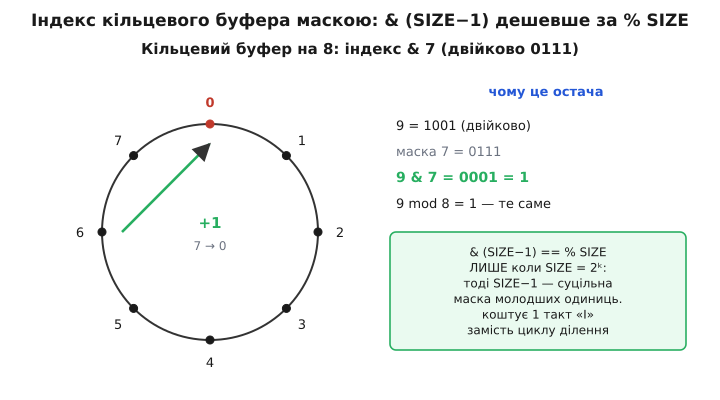
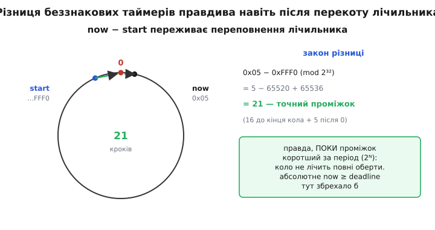

# ⚙️ Три патерни свідомого wrap у прошивці

Теорія кола гарна, аж поки не сядеш писати прошивку — і тоді виявляється, що беззнакове переповнення не десь у стандарті, а прямо в трьох місцях, повз які годі пройти: кільцевий буфер між перериванням і головним циклом, вимір часу на лічильнику, що сам обнуляється, і накопичувальний геш для швидкої перевірки цілості. У кожному з цих місць wrap — не небезпека, якої уникають, а **механізм, на якому все тримається**. Розберімо всі три як інженер: спершу задача й чому наївне рішення програє, тоді ідея, тоді робочий C для мікроконтролера — і, найважливіше, точний список пасток, кожна з яких колись коштувала комусь тижня налагодження.

Спільна нитка одна. У всіх трьох випадках ми свідомо дозволяємо числу перекотитися за модулем `2ᴺ` — і будуємо на тому, що цей перекіт **визначений і однаковий скрізь**. Прибери беззнаковість — і кожен патерн ламається по-своєму: маска дає від'ємний індекс, різниця часу бреше після переповнення, геш утрачає гарантії через невизначену поведінку множення. Тому «`unsigned` тут обов'язковий» — не стильова примха, а умова коректності.

## Патерн 1: кільцевий буфер через маску, а не остачу

**Задача.** Між джерелом даних і споживачем потрібна черга фіксованого розміру. Класика прошивки: обробник переривання UART складає прийняті байти, а головний цикл їх забирає — коли встигне. Черга кільцева (англ. *ring buffer*): дійшов запис до кінця масиву — вертається на початок, затираючи вже прочитане. Два індекси, `head` (куди писати) і `tail` (звідки читати), бігають по колу довжиною з масив. Питання лише в тому, **як** повертати індекс на початок після краю — і саме тут ховається різниця між кодом, що літає, і кодом, що спотикається на кожному елементі.

**Наївна ідея й чому вона програє.** Найпряміше — остача від ділення:

```c
head = (head + 1) % SIZE;
```

Читається чисто, працює правильно — і на мікроконтролері без апаратного ділення коштує десятки тактів щоразу. Річ у тім, що більшість дешевих ядер (Cortex-M0/M0+, AVR, багато RISC-V без розширення `M`) **не мають інструкції ділення взагалі**. Компілятор змушений кликати бібліотечну підпрограму `__aeabi_uidivmod` — цикл на 30–40 тактів. У гарячому обробнику переривання, що спрацьовує на кожен байт на швидкості 1 Мбіт/с, ці такти складаються в помітну частку всього бюджету процесора, витрачену буквально на ділення заради того, щоб «повернути стрілку на початок».

**Ідея.** Якщо розмір буфера — **степінь двійки**, повертати стрілку вміє сам двійковий запис числа, безкоштовно. Візьмімо `SIZE = 256`. Число `256` двійково — це `1 0000 0000`: одиниця й вісім нулів. Остача від ділення на `256` — це просто **молодші вісім бітів** числа, бо все, що вище дев'ятого біта, кратне `256` і при діленні зникає. А відкинути старші біти — це операція «І» з маскою `SIZE − 1 = 255 = 0000 0000 1111 1111`:

```
   value & (SIZE − 1)   ≡   value % SIZE     (тільки коли SIZE = 2ᵏ)
```

Знак «≡» тут не приблизність, а точна тотожність — але **лише для степенів двійки**. Для `SIZE = 100` маска дала б сміття, бо `100` не має вигляду «одиниця й самі нулі», тож молодші біти вже не збігаються з остачею. Зате коли розмір — степінь двійки, обидва боки дають той самий результат, а маска коштує **один такт** проти цілого циклу ділення. Апаратно `AND` — це найпростіше, що вміє процесор.

І тут спрацьовує коло. Індекс `head`, який усе росте й росте, за модулем `2ᴺ` (де `2ᴺ` — розрядність самого типу) сам ходить по колу; маска `& (SIZE − 1)` вирізає з нього коло **потрібної довжини** — рівно розміру буфера. Два кола, вкладені одне в одне: широке коло типу й вузьке коло буфера.


*Кільцевий буфер на 8 комірок. Індекс, що монотонно росте, обрізається маскою `& 7` (двійково `0111`) до молодших трьох бітів — і це рівно позиція на колі з 8 поділок. `& (SIZE−1)` дає той самий результат, що `% SIZE`, але коштує один такт «І» замість циклу ділення. Тотожність діє лише коли `SIZE` — степінь двійки: тоді `SIZE−1` — суцільна маска з молодших одиниць.*

**Робочий код.** Однопродюсер-односпоживач черга (англ. *SPSC* — single producer, single consumer): пише лише переривання, читає лише головний цикл. Це найпоширеніший і найдешевший випадок — на ньому тримається приймання UART, SPI, будь-якого потоку байтів.

```c
#include <stdint.h>
#include <stdbool.h>

#define RB_SIZE 256u                 // ОБОВʼЯЗКОВО степінь двійки
#define RB_MASK (RB_SIZE - 1u)       // 255 = 0x00FF — суцільна маска

static volatile uint8_t  rb_buf[RB_SIZE];
static volatile uint16_t rb_head;    // пише продюсер (ISR)
static volatile uint16_t rb_tail;    // рухає споживач (main)

// --- бік продюсера: викликається з обробника переривання ---
static inline bool rb_push(uint8_t byte) {
    uint16_t next = (rb_head + 1u) & RB_MASK;   // крок по колу маскою
    if (next == rb_tail)                        // наздогнали хвіст — буфер повний
        return false;                           // байт втрачено, але черга ціла
    rb_buf[rb_head] = byte;
    rb_head = next;                             // публікуємо запис ОСТАННІМ
    return true;
}

// --- бік споживача: викликається з головного циклу ---
static inline bool rb_pop(uint8_t *out) {
    if (rb_tail == rb_head)                      // голова = хвіст → порожньо
        return false;
    *out = rb_buf[rb_tail];
    rb_tail = (rb_tail + 1u) & RB_MASK;          // крок по колу маскою
    return true;
}
```

Зверни увагу на кілька свідомих рішень. По-перше, `rb_head` і `rb_tail` — **беззнакові** (`uint16_t`); маска `& RB_MASK` на беззнаковому гарантовано дає число в `[0, SIZE)`, придатне як індекс. По-друге, порожнеча й повнота розрізняються тим, що ми **жертвуємо однією коміркою**: буфер вважається повним, коли `next == tail`, тобто реально в ньому лежить `SIZE − 1` елемент, а не `SIZE`. Це класичний прийом: інакше стан «повно» і стан «порожньо» дали б однакове `head == tail`, і їх годі було б розрізнити без окремого лічильника. По-третє, у `rb_push` запис `rb_head = next` іде **останнім** — споживач бачить нове значення `head` лише після того, як байт уже лежить у пам'яті, тож не прочитає напівзаписану комірку.

> 🔧 **Навіщо це.** Обмеження «розмір — степінь двійки» звучить як дрібне незручне обмеження, але на ділі воно безкоштовно перетворює найгарячіший шлях у прошивці — приймання даних у перериванні — з десятків тактів на один. У бюджеті переривання, що спрацьовує сотні тисяч разів на секунду, це різниця між «встигаємо» і «губимо байти під навантаженням». Тому ledь не всі реальні кільцеві буфери в драйверах роблять розмір степенем двійки саме заради маски.

**Пастки.**

*Розмір не степінь двійки.* Маска `& (SIZE − 1)` тотожна остачі **тільки** для степенів двійки. Пишеш `#define RB_SIZE 200` — і `200 − 1 = 199 = 0xC7 = 1100 0111` уже не суцільна маска: `& 199` викине частину значень і оберне індексацію на кашу, причому тихо, без жодного попередження. Захист простий — статична перевірка на етапі компіляції:

```c
_Static_assert((RB_SIZE & (RB_SIZE - 1u)) == 0u, "RB_SIZE must be a power of two");
```

Вираз `SIZE & (SIZE − 1)` дорівнює нулю **тоді й лише тоді**, коли `SIZE` — степінь двійки (у степеня двійки рівно один одиничний біт; віднявши одиницю, дістаємо всі молодші одиниці й жодного спільного біта з оригіналом). Один рядок — і компілятор не дасть зібрати буфер із «кривим» розміром.

*Знаковий тип індексу.* Якщо оголосити `head` знаковим (`int` замість `uint16_t`), маска ще працюватиме, бо `& (SIZE−1)` для додатних однакова. Але варто десь відняти індекси (`head - tail` для підрахунку заповнення) — і на знаковому при `tail > head` дістанеш **від'ємне** число замість «скільки лежить по колу». На беззнаковому та сама різниця сама довернеться за модулем і дасть правильну кількість. Тому індекси кільцевого буфера — завжди беззнакові.

*Розмір буфера не влазить у тип індексу.* Якщо `SIZE = 256`, а індекс — `uint8_t` (коло рівно на 256), то `head` бігає `0…255` і сам обгортається на 256 — маска навіть не потрібна. Але щойно `SIZE` менше за повне коло типу (скажімо, `SIZE = 64` при `uint8_t`), покладатися на самообгортання типу вже **не можна** — треба маска `& 63`, бо інакше `head` дійде до 255, а не до 63. Тримай у голові: самообгортання типу рятує лише коли розмір буфера **дорівнює** колу типу; у всіх інших випадках коло ріже маска.

Про сам механізм самообгортання лічильника, коли крок за модулем повертає його на початок без жодної перевірки, докладніше — у [FIFO-буфері](topic:programming/fifo-buffer).

## Патерн 2: різниця беззнакових таймерів переживає переповнення

**Задача.** Треба зробити щось раз на `interval` мілісекунд, не блокуючи процесор (жодних `delay()`, що заморожують усе). Джерело часу — вільний лічильник, що тікає вгору: `millis()` на Arduino, `HAL_GetTick()` на STM32, `SysTick` деінде. Проблема в тому, що цей лічильник **скінченний** і періодично сам обнуляється через переповнення: 32-бітний `millis()` доходить до `0xFFFFFFFF` приблизно за 49.7 доби й перекочується в нуль. Наївний код перевірки часу ламається саме на цьому перекоті — і ламається тихо, раз на сім тижнів, у полі, коли пристрій уже давно здано.

**Наївна ідея й чому вона програє.** Найочевидніше — запам'ятати «час, коли треба спрацювати», і чекати, поки годинник його досягне:

```c
uint32_t deadline = millis() + interval;   // коли настане час
// ...
if (millis() >= deadline) { /* пора */ }    // ЛАМАЄТЬСЯ на перекоті!
```

Працює 49 діб, тоді підриває. Уяви, що `millis()` уже близько до стелі: `millis() = 0xFFFFFFF0`, `interval = 100`. Тоді `deadline = 0xFFFFFFF0 + 100`, що за модулем `2³²` перекочується у маленьке число `0x54`. Тепер `millis() >= deadline` — це `0xFFFFFFF0 >= 0x54`, тобто **істина негайно**, і подія спрацьовує на 49 діб раніше, ніж треба. Порівнювати **абсолютні** моменти на лічильнику, що ходить по колу, не можна: після перекоту «пізніший» момент за числом стає меншим за «ранній».

**Ідея.** Не порівнювати абсолютні моменти, а рахувати **скільки минуло** — через різницю. Запам'ятовуємо момент старту й дивимося, чи відстань від нього доросла до інтервалу:

```c
if (millis() - start >= interval) { /* пора */ }
```

Тут ховається краса кола. Різниця `millis() - start` на беззнакових **сама довертає** правильний проміжок навіть тоді, коли між `start` і `millis()` лічильник перескочив через нуль. Хай `start = 0xFFFFFFF0`, а поточний час уже перевалив нуль і дорівнює `0x00000005`. Пряме віднімання:

```
   0x00000005 − 0xFFFFFFF0   (mod 2³²)
 = 0x00000005 − 0xFFFFFFF0 + 2³²
 = 5 − 4294967280 + 4294967296
 = 21
```

І `21` — це **правильний** проміжок: від `…F0` до кінця кола рівно 16 кроків, плюс 5 після нуля, разом 21. Коло само зімкнуло розрив, бо віднімання за модулем `2ᴺ` не знає й не мусить знати, чи перетнув лічильник нуль між замірами — воно повертає кутову відстань по колу, а вона однакова хоч із перекотом, хоч без.

**Умова коректності: інтервал коротший за період.** Це працює за однієї умови, і її треба тримати свідомо. Різниця дає правильну відповідь **лише поки справжній проміжок не перевищив повного періоду лічильника** (`2ᴺ`). Причина проста: коло не пам'ятає, скільки повних обертів минуло. Якщо між `start` і поточним моментом лічильник обійшов коло **більш ніж раз**, різниця покаже лише залишок останнього неповного оберту — і збреше. Для 32-бітного `millis()` період — майже 50 діб, тож будь-який здоровий інтервал (секунди, хвилини, години) безпечний із гігантським запасом. А от для 16-бітного апаратного лічильника, що на частоті 1 МГц обертається за 65.5 мс, інтервал у 100 мс уже **не влізе** в період — і патерн зламається. Правило: **інтервал мусить бути помітно меншим за період лічильника**; якщо ні — бери ширший лічильник.


*Вимір проміжку через різницю беззнакових. Лічильник перекотився: `start = 0xFFFFFFF0`, `now = 0x00000005`. Пряме `now − start` за модулем `2³²` дає `21` — точний проміжок (16 кроків до кінця кола плюс 5 після нуля). Абсолютне порівняння `now >= deadline` тут збрехало б, бо після перекоту `now` числом менше за `deadline`. Різниця правдива, поки справжній проміжок коротший за повний період лічильника.*

**Робочий код.** Неблокуюча періодична дія — кістяк кооперативної багатозадачності в прошивці:

```c
#include <stdint.h>
#include <stdbool.h>

// повертає true рівно раз на кожні period_ms, не блокуючи цикл
static bool every(uint32_t *last, uint32_t period_ms) {
    uint32_t now = millis();
    if (now - *last >= period_ms) {   // різниця переживає перекіт лічильника
        *last += period_ms;           // += period, а не = now — без дрейфу фази
        return true;
    }
    return false;
}

void loop(void) {
    static uint32_t t_blink = 0;
    static uint32_t t_sensor = 0;

    if (every(&t_blink, 500u))   toggle_led();        // блимати двічі на секунду
    if (every(&t_sensor, 100u))  read_sensor();       // опитувати давач 10 Гц

    // ... тут крутиться решта роботи, ніщо не заблоковане ...
}
```

Тонкість у рядку `*last += period_ms` замість `*last = now`. Якщо оновлювати опорну точку поточним часом (`= now`), то кожне спрацювання накопичує похибку: між перевірками `now` встиг перевалити поріг на кілька мілісекунд, і ці крихти складаються в дрейф — за годину блимання «попливе». Додаючи ж рівно `period_ms`, ми прив'язуємо наступний момент до **сітки** з кроком `period_ms`, і середня частота лишається точною, навіть якщо окреме спрацювання трохи запізнилося. (Обидві дії — `+= period_ms` і `- *last` — беззнакові, тож перекіт лічильника їм не страшний.)

> 🔧 **Навіщо це.** Патерн `now - start >= interval` — фундамент усієї неблокуючої логіки часу в прошивці: без нього доводиться або блокувати процесор затримками (і тоді ніщо інше не встигає), або писати крихкий код з абсолютними дедлайнами, що підриваються раз на 50 діб. Одна беззнакова різниця дає багатозадачність на одному циклі — і переживає переповнення лічильника без жодного `if`. Ширше про це — у [неблокуючому часі](topic:programming/nonblocking-time).

**Пастки.**

*Знаковий тип лічильника.* Це головна пастка патерну. Якщо `millis()` чи опорна змінна оголошені знаковим типом (`int32_t`, або просто `int` на 32-бітній платформі), різниця `now - start` на перекоті стає **знаковим переповненням** — а це [невизначена поведінка](topic:programming/undefined-behavior). Оптимізатор має право припустити, що її не буває, і згорнути твою логіку в непередбачуване. Хай усе — `now`, `start`, тип різниці — буде беззнаковим (`uint32_t`). Тоді перекіт визначений, і різниця правдива.

*Змішування розрядностей.* Якщо `millis()` повертає `uint32_t`, а опорну змінну ти оголосив `uint16_t` (заощаджуючи пам'ять), різниця порахується не в тій ширині, і коло вийде не того розміру. Тримай **однакову** розрядність в обох операндах різниці й у самому лічильнику.

*Занадто довгий інтервал.* Уже сказано, але це найпідступніше. Патерн мовчки бреше, коли інтервал наближається до періоду лічильника. На 32-бітному `millis()` це майже неможливо (50 діб), тому там про пастку часто й не думають — і саме тому вона кусає, коли той самий код переносять на 16-бітний апаратний таймер, де період — десятки мілісекунд. Завжди звіряй: інтервал **набагато** менший за `2ᴺ` кроків лічильника? Механізм самого переповнення лічильника й того, як період пов'язаний з розрядністю, розібрано в [періоді й переповненні](topic:programming/timer-overflow).

## Патерн 3: накопичувальний геш із множенням за модулем 2³²

**Задача.** Треба швидко звести довільний блок байтів — рядок, ключ, вміст пакета, образ прошивки — до одного числа фіксованої ширини, що добре **розкидане**: схожі входи дають несхожі числа, а розподіл рівномірний. Це потрібно всюди: як індекс у геш-таблиці, як швидка контрольна сума «чи не побилися дані», як відбиток для порівняння. Не криптографія (проти зумисної підробки це не захист), а дешеве, дуже швидке перемішування бітів. І тут беззнаковий wrap — **не побічний ефект, а сам двигун**: без переповнення множення геш узагалі не працював би.

**Ідея.** Візьмімо FNV-1a — геш Фаулера-Нолла-Во, варіант «a». Історія в нього доладна: основу подали Ґлен Фаулер і Кім-Фонг Во як зауваження рецензентів до комітету IEEE POSIX 1003.2 ще 1991 року, а Лендон Курт Нолл у наступному раунді голосування алгоритм поліпшив — звідси три прізвища в назві (усталений факт, задокументований у специфікації FNV). Варіант «1a» відрізняється від початкового «1» лише **порядком** двох дій (спершу XOR, потім множення — не навпаки) і дає трохи кращу лавину, тобто сильнішу залежність кожного вихідного біта від кожного вхідного. Алгоритм навмисно **не криптографічний**: автори прямо казали, що він для геш-таблиць і контрольних сум, не для захисту.

Механізм — два кроки на кожен байт, і обидва тримаються на переповненні:

```
   hash = OFFSET_BASIS                         // стартове зерно
   для кожного байта b:
       hash = hash XOR b                       // домішуємо байт
       hash = hash × FNV_PRIME  (mod 2³²)      // розганяємо по всьому слову
```

XOR вкидає новий байт у молодші біти. Множення на велике просте число `FNV_PRIME` — це і є перемішування: добуток регулярно перевалює за `2³²`, старші біти «завертаються» назад у молодші за модулем, і за кілька кроків кожен вхідний біт устигає вплинути на всі 32 вихідні. Саме **перекіт за модулем 2³²** розганяє інформацію по всьому слову — без нього множення просто роздувало б число, а біти не змішувалися б по колу.

Константи для 32-бітного FNV не випадкові й фіксовані специфікацією (усталені значення):

```
   OFFSET_BASIS = 2166136261   = 0x811C9DC5
   FNV_PRIME    = 16777619     = 0x01000193
```

**Робочий код.** Компактний, без жодного стану поза `hash` — ідеально для мікроконтролера:

```c
#include <stdint.h>
#include <stddef.h>

#define FNV_OFFSET_32  2166136261u    // 0x811C9DC5
#define FNV_PRIME_32   16777619u      // 0x01000193

uint32_t fnv1a_32(const uint8_t *data, size_t len) {
    uint32_t hash = FNV_OFFSET_32;
    for (size_t i = 0; i < len; i++) {
        hash ^= data[i];              // XOR молодшого байта
        hash *= FNV_PRIME_32;         // множення з wrap за модулем 2³² — НАВМИСНЕ
    }
    return hash;
}
```

Уся сіль — у рядку `hash *= FNV_PRIME_32`. Кожне таке множення реально перевалює за `2³²`, і молодші 32 біти добутку (те, що лишає беззнаковий wrap) — це і є новий стан геша. Суфікс `u` на константах критичний: він робить їх беззнаковими, тож усе множення йде у світі `unsigned int`, де перекіт визначений. Прибери `u` — і константа стане знаковим `int`, а множення на перекоті обернеться на UB.

Для потокових даних, що надходять шматками (пакет за пакетом, блок флешу за блоком), геш легко зробити **інкрементним** — годувати його порціями, тримаючи стан між викликами:

```c
// ініціалізація
uint32_t h = FNV_OFFSET_32;

// на кожен новий шматок (можна кликати скільки завгодно разів)
static uint32_t fnv1a_update(uint32_t h, const uint8_t *chunk, size_t n) {
    for (size_t i = 0; i < n; i++) {
        h ^= chunk[i];
        h *= FNV_PRIME_32;
    }
    return h;                          // передаси назад у наступний виклик
}
```

Стан геша — одне 32-бітне число, тож рахувати відбиток кілобайтного образу можна на ходу, ніде не тримаючи весь блок у пам'яті одразу. Це саме те, чого треба на пристрої з кількома кілобайтами RAM: перевіряти цілість прошивки, що не влазить у пам'ять цілком.

> 🔧 **Навіщо це.** FNV-1a — це десять рядків, що дають робочу контрольну суму й індекс геш-таблиці там, де повноцінний CRC чи криптогеш надто важкі, а хочеться швидко зловити зіпсовані дані чи розкидати ключі по кошиках. У прошивці його ставлять на перевірку конфігурації в EEPROM, на швидке порівняння «чи змінився блок», на дешевий відбиток пакета. І весь двигун — одне беззнакове множення, що свідомо перекочується за модулем `2³²`.

**Пастки.**

*Знаковий тип ламає алгоритм.* Найголовніше. FNV **вимагає** беззнакового множення за модулем `2³²`. На знаковому `int32_t` кожне `hash *= prime`, що перевалює `INT_MAX`, — [невизначена поведінка](topic:programming/undefined-behavior); компілятор має право зробити з нею будь-що, і геш утрачає всі гарантії — від «інші числа на іншому оптимізаторі» до тихого краху. Тип стану — тільки `uint32_t`, константи — тільки з суфіксом `u`.

*Просування вузького типу.* Тонка й підступна. У рядку `hash ^= data[i]` елемент `data[i]` типу `uint8_t` перед XOR **просувається** до `int` — і на щастя, тут це нешкідливо, бо `hash` уже `uint32_t`, тож результат XOR однаково стає `uint32_t`. Але якби хтось спробував будувати геш на **вузькому** стані (`uint16_t hash`), просування до `int` зруйнувало б і модуль (він став би `2³²`, а не `2¹⁶`), і потенційно завело б у знакове UB на множенні. Стан геша тримай **не вужчим за `unsigned int`** — саме тому канонічна ширина FNV починається з 32 біт. Механізм самого просування, через яке вузькі типи мовчки стають `int`, розібрано в [просуванні цілих типів](topic:programming/integer-promotion).

*Плутанина FNV-1 та FNV-1a.* Це не про переповнення, а про коректність. Варіанти відрізняються **порядком** XOR і множення: FNV-1 множить, потім XOR-ить; FNV-1a — навпаки. Помінявши місцями два рядки, дістанеш інший (гірший за лавиною) геш, який не збіжиться з еталонними тестовими векторами FNV-1a. Якщо два боки (скажімо, пристрій і сервер) рахують геш різними варіантами — відбитки ніколи не зійдуться, і перевірка цілості завжди «провалюватиметься» на цілих даних. Тримайся одного варіанта на обох кінцях.

*Не криптографія.* FNV-1a легко піддається зумисному підбору колізій — хто хоче, підбере два різні входи з однаковим гешем. Проти **випадкового** псування (шум у лінії, збій флешу) він годиться як дешева контрольна сума, але захищати ним підпис прошивки чи будь-що проти зловмисника не можна. Де потрібен стійкий до підробки відбиток — беруть криптографічний геш; де потрібна сильна контрольна сума з гарантіями на виявлення пакетних помилок — [CRC](topic:programming/crc-in-firmware), у якого математика розрахована саме на це.

## Спільний висновок: коло як інструмент, а не аварія

Три патерни, одна суть. У кільцевому буфері маска `& (SIZE−1)` вирізає з широкого кола беззнакового індексу вузьке коло розміром із буфер — і робить це за один такт замість ділення, бо остача від степеня двійки й є молодші біти. У вимірі часу різниця `now − start` замикає розрив, що лишає переповнення лічильника, і повертає правдивий проміжок без жодної перевірки на перекіт — поки інтервал коротший за період. У гешах множення за модулем `2³²` навмисно перекочується, і саме цей перекіт розганяє біти по всьому слову.

І в усіх трьох випадках беззнаковість — не оздоба, а умова коректності, бо знаковий тип ламає кожен патерн по-своєму: маска дає від'ємний індекс при відніманні, різниця часу на перекоті стає невизначеною поведінкою, множення геша на перекоті — теж UB. Плюс наскрізна пастка, спільна для всіх: гарантія модуля живе у **ширині обчислення**, тож вузькі `uint8_t`/`uint16_t`, що мовчки просуваються до `int`, треба свідомо приводити до широкого беззнакового там, де на модуль справді розраховуєш. Коло — тверда й передбачна опора рівно доти, доки ти сам обрав на ньому стояти.
