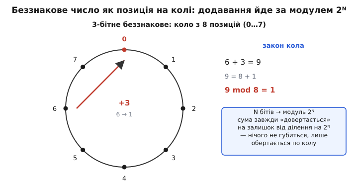
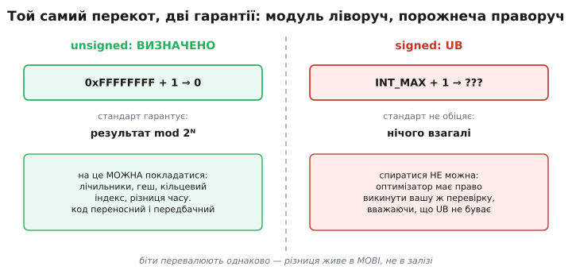
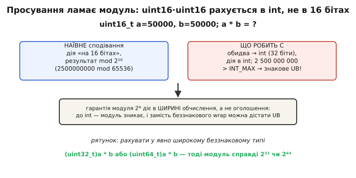

# Беззнакове переповнення і модульна арифметика

<preknowlist>
- [Доповняльний код](book:math/twos-complement-algebra) — як біти кодують ціле, і чому додавання йде однаково для знакових і беззнакових.
- [Модульна арифметика](book:math/modular-arithmetic) — залишки від ділення, запис `a ≡ b (mod m)`, дії «по колу».
- [Просування цілих типів у C/C++](book:programming/integer-promotion) — чому вузькі типи (`uint8_t`, `uint16_t`) перед арифметикою підіймають до `int`.
- [Невизначена поведінка (UB)](book:programming/undefined-behavior) — коли стандарт не обіцяє нічого й компілятор має право припускати, що ситуації не буває.
</preknowlist>

Є одна операція в C, на яку можна беззастережно **покластися** там, де майже все інше — пастка. Додайте одиницю до найбільшого можливого беззнакового числа, і воно стане нулем. Не «зазвичай нулем», не «на цьому процесорі нулем» — а нулем **за гарантією стандарту**, на будь-якому залізі, під будь-якою оптимізацією. `0xFFFFFFFFu + 1` — це рівно `0`, і крапка. Ця обіцянка виглядає дрібницею, аж поки не усвідомиш: та сама дія над **знаковим** числом — [невизначена поведінка](book:programming/undefined-behavior), яка має право зруйнувати всю програму. Одна арифметика тверда як камінь, майже ідентична на вигляд — бездонна яма.

Різницю дає одне поняття, старіше за комп'ютери на два століття: **модульна арифметика**. Беззнакове ціле в C — це не «число, яке може зламатися при переповненні». Це число, що живе **на колі**, і «переповнення» для нього — не аварія, а нормальний, визначений спосіб існування. Розберімо, чому так, як цим користуватися свідомо, і де ховається єдина справжня пастка — тиха, і зовсім не там, де її очікуєш.

## Число на колі, а не на прямій

Почнімо з інтуїції, бо на ній тримається все інше. Звичне ціле ми уявляємо на **прямій**: ліворуч від'ємні, праворуч додатні, і що більше додаєш — то далі йдеш. Беззнакове машинне ціле влаштоване інакше: воно живе не на прямій, а на **колі**. Уяви циферблат, тільки поділок на ньому не дванадцять, а `2ᴺ`, де `N` — кількість бітів: 256 поділок для восьмибітного, понад чотири мільярди для тридцятидвобітного. Додати число — крутнути стрілку за годинниковою на стільки поділок. Дійшла до останньої — наступний крок повертає її в нуль. Ніякого «краю», за який можна впасти: коло замкнене.


*Трибітне беззнакове число — позиція на колі з 8 поділок (0…7). Додавання — крок за годинниковою стрілкою; коли сума переростає 8, стрілка «довертається» на залишок від ділення на 8. 6 + 3 = 9, а 9 = 8 + 1, тож на колі це позиція 1. Нічого не губиться — число просто обертається за модулем 2ᴺ.*

Ось і весь секрет. **Беззнакове переповнення** (англ. *unsigned overflow*) — це просто те, що стрілка перейшла через нуль. Математики назвали б це роботою **за модулем**: результат зводиться до залишку від ділення на `2ᴺ`. Запис `9 ≡ 1 (mod 8)` читається «дев'ять конгруентне одиниці за модулем вісім» — тобто на колі з восьми поділок дев'ять і одиниця стоять на **тому самому** місці. Саме за таким законом і рахує процесор беззнакові числа, і саме цей закон стандарт C зробив **обіцянкою**.

> 🔧 **Навіщо це.** Щойно ти бачиш беззнакове число як позицію на колі, зникає весь страх перед його «переповненням». Лічильник, що дійшов до максимуму й обнулився, не «зламався» — він зробив рівно те, що коло й має робити. Уся практика нижче — кільцеві буфери, вимір часу, геші — це просто **використання кола за призначенням** замість боротьби з ним.

## Обіцянка стандарту: чому саме беззнакове визначене

Тепер найважливіше — не просто «так буває», а **чому мова це гарантує**, тоді як знакове переповнення лишає невизначеним. Стандарт C формулює беззнакову арифметику дослівно так: обчислення, результат якого не вміщається в беззнаковий тип, **зводиться за модулем числа, на одиницю більшого за найбільше представне значення цього типу**. Для `N`-бітного типу це число — рівно `2ᴺ`. Тобто мова не каже «результат непередбачуваний» — вона **називає точну відповідь**: залишок за модулем `2ᴺ`. Ця вимога стоїть у стандарті з самого початку, від C89, і жоден пізніший перегляд її не чіпав.

Чому саме беззнаковому пощастило? Бо для нього **немає жодної неоднозначності**. Усі біти рівноправні, найстарший нічого «особливого» не означає, і будь-який процесор, який узагалі вміє додавати, при переповненні поводиться однаково: молодші `N` бітів результату — це і є відповідь, а зайвий біт переносу просто випадає. Різних апаратних тлумачень тут не існує, тож стандартові було безпечно зафіксувати єдину поведінку — вона й так однакова скрізь.

Зі знаковим усе було інакше. У 1970-х різне залізо по-різному кодувало від'ємні числа й по-різному реагувало на переповнення знакового. Прописати єдиний закон означало б або зламати частину машин, або сповільнити всіх. Тому знакове переповнення оголосили [невизначеною поведінкою](book:programming/undefined-behavior), а компілятор дістав право припускати, що його **взагалі не буває** — і будувати на цьому швидкий код. Цікаво, що навіть сучасні стандарти (C++20 і C23), які нарешті **зобов'язали** кодувати від'ємні числа [доповняльним кодом](book:math/twos-complement-algebra), знакове переповнення лишили невизначеним: не через кодування, а свідомо — заради оптимізацій, які спираються на припущення «UB не трапляється».


*Дві майже однакові операції, дві протилежні гарантії. Беззнакове: `0xFFFFFFFF + 1 → 0` — стандарт обіцяє результат за модулем `2ᴺ`, і на це можна свідомо покладатися. Знакове: `INT_MAX + 1 → ???` — стандарт не обіцяє нічого, і оптимізатор має право викинути навіть вашу власну перевірку. На рівні бітів обидва перевалюють однаково; різниця живе в мові, не в залізі.*

Практичний висновок гострий: **свідомий wrap роби на беззнакових типах, ніколи на знакових**. Спроба «зловити» знакове переповнення після факту — приречена: перевірку `if (x + 1 < x)` компілятор має право стерти, бо «знакове не переповнюється, отже умова завжди хибна». Беззнакове ж чесно перекочується за модулем — і на цьому можна будувати логіку. Це і є вододіл між [загальним переповненням як багом](book:programming/overflow-wraparound) і беззнаковим переповненням як **інструментом**.

## Wrap за призначенням: три робочі приклади

Абстракція оживає, коли коло починає працювати на тебе. Ось три взірцеві місця, де беззнакове переповнення — не загроза, а точно те, чого треба.

**Різниця часу через переповнення лічильника.** Найкрасивіший приклад. Таймер мікроконтролера — це беззнаковий лічильник, що тікає вгору й періодично [сам обнуляється через переповнення](book:programming/timer-overflow). Здавалося б, як виміряти проміжок, якщо між двома замірами лічильник міг перескочити через нуль? Відповідь: беззнакове віднімання **саме все довертає**.

```c
#include <stdint.h>

uint32_t start = millis();          // момент старту
// ... щось відбувається, лічильник може перевалити через 0 ...
uint32_t elapsed = millis() - start;  // проміжок — ВІРНИЙ навіть після wrap
```

Хай `start = 0xFFFFFFF0`, а поточний час уже перевалив через нуль і дорівнює `0x00000005`. Пряме віднімання `0x00000005 − 0xFFFFFFF0` у беззнакових дає — за модулем `2³²` — рівно `0x15`, тобто 21. І це **правильний** проміжок: від `…F0` до кінця кола 16 кроків, плюс 5 після нуля, разом 21. Коло саме зімкнуло розрив. Умова одна: справжній проміжок не довший за повний період лічильника — інакше стрілка обійшла коло більш ніж раз, і різниця збреше. Саме тому неблокуючі затримки пишуть як `now − start >= interval` на беззнакових, а інтервал тримають у безпечних межах діапазону.

**Індекс кільцевого буфера через маску.** У [кільцевому буфері](book:programming/timer-overflow) запис іде по колу: дійшов до кінця — вертайся на початок. Якщо розмір буфера — степінь двійки, беззнакове переповнення робить обгортання **безкоштовно**.

```c
#define SIZE 256                  // степінь двійки
uint8_t  buf[SIZE];
uint8_t  head = 0;                // 8-бітний індекс: коло рівно на 256

buf[head] = value;
head = head + 1;                  // 255 + 1 = 0 — само вернулося на початок
```

Тут `head` типу `uint8_t` — коло довжиною рівно 256, під розмір буфера. Після 255 наступний `head + 1` за модулем `2⁸` дає 0, і індекс сам стрибає на початок без жодного `if (head >= SIZE) head = 0`. Для ширших індексів той самий ефект дає маска `head = (head + 1) & (SIZE − 1)` — молодші біти і є позицією на колі. Обидва прийоми того самого роду [свідомого wrap у прошивці](book:programming/unsigned-overflow/proj-modular-patterns.md) варті окремого практичного розбору.

**Змішування бітів у гешах і контрольних сумах.** Геш-функції та контрольні суми навмисно **накопичують** значення з переповненням: кожен байт домішується, сума перекочується за модулем, і саме це «перемішування по колу» дає добрий розкид.

```c
uint32_t hash = 2166136261u;          // FNV-1a, стартове значення
for (size_t i = 0; i < len; i++) {
    hash ^= data[i];
    hash *= 16777619u;                // множення з wrap за модулем 2^32 — навмисне
}
```

Множення `hash * 16777619u` раз у раз перевалює за `2³²`, і це **закладено в алгоритм**: без переповнення геш не працював би. Тут беззнаковий wrap — не побічний ефект, а сам механізм. Спробуй зробити це на знаковому типі — і кожне множення стане UB, а алгоритм втратить будь-які гарантії.

## Єдина справжня пастка: просування ламає модуль

Тепер — найважливіше застереження, бо саме тут гине інтуїція, і баг виходить тихий. Гарантія «результат за модулем `2ᴺ`» справджується не для типу, який ти **оголосив**, а для типу, у ширині якого дія **насправді рахується**. А ці два типи — часто різні, через [просування цілих](book:programming/integer-promotion).

Правило C невблаганне: будь-який цілий тип, вужчий за `int`, перед арифметикою мовчки підіймається до `int`. Тож `uint8_t` і `uint16_t` **ніколи** не рахуються у своїй ширині — вони стають `int` (зазвичай 32 біти), і дія йде в 32-бітному, **знаковому** світі. Модуль `2⁸` чи `2¹⁶`, на який ти сподівався, там просто не існує.


*Найтихіший баг цілої теми. `uint16_t a=50000, b=50000; a*b` — наївно чекаєш дію «на 16 бітах» за модулем `2¹⁶`. Насправді обидва операнди підіймаються до `int`, множення йде в `int`, а `50000·50000 = 2 500 000 000` переростає `INT_MAX` (≈2.1 млрд) — і це вже **знакове UB**, а не безпечний беззнаковий wrap. Гарантія модуля діє у ширині обчислення, не оголошення. Рятунок — приведення до явно широкого беззнакового: `(uint32_t)a * b`.*

Розберемо, чому це так підступно. Ти пишеш дію над беззнаковими байтами, свідомо розраховуючи на безпечний wrap за модулем — а дістаєш або несподіване значення (бо модуль виявився `2³²`, а не `2⁸`), або взагалі невизначену поведінку (бо проміжний добуток переріс `int`). Обидва наслідки тихі: попередження за замовчуванням немає, під `-O0` часто «випадково працює», а зламатися може під оптимізацією чи на іншій ширині `int`.

**Множення двох беззнакових байтів дає не те, що здається.**

```c
#include <stdint.h>
#include <stdio.h>

int main(void) {
    uint8_t a = 200, b = 200;
    uint8_t r = a * b;            // очікуєш «модуль 256»?
    // насправді: a,b → int; 200*200 = 40000 (в int, влазить);
    // потім 40000 присвоюється uint8_t → аж ТУТ модуль 256 → 64
    printf("%u\n", r);           // 64

    uint16_t x = 50000, y = 50000;
    uint32_t big = x * y;        // x,y → int; 2.5 млрд > INT_MAX → UB!
    printf("%u\n", big);         // формально невизначено
    return 0;
}
```

Перший випадок ще щасливий: `200*200 = 40000` вміщається в `int`, тож UB немає, а модуль `2⁸` спрацьовує **аж на присвоєнні** назад у `uint8_t` — і дає 64. Другий — небезпечний: `50000*50000` переростає `int`, і множення стає знаковим UB **ще до** будь-якого присвоєння; те, що ти складаєш результат у `uint32_t`, уже нічого не рятує.

> 🔧 **Навіщо це.** Правило, яке варте всієї статті: **гарантія беззнакового wrap діє тільки в ширині обчислення, а не оголошення**. Якщо хочеш надійний модуль `2³²` чи `2⁶⁴`, зроби так, щоб дія **справді** йшла в цій ширині: приведи хоча б один операнд до `unsigned int`/`uint32_t`/`uint64_t` **перед** операцією — `(uint32_t)a * b`, `(uint64_t)x * y`. Тоді просування вже не зіштовхне тебе в знаковий `int`, і коло матиме той розмір, на який ти розраховуєш. Для типів `unsigned int` і ширших пастки немає — вони не вужчі за `int`, тож не просуваються, і модуль `2ᴺ` працює одразу.

## Коло — це не завжди те, що треба

Насамкінець — тверезість. Визначеність беззнакового wrap не означає, що він завжди **бажаний**. Коло чудове, коли обгортання закладене в задум; воно ж стає джерелом дивних багів, коли величина за змістом не повинна ходити по колу.

Класичний випадок — **зворотний цикл на беззнаковому лічильнику**. Написати `for (size_t i = n - 1; i >= 0; i--)` — означає зациклитися назавжди: `size_t` беззнаковий, тож `i >= 0` **завжди** істина, а коли `i` доходить до нуля, наступний `i--` перекочує його в гігантське число замість «стати від'ємним». Тут коло, якого ти не хотів, тихо ламає логіку. Так само `a - b` на беззнакових, коли `b > a`, дасть не «від'ємне число», а величезне додатне за модулем — і подальше порівняння збреше.

Коли обгортання за змістом небажане, у тебе три виходи, залежно від наміру. Якщо величина просто **не мусить** вилазити за межу — бери [тип, ширший за очікуваний діапазон](book:programming/integer-types-c), із запасом. Якщо треба, щоб значення **впиралося** в стелю, а не перекочувалося (звук, графіка, керовані величини), — це [насичувальна арифметика](book:programming/saturating-arithmetic): `255 + 1 = 255`, стрілка застигає на межі. А якщо переповнення взагалі неприпустиме як помилка — перевіряй межу **до** дії або лови її через `__builtin_add_overflow` та рідні засоби. Беззнаковий wrap — потужний інструмент рівно тоді, коли він **свідомий вибір**, а не несподіванка від того, що тип випадково виявився беззнаковим.

> 🔧 **Навіщо це.** Тримай у голові просту розвилку. Обгортання **потрібне** (лічильник по колу, кільцевий індекс, різниця часу, геш) → беззнаковий тип, і покладайся на модуль сміливо. Обгортання **шкодить** (зворотний цикл, віднімання, де можливе `b > a`, накопичення, що не має ходити по колу) → ширший тип, насичення або перевірка до дії. Помилка майже завжди одна: величину лишили беззнаковою «бо не буває від'ємних», не подумавши, що коло замкнеться саме там, де цього не чекаєш.

---

Головне. **Беззнакове ціле в C живе на колі з `2ᴺ` позицій**, і його «переповнення» — не аварія, а нормальна робота **за модулем `2ᴺ`**: стандарт **гарантує** результат як залишок від ділення на `2ᴺ`, однаково на будь-якому залізі й під будь-якою оптимізацією. Це протилежність знаковому переповненню, яке лишається [невизначеною поведінкою](book:programming/undefined-behavior) — на нього спиратися не можна ніколи, свідомий wrap роби тільки на беззнакових типах. Визначеність кола робить його **інструментом**: різниця часу через wrap лічильника працює вірно навіть після переповнення; індекс кільцевого буфера обгортається безкоштовно (`255 + 1 = 0` або маска `& (SIZE−1)`); геші й контрольні суми навмисно перемішують значення за модулем. Єдина справжня пастка тиха й не там, де очікуєш: **гарантія модуля діє в ширині обчислення, а не оголошення** — вузькі `uint8_t`/`uint16_t` [просуваються](book:programming/integer-promotion) до `int` і рахуються в 32-бітному знаковому світі, тож модуль `2⁸`/`2¹⁶` зникає, а проміжний результат може дати навіть UB; рятунок — приводити операнд до явно широкого беззнакового (`(uint32_t)a * b`) перед дією. І коло не завжди бажане: коли обгортання за змістом шкодить (зворотний цикл, `a − b` при `b > a`), бери ширший тип, [насичення](book:programming/saturating-arithmetic) чи перевірку до операції. Беззнаковий wrap — сила рівно тоді, коли він свідомий вибір.
