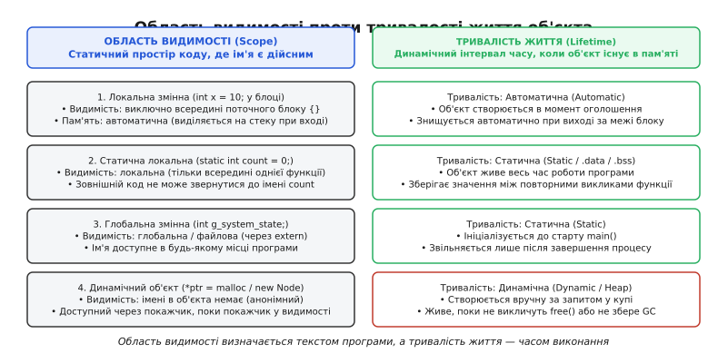
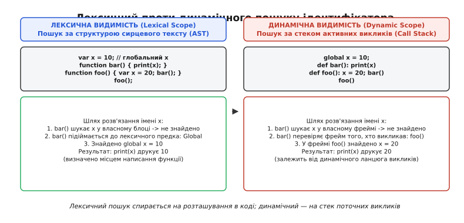
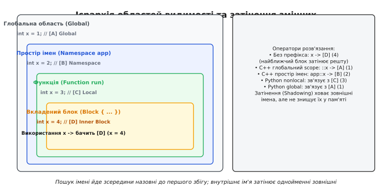
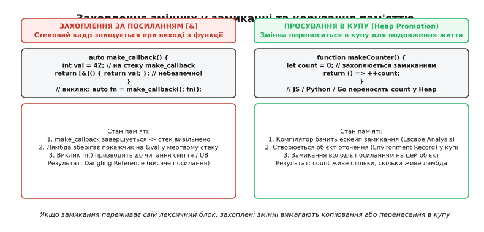

# Область видимості змінної: де ім'я має значення

<preknowlist>
- [Стек](book:programming/stack-lifo) — організація активаційних кадрів функцій та автоматична пам'ять.
- [Купа](book:programming/heap-dynamic-memory) — динамічне виділення та час життя об'єктів без прив'язки до стека.
- [Компіляція](book:programming/compilation) — трансляція коду, таблиці символів та резолвінг імен.
- [Функції як значення першого класу](book:programming/first-class-functions) — передача функцій як аргументів та повернення результатів.
</preknowlist>

Коли мережевий сервер реєструє десять асинхронних обробників у циклі `for (var i = 0; i < 10; i++) { queue.push(() => process(i)); }`, розробник очікує, що кожен обробник отримає власний номер від `0` до `9`. Натомість під час спрацьовування всі десять функцій передають значення `10`. Помилка криється в тому, що ключове слово `var` прив'язує ім'я `i` не до тіла ітерації циклу, а до всієї зовнішньої функції: усі десять замикань ділять між собою єдину фізичну комірку пам'яті, де наприкінці циклу опиняється число `10`. 

Ще небезпечніша ситуація виникає в системному програмуванні, коли функція повертає покажчик на внутрішній буфер `return &buffer;`. Текстове ім'я `buffer` зникає відразу після виходу з блоку, але покажчик продовжує вказувати на ділянку пам'яті, яку наступний виклик операційної системи або іншої підпрограми перезапише випадковими даними.

Щоб компілятор і процесор могли коректно перетворювати рядки сирцевого коду на послідовності машинних інструкцій, мови програмування спираються на два фундаментальні поняття: **область видимості** (*scope*, від грец. *skopein* — «дивитися, спостерігати») та **тривалість життя** (*lifetime* / *storage duration*). 

---

### Область видимості проти тривалості життя

Область видимості та тривалість життя об'єкта часто плутають, оскільки для простих локальних змінних їхні межі збігаються. Проте вони описують зовсім різні площини роботи програми:

1. **Область видимості (Scope)** — це *статична просторова* властивість сирцевого тексту. Це зона абстрактного синтаксичного дерева (AST), у межах якої певний ідентифікатор (ім'я змінної, функції чи типу) є доступним для компілятора під час трансляції або для інтерпретатора під час розбору. Область видимості існує виключно під час компіляції та аналізу тексту.
2. **Тривалість життя (Lifetime / Storage Duration)** — це *динамічна часова* властивість ділянки пам'яті або об'єкта під час виконання програми. Це інтервал реального часу процесора — від моменту виділення фізичної пам'яті (та виклику конструктора) до моменту її звільнення (і виклику деструктора).


*Двовимірний простір керування даними. Область видимості задає межі доступності текстового імені в коді, тоді як тривалість життя визначає інтервал існування байтів у фізичній пам'яті (стек, купа або статичний сегмент).*

Ці два виміри є ортогональними. Будь-яка змінна у програмі потрапляє в один із чотирьох квадрантів:

| Квадрант | Область видимості (Scope) | Тривалість життя (Lifetime) | Де зберігається | Приклад синтаксису |
| :--- | :--- | :--- | :--- | :--- |
| **Локальна автоматична** | Блокова (тільки всередині `{ ... }`) | Автоматична (до виходу з блоку) | [Стек](book:programming/stack-lifo) або регістри CPU | `int x = 42;` у тілі функції |
| **Локальна статична** | Блокова (ім'я замкнене у функції) | Статична (весь час роботи процесу) | Секція `.data` або `.bss` | `static int call_count = 0;` |
| **Глобальна** | Файлова або глобальна | Статична (весь час роботи процесу) | Секція `.data` або `.bss` | `int g_app_state = 1;` |
| **Динамічний об'єкт** | Відсутня (об'єкт анонімний) | Динамічна (до явного `free` / GC) | [Купа (Heap)](book:programming/heap-dynamic-memory) | `malloc(sizeof(Node))` / `new Node` |

#### Локальна статична змінна: вузька видимість, нескінченне життя

Яскравим прикладом розділення двох понять є ключове слово `static` для локальної змінної всередині функції.

:::tabs
```c
#include <stdio.h>

int generate_transaction_id(void) {
    // Область видимості: локальна (тільки всередині generate_transaction_id)
    // Тривалість життя: статична (зберігається в сегменті .data на весь час процесу)
    static int s_id_counter = 1000;
    return ++s_id_counter;
}

int main(void) {
    printf("ID 1: %d\n", generate_transaction_id()); // 1001
    printf("ID 2: %d\n", generate_transaction_id()); // 1002
    
    // Помилка компіляції: s_id_counter недоступний за межами функції
    // s_id_counter = 0; 
    return 0;
}
```
```cpp
#include <iostream>
#include <cstdint>

int32_t generate_transaction_id() noexcept {
    // Область видимості: локальна (тільки всередині generate_transaction_id)
    // Тривалість життя: статична (зберігається в сегменті .data на весь час процесу)
    static int32_t s_id_counter = 1000;
    return ++s_id_counter;
}

int main() {
    std::cout << "ID 1: " << generate_transaction_id() << '\n'; // 1001
    std::cout << "ID 2: " << generate_transaction_id() << '\n'; // 1002

    // Помилка компіляції: s_id_counter недоступний за межами функції
    // s_id_counter = 0;
    return 0;
}
```
:::

У наведеному прикладі текстовий ідентифікатор `s_id_counter` має суто блокову видимість: спроба звернутися до нього з `main()` викличе помилку компілятора. Проте виділена пам'ять не знищується під час виходу з `generate_transaction_id()`. Змінна зберігає свій стан між викликами, тому що її тривалість життя прив'язана до життєвого циклу всієї програми.

> 🔧 **Навіщо це.** Розділення видимості й часу життя дозволяє реалізувати надійну інкапсуляцію стану. Функція володіє власним персистентним генератором або кешем, захищеним від випадкового перезапису з інших частин програми, без використання небезпечних глобальних змінних.

---

### Лексична проти динамічної області видимості

Коли в тілі функції зустрічається змінна, не оголошена серед її локальних параметрів (так звана *вільна змінна*), середовище виконання або компілятор має визначити, звідки взяти її значення. Існує два протилежні підходи до розв'язання цього завдання.

#### Лексична (статична) видимість (Lexical Scoping)

У мовах із **лексичною областю видимості** місце пошуку ідентифікатора визначається суто структурою вихідного коду — тим, де функція була *написана* в сирцевому тексті.

Компілятор будує ієрархію таблиць символів, орієнтуючись на вкладеність блоків у синтаксичному дереві. Якщо ім'я не знайдено в локальному блоці, алгоритм перевіряє безпосередньо охоплювальний блок коду (Lexical Parent), потім ще вищий, аж до модуля або глобального простору.

Більшість сучасних мов (C, C++, Rust, Go, Java, Python, JavaScript, Swift) використовують лексичну видимість за замовчуванням.

#### Динамічна видимість (Dynamic Scoping)

У мовах із **динамічною областю видимості** значення вільної змінної шукається не за місцем оголошення функції, а за активним ланцюжком викликів на [стеку](book:programming/stack-lifo) — тобто за тим, хто саме *викликав* функцію в поточний момент виконання.


*Порівняння розв'язання вільної змінної. За лексичної видимості bar() звертається до глобального x = 10 за місцем свого тексту. За динамічної видимості bar() читає x = 20 з активаційного кадру викликача foo().*

Детальніше про те, як випадкова реалізація динамічної видимості в інтерпретаторі LISP 1.5 призвела до відкриття фунарної проблеми та створення мови Scheme, описано в [історичній довідці про еволюцію лексичного зв'язування від Algol 60 до Scheme](book:programming/variable-scope/hist-algol-lisp-scoping.md).

#### Чому динамічна видимість майже зникла

Динамічна видимість створює критичні проблеми для надійності програм:
1. **Втрата інкапсуляції та референційної прозорості**: Поведінка підпрограми стає непередбачуваною. Якщо всередині допоміжної функції є змінна `x`, а хтось викликає її з функції, яка теж випадково містить локальну змінну `x`, внутрішні обчислення будуть спотворені значенням викликача.
2. **Неможливість агресивної оптимізації**: Компілятор не може зберегти змінну в регістрі CPU або заінлайнити функцію, оскільки адреса кожної змінної залежить від динамічного графа викликів у рантаймі.

#### Де динамічна видимість збереглася сьогодні

Хоча глобальна динамічна видимість відкинута, її керована форма виявилася незамінною для передачі неявного контексту виконання:

- **Потоково-локальна пам'ять (Thread-Local Storage, TLS)**: Змінні `thread_local` у C++ або `ThreadLocal` у Java мають динамічну прив'язку до поточного потоку виконання ОС.
- **Контекстні змінні в асинхронному коді**: Модуль `contextvars` у Python або `AsyncLocalStorage` у Node.js дозволяють передавати ідентифікатори запитів (*Trace ID* або сесії авторизації) крізь глибокі ланцюжки асинхронних викликів без явної передачі аргументу в кожну функцію.
- **Змінні оточення UNIX**: Дочірній процес автоматично успадковує змінні середовища від процесу, який його породив (`fork`/`exec`), що є прямою формою динамічного зв'язування.

---

### Рівні та ієрархія областей видимості

Простір імен програми організовано у вигляді багаторівневої ієрархії, де кожен внутрішній рівень має доступ до зовнішніх, але не навпаки.


*Ієрархічна вкладеність просторів імен. Внутрішній блок має доступ до всіх батьківських рівнів. Якщо імена збігаються, внутрішнє оголошення [D] затінює однойменні зовнішні [A], [B], [C].*

#### 1. Блоковий рівень (Block Scope)

Блок визначається парою фігурних дужок `{ ... }` у мовах родини C або синтаксичним відступом у Python. Змінні, оголошені всередині блоку, народжуються в точці оголошення і стають недоступними відразу за його закривальною дужкою.

Сюди ж належать заголовки циклів та конструкцій вибору:
- `for (int i = 0; i < N; ++i)` — змінна `i` існує тільки всередині циклу.
- `if (auto* ptr = get_resource(); ptr != nullptr)` (C++17) — змінна `ptr` видима лише у гілках `if` та `else`, що запобігає витоку тимчасових змінних у зовнішню функцію.

#### 2. Функціональний рівень (Function Scope)

У цьому режимі змінна видима в будь-якій точці тіла функції незалежно від того, всередині якого вкладеного блоку `if` чи `while` її було оголошено.

- **JavaScript `var` та Hoisting**: Ключове слово `var` «підіймає» (*hoisting*, від англ. *hoist* — «піднімати лебідкою») оголошення змінної на самий початок функції зі значенням `undefined`. На противагу цьому, сучасні ключові слова `let` та `const` мають строгу блокову видимість і створюють **тимчасову мертву зону** (*Temporal Dead Zone, TDZ*): звернення до змінної до рядка її оголошення призводить до фатальної помилки `ReferenceError`.
- **Python та правило LEGB**: В інтерпретаторі Python пошук змінних виконується за правилом **LEGB**:
  1. **L**ocal — локальний простір функції.
  2. **E**nclosing — простори охоплювальних функцій (лексичні замикання).
  3. **G**lobal — глобальний простір поточного модуля (`.py` файлу).
  4. **B**uilt-in — вбудовані функції мови (`len`, `range`, `print`).

Особливістю Python є те, що будь-яке присвоєння змінній всередині функції за замовчуванням позначає її як локальну для *всього* тіла функції. Якщо спробувати прочитати змінну до рядка присвоєння, Python згенерує помилку `UnboundLocalError`:

```python
x = 10

def mutate():
    # Помилка: UnboundLocalError: local variable 'x' referenced before assignment
    # Оскільки рядок x = 20 зробив 'x' локальною для всієї функції!
    print(x)
    x = 20
```

#### 3. Файловий рівень та одиниця трансляції (File / Translation Unit Scope)

У мовах C та C++ файл сирцевого коду разом з усіма підключеними заголовками утворює [одиницю трансляції](book:programming/translation-unit). 

Якщо глобальна змінна або функція оголошена зі специфікатором `static` (або поміщена в `namespace { ... }` у C++), вона отримує **внутрішнє зв'язування** (*internal linkage*). Ім'я стає локальним секретом цього конкретного `.c`/`.cpp` файлу і не потрапляє у глобальну таблицю символів для лінкера. Інший файл може мати точно таку саму змінну з тим самим іменем без ризику виникнення конфлікту множинного визначення (*Multiple Definition Error*).

#### 4. Простори імен та класи (Namespaces & Classes)

Простори імен (`namespace` у C++, пакети в Java/Go, модулі в Rust) дозволяють групувати логічно пов'язані ідентифікатори та запобігати колізіям у великих бібліотеках.

У C++ для пошуку імен у просторах застосовується двоетапний механізм: звичайний лексичний пошук та **пошук, залежний від аргументів** (*Argument-Dependent Lookup, ADL* або пошук Кеніга). Якщо функція викликається без префікса простору імен, компілятор додатково шукає її в тих просторах імен, до яких належать типи переданих аргументів.

#### 5. Глобальний рівень (Global Scope)

Ідентифікатори, оголошені поза будь-якими функціями чи класами без обмежувальних модифікаторів, є глобальними. Вони доступні з будь-якого місця програми (у C/C++ через оголошення `extern`).

Використання глобальних змінних вважається антипатерном з трьох причин:
1. **Гонки даних (Data Races)**: Глобальний стан вимагає синхронізації м'ютексами в багатопотокових середовищах.
2. **Непередбачуваність залежностей**: Будь-яка функція може приховано змінити стан системи.
3. **Фіаско порядку ініціалізації (Static Initialization Order Fiasco)**: Якщо глобальний об'єкт `A` у файлі `first.cpp` залежить від глобального об'єкта `B` у файлі `second.cpp`, стандарт C++ не гарантує, який із них буде сконструйований першим. Звернення до неініціалізованого об'єкта призводить до аварійного завершення програми ще до входу в функцію `main()`.

---

### Затінення змінних (Variable Shadowing) та розв'язання конфліктів

Коли у внутрішній області видимості оголошується змінна з таким самим іменем, як і в зовнішній, виникає явище **затінення** (*shadowing*, від англ. *shadow* — «тінь»).

Внутрішня змінна перекриває доступ до зовнішньої. Компілятор, шукаючи ідентифікатор знизу вгору по дереву областей, зупиняється на першому знайденому збігу. Зовнішня змінна не знищується і не змінює свого значення в пам'яті — вона просто стає невидимою за коротким іменем.

:::tabs
```c
#include <stdio.h>

int val = 100; // [A] Глобальна змінна

int main(void) {
    int val = 200; // [B] Затінює глобальну [A]
    printf("Local val = %d\n", val); // 200

    {
        int val = 300; // [C] Затінює локальну [B]
        printf("Inner block val = %d\n", val); // 300
    }

    printf("Back to local val = %d\n", val); // 200
    return 0;
}
```
```cpp
#include <iostream>

int val = 100; // [A] Глобальна змінна

int main() {
    int val = 200; // [B] Затінює глобальну [A]
    std::cout << "Local val = " << val << '\n'; // 200

    {
        int val = 300; // [C] Затінює локальну [B]
        std::cout << "Inner block val = " << val << '\n'; // 300
        
        // У C++ унарний оператор :: дозволяє дістатися до глобальної змінної [A]
        std::cout << "Global val via ::val = " << ::val << '\n'; // 100
    }

    std::cout << "Back to local val = " << val << '\n'; // 200
    return 0;
}
```
:::

#### Коли затінення корисне, а коли шкідливе

У системній мові Rust затінення є ідіоматичним інструментом трансформації даних без вигадування штучних імен:

```rust
// Ідіоматичний Rust: трансформація вхідного рядка в число
let input = " 42 ";
let input = input.trim();       // затінює перший input новим типом &str
let input: u32 = input.parse().unwrap(); // затінює числовим типом u32
```

У мовах C, C++ та Java ненавмисне затінення часто стає причиною важковловних багів (наприклад, коли параметр конструктора `int width` затінює поле класу `width`, а розробник забуває написати `this->width = width`). Сучасні компілятори мають спеціальний прапорець попередження `-Wshadow`, який виявляє подібні колізії.

#### Оператори розв'язання конфліктів

Якщо виникає необхідність обійти затінення або явно вказати джерело ідентифікатора, мови надають спеціальні синтаксичні конструкції:

1. **Унарний оператор `::` у C++**: `::x` явно адресує змінну з глобального простору імен, ігноруючи будь-які локальні змінні з іменем `x`.
2. **Кваліфікатори просторів та класів**: `Namespace::x`, `ClassName::x`, `this->member`.
3. **Ключові слова `global` та `nonlocal` у Python**:
   - `global x` повідомляє інтерпретатору, що операції запису повинні модифікувати змінну `x` на рівні глобального модуля.
   - `nonlocal x` зв'язує змінну з найближчою охоплювальною функцією (виключаючи глобальний рівень), що необхідно для зміни стану в замиканнях.

Повний розбір того, як компілятори будують стек таблиць символів та виконують підйом по ланцюжку батьківських оточень, наведено у [практичній реалізації стека таблиць символів та оточень](book:programming/variable-scope/proj-nested-symbol-table.md).

---

### Лексичні замикання (Closures) та захоплення змінних

Коли мова дозволяє функціям бути [значеннями першого класу](book:programming/first-class-functions) (передаватися як аргументи або повертатися з інших функцій), виникає архітектурний виклик: що робити зі змінними, які функція використовує зі свого зовнішнього лексичного оточення?

**Лексичне замикання (Closure)** — це зв'язка, що складається з адреси виконуваного коду функції та **об'єкта оточення** (*environment record*), який містить посилання або копії всіх захоплених вільних змінних.


*Два підходи до часу життя захоплених змінних. У C++ захоплення за посиланням [&] залишає висячий покажчик після виходу з функції (dangling reference). У керованих мовах аналіз витоку (escape analysis) автоматично виносить кадр оточення в купу.*

#### Способи захоплення: за значенням проти захоплення за посиланням

1. **Захоплення за значенням (Capture by Value)**:
   Під час створення замикання значення змінної копіюється у внутрішній стан об'єкта-функції. Зміна оригінальної змінної надалі не впливає на замикання, а зміна всередині замикання не змінює оригінал. Це безпечно з погляду пам'яті, але вимагає витрат на копіювання важких структур даних.
2. **Захоплення за посиланням (Capture by Reference)**:
   Замикання зберігає покажчик на оригінальну комірку пам'яті змінної. Усі зміни, зроблені через замикання, миттєво відображаються на оригінальній змінній.

#### Проблема ескейпу (Escape Problem) та висячі посилання

Якщо замикання переживає функцію, в якій воно було створене (наприклад, повертається як результат або передається в інший фоновий потік), захоплення змінних за посиланням стає критичною вразливістю.

У мові C++ компілятор не виконує автоматичного складання сміття. Розробник має повний контроль і несе повну відповідальність:

:::tabs
```c
// В чистому C замикання реалізують вручну через пару: покажчик на функцію + void* контекст
#include <stdio.h>
#include <stdlib.h>

typedef struct {
    int factor; // Стан, виділений у купі для уникнення dangling pointer
} MultiplierContext;

typedef int (*TransformFn)(void* context, int value);

int multiply_impl(void* context, int value) {
    MultiplierContext* ctx = (MultiplierContext*)context;
    return value * ctx->factor;
}

int main(void) {
    MultiplierContext* ctx = (MultiplierContext*)malloc(sizeof(MultiplierContext));
    if (!ctx) return 1;
    ctx->factor = 5;

    TransformFn fn = multiply_impl;
    printf("Result: %d\n", fn(ctx, 10)); // 50

    free(ctx);
    return 0;
}
```
```cpp
#include <iostream>
#include <functional>
#include <memory>

// Небезпечний випадок: повернення лямбди із захопленням за посиланням [&]
std::function<int()> create_broken_counter() {
    int local_val = 42;
    // Катастрофа: local_val знищується на стеку при виході з функції!
    // Лямбда зберігає посилання на мертву пам'ять (Dangling Reference).
    return [&]() { return ++local_val; }; 
}

// Коректний випадок: захоплення за значенням [=] або переміщення [val = std::move(...)]
std::function<int()> create_safe_counter() {
    int local_val = 42;
    // local_val безпечно копіюється всередину об'єкта-замикання
    return [local_val]() mutable { return ++local_val; }; 
}

int main() {
    auto safe_fn = create_safe_counter();
    std::cout << "Safe call 1: " << safe_fn() << '\n'; // 43
    std::cout << "Safe call 2: " << safe_fn() << '\n'; // 44
    return 0;
}
```
:::

#### Просування змінних у купу (Heap Promotion)

У мовах із віртуальними машинами та збирачами сміття (Go, JavaScript, Python, C#) компілятор виконує **аналіз витоку** (*Escape Analysis*). Якщо компілятор бачить, що локальна змінна функції захоплюється замиканням, яке може «втекти» за межі поточного активаційного кадру, він не розміщує цю змінну на стеку.

Замість цього компілятор автоматично виділяє об'єкт оточення в [купі (Heap)](book:programming/heap-dynamic-memory). Стековий кадр функції містить лише покажчик на цей куповий об'єкт. Коли функція завершує роботу і її стековий кадр вивільняється, об'єкт у купі залишається живим доти, доки на замикання посилається хоча б один живий покажчик у програмі.

> 🔧 **Навіщо це.** Розуміння механізму просування в купу критично важливе для уникнення витоків пам'яті. Якщо невелике довгоживуче замикання (наприклад, глобальний обробник подій `onClick`) захоплює змінну з великої функції, воно утримуватиме в пам'яті весь об'єкт оточення разом з усіма іншими змінними цієї функції, блокуючи роботу збирача сміття.

---

### Підсумкова модель: простір імен як контракт

Область видимості змінної — це не просто синтаксичне обмеження, а фундаментальний контракт між розробником і компілятором. Статична ієрархія лексичних блоків гарантує, що кожне ім'я має однозначне, локально перевірюване значення, яке не залежить від непередбачуваного стану динамічного стека викликів. 

Чітке розмежування простору коду (де ім'я існує) та часу життя пам'яті (коли байти існують у кремнії) є наріжним каменем безпечної архітектури: від автоматичного керування ресурсами [RAII](book:programming/raii) та [моделі власності Rust](book:programming/rust-ownership) до оптимізацій сучасних компіляторів.
