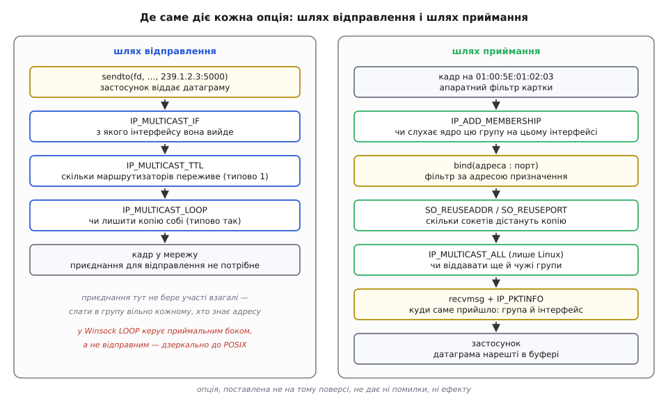
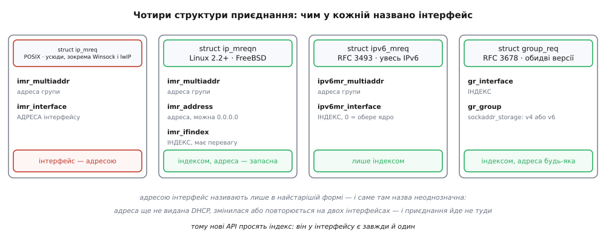

# 📋 Опції багатоадресного сокета: приєднання, інтерфейс, фільтри

Тут зібрано контракт усіх викликів, якими програма вмикає груповий обмін: чим приєднатися до групи, чим обрати вихідний інтерфейс, чим поділити порт із сусіднім процесом і як дізнатися, на яку адресу й на який інтерфейс прийшла датаграма — з типами аргументів, замовчуваннями, кодами помилок і трьома різними відповідями Linux, BSD та Windows на одне питання «а до чого прив'язувати сокет». Загальний контракт самого `setsockopt` — що таке рівень, чому `optlen` вхідний в одному виклику й «вхід-вихід» в іншому, чому `0` не означає «стало як просив» — лежить у [довіднику setsockopt](topic:programming/socket-options/api-setsockopt.md); тут тільки те, що стосується груп.

## Порядок викликів

Опції багатоадресного сокета не переставляються вільно: половина з них має вікно, поза яким виклик або не подіє, або відмовить.

| # | Виклик | Чому саме тут |
| --- | --- | --- |
| 1 | `socket(AF_INET, SOCK_DGRAM, 0)` | сімейство визначає, який рівень (`IPPROTO_IP` чи `IPPROTO_IPV6`) прийме опції |
| 2 | `SO_REUSEADDR` (на BSD і macOS — ще й `SO_REUSEPORT`) | **тільки до `bind`**: після прив'язки прапорець уже не питають |
| 3 | `bind(…)` | фіксує порт і — там, де це дозволено, — фільтр за адресою призначення |
| 4 | `IP_ADD_MEMBERSHIP` / `MCAST_JOIN_GROUP` | після `bind`; на Windows документація `bind` прямо називає цей порядок «настійно рекомендованим» |
| 5 | `IP_MULTICAST_IF`, `IP_MULTICAST_TTL`, `IP_MULTICAST_LOOP` | будь-коли до першого `sendto`; на приймання не впливають зовсім |
| 6 | `IP_PKTINFO` / `IPV6_RECVPKTINFO` | до першого `recvmsg`, бо керують тим, що ядро покладе в допоміжні дані |

Найпоширеніша тиха помилка — переплутати поверхи: опція шляху відправлення, поставлена в надії полагодити приймання (або навпаки), не дає ні коду помилки, ні ефекту.



*Шляхи не симетричні: на відправленні опції обирають, куди й як далеко піде пакет, на прийманні — крізь скільки фільтрів він мусить пройти, щоб дістатися буфера.*

## Приєднання до групи: IPv4

| Опція | Рівень | Аргумент | Що робить | Часті помилки |
| --- | --- | --- | --- | --- |
| `IP_ADD_MEMBERSHIP` | `IPPROTO_IP` | `struct ip_mreqn` або `struct ip_mreq` | вмикає приймання групи на одному інтерфейсі й шле звіт IGMP | `EINVAL`, `ENODEV`, `EADDRINUSE`, `ENOBUFS` |
| `IP_DROP_MEMBERSHIP` | `IPPROTO_IP` | те саме | вихід із групи; те саме роблять `close(fd)` і смерть процесу | `EADDRNOTAVAIL` — такого членства не було |
| `IP_ADD_SOURCE_MEMBERSHIP` | `IPPROTO_IP` | `struct ip_mreq_source` | приєднання з дозволом лише одному джерелу (IGMPv3) | `EINVAL`, `ENOBUFS` — вичерпано список джерел |
| `IP_DROP_SOURCE_MEMBERSHIP` | `IPPROTO_IP` | `struct ip_mreq_source` | прибрати одне джерело з дозволених | `EADDRNOTAVAIL` |
| `IP_BLOCK_SOURCE` | `IPPROTO_IP` | `struct ip_mreq_source` | у вже приєднаній групі заглушити конкретного відправника | `EINVAL`, `EADDRNOTAVAIL` |
| `IP_UNBLOCK_SOURCE` | `IPPROTO_IP` | `struct ip_mreq_source` | зняти заглушення | `EADDRNOTAVAIL` — не було заглушено |
| `IP_MULTICAST_ALL` | `IPPROTO_IP` | `int` (0/1), типово **1** | **лише Linux, з 2.6.31:** чи віддавати цьому сокету групи, приєднані іншими | `ENOPROTOOPT` поза Linux |

Дві речі з цієї таблиці варто прочитати двічі.

**Членство належить парі «група + інтерфейс», а не сокету взагалі.** Приєднання на `eth0` не дає нічого на `wlan0`: на машині з двома мережами приєднуватися треба до обох, окремими викликами. Повторний виклик на ту саму пару Linux відкидає з `EADDRINUSE`, Windows — з `WSAEADDRNOTAVAIL`; тобто «приєднайся ще раз про всяк випадок» — не безпечна операція.

**`IP_MULTICAST_ALL` — це двадцять років болю в одному рядку.** Типове значення `1` означає: сокет, прив'язаний до підстановної адреси, дістає датаграми **всіх груп, приєднаних будь-де в системі** — навіть тих, до яких він сам не приєднувався. Один процес слухає mDNS, другий — свою власну групу на тому самому порту, і другий раптом бачить чужий трафік. Лікує один виклик:

```c
int off = 0;
setsockopt(fd, IPPROTO_IP, IP_MULTICAST_ALL, &off, sizeof off);  /* лише мої групи */
```

### Дві структури й чому їх дві

```c
/* POSIX, є всюди — навіть у Winsock і lwIP */
struct ip_mreq {
    struct in_addr imr_multiaddr;   /* адреса групи */
    struct in_addr imr_interface;   /* АДРЕСА локального інтерфейсу */
};

/* Linux 2.2+, FreeBSD, macOS */
struct ip_mreqn {
    struct in_addr imr_multiaddr;   /* адреса групи */
    struct in_addr imr_address;     /* адреса інтерфейсу; можна 0.0.0.0 */
    int            imr_ifindex;     /* ІНДЕКС інтерфейсу — має перевагу */
};

/* фільтр за джерелом; Linux 2.4.22+, BSD, Windows */
struct ip_mreq_source {
    struct in_addr imr_multiaddr;   /* адреса групи */
    struct in_addr imr_interface;   /* адреса локального інтерфейсу */
    struct in_addr imr_sourceaddr;  /* дозволене (чи заглушене) джерело */
};
```

Порядок полів у `ip_mreq_source` **не однаковий на всіх системах**: у заголовку XNU (macOS) джерело стоїть другим, а адреса інтерфейсу — третьою. Тому поля заповнюють за іменами, ніколи не ініціалізацією списком у фігурних дужках.

Друга структура з'явилася тому, що перша називає інтерфейс його адресою, а адреса — погане ім'я. Її ще може не бути (DHCP не відповів), вона змінюється при переїзді між мережами й повторюється на двох інтерфейсах у типовій вигородці з контейнерами. Індекс же в інтерфейсу є завжди, він один і живе, поки живе сам інтерфейс.

Що робить Linux, отримавши `ip_mreqn`, видно з `ip_mc_find_dev` у ядрі: якщо `imr_ifindex` не нуль — беруть інтерфейс за індексом і більше нічого не дивляться; інакше, якщо задано `imr_address` — шукають інтерфейс із такою адресою; якщо порожні обидва поля — питають таблицю маршрутизації, куди пішов би пакет на адресу цієї групи. Останній варіант і є той «сам обере не те», яким славиться багатоадресна розсилка на машині з VPN.



*Історія цього API — поступова відмова називати інтерфейс його адресою: у найновішій формі адреси інтерфейсу немає взагалі.*

```c
#include <net/if.h>
#include <netinet/in.h>
#include <arpa/inet.h>

/* приєднання за індексом — Linux, FreeBSD, macOS */
struct ip_mreqn mreq;
memset(&mreq, 0, sizeof mreq);
inet_pton(AF_INET, "239.1.2.3", &mreq.imr_multiaddr);
mreq.imr_ifindex = (int)if_nametoindex("eth0");     /* 0 = такого імені немає */
setsockopt(fd, IPPROTO_IP, IP_ADD_MEMBERSHIP, &mreq, sizeof mreq);

/* переносний запасний варіант — Winsock, lwIP, старі системи */
struct ip_mreq old;
inet_pton(AF_INET, "239.1.2.3", &old.imr_multiaddr);
old.imr_interface.s_addr = inet_addr("192.168.1.7");  /* адреса ЦЬОГО інтерфейсу */
setsockopt(fd, IPPROTO_IP, IP_ADD_MEMBERSHIP, (const char *)&old, sizeof old);
```

macOS має ще й власну опцію `IP_MULTICAST_IFINDEX` (номер 66 у заголовку XNU, аргумент — `int`), якою вихідний інтерфейс задають індексом без жодної структури.

## Куди й на скільки переходів слати

| Опція | Рівень | Аргумент за системами | Типове значення | Примітка |
| --- | --- | --- | --- | --- |
| `IP_MULTICAST_IF` | `IPPROTO_IP` | Linux — `ip_mreqn`, `ip_mreq` або `in_addr`; FreeBSD і macOS — `in_addr` чи `ip_mreqn`; Windows — `DWORD` | інтерфейс за таблицею маршрутів | на Windows це або адреса IPv4, або **індекс — в мережевому порядку байтів**; будь-що з `0.x.x.x` (крім `0.0.0.0`) там тлумачать як індекс |
| `IP_MULTICAST_TTL` | `IPPROTO_IP` | Linux — `int` (приймає й один байт); FreeBSD і macOS — `u_char`, але ядро приймає й `u_int`; Windows — `DWORD` | **1** | `-1` на Linux мовчки перетворюється на `1`; значення поза `0…255` → `EINVAL` |
| `IP_MULTICAST_LOOP` | `IPPROTO_IP` | так само, як у TTL | **1** (увімкнено) | у Winsock **інша семантика** — див. нижче |

Одиниця в TTL означає, що пакет не переживе першого ж маршрутизатора. Це вибір на користь безпеки, а не зручності: група з великим TTL заливала б чужі мережі. Окремо від TTL діє межа за діапазоном адрес — смуга `224.0.0.0/24` не виходить за сегмент за жодного значення лічильника, і плутанина між цими двома механізмами породжує години спроб «підняти TTL, щоб mDNS пішов у сусідню підмережу».

**Про `IP_MULTICAST_LOOP` на Windows.** Документація Winsock каже це прямо: там опція керує **приймальним** боком, а в POSIX — відправним. Тобто в POSIX сокет-відправник вирішує, чи лишити копію собі та сусідам на цій же машині, а у Winsock кожен приймач вирішує, чи брати місцеві копії. Наслідок: один і той самий рядок коду на Linux і на Windows розриває зв'язок між різними парами процесів. Не покладайся на цю опцію взагалі — **відсіювати власні пакети треба за ідентифікатором усередині повідомлення**, і тоді питання «на якому боці вимикати луну» не виникає.

```c
/* один намір — три різні типи аргументу */
#if defined(_WIN32)
    DWORD ttl = 4, loop = 1;
#elif defined(__linux__)
    int ttl = 4, loop = 1;
#else
    unsigned char ttl = 4, loop = 1;   /* історична форма BSD */
#endif
setsockopt(fd, IPPROTO_IP, IP_MULTICAST_TTL,  (const char *)&ttl,  sizeof ttl);
setsockopt(fd, IPPROTO_IP, IP_MULTICAST_LOOP, (const char *)&loop, sizeof loop);
```

Числові значення самих імен теж не збігаються між стеками: у заголовках FreeBSD і macOS `IP_MULTICAST_TTL` — це `10`, у lwIP — `5`, у Linux — ще інше число. Це не дрібниця для тих, хто пише байти опцій вручну чи розбирає чужий трафік `strace`: константа значуща лише разом зі своїм заголовком.

## Спільний порт: `SO_REUSEADDR` і `SO_REUSEPORT`

На виявленні порт фіксований (у mDNS — 5353, у SSDP — 1900), і охочих слухати його на одній машині зазвичай кілька: служба, діагностична утиліта, ще один застосунок. Без дозволу ділити адресу другий отримає `EADDRINUSE` і не почує нічого.

| Система | Що ставити перед `bind` | Що це дає для групового UDP |
| --- | --- | --- |
| Linux | `SO_REUSEADDR` | кілька сокетів на тій самій парі «адреса : порт»; **копію дістає кожен** |
| Linux (з 3.9) | `SO_REUSEPORT` | те саме, але всі сокети мусять належати одному ефективному UID — захист від перехоплення порту чужим користувачем |
| FreeBSD, macOS | `SO_REUSEADDR` **і** `SO_REUSEPORT` | історично `SO_REUSEADDR` там дозволяє повний дубль прив'язки лише для групових адрес, тож переносний код ставить обидва прапорці |
| Windows | `SO_REUSEADDR` | документація Winsock називає поведінку решти сокетів «невизначеною» — з єдиним винятком: **для групових сокетів, приєднаних до тієї самої групи на тому самому інтерфейсі, дані дістають усі**, а не один навмання |

На Windows у цієї опції є ще й безпекова тінь: `SO_REUSEADDR` там дозволяє **перехопити** чужий уже зайнятий порт, і жодних привілеїв для цього не потрібно. Захист від цього — `SO_EXCLUSIVEADDRUSE` на боці того, хто зайняв порт першим. Тому груповий сокет із `SO_REUSEADDR` на Windows — це нормальна практика, а такий самий одноадресний серверний сокет — вразливість.

## `bind`: три системи — три відповіді

Це місце, де переносний код ламається найтихіше, бо всі три системи «працюють», але роблять різне.

| Система | `bind` до адреси групи | `bind` до `INADDR_ANY` |
| --- | --- | --- |
| Linux | дозволено; сокет дістає **тільки** датаграми з цією адресою призначення — одноадресні на цей порт до нього не доходять | дістає все, що прийшло на порт, зокрема інші групи (див. `IP_MULTICAST_ALL`) і звичайні одноадресні датаграми |
| FreeBSD, macOS | дозволено, поведінка та сама: прив'язка працює як фільтр за адресою призначення | так само, як у Linux, але без вимикача на кшталт `IP_MULTICAST_ALL` |
| Windows | документація `bind` пропонує лише локальну адресу машини або підстановну; групова адреса локальною не є, і виклик відмовляє з `WSAEADDRNOTAVAIL` | єдиний робочий шлях: прив'язатися до `INADDR_ANY` (або до адреси потрібного інтерфейсу), а вже потім приєднуватися до групи |

Звідси переносний рецепт, який працює скрізь однаково: **прив'язуйся до підстановної адреси, а групу розрізняй уже в застосунку** — за `IP_PKTINFO`, який повертає справжню адресу призначення. На Linux до цього додається `IP_MULTICAST_ALL = 0`, щоб не бачити груп, до яких ти не приєднувався.

> 🔧 **Навіщо це.** Дві найдорожчі помилки в цій темі виглядають однаково — «приймач мовчить», — але лікуються протилежно. Якщо код прив'язується до адреси групи й переноситься на Windows, він падає на `bind` із `WSAEADDRNOTAVAIL`: помилка гучна, її видно. Якщо код прив'язується до `INADDR_ANY` і покладається на те, що йому прийде тільки «своє», він мовчки дістає чужі датаграми на цей порт — і розбирається з ними як зі своїми, доки одного дня чужий пакет не збігається за розміром із власним форматом. Тому адресу призначення в отриманій датаграмі перевіряють явно, а не припускають.

## Куди прийшов пакет: `IP_PKTINFO` і рідня

`recvfrom` повертає, **звідки** пакет прийшов. Багатоадресній програмі майже завжди потрібне протилежне: **куди** він прийшов — на яку адресу призначення (тобто якої це групи) і крізь який інтерфейс. Без цього вузол із двома мережами не знає, кому відповідати.

| Опція | Рівень | Аргумент | Що з'являється в допоміжних даних `recvmsg` |
| --- | --- | --- | --- |
| `IP_PKTINFO` | `IPPROTO_IP` | `int` (0/1) | `struct in_pktinfo`: індекс інтерфейсу, локальна адреса, **адреса призначення з заголовка** |
| `IP_RECVDSTADDR` | `IPPROTO_IP` | `int` (0/1) | `struct in_addr` — адреса призначення; шлях FreeBSD |
| `IP_RECVIF` | `IPPROTO_IP` | `int` (0/1) | `struct sockaddr_dl` — інтерфейс приймання; шлях FreeBSD |
| `IPV6_RECVPKTINFO` | `IPPROTO_IPV6` | `int` (0/1) | `struct in6_pktinfo`: адреса призначення й індекс інтерфейсу |

Наявність за системами: Linux має `IP_PKTINFO`; macOS має його теж (номер 26 у заголовку XNU, `IP_RECVPKTINFO` — синонім) і додатково пару `IP_RECVDSTADDR`/`IP_RECVIF`; FreeBSD `IP_PKTINFO` не має зовсім — там лише ця пара; Windows має `IP_PKTINFO`, але читати допоміжні дані треба через `WSARecvMsg`, покажчик на яку добувають викликом `WSAIoctl` із кодом `SIO_GET_EXTENSION_FUNCTION_POINTER`. Для IPv6 різнобою немає: `IPV6_RECVPKTINFO` за RFC 3542 працює скрізь, і в lwIP `IP_PKTINFO` теж є.

```c
struct in_pktinfo {
    unsigned int   ipi_ifindex;    /* інтерфейс, на який прийшло */
    struct in_addr ipi_spec_dst;   /* локальна адреса маршруту */
    struct in_addr ipi_addr;       /* адреса призначення з заголовка — ГРУПА */
};

struct in6_pktinfo {
    struct in6_addr ipi6_addr;     /* адреса призначення */
    unsigned int    ipi6_ifindex;  /* інтерфейс */
};
```

Читання цих даних — це завжди [допоміжні дані сокета](topic:programming/ancillary-data-cmsg): вони приходять не в буфері з корисним навантаженням, а окремим списком поруч із ним, і дістати їх можна тільки через `recvmsg`, ніколи через `recv` чи `recvfrom`.

```c
#include <sys/socket.h>
#include <netinet/in.h>
#include <string.h>

/* прийняти датаграму і дізнатися, ЯКІЙ групі вона адресована */
static ssize_t recv_with_dest(int fd, void *buf, size_t len,
                              struct sockaddr_in *from,
                              struct in_addr *dst, unsigned *ifindex)
{
    char control[CMSG_SPACE(sizeof(struct in_pktinfo))];
    struct iovec iov = { .iov_base = buf, .iov_len = len };
    struct msghdr msg = {
        .msg_name = from,      .msg_namelen   = sizeof *from,
        .msg_iov  = &iov,      .msg_iovlen    = 1,
        .msg_control = control, .msg_controllen = sizeof control,
    };

    ssize_t n = recvmsg(fd, &msg, 0);
    if (n < 0)
        return n;

    for (struct cmsghdr *c = CMSG_FIRSTHDR(&msg); c; c = CMSG_NXTHDR(&msg, c)) {
        if (c->cmsg_level == IPPROTO_IP && c->cmsg_type == IP_PKTINFO) {
            struct in_pktinfo pi;
            memcpy(&pi, CMSG_DATA(c), sizeof pi);   /* копія: вирівнювання не гарантоване */
            *dst     = pi.ipi_addr;
            *ifindex = pi.ipi_ifindex;
        }
    }
    return n;
}
```

Буфер `control` мусить бути рівно на `CMSG_SPACE(...)` байтів, а не на `sizeof(struct in_pktinfo)`: між елементами списку є вирівнювання й заголовки. Замалий буфер не дає помилки — ядро просто ставить прапорець `MSG_CTRUNC` у `msg.msg_flags` і мовчки обрізає дані.

## IPv6: ті самі опції, чистіший контракт

| Опція | Рівень | Аргумент | Типове значення | Примітка |
| --- | --- | --- | --- | --- |
| `IPV6_JOIN_GROUP` | `IPPROTO_IPV6` | `struct ipv6_mreq` | — | `IPV6_ADD_MEMBERSHIP` — те саме ім'я в Linux, Windows і lwIP |
| `IPV6_LEAVE_GROUP` | `IPPROTO_IPV6` | `struct ipv6_mreq` | — | синонім `IPV6_DROP_MEMBERSHIP` |
| `IPV6_MULTICAST_IF` | `IPPROTO_IPV6` | `unsigned int` — індекс | 0 (обере ядро) | на Windows — `DWORD`, індекс у **машинному** порядку байтів, на відміну від IPv4 |
| `IPV6_MULTICAST_HOPS` | `IPPROTO_IPV6` | `int` | **1** | `-1` — системне замовчування; поза `0…255` → `EINVAL` |
| `IPV6_MULTICAST_LOOP` | `IPPROTO_IPV6` | `unsigned int` за RFC 3493 | 1 | на Windows — `DWORD` |
| `IPV6_RECVPKTINFO` | `IPPROTO_IPV6` | `int` (0/1) | 0 | вмикає `struct in6_pktinfo` у допоміжних даних |
| `IPV6_V6ONLY` | `IPPROTO_IPV6` | `int` (0/1) | Linux — типово 0; **Windows — типово 1** | ставити **до `bind`** |

```c
struct ipv6_mreq {
    struct in6_addr ipv6mr_multiaddr;   /* адреса групи */
    unsigned int    ipv6mr_interface;   /* ІНДЕКС; 0 = ядро обере само */
};

struct ipv6_mreq m6;
memset(&m6, 0, sizeof m6);
inet_pton(AF_INET6, "ff02::fb", &m6.ipv6mr_multiaddr);   /* mDNS в IPv6 */
m6.ipv6mr_interface = if_nametoindex("eth0");
setsockopt(fd6, IPPROTO_IPV6, IPV6_JOIN_GROUP, &m6, sizeof m6);
```

Три відмінності від IPv4, які варто тримати в голові.

**Інтерфейс називають лише індексом** — адреси інтерфейсу в структурі немає взагалі, тож уся плутанина `ip_mreq` проти `ip_mreqn` тут не має де виникнути.

**Область дії зашита в саму адресу**, а не в лічильник переходів: `ff02::` — це сегмент, `ff05::` — майданчик. `IPV6_MULTICAST_HOPS` обмежує пакет додатково, але вивести `ff02::`-групу за сегмент не здатне жодне значення.

**Для груп із областю сегмента адресу треба доповнювати індексом**: у `struct sockaddr_in6` є поле `sin6_scope_id`, і без нього `sendto` на `ff02::fb` дасть `EINVAL` або піде не тим інтерфейсом, бо адреса сама по собі неоднозначна — та сама `ff02::fb` існує на кожному інтерфейсі окремо.

## Незалежні від версії: `MCAST_JOIN_GROUP`

RFC 3678 прибрав дублювання «те саме, але для IPv6»: одні імена опцій, одні структури, а сімейство адреси живе всередині `sockaddr_storage`.

| Опція | Аргумент | Що робить |
| --- | --- | --- |
| `MCAST_JOIN_GROUP` | `struct group_req` | приєднання без фільтра за джерелом |
| `MCAST_LEAVE_GROUP` | `struct group_req` | вихід |
| `MCAST_JOIN_SOURCE_GROUP` | `struct group_source_req` | приєднання з дозволом лише вказаному джерелу |
| `MCAST_LEAVE_SOURCE_GROUP` | `struct group_source_req` | прибрати одне джерело з дозволених |
| `MCAST_BLOCK_SOURCE` | `struct group_source_req` | заглушити джерело в уже приєднаній групі |
| `MCAST_UNBLOCK_SOURCE` | `struct group_source_req` | зняти заглушення |

```c
struct group_req {
    uint32_t                gr_interface;   /* індекс інтерфейсу */
    struct sockaddr_storage gr_group;       /* група: AF_INET або AF_INET6 */
};

struct group_source_req {
    uint32_t                gsr_interface;
    struct sockaddr_storage gsr_group;
    struct sockaddr_storage gsr_source;
};
```

Рівень при цьому лишається за сімейством **сокета**: для `AF_INET` — `IPPROTO_IP`, для `AF_INET6` — `IPPROTO_IPV6`. Через це один виклик обслуговує обидві версії, а розгалуження зводиться до вибору константи:

```c
/* приєднання, яке не знає й не хоче знати версію протоколу */
static int join_any(int fd, const struct sockaddr_storage *group,
                    socklen_t grouplen, unsigned ifindex)
{
    struct group_req req;
    memset(&req, 0, sizeof req);
    req.gr_interface = ifindex;
    memcpy(&req.gr_group, group, grouplen);

    int level = (group->ss_family == AF_INET6) ? IPPROTO_IPV6 : IPPROTO_IP;
    return setsockopt(fd, level, MCAST_JOIN_GROUP, &req, sizeof req);
}
```

Приймати адресу групи в такий код зручно просто з `getaddrinfo`: він уже повертає `sockaddr` потрібного сімейства, і жодного `inet_pton` із заздалегідь відомою версією не потрібно.

Наявність: Linux — разом із появою фільтрів за джерелом (`ip_mreq_source` там з 2.4.22), FreeBSD — де man-сторінка `ip(4)` навіть радить користуватися саме цими іменами замість старих, macOS (номери 80 і 82 у заголовку XNU). У таблицях опцій Winsock ці імена не наведені зовсім — там для фільтра за джерелом документують `IP_ADD_SOURCE_MEMBERSHIP` та підхід «кінцевого стану» через IOCTL, тож на Windows надійніше лишатися при IPv4-специфічних іменах. У lwIP немає ні `MCAST_*`, ні `ip_mreqn`: там є рівно `IP_ADD_MEMBERSHIP` зі старою `ip_mreq` — і цього достатньо, бо мікроконтролер зазвичай має один інтерфейс.

Сам фільтр за джерелом працює лише там, де мережа підтримує [IGMPv3 і MLDv2](topic:communications/source-specific-multicast); інакше ядро прийме опцію, а відсіювання чужих відправників робитиме саме — тобто трафік у сегменті лишиться. Кількість джерел обмежена: на Linux її задає `net.ipv4.igmp_max_msf`, типово **10** на групу.

## Індекс інтерфейсу: звідки його брати

```c
#include <net/if.h>

unsigned int if_nametoindex(const char *ifname);      /* 0 — немає такого імені */
char        *if_indextoname(unsigned int ifindex, char *buf);  /* buf ≥ IF_NAMESIZE */
```

`if_nametoindex` повертає нуль як ознаку помилки (індексів із номером нуль не буває), а причину лишає в `errno` — на Linux це `ENODEV`. Перевіряти повернене значення обов'язково: нуль, покладений у `imr_ifindex`, не помилка для ядра, а вказівка «обери інтерфейс сам», тобто саме та поведінка, від якої ми тікали.

Коли ім'я інтерфейсу наперед невідоме — а в програмі виявлення воно невідоме майже завжди, — інтерфейси перебирають:

```c
#include <ifaddrs.h>
#include <net/if.h>
#include <arpa/inet.h>
#include <stdio.h>

/* усі інтерфейси, придатні для групової розсилки */
void list_mcast_ifaces(void)
{
    struct ifaddrs *head;
    if (getifaddrs(&head) != 0)
        return;

    for (struct ifaddrs *p = head; p; p = p->ifa_next) {
        if (!p->ifa_addr || p->ifa_addr->sa_family != AF_INET) continue;
        if (!(p->ifa_flags & IFF_UP))        continue;   /* вимкнений */
        if (!(p->ifa_flags & IFF_MULTICAST)) continue;   /* не вміє груп */
        if (p->ifa_flags & IFF_LOOPBACK)     continue;   /* петля — окремий випадок */

        char ip[INET_ADDRSTRLEN];
        struct sockaddr_in *sa = (struct sockaddr_in *)p->ifa_addr;
        inet_ntop(AF_INET, &sa->sin_addr, ip, sizeof ip);
        printf("%-10s індекс=%u  %s\n", p->ifa_name,
               if_nametoindex(p->ifa_name), ip);
    }
    freeifaddrs(head);
}
```

Три прапорці в цьому переборі несуть усю роботу: `IFF_UP` відсіює налаштовані, але мертві інтерфейси, `IFF_MULTICAST` — ті, що груп не вміють узагалі, `IFF_LOOPBACK` — петлю, яку в перебір беруть тільки свідомо (для обміну між процесами на одній машині). Що саме означають ці прапорці й звідки в системи береться сам список інтерфейсів — у [інтерфейсах, адресах і стані лінка](topic:unix-linux/interfaces-and-addresses).

На Windows `getifaddrs` немає: список дає `GetAdaptersAddresses`, а індекси лежать у полях `IfIndex` (IPv4) та `Ipv6IfIndex` тієї ж структури. `if_nametoindex` там теж є, але приймає системне ім'я адаптера, а не звичне `eth0`, тож користі з нього мало.

## Коди помилок

| Код | Де трапляється | Що означає насправді |
| --- | --- | --- |
| `EINVAL` | приєднання | адреса не групова (не з `224.0.0.0/4`); або не той `optlen`; або TTL поза `0…255` |
| `ENODEV` | приєднання на Linux | інтерфейса з таким індексом чи адресою немає — типово `if_nametoindex` повернув нуль, а перевірки не було |
| `EADDRNOTAVAIL` | приєднання на BSD і macOS; вихід — скрізь | інтерфейс не знайдено або він не вміє груп (немає `IFF_MULTICAST`); при виході — такого членства не було |
| `EADDRINUSE` | `bind`; приєднання на Linux | порт зайнято без `SO_REUSEADDR`; або та сама група вже приєднана на цьому ж інтерфейсі |
| `ENOBUFS` | приєднання | вичерпано ліміт членств: на Linux це `net.ipv4.igmp_max_memberships`, типово **20**; у FreeBSD `IP_MAX_MEMBERSHIPS` — 4095 |
| `EACCES` | `bind`, `sendto` | спроба працювати з широкомовною адресою без `SO_BROADCAST`; або порт < 1024 без повноважень |
| `ENOPROTOOPT` | будь-яка опція | цей стек такої опції не має — типово `IP_MULTICAST_ALL` поза Linux або `MCAST_*` у lwIP; це «не вміє», а не «помилка в коді» |
| `WSAEADDRNOTAVAIL` | `bind`, приєднання | на Windows: прив'язка до адреси, якої на машині немає (зокрема до групової); або повторне приєднання до вже приєднаної групи |
| `WSAEINVAL` | приєднання | на Windows: операція суперечить попереднім — наприклад, `IP_DROP_SOURCE_MEMBERSHIP` після звичайного `IP_ADD_MEMBERSHIP` |

`ENOPROTOOPT` варто ловити окремо від решти: програма, яку переносять між Linux, macOS і мікроконтролером, від нього падати не повинна — просто ця система так не вміє, і поведінка лишається типовою.

## Мінімальний робочий виклик

```c
#include <arpa/inet.h>
#include <net/if.h>
#include <netinet/in.h>
#include <string.h>
#include <sys/socket.h>
#include <unistd.h>

/* приймач: слухати групу group:port на інтерфейсі ifname */
int mcast_rx(const char *group, unsigned short port, const char *ifname)
{
    int fd = socket(AF_INET, SOCK_DGRAM, 0);
    if (fd < 0)
        return -1;

    int on = 1;
    setsockopt(fd, SOL_SOCKET, SO_REUSEADDR, &on, sizeof on);
#ifdef SO_REUSEPORT
    setsockopt(fd, SOL_SOCKET, SO_REUSEPORT, &on, sizeof on);   /* потрібне на BSD */
#endif

    /* підстановна адреса — єдиний варіант, що поводиться однаково всюди */
    struct sockaddr_in a;
    memset(&a, 0, sizeof a);
    a.sin_family      = AF_INET;
    a.sin_port        = htons(port);
    a.sin_addr.s_addr = htonl(INADDR_ANY);
    if (bind(fd, (struct sockaddr *)&a, sizeof a) < 0)
        goto fail;

    struct ip_mreqn mreq;
    memset(&mreq, 0, sizeof mreq);
    if (inet_pton(AF_INET, group, &mreq.imr_multiaddr) != 1)
        goto fail;
    mreq.imr_ifindex = (int)if_nametoindex(ifname);
    if (mreq.imr_ifindex == 0)                  /* немає такого інтерфейсу */
        goto fail;
    if (setsockopt(fd, IPPROTO_IP, IP_ADD_MEMBERSHIP, &mreq, sizeof mreq) < 0)
        goto fail;

#ifdef IP_MULTICAST_ALL
    int off = 0;                                /* Linux: чужих груп не хочу */
    setsockopt(fd, IPPROTO_IP, IP_MULTICAST_ALL, &off, sizeof off);
#endif
    setsockopt(fd, IPPROTO_IP, IP_PKTINFO, &on, sizeof on);
    return fd;

fail:
    close(fd);
    return -1;
}

/* відправник: слати в групу з того самого інтерфейсу, ttl переходів углиб */
int mcast_tx(const char *ifname, int ttl)
{
    int fd = socket(AF_INET, SOCK_DGRAM, 0);
    if (fd < 0)
        return -1;

    struct ip_mreqn out;
    memset(&out, 0, sizeof out);
    out.imr_ifindex = (int)if_nametoindex(ifname);
    if (out.imr_ifindex == 0 ||
        setsockopt(fd, IPPROTO_IP, IP_MULTICAST_IF, &out, sizeof out) < 0) {
        close(fd);
        return -1;
    }
    setsockopt(fd, IPPROTO_IP, IP_MULTICAST_TTL, &ttl, sizeof ttl);
    return fd;                                  /* приєднання для слання не треба */
}
```

Відправлення далі — звичайне `sendto` на `sockaddr_in` з адресою групи; жодного приєднання для цього не потрібно, і відправник ніколи не дізнається, чи слухав його хоч хтось. Це не вада реалізації, а сама форма контракту: [семантика датаграми](topic:programming/udp-datagram-semantics) тут не змінюється від того, що адреса називає групу, а не машину.
