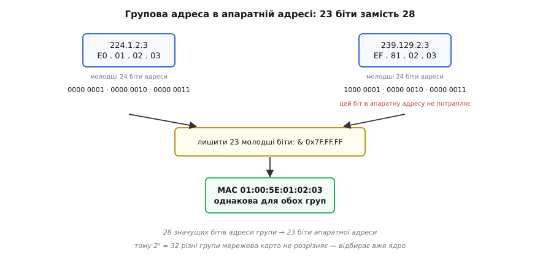
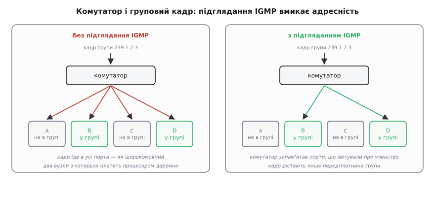
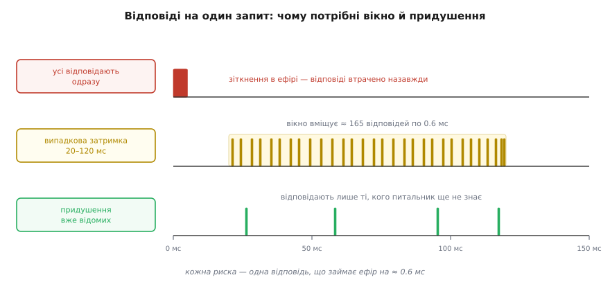

# Багатоадресна розсилка й виявлення вузлів

<preknowlist>
- [Сокети TCP/UDP](book:programming/sockets-tcp-udp) — сокет як пара «адреса : порт», виклики `sendto`/`recvfrom`, чим датаграма відрізняється від потоку байтів.
- [MAC, IP і ARP](book:communications/mac-ip-arp) — два поверхи адрес: MAC розносить кадр у межах одного сегмента, IP веде пакет наскрізь через мережі.
- [Семантика датаграми UDP](book:programming/udp-datagram-semantics) — датаграма може зникнути, здублюватися або прийти не в тому порядку, і ніхто про це не повідомить.
- [Маршрутизація](book:communications/ip-routing) — як маршрутизатор дивиться на адресу призначення й вирішує, куди віддати пакет; де проходить межа підмережі.
</preknowlist>

Щоб надіслати датаграму, треба знати адресу того, кому шлеш: `sendto` без адреси призначення не існує. А тепер уяви пристрій, який щойно ввімкнули в чужій мережі, і він мусить знайти там свій сервер — або застосунок на ноутбуці, який має побачити всі принтери в офісі. Адреси невідомі, і взяти їх нізвідки: DHCP роздав їх кілька хвилин тому й завтра роздасть інакше. Виходить замкнене коло — щоб спитати «хто ти?», уже треба знати, кому адресувати питання.

Записати адреси в налаштування — не розв'язок, а перекладання проблеми на людину, яка тепер мусить правити ці налаштування щоразу, коли мережа змінилася. Перебрати підмережу — надіслати запит на кожну з 254 адрес `/24` — теж не розв'язок: у мережі `/16` таких адрес шістдесят п'ять тисяч, перебір триватиме хвилини, засмітить таблиці ARP на всіх маршрутизаторах і виглядатиме для системи безпеки точнісінько як сканування зловмисником.

Отже, потрібен спосіб надіслати пакет **не комусь конкретному, а тому, кого це стосується**. Сама мережа такий спосіб має — і навіть два, разюче різні за ціною. Але самої розсилки замало: із крику в порожнечу надійне знання про те, хто є в мережі та як до нього достукатися, робить уже протокол, збудований поверх неї.

## Крик на весь сегмент: широкомовна розсилка

Найпростіша ідея лежить на поверхні: якщо адресат невідомий, надішли всім і хай відгукнеться той, кому треба. Мережа таке вміє, і вміє знизу — з канального рівня.

Кадр Ethernet із адресою призначення `ff:ff:ff:ff:ff:ff` комутатор не намагається спрямувати кудись одному — він **розсилає його в усі порти, крім того, звідки кадр прийшов**. Це широкомовна розсилка (англ. *broadcast* — слово з сівби, «розкидати насіння широко»). На рівні IP їй відповідають дві адреси: `255.255.255.255` — «усім у цьому сегменті», і спрямована широкомовна адреса підмережі, скажімо `192.168.1.255` для мережі `192.168.1.0/24` (звідки береться це число — у [адресації підмереж](book:communications/subnet-addressing)).

У коді це майже звичайний UDP, з однією відмінністю: ядро вимагає **явного дозволу**.

```c
int sock = socket(AF_INET, SOCK_DGRAM, 0);
int yes = 1;
setsockopt(sock, SOL_SOCKET, SO_BROADCAST, &yes, sizeof(yes));  // без цього — EACCES

struct sockaddr_in to = { .sin_family = AF_INET, .sin_port = htons(9999) };
inet_pton(AF_INET, "192.168.1.255", &to.sin_addr);
sendto(sock, msg, len, 0, (struct sockaddr *)&to, sizeof(to));
```

Опція `SO_BROADCAST` існує саме тому, що ця дія коштує дорого **не тобі, а всім іншим**, і система не хоче, щоб її вмикали друкарською помилкою в адресі. Ціна така: кадр приймає мережева карта **кожного** вузла сегмента, ядро кожного вузла піднімає його по стеку до UDP, шукає сокет, прив'язаний до порту 9999, не знаходить — і викидає пакет. Робота зроблена й змарнована на кожній машині, включно з тими, що працюють від батареї й прокинулися заради цього з енергоощадного сну.

Друга межа жорсткіша за першу. **Маршрутизатор широкомовний пакет не пересилає** — інакше один вузол міг би залити роботою весь інтернет. Тож крик глухне на межі підмережі, і два поверхи однієї будівлі, розведені в різні підмережі, одне одного вже не чують.

Разом це дає точний портрет інструмента: широкомовлення — це молоток. Воно працює, коли вузлів десяток і всі вони в одному сегменті; воно нікому не дає **відмовитися** платити; і воно принципово не переходить межу підмережі. Далі потрібне щось із тією самою здатністю говорити до багатьох, але з можливістю вибору на боці слухача.

## Адреса як тема, а не як машина

Переверни постановку. Проблема широкомовлення в тому, що **відправник вирішує, кому платити**: він шле всім, а вже кожен вирішує, викинути чи ні, — і саме викидання й коштує. Зроби навпаки: хай **отримувач заздалегідь оголосить, що йому цікаво**, а мережа доставляє тільки тим, хто оголосив.

Для цього адреса має означати не машину, а **тему**. Такий діапазон у IPv4 виділено окремо: `224.0.0.0/4` — усе від `224.0.0.0` до `239.255.255.255` (історично «клас D»). Адреса звідти не належить жодному вузлові; вона називає **групу**, а вузли до групи **приєднуються**. Це й є багатоадресна розсилка (англ. *multicast*, від лат. *multi-* «багато» й англ. *cast* — «розкидати»).

Асиметрія тут головна й неочевидна. **Щоб слати в групу, приєднуватися не треба**: `sendto` на `239.1.2.3` виконає будь-хто, навіть не знаючи, чи хтось узагалі слухає, і не дізнавшись цього ніколи. **Щоб чути групу — треба приєднатися явно.** Відправник не знає своїх слухачів; слухач сам обирає, що слухати. Це рівно та сама схема «видавець — передплатники», яку в застосунках будують [через брокера](book:programming/publish-subscribe), тільки вбудована в мережевий рівень і без брокера взагалі.

Простір адрес поділено на смуги з різною долею, і плутати їх дорого:

```text
224.0.0.0   – 224.0.0.255      локальні для сегмента: НІКОЛИ не перетинають маршрутизатор
                               224.0.0.1    усі вузли сегмента
                               224.0.0.2    усі маршрутизатори сегмента
                               224.0.0.251  mDNS
224.0.1.0   – 238.255.255.255  глобальні: теоретично маршрутизовані між мережами
239.0.0.0   – 239.255.255.255  адміністративно обмежені: твої власні, назовні не випускають
                               239.255.255.250  SSDP
```

Смуга `239.0.0.0/8` (закріплена RFC 2365 у 1998 році як «administratively scoped») — саме те, що бери для своїх протоколів: вона нічия, і межу організації не перетинає за домовленістю всіх, хто налаштовує маршрутизатори.

Приєднання в коді — одна опція сокета, але з двома аргументами, і другий важливіший, ніж здається:

:::tabs
```c
int sock = socket(AF_INET, SOCK_DGRAM, 0);
int yes = 1;
setsockopt(sock, SOL_SOCKET, SO_REUSEADDR, &yes, sizeof(yes));  // порт ділять кілька процесів

struct sockaddr_in addr = { .sin_family = AF_INET,
                            .sin_port   = htons(5000),
                            .sin_addr   = { .s_addr = htonl(INADDR_ANY) } };
bind(sock, (struct sockaddr *)&addr, sizeof(addr));

struct ip_mreqn mreq = { 0 };
inet_pton(AF_INET, "239.1.2.3", &mreq.imr_multiaddr);   // яку групу слухати
mreq.imr_ifindex = if_nametoindex("eth0");              // НА ЯКОМУ інтерфейсі слухати
setsockopt(sock, IPPROTO_IP, IP_ADD_MEMBERSHIP, &mreq, sizeof(mreq));
```
```py
import socket, struct

sock = socket.socket(socket.AF_INET, socket.SOCK_DGRAM)
sock.setsockopt(socket.SOL_SOCKET, socket.SO_REUSEADDR, 1)
sock.bind(("", 5000))

# група + адреса локального інтерфейсу, на якому її слухати
mreq = struct.pack("4s4s", socket.inet_aton("239.1.2.3"),
                           socket.inet_aton("192.168.1.10"))
sock.setsockopt(socket.IPPROTO_IP, socket.IP_ADD_MEMBERSHIP, mreq)
```
:::

Приєднання **завжди належить конкретному інтерфейсу**, бо група живе в сегменті, а не в машині. Ноутбук із Wi-Fi, дротовим портом, мостом Docker і тунелем VPN має чотири сегменти — і чотири різні відповіді на питання «хто в групі». Один виклик `IP_ADD_MEMBERSHIP` підписує тебе рівно на один із них; щоб чути всі, роби виклик по разу на кожен інтерфейс. Пропущений другий аргумент (нуль замість індексу) віддає вибір ядру, яке візьме інтерфейс за таблицею маршрутизації, — і це найчастіша причина розмови «я все зробив за документацією, а пакетів немає».

## Двадцять три біти проти двадцяти восьми

Приєднання до групи має відбутися не лише в ядрі, а й у залізі: мережева карта фільтрує кадри за адресою призначення ще до того, як процесор про них дізнається. Отже, груповій IP-адресі потрібна групова MAC-адреса — і тут заховано обмеження, що дає про себе знати навантаженням на процесор.

IANA виділила під це смугу MAC-адрес із префіксом `01:00:5E` — і лишила під змінну частину рівно **23 біти**. А в адресі групи значущих бітів **28** (чотири старші зайняті самим позначенням «це група»). П'яти бітам місця не лишилося — їх просто **відкидають**.

**Дві різні групи, одна апаратна адреса.** Візьмемо `224.1.2.3` і `239.129.2.3`:

```text
224.1.2.3    = E0 . 01 . 02 . 03      молодші 24 біти:  0000 0001 . 0000 0010 . 0000 0011
239.129.2.3  = EF . 81 . 02 . 03      молодші 24 біти:  1000 0001 . 0000 0010 . 0000 0011
                                                        ↑ цей біт у MAC не потрапляє

лишаємо молодші 23 біти:
  0x01.02.03 & 0x7F.FF.FF = 0x01.02.03
  0x81.02.03 & 0x7F.FF.FF = 0x01.02.03

MAC = 01:00:5E : 01:02:03   ←  однакова для обох груп
```

Наслідок практичний. Твоя картка, підписана на `239.1.2.3`, апаратно пропустить усередину й потік чужої групи `224.1.2.3`, якщо така в мережі є: заліза не вистачило, щоб їх розрізнити. Розрізняє вже ядро, порівнюючи повну IP-адресу, — тобто **розрізняє процесором**. На тихій групі це непомітно; на груповому потоці відео сусідів це відчутне марне навантаження на кожен вузол, що взяв «невдалу» адресу. Тому групи для різних задач обирають так, щоб вони різнилися **молодшими** бітами, а не старшими: `239.1.2.3` і `239.1.2.4` не зіткнуться ніколи, а `239.1.2.3` і `239.129.2.3` зіткнуться завжди. У IPv6 запас щедріший — префікс `33:33` і **32** молодші біти адреси, — тож там збіг практично не трапляється.



*Із 28 значущих бітів адреси групи в апаратну адресу потрапляють лише 23 молодші — тому 32 різні групи невідрізненні для мережевої карти, і остаточний відбір лягає на ядро.*

## Хто в мережі знає, що ти підписався

Приєднання, яке живе тільки в твоєму ядрі, нічого не змінює: комутатор досі не знає, кому передавати кадри групи, а маршрутизатор — чи тягти цей потік у твій сегмент узагалі. Тому приєднання **оголошують уголос**, і для цього існує окремий протокол — IGMP (англ. *Internet Group Management Protocol* — протокол керування групами).

Механіка тримається на двох повідомленнях і одному таймері.

**Звіт про членство** вузол шле одразу, коли застосунок кликнув `IP_ADD_MEMBERSHIP`: «я в групі `239.1.2.3`». Звіт іде на адресу самої групи — щоб його почули не лише маршрутизатори, а й інші члени.

**Загальний запит** періодично шле опитувач (англ. *querier*) — маршрутизатор сегмента — на адресу «всі вузли», `224.0.0.1`: «хто в яких групах?». Вузли відповідають звітами, і мережа наново переконується, що передплатники живі.

**Таймер** робить решту. Якщо на групу не надходило звітів довше за час членства, група вважається порожньою й потік у сегмент більше не тягнуть. Типові числа стандарту дають цьому таймеру 260 секунд: запит раз на 125 секунд, витривалість 2 (тобто дозволено втратити один запит), плюс 10 секунд на відповідь — `2 × 125 + 10 = 260`.

Зверни увагу на форму цієї конструкції: надійного реєстру з підтвердженнями тут немає взагалі. Стан **підтримується повторенням** і зникає сам, щойно повторення припинилося — тому висмикнутий кабель не мусить породжувати жодного повідомлення про обрив, він просто припиняє звіти, і за 260 секунд мережа сама доходить правильного висновку.

Тепер про комутатор, бо тут ховається найпоширеніша аварія. **Звичайний комутатор другого рівня групових кадрів не розуміє.** Свою таблицю «адреса → порт» він будує, підглядаючи адреси **відправників** у кадрах, що йдуть крізь нього, а групова адреса відправником не буває ніколи — її нема кому туди внести. Отже, адреса `01:00:5E:...` для комутатора завжди невідома, а невідому адресу він обробляє єдиним відомим йому способом: **розсилає кадр в усі порти**. На простому комутаторі багатоадресна розсилка поводиться рівно як широкомовна, і вся економія зникає.

Розумний комутатор уміє **підглядати IGMP** (англ. *IGMP snooping*): він читає звіти, що проходять крізь нього, і будує таблицю «група → порти, з яких про неї звітували». Далі кадри групи він шле лише в ці порти. Саме звідси береться справжня економія багатоадресної розсилки в сегменті.

І звідси ж — пастка. Підглядання дає таблицю, але таблиця **старіє**: записи тримаються, доки надходять звіти, а звіти вузли шлють переважно **у відповідь на запит**. Увімкни підглядання в комутаторі там, де в сегменті немає жодного маршрутизатора з увімкненим IGMP, — і запитувати не буде кому. Хвилини чотири все працює на початкових звітах, а тоді таблиця порожніє, і трафік або зникає геть, або (залежно від виробника) провалюється назад у розсилку по всіх портах. Симптом упізнаваний: «усе працювало, а через п'ять хвилин перестало, і після перезапуску знову працює п'ять хвилин». Правило просте: **вмикаєш підглядання — подбай, щоб у сегменті хтось був опитувачем**; більшість керованих комутаторів уміють бути ним самі, це окрема настройка.



*Без підглядання IGMP груповий кадр іде в усі порти — економії немає; підглядання перетворює комутатор на розподільника, що доставляє лише передплатникам.*

> 🔧 **Навіщо це.** Коли групова розсилка «то працює, то ні», причина майже завжди не в коді, а на цих двох поверхах. Дві діагностичні дії дають відповідь швидше за годину читання логів: подивитися, чи бачить твій вузол чужі звіти IGMP (`tcpdump -i eth0 igmp`), і перевірити в комутаторі таблицю груп. Порожня таблиця при живих передплатниках — це відсутній опитувач, а не помилка твого застосунку.

## Чотири перемикачі, на яких усе ламається

Решта відмов багатоадресної розсилки припадає на чотири опції сокета, чиї **типові значення обрано для безпеки, а не для зручності**. Кожна з них мовчазна: неправильне значення не дає ні коду помилки, ні попередження — тільки тишу в приймачі.

**Час життя дорівнює одиниці.** Поле TTL у пакеті кожен маршрутизатор зменшує на одиницю й викидає пакет, коли дійшло до нуля. Для багатоадресної розсилки типове значення TTL — **1**, тобто пакет гарантовано не переживе першого ж маршрутизатора. Це навмисно: група з випадково великим TTL могла б залити чужі мережі. Хочеш дістати сусідню підмережу — постав TTL явно:

```c
unsigned char ttl = 4;               // до чотирьох маршрутизаторів углиб
setsockopt(sock, IPPROTO_IP, IP_MULTICAST_TTL, &ttl, sizeof(ttl));
```

При цьому смуга `224.0.0.0/24` не вийде за сегмент **за жодного TTL** — це окреме правило про діапазон адрес, а не про лічильник. Два різні механізми обмеження діють одночасно, і плутанина між ними породжує години марних спроб «підняти TTL, щоб mDNS пішов у сусідню мережу».

**Вихідний інтерфейс не вибирається сам як слід.** Для звичайного пакета інтерфейс визначає таблиця маршрутизації за адресою призначення. Для групової адреси маршруту в таблиці, як правило, немає, тож ядро бере інтерфейс за типовим маршрутом. На машині з кількома мережами це означає, що твої оголошення підуть у VPN або в мережу Docker — куди завгодно, крім потрібної. Обирай явно:

```c
struct ip_mreqn out = { .imr_ifindex = if_nametoindex("eth0") };
setsockopt(sock, IPPROTO_IP, IP_MULTICAST_IF, &out, sizeof(out));
```

**Ти чуєш сам себе.** Ядро віддає копію відправленого групового пакета сокетам на цій же машині — так поводиться опція `IP_MULTICAST_LOOP`, і типово вона ввімкнена. Спокуса вимкнути велика, але вимикати неправильно: два процеси на одній машині — скажімо, служба й діагностична утиліта — мусять чути одне одного, а `IP_MULTICAST_LOOP` рубає їхній зв'язок разом із луною. Правильно — **відсіювати себе за власним ідентифікатором** у самому повідомленні, а не на рівні сокета.

**Порт треба вміти ділити.** На виявленні порт фіксований (у mDNS це 5353), і претендентів на нього на одній машині зазвичай кілька. Без `SO_REUSEADDR` (а на BSD і macOS — ще й `SO_REUSEPORT`) другий процес дістане `EADDRINUSE` і не почує нічого. І тут же — деталь про `bind`: прив'язка до `INADDR_ANY` віддає тобі не лише групу, а й **будь-які** датаграми на цей порт, зокрема надіслані просто так на твою звичайну адресу.

Повний перелік цих опцій із типами структур, відповідниками для IPv6 і відмінностями між Linux, BSD і Windows зібрано окремо — у [довіднику опцій багатоадресного сокета](book:programming/multicast-and-discovery/api-multicast-sockopts.md): там же — як дізнатися, на який інтерфейс прийшов пакет, і як приєднатися до групи з фільтром за джерелом. Загальніші налаштування сокета — буфери, таймаути, розміри черг — живуть в [опціях сокета](book:programming/socket-options).

## Від крику до відповіді: два дзеркальні протоколи

Багатоадресна розсилка дає лише транспорт крику. Знання про те, хто в мережі, з крику робить **протокол виявлення**, і форм у нього рівно дві — дзеркальні одна до одної.

**Запит і відповідь.** Новачок шле в групу питання «хто тут надає таку послугу?», а ті, кого це стосується, відповідають — і відповідають **одноадресно, прямо питальнику**, бо його адресу вони вже знають із самого запиту. Плюс очевидний: коли ніхто нічого не питає, мережа мовчить, а новий вузол дізнається все за одну затримку туди-назад. Мінус теж очевидний: **зникнення ніхто не помітить**. Вузол вимкнули — і ця новина не з'явиться, доки хтось не спитає знову.

**Оголошення.** Кожен сам періодично шле в групу «я тут, ось моя адреса, порт і що я вмію, це дійсне 120 секунд». Новачок нічого не питає — просто слухає й за кілька секунд має картину. Зникнення видно само: запис протух і зник. Ціна — постійний фоновий трафік, який тим більший, чим більше вузлів і чим коротший інтервал.

Справжні протоколи беруть обидві форми, бо вони закривають різні діри. [mDNS із DNS-SD](book:programming/mdns-dns-sd) бере словник запитів і записів звичайного DNS, але обходиться без сервера: запит шлють у групу, а відповідає той, кого питання стосується. Там є і запити, і незапитані оголошення при появі, і прощальний пакет при виході; звідти ж імена на `.local`, а на пристроях Apple усе це зветься Bonjour, у Linux — Avahi. У SSDP, яким користується UPnP у побутовій техніці, є пошуковий запит `M-SEARCH` і періодичні `NOTIFY alive` з `NOTIFY byebye` наприкінці. Обидва живуть на фіксованих адресах і портах, які варто впізнавати в трафіку: `224.0.0.251:5353` для mDNS, `239.255.255.250:1900` для SSDP.


*Запит-відповідь дає миттєвий старт і тишу в спокої, але сліпий до зникнень; оголошення бачить зникнення й не потребує запитів, зате постійно шумить. Робочі протоколи поєднують обидва.*

## М'який стан: чому оголошують себе цілком, а не змінами

Тут криється рішення, яке відрізняє протокол виявлення, що працює роками, від того, що «іноді показує неіснуючі пристрої».

Спокуслива економія — слати не весь стан, а зміни: «додався принтер», «зник сканер». Трафік мізерний, і в надійному каналі це було б правильно. Але канал тут — багатоадресний UDP, у якому **втрата пакета нормальна й непомітна**: підтверджень немає, повторів немає, а на Wi-Fi групові кадри взагалі не підтверджують ніколи. Один загублений пакет зі зміною — і копія стану в приймача розходиться з дійсністю **назавжди**: наступні зміни ляжуть на неправильну основу, а сигналу «в тебе неправильно» не надійде.

Звідси єдино стійка форма: **кожне оголошення несе повний поточний стан, а кожен запис має час життя, після якого він помирає сам, якщо його не оновили**. Втрата пакета тоді коштує затримки до наступного оголошення й нічого більше — правда сама себе полагодить. Такий устрій називають [м'яким станом](book:programming/soft-state): справжня правда живе у джерела, а все, що записано в чужих кешах, — лише строкова оренда, яку треба поновлювати.

Наслідок, який спершу дивує: **повідомлення про вихід не мусить дійти**. Прощальний пакет — у mDNS це запис із часом життя нуль, у SSDP `NOTIFY byebye` — не гарантія, а ввічливість: він прибирає запис за секунду замість того, щоб чекати кінця строку. Загубився — нічого не зламалося, запис протухне сам. Протокол, у якому зникнення вузла помічають **лише** з прощального пакета, не переживе першого ж висмикнутого кабелю живлення.

Друга наслідкова деталь — коли поновлювати. Питати рівно в момент закінчення строку пізно: запис на мить помре, і залежний код побачить порожнечу там, де все гаразд. mDNS вирішує це так: якщо запис комусь потрібен, повторний запит шлють на **80 %** його часу життя, і, не діставши відповіді, ще на 85 %, 90 % і 95 % — із невеликим випадковим розкидом, щоб усі не питали синхронно. Запис оновлюється, не встигнувши зникнути, а якщо джерело справді замовкло — тихо зникає в свій час.

> 🔧 **Навіщо це.** Час життя запису — це не технічна дрібниця, а **обіцянка застосунку**: «стільки часу я можу помилятися». Виставив 300 секунд — зникнення пристрою користувач побачить через п'ять хвилин; виставив 10 — побачить одразу, але фоновий трафік виріс у тридцять разів. Цим одним числом і торгують затримку виявлення на трафік, і саме його треба назвати першим, коли проєктуєш власне виявлення.

## Шторм відповідей: чому виявлення не масштабується наївно

Найгірше в наївному виявленні те, що воно чудово працює на столі з трьома пристроями й розсипається в реальній мережі. Причину видно з арифметики.

**Умова: 200 вузлів на одній точці доступу Wi-Fi, кожен відповідає пакетом на 300 байтів корисних даних, базова швидкість групових кадрів — 6 Мбіт/с.** Групові кадри в Wi-Fi шлють саме на базовій швидкості — найповільнішій із домовлених, щоб їх зрозуміли всі, — і **не підтверджують**, бо підтверджувати мали б усі одночасно.

```text
кадр  = 300 Б даних + 8 Б UDP + 20 Б IP + ~34 Б заголовка 802.11 ≈ 362 Б = 2896 біт
дані  = 2896 / 6·10⁶                                              ≈ 483 мкс
плюс преамбула ~20 мкс, DIFS 34 мкс, середній відступ ~68 мкс     ≈ 122 мкс
------------------------------------------------------------------------------
одна відповідь в ефірі                                            ≈ 605 мкс

200 відповідей = 200 · 605 мкс                                    ≈ 121 мс ефіру
```

Тепер зістав це з тим, що всі 200 вузлів почули запит **одночасно** й відповідають у ту саму мілісекунду. Ефір послідовний: за мілісекунду в нього влазить менше двох кадрів. Решта 198 або чекають, або стикаються — а зіткнення групового кадру остаточне, бо підтвердження немає, повтору не буде, відповідь просто зникла. Питальник побачить п'ять пристроїв із двохсот і вирішить, що мережа майже порожня.

Перший засіб — **розкидати відповіді в часі**. У mDNS кожен відповідач затримує відповідь на випадковий час, рівномірно розподілений у проміжку **20–120 мс**. Порахуймо, скільки це дає:

```text
вікно розкиду                    = 100 мс
ефіру на одну відповідь          ≈ 0.605 мс
місткість вікна                  = 100 / 0.605                    ≈ 165 відповідей

60 відповідачів  → 36 мс ефіру у вікні 100 мс   (завантаження 36 %)  — працює
200 відповідачів → 121 мс ефіру у вікні 100 мс  (завантаження 121 %) — не влазить
```

Висновок чесний і корисний: випадкова затримка **не розв'язує задачу, а піднімає стелю** — приблизно до «вікно поділити на час одного кадру». Далі потрібні механізми, що зменшують саму кількість відповідей, і їх теж два.

**Придушення вже відомого.** Питальник кладе у свій запит перелік того, що вже знає. Хто бачить себе в цьому переліку — мовчить. У сталій мережі, де питальник знає майже всіх, запит не породжує майже жодної відповіді, і періодичне оновлення коштує рівно один пакет.

**Придушення дублів.** Відповідь іде в групу, тож її чують не лише питальник, а й інші відповідачі. Якщо за час своєї випадкової затримки вузол почув, що потрібну відповідь уже дав хтось інший, він свою скасовує. Для спільних записів — на кшталт «хто відповідає за цю службу» — це прибирає більшість дублів безкоштовно.

І третій прийом, найпростіший: **складати багато записів в один пакет**. Двадцять записів у датаграмі на кілобайт коштують ефіру приблизно як два-три окремі маленькі пакети, бо чималу частку ціни становлять не байти, а сама спроба зайняти ефір.



*Одночасні відповіді знищують одна одну; випадкове вікно розводить їх у часі й піднімає стелю до «вікно / час кадру»; придушення вже відомого прибирає більшість відповідей узагалі.*

Робочий приклад того, як усі ці частини складаються в одну програму — приєднання до групи, оголошення з розкидом, таблиця сусідів із часом життя й відсіювання власних пакетів, — розібрано в [службі виявлення на C](book:programming/multicast-and-discovery/proj-discovery-daemon.md): там повний код із поясненням кожного рішення й переліком пасток, на які натикаються, коли пишуть таке вперше.

## Конфлікт імен і стала тотожність

Дві однакові коробки з тим самим прошиттям, увімкнені в одну мережу, оголосять те саме ім'я. Далі буде або мовчазна плутанина (клієнт іноді потрапляє не туди), або гірше — обидві вважатимуть ім'я своїм.

Розв'язок, який дає mDNS, варто запам'ятати як зразок: **перш ніж заявити ім'я, його перевіряють**. Вузол шле три пробні запити «хто зветься `printer.local`?» з інтервалом 250 мс і чекає ще 250 мс після третього. Ніхто не відгукнувся — ім'я твоє. Відгукнувся — конфлікт вирішують **порівнянням даних записів у наперед домовленому порядку**: та сторона, чий запис менший, поступається й перейменовується на `printer-2`. Ніякого центрального арбітра тут немає, а результат детермінований: обидві сторони проводять те саме порівняння й доходять того самого висновку.

Але глибший урок в іншому. **Результатом виявлення має бути тотожність, а не адреса.** Адреса змінюється, коли DHCP видав нову оренду, коли пристрій перейшов з Wi-Fi на дріт, коли ноутбук переїхав між точками доступу. Ім'я змінюється при конфлікті. Якщо твоя таблиця сусідів ключується адресою, вона розсиплеться на першій же зміні, а той самий пристрій з'явиться в ній двічі.

Тому в оголошення кладуть **сталий ідентифікатор** — серійний номер, UUID, похідну від MAC — і ключують таблицю ним, а адресу з портом тримають як змінне поле запису. І поруч — **лічильник запусків**: число, що зростає на одиницю при кожному ввімкненні. З ним приймач розрізняє два стани, які інакше виглядають однаково: «той самий вузол досі живий» і «вузол перезавантажився, забудь усе, що ти про нього накопичив». Як саме розкласти ці поля в байтах, щоб їх однаково читали великий і малий порядок байтів на різних машинах, — окрема робота, описана в [пакуванні двійкового протоколу](book:programming/wire-format-packing).

## Де багатоадресність не працює

У сегменті багатоадресна розсилка робить рівно те, що обіцяє. Поза ним вона майже всюди наштовхується на стіну, і знати ці стіни треба до того, як вибирати механізм виявлення.

**Wi-Fi послаблює її двічі.** Групові кадри йдуть на найповільнішій базовій швидкості й без підтвердження — тобто дорого й ненадійно. А ще їх **буферизують**: якщо хоч один клієнт точки доступу заснув в енергоощадному режимі, точка притримує групові кадри й випускає їх пачкою після службового маяка. Затримка стає нерівною і сягає сотень мілісекунд, а частина точок доступу взагалі відсіює груповий трафік або перетворює його на одноадресні копії для кожного клієнта — що знімає ненадійність, але множить трафік на кількість клієнтів. Тому в бездротовій мережі інтервали оголошень тримають довшими, а від виявлення не чекають реакції за десятки мілісекунд. Особливості самого ефіру — у [Wi-Fi](book:communications/wifi).

**Межа підмережі закрита.** Локальні групи не перетинають маршрутизатор ніколи, решта — лише якщо маршрутизатори налаштовано на пересилання багатоадресного трафіку. У корпоративних мережах це роблять точково, у домашніх — ніколи.

**У хмарі багатоадресності немає.** Віртуальна мережа хмарного провайдера групових пакетів не переносить; в AWS для цього потрібен окремий механізм із multicast-доменом на транзитному шлюзі. Типовий міст Docker і більшість тунелів VPN груповий трафік теж не пропускають — тому виявлення, що працювало на ноутбуці, мовчить у контейнері.

Звідси проста межа застосовності. **Один сегмент — багатоадресне виявлення**: без сервера, без конфігурації, стійке до перезапусків. **Багато мереж або хмара — реєстр**: вузли самі записуються у службу за наперед відомою адресою, а всі інші питають цю службу; так влаштоване [виявлення сервісів](book:programming/service-discovery) у розподілених системах. Проміжна форма — список початкових адрес: кільком вузлам адреси задають вручну, а далі вони розповідають одне одному про решту.

І остання межа, яку легко проґавити. **Виявлення не дає довіри.** Будь-хто в сегменті може оголосити будь-що: назватися твоїм сервером, відповісти на чужий запит раніше за справжнього власника імені, зібрати з чужих запитів перелік пристроїв і їхніх імен. Багатоадресне виявлення відповідає на питання «хто, схоже, тут є», а не «кому можна вірити». Тому результат виявлення — це **список кандидатів**, після якого йде звичайна перевірка: спільний ключ, сертифікат, підпис у першому ж повідомленні. Пропустити цей крок означає віддати керування тому, хто швидше відповів.

## Три числа, які й є проєкт

Виявлення врешті зводиться не до вибору протоколу, а до трьох чисел, і кожне з них — обмін однієї ціни на іншу.

**Час життя запису** — наскільки довго дозволено помилятися, вважаючи живим того, кого вже немає. **Інтервал оголошень** — скільки фонового трафіку ти платиш за цю точність; він мусить бути в кілька разів меншим за час життя, інакше записи вмиратимуть на рівному місці від однієї втрати. **Вікно випадкової затримки** — скільки вузлів витримає одна відповідь на запит, перш ніж вони почнуть глушити одне одного.

Назви ці три числа для своєї мережі — і решта рішень стануть наслідками, а не смаком.

Сама ж ідея адреси, що називає групу, а не машину, з'явилася не з локальних мереж і не заради принтерів: її придумали для трансляцій через увесь інтернет, і саме там вона так і не прижилася. Як це сталося — від першої публікації 1985 року до сьогоднішнього становища, коли багатоадресність жива в одному сегменті й мертва між провайдерами, — розказано в [історії багатоадресної розсилки](book:programming/multicast-and-discovery/hist-multicast.md).
