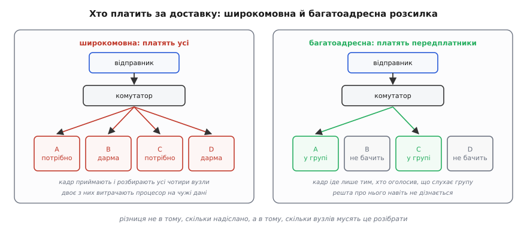
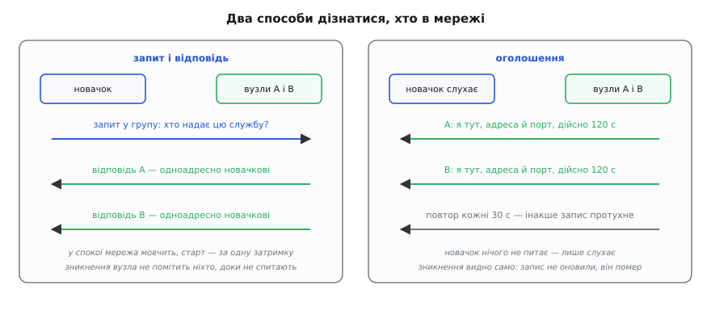

# Багатоадресна розсилка й виявлення вузлів

<preknowlist>
- [Сокети TCP/UDP](topic:programming/sockets-tcp-udp) — сокет як пара «адреса : порт», виклики `sendto`/`recvfrom`, чим датаграма відрізняється від потоку байтів.
- [Семантика датаграми UDP](topic:programming/udp-datagram-semantics) — датаграма може зникнути або здублюватися, і ніхто про це не повідомить.
- [MAC, IP і ARP](topic:communications/mac-ip-arp) — два поверхи адрес: MAC розносить кадр у межах одного сегмента, IP веде пакет через мережі.
- [Маршрутизація](topic:communications/ip-routing) — як маршрутизатор обирає, куди віддати пакет, і де проходить межа підмережі.
</preknowlist>

Щоб надіслати датаграму, треба знати адресу того, кому шлеш. А тепер уяви пристрій, який щойно ввімкнули в чужій мережі: він мусить знайти там свій сервер, але жодної адреси не має й узяти її нізвідки — DHCP роздав адреси кілька хвилин тому й завтра роздасть інакше. Виходить замкнене коло: щоб спитати «хто ти?», уже треба знати, кому адресувати питання.

Записати адреси в налаштування — означає перекласти проблему на людину, яка тепер правитиме ці налаштування після кожної зміни в мережі. Перебрати всі адреси підмережі теж не вихід: у мережі `/16` їх шістдесят п'ять тисяч, перебір триватиме хвилини й виглядатиме для служби безпеки точнісінько як сканування зловмисником.

Отже, потрібен спосіб надіслати пакет не комусь конкретному, а **тому, кого це стосується**. Мережа має два такі способи, і різняться вони головним — тим, хто платить за доставку.

## Крик на весь сегмент

Найпростіша ідея очевидна: якщо адресат невідомий, надішли всім. Мережа таке вміє знизу, з канального рівня: кадр із адресою призначення `ff:ff:ff:ff:ff:ff` комутатор не веде до когось одного, а розсилає в усі порти, крім того, звідки кадр прийшов. Це широкомовна розсилка (англ. *broadcast* — слово з сівби, «розкидати насіння широко»). У IP їй відповідають адреси `255.255.255.255` — «усім тут» — і адреса підмережі на кшталт `192.168.1.255`.

У коді це звичайний UDP з однією відмінністю: ядро вимагає явного дозволу, опції `SO_BROADCAST`. Дозвіл існує тому, що ця дія коштує дорого не тобі, а всім іншим, і система не хоче, щоб її вмикали друкарською помилкою в адресі.

Ціна така. Кадр приймає мережева карта **кожного** вузла сегмента, ядро кожного вузла піднімає його по стеку, шукає сокет на потрібному порті, не знаходить — і викидає пакет. Робота зроблена й змарнована на кожній машині, зокрема на тих, що працюють від батареї й прокинулися заради цього зі сну. Ніхто не може відмовитися платити.

Друга межа жорсткіша. **Маршрутизатор широкомовний пакет не пересилає** — інакше один вузол міг би залити роботою весь інтернет. Тож крик глухне на межі підмережі, і два поверхи будинку, розведені в різні підмережі, одне одного вже не чують.

## Адреса називає тему, а не машину

Переверни постановку. Біда широкомовлення в тому, що **відправник вирішує, кому платити**. Зроби навпаки: хай **отримувач заздалегідь оголосить, що йому цікаво**, а мережа доставляє лише тим, хто оголосив.

Для цього адреса має означати не машину, а тему. Такий діапазон виділено окремо: `224.0.0.0/4`, тобто все від `224.0.0.0` до `239.255.255.255`. Адреса звідти не належить жодному вузлові — вона називає **групу**, а вузли до групи **приєднуються**. Це багатоадресна розсилка (англ. *multicast*, від лат. *multi-* «багато»). Для власних протоколів бери смугу `239.0.0.0/8`: стандарт RFC 2365 закріпив її як нічию й таку, що не виходить за межі організації.

Головне тут — асиметрія. **Щоб слати в групу, приєднуватися не треба:** `sendto` на `239.1.2.3` виконає будь-хто, навіть не знаючи, чи його взагалі хтось слухає. **Щоб чути групу — треба приєднатися явно**, однією опцією сокета:

```c
struct ip_mreqn mreq = { 0 };
inet_pton(AF_INET, "239.1.2.3", &mreq.imr_multiaddr);   // яку групу слухати
mreq.imr_ifindex = if_nametoindex("eth0");              // НА ЯКОМУ інтерфейсі
setsockopt(sock, IPPROTO_IP, IP_ADD_MEMBERSHIP, &mreq, sizeof(mreq));
```

Другий аргумент важливіший, ніж здається: група живе в сегменті, а не в машині. Ноутбук із Wi-Fi, дротовим портом, мостом Docker і тунелем VPN має чотири сегменти — і чотири різні відповіді на питання «хто в групі». Один виклик підписує тебе рівно на один із них.

Приєднання, яке живе тільки у твоєму ядрі, ще нічого не змінює: ані комутатор, ані маршрутизатор про нього не знають. Тому про приєднання **оголошують уголос** — це робить окремий протокол, IGMP. Вузол шле звіт «я в групі `239.1.2.3`»; маршрутизатор сегмента періодично питає в усіх «хто в яких групах?»; якщо звітів про групу давно немає, її вважають порожньою й потік у сегмент більше не тягнуть. Реєстру з підтвердженнями тут немає взагалі: стан **тримається повторенням** і зникає сам, тому висмикнутий кабель не мусить породжувати жодного повідомлення про обрив.

І чесна засторога: звичайний дешевий комутатор групових адрес не розуміє й розсилає такий кадр у всі порти — тобто поводиться з ним як із широкомовним, і вся економія зникає. Справжня адресність з'являється лише на комутаторі, який підглядає звіти IGMP і запам'ятовує, з яких портів вони приходили.



*Різниця не в кількості надісланого, а в кількості вузлів, які мусять це прийняти й розібрати.*

## Від розсилки до знання

Розсилка дає лише транспорт крику. Знання про те, хто в мережі й як до нього достукатися, робить із крику **протокол виявлення**, і форм у нього рівно дві, дзеркальні одна одній.

**Запит і відповідь.** Новачок шле в групу питання «хто тут надає таку послугу?», а ті, кого це стосується, відповідають — і відповідають прямо йому, бо його адресу вже знають із самого запиту. Коли ніхто не питає, мережа мовчить. Але **зникнення ніхто не помітить**: вузол вимкнули, а новина про це не з'явиться, доки хтось не спитає знову.

**Оголошення.** Кожен сам періодично шле в групу «я тут, ось моя адреса й порт, це дійсне 120 секунд». Новачок нічого не питає — просто слухає й за кілька секунд має картину. Зникнення видно само: запис не оновили, він помер. Ціна — постійний фоновий трафік.

Робочі протоколи беруть обидві форми, бо вони закривають різні діри. [mDNS із DNS-SD](topic:programming/mdns-dns-sd) — це звичний словник DNS без сервера: імена на `.local`, запит у групу `224.0.0.251:5353`, оголошення при появі й прощання при виході (на пристроях Apple усе це зветься Bonjour, у Linux — Avahi). SSDP, яким користується побутова техніка з UPnP, живе на `239.255.255.250:1900` і має і пошуковий запит, і періодичні оголошення.



*Запит-відповідь дає миттєвий старт і тишу в спокої, але сліпий до зникнень; оголошення бачить зникнення, зате постійно шумить.*

## Чому оголошують себе цілком, а не змінами

Спокуслива економія — слати не весь стан, а самі зміни: «додався принтер», «зник сканер». У надійному каналі це було б правильно. Але канал тут — багатоадресний UDP, у якому втрата пакета нормальна й непомітна: підтверджень немає, а на Wi-Fi групові кадри не підтверджують ніколи. Один загублений пакет зі зміною — і картина в приймача розійдеться з дійсністю **назавжди**, бо наступні зміни ляжуть на неправильну основу, а сигналу «в тебе неправильно» не надійде.

Звідси єдина стійка форма: **кожне оголошення несе повний поточний стан, а кожен запис має час життя й помирає сам, якщо його не оновили**. Втрата пакета тоді коштує затримки до наступного оголошення — і нічого більше, правда сама себе полагодить. Такий устрій називають [м'яким станом](topic:programming/soft-state).

Звідси й наслідок, який спершу дивує: **повідомлення про вихід не мусить дійти**. Прощальний пакет — не гарантія, а ввічливість: він прибирає запис за секунду замість того, щоб чекати кінця строку. Загубився — нічого не зламалося. Протокол, у якому зникнення помічають **лише** з прощального пакета, не переживе першого ж висмикнутого кабелю живлення.

> 🔧 **Навіщо це.** Час життя запису — це не технічна дрібниця, а обіцянка застосунку: «стільки часу я можу помилятися». Виставив 300 секунд — зникнення пристрою користувач побачить через п'ять хвилин; виставив 10 — побачить одразу, але фоновий трафік виріс у тридцять разів. Цим одним числом і торгують затримку виявлення на трафік, і саме його називають першим, коли проєктують власне виявлення.

## Де це працює, а де ні

У межах одного сегмента багатоадресне виявлення робить рівно те, що обіцяє: жодного сервера, жодних налаштувань, стійкість до перезапусків. Поза сегментом воно майже всюди наштовхується на стіну.

**Межа підмережі закрита.** Група `224.0.0.0/24` не перетинає маршрутизатор ніколи, решта — лише якщо маршрутизатори налаштовано на пересилання групового трафіку; у домашніх мережах цього не роблять. Додай сюди типове значення поля TTL для групових пакетів — **одиниця**, тобто перший же маршрутизатор пакет викине, доки ти не поставиш більше явно.

**Wi-Fi послаблює її двічі.** Групові кадри йдуть на найповільнішій із домовлених швидкостей і без підтвердження, а ще їх притримують, поки хтось із клієнтів спить в енергоощадному режимі. Виходить дорого, ненадійно й з нерівною затримкою — тому в [бездротовій мережі](topic:communications/wifi) інтервали оголошень тримають довшими.

**У хмарі багатоадресності немає.** Віртуальна мережа провайдера групових пакетів не переносить, типовий міст Docker і більшість тунелів VPN — теж. Виявлення, що працювало на ноутбуці, мовчить у контейнері. Тому межа застосовності проста: один сегмент — багатоадресне виявлення; багато мереж або хмара — [реєстр](topic:programming/service-discovery), куди вузли записуються самі за наперед відомою адресою.

І остання межа, яку легко проґавити. **Виявлення не дає довіри.** Будь-хто в сегменті може оголосити будь-що: назватися твоїм сервером, відповісти на чужий запит раніше за справжнього власника імені, зібрати з чужих запитів перелік пристроїв. Багатоадресне виявлення відповідає на питання «хто, схоже, тут є», а не «кому можна вірити». Тому його результат — це список кандидатів, після якого йде звичайна перевірка: спільний ключ, сертифікат, підпис у першому ж повідомленні. Пропустити цей крок означає віддати керування тому, хто швидше відповів.
