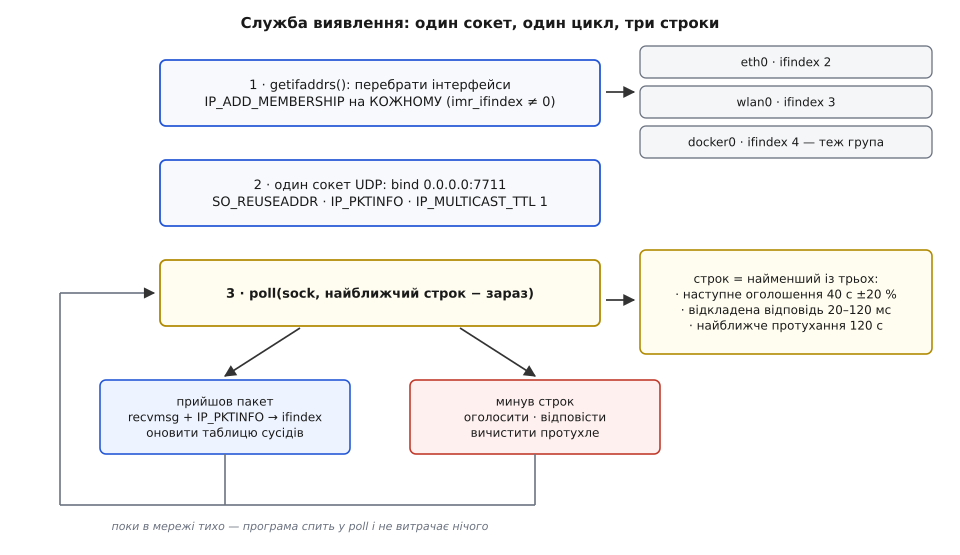

# ⚙️ Служба виявлення на C: повний код, що знаходить сусідів без сервера

Нижче — програма на C для POSIX, яка запускається на кожному вузлі, нікого не питає про адреси й за кілька секунд має таблицю всіх сусідів у сегменті: хто вони, за якою адресою й портом, що вміють і чи досі живі. Розібрано кожне рішення — від того, чому приєднання до групи робиться окремо на кожному інтерфейсі, до того, чому власні пакети відсіюють за ідентифікатором, а не вимкненою луною.

## Що саме має вміти програма

Домовмося про поведінку точно, бо половина помилок у такому коді береться з нечіткого контракту.

**Вузол оголошує себе сам.** Ніхто не мусить нічого питати, щоб дізнатися про новачка: той з'являється й одразу кричить у групу «я тут». Новачок, своєю чергою, теж може спитати — щоб не чекати на чуже чергове оголошення.

**Кожне оголошення несе повний стан**, а не зміни: сталий ідентифікатор, лічильник запусків, адресу, порт послуги, набір можливостей і час життя запису. Втрачений пакет тоді коштує затримки до наступного оголошення й нічого більше. Це загальний устрій, який називають [м'яким станом](topic:programming/soft-state): правда живе в джерела, а все, що записано в чужих таблицях, — строкова оренда.

**Запис у чужій таблиці помирає сам**, якщо його не поновили. Вузол, який вимкнули з розетки, нічого нікому не скаже — і саме таймер робить його зникнення видимим.

**Вузол відповідає на запит із затримкою**, а не миттєво: сотня вузлів, що відповідають в одну мілісекунду, знищить відповіді одне одного.

**При штатному виході вузол прощається** — надсилає пакет із часом життя нуль, щоб сусіди викинули запис негайно, а не через дві хвилини.

Робота ведеться на IPv4, на групі `239.7.7.7` і порту `7711` — смуга `239.0.0.0/8` нічия за домовленістю, тож брати з неї адресу для власного протоколу безпечно.

## Три числа, з яких випливає решта

Перш ніж писати рядок коду, треба назвати три сталі — усе інше в програмі є їхнім наслідком.

**Час життя запису — 120 секунд.** Це обіцянка: «стільки часу я можу помилятися, вважаючи живим того, кого вже немає». Число обирає застосунок, а не мережа.

**Період оголошень — 40 секунд, тобто третина часу життя.** Чому саме третина, видно з арифметики втрат. Хай кожен пакет губиться з імовірністю 5 % — звичайна цифра для Wi-Fi, де групові кадри йдуть без підтвердження:

```text
за час життя запису вміщається              120 / 40 = 3 оголошення
запис помре хибно, лише якщо зникнуть усі   p³ = 0.05³ = 1.25·10⁻⁴
нагода трапляється раз на період            40 / 1.25·10⁻⁴ ≈ 3.2·10⁵ с ≈ 3.7 доби
```

Раз на 3.7 доби на кожного сусіда — це мало для одного вузла й забагато для мережі з півсотні: приблизно раз на дві години хтось хибно «зникне» й за наступні сорок секунд «повернеться». Тому програма додає перепит: коли запис доживає останні 20 % свого строку й поновлення все нема, ми самі питаємо про нього — на 80, 85, 90 і 95 % життя. Це чотири додаткові нагоди, і всі мусять пропасти разом:

```text
три оголошення + чотири відповіді на перепит = 7 незалежних нагод
p⁷ = 0.05⁷ ≈ 7.8·10⁻¹⁰
40 / 7.8·10⁻¹⁰ ≈ 5·10¹⁰ с ≈ 1600 років
```

Тобто ніколи. Числа 80/85/90/95 не вигадані: рівно ці чотири відсотки часу життя запису називає RFC 6762 §5.2 як моменти, коли питальник mDNS має спробувати поновити запис, який його ще цікавить. Статус доказовості — усталений стандарт, чинний і широко втілений.

**Вікно відкладеної відповіді — 20–120 мілісекунд.** Пара теж узята з RFC 6762 (§6), де відповідачеві велено відкласти відповідь на випадковий час, рівномірно розподілений у цьому проміжку. Стоїть вона там не для краси: вона розводить у часі відповіді, що інакше стикалися б в ефірі.


*Вікна життя перекриваються втричі, тому втрата коштує нуль; справжнє зникнення видно рівно через час життя запису — і саме тому потрібен прощальний пакет.*

## Формат пакета: сорок байтів заголовка

Усі три різновиди пакета — оголошення, запит і прощання — мають однаковий заголовок. Розрізняє їх байт типу, а прощання додатково має нульовий час життя.

```text
зсув  розмір  поле
  0     4     "DSC1" — сигнатура, щоб одразу відкидати чуже
  4     1     версія протоколу
  5     1     тип: 1 оголошення · 2 запит · 3 прощання
  6     2     прапорці (резерв, нулі)
  8    16     сталий ідентифікатор вузла
 24     4     лічильник запусків
 28     4     час життя запису, секунди (0 = «забудь мене»)
 32     2     порт послуги
 34     2     маска можливостей
 36     2     довжина імені
 38     2     скільки записів «я вже знаю» далі (лише в запиті)
 40     …     ім'я, далі по 20 байтів на кожен запис «я вже знаю»
```

Усі багатобайтові поля — у мережевому порядку байтів, і кладемо ми їх у буфер вручну, побайтово, а не через `memcpy` зі структури: структура в пам'яті має вирівнювання й доповнення, які на різних машинах різні, тож покладатися на її розкладку не можна. [Чому саме так пакують двійковий протокол](topic:programming/wire-format-packing) — окрема розмова; тут беремо готове правило.

Далі — цілий файл шматками. Порядок розповіді й порядок у файлі не збігаються повністю: у файлі кожна функція мусить стояти після всіх, кого вона кличе, тож дрібні помічники з кінця розповіді лежать вище за `main`. Починається все з переліку сталих — тих самих трьох чисел і адреси групи:

```c
#define _GNU_SOURCE
#include <arpa/inet.h>
#include <errno.h>
#include <ifaddrs.h>
#include <net/if.h>
#include <netinet/in.h>
#include <poll.h>
#include <signal.h>
#include <stdint.h>
#include <stdio.h>
#include <stdlib.h>
#include <string.h>
#include <sys/socket.h>
#include <time.h>
#include <unistd.h>

#define DISC_GROUP    "239.7.7.7"
#define DISC_PORT     7711
#define PROTO_VER     1
#define HDR_LEN       40
#define PKT_MAX       512
#define REC_TTL_S     120        /* час життя запису в чужій таблиці, с */
#define ANN_PERIOD_S  40         /* період оголошень — третина життя запису */
#define REPLY_MIN_MS  20
#define REPLY_MAX_MS  120
#define RESCAN_MS     30000      /* як часто перебирати інтерфейси наново */
#define MAX_IFS       16
#define MAX_PEERS     256
#define STATE_PATH    "/var/lib/discoveryd/id"

enum { PKT_ANNOUNCE = 1, PKT_QUERY = 2, PKT_BYE = 3 };

struct self  { uint8_t id[16]; uint32_t incarnation; uint16_t port, caps; char name[64]; };
struct iface { unsigned index; char name[IF_NAMESIZE]; struct in_addr addr; };

static struct self        me;
static struct iface       ifs[MAX_IFS];
static int                nifs;
static int                sock;
static struct sockaddr_in group;

static uint64_t t_announce;    /* коли наступне оголошення */
static uint64_t t_answer;      /* 0 = відкладеної відповіді нема */
static uint64_t asked_ms;      /* коли надійшов запит, на який ми ще не відповіли */
static uint64_t answered_ms;   /* коли наш повний стан востаннє був в ефірі */
```

Пакування й розпакування полів — шість рядків без жодної залежності від машини:

```c
static void put_u16(uint8_t *p, uint16_t v) { p[0] = (uint8_t)(v >> 8); p[1] = (uint8_t)v; }
static void put_u32(uint8_t *p, uint32_t v)
{
    p[0] = (uint8_t)(v >> 24); p[1] = (uint8_t)(v >> 16);
    p[2] = (uint8_t)(v >> 8);  p[3] = (uint8_t)v;
}
static uint16_t get_u16(const uint8_t *p) { return (uint16_t)((uint16_t)p[0] << 8 | p[1]); }
static uint32_t get_u32(const uint8_t *p)
{
    return (uint32_t)p[0] << 24 | (uint32_t)p[1] << 16 | (uint32_t)p[2] << 8 | p[3];
}
```

Складання пакета з цього — одна функція на всі три різновиди; різняться вони лише байтом типу й часом життя:

```c
static size_t build(uint8_t *out, uint8_t type, uint32_t ttl_s)
{
    size_t nl = strlen(me.name);
    if (nl > 63) nl = 63;

    memcpy(out, "DSC1", 4);
    out[4] = PROTO_VER;
    out[5] = type;
    put_u16(out + 6,  0);                 /* прапорці — резерв */
    memcpy(out + 8, me.id, 16);
    put_u32(out + 24, me.incarnation);
    put_u32(out + 28, ttl_s);             /* нуль тут і є прощання */
    put_u16(out + 32, me.port);
    put_u16(out + 34, me.caps);
    put_u16(out + 36, (uint16_t)nl);
    put_u16(out + 38, 0);                 /* лічильник «я вже знаю» — заповнює лише запит */
    memcpy(out + HDR_LEN, me.name, nl);
    return HDR_LEN + nl;
}
```

Найбільший пакет — заголовок, ім'я до 63 байтів і до двадцяти записів «я вже знаю»: `40 + 63 + 20·20 = 503` байти. Це навмисно менше за півкілобайта: датаграма, що не влазить у кадр, розпадеться на частини, і втрата будь-якої вб'є всю датаграму цілком — а групові пакети губляться охоче.

## Тотожність, що переживає перезавантаження

Ключем таблиці не може бути адреса: DHCP видасть іншу, і той самий вузол з'явиться двічі. Отже, потрібен ідентифікатор, який не змінюється між запусками, і поруч — лічильник запусків, що дає розрізнити «той самий вузол досі живий» і «вузол перезавантажився, забудь усе накопичене».

Обидва числа беремо з невеликого файлу поруч зі станом служби. Перший запуск створює його, кожен наступний збільшує лічильник на одиницю:

```c
static int load_identity(const char *path)
{
    FILE *f = fopen(path, "r+b");
    if (f) {
        if (fread(me.id, 1, 16, f) == 16 &&
            fread(&me.incarnation, 1, 4, f) == 4) {
            me.incarnation++;                 /* новий запуск — нове втілення */
            rewind(f);
            fwrite(me.id, 1, 16, f);
            fwrite(&me.incarnation, 1, 4, f);
            fflush(f);
            fclose(f);
            return 0;
        }
        fclose(f);                            /* файл є, але зіпсутий — почнемо заново */
    }
    FILE *r = fopen("/dev/urandom", "rb");
    if (!r) return -1;
    size_t got = fread(me.id, 1, 16, r);
    fclose(r);
    if (got != 16) return -1;

    me.incarnation = 1;
    f = fopen(path, "wb");
    if (!f) return -1;
    fwrite(me.id, 1, 16, f);
    fwrite(&me.incarnation, 1, 4, f);
    fclose(f);
    return 0;
}
```

Шістнадцять випадкових байтів беруться раз і назавжди, тому серійний номер, MAC чи `/etc/machine-id` тут не потрібні — і це навіть краще: ідентифікатор не розповідає про залізо нічого зайвого. Лічильник записується в порядку байтів цієї машини, бо файл цю машину не покидає.

## Сокет: чотири опції, кожна з причини

```c
static int open_socket(void)
{
    int s = socket(AF_INET, SOCK_DGRAM, 0);
    if (s < 0) return -1;

    int yes = 1;
    setsockopt(s, SOL_SOCKET, SO_REUSEADDR, &yes, sizeof yes);
#ifdef SO_REUSEPORT
    setsockopt(s, SOL_SOCKET, SO_REUSEPORT, &yes, sizeof yes);   /* BSD, macOS */
#endif
    setsockopt(s, IPPROTO_IP, IP_PKTINFO, &yes, sizeof yes);     /* хочемо знати ifindex */

    unsigned char ttl = 1;                    /* ставимо явно, хоч типове те саме */
    setsockopt(s, IPPROTO_IP, IP_MULTICAST_TTL, &ttl, sizeof ttl);
    unsigned char loop = 1;                   /* луну НЕ вимикаємо, і це навмисно */
    setsockopt(s, IPPROTO_IP, IP_MULTICAST_LOOP, &loop, sizeof loop);

    struct sockaddr_in a;
    memset(&a, 0, sizeof a);
    a.sin_family      = AF_INET;
    a.sin_port        = htons(DISC_PORT);
    a.sin_addr.s_addr = htonl(INADDR_ANY);
    if (bind(s, (struct sockaddr *)&a, sizeof a) < 0) { close(s); return -1; }
    return s;
}
```

`SO_REUSEADDR` тут не косметика. Порт виявлення фіксований, і претендентів на нього на одній машині зазвичай кілька: сама служба, діагностична утиліта, друга копія під час оновлення. Без цієї опції другий процес не прив'яжеться взагалі — `bind` поверне `EADDRINUSE`, і служба просто не стартує. На BSD і macOS самого `SO_REUSEADDR` мало — там ділити порт між сокетами дозволяє `SO_REUSEPORT`, тому ставимо обидві, а `#ifdef` рятує Linux старих версій, де другої немає.

`bind` іде на `INADDR_ANY`, а не на адресу групи. Прив'язка до групової адреси працює на Linux і звужує потік рівно до цієї групи, але на Windows і частині BSD така прив'язка або відкидається, або поводиться інакше. Ціна вибору чесна: на `INADDR_ANY` до нас потраплять і звичайні одноадресні датаграми, надіслані на цей порт, тож сигнатуру `"DSC1"` на початку пакета доводиться перевіряти всерйоз.

`IP_MULTICAST_TTL` виставляємо явно, хоча типове значення й так одиниця: явний рядок у коді розповідає читачеві про намір — служба навмисно не виходить за межі сегмента. [Решта загальних налаштувань сокета](topic:programming/socket-options) — буфери, таймаути, розміри черг — до цього коду не має стосунку.

А от `IP_MULTICAST_LOOP` ми свідомо лишаємо ввімкненою. Спокуса вимкнути її велика: тоді ядро не віддаватиме нам копії власних пакетів, і не треба відсіювати себе. Але луна на цій машині одна на всіх: вимкнувши її, ми осліпимо не лише себе, а й будь-який інший процес на тому самому вузлі — службу перестане бачити діагностична утиліта, а друга копія служби не помітить першої. Тому себе відсіюємо в застосунку, за ідентифікатором у пакеті, і саме тому в заголовку він є завжди.

## Приєднання: окремо на кожному інтерфейсі

Група живе в сегменті, а не в машині. Ноутбук із Wi-Fi, дротовим портом, мостом Docker і тунелем VPN має чотири сегменти й чотири різні відповіді на питання «хто в групі». Один виклик `IP_ADD_MEMBERSHIP` підписує рівно на один із них.

```c
static int join_all(int s, struct iface *out, int max)
{
    struct ifaddrs *list, *p;
    int n = 0;
    if (getifaddrs(&list) < 0) return -1;

    for (p = list; p && n < max; p = p->ifa_next) {
        if (!p->ifa_addr || p->ifa_addr->sa_family != AF_INET) continue;
        if (!(p->ifa_flags & IFF_UP))        continue;   /* інтерфейс опущено */
        if (!(p->ifa_flags & IFF_MULTICAST)) continue;   /* груп не вміє */
        if (p->ifa_flags & IFF_LOOPBACK)     continue;   /* сам із собою не говоримо */

        unsigned idx = if_nametoindex(p->ifa_name);
        if (idx == 0) continue;

        int seen = 0;                                    /* на інтерфейсі буває кілька адрес */
        for (int i = 0; i < n; i++) if (out[i].index == idx) seen = 1;
        if (seen) continue;

        struct ip_mreqn mreq;
        memset(&mreq, 0, sizeof mreq);
        inet_pton(AF_INET, DISC_GROUP, &mreq.imr_multiaddr);
        mreq.imr_ifindex = (int)idx;                     /* ОСЬ головний рядок */

        if (setsockopt(s, IPPROTO_IP, IP_ADD_MEMBERSHIP, &mreq, sizeof mreq) < 0
            && errno != EADDRINUSE) {                    /* EADDRINUSE = вже в групі */
            fprintf(stderr, "приєднання на %s: %s\n", p->ifa_name, strerror(errno));
            continue;                                    /* один не вдався — решта живе */
        }
        out[n].index = idx;
        snprintf(out[n].name, sizeof out[n].name, "%s", p->ifa_name);
        out[n].addr = ((struct sockaddr_in *)p->ifa_addr)->sin_addr;
        n++;
    }
    freeifaddrs(list);
    return n;
}
```

Три деталі, повз які легко пройти.

`getifaddrs` повертає **по одному запису на кожну адресу**, а не на інтерфейс: інтерфейс із двома IPv4-адресами трапиться двічі, а з IPv6 — ще й у записах іншої родини. Тому перевірка `sa_family != AF_INET` і відсів уже баченого індексу — не перестрахування, а необхідність: подвійне приєднання поверне `EADDRINUSE`.

`imr_ifindex` не можна лишати нулем. Нуль означає «обери сам», і ядро обирає за таблицею маршрутизації — тобто за типовим маршрутом. На машині з кількома мережами це майже завжди не та мережа, яку ти мав на увазі. Структура `ip_mreqn` з полем-індексом є на Linux; портативний відповідник `ip_mreq` називає інтерфейс його адресою (`imr_interface`), і саме тому він гірший: адреса ще може бути не видана DHCP, може змінитися й може повторюватися на двох інтерфейсах, а індекс у інтерфейсу є завжди й один.

Помилка на одному інтерфейсі не спиняє решту. Тунель, що впав секунду тому, не має ставати причиною, чому служба не бачить дротову мережу.

> 🔧 **Навіщо це.** Найчастіша скарга на багатоадресне виявлення звучить так: «на ноутбуці все працює, на сервері — тиша». Причина зазвичай тут: на ноутбуці мережа одна, тож вибір ядра випадково збігся з наміром, а на сервері є ще міст Docker, агрегований канал і VPN — і приєднання пішло не туди. Перевірка коштує один рядок: `ip maddr show` показує, у яких групах вузол на якому інтерфейсі. Порожньо на потрібному інтерфейсі — шукати треба `imr_ifindex`, а не помилку в протоколі.

Інтерфейси з'являються й зникають на ходу: Wi-Fi перепідключився, VPN підняли, Docker створив міст. Приєднання, зроблене раз на старті, разом із інтерфейсом і помирає — тому головний цикл раз на тридцять секунд викликає `join_all` наново. Повторне приєднання на вже приєднаному інтерфейсі повертає `EADDRINUSE`, і саме тому ця помилка тут мовчазна.

## Надсилання: інтерфейс кладемо в повідомлення, а не в сокет

Оголосити себе треба **в кожному сегменті**, а не в одному. Очевидний спосіб — перед кожним `sendto` міняти `IP_MULTICAST_IF`. Він працює, але має ваду: вихідний інтерфейс стає станом сокета, а стан, який треба перемикати перед кожною дією, ламається щоразу, коли поруч з'явиться другий потік.

Кращий спосіб — сказати інтерфейс у самому виклику надсилання, супровідним повідомленням:

```c
static void send_on(unsigned ifindex, const void *buf, size_t len)
{
    struct iovec io;
    io.iov_base = (void *)buf;
    io.iov_len  = len;

    union {                                   /* об'єднання дає потрібне вирівнювання */
        struct cmsghdr align;
        char           raw[CMSG_SPACE(sizeof(struct in_pktinfo))];
    } ctl;
    memset(&ctl, 0, sizeof ctl);

    struct msghdr m;
    memset(&m, 0, sizeof m);
    m.msg_name       = (void *)&group;        /* 239.7.7.7:7711 */
    m.msg_namelen    = sizeof group;
    m.msg_iov        = &io;
    m.msg_iovlen     = 1;
    m.msg_control    = ctl.raw;
    m.msg_controllen = sizeof ctl.raw;

    struct cmsghdr *c = CMSG_FIRSTHDR(&m);
    c->cmsg_level = IPPROTO_IP;
    c->cmsg_type  = IP_PKTINFO;
    c->cmsg_len   = CMSG_LEN(sizeof(struct in_pktinfo));

    struct in_pktinfo pi;
    memset(&pi, 0, sizeof pi);
    pi.ipi_ifindex = ifindex;                 /* цей пакет — саме в цей сегмент */
    memcpy(CMSG_DATA(c), &pi, sizeof pi);
    m.msg_controllen = CMSG_SPACE(sizeof(struct in_pktinfo));

    if (sendmsg(sock, &m, 0) < 0 && errno != ENETUNREACH && errno != ENETDOWN)
        fprintf(stderr, "надсилання на if%u: %s\n", ifindex, strerror(errno));
}
```

Документація ядра описує це прямо: якщо `IP_PKTINFO` передано в `sendmsg` і поле `ipi_ifindex` ненульове, індекс бере участь у пошуку маршруту — для групової адреси, якій у таблиці маршрутизації нічого не відповідає, це і є вибір вихідного інтерфейсу. Стан у сокеті при цьому не змінюється взагалі: два потоки можуть слати в різні сегменти одночасно.

`ENETUNREACH` і `ENETDOWN` тут мовчазні свідомо. Інтерфейс міг зникнути між нашим переліком і надсиланням; це нормальний стан речей, а не привід засипати журнал.

```c
static void announce(uint32_t ttl_s, uint8_t type)
{
    uint8_t buf[PKT_MAX];
    size_t  len = build(buf, type, ttl_s);
    for (int i = 0; i < nifs; i++)
        send_on(ifs[i].index, buf, len);
    answered_ms = now_ms();                   /* повний стан щойно був в ефірі */
}
```

## Приймання: на який інтерфейс прийшло

Прийняти замало — треба знати, **звідки**. Той самий вузол може бути видимий і через дротову мережу, і через Wi-Fi; той самий ідентифікатор, що прийшов через VPN, означає зовсім інший маршрут, ніж коли він приходить із сусіднього порту комутатора. Тому замість `recvfrom` беремо `recvmsg` і читаємо супровідні повідомлення:

```c
static void receive_one(void)
{
    uint8_t buf[PKT_MAX];
    struct sockaddr_in from;
    struct iovec io;
    io.iov_base = buf;
    io.iov_len  = sizeof buf;

    union { struct cmsghdr align; char raw[CMSG_SPACE(sizeof(struct in_pktinfo))]; } ctl;

    struct msghdr m;
    memset(&m, 0, sizeof m);
    m.msg_name       = &from;
    m.msg_namelen    = sizeof from;
    m.msg_iov        = &io;
    m.msg_iovlen     = 1;
    m.msg_control    = ctl.raw;
    m.msg_controllen = sizeof ctl.raw;

    ssize_t n = recvmsg(sock, &m, 0);
    if (n < 0) return;
    if (m.msg_flags & MSG_TRUNC) return;      /* більша за наш буфер — точно не наша */

    unsigned ifindex = 0;
    for (struct cmsghdr *c = CMSG_FIRSTHDR(&m); c; c = CMSG_NXTHDR(&m, c))
        if (c->cmsg_level == IPPROTO_IP && c->cmsg_type == IP_PKTINFO) {
            struct in_pktinfo pi;
            memcpy(&pi, CMSG_DATA(c), sizeof pi);   /* саме memcpy: вирівнювання */
            ifindex = pi.ipi_ifindex;
        }
    on_packet(buf, (size_t)n, &from.sin_addr, ifindex);
}
```

Два місця, де тут спотикаються. `CMSG_DATA` повертає вказівник у байтовий буфер, і читати з нього структуру приведенням типу не можна: на архітектурах, вимогливих до вирівнювання, це рівно те місце, де програма падає в польоті, а не на столі. Через `memcpy` компілятор зробить правильно й безкоштовно. І `MSG_TRUNC` у `msg_flags` — не помилка приймання, а звіт: датаграма була довша за буфер, залишок ядро викинуло. Розбирати обрізане не варто.

## Таблиця сусідів

```c
struct peer {
    uint8_t        id[16];
    uint32_t       incarnation;
    struct in_addr addr;
    uint16_t       port;
    uint16_t       caps;
    char           name[64];
    unsigned       ifindex;
    uint64_t       ttl_ms;          /* скільки життя дав сам вузол */
    uint64_t       expires_ms;      /* коли викинути */
    uint64_t       probe_ms;        /* коли перепитати */
    int            probe_step;      /* 0…3: 80 %, 85 %, 90 %, 95 % */
};

static struct peer peers[MAX_PEERS];
static int          npeers;

static struct peer *peer_find(const uint8_t id[16])
{
    for (int i = 0; i < npeers; i++)
        if (memcmp(peers[i].id, id, 16) == 0) return &peers[i];
    return NULL;
}

static void schedule_probe(struct peer *p)
{
    static const unsigned left[4] = { 20, 15, 10, 5 };     /* % життя, що лишилося */
    if (p->probe_step >= 4) { p->probe_ms = p->expires_ms; return; }
    p->probe_ms = p->expires_ms - p->ttl_ms * left[p->probe_step] / 100;
}
```

Оновлення запису — місце, де лічильник запусків нарешті працює:

```c
static void peer_update(const uint8_t *id, uint32_t inc, const struct in_addr *ip,
                        uint16_t port, uint16_t caps, const char *name, size_t nl,
                        uint32_t ttl_s, unsigned ifindex)
{
    struct peer *p = peer_find(id);

    if (ttl_s == 0) {                        /* прощання */
        if (p) { printf("— пішов %s\n", p->name); *p = peers[--npeers]; }
        return;
    }
    if (!p) {
        if (npeers == MAX_PEERS) return;     /* краще не взяти нового, ніж утратити всіх */
        p = &peers[npeers++];
        memset(p, 0, sizeof *p);
        memcpy(p->id, id, 16);
    }
    if (inc < p->incarnation) return;        /* пакет старіший за те, що ми вже знаємо */
    if (inc > p->incarnation) p->caps = 0;   /* вузол перезапустився: накопичене недійсне */

    p->incarnation = inc;
    p->addr    = *ip;
    p->port    = port;
    p->caps    = caps;
    p->ifindex = ifindex;
    memcpy(p->name, name, nl);
    p->name[nl] = '\0';

    uint64_t t   = now_ms();
    p->ttl_ms     = (uint64_t)ttl_s * 1000u;
    p->expires_ms = t + p->ttl_ms;
    p->probe_step = 0;
    schedule_probe(p);
}
```

Перевірка `inc < p->incarnation` відкидає пакет, що затримався в мережі й прийшов після новішого. Це не рідкість: датаграми не гарантують порядку, і без цього рядка старе оголошення воскресило б адресу, яку вузол уже змінив. [Чому в UDP так і що ще з цього випливає](topic:programming/udp-datagram-semantics) — тема сама по собі.

Викидання протухлих — три рядки, і головна хитрість у тому, що дірку в масиві затуляє останній елемент, тож пересувати нічого не треба:

```c
static void sweep(uint64_t t)
{
    for (int i = 0; i < npeers; ) {
        if (peers[i].expires_ms <= t) {
            printf("— зник %s (мовчав %llu с)\n", peers[i].name,
                   (unsigned long long)(peers[i].ttl_ms / 1000u));
            peers[i] = peers[--npeers];
        } else i++;
    }
}
```

## Запит: перелік того, що вже знаємо

Запит потрібен у двох випадках: одразу після старту, щоб не чекати на чужі оголошення, і коли запис доживає останні відсотки строку. В обох випадках ми кладемо в запит **перелік того, що вже знаємо** — і той, хто бачить себе в переліку, мовчить. У сталій мережі, де питальник знає майже всіх, запит тоді не породжує майже жодної відповіді.

```c
static void send_query(uint64_t t)
{
    uint8_t buf[PKT_MAX];
    size_t  len = build(buf, PKT_QUERY, REC_TTL_S);
    size_t  kn  = 0;

    for (int i = 0; i < npeers && len + 20 <= PKT_MAX && kn < 20; i++) {
        if (peers[i].probe_step != 0 || peers[i].probe_ms <= t) continue;  /* цих і питаємо */
        memcpy(buf + len, peers[i].id, 16);
        put_u32(buf + len + 16, peers[i].incarnation);
        len += 20;
        kn++;
    }
    put_u16(buf + 38, (uint16_t)kn);

    for (int i = 0; i < nifs; i++)
        send_on(ifs[i].index, buf, len);
}
```

Умова відбору читається так: у перелік «уже знаю» потрапляють лише записи, які ще не почали доживати. Щойно ми взялися перепитувати про сусіда, ми перестаємо стверджувати, що його знаємо, — інакше він побачив би себе в переліку й змовчав, а саме від нього ми й хочемо почути.

Разом із лічильником запусків перелік дає ще один безкоштовний ефект: вузол, який перезавантажився, побачить у переліку **старе** значення лічильника й відповість, дарма що ідентифікатор збігся.

Запускає перепит одна коротка функція, яку головний цикл кличе на кожному оберті. Важливо, що запит вона шле **один на всіх**, чиї записи доживають, а не окремий на кожного:

```c
static void probe_due(uint64_t t)
{
    int need = 0;
    for (int i = 0; i < npeers; i++)
        if (peers[i].probe_step < 4 && peers[i].probe_ms <= t) { need = 1; break; }
    if (!need) return;

    send_query(t);
    for (int i = 0; i < npeers; i++)
        if (peers[i].probe_step < 4 && peers[i].probe_ms <= t) {
            peers[i].probe_step++;          /* наступна спроба — на 85, 90, 95 % */
            schedule_probe(&peers[i]);
        }
}
```

## Розбір пакета: нічого не брати на віру

```c
static void on_packet(const uint8_t *b, size_t n, const struct in_addr *from, unsigned ifindex)
{
    if (n < HDR_LEN || memcmp(b, "DSC1", 4) != 0 || b[4] != PROTO_VER) return;

    uint8_t  type = b[5];
    uint32_t inc  = get_u32(b + 24);
    uint32_t ttl  = get_u32(b + 28);
    uint16_t port = get_u16(b + 32);
    uint16_t caps = get_u16(b + 34);
    size_t   nl   = get_u16(b + 36);
    size_t   kn   = get_u16(b + 38);

    if (nl > 63 || n < HDR_LEN + nl + kn * 20) return;   /* обрізаний або брехливий */

    if (memcmp(b + 8, me.id, 16) == 0) {                 /* пакет ПРО НАС */
        if (type != PKT_QUERY) answered_ms = now_ms();   /* наша відповідь уже в ефірі */
        return;
    }

    peer_update(b + 8, inc, from, port, caps, (const char *)b + HDR_LEN, nl, ttl, ifindex);

    if (type == PKT_QUERY) {
        const uint8_t *ka = b + HDR_LEN + nl;
        for (size_t i = 0; i < kn; i++)
            if (memcmp(ka + i * 20, me.id, 16) == 0 &&
                get_u32(ka + i * 20 + 16) == me.incarnation)
                return;                                  /* нас уже знають — мовчимо */
        schedule_answer(now_ms());
    }
}
```

Рядок `n < HDR_LEN + nl + kn * 20` — це не педантизм. Довжини в пакеті пише **чужа сторона**, і вона не зобов'язана бути ні правдивою, ні дружньою. Без цієї перевірки цикл по переліку «я вже знаю» вийшов би за кінець буфера, а зіпсутий (або зловмисний) пакет із групи, куди пише хто завгодно, — це вхід, до якого має доступ будь-хто в сегменті.

Відсів власних пакетів — один `memcmp` за ідентифікатором. Зверни увагу, що це **не те саме**, що відсів за адресою відправника: наша адреса могла щойно змінитися, а на машині з кількома інтерфейсами вона взагалі не одна. Ідентифікатор же в нас рівно один.

Ще один випадок ховається в тій самій гілці. Якщо пакет із **нашим** ідентифікатором надійшов не від нас, це означає, що потрібну відповідь уже видно в ефірі — так буває, коли хтось відповідає за нас із кешу. Тоді відкладену відповідь можна не давати зовсім, і саме тому ми там оновлюємо `answered_ms`.

## Відповідь із затримкою, яку можна скасувати

```c
static void schedule_answer(uint64_t t)
{
    uint64_t d = t + REPLY_MIN_MS + (uint64_t)(rand() % (REPLY_MAX_MS - REPLY_MIN_MS + 1));
    if (t_answer == 0 || d < t_answer) t_answer = d;   /* кілька запитів — одна відповідь */
    asked_ms = t;
}
```

Слот відповіді один на всю програму, і це навмисно. Коли в мережу заходить десяток вузлів одразу, кожен із них шле запит; відповідати десять разів безглуздо — наша відповідь іде в **групу**, тож перший же відправлений повний стан задовольняє всіх питальників одразу.

Скасування живе в головному циклі й тримається на двох мітках часу:

```c
if (t_answer && t >= t_answer) {
    if (answered_ms <= asked_ms)               /* після запиту нас в ефірі не було */
        announce(REC_TTL_S, PKT_ANNOUNCE);
    t_answer = 0;                              /* або надіслано, або скасовано */
}
```

`answered_ms` оновлюється у двох місцях: коли ми самі щось оголосили і коли ми почули в групі пакет із нашим ідентифікатором. Тому відповідь скасовується в трьох різних ситуаціях, і всі три законні: за час затримки настав час чергового оголошення; на попередній запит ми вже відповіли; хтось відповів за нас. Перевірка одна на всі три.

## Головний цикл: один сокет, один `poll`, три строки

Уся програма — один потік без жодного таймера операційної системи. Час до найближчої справи рахуємо самі й віддаємо його в `poll` як тайм-аут; поки в мережі тихо, процес спить і не витрачає нічого.

```c
int main(int argc, char **argv)
{
    if (argc < 3) { fprintf(stderr, "вжиток: %s <ім'я> <порт-послуги>\n", argv[0]); return 2; }
    snprintf(me.name, sizeof me.name, "%s", argv[1]);
    me.port = (uint16_t)atoi(argv[2]);
    me.caps = 1;
    if (load_identity(STATE_PATH) < 0) { perror("тотожність"); return 1; }

    struct sigaction sa;
    memset(&sa, 0, sizeof sa);
    sa.sa_handler = on_signal;            /* без SA_RESTART: poll має вийти з EINTR */
    sigaction(SIGINT,  &sa, NULL);
    sigaction(SIGTERM, &sa, NULL);

    memset(&group, 0, sizeof group);
    group.sin_family = AF_INET;
    group.sin_port   = htons(DISC_PORT);
    inet_pton(AF_INET, DISC_GROUP, &group.sin_addr);

    sock = open_socket();
    if (sock < 0) { perror("сокет"); return 1; }
    nifs = join_all(sock, ifs, MAX_IFS);
    if (nifs <= 0) { fprintf(stderr, "жодного придатного інтерфейсу\n"); return 1; }

    srand((unsigned)(now_ms() ^ (uint64_t)getpid()));
    t_announce = now_ms();                /* оголоситися негайно, не чекаючи періоду */
    send_query(now_ms());                 /* і одразу спитати, хто вже тут */
    uint64_t t_rescan = now_ms() + RESCAN_MS;

    while (!stop) {
        uint64_t t = now_ms();
        uint64_t due = t_announce;
        if (t_answer && t_answer < due) due = t_answer;
        if (t_rescan < due) due = t_rescan;
        for (int i = 0; i < npeers; i++) {
            if (peers[i].probe_ms   < due) due = peers[i].probe_ms;
            if (peers[i].expires_ms < due) due = peers[i].expires_ms;
        }
        int wait = due > t ? (int)(due - t) : 0;

        struct pollfd pfd;
        pfd.fd = sock; pfd.events = POLLIN; pfd.revents = 0;
        int r = poll(&pfd, 1, wait);
        if (r > 0) receive_one();
        else if (r < 0 && errno != EINTR) break;

        t = now_ms();
        if (t >= t_announce) {
            announce(REC_TTL_S, PKT_ANNOUNCE);
            t_announce = t + jittered(ANN_PERIOD_S);
        }
        if (t_answer && t >= t_answer) {
            if (answered_ms <= asked_ms) announce(REC_TTL_S, PKT_ANNOUNCE);
            t_answer = 0;                    /* або надіслано, або скасовано */
        }
        probe_due(t);
        sweep(t);
        if (t >= t_rescan) {                 /* інтерфейси з'являються й зникають */
            nifs = join_all(sock, ifs, MAX_IFS);
            t_rescan = t + RESCAN_MS;
        }
    }

    announce(0, PKT_BYE);                    /* прощання: час життя нуль */
    close(sock);
    return 0;
}
```



*Строк — це найменше з трьох чисел: коли оголошуватися, коли віддати відкладену відповідь і коли викинути найстаріший запис. Усе інше програма проспить.*

Час беремо **монотонний**, а не настінний:

```c
static uint64_t now_ms(void)
{
    struct timespec ts;
    clock_gettime(CLOCK_MONOTONIC, &ts);
    return (uint64_t)ts.tv_sec * 1000u + (uint64_t)ts.tv_nsec / 1000000u;
}
```

Настінний годинник стрибає: NTP підправив його назад на секунду — і всі строки раптом у майбутньому; підправив уперед на годину — і вся таблиця вимерла одночасно. Монотонний годинник не стрибає ніколи, бо не має до дати жодного стосунку; [різницю між двома годинниками](topic:programming/monotonic-vs-wall-time) варто засвоїти раз і назавжди.

Розкид періоду — три рядки, і без нього вузли, увімкнені разом (наприклад, після відновлення живлення в будинку), назавжди лишалися б у фазі й били б в ефір одночасно:

```c
static uint64_t jittered(uint32_t base_s)
{
    double k = 0.8 + 0.4 * ((double)rand() / ((double)RAND_MAX + 1.0));   /* ±20 % */
    return (uint64_t)(base_s * 1000.0 * k);
}
```

Якість випадковості тут не має значення — важливо лише, щоб сусіди не збігалися; тому `rand`, засіяного часом і номером процесу, достатньо.

Вихід ловимо сигналом, і весь обробник — два рядки:

```c
static volatile sig_atomic_t stop;
static void on_signal(int s) { (void)s; stop = 1; }
```

Обробник робить рівно одну річ — ставить прапорець типу `volatile sig_atomic_t`; будь-що більше в обробнику [небезпечне з причин, що стосуються не цієї програми, а сигналів узагалі](topic:programming/posix-signals). А ставиться він **без** `SA_RESTART` — і саме через це `poll` після сигналу не перезапускається сам, а повертає `EINTR`, цикл добігає до кінця й бачить `stop`. Із `SA_RESTART` програма застрягла б у чеканні на наступний пакет і померла б, не попрощавшись.

І остання деталь прощання, про яку сперечаються найчастіше. Нуль ставиться в **час життя запису** — поле нашого протоколу, — а не в поле TTL заголовка IP. Пакет із мережевим TTL нуль не вийшов би з машини взагалі. Так само влаштоване прощання в mDNS: RFC 6762 §10.1 велить надіслати той самий запис із тим самим умістом, але з нульовим часом життя — «an RR TTL of zero», тобто нуль у полі запису, а не в лічильнику стрибків заголовка IP.

## Ціна

**Трафік.** Пакет — 40 байтів заголовка плюс коротке ім'я, разом близько 52 байтів корисних даних:

```text
кадр = 52 Б даних + 8 Б UDP + 20 Б IP + 38 Б Ethernet (з преамбулою й проміжком) = 118 Б
50 вузлів, період 40 с   → 50/40 = 1.25 кадру/с  →  ≈ 1.2 кБіт/с
у Wi-Fi на базових 6 Мбіт/с один кадр займає ефіру ≈ 274 мкс
                          → 1.25 · 274 мкс ≈ 0.034 % ефіру
500 вузлів                → 12.5 кадру/с ≈ 0.34 % ефіру
```

Тобто фонове оголошення в сотнях вузлів коштує частки відсотка. Дорого коштують не оголошення, а **запити**, на які всі відповідають одночасно, — і саме тому вікно розкиду й перелік «я вже знаю» в коді є, а не «додамо потім».

**Пам'ять.** `struct peer` — близько 128 байтів; таблиця на 256 сусідів — 32 кілобайти, статично, без жодного `malloc`. Це вміщається в мікроконтролер, не те що в сервер.

**Процесор.** `peer_find` — лінійний пошук: `memcmp` по всій таблиці на кожен пакет. Пакетів приходить `N/40` за секунду, тож усього виходить `N²/40` порівнянь за секунду: для 500 вузлів це 6250 порівнянь по 16 байтів — величина, якої не видно в жодному профілі. Замінювати масив хеш-таблицею тут нема сенсу: набагато раніше за процесор здасться ефір.

**Затримки.** Поява нового вузла видима миттєво — він оголошується одразу на старті. Штатне зникнення теж миттєве — прощальний пакет. А от аварійне зникнення (обрив живлення) видно рівно через час життя запису: 120 секунд, ані швидше. Хочеш швидше — зменшуй час життя й плати трафіком; іншого важеля немає.

## Пастки

**Нуль замість індексу інтерфейсу.** `imr_ifindex = 0` у `ip_mreqn` (або `imr_interface = INADDR_ANY` у старому `ip_mreq`) віддає вибір ядру, і воно бере інтерфейс за типовим маршрутом. Симптом: помилки немає, пакетів немає.

**Приєднання зроблено раз на старті.** Wi-Fi перепідключився, VPN піднявся, Docker створив міст — і членство в групі на новому інтерфейсі ніхто не оформив. Симптом: після перепідключення тиша, до перезапуску служби. Ліки — періодичний повторний перебір (або підписка на події мережі через netlink).

**TTL дорівнює одиниці — і це типове значення.** Групові пакети не переживають першого ж маршрутизатора. Дзеркальна пастка: підняти TTL, щоб дістати сусідню підмережу, для адрес зі смуги `224.0.0.0/24` не допоможе ніколи — там діє окреме правило про діапазон, а не про лічильник.

**Трафік зникає рівно через 260 секунд.** Комутатор із підгляданням IGMP, але без опитувача в сегменті: він побудував таблицю груп за першими звітами, а потім таймер членства (`2 × 125 + 10` секунд у типових налаштуваннях) її очистив, і поновити її нікому. Симптом впізнаваний до хвилини: «працює чотири хвилини, потім мовчить». Ліки не в коді: увімкнути опитувача на комутаторі або вимкнути підглядання.

**`EADDRINUSE` на BSD і macOS.** Самого `SO_REUSEADDR` там мало — треба ще `SO_REUSEPORT`. Симптом: перша копія служби працює, друга не стартує; або служба працює, а діагностична утиліта не чує нічого.

**Датаграма більша за MTU.** Перелік «я вже знаю» росте з кількістю сусідів, і без обмеження пакет одного дня перевищить кадр. Фрагментована датаграма гине цілком від утрати будь-якої частини, а групові фрагменти губляться охоче. Тримай пакет під 1400 байтами й ріж перелік — саме тому в `send_query` стоїть `kn < 20`.

**Вимкнена луна замість відсіву за ідентифікатором.** `IP_MULTICAST_LOOP = 0` прибирає не лише твої власні пакети, а й пакети всіх процесів на цій машині. Симптом: усе працює, доки не запустиш поруч другу копію або утиліту діагностики.

**Настінний годинник у строках.** `gettimeofday` чи `CLOCK_REALTIME` замість `CLOCK_MONOTONIC`: після синхронізації часу вся таблиця або вимирає одночасно, або живе вічно.

**Читання `in_pktinfo` приведенням вказівника.** `struct in_pktinfo *pi = (void *)CMSG_DATA(c)` — на архітектурах, вимогливих до вирівнювання, це падіння в польоті. Тільки `memcpy`.

**Довіра до довжин у пакеті.** У групу пише будь-хто в сегменті. Поле довжини імені й лічильник записів треба звіряти з фактично прийнятим розміром **до** першого читання за цим зміщенням.

**Ідентифікатор без лічильника запусків.** Вузол перезавантажився за десять секунд — і сусіди навіть не помітили, бо ідентифікатор той самий, а запис іще живий. Усе, що вони про нього накопичили, лишилося чинним, дарма що вузол уже інший.

## Складання й перевірка

```text
cc -std=c11 -D_GNU_SOURCE -Wall -Wextra -O2 discoveryd.c -o discoveryd
./discoveryd alpha 8080
```

Дві діагностичні дії, що дають відповідь швидше за годину читання журналу: `ip maddr show` показує, у яких групах вузол і на якому саме інтерфейсі (тут має бути `239.7.7.7` навпроти кожного потрібного імені), а `tcpdump -i eth0 -n 'udp port 7711'` показує, чи пакети взагалі виходять і чи приходять чужі. Порожньо в першому — шукай `imr_ifindex`. Свої пакети видно, чужих немає — шукай підглядання IGMP на комутаторі. Усе видно, а таблиця порожня — шукай помилку в розборі.
