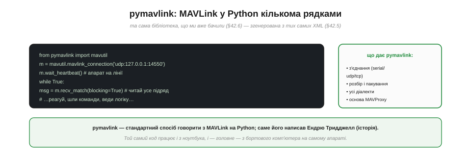
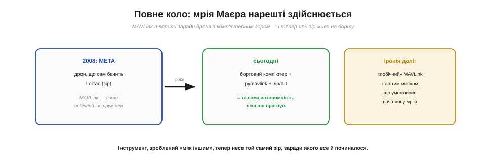
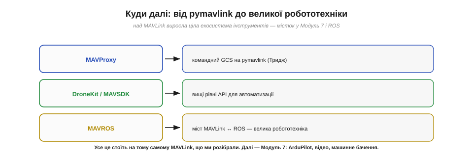

# Автоматизація: pymavlink (місток до бортового комп'ютера)

Поки апаратом керують ніби з пульта — через наземну станцію, — увесь «розум» сидить на землі, а до борту по радіо летять лише команди. Винесімо цей розум **на сам апарат**: хай маленький комп'ютер на борту читає MAVLink і керує польотом **за власною програмою**, без участі землі. Інструмент для цього — **pymavlink**, а архітектура — **бортовий комп'ютер** поряд із польотним контролером. Саме тут радіозв'язок як система замикається на справжню **автономність**.

### pymavlink: MAVLink у Python

Уся практична робота з [читанням потоку MAVLink і відправкою команд](book:programming/mavlink-commands) спирається на одну бібліотеку — **pymavlink**. Назвімо її прямо.


*Рис. pymavlink дає з'єднання (serial/udp/tcp), розбір і пакування всіх повідомлень усіх діалектів — згенеровані з тих самих XML, що задають [структуру кадру MAVLink](book:communications/mavlink-packet). Кілька рядків — і ти вже читаєш потік апарата. Цю бібліотеку написав Ендрю Тридджелл — і на ній стоїть MAVProxy.*

**pymavlink** — це **стандартна** реалізація MAVLink для Python: вона вміє відкрити з'єднання (серійне, [UDP чи TCP](book:communications/tcp-vs-udp)), приймати й розбирати кадри, пакувати команди, і знає **всі** діалекти, бо згенерована з тих самих XML, що задають [сам кадр MAVLink](book:communications/mavlink-packet). Уся розмова з апаратом — буквально кілька рядків:

```
from pymavlink import mavutil
m = mavutil.mavlink_connection('udp:127.0.0.1:14550')
m.wait_heartbeat()                       # апарат на лінії
while True:
    msg = m.recv_match(blocking=True)    # читай потік
    # …реагуй, шли команди, веди власну логіку…
```

Це той самий API, яким [читають і шлють команди апарату](book:programming/mavlink-commands). І показово, що написав pymavlink саме **Ендрю Тридджелл** — той, хто розвинув ArduPilot; на pymavlink стоїть і його **MAVProxy**. Колективна, відкрита праця працює на нас. А головне — **той самий код** може бігти не лише на ноутбуці, а й, найцікавіше, **на самому апараті**.

### Бортовий комп'ютер: розум прямо на борту

Ось ключова ідея бортової автономності — **бортовий комп'ютер** (*companion computer*).


*Рис. Маленький Linux-комп'ютер (Raspberry Pi, NVIDIA Jetson…) ставлять **на сам апарат**, поряд із польотним контролером, і з'єднують **коротким UART** — без жодного радіо. На ньому біжить твій pymavlink-код. MAVLink тут летить дротом — швидко, надійно, без ефіру.*

Замість того щоб «думати» на землі й слати команди по ненадійному радіо, ми ставимо **маленький Linux-комп'ютер** (Raspberry Pi, NVIDIA Jetson тощо) прямо **на апарат** — поряд із польотним контролером — і з'єднуємо їх **коротким дротом UART**. Тепер MAVLink тече не через ефір, а по **сантиметровому проводу** — без втрат, без [затримки й ненадійності радіо](book:communications/latency-reliability), без failsafe-страхів. На цьому комп'ютері біжить твій **pymavlink-код**, що читає телеметрію й шле команди контролеру **локально**. Апарат отримує **власний розум на борту**, незалежний від зв'язку з землею. Це і є місток від «дистанційного керування» до **автономності**.

### Поділ праці: політ окремо, розум окремо

Виникає природне питання: навіщо **два** комп'ютери — контролер і бортовий? Бо в них **різні** ролі, і поєднувати їх було б помилкою.


*Рис. **Політний контролер** відповідає за політ у реальному часі: стабілізацію, давачі, мотори, надійність — проста, перевірена логіка. **Бортовий комп'ютер** — за «думання»: комп'ютерний зір, ШІ, складні рішення, важкі обчислення, зв'язок. Між ними — MAVLink. Контролер — «спинний мозок» (рефлекси), комп'ютер — «головний мозок» (плани).*

Поділ глибокий і правильний. **Польотний контролер** — це «спинний мозок»: він тримає апарат у повітрі **в реальному часі**, читає давачі, крутить мотори, і його логіка має бути **простою, перевіреною, надійною понад усе** — політ тут «священний», бо саме [керування важливіше за будь-яку телеметрію](book:communications/control-telemetry). **Бортовий комп'ютер** — це «головний мозок»: він робить **важке й складне** — комп'ютерний зір, машинне навчання, прокладання маршрутів, зв'язок через LTE, — те, що контролеру не під силу й не можна довіряти (бо складне = ненадійне). Вони **розмовляють MAVLink** через дріт: комп'ютер «радить» (шле команди), контролер **виконує**, не перестаючи стабілізувати політ. Якщо «розумний» комп'ютер зависне — контролер просто продовжить тримати апарат і виконає failsafe. Розумний, безпечний поділ.

### Повне коло: мрія Маєра здійснюється

І ось тут історія MAVLink замикається в **досконале коло** — варто на мить зупинитися й це відчути.


*Рис. 2008-го мета Лоренца Маєра була — дрон, що **сам бачить** і літає (комп'ютерний зір), а MAVLink він зробив лише побічним інструментом. Сьогодні бортовий комп'ютер із pymavlink і зором дає **ту саму автономність**, якої він прагнув. Іронія долі: «побічний» MAVLink став містком, що уможливив початкову мрію.*

Варто пригадати, з чого все почалося (📜): Лоренц Маєр у ETH Zürich мріяв про дрон **із комп'ютерним зором**, що сам літає в приміщенні, — а MAVLink створив **між іншим**, як допоміжний інструмент. І ось, через роки, коло замкнулося: **бортовий комп'ютер** із камерою, машинним зором і **pymavlink** дає апарату саме ту **автономність**, заради якої все й починалося. «Побічний» інструмент — MAVLink — виявився тим самим **містком**, що уможливив початкову мрію. Це не лише гарна історія: це урок про те, як у техніці допоміжне часом стає головним, а наполеглива робота над «нудною» інфраструктурою врешті відкриває двері до амбітної мети.

### Що можна автоматизувати

Що ж конкретно дає розум на борту? Будь-який сценарій «читай → вирішуй → командуй», тепер **без людини**.


*Рис. **Розумний failsafe** (сів заряд → сам шле RTL). **Слідкування за ціллю** (зір бачить об'єкт → коригує курс). **Геозона** (наблизився до межі → не пускає далі). **Авто-картографування** (облітає площу за планом і знімає). Усе це — той самий цикл «читай → вирішуй → командуй», але на самому апараті.*

Можливості широкі. **Розумний failsafe**: код стежить за зарядом і сам шле RTL, коли пора. **Слідкування за ціллю**: камера + зір розпізнають об'єкт, а pymavlink коригує курс, щоб його утримувати. **Геозона**: бортовий розум не пускає апарат за дозволену межу. **Авто-картографування**: облетіти площу за планом, роблячи знімки. Усе це — той самий простий цикл «читай телеметрію → ухвали рішення → [надішли команду](book:programming/mavlink-commands)», тільки **замкнений на самому апараті**, без затримок і ризиків радіоканалу. Так дрон із дистанційно керованого стає **по-справжньому автономним**.

> 🔧 **Навіщо це.** Практичний орієнтир для бортової автоматизації: **прости́й, надійний контролер** хай робить політ; **складний розум** винеси на бортовий комп'ютер і говори з контролером **через pymavlink по короткому UART**. Спершу налагоджуй логіку в симуляторі, де помилка нічим не загрожує, і лише потім переходь на залізо — обережно. А коли захочеш більшого — над pymavlink уже збудовано цілу екосистему, що веде до справжньої робототехніки.

### Екосистема над pymavlink

pymavlink — не стеля, а **фундамент**. Над ним зведено інструменти на будь-який смак.


*Рис. **MAVProxy** — командний GCS на pymavlink (знову Тридджелл). **DroneKit / MAVSDK** — вищі рівні API для зручнішої автоматизації. **MAVROS** — міст MAVLink ↔ **ROS**, що відчиняє двері у велику робототехніку. Усе це стоїть на тому самому MAVLink.*

Над MAVLink виросла ціла екосистема. **MAVProxy** — командна наземна станція й проксі (теж Тридджелл). **DroneKit** і **MAVSDK** — бібліотеки вищого рівня, що ховають дрібниці заради зручнішої автоматизації. А **MAVROS** — це **міст** між MAVLink і **ROS** (*Robot Operating System*), який вводить апарат у велику екосистему робототехніки з її готовими блоками сприйняття, планування й керування. Усе це стоїть на **тому самому MAVLink**, що задає [структуру кадру](book:communications/mavlink-packet) до останнього байта, — тож ці потужні інструменти для тебе не магія, а зрозуміла надбудова.
