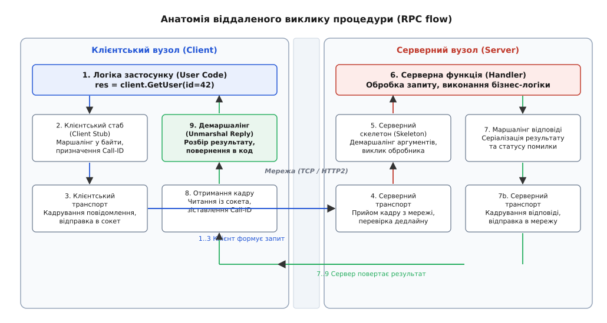
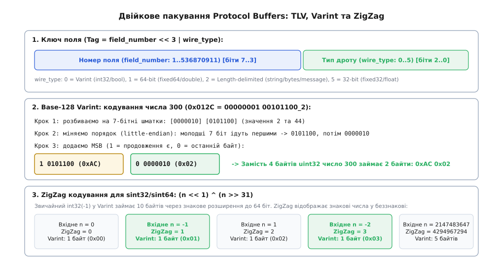
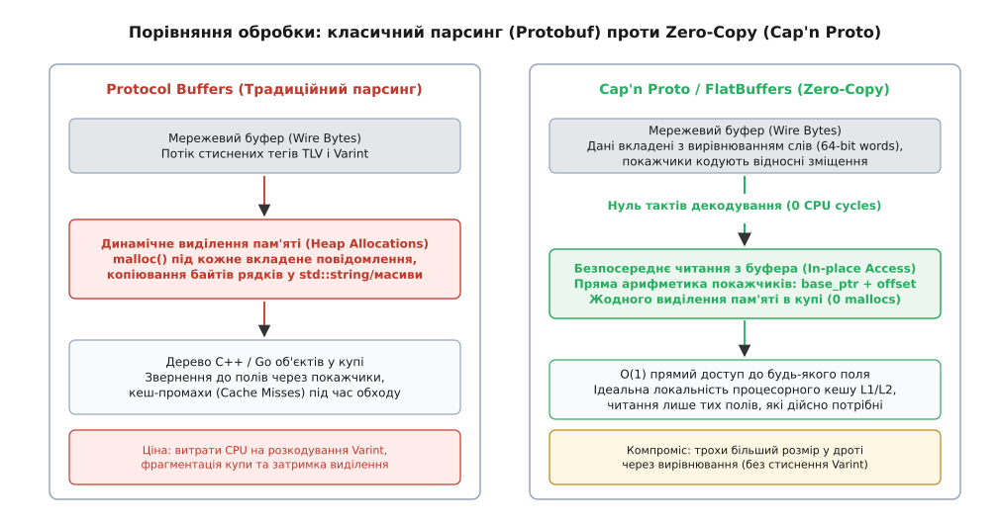

# RPC, серіалізація та протокольні буфери (gRPC / Cap'n Proto)

<preknowlist>
- [Сокети TCP/UDP](topic:programming/sockets-tcp-udp) — сокет передає неперервний потік байтів без збереження меж повідомлень чи типів даних.
- [Кадрування повідомлень у потоці TCP](topic:programming/tcp-message-framing) — як виділяти окреме повідомлення з байтового потоку за допомогою довжинних префіксів.
- [Пакування бінарного протоколу: вирівнювання й порядок байтів](topic:programming/wire-format-packing) — чому структури пам'яті C не можна напряму передавати мережею через невідповідність розкладки та порядків байтів.
- [Вісім оман розподілених обчислень](topic:programming/distributed-fallacies) — чому мережа не є надійною, затримка не дорівнює нулю, а віддалений виклик принципово відрізняється від локального.
- [Угода про виклик (ABI)](topic:programming/calling-convention) — як аргументи локальної функції передаються через регістри процесора та стек.
- [Мова опису інтерфейсів (IDL) і генерація коду](topic:programming/interface-definition-language) — як декларативні схеми перетворюються компілятором на типізований код різними мовами.
</preknowlist>

У програмі на одній машині виконання рядка `route = calculate_route(start_point, end_point)` займає лічені наносекунди: процесор розміщує вхідні аргументи у регістрах чи на стеку, виконує апаратну інструкцію переходу `call` за локальною віртуальною адресою підпрограми, отримує покажчик на результуючу структуру в пам'яті й повертає керування. Коли ж сервіс побудови маршрутів виноситься на окремий сервер у дата-центрі через мережу 10 GbE, цей локальний механізм миттєво руйнується. Покажчики `start_point` та `end_point` вказують на адреси, які в адресному просторі віддаленого вузла не існують або містять довільні дані; прямий перехід за адресою інструкцій у пам'яті неможливий; замість 5 наносекунд виконання триває сотні мікросекунд або мілісекунд; а сам запит чи відповідь можуть безслідно зникнути через розрив TCP-з'єднання або аварійне завершення віддаленого процесу.

Щоб подолати цей бар'єр, архітектура розподілених систем спирається на дві взаємопов'язані концепції: **віддалений виклик процедур** (англ. *Remote Procedure Call*, RPC) та **серіалізацію** (лат. *series* — «ряд, послідовність»). RPC створює абстракцію, яка дозволяє викликати функцію на іншому вузлі мережі так само синтаксично просто, як локальну, а серіалізація перетворює довільні структури даних у пам'яті на канонічну послідовність байтів, придатну для передачі мережевим каналом і незалежну від апаратної архітектури.

### Анатомія віддаленого виклику та ілюзія локальності

Головна привабливість і водночас головна пастка RPC полягає в спробі сховати мережу за звичним інтерфейсом мови програмування. Локальний виклик функції має детерміновану семантику: він або виконується повністю, або призводить до падіння всього процесу. Мережевий виклик стикається з фундаментальною проблемою **часткових відмов** (англ. *partial failures*): якщо клієнт не отримав відповіді після надсилання запиту, неможливо дізнатися, що саме сталося — мережа втратила запит до того, як він дійшов до сервера; сервер упав під час виконання процедури; або ж сервер успішно виконав операцію, але мережа втратила пакет із відповіддю.

Тому будь-який надійний RPC-механізм будується не на «невидимості» мережі, а на суворо структурованому конвеєрі перетворень і контролю помилок.


*Життєвий цикл RPC-виклику: клієнтський стаб серіалізує запит, транспорт передає кадри мережею, серверний скелетон викликає обробник, а результат повертається клієнту через зворотний демаршалінг.*

Повний шлях виконання RPC-виклику складається з дев'яти дискретних кроків:

1. **Клієнтський код** викликає звичайний типізований метод локального інтерфейсу, передаючи об'єкти мови програмування.
2. **Клієнтський стаб** (англ. *stub* — «заглушка, кукса») — автоматично згенерований за схемою посередник. Він перехоплює виклик і виконує **маршалінг** (англ. *marshalling* — «упорядкування, шикування»): зчитує всі параметри, упаковує їх у стандартизований двійковий буфер і призначає унікальний числовий ідентифікатор виклику (`Call-ID`).
3. **Клієнтський транспортний рушій** додає заголовок кадрування, налаштовує таймаут, записує `Call-ID` до таблиці активних очікувань і відправляє сформований пакет у мережевий сокет.
4. **Мережевий рівень** передає байти крізь операційні системи, маршрутизатори та фізичні кабелі до сервера.
5. **Серверний транспортний рушій** зчитує вхідний двійковий кадр із сокета, перевіряє цілісність, ліміти дедлайну та передає буфер потрібному сервісу.
6. **Серверний скелетон** (грец. *σκεлеτός* — «каркас, основа») виконує **демаршалінг** (десеріалізацію): відновлює з байтів типізовані параметри та диспетчеризує виклик у реальну функцію бізнес-логіки.
7. **Серверна функція-обробник** (англ. *handler*) виконує обчислення чи роботу з базою даних і повертає результат.
8. **Маршалінг відповіді:** серверний скелетон серіалізує отриманий результат разом зі статус-кодом виконання і відправляє його назад клієнту через мережеве з'єднання.
9. **Завершення виклику на клієнті:** клієнтський транспорт знаходить за `Call-ID` вихідний запит у черзі, передає байти стабу, який розпаковує об'єкт-результат і повертає його користувацькому коду, розблоковуючи потік або завершуючи асинхронний проміс.

Шлях розвитку цих механізмів від перших спроб Sun RPC до сучасних систем детально розкриває [історія еволюції RPC](topic:programming/rpc/hist-rpc-evolution.md).

> 🔧 **Навіщо це.** У мікросервісній архітектурі бекенд розбитий на сотні вузькоспеціалізованих процесів (авторизація, білінг, каталог, пошук). RPC дає розробникам можливість описувати інтерфейси між сервісами як суворі контракти, позбавляючи потреби вручну парсити HTTP-запити чи перевіряти наявність обов'язкових полів у кожному хендлері.

---

### Чому текстові формати програють на навантаженні

Найпростіший спосіб передати структуру даних між процесами — перетворити її на текстовий формат [JSON](topic:programming/ascii-utf8) або XML. Завдяки людиночитабельності JSON став стандартом для публічних веб-API (REST). Проте під високим навантаженням усередині дата-центру текстові формати створюють три непереборні вузькі місця:

1. **Колосальні витрати процесора на парсинг рядків.** Для читання числа `148592` із JSON процесор повинен побайтово просканувати шість ASCII-символів, перевірити, чи кожен символ є цифрою (`'0' <= c && c <= '9'`), помножити проміжний результат на 10 та додати нове значення. Двійкове 32-бітне число зчитується процесором за одну машинну інструкцію без жодного циклу.
2. **Фрагментація пам'яті та динамічні виділення (Heap Allocations).** Парсер JSON не знає розмірів структур наперед. Читаючи документ, він змушений виділяти пам'ять через системний `malloc` під кожен вузол дерева, кожен ключ словника та кожен текстовий рядок. Це створює навантаження на менеджер пам'яті або збирач сміття (Garbage Collector), спричиняючи паузи в обробці запитів.
3. **Надмірність обсягу передавання.** У JSON кожне повідомлення тягне за собою повні текстові назви полів (`"user_first_name": "Ivan"`). Якщо повідомлення містить масив із 1000 елементів, назва `"user_first_name"` буде передана й оброблена 1000 разів, марнуючи пропускну здатність шин і мережі.

Виходом є **схематичні двійкові формати** (англ. *schema-based binary formats*). Контракт даних описується окремим файлом схеми [IDL](topic:programming/interface-definition-language). Імена полів у мережу не передаються взагалі — замість них використовуються компактні числові теги, а всі типи даних кодуються у двійковому вигляді.

---

### Protocol Buffers: компактне пакування TLV, Varint та ZigZag

Розроблений у Google формат **Protocol Buffers** (Protobuf) є найбільш поширеним стандартом схематичної двійкової серіалізації. Повідомлення в Protobuf кодується за принципом **TLV** (англ. *Tag-Length-Value* — «тег, довжина, значення»).


*Двійкова будова повідомлення Protobuf: структура ключа тегу, покрокове кодування числа 300 через 7-бітний Varint та бієктивне відображення знакових чисел у ZigZag.*

#### 1. Ключ поля (Tag / Key)

Кожне поле повідомлення Protobuf у двійковому потоці починається з одного або кількох байтів ключа. Ключ об'єднує номер поля, визначений у `.proto`-файлі, та його двійковий тип на фізичному рівні (*wire type*):

```
Ключ = (field_number << 3) | wire_type
```

Молодші 3 біти ключа завжди відводяться під `wire_type`, що дозволяє розпізнати один із 4 основних фізичних типів:
- `0` — **Varint** (цілі числа `int32`, `int64`, `uint32`, `bool`, `enum`);
- `1` — **64-bit fixed** (числа фіксованої довжини `fixed64`, `sfixed64`, `double`);
- `2` — **Length-delimited** (рядки `string`, байти `bytes`, вкладені повідомлення та упаковані масиви `packed repeated`);
- `5` — **32-bit fixed** (числа `fixed32`, `sfixed32`, `float`).

Оскільки номери полів від 1 до 15 вимагають менше 4 бітів, результуючий ключ `(field_number << 3) | wire_type` повністю вміщується в **один єдиний байт**. Тому найбільш часто вживаним полям у схемі завжди призначають номери від 1 до 15.

#### 2. Кодування чисел змінної довжини Base-128 Varint

У типових застосунках більшість числових ідентифікаторів, лічильників та статусів мають невеликі значення (наприклад, 0, 1, 42, 200), хоча в коді оголошені як 32-бітні чи 64-бітні змінні. Передавати під число `1` чотири або вісім байтів — марнотратство.

Protobuf використовує алгоритм **Base-128 Varint**:
- Кожне число розбивається на 7-бітні групи.
- Старший 8-й біт кожного байта (англ. *Most Significant Bit*, MSB) слугує прапорцем продовження: `1` означає, що за цим байтом слідує наступний шматок числа; `0` означає, що цей байт є фінальним.
- Байти записуються у порядку від молодшого до старшого (little-endian).

Розглянемо покрокове двійкове кодування числа `300`:

```
Початкове число 300 у 16-бітній формі:
00000001 00101100

Крок 1: розбиваємо на 7-бітні шматки:
[0000010]  [0101100]    (значення 2 та 44)

Крок 2: міняємо порядок на little-endian (молодший шматок першим):
0101100, потім 0000010

Крок 3: додаємо 8-й біт (MSB = 1 для першого байта, MSB = 0 для останнього):
10101100   00000010
(0xAC)     (0x02)
```

Замість 4 байтів число `300` у дроті займає рівно 2 байти (`0xAC 0x02`).

#### 3. Проблема від'ємних чисел і ZigZag-кодування

У стандартному форматі [доповняльного коду](topic:programming/twos-complement) будь-яке від'ємне число (наприклад, `-1`) має одиницю у старшому знаковому біті. Для 64-бітного цілого число `-1` виглядає як `0xFFFFFFFFFFFFFFFF`. Якщо закодувати його звичайним Varint, воно займе максимальні **10 байтів**, що повністю нівелює стиснення.

Для розв'язання цієї проблеми в Protobuf введено типи `sint32` та `sint64`, які перед пакуванням у Varint проходять перетворення **ZigZag**.

Алгоритм ZigZag «прошиває» додатні та від'ємні числа, чергуючи їх так, щоб малі за модулем від'ємні значення перетворювалися на малі беззнакові цілі:
```
Вхідне значне число:   0   -1    1   -2    2   -3    3
Після ZigZag:          0    1    2    3    4    5    6
```

Математично перетворення ZigZag для 32-бітного цілого `n` обчислюється однією бітовою операцією з використанням арифметичного зсуву вправо:

```
zigzag(n)
= (n << 1) ^ (n >> 31)    [арифметичний зсув тиражує знаковий біт]
```

Для числа `n = -1`:
1. `n << 1` дає бітову маску `0xFFFFFFFE` (усі одиниці, крім молодшого біта 0).
2. `n >> 31` арифметично зсуває знак і заповнює всі 32 біти одиницями: `0xFFFFFFFF`.
3. Побітове виключне АБО `0xFFFFFFFE ^ 0xFFFFFFFF` інвертує біти й дає рівно `0x00000001` (число 1).

Число `-1` після ZigZag перетворюється на беззнакову одиницю і пакується у Varint рівно в **1 байт** замість десяти.

#### 4. Поля зі змінною довжиною (Length-delimited)

Рядки UTF-8, масиви байтів та вкладені повідомлення кодуються за допомогою `wire_type = 2`. Структура такого блоку містить:
1. Ключ поля `(field_number << 3) | 2`;
2. Довжину корисного навантаження у байтах, закодовану як Varint;
3. Сирі байти даних.

Завдяки цьому вкладені повідомлення пакуються рекурсивно: спочатку серіалізується внутрішнє повідомлення, обчислюється його розмір, після чого цей розмір записується як префікс довжини перед байтами вкладеної структури.

#### 5. Еволюція схеми без порушення сумісності (Schema Evolution)

Ключова властивість Protobuf — здатність систем взаємодіяти, коли клієнт і сервер зібрані з різними версіями `.proto`-схеми.

- **Зворотна сумісність (Backward compatibility):** Новий код може читати повідомлення, згенеровані старим кодом. Якщо поле було додане в новій версії схеми, старе повідомлення просто не містить цього тегу. Десеріалізатор не падає з помилкою, а автоматично підставляє значення за замовчуванням (0 для чисел, порожній рядок для `string`).
- **Пряма сумісність (Forward compatibility):** Старий код може читати повідомлення, згенеровані новим кодом. Коли старий парсер зустрічає в потоці невідомий тег, він дивиться на `wire_type`:
  - якщо `wire_type = 0`, він вичитує Varint до нульового MSB і пропускає його;
  - якщо `wire_type = 2`, він зчитує довжину і перестрибує вказану кількість байтів;
  - якщо `wire_type = 1` або `5`, він пропускає рівно 8 або 4 байти.
  Невідомі поля не відкидаються: починаючи з версії Proto3 (v3.5+), невідомі поля зберігаються у спеціальному буфері `unknownFields` і без змін записуються назад при повторній серіалізації, захищаючи дані від втрати при проходженні крізь проміжні проксі-вузли.

**Залізні правила сумісності Protobuf:**
1. **Ніколи не змінювати числовий номер існуючого поля.** Зміна номера робить старі та нові повідомлення двійково несумісними.
2. **Якщо поле видаляється зі схеми, його номер і назву необхідно зафіксувати директивою `reserved`:**
   ```protobuf
   message UserProfile {
       reserved 3, 7 to 9;
       reserved "old_passport_number";
       string name = 1;
       int32 age = 2;
   }
   ```
   Це гарантує, що інший розробник у майбутньому випадково не використає старий номер тегу для зовсім іншого поля, що призвело б до фатального пошкодження даних під час розпакування.

---

### Архітектура gRPC: HTTP/2 як високошвидкісний транспорт

Protocol Buffers визначає лише спосіб упаковки структур у байти, але не регламентує, як саме ці байти передаються мережею. Для створення повного стека Google створила фреймворк **gRPC**, використавши як транспортний протокол стандарт **HTTP/2**.

Вибір HTTP/2 дав gRPC фундаментальні переваги над саморобними двійковими протоколами:

```
 +-------------------------------------------------------+
 |                     gRPC API                          |
 | (Згенеровані стаби: Unary, Client/Server/Bidi Stream) |
 +-------------------------------------------------------+
 |              Protocol Buffers / IDL                   |
 |    (Серіалізація повідомлень у двійкові кадри TLV)    |
 +-------------------------------------------------------+
 |            Кадрування Length-Prefixed                 |
 |        [1B Flag | 4B Big-Endian Length | Payload]     |
 +-------------------------------------------------------+
 |                      HTTP/2                           |
 | (Мультиплексування Stream ID, компресія HPACK, Flow)  |
 +-------------------------------------------------------+
 |                    TLS / TCP                          |
 +-------------------------------------------------------+
```

1. **Мультиплексування через Stream ID.** У протоколі HTTP/1.1 або базовому TCP кожен паралельний запит вимагав або окремого з'єднання, або страждав від блокування черги (Head-of-Line Blocking): відповідь на другий запит не могла бути отримана, доки повністю не вичитана відповідь на перший. У HTTP/2 одне TCP-з'єднання розбивається на тисячі логічних незалежних **потоків** (англ. *streams*). Клієнт може надіслати 500 RPC-запитів одночасно; їхні двійкові кадри перемішуються в одному TCP-потоці й на стороні сервера відновлюються за ідентифікатором `Stream-ID`.
2. **Стиснення метаданих (HPACK).** Заголовки запитів (токени авторизації JWT, трасувальні мітки TraceID) не надсилаються як сирий повторюваний текст. Алгоритм HPACK веде спільну таблицю заголовків між клієнтом і сервером: якщо заголовок уже передавався, у мережу відправляється лише його короткий числовий індекс.
3. **Керування потоком на рівні потоків (Flow Control).** HTTP/2 реалізує віконне керування потоком (`WINDOW_UPDATE`) окремо для кожного логічного стріму та для всього TCP-з'єднання в цілому. Якщо сервер повільно обробляє важкий потік даних від одного RPC, клієнт призупиняє передачу саме для цього `Stream-ID`, не блокуючи сусідні швидкі RPC в тому ж TCP-з'єднанні.
4. **Трейлери для передачі статусу.** У HTTP/1.1 заголовки відправляються лише на початку відповіді. Але під час виконання RPC фінальний статус операції (успіх, помилка, деталі винятку) стає відомим лише **після** того, як обробник згенерував усі дані відповіді. HTTP/2 підтримує **трейлери** (кадр `HEADERS` із прапорцем `END_STREAM`, що надсилається після всіх кадрів `DATA`), де передаються поля `grpc-status` та `grpc-message`.

Повний перелік обов'язкових полів, заголовків та статус-кодів наведено у вставці [двійкове кадрування gRPC поверх HTTP/2](topic:programming/rpc/api-grpc-framing.md).

#### Чотири моделі викликів у gRPC

Завдяки повнодуплексній природі потоків HTTP/2, gRPC підтримує чотири режими взаємодії:

1. **Простий виклик (Unary RPC):** Клієнт надсилає один запит і очікує одну відповідь (аналог класичного HTTP POST або локальної функції).
   ```protobuf
   rpc GetUser(UserRequest) returns (UserResponse);
   ```
2. **Серверний потік (Server Streaming RPC):** Клієнт відправляє один запит, а сервер у відповідь надсилає послідовність повідомлень, поки не закриє потік (наприклад, підписка на біржові котирування чи вичитка логів).
   ```protobuf
   rpc StreamLogs(LogFilter) returns (stream LogEntry);
   ```
3. **Клієнтський потік (Client Streaming RPC):** Клієнт надсилає потік повідомлень, після чого сервер повертає один підсумковий результат (наприклад, завантаження великого файлу частинами або передача телеметрії сенсорів).
   ```protobuf
   rpc UploadMetrics(stream MetricRecord) returns (UploadSummary);
   ```
4. **Двосторонній потік (Bidirectional Streaming RPC):** Обидві сторони одночасно і незалежно відправляють повідомлення у спільний потік (наприклад, голосовий чат, протоколи узгодження чи відеострімінг у реальному часі).
   ```protobuf
   rpc ChatChannel(stream ChatMessage) returns (stream ChatMessage);
   ```

#### Резолвінг імен та клієнтське балансування навантаження

На відміну від REST-архітектури, де перед пулом серверів зазвичай стоїть централізований зворотний проксі-балансувальник (Reverse Proxy L7), gRPC підтримує вбудоване **клієнтське балансування навантаження** (англ. *Client-side Load Balancing*):

1. **Резолвер імен (Name Resolver):** клієнтський стаб підключається до DNS, Consul або etcd і отримує повний динамічний список IP-адрес усіх доступних екземплярів бекенду.
2. **Пул субканалів (Subchannels):** клієнт відкриває і тримає постійні активні TCP/HTTP/2 з'єднання до кожного бекенду.
3. **Політика вибору (Load Balancing Policy):** для кожного окремого RPC-виклику клієнтський балансувальник обирає цільовий субканал за алгоритмом `round_robin` або `pick_first`.
4. **Перевірка працездатності (Health Checking):** клієнт періодично опитує стандартний сервіс `grpc.health.v1.HealthCheck` на кожному сервері, автоматично прибираючи несправні вузли з маршрутизації без простоїв.

---

### Межа швидкодії: чому Protobuf дорогий і як працює Zero-Copy

Хоча Protobuf у рази швидший та компактніший за JSON, на сучасних мережевих адаптерах 40–100 GbE виникає новий бар'єр: **навантаження на процесор і пам'ять під час десеріалізації**.

Де саме зникає час процесора під час розпакування Protobuf?

1. **Цикл розкодування байтів Varint:** Кожне число змушує процесор виконувати бітові маски, зсуви та розгалуження, перевіряючи старший біт `0x80`.
2. **Динамічне виділення пам'яті:** Десеріалізуючи повідомлення з багатьма вкладеними об'єктами чи полями `repeated`, парсер C++ або Go змушений викликати алокатор пам'яті для створення об'єктів у купі (`std::string`, `std::vector`, внутрішні структури `google::protobuf::Message`).
3. **Кеш-промахи процесора (Cache Misses):** Створене в пам'яті дерево C++ об'єктів складається з розрізнених фрагментів, з'єднаних покажчиками. Звернення до полів змушує процесор стрибати по незв'язних адресах оперативної пам'яті, руйнуючи конвеєр кешу L1/L2.


*Принципова різниця підходів: Protobuf вимагає циклічного парсингу та створення об'єктів у купі, тоді як Cap'n Proto здійснює доступ до полів напряму в мережевому буфері без додаткових копіювань.*

#### Парадигма нульового копіювання: Cap'n Proto та FlatBuffers

Формати **Cap'n Proto** та **FlatBuffers** вирішують цю проблему радикально: **вони повністю скасовують крок десеріалізації**.

Формат повідомлення в двійковому буфері формується так, що він **вже є готовою розкладкою структури в оперативній пам'яті**:
- Усі поля вирівняні за їхніми природними межами (наприклад, 64-бітними машинними словами);
- Замість абсолютних адрес пам'яті (які стають невалідними при передачі між процесами) використовуються **відносні зміщення** (англ. *relative pointers / offsets*);
- Покажчик усередині структури Cap'n Proto кодує кількість 64-бітних слів від поточної позиції до початку цільової структури або списку.

Коли програма отримує двійковий буфер із мережевого сокета:
1. Час десеріалізації дорівнює **0 тактів процесора**. Програма не парсить байти і не створює жодного нового об'єкта в купі (`0 mallocs`).
2. Читання поля — це звичайна арифметика покажчиків: `поле = *(base_ptr + field_offset)`. Доступ до будь-якого елемента виконується за час `O(1)`.
3. Читаються лише ті поля, які реально потрібні логіці. Якщо повідомлення важить 100 КБ, а програмі потрібно одне число `status`, вона зчитує лише це число, не витрачаючи ресурси на розбір решти 100 КБ.

#### Внутрішня будова повідомлення Cap'n Proto

Повідомлення Cap'n Proto складається з одного або кількох сегментів пам'яті. Кожен сегмент починається з таблиці сегментів (Segment Table Header), за якою йдуть 64-бітні слова даних:

```
+---------------------------------------------------------------+
| Кількість сегментів (4B) | Розмір сегмента 0 у 8-байтових словах (4B)|
+---------------------------------------------------------------+
| Корінь повідомлення: 64-бітне слово покажчика на головну структуру |
+---------------------------------------------------------------+
| Секція даних структури (Data Section: int32, double, bool)    |
+---------------------------------------------------------------+
| Секція покажчиків структури (Pointer Section: вкладені поля)  |
+---------------------------------------------------------------+
```

Покажчик структури (Struct Pointer) займає 64 біти і має строго визначені поля:
- Молодші 2 біти — тип покажчика (`00` — Struct, `01` — List, `10` — Far Pointer між сегментами);
- Біти 2..31 — знакова кількість 64-бітних слів від кінця покажчика до початку цільової структури;
- Біти 32..47 — розмір секції даних цільової структури в словах;
- Біти 48..63 — розмір секції покажчиків цільової структури в словах.

Завдяки такому формату компілятор генерує прямий машинний код читання полів, який за швидкістю не поступається читанню локальних `struct` у мові C.

#### Інженерні компроміси Cap'n Proto проти Protobuf

| Характеристика | Protocol Buffers (v3) | Cap'n Proto / FlatBuffers |
| :--- | :--- | :--- |
| **Швидкість читання** | Середня (витрати на цикл парсингу) | Миттєва (`O(1)` прямий доступ, нуль копіювань) |
| **Виділення пам'яті** | Багатократне виділення під дерево об'єктів | 0 виділень (читання безпосередньо з буфера сокета) |
| **Розмір у мережі** | Мінімальний (стиснення Varint + ZigZag) | На 20–40% більший (через вирівнювання за 64-бітними словами) |
| **Локальність кешу L1/L2**| Низька (об'єкти розпорошені по купі) | Ідеальна (дані лежать монолітним плоским блоком) |
| **Безпека парсингу** | Гарантована бібліотекою десеріалізації | Потребує суворої валідації зміщень (Bounds Checking) |

> 🔧 **Коли обирати Cap'n Proto / FlatBuffers:** у системах високої частоти торгів (HFT), ігрових рушіях, міжпроцесній взаємодії (IPC) через спільну пам'ять (Shared Memory) на одній машині та для обробки гігабайтних потоків телеметрії, де CPU не встигає парсити Protobuf.

---

### Надійність у розподілених системах: дедлайни, скасування та семантика відмов

Оскільки мережевий виклик може тривати непередбачувано довго або зависнути назавжди, жоден промисловий RPC-стек не виконує операції без механізмів обмеження часу та поширення розподіленого контексту.

#### 1. Дедлайн замість таймауту

Поширена помилка — встановлювати фіксований **таймаут** на кожному проміжному сервісі (наприклад, «3 секунди на виклик»). Якщо Сервіс A викликає Сервіс B (таймаут 3с), а Сервіс B викликає Сервіс C (таймаут 3с), виникає явище **каскадного виснаження**: Сервіс A може перервати з'єднання через 3.01 секунди, тоді як Сервіс B продовжуватиме виконувати важкий запит до Сервісу C ще 2.9 секунди, марнуючи ресурси на результат, який уже нікому не потрібен.

gRPC використовує концепцію **абсолютного дедлайну** (англ. *Deadline*):
- Клієнт призначає кінцевий момент часу (наприклад, «операція має завершитися до 14:00:05.500»).
- Кожен проміжний сервіс обчислює залишок часу, віднімає час власної обробки і передає зменшений дедлайн далі у заголовку `grpc-timeout`.
- Якщо дедлайн вичерпано на будь-якій ланці, виконання негайно припиняється зі статусом `DEADLINE_EXCEEDED`.

#### 2. Каскадне скасування (Cancellation Propagation)

Якщо користувач закрив мобільний застосунок або вкладку браузера під час виконання важкого запиту, клієнтський стек надсилає сигнал скасування (у HTTP/2 — кадр `RST_STREAM` із кодом помилки `CANCELLED`).

Серверний RPC-рушій перехоплює цей сигнал через об'єкт контексту (`Context.isCancelled()`). Обробник зобов'язаний періодично перевіряти статус контексту і негайно переривати обчислення та запити до бази даних, запобігаючи виконанню непотрібної роботи.

#### 3. Поширення контексту (Context Propagation)

Разом із кожним викликом через заголовки метаданих неявно передається розподілений контекст:
- **TraceID та SpanID:** ідентифікатори розподіленого трасування (OpenTelemetry), що дозволяють відстежити проходження одного користувацького запиту крізь сотні мікросервісів;
- **Baggage:** невеликі пари ключ-значення (ідентифікатор користувача, прапорці експериментів), які автоматично прокидаються по всьому дереву викликів без необхідності явно додавати їх як поля в кожне Protobuf-повідомлення.

#### 4. Семантика повторних спроб та ідемпотентність

Коли клієнт отримує статус `UNAVAILABLE` через розрив мережі, постає питання: чи безпечно повторити виклик (Retry)?

Семантика виконання RPC ділиться на три категорії:
- **Щонайбільше один раз (At-most-once):** клієнт робить одну спробу і не повторює запит при збої. Гарантує відсутність дублювання операцій, але не гарантує виконання.
- **Щонайменше один раз (At-least-once):** клієнт повторює запит з експоненційним відступом (Exponential Backoff), доки не отримає відповіді. Це безпечно лише для **ідемпотентних** (лат. *idem* — «той самий» + *potens* — «здатний») операцій — таких, повторне виконання яких із тими самими параметрами не змінює фінального стану системи (наприклад, читання профілю `GetUser` або запис фіксованого значення `SetStatus(ACTIVE)`).
- **Точно один раз (Exactly-once):** досягається за допомогою передачі унікального клієнтського ключа ідемпотентності (англ. *Idempotency Key / Request-ID*). Сервер зберігає результати оброблених ключів у швидкому кеші (Redis) і при повторному надходженні запиту з тим самим ключем повертає збережений результат без повторного списання коштів чи дублювання замовлень.

Як влаштовані внутрішні структури мінімального диспетчера та кодека, демонструє практична вставка [мінімальний каркас двійкового RPC-рушія](topic:programming/rpc/proj-tiny-rpc.md).

---

### Порівняльна матриця технологій RPC та серіалізації

| Критерій | REST / JSON | gRPC / Protocol Buffers | Cap'n Proto / FlatBuffers |
| :--- | :--- | :--- | :--- |
| **Формат даних** | Текстовий (ASCII / UTF-8) | Схематичний двійковий (TLV, Varint) | Схематичний двійковий (Zero-Copy) |
| **Опис схеми** | Опціональний (OpenAPI/JSON Schema) | Обов'язковий (`.proto` IDL) | Обов'язковий (`.capnp` / `.fbs` IDL) |
| **Транспорт** | HTTP/1.1 або HTTP/2 | HTTP/2 (потоки, мультиплексування) | Довільний (TCP, сокети Unix, Shared Memory) |
| **Продуктивність CPU** | Низька (витратний текстовий парсинг) | Висока (швидке двійкове розпакування) | Максимальна (нуль тактів десеріалізації) |
| **Підтримка браузерів**| Рідна (будь-який JS `fetch`) | Потребує проксі (gRPC-Web) | Потребує WebAssembly / сторонніх бібліотек |
| **Типізація коду** | Динамічна або ручні типи | Сувора (автогенерація стабів компілятором) | Сувора (автогенерація стабів компілятором) |
| **Сфера застосування** | Публічні API, фронтенд-бекенд | Міжсервісна взаємодія в хмарах | HFT, геймдев, ядра ОС, високошвидкісний IPC |

Віддалений виклик процедур пройшов довгий шлях від спроби повністю замаскувати мережу під локальну функцію до сучасної інженерної дисципліни. Ефективність сучасного RPC тримається на трьох непорушних опорах: строгому контракті схеми IDL, компактному двійковому форматі серіалізації та асинхронному мультиплексованому транспорті з явним контролем дедлайнів і часткових відмов.
