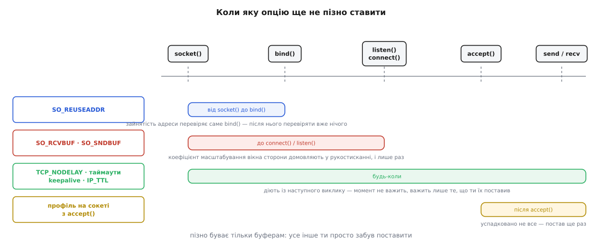
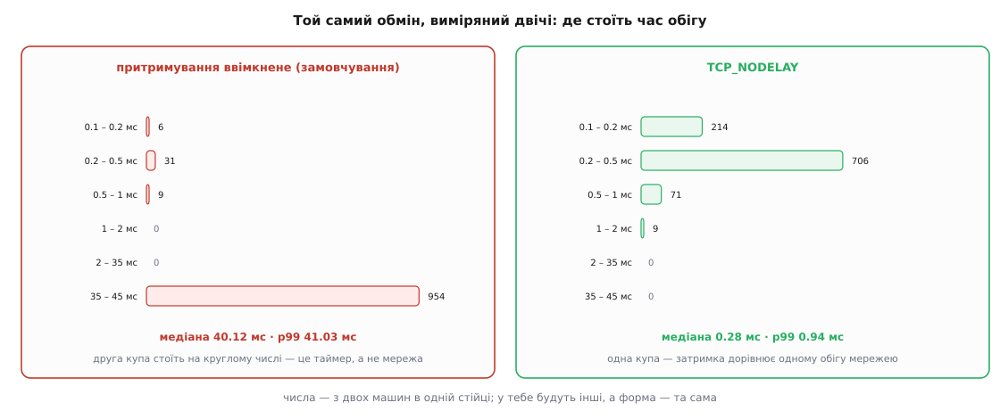

# ⚙️ Налаштування сокета в коді: два профілі й вимірювач, що ловить сорок мілісекунд

Тут зібрано два робочі шматки коду на C: модуль, який перетворює **намір** програми — «важить час реакції» або «важить швидкість потоку» — на набір опцій і чесно звітує, що з них ядро прийняло, а що мовчки підмінило, і крихітний вимірювач, який на твоїх власних машинах покаже сталі сорок мілісекунд і те, як вони зникають. Стоять вони поруч навмисно: без другого перший лишається набором вірувань.

Мова тут одна, і не за звичкою. `setsockopt` бере нетипізований покажчик і довжину, а вся наука — саме в тому, який тип ти передав, у який момент і що ядро повернуло **замість** проханого. Обгортка вищою мовою ховає рівно ці три речі.

## Завдання

Типовий мережевий код виглядає так: у функції створення сокета стовпчиком стоять шість `setsockopt`, результат жодного не перевірено, а поруч коментар «без цього гальмує». Через рік ніхто не скаже, який із шести рядків справді щось робить, а який давно не підтримується на новому стеку й тихо повертає `ENOPROTOOPT`.

Модуль має розв'язати три речі, і жодна з них не «поставити опції».

**Перше.** У коді має бути записаний **намір**, а не список опцій. Намірів рівно два, бо рішення стека мають дві протилежні відповіді: що дорожче — час реакції окремого повідомлення чи швидкість великого потоку.

**Друге.** Кожна опція має бути перевірена **читанням назад**. Ядро вільне подвоїти прохане, обрізати його системною стелею або не мати цієї опції взагалі — і про жодне з цього `setsockopt` не скаже.

**Третє.** Профіль має лягати у **правильний момент**, і код повинен помічати, коли момент уже минув, — сам, а не в чужій голові.

Далі йде вимірювач, і в нього завдання простіше й суворіше: показати різницю **до** того, як опція потрапить у продукт. Опція, поставлена без виміру, — це не налаштування, а прикмета.

## Каркас: звіт замість `bool`

Почнімо з підпису, бо він визначає все інше. Функція, що повертає `bool`, тут безпорадна: «не вдалося» і «вдалося, але ядро дало вчетверо менше» — різні події, і друга трапляється частіше. Тож результат — **звіт**: по рядку на опцію з тим, що просили, що маємо і як це кваліфікувати.

```c
/* socktune.h */
#ifndef SOCKTUNE_H
#define SOCKTUNE_H

typedef enum {
    SOCK_PROFILE_LATENCY,      /* дрібне й негайно: керування, запит-відповідь */
    SOCK_PROFILE_THROUGHPUT    /* великий потік: передача файлів, вивантаження */
} sock_profile;

/* Що ми знаємо про канал. Без цих двох чисел розмір буфера не обчислити,
   тож покажчик на неї дозволено лишити NULL — і тоді буфери НЕ чіпаємо. */
typedef struct {
    double mbit_per_s;         /* пропускна здатність вузького місця */
    double rtt_ms;             /* час обігу — виміряний, не з паспорта */
} sock_link;

typedef enum {
    OPT_OK,            /* ядро взяло те, що просили */
    OPT_CHANGED,       /* узяло, але дало інше число: стеля, округлення */
    OPT_UNSUPPORTED,   /* опції тут немає — інший стек, інша система */
    OPT_FAILED         /* справжня помилка */
} opt_state;

typedef struct {
    const char *name;
    long        want;
    long        got;
    opt_state   state;
    int         err;   /* errno, якщо він був */
} opt_result;

#define SOCK_REPORT_CAP 16

typedef struct {
    opt_result item[SOCK_REPORT_CAP];
    int n;             /* заповнених рядків */
    int overflow;      /* не вмістилося; має бути 0 — це сторожок на майбутнє */
    int too_late;      /* сокет уже з'єднаний або слухає: буфери пропущено */
    int changed, unsupported, failed;
} sock_report;

int  sock_apply_profile(int fd, sock_profile p, const sock_link *link,
                        sock_report *rep);
void sock_report_print(const sock_report *rep);
long sock_bdp_bytes(double mbit_per_s, double rtt_ms);

#endif
```

Найважливіше рішення тут — `sock_link` як окремий аргумент, який дозволено не передати. Розмір буфера не береться з голови: він дорівнює добутку швидкості на час обігу, і обидва числа треба **знати**. Немає їх — модуль не вгадує, а просто не чіпає буферів. Це не педантизм: буфер, поставлений навмання, — найчастіший спосіб зробити гірше, ніж було, бо явне значення вимикає в Linux самоналаштування приймального буфера, тобто міняє постійний вимір ядра на твій одноразовий здогад.

Тепер серце модуля — одна функція, крізь яку проходить кожна цілочисельна опція.

```c
/* socktune.c */
#define _GNU_SOURCE
#include <errno.h>
#include <netinet/in.h>
#include <netinet/tcp.h>
#include <stdio.h>
#include <string.h>
#include <sys/socket.h>
#include <sys/time.h>
#include "socktune.h"

static opt_result *slot(sock_report *r, const char *name)
{
    static opt_result sink;          /* якщо звіт переповнено — пишемо в нікуди */
    opt_result *o = &sink;
    if (r->n < SOCK_REPORT_CAP) o = &r->item[r->n++];
    else                        r->overflow++;
    memset(o, 0, sizeof *o);
    o->name = name;
    return o;
}

/* Ставить цілочисельну опцію й ОДРАЗУ читає її назад.
   Повертає 1, якщо це справжня невдача, і 0 в усіх інших випадках. */
static int set_int(int fd, int level, int name, int want,
                   const char *label, sock_report *rep)
{
    opt_result *o = slot(rep, label);
    o->want = want;

    if (setsockopt(fd, level, name, &want, sizeof want) < 0) {
        o->err = errno;
        if (errno == ENOPROTOOPT || errno == EOPNOTSUPP) {
            o->state = OPT_UNSUPPORTED;   /* не помилка: тут такої ручки немає */
            rep->unsupported++;
            return 0;
        }
        o->state = OPT_FAILED;
        rep->failed++;
        return 1;
    }

    int got = 0;
    socklen_t len = sizeof got;
    if (getsockopt(fd, level, name, &got, &len) < 0) {
        o->err = errno;
        o->state = OPT_FAILED;
        rep->failed++;
        return 1;
    }
    o->got = got;

    /* Три відповіді ядра, які означають «прийнято»: те саме число; подвоєне
       (так Linux робить із буферами — половина піде на службові структури);
       будь-яке ненульове там, де просили прапорець. */
    if (got == want || got == 2 * want || (want == 1 && got != 0)) {
        o->state = OPT_OK;
    } else {
        o->state = OPT_CHANGED;
        rep->changed++;
    }
    return 0;
}
```

Зверни увагу, чого тут **немає**: гілки «повернути помилку, бо значення не збіглося». Розбіжність — це не збій, а відповідь ядра, і працювати з нею буде людина, що читає звіт. Код, який на це падає, не запуститься на жодній машині з нижчою стелею `net.core.rmem_max`, а таких більшість.

Окремої функції потребують таймаути — не через складність, а тому що саме тут ховається переносність.

```c
static int set_tv(int fd, int name, long ms, const char *label, sock_report *rep)
{
    opt_result *o = slot(rep, label);
    o->want = ms;

    /* Це ЄДИНЕ місце модуля, що знає про struct timeval: у Windows та сама
       опція бере просто число мілісекунд, тож портується один рядок. */
    struct timeval tv = { .tv_sec = ms / 1000, .tv_usec = (ms % 1000) * 1000 };
    if (setsockopt(fd, SOL_SOCKET, name, &tv, sizeof tv) < 0) {
        o->err = errno;
        o->state = (errno == ENOPROTOOPT) ? OPT_UNSUPPORTED : OPT_FAILED;
        if (o->state == OPT_UNSUPPORTED) { rep->unsupported++; return 0; }
        rep->failed++;
        return 1;
    }

    struct timeval back;
    socklen_t len = sizeof back;
    if (getsockopt(fd, SOL_SOCKET, name, &back, &len) < 0) {
        o->err = errno; o->state = OPT_FAILED; rep->failed++; return 1;
    }
    o->got = back.tv_sec * 1000L + back.tv_usec / 1000;
    if (o->got != o->want) { o->state = OPT_CHANGED; rep->changed++; }
    return 0;
}
```

## Момент: спитати ядро, а не сподіватися

Розміри буферів мають сенс лише **до рукостискання**. Коефіцієнт масштабування вікна сторони домовляють саме там і лише раз, тож після встановлення з'єднання стеля вже зафіксована. Поставиш пізніше — число зміниться, а швидкість ні, і шукатимеш причину в мережі.

Перевірити це можна прямо в коді, двома дешевими запитами до ядра.

```c
static int is_connected(int fd)
{
    struct sockaddr_storage ss;
    socklen_t len = sizeof ss;
    return getpeername(fd, (struct sockaddr *)&ss, &len) == 0;
}

static int is_listening(int fd)
{
    int v = 0;
    socklen_t len = sizeof v;
    if (getsockopt(fd, SOL_SOCKET, SO_ACCEPTCONN, &v, &len) < 0) return 0;
    return v != 0;
}
```

`getpeername` вдається лише тоді, коли в сокета вже є партнер, а `SO_ACCEPTCONN` каже, чи був `listen`. Разом вони відповідають на питання «чи вже пізно» — і модуль не мовчить, а ставить у звіті прапорець `too_late`.



*Пізно буває тільки розмірам буферів; решта ручок діє з наступного виклику, тож там питання не «коли», а «чи поставив узагалі».*

## Профіль «низька затримка»

Тепер сам переклад наміру в опції. Кожен рядок нижче має причину, і причина написана поруч — інакше наступний читач видалить незрозуміле.

```c
long sock_bdp_bytes(double mbit_per_s, double rtt_ms)
{
    double bytes_per_s = mbit_per_s * 1e6 / 8.0;
    return (long)(bytes_per_s * (rtt_ms / 1000.0));
}

static long clampl(long v, long lo, long hi)
{
    return v < lo ? lo : (v > hi ? hi : v);
}

int sock_apply_profile(int fd, sock_profile p, const sock_link *link,
                       sock_report *rep)
{
    memset(rep, 0, sizeof *rep);
    rep->too_late = is_connected(fd) || is_listening(fd);

    int bad = 0;
    long bdp = link ? sock_bdp_bytes(link->mbit_per_s, link->rtt_ms) : 0;

    if (p == SOCK_PROFILE_LATENCY) {
        /* 1. Не притримувати дрібне. Дванадцять байтів команди мусять вилетіти
              негайно, а не чекати підтвердження попереднього запису. */
        bad += set_int(fd, IPPROTO_TCP, TCP_NODELAY, 1, "TCP_NODELAY", rep);

        /* 2. Коротка черга. Байт, що вже лежить у передавальному буфері, не
              обігнати: чим довша черга, тим довше чекатиме команда «стоп»,
              записана після пачки телеметрії. «Малий» тут означає не
              «якнайменший», а «розміром приблизно з один обіг». */
        if (link && !rep->too_late) {
            int q = (int)clampl(bdp, 16 * 1024, 128 * 1024);
            bad += set_int(fd, SOL_SOCKET, SO_SNDBUF, q, "SO_SNDBUF", rep);
            bad += set_int(fd, SOL_SOCKET, SO_RCVBUF, q, "SO_RCVBUF", rep);
        }

        /* 3. Жоден виклик не висить довше за пів секунди — керування має
              повертатися до нашого коду, а не губитися в ядрі. */
        bad += set_tv(fd, SO_RCVTIMEO, 500, "SO_RCVTIMEO", rep);
        bad += set_tv(fd, SO_SNDTIMEO, 500, "SO_SNDTIMEO", rep);

        /* 4. З'єднання, у якому дані п'ять секунд не підтверджуються, мертве.
              Хай ядро розірве його само — краще чесна помилка, ніж тиша. */
        bad += set_int(fd, IPPROTO_TCP, TCP_USER_TIMEOUT, 5000,
                       "TCP_USER_TIMEOUT", rep);

        /* 5. Мовчазне з'єднання перевіряємо зондами: 20 + 3·5 = 35 секунд до
              вироку. Заодно запис у трансляторі адрес не встигає протухнути. */
        bad += set_int(fd, SOL_SOCKET,  SO_KEEPALIVE,  1, "SO_KEEPALIVE",  rep);
        bad += set_int(fd, IPPROTO_TCP, TCP_KEEPIDLE, 20, "TCP_KEEPIDLE",  rep);
        bad += set_int(fd, IPPROTO_TCP, TCP_KEEPINTVL, 5, "TCP_KEEPINTVL", rep);
        bad += set_int(fd, IPPROTO_TCP, TCP_KEEPCNT,   3, "TCP_KEEPCNT",   rep);
    } else {
        /* Притримування НЕ чіпаємо: у великому потоці кожен запис і так повний,
           а дрібні хвости алгоритм склеїть — це чиста вигода. */
        if (link && !rep->too_late) {
            /* Подвійний запас: за один обіг вікно встигає підрости, а
               підтвердження приходять нерівно. */
            int q = (int)clampl(bdp * 2, 64 * 1024, 8L * 1024 * 1024);
            bad += set_int(fd, SOL_SOCKET, SO_SNDBUF, q, "SO_SNDBUF", rep);
            bad += set_int(fd, SOL_SOCKET, SO_RCVBUF, q, "SO_RCVBUF", rep);
        }
        bad += set_tv(fd, SO_RCVTIMEO, 30000, "SO_RCVTIMEO", rep);
        bad += set_tv(fd, SO_SNDTIMEO, 30000, "SO_SNDTIMEO", rep);
        bad += set_int(fd, IPPROTO_TCP, TCP_USER_TIMEOUT, 60000,
                       "TCP_USER_TIMEOUT", rep);
    }
    return bad ? -1 : 0;
}
```

Числа в профілі затримки не з повітря. Порахуймо буфер для двох машин в одній стійці:

**Профіль затримки, канал 100 Мбіт/с, час обігу 0.4 мс**

```text
Байтів за секунду:  100·10⁶ / 8 = 12 500 000
Даних «у дорозі»:   12 500 000 · 0.0004 = 5000 байтів
Нижня межа модуля:  16 384
Ставимо:            16 384 (спрацювала межа, бо обіг надто короткий)
```

І той самий розрахунок для профілю потоку через півсвіту:

**Профіль потоку, канал 100 Мбіт/с, час обігу 80 мс**

```text
Даних «у дорозі»:   12 500 000 · 0.080 = 1 000 000 байтів
Подвійний запас:    2 000 000
Просимо:            2 000 000 байтів
```

А тепер найцікавіше — що з цього вийде насправді.

**Вивід `sock_report_print` для профілю потоку на типовій машині**

```text
SO_SNDBUF          просив 2000000  маю 425984   інше число
SO_RCVBUF          просив 2000000  маю 425984   інше число
SO_RCVTIMEO        просив 30000    маю 30000    ок
SO_SNDTIMEO        просив 30000    маю 30000    ок
TCP_USER_TIMEOUT   просив 60000    маю 60000    ок
```

Число 425984 — це подвоєні 212992, а 212992 — типова стеля `net.core.wmem_max` і `net.core.rmem_max` на багатьох збірках Linux. Тобто ти попросив два мегабайти, дістав чотириста кілобайтів, `setsockopt` повернув успіх, і без цих п'яти рядків звіту шукав би причину в мережі тижнями. Стеля піднімається через `sysctl`, а не через опцію сокета: перевищити системну межу опція не має права — і в цьому вона права.

```c
static const char *state_word(opt_state s)
{
    switch (s) {
        case OPT_OK:          return "ок";
        case OPT_CHANGED:     return "інше число";
        case OPT_UNSUPPORTED: return "немає на цій системі";
        default:              return "помилка";
    }
}

void sock_report_print(const sock_report *rep)
{
    if (rep->too_late)
        printf("! сокет уже з'єднаний або слухає — розміри буферів пропущено\n");
    for (int i = 0; i < rep->n; i++) {
        const opt_result *o = &rep->item[i];
        printf("%-18s просив %-8ld маю %-8ld %s",
               o->name, o->want, o->got, state_word(o->state));
        if (o->err) printf(" (%s)", strerror(o->err));
        putchar('\n');
    }
}
```

Розрізнення `OPT_UNSUPPORTED` і `OPT_FAILED` варте окремого слова. `ENOPROTOOPT` означає «такої опції на цьому рівні немає» — на іншому стеку, у lwIP на мікроконтролері, у старішому ядрі це нормальний стан справ, і валити через нього запуск немає підстав. `EINVAL` — уже твоя провина: не той тип, не той розмір, заборонене значення. Ці два випадки треба бачити окремо, і саме тому в звіті є `unsupported` поруч із `failed`. Про решту кодів і про те, чому `errno` читають одразу після невдалого виклику й ніколи пізніше, — у [errno та POSIX-кодах помилок](topic:programming/errno).

> 🔧 **Навіщо це.** Три рядки `getsockopt` після налаштування коштують мікросекунди раз на з'єднання й відповідають на єдине питання, заради якого все це писалося: «а воно взагалі спрацювало?». Половина звітів «поставили опцію — нічого не змінилося» закривається саме цим виводом, ще до того, як хтось відкриє аналізатор трафіку.

## Одним записом: `writev` і часткові записи

Профіль затримки вимикає притримування, але глибше лікування інше — не створювати візерунка, на якому воно спрацьовує. Заголовок і тіло — це одне повідомлення, тож і в сокет вони мають потрапити одним записом. Копіювати їх заради цього в спільний буфер не треба: `writev` бере масив шматків і віддає їх ядру як один потік байтів.

```c
/* до вже наявних включень додаються <sys/uio.h> (writev) і <time.h> (годинник) */

static long now_ms(void)
{
    struct timespec ts;
    clock_gettime(CLOCK_MONOTONIC, &ts);   /* саме монотонний, див. нижче */
    return ts.tv_sec * 1000L + ts.tv_nsec / 1000000L;
}

/* УВАГА: змінює масив iov на місці — він робочий, а не константний.
   Повертає 0, або -1 і errno. -1 тут означає більше, ніж «не вдалося»:
   частина повідомлення вже пішла в дріт, тож потік байтів зіпсовано
   і з'єднання лишається тільки закрити. */
static int writev_all(int fd, struct iovec *iov, int cnt, long deadline)
{
    while (cnt > 0) {
        long left = deadline - now_ms();
        if (left <= 0) { errno = ETIMEDOUT; return -1; }

        struct timeval tv = { .tv_sec = left / 1000,
                              .tv_usec = (left % 1000) * 1000 };
        if (setsockopt(fd, SOL_SOCKET, SO_SNDTIMEO, &tv, sizeof tv) < 0)
            return -1;

        ssize_t n = writev(fd, iov, cnt);
        if (n < 0) {
            if (errno == EINTR) continue;     /* сигнал — не помилка */
            return -1;                        /* EAGAIN = час вичерпано */
        }

        /* writev міг узяти МЕНШЕ, ніж просили: викидаємо повністю віддані
           шматки, а перший недовіддений обрізаємо спереду. */
        while (cnt > 0 && (size_t)n >= iov->iov_len) {
            n -= (ssize_t)iov->iov_len;
            iov++;
            cnt--;
        }
        if (cnt > 0 && n > 0) {
            iov->iov_base = (char *)iov->iov_base + n;
            iov->iov_len -= (size_t)n;
        }
    }
    return 0;
}

int send_msg(int fd, const void *hdr, size_t hlen,
             const void *body, size_t blen, long budget_ms)
{
    struct iovec iov[2] = {
        { .iov_base = (void *)hdr,  .iov_len = hlen },
        { .iov_base = (void *)body, .iov_len = blen },
    };
    return writev_all(fd, iov, 2, now_ms() + budget_ms);
}
```

Три речі в цьому шматку неочевидні.

**Годинник монотонний.** `CLOCK_MONOTONIC` не стрибає, коли систему підводять під точний час, а `CLOCK_REALTIME` стрибає — разом із твоїм дедлайном. Різниця з'їдає години налагодження раз на кілька років і завжди в найгіршу мить; чому це два різні годинники, а не один поганий, — у [монотонному проти настінного часу](topic:programming/monotonic-vs-wall-time).

**Дедлайн перекриває `SO_SNDTIMEO` профілю.** Це навмисно: таймаут виклику обмежує один виклик, а нас цікавить операція цілком. Ціна — сокет після операції лишається з останнім виставленим значенням; якщо профільне число комусь потрібне, його доведеться повернути. Обмеження в профілі при цьому не зайве: воно рятує код, який дедлайнами не користується.

**Помилка посеред запису означає закриття.** Частковий `writev`, який далі не вдалося дописати, лишає в дроті половину повідомлення. Інший бік читає заголовок, чекає на тіло — і чекатиме, доки не спрацює його власний таймаут. Продовжувати такий потік нічим: межі повідомлень у TCP немає, і відновити її після діри неможливо — про це саме й [кадрування повідомлень](topic:programming/tcp-message-framing). Єдина чесна реакція — `close`.

Масив `iov` має ще одну межу, про яку згадують уже після відмови: кількість шматків обмежена `IOV_MAX` (на сучасному Linux — 1024), і перевищення дає `EINVAL`. Для двох шматків це теорія, для збирача, що складає повідомлення з кожного поля окремо, — цілком реальна стеля.

## Вимірювач: побачити сорок мілісекунд на власних машинах

Тепер друга програма. Вона робить одне: жене візерунок «два записи, тоді читання» тисячу разів і друкує **розподіл** часу обігу. Не середнє — саме розподіл: середнє змішає дві різні популяції в одне число, яке не описує жодну з них.

Сервер навмисно не чіпає жодної опції: перевіряємо поведінку клієнта, тож на іншому кінці має бути найзвичайніший сокет.

```c
/* rttprobe.c — збірка: cc -std=c11 -Wall -Wextra -O2 rttprobe.c -o rttprobe */
#define _GNU_SOURCE
#include <arpa/inet.h>
#include <errno.h>
#include <netinet/in.h>
#include <netinet/tcp.h>
#include <stdint.h>
#include <stdio.h>
#include <stdlib.h>
#include <string.h>
#include <sys/socket.h>
#include <time.h>
#include <unistd.h>

#define HDR    8      /* «заголовок» повідомлення */
#define BODY 200      /* тіло: менше за сегмент, інакше притримування не діє */
#define WARMUP 200    /* обміни, які викидаємо; чому — нижче */

static void histogram(double *v, int n);   /* означено нижче */

static double now_us(void)
{
    struct timespec ts;
    clock_gettime(CLOCK_MONOTONIC, &ts);
    return ts.tv_sec * 1e6 + ts.tv_nsec / 1e3;
}

/* recv віддає СКІЛЬКИ Є, а не скільки просили — це не помилка, а норма. */
static int read_exact(int fd, void *buf, size_t need)
{
    size_t got = 0;
    while (got < need) {
        ssize_t n = recv(fd, (char *)buf + got, need - got, 0);
        if (n == 0) return -1;                       /* інший бік закрив */
        if (n < 0) { if (errno == EINTR) continue; return -1; }
        got += (size_t)n;
    }
    return 0;
}

static void run_server(int port)
{
    int ls = socket(AF_INET, SOCK_STREAM, 0);
    int on = 1;
    setsockopt(ls, SOL_SOCKET, SO_REUSEADDR, &on, sizeof on);   /* ДО bind */

    struct sockaddr_in a = { .sin_family = AF_INET,
                             .sin_addr.s_addr = htonl(INADDR_ANY),
                             .sin_port = htons((uint16_t)port) };
    if (bind(ls, (struct sockaddr *)&a, sizeof a) < 0) { perror("bind"); return; }
    listen(ls, 4);

    for (;;) {
        int cs = accept(ls, NULL, NULL);
        if (cs < 0) continue;
        unsigned char hdr[HDR], body[BODY];
        /* Читаємо заголовок, тоді тіло — саме через цю паузу сервер і не
           відповідає, доки не прийде другий запис клієнта. */
        while (read_exact(cs, hdr, HDR) == 0 && read_exact(cs, body, BODY) == 0)
            if (send(cs, hdr, HDR, 0) != (ssize_t)HDR) break;  /* відповідь одним записом */
        close(cs);
    }
}
```

Клієнт відрізняється від сервера рівно одним рядком, і цей рядок — уся суть виміру.

```c
static void run_client(const char *host, int port, int nodelay, int iters)
{
    int fd = socket(AF_INET, SOCK_STREAM, 0);
    struct sockaddr_in a = { .sin_family = AF_INET,
                             .sin_port = htons((uint16_t)port) };
    if (inet_pton(AF_INET, host, &a.sin_addr) != 1) { fprintf(stderr, "адреса?\n"); return; }
    if (connect(fd, (struct sockaddr *)&a, sizeof a) < 0) { perror("connect"); return; }

    /* ЄДИНА відмінність між двома прогонами. Ставимо після connect свідомо:
       притримування — властивість машини TCP, а не рукостискання, тож для
       цієї опції момент не важить. Для розмірів буферів було б уже пізно. */
    if (nodelay) {
        int on = 1;
        if (setsockopt(fd, IPPROTO_TCP, TCP_NODELAY, &on, sizeof on) < 0)
            perror("TCP_NODELAY");
    }

    unsigned char hdr[HDR] = {0}, body[BODY] = {0}, back[HDR];
    double *ms = malloc(sizeof *ms * (size_t)iters);
    if (!ms) return;
    int n = 0;

    for (int i = 0; i < iters + WARMUP; i++) {
        double t0 = now_us();

        /* Візерунок, заради якого все це: ДВА записи, тоді читання. */
        if (send(fd, hdr,  HDR,  0) != (ssize_t)HDR)  break;
        if (send(fd, body, BODY, 0) != (ssize_t)BODY) break;
        if (read_exact(fd, back, HDR) < 0)            break;

        double dt = now_us() - t0;
        if (i >= WARMUP) ms[n++] = dt / 1000.0;
    }
    close(fd);

    if (n > 0) histogram(ms, n);
    free(ms);
}
```

Лишилася гістограма. Межі кошиків підібрані так, щоб сорок мілісекунд не розмазалися по сусідніх стовпчиках, а стали окремою купою.

```c
static const double EDGE[] = { 0.1, 0.2, 0.5, 1, 2, 5, 10, 20, 35, 45, 100 };
#define NB ((int)(sizeof EDGE / sizeof EDGE[0]) + 1)

static int cmp_double(const void *a, const void *b)
{
    double x = *(const double *)a, y = *(const double *)b;
    return (x > y) - (x < y);
}

static void histogram(double *v, int n)
{
    int bin[NB];
    memset(bin, 0, sizeof bin);
    for (int i = 0; i < n; i++) {
        int b = NB - 1;
        for (int e = 0; e < NB - 1; e++)
            if (v[i] < EDGE[e]) { b = e; break; }
        bin[b]++;
    }

    int peak = 1;
    for (int b = 0; b < NB; b++) if (bin[b] > peak) peak = bin[b];

    for (int b = 0; b < NB; b++) {
        if (bin[b] == 0) continue;
        double lo = (b == 0) ? 0.0 : EDGE[b - 1];
        char hi[16];
        if (b == NB - 1) snprintf(hi, sizeof hi, "%6s", "inf");
        else             snprintf(hi, sizeof hi, "%6.2f", EDGE[b]);

        int w = bin[b] * 40 / peak;
        if (w == 0) w = 1;                    /* непорожній кошик має бути видно */
        printf("%6.2f - %s ms |", lo, hi);
        for (int k = 0; k < w; k++) putchar('#');
        printf(" %d\n", bin[b]);
    }

    qsort(v, (size_t)n, sizeof *v, cmp_double);
    int p99 = (int)(n * 0.99);
    if (p99 >= n) p99 = n - 1;
    printf("min %.2f  median %.2f  p99 %.2f  max %.2f ms\n",
           v[0], v[n / 2], v[p99], v[n - 1]);
}
```

Лишається розбір аргументів — рівно стільки, щоб одна програма була і сервером, і клієнтом, і щоб прогони відрізнялися одним прапорцем.

```c
int main(int argc, char **argv)
{
    int server = 0, nodelay = 0, port = 9099, iters = 1000;
    const char *host = "127.0.0.1";

    for (int i = 1; i < argc; i++) {
        if      (!strcmp(argv[i], "-s"))                 server  = 1;
        else if (!strcmp(argv[i], "-d"))                 nodelay = 1;
        else if (!strcmp(argv[i], "-c") && i + 1 < argc) host  = argv[++i];
        else if (!strcmp(argv[i], "-p") && i + 1 < argc) port  = atoi(argv[++i]);
        else if (!strcmp(argv[i], "-n") && i + 1 < argc) iters = atoi(argv[++i]);
        else {
            fprintf(stderr, "вжиток: %s -s | -c <адреса> [-d] [-p порт] [-n обмінів]\n",
                    argv[0]);
            return 2;
        }
    }
    if (server) run_server(port);
    else        run_client(host, port, nodelay, iters);
    return 0;
}
```

`p99` тут не прикраса. Затримка, яку створює таймер, живе саме у **хвості**: якщо повільним виявиться кожен двадцятий обмін, середнє зсунеться на дві мілісекунди й нікого не насторожить — а кожен двадцятий користувач чекатиме сорок. Чому хвіст описує враження від системи краще, ніж середнє, — у [перцентилях і хвостах](topic:math/percentiles-quantiles).

Запускаємо двічі — на двох різних машинах, не на одній.

**Що друкує вимірювач між двома серверами в одній стійці**

```text
$ ./rttprobe -c 10.0.0.7 -n 1000          # притримування ввімкнене
  0.10 -   0.20 ms |# 6
  0.20 -   0.50 ms |# 31
  0.50 -   1.00 ms |# 9
 35.00 -  45.00 ms |######################################## 954
min 0.14  median 40.12  p99 41.03  max 42.77 ms

$ ./rttprobe -c 10.0.0.7 -n 1000 -d       # TCP_NODELAY
  0.10 -   0.20 ms |############ 214
  0.20 -   0.50 ms |######################################## 706
  0.50 -   1.00 ms |#### 71
  1.00 -   2.00 ms |# 9
min 0.11  median 0.28  p99 0.94  max 1.83 ms
```



*Різницю видно не в середньому, а у формі: друга купа на круглому числі — підпис таймера, і впізнавати треба саме її.*

Найважливіше в цьому виводі — не те, що медіана впала в сто сорок разів. Важлива **форма**: у першому прогоні розподіл має дві купи, і між ними порожньо. Порожньо тому, що затримку створює не завантаженість і не черга — ті дали б суцільний розмазаний хвіст, — а таймер, який завжди спрацьовує через той самий проміжок. Дві розділені купи на круглому числі — це підпис, і після одного погляду на такий графік діагноз ставиться без здогадів.

## Чому картинка залежить від ядра

Тепер найчесніша частина. Вивід вище відтвориться не завжди, і причини варто знати наперед — інакше «не побачив сорока мілісекунд» переросте в хибний висновок «у нас цього немає».

**На одній машині виміру не буде.** Через локальну петлю (loopback) обіг триває мікросекунди, і підтвердження встигає повернутися раніше, ніж програма дійде до другого запису. Притримувати нема чого, глухого кута немає. Вимірювати треба між двома машинами, і бажано через справжній комутатор.

**Перші обміни будуть швидкими навіть без `TCP_NODELAY`.** Linux після встановлення з'єднання деякий час підтверджує сегменти негайно, і відкладене підтвердження вмикається лише згодом. Саме тому в коді є `WARMUP`: двісті перших обмінів викидаємо, бо вони описують інший стан стека. Без цього гістограма змішує дві поведінки, і купа на сорока мілісекундах виглядає меншою, ніж вона є в усталеному режимі.

**Ядро має власне притримування.** Починаючи з Linux 3.14 типово ввімкнено `net.ipv4.tcp_autocorking` — ядро само склеює дрібні записи, поки попередній пакет ще не пішов у мережевий адаптер. Це не той самий механізм, що правило Нейгла, але на цьому ж візерунку він додає власну затримку. Тому точні числа залежать від версії ядра сильніше, ніж хотілося б, — і саме тому вимірювач важливіший за таблицю «правильних» опцій.

Висновок із цих трьох застережень один і незручний: **опція без виміру — прикмета**. Виміряти дві хвилини на своїх машинах дешевше, ніж рік пояснювати новим людям, навіщо в коді рядок, який ніхто не наважується прибрати.

## Пастки, які коштують найдорожче

**Момент.** Розміри буферів після `connect` або `listen` — це число, яке зміниться, але ні на що не вплине. Для сервера з цього випливає неочевидне: профіль ставлять на **слухаючий** сокет, до `listen`. Сокет із `accept` успадковує не все, і перелік успадкованого різниться між системами, тож надійніше поставити профіль ще раз після `accept` — це десяток системних викликів раз на з'єднання, ціна нульова. Порядок «створив → опції → `bind`/`connect`» — частина [API сокетів](topic:programming/sockets-tcp-udp), а не стильова забаганка.

**Подвоєння й стеля.** Linux подвоює `SO_RCVBUF` і `SO_SNDBUF` (частина пам'яті йде на службові структури) і повертає з `getsockopt` уже подвоєне значення; окремо він обрізає результат стелею `net.core.rmem_max` / `wmem_max` — **без помилки**. Тому в модулі `got == 2 * want` вважається успіхом, а будь-яке інше число потрапляє в звіт. Мінімальні (вже подвоєні) значення теж є: 256 для приймального і 2048 для передавального буфера — попросиш менше, дістанеш їх.

**Часткові `send` і `recv`.** `send` має право взяти менше, ніж ти дав; `recv` — віддати менше, ніж ти попросив. Обидва — норма, а не збій. Підступніший випадок — таймаут посеред передачі: якщо частину даних уже передано, виклик поверне **кількість байтів**, а не помилку, і код, який перевіряє лише `n < 0`, тихо піде далі з половиною повідомлення. Саме тому цикли `read_exact` і `writev_all` написані так, а не через один виклик із перевіркою.

**Свіжий таймаут на кожній ітерації.** `SO_RCVTIMEO` обмежує **виклик**, не операцію. Цикл із п'яти читань по дві секунди чекає десять. Дедлайн, перерахований перед кожним викликом, — єдиний спосіб обмежити операцію цілком, і саме тому `writev_all` бере `deadline`, а не `timeout`.

**Годинник.** Дедлайн і тривалість рахують монотонним годинником. Настінний час стрибає під час синхронізації, і дедлайн стрибає з ним — у гіршому разі в минуле.

**`ENOPROTOOPT` — не аварія.** На lwIP, на старому ядрі, на іншій системі опції може просто не бути. Валити запуск через відсутність `TCP_USER_TIMEOUT` означає зробити код непереносним заради ручки, яка й так лише корисна, а не обов'язкова.

## Скільки це коштує

Профіль — десять системних викликів `setsockopt` плюс стільки ж `getsockopt`, разом одиниці мікросекунд. Раз на з'єднання цього не видно навіть під профілювальником; у циклі обробки повідомлень — уже видно, тож функція називається `sock_apply_profile`, а не `sock_send_with_profile`, і кличеться там, де сокет народжується.

`writev_all` у звичайному випадку — один `writev` і один `setsockopt` на повідомлення. Другий системний виклик можна прибрати, якщо дедлайни коду не потрібні; поки вони потрібні, це чесна ціна за передбачувану верхню межу.

Вимірювач витрачає `8·N` байтів на вибірку й `O(N log N)` на сортування заради медіани та `p99`; для тисячі обмінів це мілісекунди після кількох десятків секунд самих обмінів. Якби вибірка була не тисячею, а мільйонами, довелося б рахувати квантилі потоково, не тримаючи всіх значень, — але для рішення «ставити опцію чи ні» тисячі обмінів вистачає з великим запасом.
