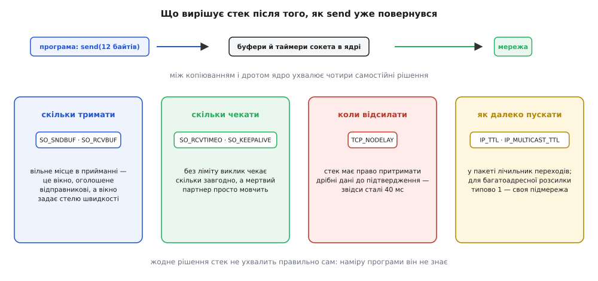

# Опції сокета: буфери, таймаути, TCP_NODELAY, TTL

<preknowlist>
- [Сокети TCP/UDP](topic:programming/sockets-tcp-udp) — сокет як кінець розмови, потік TCP проти датаграми UDP, виклики `send`, `recv`, `connect`.
- [Блокуючий і неблокуючий ввід-вивід](topic:programming/blocking-vs-nonblocking-io) — що означає «виклик заблокувався» й чим від цього відрізняється неблокуючий режим.
- [Ядро й простір користувача](topic:unix-linux/kernel-and-userspace) — межа, за якою живуть буфери й таймери сокета: програма ними не володіє, а просить.
- [Маршрутизація](topic:communications/ip-routing) — як пакет іде від мережі до мережі крізь кілька вузлів.
</preknowlist>

Програма шле дванадцять байтів команди й засікає час до відповіді. На тій самій машині відповідь приходить за пів мілісекунди. Той самий код між двома серверами в одній стійці — сорок мілісекунд. І не 38, не 44, а рівно сорок, знову й знову — хоча `ping` між тими машинами показує 0.2 мс, а канал вільний.

Розгадка починається з того, що `send` **не надсилає**. Він копіює твої байти в пам'ять ядра й повертається. Що з ними станеться далі, вирішує стек — і рішень тут щонайменше чотири: скільки даних тримати, скільки чекати, коли відсилати, як далеко пускати пакет.

Жодне з них стек не ухвалить правильно сам, бо правильність залежить від наміру програми, а наміру він не знає. Передача файлу хоче повних пакетів і великих буферів. Керування роботом хоче, щоб дванадцять байтів вилетіли негайно й нікого не чекали. Обидва бажання законні, обидва разом не вдовольниш — тож стек має замовчування під усереднений випадок. А усередненого випадку не існує: є конкретні програми, для яких замовчування або пасує, або мовчки шкодить. **Опції сокета** — це спосіб сказати стекові те, чого він не виведе сам: у чому саме твій випадок не середній.



*Кожне рішення має свою ручку, і всі чотири існують з однієї причини: стек знає протокол, але не знає, чого хоче твоя програма.*

Технічно опція — це поле у структурі, яку ядро тримає за твоїм дескриптором. `setsockopt` записує поле, `getsockopt` читає. У виклику є **рівень** — адреса шару, до якого ти звертаєшся: `SOL_SOCKET` — сам сокет (буфери, таймаути), `IPPROTO_TCP` — машина TCP усередині, `IPPROTO_IP` — те, що піде в заголовок IP.

Головне про механіку: **опція — прохання, а не наказ**. Linux, наприклад, подвоює прохане під приймальний буфер (половина піде на службові структури) й обрізає результат системною стелею — помилки при цьому не повертає. Тому правило перше: поставив — прочитай назад.

```c
int want = 256 * 1024;
setsockopt(fd, SOL_SOCKET, SO_RCVBUF, &want, sizeof want);

int got = 0;
socklen_t len = sizeof got;
getsockopt(fd, SOL_SOCKET, SO_RCVBUF, &got, &len);   /* просив 262144, маю 524288 */
```

Правило друге — **момент**. `SO_REUSEADDR` ставлять до `bind`, розміри буферів TCP — до `connect` чи `listen`: стеля вікна узгоджується в пакетах рукостискання, тож пізніше число ще зміниться, а користі з нього вже не буде.

## Скільки тримати

За сокетом стоять два буфери, і роботи в них різні. Передавальний тримає не «те, що не встигло піти», а те, за що ще відповідають: TCP мусить уміти повторити втрачений сегмент, тож байт живе там до підтвердження з того боку. Звідси річ, що спантеличує при першій зустрічі: буфер буває повний, хоч мережа вільна, — просто підтвердження ще в дорозі.

Приймальний буфер важить більше, ніж здається. Вільне місце в ньому — це і є **вікно**, яке стек оголошує відправникові: «більше за стільки байтів наперед не шли». Так працює [керування потоком](topic:communications/flow-control) — захист повільного приймача від швидкого відправника; байти понад оголошене вікно відправник просто не має права слати. Наслідок прямий: розмір приймального буфера ставить стелю швидкості з'єднання.

**Що дає класичне вікно 64 КіБ на далекій лінії**

```text
Вікно:      65 536 байтів
Час обігу:  0.150 с
Швидкість:  65 536 / 0.150 = 436 907 байт/с ≈ 3.5 Мбіт/с
```

Три з половиною мегабіти на стомегабітному каналі — і жодного втраченого пакета. Вікно просто замале для такої відстані.

Зворотний бік теж реальний: те, що вже лежить у передавальному буфері, не скасувати й не обігнати. Мегабайт черги на каналі 2 Мбіт/с — це чотири секунди, через які вилетить команда «стоп», записана в сокет після телеметрії. Великий буфер купує пропускну здатність за затримку, і на вузькому каналі ціна стає дикою.

У UDP усе інше: там немає ні підтверджень, ні вікна, а приймальний буфер — просто черга цілих датаграм. Переповнилася — датаграма зникає **тихо**: ніхто її не повторить і тебе не попередить. Це найчастіша причина «загублених» пакетів у програмах, які читають нерівномірно.

## Скільки чекати

Для TCP тиша — законний стан з'єднання. Сервер, якому висмикнули живлення, не надішле нічого: ні закриття, ні помилки. Блокуючий `recv` за замовчуванням чекатиме вічно, бо ліміту ти не назвав.

`SO_RCVTIMEO` і `SO_SNDTIMEO` обмежують час **одного виклику**: вичерпався — виклик повертає `-1` з `EAGAIN`. Саме одного виклику, а не операції: цикл, що збирає повідомлення по шматках, дістає свіжий повний таймаут на кожній ітерації, тож «дві секунди» легко перетворюються на десять. Щоб обмежити операцію цілком, тримають дедлайн і перед кожним викликом перераховують залишок.

Питання «чи живий іще той бік» — окреме, і таймаут виклику на нього не відповідає. `TCP_USER_TIMEOUT` обмежує, скільки часу дані мають право лишатися **непідтвердженими**; вичерпався ліміт — ядро само рве з'єднання, і твій наступний виклик дістане чесну помилку замість тиші. `SO_KEEPALIVE` розв'язує протилежний випадок, коли з'єднання просто **мовчить**: стек шле порожній зонд, а відповідь на нього доводить, що інший бік живий. Замовчування тут майже даремні — у Linux дві години тиші перед першим зондом, — тож період ставлять свій, десятки секунд. Заодно це не дає протухнути запису в проміжних вузлах, які [транслюють адреси](topic:communications/nat): вони викидають його за лічені хвилини простою, і далі пакети йдуть у нікуди, хоча обидві сторони вважають з'єднання живим.

## Коли відсилати

Пакет з одним байтом даних несе сорок байтів заголовків. Коли програма шле по байту, канал забивається службовою частиною, тож стек має право **притримати** дрібні дані й склеїти їх із наступними. Правило описав Джон Нейгл у RFC 896 (січень 1984 року, Ford Aerospace, де ця біда й спостерігалася): доки є надіслані, але ще не підтверджені дрібні дані, нові дрібні чекають.

Само по собі це чекання коротке — рівно до наступного підтвердження. Але в приймача є власна оптимізація: він має право **відкласти підтвердження** на кілька десятків мілісекунд, сподіваючись відправити його разом із відповіддю в одному пакеті. Кожна оптимізація сама по собі правильна; разом вони дають глухий кут на буденному візерунку — **два записи, тоді читання**. Відправник притримав другий запис і чекає підтвердження першого. Приймач не відповідає, бо чекає на повне повідомлення, і підтвердження відклав. Розв'язує їх лише таймер — ось звідки беруться ті сорок мілісекунд. Як дві правильні ідеї народилися нарізно й чому їх так і не примирили — в [історії двох оптимізацій, що не порозумілися](topic:programming/socket-options/hist-nagle-nodelay.md).

Ознака напрочуд чітка: затримка **стала, кругла** (сорок або двісті мілісекунд) і **не залежить від обсягу даних**. Коли зайвий час росте разом із розміром повідомлення, винен канал або буфери; коли він стоїть як укопаний на круглому числі, винен таймер.

Виходів із цього два, і перший глибший. Заголовок і тіло — це одне повідомлення, тож і в сокет вони мають потрапити **одним записом**: тоді немає ні дрібного першого, ні притримування. Це і є звичайний спосіб говорити з потоком TCP: [кадрування повідомлень](topic:programming/tcp-message-framing) усе одно вимагає скласти повідомлення цілком, перш ніж відсилати. Якщо ж протокол за своєю природою шле дрібне й негайне — керування, телеметрія, запит-відповідь, — притримування вимикають:

```c
int on = 1;
setsockopt(fd, IPPROTO_TCP, TCP_NODELAY, &on, sizeof on);
```

Ціна теж реальна: більше пакетів і більше обробки на обох кінцях.

## Як далеко пускати

Останнє рішення стосується вже не часу, а простору. Таблиці маршрутів оновлюються не миттєво, і на кілька секунд між двома маршрутизаторами цілком може виникнути петля. Пакет, що в неї потрапив, ходив би колом вічно, а разом із ним — увесь потік у той бік. Тому в заголовку IP є однобайтове поле, яке **кожен маршрутизатор зменшує на одиницю**; на нулі пакет знищують, а джерелу шлють службове повідомлення «час вичерпано».

Назва Time To Live, «час життя», сьогодні збиває з пантелику. У початковому описі поле справді означало секунди, але чесно міряти затримку пакета в собі ніхто не брався, тож усі завжди віднімали одиницю. В IPv6 його зрештою назвали прямо — Hop Limit, «межа переходів». TTL — це **бюджет переходів**, і в коді його ставлять опцією `IP_TTL`.

Із цього поля виріс `traceroute`. Пакет із TTL 1 уб'є перший же маршрутизатор — і **представиться** своєю адресою у повідомленні про помилку; з TTL 2 — другий, і так пакет за пакетом вимальовується весь шлях. Поле, придумане проти зациклення, стало картографом мережі.

Тиха пастка тут одна: у багатоадресної розсилки **своя** опція `IP_MULTICAST_TTL` і своє замовчування — **одиниця**. Тобто типово такий пакет узагалі не виходить за межі своєї підмережі. Це свідомий вибір безпеки, але виглядає як містика: код виявлення вузлів бездоганно працює на одному комутаторі й «не бачить нікого», щойно вузли розводять по різних підмережах.

## Яку ручку крутити

Усі чотири опції влаштовані однаково: вони не роблять стек кращим, а повідомляють йому те, чого він не може дізнатися сам. Тому законних причин змінити опцію рівно дві. Намір програми не середній — затримка важить більше за пропускну здатність або навпаки. Ресурси не середні — пам'яті мало, канал вузький, шлях довгий. Третьої причини, «так радять в інтернеті», не існує: опція без виміру найчастіше або нічого не робить, або шкодить.

Симптом досить точно вказує на ручку. Стала кругла затримка, незалежна від обсягу, — притримування дрібних даних. Швидкість, що вперлася в стелю «вікно поділити на час обігу», — буфери. Зависання без помилки — таймаути й зонди підтримки. Пакети, що не виходять за межі підмережі, — TTL, і майже завжди багатоадресний. Тихі втрати UDP на сплесках — приймальний буфер.

> 🔧 **Навіщо це.** Перш ніж крутити ручку, назви вголос, **яке рішення стека** ти змінюєш і **чим твій випадок відрізняється від середнього**. Немає відповіді в одне речення — опція не потрібна, а проблема деінде. І після кожного `setsockopt` читай значення назад: ядро подвоює, обрізає стелею, а на іншій системі опції може не бути взагалі — помилки ти не побачиш.
