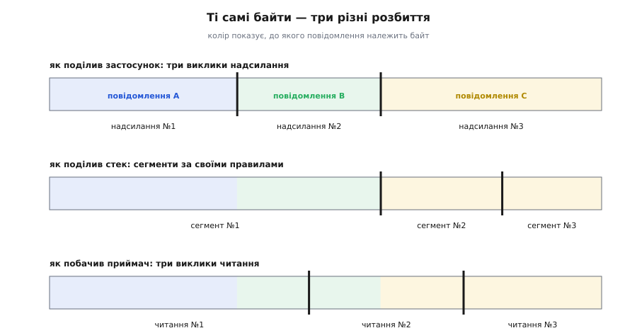
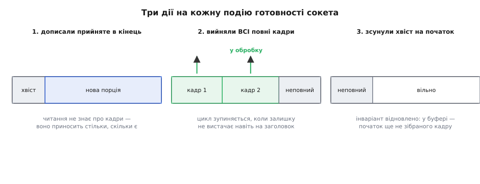
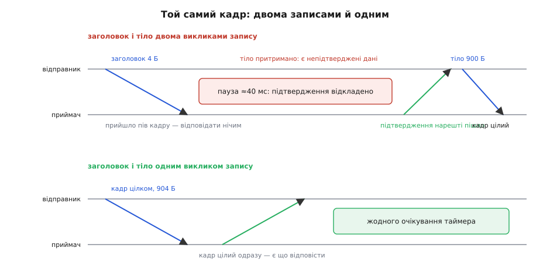

# Кадрування повідомлень у потоці TCP

<preknowlist>
- [Сокети TCP/UDP](book:programming/sockets-tcp-udp) — що таке сокет і що роблять виклики надсилання й читання на встановленому з'єднанні.
- [TCP проти UDP](book:communications/tcp-vs-udp) — що TCP дає надійний упорядкований потік байтів, а UDP — окремі датаграми зі збереженими межами.
- [Біти й порядок байтів](book:programming/bits-bytes-endianness) — як число розкладається на байти й що таке старший та молодший порядок.
- [Блокуючий і неблокуючий ввід-вивід](book:programming/blocking-vs-nonblocking-io) — різниця між читанням, що спить до появи даних, і читанням, що одразу вертає «поки нема нічого».
</preknowlist>

Дві програми домовилися обмінюватися командами через TCP. Перша тричі кличе `send`, кожного разу з однією командою. Друга кличе `recv` — і дістає всі три склеєні в один шматок. Наступного разу вона дістає півтори: цілу команду й перші сім байтів наступної. Ніде нічого не зламалося: TCP доставив кожен байт, жодного не загубив і не переставив. Зникло те, чого він ніколи й не передавав, — **межа повідомлення**.

Зникла вона не через збій і не через оптимізацію, яку можна вимкнути. Її не існує в моделі TCP узагалі, і жодна опція сокета її не поверне. Отже, якщо застосунок мислить повідомленнями, а транспорт — байтами, хтось мусить покласти межі в самі байти й потім їх звідти вичитати. Цей шар і зветься **кадруванням** (англ. *framing*, від *frame* — «рамка»): домовленість, за якою приймач з наявних байтів визначає, де закінчилося одне повідомлення й почалося наступне, — і код, що цю домовленість утілює. Способів такої домовленості небагато, і кожен із них випливає з того, як саме межа зникає.

## Що саме зникає між надсиланням і читанням

TCP нумерує **байти**, а не повідомлення. У його заголовку є порядковий номер, і рахує він октети потоку від початку з'єднання; поля «тут закінчилося сьоме повідомлення» там немає — бо в моделі TCP повідомлень немає взагалі. Специфікація каже це прямо: TCP не гарантує жодної відповідності між межами надісланих і прийнятих сегментів (RFC 9293, §3.7). Прапорець `PSH`, який іноді помилково беруть за таку межу, нею не є: він лише підказка стекові «віддай накопичене застосунку», API сокетів його застосунку не показує, а стеки виставляють і зливають його на власний розсуд.

Порізати потік комусь усе одно доводиться — і рішення про поділ ухвалюють у чотирьох незалежних місцях, жодне з яких не бачить ваших повідомлень.

**Черга відправлення.** Виклик `send` не кладе дані в мережу — він копіює їх у чергу сокета й повертається. Коли стек збереться формувати сегмент, він візьме з черги стільки, скільки вважає за потрібне. Два швидкі надсилання по 50 байтів застануть чергу непорожньою й поїдуть одним сегментом на 100 байтів. Це не випадковість, а правило, записане в специфікації: якщо в дорозі є непідтверджені дані, стек **притримує** дрібні порції, доки не отримає підтвердження або доки не назбирається повнорозмірний сегмент (RFC 9293, §3.7.4). Той самий механізм відомий як алгоритм Нейгла — Джон Нейгл запропонував його 1984 року в RFC 896 саме тому, що на один корисний байт припадало сорок байтів заголовків.

**Розмір сегмента й вікно.** Велике надсилання, навпаки, ріжеться: сегмент не може бути більший за MSS (англ. *maximum segment size* — найбільший розмір сегмента), а це на звичайному Ethernet близько 1460 байтів корисних даних. Повідомлення на 10 КБ поїде щонайменше сімома сегментами, і між ними вільно вклиняться паузи — вікно приймача заповнилося, вікно перевантаження ще не розкрилося.

**Повторна передача.** Навіть той поділ, що вже стався на дроті, не сталий у часі. Пересилаючи втрачений сегмент, Linux може злити сусідні сегменти черги в один більший — цим керує параметр `net.ipv4.tcp_retrans_collapse`, увімкнений типово. Тобто той самий байт може прилетіти вдруге в іншій компанії, ніж летів уперше.

**Читання.** Нарешті, приймальний бік. Виклик `recv` копіює з черги прийому стільки, скільки там **зараз є** і скільки влізе у ваш буфер. Він не чекає «повного повідомлення» — про повідомлення він нічого не знає. Дасть 1 байт, якщо в черзі один; дасть 3000, якщо там три склеєні команди; дасть 8192 і обріже все понад ваш буфер до наступного разу.


*Один і той самий потік у трьох розбиттях. Угорі — як його порізав застосунок: три виклики надсилання, три повідомлення. Посередині — як його порізав стек: A і B поїхали одним сегментом, а C розпалося на два. Унизу — як його побачив приймач: жодне читання не збіглося з межею повідомлення — перше принесло A з початком B, друге — хвіст B із початком C. Спільне в усіх трьох рядках лише одне: порядок і склад байтів. Межі не переживають дороги, бо їх ніхто й не передавав.*

Найпідступніше в цьому — що зламаний код зазвичай **працює**. На локальній петлі немає обмеження в 1500 байтів (там кадр буває на десятки кілобайтів), немає затримки, немає втрат: одне надсилання майже завжди стає одним читанням. Код, що приймає повідомлення за виклик, проходить усі тести на машині розробника й падає при першому справжньому навантаженні — коли з'явиться проміжний вузол, коли повідомлення переросте MSS, коли клієнт почне слати їх пачками. Тому припущення «одне надсилання — одне читання» не «майже правильне»: воно просто хибне, а тестова машина цього не показує.

> 🔧 **Навіщо це.** Це найчастіша причина мережевих багів, що «плавають». Симптом виглядає як зіпсовані дані, а причина — зсунута межа: розбирач прочитав хвіст одного повідомлення як голову наступного й дістав правдоподібне сміття. Якщо приймальний код десь припускає, що читання поверне рівно одне повідомлення, — це не оптимізація й не спрощення, це відкладена аварія. Правильна звичка проста: жоден рядок приймача не має права спиратися на те, **скільки** байтів прийшло за раз.

## Що TCP усе-таки обіцяє — і чому кадр тут інший, ніж на дроті

Перш ніж вигадувати кадр, варто точно знати, від чого його треба захищати, а від чого — ні. TCP дає чотири гарантії, і разом вони докорінно змінюють конструкцію кадру порівняно з послідовною лінією.

По-перше, **усі байти дійдуть** — стек повторюватиме втрачені сегменти, доки не доставить або доки не визнає з'єднання мертвим. По-друге, **у тому самому порядку**: переставлені в дорозі сегменти стек упорядкує перед видачею. По-третє, **без дублікатів і без спотворень**: повтори відсіює нумерація, а пошкодження ловить контрольна сума. По-четверте, **кінець позначено**: коли інший бік закриває свій напрямок, читання повертає нуль, а якщо з'єднання обірвалося аварійно — повертає помилку. Ви ніколи не опиняєтесь у стані «дані просто перестали йти, і незрозуміло чому».

Тепер порівняймо з послідовною лінією. Там приймач може ввімкнутися посеред чужої передачі, там байт може безслідно зникнути через переповнення апаратного буфера, там перешкода перевертає біти й ніхто цього не помічає. Саме тому [кадр на дроті](book:programming/data-serialization) обов'язково має маркер початку, за яким ловлять синхронізацію з будь-якої точки, і контрольну суму, без якої не відрізнити пакет від шуму.

У TCP усього цього не потрібно — і причина в одному реченні: **з'єднання починається з відомої точки**. Перший байт, який ви прочитали, — це байт номер один потоку, а не «якийсь із середини». Якщо ви знаєте, де починається перший кадр (а він починається на початку), ви арифметично знаєте, де починаються всі наступні. Маркер початку не дає нічого, чого ви ще не знаєте; контрольна сума проти випадкових спотворень дублює те, що вже зробив транспорт.

Але з тієї самої властивості випливає й правило, суворіше за все, що є в світі послідовних ліній. **У потоці TCP немає ресинхронізації.** Якщо ваш розбирач хоч раз збився на байт, він не збився «тимчасово»: наступні чотири байти він прочитає як довжину, дістане правдоподібне число, відлічить за ним чуже сміття й піде далі, ніколи не дізнавшись про помилку. Шукати нема чого — будь-який візерунок байтів законно трапляється в даних, тож жодна послідовність не може означати «тут точно початок кадру». Звідси єдина коректна реакція на порушення кадрування: **розірвати з'єднання**. Не пропустити повідомлення, не спробувати вирівнятися, не «читати далі й сподіватися» — закрити, бо після збою потік для вас утратив сенс назавжди.

Одне уточнення, щоб не було ілюзії абсолютної цілості. Контрольна сума TCP — це 16-бітна сума з доповненням до одиниці, і вона [ловить далеко не все](book:communications/internet-checksum): рідкісні комбінації помилок вона пропускає, а на великих обсягах трафіку «рідкісне» трапляється щодня. Тож перевірку цілості даних на рівні застосунку інколи додають свідомо — але вона захищає **зміст** повідомлення, а не його межі, і ніколи не рятує від збитого кадрування.

> 🔧 **Навіщо це.** Із цього виходить дуже конкретне проєктне рішення. Коли в TCP-протокол додають преамбулу на кшталт `0xAA55` «щоб можна було ресинхронізуватися», вона створює хибне відчуття безпеки: ресинхронізуватися нема на що, а от відрізнити чужий трафік на порту чи невідповідність версій вона справді допомагає — саме як **перевірку**, після якої з'єднання розривають, а не як точку відновлення. Тримайте цю різницю в голові: у TCP маркер — це запобіжник від «ми говоримо різними протоколами», а не механізм самолікування.

## Умова, з якої випливають усі способи кадрування

Вимога до кадрування рівно одна, і вона строга: **приймач, маючи лише вже отримані байти й правила протоколу, мусить визначити, чи повідомлення закінчилося, — і визначити це так само, як відправник**. Усе інше — наслідки. Задовольнити цю умову можна небагатьма способами, і кожен платить свою, наперед відому ціну.

### Стала довжина

Найпростіше: домовитися, що кожне повідомлення має рівно `N` байтів. Приймач лічить до `N` — і межа знайдена. Ніякого пошуку, ніяких заголовків, жодної двозначності.

Живе це рішення там, де потік справді однорідний: біржова стрічка з фіксованим записом, телеметрія з незмінним набором полів, обмін між двома частинами однієї системи, які завжди оновлюють разом. Помирає воно на першій же зміні: додали поле — і старий приймач ріже потік не там, причому не помічає цього. Тому в чистому вигляді сталу довжину беруть рідко — але саме вона стає **зерном** наступного способу: заголовок сталого розміру, що описує змінне тіло.

### Префікс довжини

Кожне повідомлення починається із заголовка сталого розміру, у якому записано, скільки байтів тіла йде далі. Приймач читає заголовок — і одразу знає точну межу, не заглядаючи в тіло взагалі.

Це найпоширеніше кадрування двійкових протоколів, і має воно чотири переваги, які варто бачити окремо. Тіло **прозоре**: будь-який байт, зокрема нуль і переведення рядка, — звичайні дані, екранувати нічого не треба. Пошуку **немає**: кінець обчислюється додаванням, тож вартість не залежить від довжини повідомлення. Пам'ять можна виділити **точно** — стільки, скільки треба, одним шматком. І, що недооцінюють, невідоме повідомлення можна **пропустити не розбираючи**: прочитав довжину, відлічив, викинув — так протокол лишається сумісним із наступними версіями.

Ціна теж одна й конкретна: **довжину треба знати до того, як писати перший байт**. Якщо відповідь породжується поступово (стрічка з бази, файл, що ще генерується), доведеться зібрати її в пам'яті цілком, аби виміряти. Відповідь на цю ціну винайшли давно: різати тіло на **шматки**, кожен зі своїм префіксом довжини, а кінець позначати шматком нульової довжини. Так влаштоване поблокове кодування (англ. *chunked*) у [HTTP](book:programming/http): сервер шле скільки має, коли має, і жодного разу не потребує знати повний розмір наперед.

Щоб префікс довжини працював, у специфікації протоколу треба прибити п'ять речей — і кожна з них колись була чиїмось багом сумісності:

- **Ширина поля й стеля.** Два байти дають межу 65 535 і роблять стелю автоматичною; чотири байти дають 4 ГіБ — і зобов'язують установити власну межу, бо інакше ви щойно дозволили співрозмовникові попросити стільки пам'яті.
- **Порядок байтів.** Його фіксує протокол, а не машина: класично старшим байтом уперед. Ця дрібниця — джерело цілого класу помилок при [пакуванні заголовка](book:programming/wire-format-packing), бо між двома машинами однієї архітектури все працює, а з третьою — ні.
- **Що саме лічить довжина.** Тільки тіло чи заголовок разом із тілом? Обидва варіанти законні, розбіжність у чотири байти — ні. Це друга за частотою причина того, що дві реалізації одного протоколу «майже сумісні».
- **Чи законна нульова довжина.** Порожній кадр — зручний спосіб сказати «я живий», але тільки якщо приймач знає, що це не помилка.
- **Максимум, який перевіряють до виділення пам'яті.** Стеля належить специфікації, а не лише коду: інакше кожна реалізація вигадає власну, і кадр, законний для одного вузла, стане помилкою для іншого.

```
байти 0..3     довжина тіла, беззнакове 32-бітове, старшим байтом уперед
               00 00 01 2C  →  0x0000012C = 300
байти 4..303   тіло повідомлення — рівно 300 байтів, будь-які значення
байт  304      початок наступного кадру: знову чотири байти довжини
```

### Байт-роздільник

Протилежний шлях — домовитися про байт (чи послідовність), який позначає кінець повідомлення й **не може трапитися в тілі**. Класика — переведення рядка чи пара `CR LF` у текстових протоколах: так кадрують команди SMTP, так відділяють заголовки в HTTP, так читає рядки половина всіх службових протоколів.

Умова «не може трапитися в тілі» виконується двома шляхами. Або тіло за побудовою не містить роздільника — це випадок текстових протоколів, де дані й так обмежені друкованими символами. Або роздільник у даних **екранують**, замінюючи на пару байтів; тоді довжина на дроті стає непередбачуваною, а розбирач мусить пам'ятати, що попередній байт був екрануванням.

Переваги дзеркальні до префікса довжини: розмір знати наперед **не треба** (пиши, поки пишеться, тоді постав роздільник), а дамп трафіку читає людина без жодних інструментів — це коштує дешевше, ніж здається, коли протокол доводиться налагоджувати о третій ночі. Недоліки теж дзеркальні: кожен байт треба **переглянути**; двійкові дані вимагають екранування з його роздуванням; і — найгірше — приймач не знає, скільки чекати, тож той, хто ніколи не надішле роздільника, змусить його накопичувати байти без кінця.

### Структура, що сама себе окреслює

Є й спосіб, у якому межу задає сама граматика запису. Найчистіший приклад — **нетрядки** (англ. *netstring*), формат, який 1997 року описав Деніел Дж. Бернстайн (Daniel J. Bernstein): десяткова довжина, двокрапка, тіло, кома.

```
"12:hello world!,"    12 — довжина тіла, ':' — початок, ',' — контрольний хвіст
"0:,"                 порожній рядок теж має законне подання
```

Кома наприкінці тут — не оздоба, а дешевий запобіжник: якщо на обчисленій позиції її немає, кадрування вже збите, і приймач дізнається про це негайно, а не через три повідомлення. Той самий підхід — у записах «тип-довжина-значення», на яких стоять ASN.1 BER і безліч двійкових протоколів: кожне поле саме несе свою довжину, тож розбирач іде структурою, ніде не гадаючи.

А от протилежний приклад показує, де ця родина стає небезпечною. Кадрувати JSON підрахунком дужок можна — але щоб знайти кінець повідомлення, доведеться **повністю розібрати** дані, яким ви ще не довіряєте, і врахувати кожну тонкість екранування в рядках. Дві реалізації, що розходяться в одній такій тонкості, розставлять межу на різних байтах — а це вже не розбіжність у смаках, це діра в безпеці. Звідси практичне правило: **межу кадру має вміти знаходити розбирач, значно дурніший за розбирач вмісту**. Дурніший розбирач важче обдурити.

### Кінець з'єднання як межа

Є ще граничний випадок: не позначати кінець ніяк, а просто закрити з'єднання — усе, що прийшло до закриття, і є повідомленням. Так працював HTTP до появи сталих з'єднань, і так HTTP/1.1 досі поводиться, коли довжину тіла визначити нічим.

Спосіб чесно простий і має дві незцілимі вади. По-перше, повідомлення на з'єднання — рівно одне: щоб надіслати друге, треба платити за нове рукостискання. По-друге, і це важливіше, **обірване з'єднання не відрізнити від завершеного**: приймач не знає, чи відправник закінчив думку, чи впав посеред неї. Саме ця двозначність і породила поле `Content-Length`, а згодом поблокове кодування — [історію цих рішень](book:programming/tcp-message-framing/hist-http-framing.md) варто знати окремо, бо кожен наступний крок HTTP тут виправляв конкретну ваду попереднього, а один із них зрештою відкрив цілий клас атак.


*Те саме тіло «PING» у чотирьох кадруваннях. Стала довжина не має службових байтів, але й не терпить змін. Префікс довжини платить сталим заголовком і дає точну межу без пошуку. Роздільник не має заголовка зовсім, але забороняє свій байт у тілі й вимагає перегляду. Нетрядок поєднує довжину з контрольним хвостом, який негайно викриває збите кадрування. Праворуч — що саме приймач мусить зробити, щоб знайти межу.*

## Приймач, який нічого не припускає

Найпростіший коректний приймач знають усі: цикл, що читає, доки не набереться потрібна кількість байтів. Спершу так вичитують заголовок, тоді за його довжиною — тіло. Це справді правильний код, і для клієнта, що говорить з одним сервером у своєму потоці виконання, кращого не треба.

Але цикл усередині функції означає одне: поки повідомлення не зібралося, ця функція **не повертається**. Для сервера з тисячею з'єднань чи для програми з циклом подій це неприйнятно — заснувши на одному співрозмовникові, ви не обслуговуєте решту. Тому в загальному випадку стан розбору мусить жити не в стеку виклику, а **в об'єкті з'єднання**: буфер, кількість накопичених байтів і, за потреби, позиція пошуку. Тоді кожна порція байтів обробляється рівно стільки, скільки може бути оброблена, і керування негайно повертається.

Інваріант такого приймача формулюється одним реченням: **у буфері лежить початок потоку, з якого ще не вийшов жоден повний кадр**. Усе, що вже стало повним кадром, звідти забрано; усе, що прийшло після, — дописано в кінець. Робота на кожну подію готовності складається з трьох дій: дочитати в кінець буфера, розібрати з нього **всі** повні кадри, зсунути залишок на початок.

:::tabs
```c
// buf — накопичувач з'єднання, have — скільки в ньому байтів
static int on_readable(struct conn *c) {
    ssize_t n = recv(c->fd, c->buf + c->have, sizeof c->buf - c->have, 0);
    if (n < 0) return (errno == EAGAIN) ? OK : ERR_IO;
    if (n == 0) return (c->have == 0) ? CLEAN_EOF : ERR_TRUNCATED;
    c->have += (size_t)n;

    size_t off = 0;                          // скільки з буфера вже розібрано
    while (c->have - off >= HDR) {           // заголовок цілий?
        uint32_t len = be32(c->buf + off);   // довжина зі старшим байтом уперед
        if (len > MAX_FRAME) return ERR_PROTO;    // стеля — ДО будь-якої арифметики
        if (c->have - off < HDR + len) break;     // тіло ще не все — чекаємо далі
        handle_frame(c->buf + off + HDR, len);
        off += HDR + len;
    }
    memmove(c->buf, c->buf + off, c->have - off); // хвіст — на початок буфера
    c->have -= off;
    return OK;
}
```
```go
// buf — накопичувач з'єднання, have — скільки в ньому байтів
func (c *Conn) onReadable() error {
	n, err := c.conn.Read(c.buf[c.have:])
	c.have += n

	off := 0 // скільки з буфера вже розібрано
	for c.have-off >= hdrLen { // заголовок цілий?
		raw := binary.BigEndian.Uint32(c.buf[off:])
		if raw > maxFrame { // стеля — ДО будь-якої арифметики
			return errProtocol
		}
		length := int(raw)
		if c.have-off < hdrLen+length { // тіло ще не все — чекаємо далі
			break
		}
		c.handleFrame(c.buf[off+hdrLen : off+hdrLen+length])
		off += hdrLen + length
	}
	copy(c.buf, c.buf[off:c.have]) // хвіст — на початок буфера
	c.have -= off

	if err == io.EOF {
		if c.have == 0 {
			return nil // кінець рівно на межі кадру — чисте завершення
		}
		return errTruncated // обірвано посеред кадру
	}
	return err
}
```
:::

Ці двадцять рядків приховують кілька пасток, повз які легко пройти.

**Розбирати треба до вичерпання, а не по одному кадру на подію.** Спокуса «прочитали — обробили одне повідомлення — вийшли» коштує дорого: якщо в буфері лежали два повні кадри, другий залишиться чекати наступної події готовності сокета. А її може не бути ніколи — співрозмовник уже надіслав усе й тепер чекає на відповідь. Виходить взаємне очікування, у якому ніхто нічого не порушив: дані отримано, але не розібрано. Той самий за природою збій дає й неповне читання сокета в режимі сповіщення за фронтом: [`epoll` із фронтовим режимом](book:unix-linux/select-poll-epoll) повідомляє про **зміну** стану, тож не вичерпавши чергу читанням до `EAGAIN`, ви більше не почуєте про наявні там байти.

**Заголовок теж приходить частинами.** Чотирибайтовий префікс може прилетіти як 1 + 3 байти — тому й він проходить через накопичувач, а не читається окремим «швидким» викликом. Перевірка `have - off >= HDR` у циклі — саме про це.

**Буфер мусить умістити найбільший кадр цілком.** Якщо `MAX_FRAME` більший за буфер, настане момент, коли буфер повний, кадр неповний, а вільного місця для читання нема. Виклик читання з нульовим розміром поверне нуль — і код сприйме це як закриття з'єднання, хоч воно живісіньке. Тому або буфер не менший за `HDR + MAX_FRAME`, або довгі кадри читають в окремо виділену пам'ять, або нестачу місця обробляють явно як помилку протоколу.

**Ущільнення коштує, але амортизовано дешеве.** Зсув хвоста на початок — це копіювання, і теоретично його можна робити на кожну подію. Насправді хвіст — це завжди неповний кадр, тобто менше за один кадр даних, а копіюємо ми його не частіше, ніж прийшла нова порція; сумарна робота лишається пропорційною обсягу трафіку. Уникнути зсуву зовсім дає [кільцевий буфер](book:algorithms/ring-buffer), але він приносить свою складність: кадр може лягти «через стик» і стати нецілісним у пам'яті, а розбирач хоче суцільний шматок. Практичний компроміс — дописувати в кінець, доки є місце, і ущільнювати лише коли місце скінчилося.

**Довге тіло не варто копіювати двічі.** Коли довжина вже відома й велика, розумніше виділити буфер саме під це тіло й читати мережу **прямо в нього**, минаючи накопичувач. Тоді великі дані переживають рівно одне копіювання — з ядра в пам'ять застосунку.

Для кадрування роздільником додається ще одна, дуже дорога пастка: **позиція пошуку**. Якщо на кожну нову порцію шукати роздільник із початку буфера, то довгий рядок, що приходить сотнями порцій, перечитуватиметься знову й знову.

**Скільки коштує перечитувати від початку.** Рядок на 1 МіБ приходить порціями по 1460 байтів; порівняймо повторний пошук від початку з пошуком від запам'ятованої позиції.

```
довжина рядка          n = 1 048 576 байтів
розмір порції          p = 1460 байтів
кількість порцій       m = n / p ≈ 718
пошук від початку      p · (1 + 2 + … + m) = 1460 · 718 · 719 / 2 ≈ 3.77·10⁸ байтів
пошук від позиції      n                                          ≈ 1.05·10⁶ байтів
відношення             3.77·10⁸ / 1.05·10⁶                        ≈ 360 разів
```

У триста шістдесят разів більше роботи — і не через складний алгоритм, а через один забутий лічильник. Тому розбирач із роздільником зобов'язаний пам'ятати, до якого байта він уже дивився, і починати з нього.

Окремої уваги вартий **кінець потоку**. Нуль від читання означає «інший бік більше не надсилатиме», і тлумачити його треба за станом буфера: якщо буфер порожній — це чисте завершення на межі кадру; якщо там лежить початок кадру — це обірване повідомлення, тобто помилка, а не тиша. Плутати ці два випадки небезпечно: у першому з вами коректно попрощалися, у другому вам віддали половину даних, і обробити її як цілу означає ухвалити рішення на підставі уламка. Так само важливо не вважати нуль від читання кінцем **розмови**: інший бік міг закрити лише свій напрямок і терпляче чекати вашої відповіді. І, нарешті, треба мати таймер: співрозмовник, що надіслав заголовок і замовк, інакше триматиме ваш буфер і ваше з'єднання, скільки схоче, — тут доречні [явні строки на операцію](book:programming/timeouts-deadlines).


*Три кроки на кожну подію готовності. Ліворуч: у буфері вже лежить хвіст попереднього читання, у кінець дописано нову порцію. Посередині: цикл розбору забирає всі повні кадри — тут їх два — і зупиняється, коли залишку не вистачає навіть на заголовок. Праворуч: неповний хвіст зсунуто на початок, і буфер знову готовий приймати. Інваріант між подіями один: у буфері лежить початок потоку, з якого ще не вийшов жоден повний кадр.*

Повний робочий приймач з усіма цими деталями — з керуванням буфером, обробкою обірваного кадру, стелями й розбором помилок — [зібраний окремо](book:programming/tcp-message-framing/proj-framed-reader.md): там і код, і трасування того, як він поводиться на різних розбиттях того самого потоку.

## Відправник: кадр не має залежати від того, як його порізали записи

Симетрична частина простіша, але має власні гострі місця.

Перше — **часткове записування**. Виклик запису має право прийняти менше, ніж ви дали: у неблокуючому режимі — коли черга відправлення заповнилася, у блокуючому — коли виклик перервав сигнал. Обробка тут єдино можлива: запам'ятати, скільки байтів кадру вже пішло, і продовжити з цього зсуву, коли сокет знову прийматиме. Чого робити **не можна** — це переформувати кадр: заголовок уже в дорозі, і другий заголовок посеред тіла зробить із потоку кашу. Правило те саме, що й на прийомі, лише з іншого боку: кадрування не має права залежати від того, як операційна система порізала ваші записи.

Друге гостре місце менш очевидне й коштує сорок мілісекунд на порожньому місці. Спокусливо надіслати заголовок одним викликом, а тіло — другим: код виходить чистіший. Але два дрібні записи поспіль, за якими відправник чекає відповіді, потрапляють точно в резонанс двох стандартних механізмів. Перший сегмент вилітає одразу. Другий притримується, бо в дорозі є непідтверджені дані (те саме правило RFC 9293, §3.7.4). А приймач не підтверджує негайно, бо працює **відкладене підтвердження**: підтвердження можна затримати, сподіваючись відправити його разом із власними даними, — RFC 1122 (§4.2.3.2) дозволяє тримати його до 500 мс. Своїх даних у приймача немає, бо повідомлення в нього неповне: він отримав заголовок і чекає тіла.

**Затримка на двох записах.** Обидві сторони поводяться бездоганно за специфікацією — і разом стають у глухий кут, з якого їх виводить лише таймер.

```
t = 0.0 мс    відправник: запис заголовка (4 Б) → сегмент №1 вилітає
t = 0.1 мс    відправник: запис тіла (900 Б)    → притримано: є непідтверджені дані
t = 0.2 мс    приймач:    отримав 4 Б — кадр неповний, відповідати нічим
                          підтвердження відкладено
t = 40 мс     приймач:    спрацював таймер → підтвердження пішло
t = 40.1 мс   відправник: підтвердження отримано → сегмент №2 з тілом вилітає
t = 40.2 мс   приймач:    кадр нарешті цілий → обробка починається
```

Сорок мілісекунд — це нижня межа таймера відкладеного підтвердження в Linux; інші стеки історично тримали 200 мс, а стандарт дозволяє й до 500. Пропускна здатність тут ні до чого: у вас вийде близько 25 обмінів на секунду на з'єднанні з нульовою мережевою затримкою. Обидва механізми — [притримування дрібних сегментів і відкладене підтвердження](book:programming/nagle-and-delayed-ack) — поодинці цілком розумні й економлять пакети; біда виникає рівно тоді, коли їх зводить докупи кадр, розірваний на два записи.

Правильне лікування — не вимикати механізми, а **не створювати резонансу**: складати заголовок і тіло в один запис. Якщо копіювати тіло в спільний буфер шкода, є розсіяний запис — виклик, що бере кілька шматків пам'яті й віддає їх стекові як одну неперервну порцію:

```c
struct iovec iov[2] = {
    { .iov_base = hdr,  .iov_len = HDR },   // заголовок з довжиною
    { .iov_base = body, .iov_len = len },   // тіло, яке нікуди не копіюємо
};
ssize_t n = writev(fd, iov, 2);             // один виклик — одна порція для стека
```

Опція `TCP_NODELAY`, що вимикає притримування дрібних сегментів, теж прибирає затримку — і її справді ставлять на з'єднаннях, чутливих до відгуку ([разом з іншими опціями сокета](book:programming/socket-options)). Але вона лікує наслідок: пакетів стає більше, а причина — розірваний надвоє кадр — лишається. Розумний порядок дій такий: спершу зробити кадр одним записом, і лише тоді, якщо відгук усе ще не влаштовує, вимикати притримування.

Третє — що робити, коли відправляти вже нікуди. Черга відправлення скінченна; коли співрозмовник читає повільніше, ніж ви пишете, вона заповнюється, і неблокуючий запис починає відмовляти. Складати кадри в чергу застосунку — природно, але **черга без межі — це бомба**: пам'ять з'їсть найповільніший клієнт. Саме шар кадрування — правильне місце для рішення, бо тільки він знає, де проходять межі повідомлень: викинути застарілі кадри (телеметрія), притримати виробника даних (передавання файлу) чи розірвати з'єднання, визнавши співрозмовника неспроможним. Це загальна задача [протитиску](book:algorithms/backpressure), і вибору тут не уникнути — можна лише зробити його мовчки й невдало.


*Угорі — заголовок і тіло двома записами: другий сегмент притримано, бо перший ще не підтверджено, а підтвердження відкладено, бо приймачеві нічого сказати у відповідь на пів кадру; розв'язує глухий кут таймер. Унизу — той самий кадр одним записом: сегмент виходить цілим, приймач одразу має повне повідомлення й одразу відповідає. Різниця не в обсязі даних, а лише в тому, як їх поділили на виклики.*

> 🔧 **Навіщо це.** Ця пара — часткове записування й затримка на двох записах — дає найнеприємніший клас відмов: код працює, тести проходять, а система «іноді гальмує» або «раз на день губить хвіст повідомлення». Обидва лікуються тим самим правилом: **кадр формують у пам'яті цілим і віддають одним викликом, а зсув недописаного зберігають у з'єднанні**. Це коштує кілька рядків і знімає обидва симптоми назавжди.

## Кадрування як межа довіри

Поле довжини — це число, яке **надіслав співрозмовник**, і воно керує вашою пам'яттю: за ним ви вирішуєте, скільки байтів виділити й скільки чекати. Чуже число з такими повноваженнями потребує окремої обережності.

Найпряміша атака не потребує жодної вигадливості: надіслати заголовок із довжиною 4 ГіБ і не надсилати нічого більше. Приймач, який виділяє пам'ять за прочитаною довжиною, впаде на першому ж такому кадрі; приймач, який зростає буфером поступово, помре трохи згодом і від тисячі з'єднань, кожне з яких попросило «лише» по мегабайту. Тому стеля перевіряється **до** будь-якого виділення й **до** будь-якої арифметики: вираз `HDR + len` на 32-бітній арифметиці з `len` близько межі [обернеться на маленьке число](book:programming/overflow-wraparound), і перевірка «чи вміщується» пройде успішно для кадру, що не вміщується. Єдино правильний порядок дій: прочитати довжину, порівняти зі стелею, і тільки потім рахувати.

Кадрування роздільником має свою версію тієї самої атаки — просто не надсилати роздільник. Тому будь-який пошук межі мусить мати межу пошуку: перевищив ліміт рядка — це помилка протоколу, а не привід рости далі.

Третій, найтонший клас проблем виникає, коли в протоколі **дві межі водночас**. Канонічний приклад — HTTP/1.1, де довжину тіла можна задати полем `Content-Length`, а можна поблоковим кодуванням. Якщо повідомлення несе обидва, різні реалізації можуть розійтися в тому, котре головніше — і тоді один вузол побачить у потоці одне повідомлення, а наступний за ним — два. Другого, «прихованого» повідомлення перший вузол не бачив і не перевіряв: воно склеїться із запитом наступного клієнта. Це і є **контрабанда запитів** — клас атак, уперше докладно описаний 2005 року в праці дослідників компанії Watchfire (Хаїм Лінхарт, Аміт Кляйн, Ронен Гелед, Стів Оррін); [сама механіка розбіжності](book:programming/http-request-smuggling) варта окремого розгляду. Чинний стандарт формулює правило жорстко: поблокове кодування переважає над `Content-Length`, надсилати обидва заборонено, сервер може відхилити такий запит — але **мусить** після відповіді закрити з'єднання, щоб у потоці не лишилося нічого чужого (RFC 9112, §6.3).

Звідси загальний закон, який варто винести за межі HTTP. У кадруванні **двозначність — це вразливість**, а не питання сумісності. Знаменита порада «будь суворим до того, що надсилаєш, і терпимим до того, що приймаєш» на цьому шарі не працює: терпимість означає, що ваш вузол і сусідній тлумачать однакові байти по-різному, а «повідомлення, з приводу якого дві реалізації не згодні» — це вже не повідомлення. Тому правил тут рівно два, і обидва суворі: **одна межа, визначена однозначно**, і **будь-яке порушення кадрування — розрив з'єднання**.

Межа кадру виявляється точкою, у якій чужі байти стають вашим об'єктом. До неї у вас лише сирий потік, за який відповідає транспорт; після неї — повідомлення, на підставі якого ваша програма щось робить: виділяє пам'ять, звертається до бази, рухає механізмом. Тому вибір кадрування — це насправді вибір двох речей: скільки вашої пам'яті може попросити незнайомець одним числом і наскільки розумним має бути код, що ухвалює рішення про межу, ще нічому не довіряючи. Протокол, у якому обидві відповіді записані явно, переживає і навантаження, і зловмисника; протокол, де вони лишилися «очевидними», переживе тільки локальну петлю.
