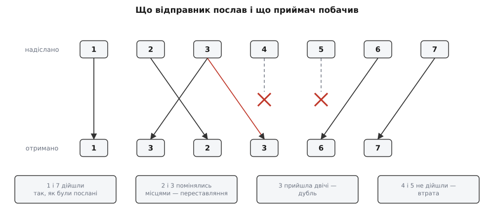
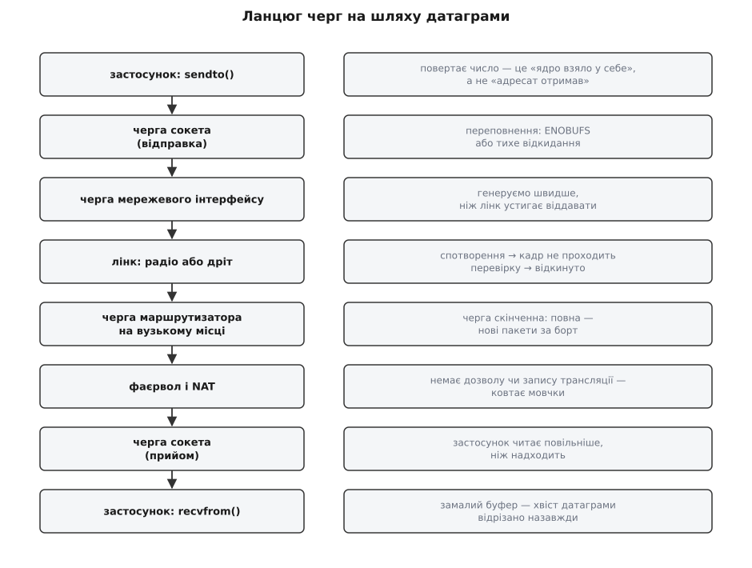

# Семантика датаграми UDP: втрати, дублі, переставляння

<preknowlist>
- [Сокети TCP/UDP](book:programming/sockets-tcp-udp) — що таке сокет і порт, як виглядають виклики `sendto` й `recvfrom`.
- [TCP проти UDP](book:communications/tcp-vs-udp) — TCP тримає з'єднання, підтверджує й перепитує; UDP не робить нічого з цього.
- [Маршрутизація](book:communications/ip-routing) — пакет іде до адресата через ланцюг маршрутизаторів, і кожен обирає наступний крок самостійно.
</preknowlist>

## Що означає число, яке повернув `sendto`

`sendto` повернув 1400. Це означає рівно одне: ядро взяло у себе 1400 байтів і спробує їх відправити. Чи дійшли вони, відправник не дізнається — каналу, яким про це можна було б повідомити, у нього немає.

Немає не через недогляд. Щоб знати долю відправленого, потрібна зустрічна звістка «отримав». Її треба з чимось зіставити, отже, відправник мусить пам'ятати, що і коли слав, — а цю пам'ять треба завести на початку розмови, прибрати наприкінці й стерегти від зависання, коли співрозмовник замовк назавжди. Так із простого бажання знати виростають з'єднання, тайм-аути й повтори — усе те, чим займається TCP і за що платять пам'яттю та зайвим очікуванням.

UDP (англ. *User Datagram Protocol* — «протокол датаграм користувача») від цієї машинерії відмовився цілком. Він додає до IP лише два порти, довжину й контрольну суму, тому й не має де тримати знання про долю пакета. [Відмова була свідомим інженерним рішенням: живому звуку й відео вчасність важить більше за повноту](book:programming/udp-datagram-semantics/hist-udp-birth.md). Наслідок для коду жорсткий: усе, що застосунок хоче знати про свої датаграми, він мусить з'ясувати сам.

## Що UDP таки обіцяє

Три речі протокол тримає твердо.

**Межі повідомлення.** Одне `sendto` — одна датаграма (від англ. *data* + *telegram* — «телеграма з даними»); одне `recvfrom` віддає рівно одну датаграму цілком. Байти сусідніх датаграм ніколи не змішуються, а сама датаграма приходить уся або ніяк — половини не буває. Пастка тут рукотворна: якщо буфер під `recvfrom` менший за датаграму, ядро віддасть скільки влізло, а хвіст відкине назавжди.

**Цілість вмісту.** У заголовку є контрольна сума, порахована по вмісту й заголовку. Якщо на приймачі вона не збіглася, датаграму тихо відкидають і застосункові не віддають. Тому пошкодження байтів на лінії виглядає для коду не як покручені дані, а як звичайна втрата.

**Доставку до потрібного порту.** Пара «адреса + порт» однозначно каже, якому сокету віддати датаграму. Це і вся адресація: ніякої «сесії» під нею немає.

Далі обіцянки закінчуються: не гарантовано ні доставку, ні унікальність, ні порядок, ні час.

## Три речі, що трапляються по дорозі



*Одна датаграма може зникнути, прийти двічі або обігнати сусідку — і жодна з цих подій не є помилкою протоколу.*

Датаграма може зникнути — це **втрата**. Може прийти кілька разів — це **дубль**. Може обігнати сусідку — це **переставляння**. Разом вони вичерпують усе, що мережа здатна зробити з потоком: спотворити вміст вона не може (спотворене відкидають як утрачене), а загубити, повторити й поміняти місцями — цілком.

## Куди зникає датаграма



*Кожна ланка шляху — черга з обмеженим дном; переповнена черга мовчки відкидає те, що не влізло.*

Причина втрат спільна: на кожному відрізку шляху стоїть черга скінченного розміру, а темпи, з якими в неї кладуть і з неї забирають, ніхто не узгоджував. Кладуть швидше, ніж забирають — черга росте до стелі, і зайве відкидають.

Таких місць на шляху кілька. Буфер сокета на відправці. Радіолінк, де кадр гине від завад. Черга маршрутизатора на стику швидкого сегмента з повільним — саме вона робить утрати **пачками**, бо відкидає не одну датаграму, а всі, поки не звільниться місце. Фаєрвол або [NAT, чий запис для UDP живе за таймером і зникає після хвилини мовчання](book:communications/nat). І, найчастіше в реальних системах, черга сокета на прийомі: датаграма вже дійшла до машини, а застосунок читає повільніше, ніж вона наповнюється.

> 🔧 **Навіщо це.** Коли телеметрія «сипеться», перше питання — не «яка мережа поганенька», а «де саме зникло». Утрати в приймальному буфері сокета система рахує окремим лічильником, і він одразу відрізняє власне гальмування від мережевих утрат: у першому випадку допоможе більший буфер і швидше читання, у другому — менший темп або менші датаграми.

Є й спосіб збільшити втрати в кілька разів, нічого не зламавши, — послати завелику датаграму. [Якщо вона не влазить у найбільший блок, який лінк передає одним кадром (для Ethernet і Wi-Fi це 1500 байтів), її ріжуть на фрагменти, а зібрати назад можна лише з усіх шматків одразу](book:communications/ip-fragmentation-mtu). Зникне один фрагмент — пропаде вся датаграма. Звідси правило, яке в мережевому коді тримають за аксіому: тримай датаграму меншою за MTU — із запасом на заголовки й тунелі це приблизно 1400 байтів корисних даних. Треба більше — ріж сам, на рівні застосунку, де ти сам нумеруєш шматки й вирішуєш, що робити з утраченим.

## Дублі й переставляння

Дубль виглядає нелогічно: якщо ніхто нічого не повторює, звідки взятися другій копії? Найчастіше — від самого застосунку. Щойно код над UDP починає боротися з утратами («не дочекався відповіді за 200 мс — шлю ще раз»), він сам стає фабрикою дублів: досить, щоб загубилася не сама датаграма, а відповідь на неї. Рідше копії робить мережа: пристрій, увімкнений і в дріт, і у Wi-Fi, отримує розсилку двічі.

Небезпечний не сам дубль, а те, що робить обробник. Якщо він змінює стан («долий 10 літрів», «поверни на 5 градусів»), другий екземпляр виконає операцію ще раз, і результат буде тихо неправильним. Тому [команди в мережі роблять такими, щоб повторне виконання нічого не міняло](book:programming/api-idempotency): замість «додай» — «встанови в значення».

Порядок ламає паралелізм усередині мережі: між великими вузлами йде не один лінк, а пучок, усередині маршрутизатора працює кілька конвеєрів, між провайдерами існує кілька рівноцінних шляхів. Дві сусідні датаграми, що пішли різними руками, змагаються, хто прийде першим. Рятує звичай розкладати трафік між шляхами за хешем від адрес і портів: датаграми одного обміну лягають на той самий шлях. Але щойно маршрут перебудувався, точка доступу змінилася чи зв'язок перескочив з мобільного на Wi-Fi — кілька датаграм на межі перестрибнуть одна одну. Переставляння рідкісне, але не неможливе, і код, який на нього не розрахований, ламається не щодня, а раз на місяць у найгіршу мить.

## Утрата — не подія, а рішення приймача

Приймач бачить лише те, що прийшло. Датаграми з номером 5 немає. Це втрата — чи вона йде довшим шляхом і прийде за три мілісекунди? У мить, коли її немає, ці два випадки не відрізняються нічим: мережа не надсилає повідомлень про втрату, вона просто мовчить, а мовчання однакове і для «зникло», і для «затримується».

Тому «втрачено» — не факт, який приймач спостерігає, а рішення, яке він ухвалює, почекавши. Почекаєш замало — оголосиш утраченим те, що ось-ось прийде; почекаєш забагато — дані застаріють. Розумна відправна точка — типова затримка шляху плюс запас на її розкид, тобто десятки мілісекунд, а не секунди.

Щоб ухвалити таке рішення про конкретну датаграму, її треба вміти назвати.

## Номер, який кладеш сам

У датаграмі, що прийшла, немає нічого, чим її можна впізнати: порти однакові в усього обміну, а час прибуття не ім'я — дві датаграми легко приходять в одну мілісекунду. Отже, єдиний спосіб дати датаграмі ім'я — покласти його всередину самому. [Зростаючий порядковий номер](book:communications/sequence-numbering), на одиницю більший у кожної нової датаграми, відповідає на всі три питання: прогалина в номерах — утрата, номер, що вже приходив, — дубль, номер, менший за найбільший бачений, — переставляння. Один лічильник у чотири байти закриває всі три.

Одна тонкість, на якій регулярно горять: лічильник скінченний і після найбільшого значення переходить у нуль. Порівнювати номери як звичайні числа не можна — свіжий номер 3 виявиться меншим за старий 4294967290, і приймач вирішить, що потік поїхав назад. Порівнюють різницею:

```c
#include <stdint.h>

// «a новіший за b» для номерів, які переповнюються по колу
static inline int seq_newer(uint32_t a, uint32_t b) {
    return (int32_t)(a - b) > 0;
}
```

Різниця в беззнаковій арифметиці — це відстань по колу; приведення до знакового типу читає її як «уперед» (додатна) або «назад» (від'ємна). Відповідь правильна, доки справжня відстань між номерами менша за півкола, а для чотирибайтового номера це понад два мільярди датаграм.

Щоб упізнавати дублі, приймач пам'ятає не всі номери, а лише кілька десятків останніх — по біту на номер у вікні, яке рухається за найбільшим прийнятим. Номер усередині вікна з уже поставленим бітом — дубль; номер позаду вікна — надто старий; обидва відкидають мовчки. Для типового потоку вистачає вікна на 64 позиції: це один машинний регістр, а глибина переставляння вимірюється одиницями датаграм.

## Стан чи події — головний вибір

Що робити з утратою й переставлянням, залежить від того, що передають — тут проходить межа, яка ділить мережеві застосунки надвоє.

**Дані-стан** — координати апарата, температура, положення джойстика. Кожна нова датаграма замінює попередню, стара нікому не потрібна. Правило одне: новіше виграє. Прийшла датаграма з номером, меншим за найбільший бачений, — її відкидають, навіть якщо вона ціла: цей вміст уже застарів. Ніяких буферів і затримок: утрата однієї вибірки нічого не важить, за 20 мс прийде свіжіша.

**Дані-події** — натискання кнопки, команда, запис у журнал, шматок файлу. Кожна датаграма несе унікальний факт, який не можна ні втратити, ні переставити. Тут потрібні впорядкування (буфер, що притримує те, що прийшло не по черзі) і [надійність — підтвердження й повтори](book:communications/reliable-link), тобто більша частина того, від чого UDP відмовився.

Звідси архітектурний хід, який легко проґавити: часто дані, що виглядають подіями, можна переписати як стан. Замість «кнопку натиснуто» слати «лічильник натискань 17»; замість «змінити режим» — «режим має бути такий». Тоді втрачена датаграма перестає бути катастрофою: наступна принесе повну картину сама.

> 🔧 **Навіщо це.** Питання «UDP чи TCP» вирішується не словом «швидше», а характером даних. Стан, який щомиті оновлюється, живе на UDP природно й дешево; події, які не можна втратити, вимагають надійності — і писати її самому варто лише тоді, коли є причина не брати готову.
