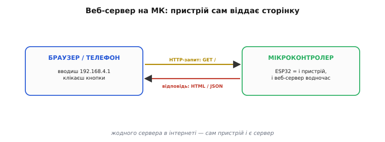
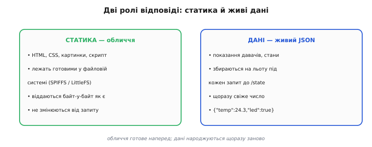

# Веб-сервер на МК

<preknowlist>
- [Сокети TCP](topic:programming/sockets-tcp-udp) — надійна «труба», якою дві програми по черзі перекидають потік байтів одна одній.
- [Архітектура ESP32](topic:programming/esp32-architecture) — копійчаний чіп із Wi-Fi-радіо просто в кристалі, що сам під'єднується до мережі.
</preknowlist>

Уяви розумну розетку чи давач температури в кутку кімнати. Хочеться зайти на неї з телефона: глянути показання, перемкнути світло, задати, до якої Wi-Fi-мережі під'єднатися. Перша думка — «треба написати застосунок під телефон». Але є простіший шлях, і він майже задарма: хай **сам пристрій віддає веб-сторінку**. Тоді на телефоні ставити нічого не треба — відкриваєш браузер, який і так є в кожному телефоні й комп'ютері, набираєш адресу пристрою, і він показує свою сторінку з кнопками й цифрами.

Те, що це вможливлює, зветься **веб-сервер** (англ. *web* — «павутина», *server* — «той, що подає, обслуговує»): програма, яка слухає запити по мережі й віддає у відповідь сторінки та дані. Незвично тут те, що сервером стає не велика машина в дата-центрі, а чіп завбільшки з ніготь. Той самий [ESP32, що має радіо просто в кристалі](topic:programming/esp32-architecture), цілком тягне цю роль: під'єднується до мережі сам і сам віддає браузерові сторінку. Жодного сервера в інтернеті для цього не треба — **пристрій і є сервер**.


*Суть веб-сервера на мікроконтролері. Ліворуч — браузер чи телефон: вводиш адресу пристрою (часто щось на кшталт 192.168.4.1), клікаєш кнопки. Праворуч — сам ESP32: він водночас і пристрій, і веб-сервер. Браузер шле запит «дай мені сторінку», МК збирає відповідь і віддає назад. Сервера десь в інтернеті немає: усе крутиться в самому чипі.*

### Що робить сервер: слухає й відповідає

Браузер і сервер розмовляють умовною мовою — **HTTP** (англ. *HyperText Transfer Protocol* — «протокол передавання гіпертексту»). Це проста текстова домовленість: браузер шле рядок-прохання «дай мені те, що лежить за адресою `/`», а сервер відповідає рядком стану («все гаразд») і тілом — самою сторінкою. HTTP не передає байти сам — він лежить **поверх з'єднання**, яке тримають [сокети TCP](topic:programming/sockets-tcp-udp): сокет несе потік байтів без втрат і по порядку, а HTTP лише домовляється, **що саме** в тому потоці написано.

У глибині будь-який веб-сервер — хоч на МК, хоч на велетенській машині — робить одне коло знов і знов. Він **слухає** мережу; коли запит приходить, читає з нього два головні слова — **метод** і **шлях**; за ними знаходить, що робити; виконує це й **пише відповідь** назад у те саме з'єднання. Потім чекає наступного запиту.

Розберімо ці два слова. **Шлях** — те, що йде після адреси пристрою: у `192.168.4.1/state` шлях — це `/state`; він каже, **до чого саме** звертається браузер (до головної сторінки `/`, до показань `/state`, до перемикача `/led`). **Метод** — це **намір**: `GET` означає «дай, я хочу прочитати», а `POST` — «на тобі дані, зміни щось». Пара «метод + шлях» повністю визначає, чого від сервера хочуть. Сервер тримає простий список відповідностей «(метод, шлях) → функція» і, отримавши запит, кличе ту функцію, що збіглася; такий список звуть **таблицею маршрутів**, а прив'язану до шляху функцію — **обробником** (англ. *handler* — «той, що обробляє, дає раду»). Уся «поведінка» пристрою зведена до кількох коротких обробників: один малює сторінку, другий віддає числа, третій приймає накази.

Добра новина для того, хто пише прошивку: усю чорну роботу — сокети й розбір HTTP-тексту — бере на себе готова бібліотека-сервер. Твоє завдання звужується до одного: сказати, **що відповідати** на кожен шлях.

### Дві ролі відповіді: обличчя і дані

Те, що сервер віддає, ділиться на дві геть різні за природою речі, і змішувати їх не варто. Перша — **статика**: «обличчя» пристрою, тобто сама HTML-сторінка з оформленням (CSS) і скриптом. Це готовий текст, який **не міняється від запиту**: яку кнопку не тисни, розмітка сторінки лишається тою самою. Тому статику не складають щоразу заново — її **зберігають готовою** у файлах на чипі й віддають байт-у-байт, як є.

Друга — **живі дані**: показання давача, стан перемикача, поточний час. Це число, яке **щоразу інше**: спитав температуру зараз — одна, за хвилину — інша. Такі дані не покладеш у файл наперед; їх збирають **на льоту** під кожен запит і віддають не цілою сторінкою, а короткою порцією — найчастіше у форматі **JSON** (англ. *JavaScript Object Notation* — «запис об'єктів так, як їх пише мова JavaScript»): простий текст із пар «назва: значення», який однаково легко читають і скрипт у браузері, і будь-яка інша програма.


*Дві ролі відповіді. Ліворуч — статика: HTML, CSS, скрипт; лежить готовою у пам'яті чипа й віддається незмінною. Праворуч — живі дані: показання, що збираються на льоту під кожен запит до `/state` і повертаються коротким JSON на кшталт `{"temp":24.3}`. Обличчя пристрою готують наперед; його дані народжуються щоразу заново.*

Зв'язує ці дві ролі маленький скрипт усередині сторінки. Браузер один раз завантажує статику (обличчя), а далі скрипт **сам** раз на секунду стукає на `/state`, дістає свіжий JSON і оновлює цифри на екрані — сторінка ніби оживає, хоч її розмітку завантажили лише раз. Так пристрій економить найдорожче, що в нього є: важку сторінку він гонить по мережі **один раз**, а потім — лише крихітні порції чисел.

### Робочий приклад: сторінка й JSON на ESP32

Складімо все докупи на справжньому коді. Візьмемо рідний для ESP32 фреймворк **ESP-IDF** і його вбудований сервер `esp_http_server`. Пристрій віддаватиме головну сторінку на `GET /`, а на `GET /state` — температуру як JSON. Уся суть — у реєстрації двох обробників, тобто в заповненні таблиці маршрутів двома рядками.

**Умова: на ESP32 (Wi-Fi уже піднято, IP отримано) запустити HTTP-сервер, який на `GET /` віддає коротку HTML-сторінку, а на `GET /state` — поточну температуру у форматі JSON.**

```cpp
#include "esp_http_server.h"   // вбудований сервер ESP-IDF

// 1) Обробник головної сторінки: віддаємо готовий HTML (статику).
static esp_err_t home_get(httpd_req_t *req)
{
    const char *page =
        "<!DOCTYPE html><html><body>"
        "<h2>Мій пристрій</h2>"
        "<p>Температура: <span id='t'>--</span> °C</p>"
        "<script>"
        "setInterval(async()=>{"                 // раз на секунду питаємо /state
        "  let r=await fetch('/state');"
        "  let d=await r.json();"
        "  document.getElementById('t').textContent=d.temp;"
        "},1000);"
        "</script></body></html>";

    httpd_resp_set_type(req, "text/html");       // кажемо браузеру: це сторінка
    httpd_resp_sendstr(req, page);               // віддаємо тіло
    return ESP_OK;
}

// 2) Обробник даних: збираємо свіже показання й віддаємо JSON.
static esp_err_t state_get(httpd_req_t *req)
{
    float temp = read_temperature();             // реальне читання давача
    char json[64];
    snprintf(json, sizeof(json), "{\"temp\":%.1f}", temp);   // {"temp":24.3}

    httpd_resp_set_type(req, "application/json");   // кажемо: це дані, не сторінка
    httpd_resp_sendstr(req, json);
    return ESP_OK;
}

// 3) Запускаємо сервер і РЕЄСТРУЄМО обидва маршрути в таблиці.
httpd_handle_t start_web_server(void)
{
    httpd_config_t cfg = HTTPD_DEFAULT_CONFIG();
    httpd_handle_t server = NULL;
    if (httpd_start(&server, &cfg) != ESP_OK) return NULL;

    httpd_uri_t home  = { .uri="/",      .method=HTTP_GET, .handler=home_get  };
    httpd_uri_t state = { .uri="/state", .method=HTTP_GET, .handler=state_get };

    httpd_register_uri_handler(server, &home);   // рядок таблиці: GET / → home_get
    httpd_register_uri_handler(server, &state);  // рядок таблиці: GET /state → state_get
    return server;
}
```

`httpd_start` піднімає сам сервер — відкриває TCP-сокет і починає крутити ту саму петлю «прийми запит → знайди обробник → відповідай». Два виклики `httpd_register_uri_handler` заповнюють таблицю маршрутів: `GET /` прив'язано до `home_get`, `GET /state` — до `state_get`. Далі працюють самі обробники: `home_get` віддає **статику** з типом `text/html`, а `state_get` щоразу читає свіже показання, складає стрічку `{"temp":24.3}` і віддає її з типом `application/json` — тепер браузер знає, що це не сторінка, а дані для скрипта. А скрипт усередині сторінки щосекунди сам стукає на `/state` через `fetch` і оновлює число на екрані. Зверни увагу, чого тут **немає**: жодного ручного копирсання в сокетах, жодного розбору HTTP-рядків руками — усе це сховане в бібліотеці, від нас лише таблиця маршрутів і короткі функції, що вирішують, **що** відповідати.

### Локальний пульт, а не майданчик для світу

Одну межу варто знати одразу, бо спокуса «в мене ж є сервер, виставлю його в інтернет» веде просто в халепу. Чіп за кілька доларів — не дата-центр: кожен відкритий браузер з'їдає сокет і шмат і так невеликої пам'яті, тож одночасних клієнтів на МК реально одиниці, не тисячі. Звідси проста дисципліна — сторінка має бути легка, а живі дані краще гнати дрібним JSON. І важливіше: звичайний HTTP передає все **відкритим текстом**, тож **виставляти такий сервер просто у відкритий інтернет не можна** — пароль, який ти вводиш у формі, було б видно наскрізь. Місце веб-сервера на МК — **довірена локальна мережа**: домашній Wi-Fi, до якого пристрій під'єднано, або власна точка доступу пристрою.

У цій ролі він безцінний. Це локальний пульт до конкретної речі: відкрив у домашній мережі сторінку пристрою, глянув показання, натиснув кнопку, налаштував Wi-Fi — і закрив. Один копійчаний чіп дає повноцінний інтерфейс із будь-якого телефона чи комп'ютера, **без жодного застосунку** — і саме тому веб-сервер став одним із найхарактерніших трюків [пристроїв на ESP32](topic:programming/esp32-architecture).

---
