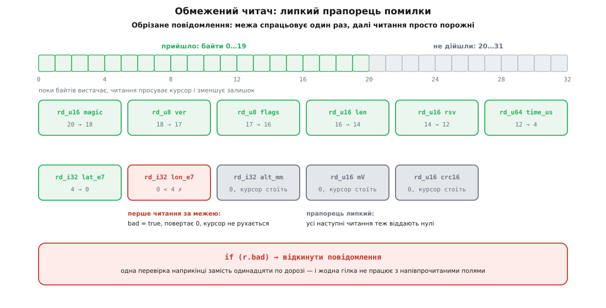

# ⚙️ Кодек телеметричного повідомлення на C: писар, читач і еталонний вектор

Тут зібрано кодек одного повідомлення цілком — тридцять два байти за таблицею формату, писар, читач, контрольна сума й тест, — щоб було видно не уривки, а весь шлях від полів структури до байтів у дроті й назад. Код нижче складається в один файл і компілюється як є (`-std=c11 -Wall -Wextra`); наприкінці стоїть еталонний вектор у шістнадцятковому вигляді — саме він, а не опис словами, є остаточним арбітром між двома реалізаціями.

## Завдання

Пристрій щосекунди відправляє позицію, висоту й напругу батареї. Приймач — інший процесор, інша мова, інший порядок байтів. Формат зафіксовано таблицею:

```
зсув  розмір  поле      тип       зміст
  0     2     magic     uint16    0xA5C3 — мітка «це наше повідомлення»
  2     1     ver       uint8     версія формату, поки 1
  3     1     flags     uint8     бітові ознаки стану
  4     2     len       uint16    довжина ВСЬОГО повідомлення = 32
  6     2     rsv       uint16    нулі, місце під майбутнє поле
  8     8     time_us   uint64    мікросекунди від увімкнення
 16     4     lat_e7    int32     широта × 10⁷ градуса
 20     4     lon_e7    int32     довгота × 10⁷ градуса
 24     4     alt_mm    int32     висота відносно точки зльоту, мм
 28     2     mV        uint16    напруга батареї, мілівольти
 30     2     crc16     uint16    контрольна сума над байтами 0…29
```

Усі багатобайтові поля — старшим байтом уперед. Координата в десятимільйонних частках градуса — те саме кодування, що в MAVLink: цілий тип замість `float` дає точність близько сантиметра при однозначному поданні й без питань про заокруглення.

## Ідея: два курсори, одна перевірка, липка помилка

Кодек будується не як набір присвоєнь за зсувами, а як два маленькі курсори — **писар** і **читач**. Кожен тримає три речі: де стоїть, скільки байтів лишилося, і чи вже сталася біда. Уся арифметика меж живе в одній-єдиній функції на курсор; решта — тонкі обгортки, які просто розкладають число на байти.

Звідси три властивості, яких простий набір присвоєнь за зсувами не дає.

Перша — **межу неможливо забути**. Не існує способу записати поле, обійшовши перевірку: щоб отримати місце під байти, треба спитати курсор, а він відповідає або покажчиком, або відмовою.

Друга — **помилка липка**. Щойно курсор пішов за межу, він піднімає прапорець і більше нічого не рухає: усі подальші читання повертають нулі, усі подальші записи нічого не пишуть. Тому перевіряти доводиться один раз наприкінці, а не після кожного поля.

Третя — **зсуви не пишуть руками**. Кожне поле стає туди, куди його поставив попередній запис. Зсуви з таблиці існують лише як константи для перевірок, і саме тому їх можна звірити на етапі компіляції.


*Прийшло 20 байтів із 32. Шість перших читань проходять, `lat_e7` забирає останні чотири байти, `lon_e7` уже не має чого читати — прапорець піднято. Далі курсор не рухається взагалі, а розбір закінчується одним `if`.*

> 🔧 **Навіщо це.** Класична вада саморобного розбору — перевірка після кожного поля. Її пишуть на перших трьох полях, а на дев'ятому забувають, і саме дев'яте стає дірою. Липкий прапорець прибирає спокусу: після нього код розбору читається як пряма послідовність полів, без жодного `if` між ними, і при цьому не має жодного шляху вийти за буфер.

## Специфікація в коді

Спершу — константи. Зсуви не набирають числами: кожен виводиться з попереднього, а числа з таблиці стоять окремо, у перевірках.

```c
#include <stdint.h>
#include <stddef.h>
#include <stdbool.h>
#include <string.h>
#include <limits.h>

enum {
    TELEM_MAGIC = 0xA5C3,
    TELEM_VER   = 1,

    OFF_MAGIC = 0,
    OFF_VER   = OFF_MAGIC + 2,
    OFF_FLAGS = OFF_VER   + 1,
    OFF_LEN   = OFF_FLAGS + 1,
    OFF_RSV   = OFF_LEN   + 2,
    OFF_TIME  = OFF_RSV   + 2,
    OFF_LAT   = OFF_TIME  + 8,
    OFF_LON   = OFF_LAT   + 4,
    OFF_ALT   = OFF_LON   + 4,
    OFF_MV    = OFF_ALT   + 4,
    OFF_CRC   = OFF_MV    + 2,
    TELEM_SIZE = OFF_CRC  + 2
};

/* Таблиця формату як перевірка, а не як коментар. */
_Static_assert(OFF_LEN  ==  4, "len стоїть на зсуві 4");
_Static_assert(OFF_TIME ==  8, "time_us стоїть на зсуві 8");
_Static_assert(OFF_LAT  == 16, "lat_e7 стоїть на зсуві 16");
_Static_assert(OFF_CRC  == 30, "контрольна сума — два останні байти");
_Static_assert(TELEM_SIZE == 32, "повідомлення — рівно 32 байти");

/* Природне вирівнювання: кожне поле на зсуві, кратному своєму розміру. */
_Static_assert(OFF_TIME % 8 == 0, "64-бітне поле — на кратному 8");
_Static_assert(OFF_LAT % 4 == 0 && OFF_LON % 4 == 0 && OFF_ALT % 4 == 0,
               "32-бітні поля — на кратних 4");
_Static_assert(OFF_MV % 2 == 0 && OFF_CRC % 2 == 0,
               "16-бітні поля — на кратних 2");

/* Припущення кодека про платформу. */
_Static_assert(CHAR_BIT == 8, "кодек припускає восьмибітний байт");
_Static_assert(sizeof(float) == 4, "f32 має бути чотирибайтним");
```

Ці рядки нічого не коштують у машинному коді й нічого не роблять у роботі — вони [ламають збирання](book:programming/static-assert), щойно хтось додасть поле посередині або переставить два рядки місцями. Перевірка часу компіляції — це твердження про програму, а не про її запуск: вона не вимагає тесту, який до неї дійде, і не мовчить на платформі, де її не запускали.

Останні дві перевірки варті окремої уваги: вони не про формат, а про **межі застосовності кодека**. Ширина байта й розмір `float` у C не гарантовані, і замість того щоб мовчки зламатися на дивному цільовому процесорі, кодек відмовиться збиратися. Ознака `__STDC_IEC_559__`, якщо платформа її оголошує, додатково означає, що біти `float` — це IEEE 754; без неї про кодування дробових доводиться домовлятися словами в специфікації.

## Писар

```c
typedef struct {
    uint8_t *p;     /* куди ляже наступний байт     */
    uint8_t *end;   /* за останнім байтом буфера    */
    bool     bad;   /* липко: місця не вистачило     */
} wr_t;

static void wr_init(wr_t *w, uint8_t *buf, size_t cap)
{
    w->p = buf; w->end = buf + cap; w->bad = false;
}

/* ЄДИНЕ місце, де кодек рахує межі. */
static uint8_t *wr_take(wr_t *w, size_t n)
{
    if (w->bad || (size_t)(w->end - w->p) < n) { w->bad = true; return NULL; }
    uint8_t *at = w->p;
    w->p += n;
    return at;
}
```

Порівняння написане саме так — `(end - p) < n`, а не `p + n > end` — і це не стилістика. Другий варіант спершу утворює покажчик за межами масиву, а це в C невизначена поведінка, навіть якщо його ніколи не розіменувати; на 32-бітних адресах з великим `n` він ще й може загорнутися й дати «правда, місця вистачає» на порожньому буфері. Різниця двох покажчиків усередині одного масиву визначена завжди й ніде не переповнюється, бо `p` за побудовою ніколи не переходить `end`.

Далі — самі поля. Кожне з них однакове до нудьги, і це добре:

```c
static void wr_u8(wr_t *w, uint8_t v)
{
    uint8_t *b = wr_take(w, 1);
    if (b) b[0] = v;
}

static void wr_u16(wr_t *w, uint16_t v)
{
    uint8_t *b = wr_take(w, 2);
    if (!b) return;
    b[0] = (uint8_t)(v >> 8);
    b[1] = (uint8_t)(v);
}

static void wr_u32(wr_t *w, uint32_t v)
{
    uint8_t *b = wr_take(w, 4);
    if (!b) return;
    b[0] = (uint8_t)(v >> 24);
    b[1] = (uint8_t)(v >> 16);
    b[2] = (uint8_t)(v >>  8);
    b[3] = (uint8_t)(v);
}

static void wr_u64(wr_t *w, uint64_t v)
{
    uint8_t *b = wr_take(w, 8);
    if (!b) return;
    for (int i = 0; i < 8; i++)
        b[i] = (uint8_t)(v >> (56 - 8 * i));
}

static void wr_i32(wr_t *w, int32_t v)
{
    wr_u32(w, (uint32_t)v);      /* зведення за модулем 2³² = доповняльний код */
}

static void wr_f32(wr_t *w, float f)
{
    uint32_t u;
    memcpy(&u, &f, sizeof u);    /* біти IEEE 754 як звичайне ціле */
    wr_u32(w, u);
}

/* Рядок: один байт довжини, далі стільки ж байтів UTF-8, без нуля в кінці. */
static void wr_str(wr_t *w, const char *s, size_t n)
{
    if (n > 255) { w->bad = true; return; }
    wr_u8(w, (uint8_t)n);
    uint8_t *b = wr_take(w, n);
    if (b && n) memcpy(b, s, n);
}
```

Три деталі, які легко проґавити.

`wr_i32` не робить нічого, окрім приведення: перетворення знакового в беззнакове визначено стандартом як зведення за модулем 2³², тобто −1250 стає 0xFFFFFB1E — рівно [доповняльний код](book:programming/twos-complement), рівно те, чого чекає приймач. Зворотний бік не такий безхмарний, і про нього — у читачі.

`wr_f32` ходить через `memcpy` не з обережності, а тому, що це єдиний спосіб у C законно подивитися на ті самі байти крізь інший тип: [правила аліасування](book:programming/strict-aliasing) забороняють читати `float` як `uint32_t` через приведення покажчика. Виклику функції тут не буде — компілятор із оптимізацією бачить фіксований розмір наскрізь.

`wr_str` перевіряє `n > 255` **до** будь-якої арифметики й ставить прапорець сам: інакше `(uint8_t)n` тихо обрізало б довжину, і в дріт пішло б повідомлення, де префікс каже одне, а байтів записано інше. І охорона `if (b && n)`: `memcpy` із нульовою довжиною й порожнім покажчиком формально невизначена, хоч практично й нешкідлива. Рядки в дроті — це байти [UTF-8](book:programming/ascii-utf8) із префіксом довжини, і довжина рахується саме в байтах, а не в символах.

## Читач

Дзеркальна пара, з однією відмінністю: там, де писар нічого не пише, читач віддає нуль.

```c
typedef struct {
    const uint8_t *p;
    const uint8_t *end;
    bool           bad;
} rd_t;

static void rd_init(rd_t *r, const uint8_t *buf, size_t n)
{
    r->p = buf; r->end = buf + n; r->bad = false;
}

static const uint8_t *rd_take(rd_t *r, size_t n)
{
    if (r->bad || (size_t)(r->end - r->p) < n) { r->bad = true; return NULL; }
    const uint8_t *at = r->p;
    r->p += n;
    return at;
}

static uint8_t rd_u8(rd_t *r)
{
    const uint8_t *b = rd_take(r, 1);
    return b ? b[0] : 0;
}

static uint16_t rd_u16(rd_t *r)
{
    const uint8_t *b = rd_take(r, 2);
    if (!b) return 0;
    return (uint16_t)(((uint32_t)b[0] << 8) | (uint32_t)b[1]);
}

static uint32_t rd_u32(rd_t *r)
{
    const uint8_t *b = rd_take(r, 4);
    if (!b) return 0;
    return ((uint32_t)b[0] << 24) | ((uint32_t)b[1] << 16)
         | ((uint32_t)b[2] <<  8) | ((uint32_t)b[3]);
}

static uint64_t rd_u64(rd_t *r)
{
    const uint8_t *b = rd_take(r, 8);
    if (!b) return 0;
    uint64_t v = 0;
    for (int i = 0; i < 8; i++) v = (v << 8) | b[i];
    return v;
}

static int32_t rd_i32(rd_t *r)
{
    uint32_t u = rd_u32(r);
    int32_t  v;
    memcpy(&v, &u, sizeof v);    /* ті самі біти, без залежності від редакції стандарту */
    return v;
}

static float rd_f32(rd_t *r)
{
    uint32_t u = rd_u32(r);
    float f;
    memcpy(&f, &u, sizeof f);
    return f;
}

/* Рядок віддаємо ПОКАЖЧИКОМ усередину буфера: нічого не копіюємо й не виділяємо.
   Це не C-рядок — завершального нуля в ньому нема. */
static bool rd_str(rd_t *r, const uint8_t **out, size_t *out_n)
{
    size_t n = rd_u8(r);
    const uint8_t *b = rd_take(r, n);
    *out = b; *out_n = b ? n : 0;
    return b != NULL;
}
```

Приведення `(uint32_t)b[0]` перед зсувом — не прикраса. Без нього `b[0]` за [правилами просування типів](book:programming/integer-promotion) стає звичайним знаковим `int`, і зсув на 24 для будь-якого байта від 0x80 переповнює знаковий тип — тобто [невизначена поведінка](book:programming/undefined-behavior) на цілком робочих даних. Компілятор мовчить, а оптимізатор має право припустити, що такого не буває. Байт, зведений до `uint32_t`, зсувається однозначно.

`rd_i32` копіює біти замість приведення `(int32_t)u`. Приведення беззнакового в знаковий, коли значення не влазить у знаковий діапазон, у C лишається визначеним реалізацією; фактично всі компілятори роблять очевидне, але кодек протоколу — не те місце, де варто спиратися на «фактично всі». Копія бітів дає доповняльний код за побудовою й після оптимізації не коштує жодної команди.

І головне про `rd_str`: він повертає покажчик **усередину прийомного буфера**. Це найдешевший розбір з можливих — нуль виділень пам'яті, нуль копіювань, — але він накладає обов'язок: розібраний рядок живий рівно доти, доки живий буфер. Якщо ім'я треба зберегти надовго, його копіюють явно, і саме тут, а не всередині кодека.

## Контрольна сума

Беремо CRC-16/IBM-3740: ширина 16, многочлен 0x1021, початкове значення 0xFFFF, без відображення бітів, без завершального XOR. Каталог параметризованих CRC (RevEng) подає для нього псевдоніми CRC-16/CCITT-FALSE і CRC-16/AUTOSAR — під ними його й зустрічають у бібліотеках, — і контрольне значення 0x29B1 на рядку `"123456789"`. Ця одна константа й перевіряє реалізацію: під назвою «CRC-CCITT» ходить щонайменше чотири різні алгоритми, і сплутати їх легше, ніж помилитися в коді.

```c
static uint16_t crc16(const uint8_t *d, size_t n)
{
    uint16_t crc = 0xFFFF;
    for (size_t i = 0; i < n; i++) {
        crc ^= (uint16_t)((uint16_t)d[i] << 8);
        for (int k = 0; k < 8; k++)
            crc = (crc & 0x8000u) ? (uint16_t)((crc << 1) ^ 0x1021u)
                                  : (uint16_t)(crc << 1);
    }
    return crc;
}
```

Це побітовий варіант: вісім операцій на байт, нуль пам'яті. Для тридцяти байтів раз на секунду цього досить із величезним запасом; там, де байтів тисячі, ту саму суму рахують за таблицею на 256 записів — один пошук на байт коштом півкілобайта сталої пам'яті, або за таблицею на 16 записів — два пошуки на байт коштом тридцяти двох байтів. Числа не змінюються від способу: [контрольна сума](book:programming/crc-in-firmware) визначена многочленом, а таблиця — лише спосіб порахувати те саме швидше.

Порядок один і той самий на обох боках: суму рахують над **усіма байтами повідомлення, крім двох останніх**, і записують у ці два останні. Приймач рахує над тим самим діапазоном і порівнює.

## Збирання й розбір повідомлення

```c
typedef struct {
    uint64_t time_us;
    int32_t  lat_e7, lon_e7, alt_mm;
    uint16_t mv;
    uint8_t  flags;
} telem_t;

/* Повертає кількість записаних байтів або 0, якщо не влізло. */
static size_t telem_encode(uint8_t *buf, size_t cap, const telem_t *t)
{
    wr_t w;
    wr_init(&w, buf, cap);

    wr_u16(&w, TELEM_MAGIC);
    wr_u8 (&w, TELEM_VER);
    wr_u8 (&w, t->flags);
    wr_u16(&w, TELEM_SIZE);      /* len — довжина ВСЬОГО повідомлення */
    wr_u16(&w, 0);               /* rsv — завжди нулі */
    wr_u64(&w, t->time_us);
    wr_i32(&w, t->lat_e7);
    wr_i32(&w, t->lon_e7);
    wr_i32(&w, t->alt_mm);
    wr_u16(&w, t->mv);

    if (w.bad) return 0;         /* ← не косметика, див. нижче */

    wr_u16(&w, crc16(buf, OFF_CRC));
    return w.bad ? 0 : TELEM_SIZE;
}
```

Ранній вихід перед підрахунком суми — єдине місце в писарі, де перевірка стоїть посеред роботи, і вона там обов'язкова. `crc16(buf, OFF_CRC)` читає тридцять байтів. Якщо буфер був коротший і писар зупинився на середині, ці тридцять байтів просто не існують — сума порахувалася б над чужою пам'яттю. Прапорець `bad` тут не про правильність результату, а про право взагалі торкатися буфера.

```c
typedef enum {
    TELEM_OK = 0,
    TELEM_SHORT,        /* байтів менше, ніж вимагає формат */
    TELEM_MAGIC_BAD,
    TELEM_VER_BAD,
    TELEM_LEN_BAD,
    TELEM_CRC_BAD
} telem_err_t;

static telem_err_t telem_decode(const uint8_t *buf, size_t n, telem_t *out)
{
    if (n < TELEM_SIZE) return TELEM_SHORT;   /* до першого читання */

    rd_t r;
    rd_init(&r, buf, TELEM_SIZE);   /* читаємо рівно своє, а не «скільки прийшло» */

    uint16_t magic = rd_u16(&r);
    uint8_t  ver   = rd_u8 (&r);
    uint8_t  flags = rd_u8 (&r);
    uint16_t len   = rd_u16(&r);
    (void)rd_u16(&r);               /* rsv — читаємо, щоб просунути курсор */

    if (magic != TELEM_MAGIC) return TELEM_MAGIC_BAD;
    if (ver   != TELEM_VER)   return TELEM_VER_BAD;
    if (len   != TELEM_SIZE)  return TELEM_LEN_BAD;

    uint16_t want = (uint16_t)(((uint32_t)buf[OFF_CRC] << 8) | buf[OFF_CRC + 1]);
    if (crc16(buf, OFF_CRC) != want) return TELEM_CRC_BAD;

    out->time_us = rd_u64(&r);
    out->lat_e7  = rd_i32(&r);
    out->lon_e7  = rd_i32(&r);
    out->alt_mm  = rd_i32(&r);
    out->mv      = rd_u16(&r);
    out->flags   = flags;

    return r.bad ? TELEM_SHORT : TELEM_OK;
}
```

Тут варто помітити три рішення.

Читач обмежують `TELEM_SIZE`, а не `n`. Якщо в буфері лежить кілька повідомлень поспіль, розбір усе одно не вийде за своє — а виділенням кадрів із потоку займається окремий шар, [кадрування](book:programming/tcp-message-framing).

Поле `len` **звіряють, а не слухають**. Читанням керує таблиця формату, `len` лише мусить із нею збігтися. Це головна різниця між «розібрати» і «зробити те, що сказали байти».

Суму перевіряють **до** того, як хоч одне змістове поле потрапить у `out`. Порядок тут важить: якщо спершу розкласти поля, а потім відхилити повідомлення, десь обов'язково знайдеться гілка, яка встигне подивитися на висоту з битого пакета. І фінальний `r.bad` не може спрацювати за нинішньої довжини — але він переживе редагування, коли до формату додадуть поле, а перевірку розміру забудуть підправити.

## Змінна частина: рядок і дробове

Резервне поле `rsv` існує не для краси. У другій версії формату воно стає `msg_id`, зсуви не рухаються, і в тому самому заголовку з'являється друге повідомлення — з ім'ям вузла й напругою в вольтах:

```c
enum {
    PROTO_VER_2 = 2,
    MSG_STATUS  = 2,
    OFF_MSGID   = OFF_RSV,                 /* колишній резерв */
    HDR_SIZE    = OFF_TIME + 8,            /* 16 */
    STATUS_MIN  = HDR_SIZE + 1 + 0 + 4 + 2 /* порожнє ім'я: 23 байти */
};

static size_t status_encode(uint8_t *buf, size_t cap, uint64_t time_us,
                            uint8_t flags, const char *name, size_t name_len,
                            float vbat_v)
{
    if (name_len > 255) return 0;              /* межа ДО арифметики */
    size_t total = STATUS_MIN + name_len;      /* ≤ 278 — переповнення неможливе */
    if (total > cap) return 0;

    wr_t w;
    wr_init(&w, buf, cap);
    wr_u16(&w, TELEM_MAGIC);
    wr_u8 (&w, PROTO_VER_2);
    wr_u8 (&w, flags);
    wr_u16(&w, (uint16_t)total);
    wr_u16(&w, MSG_STATUS);
    wr_u64(&w, time_us);
    wr_str(&w, name, name_len);
    wr_f32(&w, vbat_v);

    if (w.bad) return 0;
    wr_u16(&w, crc16(buf, total - 2));
    return w.bad ? 0 : total;
}

static bool status_decode(const uint8_t *buf, size_t n,
                          const uint8_t **name, size_t *name_len, float *vbat_v)
{
    if (n < STATUS_MIN) return false;
    size_t len = ((size_t)buf[OFF_LEN] << 8) | buf[OFF_LEN + 1];
    if (len < STATUS_MIN || len > n) return false;   /* ← ключовий рядок */

    uint16_t want = (uint16_t)(((uint32_t)buf[len - 2] << 8) | buf[len - 1]);
    if (crc16(buf, len - 2) != want) return false;

    rd_t r;
    rd_init(&r, buf, len - 2);              /* хвіст із сумою читати нічим */
    if (!rd_take(&r, HDR_SIZE)) return false;   /* заголовок уже перевірено вище */

    if (!rd_str(&r, name, name_len)) return false;
    *vbat_v = rd_f32(&r);
    return !r.bad;
}
```

Рядок `if (len < STATUS_MIN || len > n)` робить дві різні роботи одним виразом. Права половина не дає повірити чужому числу: заявлена довжина не може перевищувати кількість байтів, які справді прийшли. Ліва половина рятує наступний рядок — без неї `len - 2` для `len == 1` не дало б −1, а дало б величезне число, бо `size_t` беззнаковий і [загортається за модулем](book:programming/unsigned-overflow). Довжина, узята з дроту, стає безпечною лише після того, як її затиснули з обох боків.

## Круговий тест і еталонний вектор

```c
#include <stdio.h>

static const uint8_t TELEM_REF[TELEM_SIZE] = {
    0xA5,0xC3, 0x01, 0x05, 0x00,0x20, 0x00,0x00,
    0x00,0x04,0x62,0xD5,0x3C,0x8A,0xBA,0xC0,
    0x1E,0x12,0x13,0x08,
    0x12,0x31,0x88,0x20,
    0xFF,0xFF,0xFB,0x1E,
    0x2E,0x42,
    0x03,0x87
};

int main(void)
{
    /* 0. Сама сума — за контрольним рядком каталогу. */
    if (crc16((const uint8_t *)"123456789", 9) != 0x29B1) return 1;

    const telem_t t = {
        .time_us = UINT64_C(1234567890123456),
        .lat_e7  =  504501000,   /* 50.4501° пн. ш. */
        .lon_e7  =  305236000,   /* 30.5236° сх. д. */
        .alt_mm  =      -1250,   /* 1.25 м НИЖЧЕ точки зльоту */
        .mv      =      11842,
        .flags   =       0x05
    };

    uint8_t buf[64];
    /* 1. Байт у байт із еталоном. */
    if (telem_encode(buf, sizeof buf, &t) != TELEM_SIZE)  return 2;
    if (memcmp(buf, TELEM_REF, TELEM_SIZE) != 0)          return 3;

    /* 2. Коло: розібране дорівнює зібраному. */
    telem_t back;
    if (telem_decode(buf, TELEM_SIZE, &back) != TELEM_OK) return 4;
    if (back.time_us != t.time_us || back.lat_e7 != t.lat_e7 ||
        back.lon_e7  != t.lon_e7  || back.alt_mm != t.alt_mm ||
        back.mv      != t.mv      || back.flags  != t.flags)  return 5;

    /* 3. Будь-який обрізок — відмова, а не падіння. */
    for (size_t k = 0; k < TELEM_SIZE; k++)
        if (telem_decode(buf, k, &back) == TELEM_OK)       return 6;

    /* 4. Один перекинутий біт у будь-якому місці — спіймано. */
    for (size_t i = 0; i < TELEM_SIZE; i++)
        for (int b = 0; b < 8; b++) {
            uint8_t spoiled[TELEM_SIZE];
            memcpy(spoiled, buf, TELEM_SIZE);
            spoiled[i] ^= (uint8_t)(1u << b);
            if (telem_decode(spoiled, TELEM_SIZE, &back) == TELEM_OK) return 7;
        }

    /* 5. Затісний буфер — нуль і жодного запису за межу. */
    uint8_t tiny[TELEM_SIZE - 1];
    if (telem_encode(tiny, sizeof tiny, &t) != 0)         return 8;

    puts("codec ok");
    return 0;
}
```

Ось ці тридцять два байти в шістнадцятковому вигляді — той самий еталон, розкладений по полях:

```
A5 C3        magic   = 0xA5C3
01           ver     = 1
05           flags   = 0b0000_0101
00 20        len     = 32
00 00        rsv     = 0
00 04 62 D5 3C 8A BA C0   time_us = 1234567890123456
1E 12 13 08  lat_e7  =  504501000  →  50.4501°
12 31 88 20  lon_e7  =  305236000  →  30.5236°
FF FF FB 1E  alt_mm  =      -1250  →  -1.250 м
2E 42        mV      =      11842  →  11.842 В
03 87        crc16   = 0x0387 над байтами 0…29
```

Це і є **специфікація, яку неможливо витлумачити двояко**. Опис словами кожен читає по-своєму; тридцять два конкретні байти — ні. Реалізація іншою мовою вважається сумісною тоді й лише тоді, коли з цих самих полів дає цю саму послідовність, і з цієї послідовності — ці самі поля. Від'ємна висота в еталоні стоїть навмисно: саме на ній ламаються реалізації, де знакове поле випадково закодували як беззнакове.

Другий вектор — повідомлення `STATUS` з іменем `esc1` і напругою 11.842 В (двадцять сім байтів):

```
A5 C3 02 05 00 1B 00 02      magic, ver=2, flags, len=27, msg_id=2
00 04 62 D5 3C 8A BA C0      time_us
04 65 73 63 31               довжина 4, байти "esc1"
41 3D 78 D5                  vbat_v = 11.842f  (біти IEEE 754)
AF 06                        crc16
```

Перевірка четверта — перекидання одного біта — проходить не випадково: CRC із многочленом, у якому більше одного члена, ловить **усі** однобітові помилки, бо сума лінійна, а многочлен однієї помилки на такий многочлен не ділиться. Перевірка третя цінна іншим: вона проганяє розбір по всіх довжинах від нуля до тридцяти одного, тобто по всіх точках, де писар чи читач могли б вийти за буфер. Це вже майже [фаззинг](book:programming/fuzzing) — а справжній фаззер на цьому кодеку варто запустити окремо, під `-fsanitize=address,undefined`, згодувавши йому випадкові байти й дивлячись не на результат, а на відсутність падінь.

## Складність і ціна

Збирання й розбір повідомлення сталого розміру — стала робота: тридцять записів або читань байтів. Контрольна сума — лінійна від довжини, вісім бітових кроків на байт у побітовому варіанті, один пошук у таблиці на байт у табличному. Пам'яті кодек не виділяє взагалі: обидва курсори — три поля на стеку, розбір рядка не копіює нічого.

Головне ж стосується не швидкодії, а страху перед нею. Ланцюжок зсувів і `memcpy` фіксованого розміру після `-O2` не лишають по собі ні викликів, ні циклів: у GCC є окремий прохід (`pass_optimize_bswap`), що впізнає складання числа з байтів як перестановку й замінює її однією командою — `bswap` на x86, `rev` на ARM; `memcpy` малого сталого розміру перетворюється на одне завантаження або збереження. Тобто «байт за байтом» — це опис вихідного тексту, а не машинного коду. Плата за правильність тут нульова, і в жодного профілювальника до неї не буває питань.

## Пастки, які цей код закриває

**Довіра до заявленої довжини.** Приймач читає `len`, і далі копіює або зчитує стільки, скільки там написано. Байти прийшли ззовні — а отже, число теж прийшло ззовні. Ліки одні: `len` спершу звіряють із тим, скільки байтів справді є (`len > n` — відмова), і лише потім використовують. Пропущена саме ця перевірка колись [дала світові Heartbleed](book:programming/buffer-overflow-security): запитувана довжина відповіді була більша за отримані дані, і в мережу поїхала суміжна пам'ять процесу.

**Часткове повідомлення.** У потоці межі повідомлень не зберігаються, тож «прийшло 20 байтів із 32» — не аварія, а звичайний вівторок. Кодек має відповісти на це відмовою й нічого не зіпсувати: перевірка `n < TELEM_SIZE` до першого читання плюс липкий прапорець дають рівно це. Зібрати повний кадр — робота шару вище.

**Переповнення при обчисленні меж.** Три способи промахнутися одним виразом: `p + n > end` утворює покажчик за межами масиву; `off + n > size` завертається, якщо `off` чи `n` прийшли з дроту; `len - 2` завертається знизу для `len < 2`. Правильні форми не додають, а віднімають від відомого: `(end - p) < n`, `size - off < n`, і затиснута знизу довжина перед будь-яким відніманням. Правило просте — **арифметика над числами з дроту небезпечна доти, доки числа не затиснуто з обох боків**.

**Страх перед байтовим кодуванням.** Найпоширеніша «оптимізація» — покласти на буфер структуру й читати поля напряму. Вона одночасно ламає переносність розкладки, ігнорує порядок байтів і припускає вирівнювання, якого прийомний буфер не обіцяв. При цьому вона нічого не виграє: після оптимізації правильний код згортається в ті самі одну-дві команди. Швидкість тут не конкурує з правильністю — конкурує звичка.
