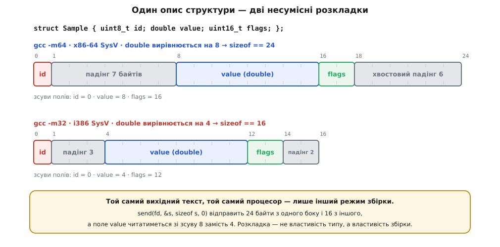
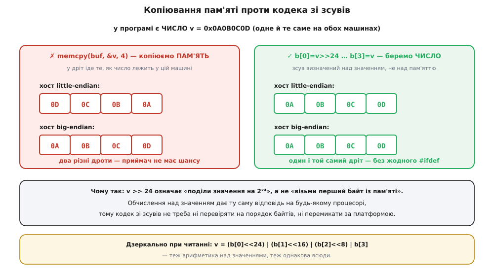

# Пакування бінарного протоколу: вирівнювання й порядок байтів

<preknowlist>
- [Біти й порядок байтів](book:programming/bits-bytes-endianness) — що таке байт і що означає покласти багатобайтове число старшим або молодшим байтом уперед.
- [Вирівнювання даних у пам'яті](book:programming/memory-alignment) — чому адреса поля має бути кратною його розміру і звідки в структурі беруться порожні байти.
- [Адреси й покажчики](book:programming/addresses-pointers) — адреса, взяття адреси змінної, приведення типу покажчика.
- [Сокети TCP/UDP](book:programming/sockets-tcp-udp) — сокет приймає й віддає послідовність байтів, а не об'єкти програми.
</preknowlist>

Два пристрої мають обмінятися вимірами. В обох програмах лежить однаковий опис даних, тож напрошується найкоротший шлях: узяти адресу структури й віддати її байти в сокет.

```c
struct Sample { uint8_t id; double value; uint16_t flags; };

struct Sample s = { .id = 7, .value = 21.5, .flags = 0x0100 };
send(fd, &s, sizeof s, 0);            /* ← спокуса */
```

Поки обидва кінці зібрано тим самим компілятором під ту саму машину, це працює бездоганно — і тому спокійно доживає до продукту. Ламається воно тоді, коли на другому кінці з'являється інша машина. І ламається трьома незалежними способами, які легко сплутати між собою.

### Три речі, які за вас вирішує платформа

**Скільки байтів займає поле.** Стандарт C не каже, чи `long` — це чотири байти, чи вісім: на 64-бітному Linux вісім, на 64-бітному Windows чотири. Знаковість голого `char` теж не задана: на x86-Linux він знаковий, на ARM — беззнаковий, тож записане в нього 200 на другому кінці прочитається як −56. Ліки дешеві й безумовні: у полях, що йдуть у мережу, вживають лише [типи фіксованої ширини](book:programming/integer-types-c) — `uint8_t`, `int16_t`, `uint32_t`, `int64_t` з `<stdint.h>`. Ані `long`, ані `char`, ані `enum`, `bool`, `size_t` чи покажчик в описі формату не фігурують ніколи.

**Де саме всередині структури починається кожне поле.** Процесор читає число швидше з адреси, кратної розміру числа, тому компілятор зсуває поля вперед і лишає між ними порожні байти-заповнювачі — падінг (англ. *padding* — набивка). Скільки їх і де вони стоять, вирішує не мова, а угода платформи про машинне подання типів — [ABI](book:programming/abi-calling-convention). Найяскравіший приклад: `double` у 64-бітній угоді x86 вимагає адреси, кратної восьми, а в 32-бітній — кратної лише чотирьом. Та сама структура з початку статті, зібрана `gcc -m64` і `gcc -m32` на одному ноутбуці, важить 24 і 16 байтів, а поле `value` починається зі зсуву 8 в одному випадку і зі зсуву 4 в другому.


*Той самий вихідний текст структури розкладається по-різному залежно від угоди платформи: зсуви полів 0/8/16 проти 0/4/12 і розмір 24 проти 16 байтів. Розкладка — властивість не типу, а збірки.*

Гірше, що вміст цих порожніх байтів невизначений — так прямо сказано в стандарті. Якщо заповнити тільки поля й відправити структуру цілком, у дірки поїде те, що лежало в тій пам'яті до вас. Це справжній клас вразливостей: у ядрі Linux такі витоки знаходять щороку по кілька і латають однаково — повним занулюванням структури перед заповненням. Заразом невизначені байти ламають геш і [контрольну суму](book:programming/crc-in-firmware), пораховані по сирій структурі: однакові дані дають різні байти.

**У якому порядку лежать байти всередині одного числа.** Число `0x0A0B0C0D` займає чотири байти, і машина має право покласти їх від старшого до молодшого або навпаки; обидва порядки однаково законні. Мережеві протоколи розв'язали суперечку призначенням: у документації інтернет-протоколів числа малюють старшим байтом ліворуч, і саме такий порядок звуть мережевим.

### `#pragma pack(1)` переносить проблему, а не знімає її

Природна перша реакція — наказати компілятору не лишати дірок. Розмір справді стає однаковим усюди, дірок нема. Але з трьох каналів розбіжності закрито рівно один: ширина типів і порядок байтів лишаються такими, як вирішила платформа.

А натомість з'являється новий клопіт. Упаковане поле стоїть за адресою, яка не задовольняє його вимогу вирівнювання, тому взяття адреси такого поля дає покажчик-брехню: `double *p = &s.value;` за правилами мови обіцяє вирівняну адресу, а насправді її не має. Розіменування такого покажчика — [невизначена поведінка](book:programming/undefined-behavior), і компілятори за неї попереджають окремим повідомленням `-Waddress-of-packed-member`. Наслідок залежить від процесора: x86 прочитає мовчки й трохи повільніше, а Cortex-M0 дасть апаратний виняток. Прошивка падає там, де на ноутбуці все зелене.

> 🔧 **Навіщо це.** Упаковані структури не заборонені — вони доречні там, де ви керуєте обома кінцями й одним компілятором: регістри пристрою, апаратний дескриптор, дзеркало флеш-сектора. Ознака, що межу перейдено, проста: щойно байти виходять за межі процесу, машини чи мови, упакована структура перестає бути описом формату.

### Формат — це таблиця байтів, а не тип мови

Вихід починається зі зміни того, що ви вважаєте описом протоколу. Структура в пам'яті — приватна справа програми: як їй зручніше тримати дані в себе. Формат передавання (англ. *wire format* — «формат у дроті») — публічний контракт: таблиця, у якій для кожного поля вказано зсув, розмір, спосіб кодування й одиниці. Між ними стоїть код, що переводить одне в друге, — кодувальник і розкодувальник, або коротко кодек.

Уся сила в тому, що зсув **записано в таблиці**, а не порахує компілятор. Щойно так — розкладка перестає залежати від ABI, від ширини типів і навіть від мови: приймач на Go читатиме те саме, що передавач на C. Саме ця відв'язка робить [серіалізацію](book:programming/data-serialization) окремою дисципліною з власними форматами й генераторами коду.

Практично специфікація виглядає як табличка на кілька рядків:

```
зсув  розмір  поле       кодування
   0       2  magic      0xA75E, старший байт першим
   2       1  ver        версія формату, зараз 2
   3       1  flags      бітові ознаки
   4       2  len        довжина тіла в байтах, старший байт першим
   6       2  rsv        резерв, передавати нулями
   8       8  time_us    мікросекунди від старту, беззнакове
```

Ніде тут нема слова «структура». Є шістнадцять іменованих байтів — і скласти їх уміє будь-яка мова.

### Зсуви замість копіювання пам'яті

Лишається закодувати саме число. Звична бібліотечна відповідь `htonl()` розв'язує задачу наполовину: вона є лише для 16 і 32 бітів і змушує тримати в голові, у якому поданні змінна перебуває просто зараз. Прийом кращий і напрочуд простий:

```c
buf[0] = (uint8_t)(v >> 24);
buf[1] = (uint8_t)(v >> 16);
buf[2] = (uint8_t)(v >>  8);
buf[3] = (uint8_t)(v);
```

Тут нема жодної перевірки платформи, і не випадково. Оператор `>>` у C визначено над **значенням**, а не над пам'яттю: `v >> 24` означає «поділи значення на 2²⁴ і відкинь дробову частину», і відповідь однакова на будь-якому процесорі, бо це арифметика, а не погляд у байти. Присвоєння в `uint8_t` лишає тільки молодші вісім бітів. Отже, рядок `buf[0] = v >> 24` каже буквально: «у нульовий байт покласти найстарший байт **числа**» — це твердження про формат, а не про машину. Читання дзеркальне: `v = ((uint32_t)b[0] << 24) | ((uint32_t)b[1] << 16) | ((uint32_t)b[2] << 8) | b[3]`, причому приведення до `uint32_t` тут обов'язкове — без нього зсув відбувся б у знаковому `int` і переповнив його.


*Ліворуч — копіювання вмісту пам'яті: у дріт іде те, як число лежить у цій конкретній машині, тож два хости дають два різні потоки байтів. Праворуч — той самий обмін через зсуви: обчислення над значенням дає однаковий результат усюди, тому кодек не містить жодної перевірки порядку байтів.*

У такому кодеку просто немає поняття «порядок байтів хоста»: його ніде не питають, отже ніде й не можуть помилитися. Ціна — нуль: із оптимізацією компілятор упізнає цей шаблон і згортає чотири присвоєння в одну машинну команду там, де процесор уміє переставляти байти.

### На прийомі покажчик не приводять

Найспокусливіший рядок на прийомі — `const struct Header *h = (const struct Header *)buf;`. Тут дві помилки одразу. Перша вже відома: розкладка структури не зобов'язана збігатися з таблицею, та й порядок байтів усередині поля не той. Друга — вирівнювання самого буфера: покажчик на структуру обіцяє адресу, кратну її вирівнюванню, а `buf` такої обіцянки не дає. Найчастіше буфер приходить зі зсувом: заголовок Ethernet займає 14 байтів, тож 32-бітне поле IP-адреси всередині наступного заголовка лягає на зсув 26, який на чотири не ділиться. Правильний прийом — читати байтами або через `memcpy` у локальну змінну, і це не повільніше: `memcpy` фіксованого малого розміру компілятор замінює на одну команду завантаження.

Байти на прийомі приходять від когось стороннього — навіть у службовій мережі без зловмисників це може бути пристрій із іншою прошивкою або обірваний кадр. Тому розкодувальник — не просто набір зсувів, а обмежений читач: покажчик, залишок байтів і прапорець помилки, у якого кожне читання спершу питає, чи є ще стільки байтів. Найчастіша діра — довіра до поля довжини: приймач читає `len` і копіює стільки, скільки там написано, не звіривши з тим, скільки байтів насправді прийшло. Це рівно [той клас вразливостей, що зробив ім'я Heartbleed](book:programming/buffer-overflow-security). І окремо: у TCP межі повідомлень не зберігаються, тож перед розбором стоїть [кадрування](book:programming/tcp-message-framing) — пакування описує, що всередині кадру, а кадрування — де кадр починається й де закінчується.

### Кілька рішень, ухвалених наперед

Якщо укласти поля від більших до менших, кожне само собою стане на зсув, кратний своєму розміру, — так робить генератор MAVLink, сортуючи поля повідомлення за розміром. Місце під майбутнє розширення описують явним іменованим полем резерву, що передається нулями: тоді нове поле займе рівно його місце, а зсуви наявних полів не зрушать і старий приймач читатиме своє. Байт версії в заголовку коштує нічого, а без нього перша ж несумісна зміна стає археологією. Нові поля дописують лише в хвіст, старі не чіпають, а приймач мовчки ігнорує хвіст, якого не знає.

Тримати код і таблицю разом допомагають еталонні вектори: рядок шістнадцяткових байтів, знятий із перевіреної реалізації, з яким тест звіряє результат байт у байт. Тест «закодували й розкодували назад» цього не замінює — він сліпий до помилки, зробленої однаково в обидва боки.

---

Спільна нитка тут не про байти. Розкладка структури — домовленість між вами й вашим компілятором: ви обидва в одному процесі й порушити її нема кому. Формат передавання — домовленість із кимось, кого ви не контролюєте: іншим компілятором, іншим процесором, іншою мовою, іноді іншою людиною зі своїми намірами. Тому кожен байт у ньому названий, кожне число закодоване правилом, яке не питає про машину, а кожне читання перевірене межами.
