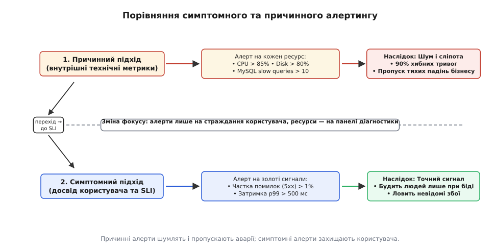
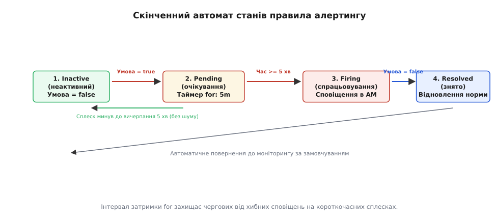
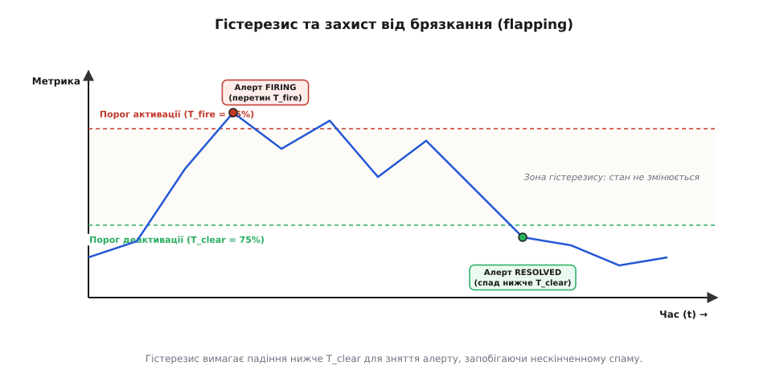
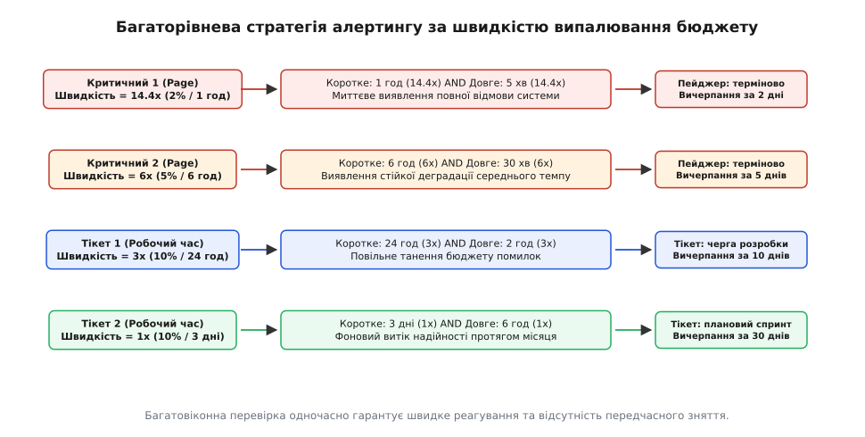
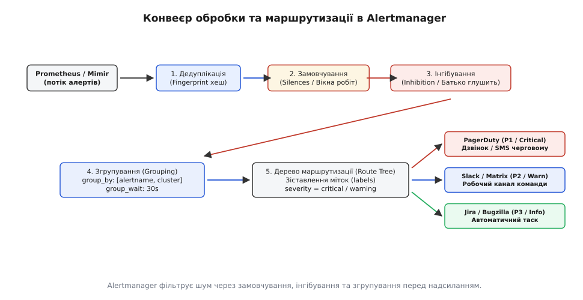

# Алерти

<preknowlist>
- [Метрики](topic:programming/metrics-monitoring) — числовий збір показників продуктивності, затримок та частоти помилок у режимі реального часу.
- [SLI/SLO/SLA](topic:programming/slo-sli-sla) — цілі рівня обслуговування, індикатори якості та поняття бюджету помилок.
- [Структуровані логи](topic:programming/structured-logging) — машинночитні записи подій у форматі ключ-значення для аналізу контексту збоїв.
- [Реагування на інциденти](topic:programming/incident-response) — протокол взаємодії інженерної команди під час аварій на продакшені.
</preknowlist>

Уяви масштабний розпродаж у великому інтернет-магазині: кластер із двохсот серверів обслуговує понад 20 000 запитів щосекунди. Раптово у фоновому сервісі формування чеків виникає витік пам'яті. Процеси починають падати й перезапускатися, утворюючи чергу повідомлень. Протягом семи хвилин на телефони чотирьох чергових інженерів та в спільний робочий канал надходить 450 окремих сповіщень: «CPU > 85% на node-12», «Thread pool вичерпано на auth-04», «Черга task_queue перевищила 10 000», «Пам'ять > 90% на cache-replica». 

Телефони безперервно вібрують, потік повідомлень заповнює екран швидше, ніж людина встигає прочитати заголовки. Черговий інженер, оглушений какофонією сповіщень, вимикає звук на телефоні або механічно підтверджує (acknowledge) усі тривоги, сподіваючись розібратися пізніше. Водночас платіжний шлюз через помилку конфігурації тихо повертає код `500 Internal Server Error` на кожен запит оплати, споживаючи при цьому 2% процесора. Жоден «процесорний» алерт не спрацював, а критичний сигнал про повний параліч оплат втонув у чотирьохстах технічних повідомленнях. Компанія дізнається про катастрофу лише через 45 хвилин, коли розлючені покупці починають масово штурмувати гарячу лінію підтримки.

Ця криза демонструє головну загрозу експлуатації складних систем — **втому від сповіщень (англ. *alert fatigue*)**. Коли система попередження перетворюється на нескінченний генератор шуму, вона не лише перестає допомагати, а й активно шкодить, маскуючи справжні аварії. Надійний **алертинг (англ. *alerting*, від італ. *all'erta* — на сторожі)** — це сувора інженерна дисципліна перетворення терабайтів сирої телеметрії на одиничні, точні та дієві сигнали, які захищають користувацький досвід і вимагають обов'язкового втручання людини.

## Фундаментальна природа алерту: бюджет уваги людини

Головна помилка інженерів-початківців полягає у ставленні до алертів як до форми збору статистики чи діагностичного журналу. Якщо графік на моніторі Grafana — це пасивний інструмент спостереження, а рядок у структурованому лозі — це історичний факт для подальшого розслідування, то **алерт — це примусове переривання людської уваги**. 

Людська увага — це найдорожчий, найбільш дефіцитний і найповільніший ресурс розподіленої системи:
- Людина-оператор потребує від 5 до 15 хвилин, щоб завантажити контекст складної розподіленої системи у свою робочу пам'ять (Context Switch Cost).
- Якщо чергового інженера будять посеред ночі хибним дзвінком, його когнітивні здібності, швидкість мислення та точність рішень наступного робочого дня падають на 30–50%.
- Якщо понад 20% отриманих сповіщень виявляються несуттєвими або не вимагають дій («воно само полагодилося через хвилину»), людський мозок на підсвідомому рівні починає сприймати цей канал комунікації як спам і перестає реагувати на тривоги.

Повний час відновлення після аварії (MTTR — Mean Time to Resolve) складається з чотирьох послідовних компонентів:
```
MTTR = MTTD + MTTA + MTTK + MTTFix
```
де `MTTD` (Mean Time to Detect) — час від виникнення збою до спрацьовування алерту, `MTTA` (Mean Time to Acknowledge) — час реакції чергового на виклик, `MTTK` (Mean Time to Know) — час локалізації першопричини, `MTTFix` — час безпосереднього ремонту системи. 

Неякісний алертинг катастрофічно роздуває показники `MTTD` (через сліпоту до невідомих збоїв) та `MTTK` (через необхідність продиратися крізь сотні хибних тривог).

Тому фундаментальний закон надійного алертингу стверджує: **якщо сповіщення не вимагає від людини негайної або відкладеної усвідомленої інженерної дії, воно взагалі не має права існувати як алерт**. Інформація «для відома» (FYI) повинна залишатися на графіках та в реєстрах подій, ніколи не торкаючись пейджера чергового.

### Таксономія рівнів сповіщень (Severity Levels)

Кожне правило сповіщення повинно мати суворо визначений пріоритет, який визначає канал доставки, допустимий час реакції та ступінь переривання життя чергового:

| Рівень (Severity) | Канал доставки | Час реакції (SLA) | Умови спрацьовування | Типовий приклад |
|---|---|---|---|---|
| **Критичний / Пейджер (P1 / Page)** | Телефонний дзвінок, SMS, PagerDuty, гучна тривога | < 5 хвилин (24/7, день і ніч) | Прямий вплив на користувачів, втрата даних, швидке випалювання бюджету помилок | 10% оплат завершуються збоєм; повна недоступність сервісу |
| **Попередження / Тікет (P2 / Ticket)** | Автоматичний таск у трекері (Jira/Linear), робочий канал | Наступний робочий день (робочі години) | Потенційна загроза надійності, що розвивається повільно; поломка резерву | Диск заповниться через 3 дні; відмовила одна з трьох реплік бази |
| **Інформаційний / Лог (P3 / Record)** | Панель моніторингу (Grafana), аудит-лог | Не регламентується (за потребою) | Довідкові події, планові перезапуски, поодинокі збої фонових завдань | Завершення щоденного резервного копіювання |

Ніколи не надсилайте сповіщення рівня Ticket чи Record на пейджер або в загальні канали екстреного зв'язку. Черговий, якого будять повідомленням «Сертифікат закінчиться через 28 днів», рано чи пізно проігнорує повідомлення про падіння бази даних.

## Симптомний проти причинного алертингу

Історично склалося два діаметрально протилежних підходи до побудови правил алертингу: причинний та симптомний.


*Причинні алерти шумлять і пропускають аварії; симптомні алерти захищають користувача.*

### 1. Причинний алертинг (Cause-based Alerting)
Причинний підхід намагається передбачити всі можливі механізми внутрішніх поломок і вішає тригер на кожен окремий технічний компонент інфраструктури:
- `CPU utilization > 80%`
- `Free RAM < 15%`
- `PostgreSQL active connections > 180`
- `Kafka consumer lag > 5000`
- `JVM Garbage Collection pause > 200ms`

Цей підхід має дві фатальні вади, які роблять його непридатним для сучасних розподілених систем:
1. **Високий рівень шуму (False Positives):** Високе навантаження на процесор під час пікового напливу клієнтів — це нормальна й бажана поведінка ефективно утилізованого заліза. Якщо сервіс успішно відповідає за 20 мілісекунд при 95% CPU, будити людину немає жодної причини. Спроба боротися з цим шляхом підняття порогу до 90% призводить лише до того, що алерт спрацьовує пізніше, але все одно без користі.
2. **Сліпота до невідомих збоїв (False Negatives / Black Swans):** Якщо сторонній платіжний API змінив формат відповіді, і ваш застосунок через необроблений виняток повертає помилку `500` на кожному запиті, процесор буде завантажений лише на 1%, пам'ять буде вільною, а диск — порожнім. Причинні алерти мовчатимуть, поки бізнес зазнає колосальних збитків. Передбачити всі можливі причини відмов у системі з сотень мікросервісів теоретично неможливо через комбінаторний вибух залежностей.

### 2. Симптомний алертинг (Symptom-based Alerting)
Симптомний підхід фокусується виключно на **кінцевому користувацькому досвіді (англ. *user-facing symptoms*)** та спирається на чотири золоті сигнали моніторингу (Four Golden Signals: затримка, трафік, помилки, насичення):
- **Частка помилок (Errors):** Який відсоток запитів користувачів завершується невдачею (`5xx` або клієнтські таймаути)?
- **Затримка (Latency):** Скільки мілісекунд чекають користувачі на рівні 99-го перцентиля (p99)?
- **Трафік (Traffic):** Чи не спостерігається аномальне падіння вхідного потоку запитів до нуля (ознака падіння DNS чи крайового балансувальника)?
- **Насичення (Saturation):** Наскільки система наближається до своєї абсолютної точки перегину (наприклад, заповнення диска на 98%), де відмова неминуча в найближчі години.

Симптомний алерт не намагається вгадати, *чому* зламалася система (пам'ять, мережа, блокування бази даних чи баг у коді). Він фіксує сам факт: **користувачі просто зараз страждають**. Причина збою з'ясовується вже після прибуття інженера на місце аварії за допомогою панелей діагностики, структурованих логів та розподіленого трейсингу.

### Синтетичний Blackbox-контроль як страховка
Хоча внутрішня телеметрія (Whitebox) надає багатий набір метрик, вона має сліпу зону: якщо мережевий екран провайдера або помилка конфігурації DNS блокує клієнтів ще до того, як їхні запити досягнуть балансувальника, серверні метрики не зафіксують жодної помилки. Для виявлення таких збоїв симптомний моніторинг доповнюється **синтетичним Blackbox-зондуванням** (наприклад, Prometheus Blackbox Exporter): спеціальні зонди ззовні периметра дата-центру щохвилини виконують повний цикл перевірки (TCP handshake, TLS handshake, HTTP GET) та контролюють доступність з різних географічних регіонів.

Історичний шлях розвитку систем моніторингу від опитування окремих хостів утилітою Nagios до повнотекстових запитів часових рядів детально описано у вставці [📜 Еволюція алертів: від Nagios до PromQL і бюджетів помилок](topic:programming/alerting/hist-alerting-evolution.md).

## Скінченний автомат життєвого циклу алерту

Правило алерту в сучасних системах збору часових рядів (Prometheus, VictoriaMetrics, Mimir) — це не просто одноразовий умовний оператор `if`. Це динамічний скінченний автомат, який захищає чергову зміну від короткочасних шумів та випадкових флуктуацій мережі.


*Скінченний автомат станів правила алертингу: від першого перевищення порогу до переходу у Firing та відновлення*

### Внутрішній конвеєр обчислення правила:
1. **Інтервал обчислення (`evaluation_interval`):** Сервер моніторингу за внутрішнім таймером (кожні 15 або 30 секунд) виконує AST-парсинг виразу PromQL над базою часових рядів (TSDB).
2. **Миттєвий вектор (Instant Vector):** Якщо вираз повертає непорожній вектор часових рядів, для кожної унікальної комбінації міток створюється окремий об'єкт алерту.

### Фази життєвого циклу:

1. **`Inactive` (Неактивний):**
   Вираз PromQL повертає порожній результат або значення нижче встановленого порогу. Стан системи вважається повністю штатним.

2. **`Pending` (Очікування):**
   Щойно значення метрики перетинає поріг (наприклад, частка помилок перевищила 1%), правило переходить у стан `Pending`. На цьому етапі запускається внутрішній таймер затримки, заданий директивою `for` (наприклад, `for: 5m`). **Жодне повідомлення черговому ще не надсилається**. Якщо протягом наступних чотирьох хвилин навантаження нормалізується і метрика впаде нижче порогу, правило тихо повертається в стан `Inactive`. Це рятує команду від сотень марних нічних пробуджень через секундні сплески трафіку або планові перезапуски окремих подів.

3. **`Firing` (Спрацьовування):**
   Якщо умова утримується безперервно протягом усього інтервалу `for` (наприклад, 5 хвилин поспіль), алерт переходить у стан `Firing`. Тільки тепер активний об'єкт алерту з повним набором міток та анотацій надсилається до диспетчера (Alertmanager) для дедуплікації та доставки на пейджер інженера.

4. **`Resolved` (Відновлення норми):**
   Коли метрика повертається в допустимий діапазон, сервер моніторингу не просто припиняє надсилати дані — він формує спеціальне сповіщення `Resolved`. Alertmanager пересилає його в той самий канал комунікації, щоб черговий інженер бачив: інцидент вичерпано, відновлювальні роботи спрацювали.

### Пастки написання PromQL-виразів для правил алертингу:

1. **Ділення на нуль при відсутності трафіку:**
   Якщо вночі сервіс не отримує запитів, вираз `rate(http_requests_total[5m])` повертає нуль або відсутній часовий ряд, через що ділення `failed / total` дає `NaN` і правило не спрацьовує. Надійний патерн вимагає захисту знаменника:
   ```promql
   sum(rate(http_requests_failed[5m])) 
   / 
   (sum(rate(http_requests_total[5m])) > 0) > 0.01
   ```
2. **Зникнення метрик при повному падінні процесу:**
   Якщо застосунок завис або впав разом із хостом, він припиняє віддавати ендпоінт метрик `/metrics`. Тоді вираз частки помилок поверне порожній вектор, і алерт помилок промовчить! Для виявлення повної смерті обов'язково налаштовується паралельне правило перевірки живості збору за метрикою `up == 0`.
3. **Алертинг на сирі лічильники без функції `rate()`:**
   Лічильники (Counters) у Prometheus монотонно зростають від старту процесу до перезапуску. Правило на кшталт `http_requests_failed_total > 100` є грубою помилкою: через тиждень роботи будь-який здоровий сервіс накопичить 100 помилок, і алерт увімкнеться назавжди. Правила пишуться виключно над похідними `rate()` або `increase()`.
4. **Вибух кардинальності міток (High Cardinality Explosion):**
   Якщо в мітки метрики помилок додаються динамічні параметри запитів (`user_id`, `order_id`, `email`), кількість часових рядів зростає до мільйонів. Це призводить до вичерпання пам'яті сервера Prometheus (OOM Crash) та паралічу рушія обчислення правил. Правила алертингу повинні агрегувати дані виключно за статичними вимірами інфраструктури (`job`, `service`, `cluster`, `status_code`).

### Захист від брязкання (Flapping) та гістерезис

Типовою пасткою стає ситуація, коли значення метрики коливається навколо межі порогу: наприклад, рівень заповнення диска скаче між 84.9% та 85.1%. Без спеціального захисту система перейде в стан **брязкання (flapping)**: кожні дві хвилини черговому надходитиме сповіщення `FIRING`, а ще через хвилину — `RESOLVED`, заповнюючи журнал сотнями повідомлень про один і той самий стан.


*Гістерезис вимагає падіння нижче T_clear для зняття алерту, запобігаючи нескінченному спаму.*

Для подолання цієї проблеми застосовують два механізми:
- **Гістерезис (грец. *ὑστέρησις* — відставання):** встановлення роздільних порогів для активації (`T_fire = 85%`) та деактивації (`T_clear = 75%`). Алерт активується лише при досягненні 85%, але знімається лише тоді, коли пам'ять опуститься нижче 75%.
- **Директива `keep_firing_for`:** вимагає, щоб перед переходом у стан `Resolved` метрика залишалася в зоні норми щонайменше заданий інтервал часу (наприклад, 10 хвилин), згладжуючи хвилеподібні рецидиви.

## Стратегія багатовіконного моніторингу бюджету помилок (Multi-Burn-Rate)

Як встановити поріг для симптомного алерту помилок? Якщо виставити статичний поріг «помилок більше ніж 1% за 5 хвилин», то при падінні загального трафіку вночі всього 2 помилки на 100 запитів розбудять інженера, хоча користувачі цього навіть не помітили. З іншого боку, якщо під час денного напливу в 50 000 req/s виникає 0.5% помилок (250 збійних замовлень щосекунди), такий алерт промовчить, завдаючи колосальних збитків.

Для вирішення цієї проблеми Google SRE розробила концепцію **швидкості випалювання бюджету помилок (Burn Rate)**.


*Багатовіконна перевірка одночасно гарантує швидке реагування та відсутність передчасного зняття.*

### Математичний зміст швидкості випалювання
Нехай домовленість про рівень сервісу становить `SLO = 99.9%` на 30 днів. Це означає, що допустимий місячний **бюджет помилок (Error Budget)** дорівнює `0.1%` (`0.001`).
- **Швидкість випалювання `Burn Rate = 1`:** сервіс витрачає рівно 100% свого бюджету за 30 днів. Це штатний темп розвитку продукту.
- **`Burn Rate = 14.4`:** сервіс випалює `2%` місячного бюджету за 1 годину (весь місячний бюджет згорить за 2 дні). Це катастрофа, яка вимагає негайного виклику чергового через пейджер.
- **`Burn Rate = 6`:** випалюється `5%` місячного бюджету за 6 годин. Це стійка деградація, що вимагає виклику людини на пейджер.

### Чому необхідні два вікна (Multi-Window)?
Якщо перевіряти лише довге вікно (наприклад, 1 годину), то після того, як інженер виправив помилку за 5 хвилин, алерт продовжуватиме надсилати повідомлення на пейджер ще 55 хвилин, оскільки середній показник за годину залишатиметься високим.

Щоб усунути цей «хвіст скидання» (Reset Lag), SRE-стандарт вимагає перевіряти **одночасно два ковзних вікна**: довге вікно контролю обсягу та коротке вікно миттєвої перевірки (довжина короткого вікна = `1/12` від довгого):

```promql
# Критичний алерт на пейджер: випалювання 2% бюджету за 1 годину
(
  # Довге вікно: чи дійсно згоріло багато за останню годину?
  sum(rate(http_requests_total{job="checkout", status=~"5.."}[1h])) 
  / 
  sum(rate(http_requests_total{job="checkout"}[1h])) 
  > (14.4 * (1 - 0.999))
)
and
(
  # Коротке вікно: чи проблема актуальна просто в цю мить (останні 5 хвилин)?
  sum(rate(http_requests_total{job="checkout", status=~"5.."}[5m])) 
  / 
  sum(rate(http_requests_total{job="checkout"}[5m])) 
  > (14.4 * (1 - 0.999))
)
```

Коли інженер усуває аварію, коротке 5-хвилинне вікно нормалізується за 5 хвилин, логічне `and` стає хибним, і алерт негайно переходить у стан `Resolved`, не чекаючи спорожнення 1-годинного буфера.

Строге математичне виведення формул часу виявлення, матриці 4 рівнів випалювання та доведення придушення шумів наведено у вставці [🧮 Математика вікон, швидкості випалювання і гістерезису](topic:programming/alerting/math-multi-window-burn-rate.md).

## Архітектура та конвеєр Alertmanager

Збір метрик та їхня фільтрація — це лише половина справи. Друга половина — безпечна та керована доставка сповіщень. У сучасній архітектурі сервер моніторингу (Prometheus) виконує виключно обчислення правил і надсилає безперервний потік активних алертів у спеціалізований сервіс — **Alertmanager**.


*Конвеєр Alertmanager: покрокова фільтрація, інгібування та згрупування перед надсиланням*

### Кластеризація та висока доступність (High Availability Mesh)
Alertmanager будується як розподілений отказостійкий кластер без єдиної точки відмови (Single Point of Failure). Для координації між вузлами Alertmanager використовує протокол пліток (Gossip protocol на основі бібліотеки HashiCorp Memberlist). Вузли обмінюються станом замовчувань (Silences) та журналами відправки сповіщень (Notification Logs) через децентралізовану сітку без потреби у зовнішньому координаторі на кшталт etcd чи ZooKeeper. Щоб уникнути одночасної відправки дубльованого дзвінка різними репліками Alertmanager, кожен вузол додає псевдовипадковий джитер (Jitter) до таймера відправки.

### Локальне крайове обчислення (Edge Evaluation Architecture)
У розподілених географічних інфраструктурах з десятками кластерів Kubernetes обчислення правил алертингу виконується **локально всередині кожного регіонального кластера**. Якщо магістральний міжрегіональний канал зв'язку тимчасово падає, локальний сервер Prometheus продовжує безперервно оцінювати правила для локальних мікросервісів. Локальні алерти буферизуються та доставляються до найближчого регіонального шлюзу сповіщень, гарантуючи, що мережева ізоляція дата-центру не засліпить моніторинг.

Alertmanager пропускає кожне сповіщення крізь п'ятиступеневий фільтраційний конвеєр:

### 1. Дедуплікація за цифровим відбитком (Fingerprint Hash)
У високонадійному кластері завжди працює щонайменше дві незалежні репліки Prometheus, які паралельно опитують ті самі мікросервіси та обчислюють ті самі правила. Обидва сервери надсилають сповіщення про аварію в Alertmanager. Alertmanager обчислює 64-бітний відбиток (fingerprint) набору міток кожного алерту і склеює ідентичні записи в один екземпляр, гарантуючи, що дубльовані сервери не створять подвійних дзвінків черговому.

### 2. Вікна замовчування (Silences)
Під час планового технічного обслуговування (наприклад, оновлення версії Kubernetes або міграції сховища) інженер заздалегідь створює замовчування (Silence) через інтерфейс Alertmanager за набором міток (наприклад, `cluster = "prod-db-01"`). Усі алерти, що потрапляють під селектор, безшумно блокуються на вказаний період часу.

### 3. Інгібування (Inhibition — блокування залежних збоїв)
Інгібування (лат. *inhibere* — стримувати, зупиняти) дозволяє приглушити лавину вторинних сповіщень, якщо вже активне сповіщення про першопричину.
- **Приклад:** Якщо в кластері впала вся фізична нода (`NodeNetworkDown`), немає сенсу надсилати ще сорок сповіщень `InstanceDown`, `PodCrashLooping` та `ServiceHighLatency` для кожного контейнера, що жив на цьому вузлі.
- Правило інгібування задає умову: якщо активний алерт `NodeNetworkDown` з міткою `node="worker-12"`, автоматично заблокувати всі алерти з цією ж міткою `node="worker-12"`.

### 4. Згрупування (Grouping)
Якщо збій торкнувся одразу п'ятнадцяти мікросервісів у межах одного кластера, Alertmanager не відправляє 15 окремих повідомлень у чат. Він чекає інтервал `group_wait` (наприклад, 30 секунд), збирає всі споріднені алерти з однаковими мітками `[cluster, alertname]` в один пакет і відправляє єдине зведене повідомлення. Якщо під час аварії з'являються нові постраждалі сервіси, вони надсилаються зведеним оновленням не частіше ніж раз на `group_interval` (наприклад, кожні 5 хвилин).

### 5. Дерево маршрутизації (Route Tree) та політики ескалації
Кореневий маршрут перевіряє мітки кожного алерту (`severity`, `team`, `service`, `env`) та спрямовує його до відповідного приймача (Receiver):
- `severity: page` → інтеграція з PagerDuty (виклик чергового).
- `severity: ticket` → створення завдання в трекері Jira.
- `team: frontend` → робочий канал команди фронтенду в Slack або Matrix.

Якщо первинний черговий інженер не підтверджує виклик на пейджері протягом 5 хвилин, платформа ескалації автоматично перенаправляє виклик на вторинного чергового (Secondary On-Call), а через 15 хвилин — на керівника інженерного відділу (Engineering Lead). Сучасні ChatOps-інтеграції автоматично створюють окремий ізольований канал під кожен інцидент (наприклад, `#inc-2026-payment-outage`), де фіксуються хронологія подій, графіки та дії команди.

Повна специфікація синтаксису правил Prometheus, конфігурації Alertmanager та схеми JSON-пейлоаду сповіщень зібрана у вставці [📋 Специфікація правил алертингу та конфігурації Alertmanager](topic:programming/alerting/api-alertmanager-config.md).

## Інструкції реагування (Runbooks) як обов'язкова частина коду

Алерт, який не містить чіткої інструкції щодо дій, вважається бракованим. Коли інженера будять о третій годині ночі, його здатність до глибокого аналізу та згадування внутрішнього влаштування системи обмежена. Вимагати від заспаної людини самостійного пошуку логів у консолі — прямий шлях до помилок та затягування аварії.

Кожне правило алертингу зобов'язане містити пряме посилання на оперативну інструкцію — **ранбук (англ. *runbook* або *playbook*)**.

### Стандартна структура ефективного ранбука:
1. **Що це означає (Impact):** Який саме бізнес-функціонал деградував і які втрати несе компанія просто зараз.
2. **Перші три кроки перевірки (Triage):** Конкретні посилання на попередньо відфільтровані дашборди Grafana та готові запити до логів для локалізації збійного компонента.
3. **Типові причини (Common Causes):** 3–4 найімовірніші джерела збою (наприклад, відмова репліки Redis, переповнення пулу з'єднань бази даних, зависання зовнішнього API).
4. **Алгоритм пом'якшення (Mitigation):** Швидкі дії для негайного повернення працездатності (перемикання прапорця функції, аварійний рубильник, масштабування реплік, перезапуск подів).
5. **Процедура ескалації (Escalation Path):** Кого викликати далі, якщо стандартні кроки не усунули проблему протягом 15 хвилин.

Якщо команда не може сформулювати перші три кроки в ранбуку для нового алерту, це означає, що цей алерт не готовий до потрапляння в продакшен і має бути видалений.

### Автоматизоване самолікування (Auto-Remediation) та запобіжники
Сучасні платформи оркестрації підтримують підключення вебхуків Alertmanager до контролерів авто-відновлення (наприклад, автоматичне масштабування або перезапуск завислого поду). Проте автоматичне лікування вимагає суворих запобіжників (Circuit Breakers): якщо контролер перезапускає сервіс, а сервіс падає через збій схеми бази даних, нескінченний цикл перезапусків (CrashLoopBackOff) створить шторм з'єднань, остаточно знищивши базу. Ліміт автоматичних спроб (наприклад, не більше двох перезапусків за 10 хвилин) та обов'язкова ескалація на людину є непорушним правилом надійності.

Робочу реалізацію вбудованого рушія обчислення правил, дедуплікації та інгібування мовами C, C++ та Go представлено у вставці [⚙️ Розробка рушія обчислення та маршрутизації алертів](topic:programming/alerting/proj-alert-evaluation-engine.md).

## Метрики якості системи алертингу

Експлуатація системи сповіщень вимагає безперервного вимірювання її власної ефективності. Без числових показників система непомітно скочується назад до втоми від шуму.

SRE-практика виділяє чотири ключові метрики якості алертингу:

1. **Співвідношення сигнал/шум (Signal-to-Noise Ratio — SNR):**
   Частка алертів, що призвели до реального усунення збою, відносно загальної кількості згенерованих сповіщень. У здорових інженерних організаціях SNR на пейджері має перевищувати `90%`.
2. **Відсоток корисної дії (Actionability Rate):**
   Відсоток отриманих сповіщень, під час обробки яких черговий виконав усвідомлену інженерну дію (відкат релізу, перезапуск, зміна конфігурації). Якщо показник опускається нижче `50%`, понад половину алертів у системі є сміттям і підлягають негайному видаленню.
3. **Середній час реакції (MTTA — Mean Time to Acknowledge):**
   Час від моменту надходження виклику на телефон до підтвердження взяття в роботу черговим інженером (цільовий показник для P1: менше 3 хвилин).
4. **Середній час відновлення (MTTR — Mean Time to Resolve):**
   Час від початку інциденту до повного переходу алерту в стан `Resolved`.

### Процедура щотижневої ревізії сповіщень (On-Call Handoff Review)
Якісний алертинг не створюється одноразово — це безперервний процес регулярного перегляду після кожного чергування. Під час щотижневої передачі зміни попередня і нова зміна переглядають повний список усіх спрацьованих пейджер-алертів за минулий тиждень:
- Для кожного сповіщення ставиться питання: «Чи була дія чергового необхідною саме в цю хвилину?».
- Якщо інженер прокинувся вночі, відкрив ноутбук, подивився на дашборд і нічого не зробив, бо система відновилася сама — це фіксується як інцидент якості моніторингу (Monitoring Defect).
- Правило негайно відправляється на доопрацювання: поріг коригується, додається гістерезис, збільшується інтервал `for` або алерт безжально видаляється з кодової бази.

Для перевірки готовності системи до реальних збоїв інженерні команди регулярно проводять тренувальні випробування хаос-інженерії (Chaos Engineering). Контрольоване штучне введення затримок або інжекція помилок дозволяє переконатися, що весь ланцюжок від збору метрик до дзвінка на пейджер чергового та відкриття ранбука спрацьовує без збоїв до того, як виникне реальна аварія.

Надійний пейджер — це пейджер, який мовчить тижнями, але коли він дзвонить, черговий знає напевно: система потребує його допомоги просто зараз.
