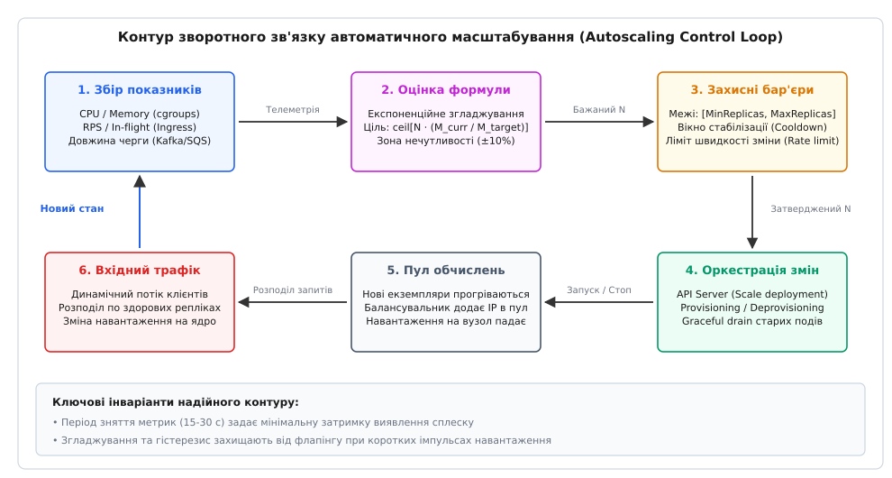
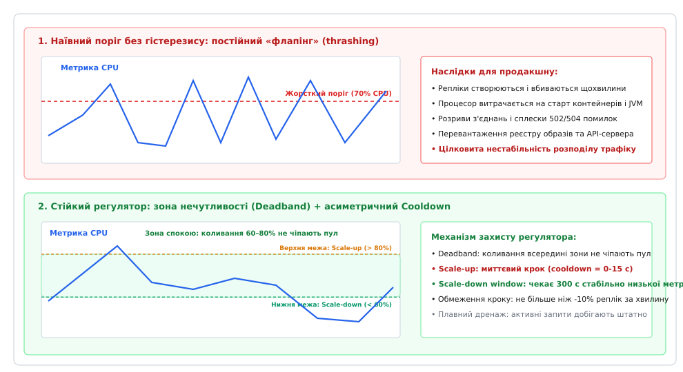
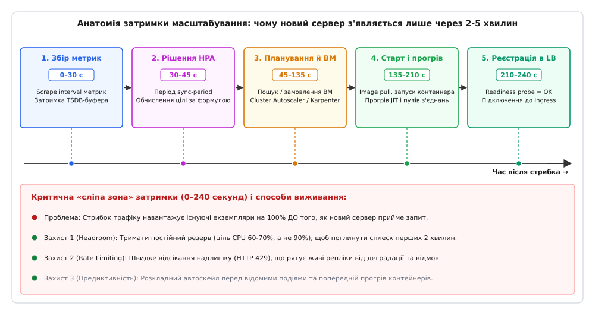
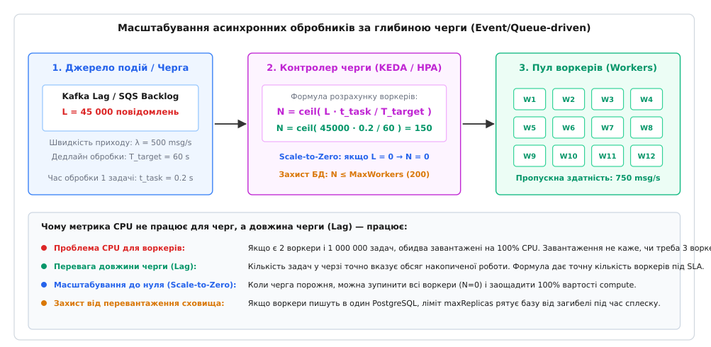

# Автоскейл: динамічне узгодження обчислювальної потужності з навантаженням

<preknowlist>
- [Планування потужностей і headroom](book:programming/capacity-planning) — розрахунок пікового навантаження, постійний резерв потужності (headroom) та економіка недовантаження.
- [Метрики](book:programming/metrics-monitoring) — збір числових часових рядів, період опитування (scrape interval) та затримка буферизації телеметрії.
- [Штатне вимкнення і drain](book:programming/graceful-shutdown) — доведення активних запитів до завершення та коректне вилучення вузла з балансувальника.
- [Балансування L4 vs L7](book:programming/load-balancing) — розподіл клієнтських запитів між пулом здорових бекендів і реєстрація нових екземплярів.
- [SLI/SLO/SLA і бюджет помилок](book:programming/slo-sli-sla) — кількісні цілі доступності та затримки, які контур автоскейлу зобов'язаний захищати.
- [Обмеження швидкості як архітектура](book:programming/rate-limiting) — відсікання раптових сплесків трафіку, поки нові обчислювальні потужності розгортаються.
</preknowlist>

О 09:00 ранку в інтернет-магазині стартує масштабна акція, і потік вхідних HTTP-запитів стрибає з 2 000 до 24 000 на секунду за півтори хвилини. Статично виділений пул із 10 серверних процесів вичерпує 100% процесорного часу за перші 15 секунд: черги очікування TCP-сокетів переповнюються, ядро починає відкидати нові SYN-пакети, 99-й перцентиль затримки відповідей злітає з 45 мс до 8 500 мс, а клієнти починають панічно повторювати запити (шторм повторів, англ. *retry storm*), остаточно паралізуючи інфраструктуру. З іншого боку, тримати 120 серверів увімкненими цілодобово «про всяк випадок» коштує 18 000 доларів на місяць замість 2 500, хоча 85% часу 110 із них просто гріють повітря в дата-центрі під час нічного штилю.

Статичне виділення ресурсів ставить архітектора перед безвихідним вибором між двома лихами: або регулярні аварійні відмови під час непередбачених сплесків попиту, або колосальна фінансова перевитрата на порожній простій. Автоматичне масштабування (автоскейл, англ. *autoscaling*, від грецького *autos* — сам і латинського *scala* — драбина, шкала) розв'язує цю суперечність, перетворюючи кількість обчислювальних одиниць на неперервну динамічну функцію поточного навантаження. Система автоматично додає сервери, коли попит зростає, і безслідно знищує зайві екземпляри, коли навантаження спадає.

> 🔧 **Навіщо це.** Команда, яка налаштовує розмір сервера «на око», або втрачає клієнтів через падіння сервісу в «чорну п'ятницю», або спалює річний бюджет проєкту за кілька місяців. Хто розуміє фізику автоскейлу, проєктує систему як замкнений саморегульований контур: обирає правильні метрики, враховує затримку старту контейнерів, вводить зону нечутливості проти коливань і будує захисні бар'єри, які не дозволяють автоскейлеру розчавити спільну базу даних під час масштабування.

## Горизонтальне проти вертикального масштабування: просторові вектори зміни потужності

Зміна обчислювальної потужності системи може відбуватися у двох принципово різних просторових напрямках: зміною розміру окремої обчислювальної машини або зміною кількості паралельних машин.

```
ВЕРТИКАЛЬНЕ (Scale-up / Scale-down):
[ 1 vCPU, 2GB RAM ]  ──(збільшення ресурсів)──>  [ 8 vCPU, 32GB RAM ]
(Один процес росте вшир, межа — фізичний сервер, часто вимагає перезапуску)

ГОРИЗОНТАЛЬНЕ (Scale-out / Scale-in):
[ Вузол 1 ]  ──(розмноження реплік)──>  [ Вузол 1 ] [ Вузол 2 ] [ Вузол 3 ] [ Вузол 4 ]
(Пул однакових екземплярів ділить трафік, межі майже немає, висока стійкість)
```

### Вертикальне масштабування (Vertical Pod/Resource Autoscaler, VPA)
Вертикальне масштабування полягає у динамічній зміні виділених квантів процесора (vCPU) та оперативної пам'яті (RAM) для вже існуючого процесу чи контейнера. 

Хоча ідея «просто додати пам'яті працюючому процесу» виглядає привабливо, у реальних операційних системах вона натрапляє на важкі фундаментальні обмеження:
1. **Фіксація ресурсів середовищем виконання (Runtime):** віртуальні машини Java (JVM), середовища Node.js або Go runtime зчитують доступні ресурси ядра та конфігурують розміри пулів потоків, таблиць дескрипторів та кучі (Heap) у момент старту процесу. Зміна лімітів cgroups на льоту часто не розпізнається внутрішніми алокаторами пам'яті без повного перезапуску застосунку.
2. **Ризик аварійного знищення (OOMKilled):** якщо процес відчуває раптовий дефіцит пам'яті, ядро Linux через механізм OOM-killer (Out of Memory) миттєво надсилає неперехоплюваний сигнал `SIGKILL`. Вертикальний автоскейлер просто не встигає відреагувати й підняти ліміт пам'яті швидше, ніж ядро вб'є процес.
3. **Фізична стеля:** вертикальне масштабування завжди обмежене параметрами найбільшого фізичного сервера, доступного на ринку, а вартість топових машин зростає нелінійно.

Тому у сучасній практиці вертикальний автоскейл (як-от Kubernetes VPA) використовують переважно у **рекомендаційному режимі** (Recommendation Mode) або для повільного підбору оптимальних базових параметрів (Right-sizing) фонових сервісів під час нічних перезапусків.

### Горизонтальне масштабування (Horizontal Pod/Process Autoscaler, HPA)
Горизонтальне масштабування полягає у зміні кількості однакових паралельних реплік (екземплярів процесу, контейнерів або віртуальних машин), між якими балансувальник навантаження рівномірно розподіляє вхідний потік запитів.

Горизонтальний підхід є домінуючим у хмарній архітектурі завдяки трьом фундаментальним перевагам:
- **Теоретично необмежена стеля:** якщо один екземпляр тримає 500 RPS, то 200 екземплярів здатні обробити 100 000 RPS (за умови, що спільні сховища даних спроєктовані під таке навантаження).
- **Висока відмовостійкість (Fault Tolerance):** раптове падіння одного екземпляра в пулі з 50 реплік забирає лише 2% загальної потужності системи; решта 49 екземплярів миттєво підхоплюють трафік без переривання сервісу.
- **Економічна гранулярність:** додавання чи видалення одного невеликого контейнера (наприклад, з 0.5 vCPU і 1 ГБ RAM) дозволяє ідеально точно повторювати криву зміни навантаження без переплат за надлишкові потужності.

Головною архітектурною вимогою для горизонтального автоскейлу є **відсутність збереження внутрішнього стану** (англ. *statelessness*): будь-який екземпляр повинен мати можливість обробити будь-який запит клієнта, а стан сесій, авторизаційні токени та дані мають зберігатися у зовнішніх розподілених сховищах (Redis, PostgreSQL, Cassandra).

### Масштабування інфраструктури (Cluster Autoscaler та Karpenter)
Горизонтальний автоскейл на рівні застосунків неминуче впирається у фізичні межі серверів: якщо всі наявні віртуальні машини в кластері вже завантажені контейнерами на 100%, новостворений контейнер переходить у стан очікування (`Pending` у термінах Kubernetes) через брак вільних процесорних ядер.

У цей момент у роботу вступає **автоскейлер інфраструктури** (Cluster Autoscaler або Karpenter):
1. Контролер інфраструктури перехоплює появу нерозподілених подів у планувальнику.
2. Він надсилає запит до хмарного API (AWS EC2, Google Cloud Compute Engine, Azure VM) на створення нових віртуальних або виділених серверів (Nodes).
3. Новий сервер проходить ініціалізацію, підключається до кластерної мережі та реєструється як здоровий вузол.
4. Планувальник розміщує поди, що очікували, на новому залізі.
5. Коли навантаження спадає, і вузли кластера стають напівпорожніми, контролер інфраструктури виконує консолідацію (Bin Packing): переносить залишки процесів на сусідні машини, коректно зупиняє спорожнілий сервер і видаляє його з хмарного обліку.

Як ця еволюція пройшла шлях від статичних мейнфреймів до сучасного своєчасного виділення нод за секунди, — [окрема історія еволюції автоскейлу](book:programming/autoscaling/hist-autoscaling-evolution.md).

## Контур зворотного зв'язку: як вимірюється навантаження і рахується ціль

В основі автоматичного масштабування лежить класичний інженерний принцип **контуру керування зі зворотним зв'язком** (англ. *feedback control loop*). Контролер періодично виконує цикл із шести послідовних фаз.



*Замкнений контур регулювання: телеметрія надходить від працюючих екземплярів та балансувальника, контролер обчислює бажану кількість реплік, фільтрує шум і передає наказ оркестратору, який змінює склад пулу й вирівнює питоме навантаження.*

Математичне ядро контролера розраховує бажану кількість екземплярів за формулою пропорційного співвідношення:

```
БажанаКількість = ceil[ ПоточнаКількість · (ПоточнеЗначенняМетрики / ЦільовеЗначенняМетрики) ]
```

Операція округлення вгору (`ceil`) є обов'язковою: якщо розрахунок показує потребу в 3.2 серверах, вибір 3 серверів залишить систему в стані перевантаження, тому контролер зобов'язаний виділити 4.

### Вибір провідної метрики масштабування

Ефективність усього контуру автоскейлу залежить від того, яка саме величина використовується як показник навантаження:

#### 1. Ресурсні метрики (CPU Utilization та Memory)
Використання процесора (відсоток від `cpu.requests` або абсолютний час виконання у cgroups) є найбільш поширеною базовою метрикою. Вона чудово працює для обчислювально важких завдань (CPU-bound): рендеринг графіки, шифрування, складна бізнес-валідація, розрахунки.

Проте при використанні процесорних метрик у контейнеризованих середовищах виникає небезпечний ефект **тротлінгу планувальника CFS** (Completely Fair Scheduler у ядрі Linux):
- Коли контейнеру задано жорсткий ліміт `cpu.limits` (наприклад, 1 vCPU при квоті `cpu.cfs_quota_us = 100000` мкс на період `cpu.cfs_period_us = 100000` мкс), багатопотоковий застосунок може використати всю 100-мілісекундну квоту за перші 15 мілісекунд періоду.
- Решту 85 мілісекунд ядро Linux примусово заморожує всі потоки контейнера.
- У середньому за хвилину утилізація процесора виглядає помірною (наприклад, 60–65%), але клієнти отримують спалахи затримок (latency spikes), оскільки їхні запити стоять на паузі в очікуванні наступного кванта часу CFS.
- Тому сучасні системи автоскейлу обов'язково аналізують лічильник `cpu.stat (throttled_usec)` і масштабують сервіс не лише за відсотком використання, а й за фактом появи системного тротлінгу.

Для систем введення-виведення (I/O-bound) процесор стає фатально оманливим показником:
- Якщо сервіс блокується в очікуванні повільних відповідей від зовнішнього платіжного шлюзу або бази даних, процесорні ядра простоюють у стані очікування (I/O wait або sleep).
- Завантаження CPU може впасти з 70% до 12%, але черги очікуючих HTTP-запитів при цьому зростають у десятки разів, а затримка виходить за межі допустимого.
- Наївний автоскейлер, дивлячись на низький CPU, вирішить, що навантаження спало, і почне **скорочувати** пул серверів, перетворюючи локальне уповільнення на глобальну катастрофу.

Оперативна пам'ять (RAM) підходить для масштабування вгору (Scale-out), але майже непридатна для масштабування вниз (Scale-in), оскільки алокатори пам'яті сучасних мов програмування (Go, Java, Node.js) рідко повертають звільнені сторінки операційній системі миттєво, утримуючи їх у внутрішніх пулах для повторного використання.

#### 2. Застосункові метрики (RPS та In-flight Requests)
Кількість вхідних HTTP/gRPC-запитів на секунду (RPS) або кількість одночасно відкритих активних з'єднань (In-flight requests), зафіксованих на балансувальнику (Ingress/Envoy), значно точніше відбивають реальний попит клієнтів.

Якщо один екземпляр гарантовано витримує 150 RPS зі збереженням затримки p99 < 50 мс, встановлення цільового значення `TargetRPS = 100` створює надійний, передбачуваний лінійний автоскейл із вбудованим 33% запасом надійності.

#### 3. Метрики черг повідомлень (Queue Backlog / Consumer Lag)
Для фонових обробників завдань (Workers), які зчитують повідомлення з брокерів Kafka, RabbitMQ або AWS SQS, використання процесора є абсолютно неінформативним: два воркери, що розгрібають чергу з 2 000 000 повідомлень, завантажені на 100% точно так само, як і два воркери, що розгрібають чергу з 20 повідомлень.

Єдиною адекватною метрикою для асинхронних систем є **довжина накопиченої черги** (англ. *queue lag* / *backlog depth*). Якщо в черзі накопичилося 60 000 повідомлень, а бізнес-вимога вимагає розібрати їх за 120 секунд за умови, що один воркер обробляє 5 повідомлень за секунду, формула однозначно визначає розмір пулу:
`Воркери = ceil[ 60000 / (120 · 5) ] = 100 воркерів`.

### Топологічно узгоджене масштабування у кількох зонах доступності (Multi-AZ)

У сучасних хмарних дата-центрах надійність вимагає рознесення реплік щонайменше по трьох незалежних зонах доступності (Availability Zones, AZ). Проте автоскейл у мультизонному середовищі додає ще один вимір складності:
- **Перекіс зон (Zone Skew):** якщо одна зона зазнає тимчасового локального збою мережі, трафік у ній падає, і наївний автоскейлер може зменшити кількість подів у цій зоні, тоді як дві інші зони зазнають перевантаження.
- **Ціна міжзонного трафіку (Cross-AZ Egress):** передача даних між різними зонами доступності всередині одного регіону є платною (типово 0.01 $/ГБ в кожен бік). Якщо балансувальник в зоні A скеровує запит до поду в зоні B, компанія платить двічі за кожен переданий гігабайт.
- **Обмеження поширення топології (Topology Spread Constraints):** автоскейлер зобов'язаний узгоджувати свої дії з планувальником, додаючи та видаляючи репліки симетрично (наприклад, суворо по одному поду в зони A, B та C), щоб запобігти знеструмленню однієї із зон під час масштабування вниз.

## Флапінг і гістерезис: як запобігти автоколиванням системи

Найпоширенішою хворобою невдалих контурів автоскейлу є явище **флапінгу** (або паразитного трешингу, англ. *flapping*, від *flap* — тріпотіти): циклічний стан, за якого система щохвилини створює й одразу знищує екземпляри, спалюючи ресурси на безперервні перезапуски.

Розглянемо механізм виникнення флапінгу на конкретному прикладі:
1. Працюють 2 сервери. Поступає навантаження, середнє використання CPU сягає 75% при жорсткому порозі масштабування 70%.
2. Регулятор миттєво додає 1 сервер (стає 3).
3. Трафік ділиться на три машини, і середнє завантаження падає до `75% · (2 / 3) = 50%`.
4. Оскільки 50% значно нижче порогу 70%, наївний регулятор вирішує, що потужностей забагато, і негайно знищує третій сервер (повертається 2).
5. На двох машинах завантаження знову підскакує до 75%, і весь цикл повторюється нескінченно.



*Зверху — небезпечний флапінг: сервери постійно стартують і вбиваються, викликаючи шторм помилок 502. Знизу — захищений регулятор: зона нечутливості ігнорує дрібні коливання, а вікно стабілізації чекає підтвердження спаду перед вимкненням машин.*

### Інженерні механізми приборкання флапінгу

Для усунення паразитної генерації автоскейлери використовують три взаємодоповнюючі фільтри:

#### 1. Зона нечутливості (Deadband / Tolerance)
Регулятор вводить допустимий коридор коливань навколо цільового значення (типово `tolerance = ±10%`). Якщо цільове завантаження становить 70%, то будь-які коливання метрики в діапазоні від 63% до 77% вважаються нормою і повністю ігноруються контролером, залишаючи пул стабільним.

#### 2. Асиметрія швидкості реакції
У розподілених системах вартість запізнення при нестачі ресурсів і вартість запізнення при надлишку ресурсів непорівнянні:
- **Нестача ресурсів (Scale-out):** порушує угоду про рівень обслуговування (SLO), викликає тайм-аути та втрату клієнтів. Тому масштабування вгору має бути **максимально швидким і агресивним** (cooldown period 0–15 секунд, можливість збільшення пулу на +100% за крок).
- **Надлишок ресурсів (Scale-in):** призводить лише до тимчасової незначної грошової переплати за кілька зайвих хвилин роботи контейнера. Тому масштабування вниз має бути **надзвичайно консервативним і повільним**.

#### 3. Вікно стабілізації (Stabilization Window)
Перед тим як зменшити кількість реплік, контролер фіксує пропозицію на згортання і витримує тривале вікно стабілізації (типово 300–600 секунд). Якщо протягом усього цього вікна навантаження хоча б на одну секунду підстрибне вище норми, таймер скидається, а пул залишається незмінним. Додатково застосовується обмеження швидкості скорочення (наприклад, видаляти не більше ніж 10% реплік за 60 секунд).

Як реалізувати такий стійкий математичний апарат з експоненційним згладжуванням (EMA) у коді, детально показано у [практичній реалізації контролера масштабування](book:programming/autoscaling/proj-autoscaling-controller.md).

## Часова затримка реакції: чому автоскейл запізнюється за сплеском

Найбільша ілюзія недосвідчених розробників полягає у вірі в те, що реактивний автоскейл здатен миттєво відреагувати на раптовий шквал запитів. У реальному фізичному світі між моментом, коли користувачі натиснули кнопку на сайті, і моментом, коли новий сервер прийняв свій перший байт корисного трафіку, минає **від 2 до 5 хвилин**.



*Ланцюжок затримок реакції: збір телеметрії (30 с) + рішення контролера (15 с) + старт ВМ (90 с) + прогрів контейнера (75 с) + підключення до Ingress (30 с). Під час цього вікна наявні сервери мусять виживати самостійно.*

Розберімо хронологію затримки покроково:
1. **Збір телеметрії (0–30 с):** агент моніторингу (Prometheus / CloudWatch) опитує сервери раз на 15–30 секунд. Щоб уникнути хибних тригерів, дані усереднюються за вікном у 60 секунд. Сплеск, що стався на першій секунді, контролер помітить лише через 30–45 секунд.
2. **Опитування контролера (30–45 с):** цикл узгодження HPA запускається раз на 15 секунд (`horizontal-pod-autoscaler-sync-period`).
3. **Замовлення інфраструктури (45–135 с):** якщо в кластері немає вільних ядер, Karpenter або Cluster Autoscaler викликає хмарне API. Хмара виділяє віртуальну машину, завантажує Linux-ядро, монтує диски та запускає системні демони (Kubelet, Containerd).
4. **Старт контейнера та прогрів (135–210 с):** завантаження шарів образу з реєстру (якщо його не було закешовано), виконання `init`-контейнерів, запуск важкого середовища (JVM / Node.js), ініціалізація пулів з'єднань до бази даних, прогрів JIT-компілятора (Just-In-Time) та заповнення локальних кешів.
5. **Реєстрація в балансувальнику (210–240 с):** періодичні перевірки готовності (Readiness Probes) мають тричі повернути `HTTP 200 OK`, після чого балансувальник навантаження (Ingress) додає нову IP-адресу в активну таблицю маршрутизації.

### Як вижити у «сліпій зоні» затримки

Якщо за ці 4 хвилини наявні 10 серверів ляжуть під 100% перевантаженням, нові сервери стартуватимуть у мертвому кластері. Для подолання затримки застосовують три обов'язкові лінії захисту:

1. **Постійний запас потужності (Headroom):** цільове значення завантаження ніколи не виставляють на 90–95%. Його встановлюють на рівні **60–70%**. Запас у 30–40% гарантує, що коли трафік раптово подвоїться, наявні сервери зможуть самостійно тримати удар протягом 3–4 хвилин, доки підкріплення проходить фази старту та ініціалізації.
2. **Обмеження швидкості (Rate Limiting та Load Shedding):** якщо сплеск перевищує навіть запас Headroom, система має швидко відсікати надлишковий трафік на рівні шлюзу з кодом `HTTP 429 Too Many Requests` або скидати неприорітетні фонові запити, зберігаючи працездатність основних бізнес-транзакцій.
3. **Предиктивний та розкладний автоскейл:** якщо подія є передбачуваною (наприклад, щоденний ранковий пік о 08:30 або запланована маркетингова розсилка у Viber о 14:00), потужності масштабують **наперед за розкладом (Scheduled Scaling)** за 30 хвилин до початку події, зустрічаючи пік у повному всеозброєнні.

## Масштабування асинхронних черг і масштабування до нуля (Scale-to-Zero)

Для асинхронних архітектур, побудованих на базі черг повідомлень та журналів подій (Event-Driven Architecture), автоскейл відкриває можливість повної оптимізації витрат через механізм **масштабування до нуля** (англ. *Scale-to-Zero*).



*Масштабування асинхронного пулу: розмір черги повідомлень (Lag) однозначно задає кількість потрібних воркерів під угоду про час обробки. Коли черга спорожніла, воркери вимикаються до нуля, заощаджуючи 100% коштів.*

Коли черга завдань порожня, утримання навіть одного працюючого воркера є марною тратою ресурсів. Інструменти класу KEDA (Kubernetes Event-driven Autoscaling) реалізують дворівневу схему:
- **У режимі спокою (0 реплік):** легковажний системний оператор моніторить метрику черги в брокері (наприклад, `kafka_consumergroup_lag`). Самі воркери вимкнені.
- **Поява події (0 → 1):** як тільки у черзі з'являється перше повідомлення, оператор миттєво піднімає одну репліку воркера.
- **Швидкісний розгін (1 → N):** далі у роботу вмикається пропорційний HPA, який масштабує пул пропорційно накопиченому обсягу за формулою дедлайну вичищення (Draining Deadline):

```
N_воркерів = ceil[ (ДовжинаЧерги · ЧасОбробкиОднієїЗадачі) / ЦільовийЧасВичищення ]
```

## Каскадні пастки та захисні бар'єри (Guardrails)

Автоскейл без жорстких інженерних обмежень може перетворитися на зброю самознищення власної інфраструктури. Виділимо три головні каскадні пастки:

### 1. Шторм запитів до залежностей (Thundering Herd on Downstream)
Коли веб-сервіс масштабується з 10 до 200 реплік, кожен новий екземпляр відкриває власний пул із 20–30 TCP-з'єднань до бази даних PostgreSQL. Сумарна кількість з'єднань злітає до 6 000. Спільна база даних вичерпує ліміт дескрипторів, пам'ять підключень та процесор на блокуваннях, входячи в стан повної відмови.

**Захист:**
- Жорсткий верхній ліміт `maxReplicas` для кожного шару системи, узгоджений із пропускною здатністю найвужчого місця архітектури.
- Використання проміжних мультиплексорів пулів з'єднань (PgBouncer, ProxySQL).

### 2. Пастка «мертвої точки» під час аварії бази (Database Brownout Trap)
Якщо база даних починає відповідати повільно (наприклад, через довге блокування таблиці), потоки веб-серверів зависають у стані очікування сокета. Використання процесора на веб-серверах падає до 5–10%, оскільки сервери просто сплять у системних викликах `read()`. Наївний контролер автоскейлу, орієнтований на CPU, вирішує скоротити кількість веб-серверів. Коли працюючих екземплярів стає менше, на кожен із них навалюється ще більша черга завислих клієнтських з'єднань, спричиняючи тотальний обрив сервісу.

**Захист:**
- Багатопараметричний автоскейл: заборона на скорочення пулу, якщо затримка відповідей (p99 latency) або відсоток помилок перевищує норму, навіть якщо процесор повністю вільний.

### 3. Холодний старт і шторм на невигрітий кеш (Cold Start & Cache Thrashing)
Новий екземпляр сервісу, щойно зареєстрований у балансувальнику, має порожній локальний кеш і невиконану JIT-компіляцію гарячих методів. Якщо балансувальник одразу спрямує на нього 100% номінального трафіку, сервер зазнає шокового навантаження, почне відповідати помилками `504 Gateway Timeout` і провалить перевірки здоров'я, потрапивши в нескінченний цикл перезапусків (CrashLoop).

**Захист:**
- Налаштування механізму повільного старту (Slow Start / Warmup Weighting) у балансувальниках Ingress/Envoy: новий бекенд починає отримувати 5% трафіку і плавно нарощує частку до 100% протягом 60–120 секунд.
- Інтеграція зі [штатним вимкненням](book:programming/graceful-shutdown): під час скорочення пулу (Scale-in) контейнери не знищуються раптово, а проходять повну фазу дренажу активних запитів (Drain).

## Worked-приклад: Комплексний розрахунок автоскейлу для HTTP-сервісу та черги задач

Розглянемо дві практичні інженерні задачі з точним розрахунком параметрів контуру масштабування.

### Задача 1: Горизонтальне масштабування HTTP API під час піку
**Умова:**
- Поточний розмір пулу: `N_curr = 8` реплік.
- Поточне середнє завантаження процесора: `CPU_curr = 88%`.
- Цільове використання процесора: `CPU_target = 65%` (з урахуванням 35% Headroom).
- Зона нечутливості (Deadband tolerance): `±10%` відхилення.
- Ліміти пулу: `min_replicas = 4`, `max_replicas = 20`.

Розрахуймо відносне відхилення та необхідну кількість реплік:

```
ratio = CPU_curr / CPU_target
      = 88% / 65%
      ≈ 1.353846                        [відношення поточної метрики до цілі]

deviation = |ratio - 1.0|
          = |1.353846 - 1.0|
          = 0.353846 (35.4%)            [відхилення понад поріг tolerance 10%]

N_desired = ceil( N_curr · ratio )
          = ceil( 8 · 1.353846 )
          = ceil( 10.830768 )
          = 11                          [округлення вгору для безпеки]

N_final = clamp(11, min=4, max=20) = 11 [значення в межах Guardrails]
```

### Задача 2: Масштабування обробників черги замовлень
**Умова:**
- Довжина черги повідомлень (Lag): `L = 45 000` повідомлень.
- Швидкість надходження нового трафіку: `λ = 250` повідомлень/секунду.
- Час обробки одного повідомлення одним воркером: `t_task = 0.12` секунди.
- Цільовий час повного вичищення черги (SLA дедлайн): `T_target = 60` секунд.

Розрахуймо необхідний розмір пулу воркерів за формулою розвантаження черги:

```
Загальна кількість задач = L + λ · T_target
                        = 45000 + 250 · 60
                        = 45000 + 15000
                        = 60000 задач   [з урахуванням свіжого приходу за 60 с]

Пропускна здатність 1 воркера за 60 с = T_target / t_task
                                     = 60 / 0.12
                                     = 500 задач/воркер

N_workers = ceil( Загальна кількість / Пропускна здатність 1 воркера )
          = ceil( 60000 / 500 )
          = 120 воркерів
```

Код верифікації обох моделей розрахунку:

:::tabs
```cpp
#include <iostream>
#include <cmath>
#include <algorithm>

// Розрахунок горизонтального масштабування HTTP-сервісу
int calculate_http_replicas(int current_replicas,
                           double current_metric,
                           double target_metric,
                           double tolerance,
                           int min_rep,
                           int max_rep) {
    double ratio = current_metric / target_metric;
    if (std::abs(ratio - 1.0) <= tolerance) {
        return current_replicas; // Усередині зони нечутливості
    }
    int desired = static_cast<int>(std::ceil(current_replicas * ratio));
    return std::clamp(desired, min_rep, max_rep);
}

// Розрахунок пулу воркерів для черги за дедлайном
int calculate_queue_workers(long long queue_lag,
                            double arrival_rate_rps,
                            double task_duration_sec,
                            double target_drain_time_sec,
                            int max_workers) {
    if (queue_lag <= 0 && arrival_rate_rps <= 0.0) {
        return 0; // Масштабування до нуля (Scale-to-Zero)
    }
    double total_tasks = static_cast<double>(queue_lag) + arrival_rate_rps * target_drain_time_sec;
    double tasks_per_worker = target_drain_time_sec / task_duration_sec;
    int desired = static_cast<int>(std::ceil(total_tasks / tasks_per_worker));
    return std::min(desired, max_workers);
}

int main() {
    int http_pool = calculate_http_replicas(8, 88.0, 65.0, 0.10, 4, 20);
    int worker_pool = calculate_queue_workers(45000, 250.0, 0.12, 60.0, 200);

    std::cout << "HTTP API target replicas: " << http_pool << " (очікується 11)\n";
    std::cout << "Queue Workers target pool: " << worker_pool << " (очікується 120)\n";
    return 0;
}
```
```python
import math

def calculate_http_replicas(current_replicas: int,
                           current_metric: float,
                           target_metric: float,
                           tolerance: float,
                           min_rep: int,
                           max_rep: int) -> int:
    ratio = current_metric / target_metric
    if abs(ratio - 1.0) <= tolerance:
        return current_replicas
    desired = math.ceil(current_replicas * ratio)
    return max(min_rep, min(desired, max_rep))


def calculate_queue_workers(queue_lag: int,
                            arrival_rate_rps: float,
                            task_duration_sec: float,
                            target_drain_time_sec: float,
                            max_workers: int) -> int:
    if queue_lag <= 0 and arrival_rate_rps <= 0.0:
        return 0
    total_tasks = queue_lag + arrival_rate_rps * target_drain_time_sec
    tasks_per_worker = target_drain_time_sec / task_duration_sec
    desired = math.ceil(total_tasks / tasks_per_worker)
    return min(desired, max_workers)


if __name__ == "__main__":
    http_pool = calculate_http_replicas(8, 88.0, 65.0, 0.10, 4, 20)
    worker_pool = calculate_queue_workers(45000, 250.0, 0.12, 60.0, 200)

    print(f"HTTP API target replicas: {http_pool} (очікується 11)")
    print(f"Queue Workers target pool: {worker_pool} (очікується 120)")
```
```go
package main

import (
	"fmt"
	"math"
)

func calculateHTTPReplicas(currentReplicas int, currentMetric, targetMetric, tolerance float64, minRep, maxRep int) int {
	ratio := currentMetric / targetMetric
	if math.Abs(ratio-1.0) <= tolerance {
		return currentReplicas
	}
	desired := int(math.Ceil(float64(currentReplicas) * ratio))
	if desired < minRep {
		return minRep
	}
	if desired > maxRep {
		return maxRep
	}
	return desired
}

func calculateQueueWorkers(queueLag int64, arrivalRateRPS, taskDurationSec, targetDrainTimeSec float64, maxWorkers int) int {
	if queueLag <= 0 && arrivalRateRPS <= 0.0 {
		return 0
	}
	totalTasks := float64(queueLag) + arrivalRateRPS*targetDrainTimeSec
	tasksPerWorker := targetDrainTimeSec / taskDurationSec
	desired := int(math.Ceil(totalTasks / tasksPerWorker))
	if desired > maxWorkers {
		return maxWorkers
	}
	return desired
}

func main() {
	httpPool := calculateHTTPReplicas(8, 88.0, 65.0, 0.10, 4, 20)
	workerPool := calculateQueueWorkers(45000, 250.0, 0.12, 60.0, 200)

	fmt.Printf("HTTP API target replicas: %d (очікується 11)\n", httpPool)
	fmt.Printf("Queue Workers target pool: %d (очікується 120)\n", workerPool)
}
```
:::

**Висновок.** Розрахунок демонструє два фундаментальні правила: для синхронного веб-трафіку автоскейл захищає затримку через постійний запас Headroom і зону нечутливості, а для асинхронних черг — визначає точну кількість воркерів під бізнес-дедлайн спорожнення черги, дозволяючи вимикати обчислення до нуля під час повного затишшя.

## Що лишається в руках

Автоматичне масштабування перетворює статичну обчислювальну інфраструктуру на живу, гнучку систему. Чотири ключові інваріанти варто закласти в архітектуру назавжди:

Перше: **горизонтальний автоскейл вимагає безстатусності (Statelessness).** Сервери мають бути змінними одиницями без збереження внутрішнього локального стану, а всі користувацькі сесії та дані повинні жити у зовнішніх розподілених сховищах.

Друге: **процесор обманює для I/O-систем.** Завжди обирайте метрику за типом навантаження: CPU для обчислювальних задач, RPS та in-flight з'єднання для веб-інтерфейсів, довжину черги (Lag) для асинхронних воркерів.

Третє: **затримка реакції неминуча.** Новий сервер запускається від 2 до 4 хвилин. Захищайтеся від сплесків тріадою: тримайте постійний резерв потужності (Headroom 30–40%), відсікайте надлишок запитів лімітуванням швидкості (`rate-limiting`) і запускайте масштабування заздалегідь перед запланованими подіями.

Четверте: **завжди обмежуйте автоскейл захисними бар'єрами.** Без жорсткого `maxReplicas` та мультиплексування з'єднань масштабування фронтенду розчавить спільну базу даних. Зона нечутливості (Deadband) та асиметричні вікна стабілізації захистять систему від виснажливого флапінгу, а плавний дренаж гарантує, що жодна транзакція не обірветься під час зменшення кластера.
