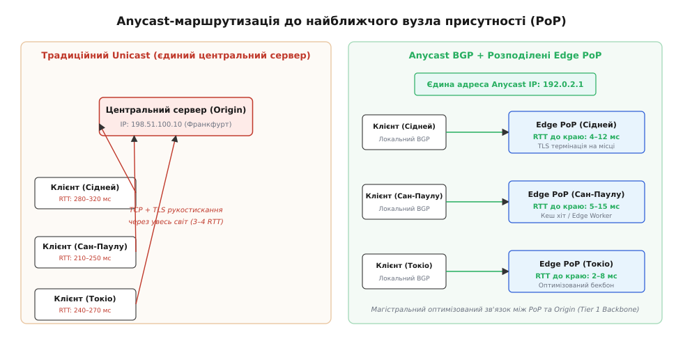
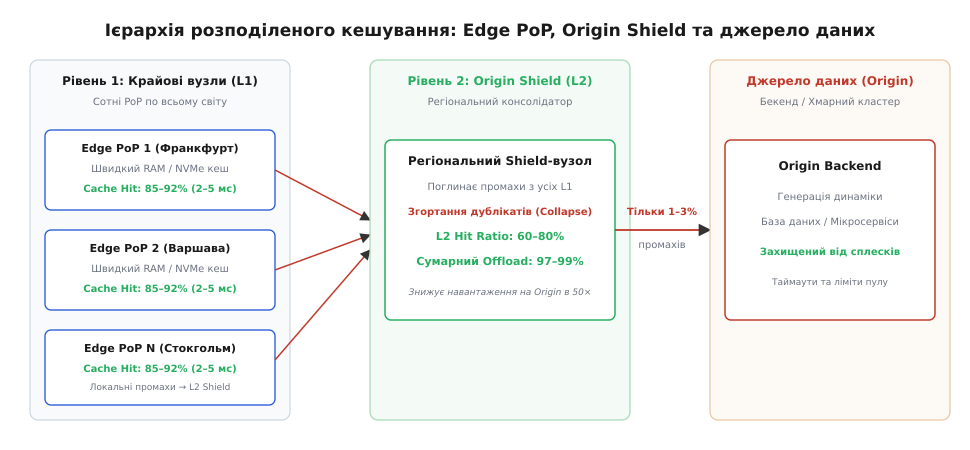
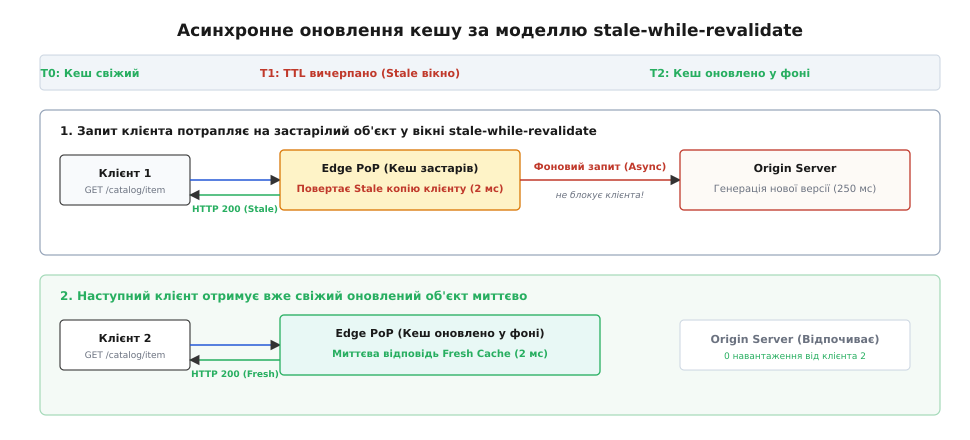
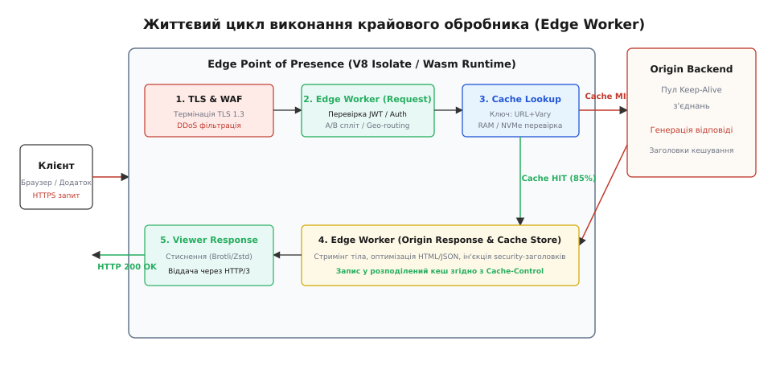

# CDN та Edge Computing: розподілене кешування і винесення логіки на край мережі

<preknowlist>
- [Anycast](topic:communications/anycast) — оголошення одного IP-префікса з багатьох географічних точок через протокол BGP для скорочення мережевого плеча.
- [BGP: міждоменна маршрутизація](topic:communications/bgp) — протокол динамічного обміну префіксами між автономними системами Інтернету.
- [DHCP та DNS](topic:communications/dhcp-dns) — механізми розділення доменних імен та трансляції хостів в IP-адреси.
- [Затримка та надійність каналу](topic:communications/latency-reliability) — розрахунок кругового часу обігу (RTT), пропускної здатності та впливу географічної відстані.
- [Serverless/FaaS](topic:programming/serverless-faas) — подієво-орієнтоване виконання безсерверних функцій в ізольованих пісочницях.
</preknowlist>

Користувач з австралійського Сіднея відкриває сторінку інтернет-магазину, чий єдиний центральний сервер розташований у німецькому Франкфурті. Фізична довжина оптоволоконного кабелю між цими містами перевищує 16 000 кілометрів. Показник заломлення кварцового скла в серцевині світловоду становить приблизно `n = 1.47`, через що швидкість поширення електромагнітної хвилі знижується до `c / n ≈ 204 000` км/с. Мінімальний теоретичний час проходження світлового імпульсу в один бік дорівнює 78.4 мілісекундам, а реальний круговий час обігу (Round-Trip Time, RTT) з урахуванням комутації в пакетах транзитних провайдерів сягає 280–320 мілісекунд.

Щоб лише встановити захищене з'єднання з центральним сервером, браузер виконує тристороннє TCP-рукостискання (`1 RTT`) та криптографічний обмін ключами за протоколом TLS 1.3 (`1 RTT`). На це витрачається понад 600 мілісекунд ще до того, як клієнт відправить перший байт HTTP-запиту. Сучасна вебсторінка містить у середньому 45 статичних ресурсів: файли стилів CSS, бандли JavaScript, шрифти та графічні зображення. Якщо всі ці запити спрямовуються безпосередньо до франкфуртського дата-центру, час до отримання першого байта (Time to First Byte, TTFB) зростає до 1.5–3 секунд, а повне візуальне відмальовування інтерфейсу триває понад 6 секунд. Коли ж під час святкового розпродажу наплив покупців сягає 20 000 запитів на секунду, центральна база даних та процесори бекенду миттєво перевантажуються, відповідаючи користувачам помилками `504 Gateway Timeout`.

Жодне нарощування потужності процесорів або збільшення оперативної пам'яті центрального сервера не здатне подолати фізичне обмеження швидкості світла та географічної відстані.

Єдиний інженерний спосіб кардинально зменшити затримку — фізично наблизити контент та обчислення до користувача. Це завдання вирішують **мережі доставки вмісту** (англ. *Content Delivery Network*, **CDN** від лат. *continere* — містити + *deliver* — доставляти) та технологія **крайових обчислень** (англ. *Edge Computing* від англ. *edge* — край, межа + лат. *computare* — обчислювати). Замість централізованого сервера розгортається глобальна мережа розподілених вузлів присутності (Points of Presence, PoP), які перехоплюють запити користувачів, кешують статичні дані у локальній пам'яті та виконують бізнес-логіку за лічені мілісекунди від кінцевого клієнта.

## Фізика мережевих затримок, пропускна здатність і протокол Anycast BGP

Щоб оцінити вплив відстані на продуктивність мережевого протоколу, звернемося до поняття добутку пропускної здатності на затримку (Bandwidth-Delay Product, BDP):

```
BDP = Пропускна_здатність (біт/с) · RTT (секунди)
```

Для гігабітного каналу зв'язку (1 Гбіт/с) при RTT = 300 мс значення BDP становить:

```
BDP = 10^9 біт/с · 0.3 с = 300 000 000 біт = 37.5 МБ
```

Це означає, що протокол передачі даних TCP повинен тримати в польоті (в буферах маршрутизаторів та пам'яті мережевих карт) 37.5 мегабайтів непідтверджених сегментів, щоб повністю утилізувати смугу пропускання. Проте алгоритми повільного старту TCP (Slow Start) починають передачу з невеликого початкового вікна перевантаження (Initial Congestion Window, зазвичай 10 MSS або близько 14.6 КБ). Для розгону вікна до максимуму за наявності високого RTT потрібні десятки послідовних циклів обміну, через що навіть короткі файли розміром 200–500 КБ завантажуються з вкрай низькою реальною швидкістю. Ба більше, формульна залежність Матіса (Mathis Formula) показує, що максимальна швидкість TCP падає обернено пропорційно до RTT за наявності навіть незначної частки втрати пакетів `p`:

```
Швидкість ≤ (MSS / RTT) · (C / √p)
```

У класичній мережевій топології Unicast кожне доменне ім'я прив'язане до однієї фіксованої IP-адреси. Незалежно від того, де перебуває клієнт — у Токіо, Лондоні чи Буенос-Айресі — кожен IP-пакет проходить через десятки автономних систем транзитних операторів (Tier 1/Tier 2 ISP) до центральної точки.

Сучасна інфраструктура CDN повністю відмовляється від централізованого Unicast на користь маршрутизації **Anycast BGP**:


*Клієнти в різних регіонах надсилають пакети на одну й ту саму Anycast IP-адресу, але протокол BGP спрямовує їх до найближчого вузла присутності (Point of Presence, PoP), де замикається TCP і TLS з'єднання.*

### Механізм роботи Anycast на межі автономних систем
1. **Єдиний префікс IP-адрес**: Усі крайові дата-центри провайдера (сотні PoP по всьому світу) налаштовують на своїх вхідних маршрутизаторах абсолютно однакову IP-адресу (наприклад, `192.0.2.1`);
2. **Оголошення BGP**: Кожен PoP через протокол Border Gateway Protocol анонсує свій IP-префікс сусіднім точкам обміну інтернет-трафіком (Internet Exchange Points, IXP) та локальним провайдерам останньої милі;
3. **Локалізація маршруту**: Маршрутизатори Інтернету обирають шлях із найменшою кількістю проміжних переходів (AS-Path). Пакети клієнта з Сіднея автоматично потрапляють у місцевий сіднейський дата-центр, а пакети з Варшави — у варшавський;
4. **Локальна термінація з'єднання**: Рукостискання TCP та криптографічний сеанс TLS 1.3 завершуються безпосередньо на крайовому сервері. Замість 600 мс встановлення з'єднання триває лише 8–15 мс;
5. **Магістральний зв'язок із джерелом (Tier 1 Backbone)**: Якщо запит вимагає звернення до центрального сервера (Origin), крайовий вузол передає дані через приватну волоконно-оптичну магістраль провайдера з постійно відкритим пулом попередньо прогрітих TCP-з'єднань, усуваючи повторні затримки рукостискання.

Завдяки Anycast клієнт більше не взаємодіє з далеким сервером напряму. Будь-які мережеві затримки останньої милі, втрати пакетів на бездротових каналах Wi-Fi чи стільникових мережах 4G/5G обробляються локальним PoP-вузлом за кілька кілометрів від смартфона користувача.

## Багаторівнева ієрархія кешування та захист джерела (Origin Shield)

Головне завдання кешувального шару CDN — перехопити максимально можливу частку вхідних запитів і не допустити їхнього проходження до центрального сервера бази даних.

Для цього застосовується трирівнева топологія:


*Трирівнева топологія кешу: крайовий PoP (L1) поглинає локальні запити, регіональний Origin Shield (L2) захищає центральний сервер від сплесків, а джерело даних (Origin) отримує лише унікальні промахи.*

### Рівень 1: Крайові вузли присутності (L1 Edge PoP)
Сотні вузлів розміщуються якомога ближче до абонентів у мережах інтернет-провайдерів. Кожен вузол містить високошвидкісні пули оперативної пам'яті (RAM) та твердотільні накопичувачі NVMe. На цьому рівні поглинається 85–92% усього статичного трафіку з затримкою віддачі 2–5 мс.

Ключ кешування (Cache Key) формується шляхом обчислення хешу від нормалізованого запиту:

```
Ключ_кешу = SHA256(Схема + "://" + Хост + Шлях + Відсортовані_Параметри + Vary_Заголовки)
```

Нормалізація ключа усуває штучну фрагментацію пам'яті: видаляються сторонні маркетингові параметри аналітики (`utm_source`, `fbclid`, `gclid`), параметри сортуються в алфавітному порядку, а значення заголовка `Accept-Encoding` зводяться до єдиного формату (`br` або `gzip`).

### Рівень 2: Регіональний захисний екран (L2 Origin Shield)
Коли на крайовому вузлі L1 трапляється промах повз кеш (Cache Miss), запит не йде одразу на центральний сервер. Натомість він спрямовується до проміжного регіонального концентратора — **Origin Shield**. 

Origin Shield вирішує фундаментальні проблеми високонавантажених систем:
- **Згортання однакових запитів (Request Collapsing / Single Flight)**: Якщо 50 різних крайових вузлів L1 одночасно зафіксували промах на один і той самий щойно опублікований файл або відеопотік, Origin Shield блокує дублікати, виставляє м'який м'ютекс і надсилає на центральний сервер **рівно один** підзапит. Отримана відповідь розмножується та повертається всім 50 очікуючим вузлам L1;
- **Зменшення трафіку міжрегіональних магістралей**: Об'єкти, що витіснилися з локального L1 PoP через обмежений обсяг оперативної пам'яті, залишаються у масивному дисковому сховищі L2 Shield;
- **Додатковий шар влучання**: Origin Shield поглинає 60–80% промахів з L1, доводячи сумарне розвантаження центрального сервера (Origin Offload) до **97–99%**.

### Рівень 3: Джерело даних (Origin Server)
Центральний кластер додатків та баз даних. Завдяки роботі L1 та L2 рівнів бекенд отримує лише 1–3% найскладніших динамічних або унікальних запитів, працюючи в стабільному режимі без ризику відмови.

Детальний математичний апарат розрахунку ймовірностей влучання за алгоритмом витіснення LRU, розподілу популярності контенту та розрахунку виграшу в затримці наведено у документі з [математичними моделями кешування та законами Ципфа](topic:programming/cdn-edge-computing/math-caching-models.md).

## Керування життєвим циклом кешу: Консистентність, TTL та асинхронне оновлення

Збереження копій на сотнях серверів по всьому світу породжує класичну проблему розподілених систем: як гарантувати, що користувач отримає актуальні дані після оновлення товару чи публікації статті.

Керування кешем базується на двох механізмах: часовому обмеженні придатності (Time-To-Live, TTL) та подієвій інвалідації.

```
Життєвий цикл кешованого об'єкта:
[Створення на Origin] ──(TTL = 300с)──► [Свіжий (Fresh): віддача за 2 мс]
                                           ↓ (минуло 300с)
[Оновлення у фоні (Async)] ◄─── [Застарілий (Stale): stale-while-revalidate]
                                           ↓ (минуло 86400с)
[Видалення з пам'яті (Purge/Evict)] ◄─── [Мертвий (Expired): Cache Miss]
```

### Модель асинхронного фонового оновлення (Stale-While-Revalidate)
У класичній схемі кешування, коли термін життя об'єкта (`max-age`) завершується, перший користувач, який звернувся до ресурсу, змушений чекати повного циклу звернення до Origin (Cache Miss Latency). Якщо цей об'єкт запитують тисячі клієнтів одночасно, виникає ефект «лавиноподібного навантаження» (Cache Stampede).

Стандарт RFC 5861 впроваджує директиву `stale-while-revalidate`:


*Крайовий вузол негайно повертає клієнту застарілу копію з кешу (2 мс), одночасно запускаючи фоновий запит на оновлення до джерела (Origin), усуваючи затримку для всіх наступних користувачів.*

Крайовий вузол розбиває життєвий цикл ресурсу на два інтервали:
1. **Інтервал свіжості (`s-maxage`)**: Ресурс віддається миттєво як актуальний;
2. **Інтервал припустимої застарілості (`stale-while-revalidate`)**: Крайовий вузол віддає збережений об'єкт за 2 мс, не змушуючи клієнта чекати, і у фоновому неблокуючому потоці ініціює запит до Origin. Отримана свіжа копія перезаписує старий запис у пам'яті для наступних відвідувачів.

### Подієва інвалідація та сурогатні ключі (Cache-Tags)
Коли дані в базі даних змінюються раніше, ніж завершиться встановлений TTL (наприклад, зміна ціни товару або виправлення критичної помилки в коді JS), бекенд ініціює примусове очищення (Purge).

Найефективнішим інструментом групового скидання кешу є **сурогатні ключі** (англ. *Surrogate-Keys* або *Cache-Tags*). При генерації сторінки Origin повертає заголовок:

```http
Surrogate-Key: product-4829 category-phones brand-apple
```

Крайовий вузол індексує об'єкт за цими ключами. Коли менеджер оновлює статус бренду Apple, бекенд надсилає один API-запит `POST /purge { "tags": ["brand-apple"] }`, і CDN за 150 мілісекунд видаляє всі пов'язані сторінки з усіх серверів світу через швидкісні канали реплікації інвалідацій.

Повний синтаксис директив, правила пріоритету заголовків `CDN-Cache-Control` та контракти REST API інвалідації описані у довіднику зі [специфікацією заголовків та Purge API](topic:programming/cdn-edge-computing/api-cache-control.md).

## Еволюція від статичного кешу до Edge Computing

Історично CDN створювалися виключно для статичних файлів: картинок, відео та архівів. Проте 70% корисного навантаження сучасних вебсервісів становлять динамічні API-запити та індивідуальні сторінки. Про те, як індустрія перейшла від перших алгоритмів MIT до сучасних платформ, розповідає [історія розвитку CDN та крайових обчислень](topic:programming/cdn-edge-computing/hist-cdn-evolution.md).

Спроба розгорнути на крайових вузлах повноцінні віртуальні машини або контейнери Docker виявилася неефективною:
- Контейнери вимагають 50–500 МБ оперативної пам'яті на екземпляр;
- Холодний запуск процесу займає від 300 до 2000 мс, що руйнує концепцію низької затримки на краю;
- Обслуговування 300+ PoP із тисячами мікросервісів створює надмірне операційне навантаження.

### Архітектура V8 Isolates та WebAssembly на краю
Сучасний Edge Computing використовує архітектуру легковажних ізолятів (V8 Isolates) та пісочниць WebAssembly (Wasmtime):

```
Традиційний бекенд (Docker/K8s):
[Хост ОС] → [Docker Daemon] → [Окремий процес Linux] → [Node.js/Python VM] → (Старт 500 мс, 150 МБ)

Edge Computing (V8 Isolates / WASM):
[Хост ОС] → [Єдиний процес Edge Worker] ──┬─► [Isolate 1: Орендар A (Пам'ять 3 МБ, старт < 5 мс)]
                                          ├─► [Isolate 2: Орендар B (Пам'ять 3 МБ, старт < 5 мс)]
                                          └─► [Isolate N: Орендар N (Пам'ять 3 МБ, старт < 5 мс)]
```

Усередині єдиного системного процесу рушій V8 створює тисячі ізольованих контекстів виконання. Кожен ізолят має власну купу пам'яті (Heap) та окремий стек викликів, але використовує спільний скомпільований JIT-код середовища. Це знижує час старту до **< 5 мілісекунд**, а споживання оперативної пам'яті — до **2–5 МБ** на обробник.

WebAssembly (WASM) на базі рушіїв Wasmtime та Lucet надає ще суворішу пісочницю. Код компілюється у бінарний байткод попереду часу (Ahead-of-Time, AOT), а лінійна пам'ять модуля повністю обмежена віртуальними сторінками апаратної пам'яті процесора, унеможливлюючи вихід за межі виділеного буфера без додаткових накладних витрат на емуляцію.

## Конвеєр виконання крайового коду (Edge Worker Lifecycle)

Крайова функція перехоплює вхідний мережевий запит і вбудовується безпосередньо в цикл обробки HTTP-трафіку:


*Конвеєр обробки запиту на краю мережі: перехоплення вхідного запиту клієнта, валідація JWT та перевірка кешу, опціональне звернення до джерела та модифікація заголовків перед поверненням відповіді.*

### Фази життєвого циклу обробника:
1. **Viewer Request (Вхідний запит)**: Спрацьовує одразу після завершення TLS-рукостискання. Тут виконується швидка фільтрація атак (WAF), перевірка криптографічних підписів токенів авторизації (JWT), географічне маршрутизування або розділення користувачів для A/B-тестування;
2. **Cache Intercept (Перехоплення кешу)**: Крайовий код може змінити ключ кешування (Cache Key), видалити випадкові query-параметри або вирішити повернути відповідь напряму з пам'яті без звернення до сховища;
3. **Origin Request (Запит до джерела)**: Якщо зафіксовано Cache Miss, воркер може модифікувати заголовки, додати підпис безпеки взаємодії з бекендом (наприклад, AWS Signature V4) або змінити адресу цільового мікросервісу;
4. **Origin Response (Відповідь джерела)**: Після отримання відповіді від бекенду крайовий код може розпакувати JSON, видалити конфіденційні поля, динамічно оптимізувати або стиснути зображення на льоту, модифікувати заголовки безпеки (`Content-Security-Policy`, `Strict-Transport-Security`) та зберегти результат у кеш;
5. **Viewer Response (Відповідь клієнту)**: Фінальна віддача сформованої відповіді через сучасні транспортні протоколи HTTP/2 або HTTP/3 (QUIC) з потоковим кодуванням Brotli чи Zstandard.

Повний покроковий розбір коду крайового перехоплювача з перевіркою криптографічних підписів та кешуванням наведено у [практичній реалізації крайового проксі з валідацією токенів](topic:programming/cdn-edge-computing/proj-edge-worker.md).

## Доставка сучасних потокових протоколів: HTTP/3 (QUIC) та медіаконтент

Крайові вузли є головними драйверами впровадження новітніх мережевих протоколів передачі даних:

### 1. Протокол HTTP/3 поверх транспорту QUIC (UDP)
Традиційний HTTP/2 поверх TCP страждає від блокування початку черги (Head-of-Line Blocking, HoL): якщо один TCP-пакет губиться в мережі, стек операційної системи блокує обробку всіх паралельних мультиплексованих потоків до моменту успішного повторного надходження втраченого сегмента.

Протокол QUIC замінює TCP на UDP, реалізуючи контроль перевантаження та шифрування на рівні окремих незалежних потоків даних:
- **0-RTT відновлення сесії**: Якщо клієнт уже підключався до крайового PoP раніше, він може відправити зашифрований HTTP-запит у найпершому UDP-пакеті разом із криптографічним токеном попереднього сеансу (0-RTT Early Data);
- **Міграція з'єднання (Connection Migration)**: Коли користувач виходить з дому і смартфон перемикається з домашньої мережі Wi-Fi на стільникову мережу LTE, IP-адреса клієнта змінюється. У TCP це призводить до розриву сокета та скидання завантаження відео. У QUIC з'єднання ідентифікується 64-бітним Connection ID, тому передача даних триває без найменшого переривання.

### 2. Стримінг медіаконтенту (HLS, MPEG-DASH та Byte-Range Caching)
Відеопотоки високої чіткості (4K/8K) не передаються одним монолітним файлом. Сервер розбиває відео на невеликі сегменти тривалістю 2–6 секунд (HLS `.ts` або fMP4-фрагменти) та генерує текстовий файл маніфесту (`.m3u8` чи `.mpd`).

Крайовий вузол оптимізує відеодоставку:
- Кешує бінарні сегменти відео з тривалим TTL (до 30 діб), оскільки вони незмінні;
- Маніфести прямого ефіру (Live HLS) кешує на термін, рівний половині тривалості сегмента (1–2 секунди);
- Підтримує заголовок `Range: bytes=0-1048575` (Byte-Range Caching), завантажуючи з центрального сховища лише запитані байти відео без повного скачування багатогігабайтного файлу.

## Рендеринг на краю (Edge SSR) та архітектура острівців

Сучасні вебфреймворки (Next.js, Remix, Astro, SvelteKit) активно використовують можливості крайового виконання для генерації HTML:

### 1. Потоковий рендеринг сторінок (Edge Streaming SSR)
Замість тривалого очікування завершення всіх важких запитів до бази даних на центральному сервері, крайовий воркер негайно повертає браузеру статичний HTML-каркас сторінки (`<head>`, стилі, навігаційну шапку) за 5 мілісекунд через потік `ReadableStream`. Браузер клієнта починає паралельне завантаження шрифтів і стилів, поки крайовий воркер паралельно очікує відповіді мікросервісів і досилає динамічні фрагменти сторінки по мірі їхньої готовності (Out-of-Order HTML Streaming).

### 2. Острівна архітектура (Islands Architecture)
Крайовий сервер збирає сторінку з незалежних ізольованих компонентів: статичні інформаційні блоки беруться з локального кешу без виконання коду JavaScript, а інтерактивні динамічні віджети (наприклад, кошик користувача чи персональні рекомендації) гідратуються індивідуально за допомогою легковажних крайових мікрофункцій.

## Географічне маршрутизування, ізоляція даних та спостережуваність (Observability)

Крайові обчислення надають унікальні можливості для регіональної адаптації трафіку та моніторингу:

### 1. Геоконтекстне маршрутизування та захист персональних даних (Geo-Fencing)
Кожен крайовий вузол містить у своїй локальній оперативній пам'яті базу даних IP-геолокації (наприклад, структури даних Radix Tree з пам'яті MaxMind GeoIP). Пошук країни, регіону та міста за IP-адресою триває менше ніж 400 наносекунд.
Це дозволяє реалізувати:
- **Дотримання вимог законодавства (GDPR / Data Residency)**: Трафік європейських користувачів залишається в межах дата-центрів ЄС, а персональні ідентифікатори анонімізуються або токенізуються прямо на крайовому сервері до передачі на аналітичні платформи;
- **Динамічний A/B-спліт**: Користувач отримує конкретну версію інтерфейсу на основі криптографічного хешу від його cookie-ідентифікатора без виконання редиректів та зайвих мережевих переходів.

### 2. Розподілене трасування та збирання телеметрії (OpenTelemetry на краю)
Оскільки запит проходить через клієнта, крайовий вузол L1, регіональний Origin Shield L2 та бекенд, діагностика проблем вимагає наскрізної телеметрії. Крайовий воркер генерує або продовжує заголовок контексту трасування `traceparent` (стандарт W3C Trace Context):

```http
traceparent: 00-4bf92f3577b34da6a3ce929d0e0e4736-00f067aa0ba902b7-01
```

Кожен крок (час виконання DNS-пошуку, TLS-рукостискання, час очікування м'ютекса кешу, тривалість виконання ізоляту V8 та TTFB від Origin) фіксується як окремий спан (Span). Телеметрія агрегується асинхронними демонами у фоні та передається до колекторів OpenTelemetry за протоколом gRPC, не сповільнюючи користувацький потік даних.

## Стан та бази даних на краю: Фізичні межі консистентності

Головна інженерна складність Edge Computing — керування розподіленим станом (State Management). Обчислення можна миттєво розмножити на 300 дата-центрів, але дані підпорядковуються фундаментальній теоремі CAP та законам теорії відносності.

### Моделі зберігання даних на краю:

1. **Крайові сховища ключ-значення (Edge Key-Value Stores)**:
   - Базуються на моделі узгодженості в кінцевому підсумку (**Eventual Consistency**);
   - Операції читання виконуються локально з оперативної пам'яті вузла за 1–3 мс;
   - Запис асинхронно реплікується по всіх дата-центрах світу за 5–15 секунд;
   - Ідеально підходять для конфігурацій, прапорців функцій (Feature Flags), редиректів та публічних профілів.

2. **Розподілені реляційні бази даних на базі SQLite / Raft**:
   - Технології (Cloudflare D1, Turso / libSQL) використовують схему з одним глобальним лідером запису (Primary Write Region) та сотнями локальних реплік тільки для читання (Read Replicas);
   - Читання SQL-запитів (`SELECT`) відбувається локально на крайовому вузлі за 2–5 мс;
   - Запис (`INSERT`, `UPDATE`) автоматично проксується через магістральний канал зв'язку до головного регіону, де проходить через консенсус Raft і фіксується в журналі транзакцій.

> 🔧 **Навіщо це в реальній розробці.**
> Винесення автентифікації та обробки статичних ресурсів на CDN та Edge Computing кардинально змінює економіку проекту:
> - **Зниження витрат на інфраструктуру (Egress Costs)**: Трафік з хмарних провайдерів (AWS, GCP, Azure) коштує $0.08–$0.12 за гігабайт, тоді як вихідний трафік через CDN обходиться у $0.01–$0.02, або взагалі входить у фіксований тариф, скорочуючи рахунки за мережу на 70–85%;
> - **Стійкість до DDoS-атак**: Anycast-мережа розсіює терабітні атаки ботнетів по сотнях дата-центрів, поглинаючи шкідливий трафік на рівні локальних маршрутизаторів без досягнення бекенду;
> - **Висока доступність (High Availability)**: Завдяки механізмам `stale-if-error` вебсайт залишається повністю функціональним для відвідувачів навіть під час повного збою центрального сервера баз даних.

## Безпека та фільтрація загроз на рівні крайового периметра (Edge Security & WAF)

Розподілена архітектура крайових вузлів слугує першою лінією цифрової оборони вебдодатків:

### 1. Поглинання та розсіювання об'ємних DDoS-атак
Коли ботнет генерує трафік потужністю сотні гігабіт на секунду (SYN-флуд, UDP-ампліфікація, HTTP-флуд запитами `GET /`), центральний сервер падає через вичерпання дескрипторів сокетів та переповнення черги з'єднань ядра Linux (`SYN backlog`). У мережі Anycast атака автоматично розбивається на сотні дрібних потоків, кожен з яких потрапляє до свого локального PoP-вузла. Крайові маршрутизатори за допомогою апаратних фільтрів eBPF/XDP відкидають шкідливі пакети безпосередньо на рівні мережевої карти без перемикання контексту ядра (Zero-Copy Drop).

### 2. Крайовий екран вебдодатків (Web Application Firewall, WAF)
Крайовий обробник інспектує тіло запиту та заголовки на наявність сигнатур SQL-ін'єкцій, міжсайтового скриптингу (XSS) та спроб експлуатації вразливостей нульового дня (Zero-Day). Шкідливий запит блокується зі статусом `403 Forbidden` за 1 мс, не досягаючи бекенду і не витрачаючи обчислювальні ресурси центральної інфраструктури.

### 3. Захист від ботів та обмеження частоти (Rate Limiting)
Крайовий вузол веде розподілений підрахунок кількості запитів з кожної IP-адреси або ідентифікатора клієнта за алгоритмом ковзного вікна (Sliding Window Counter). Якщо бот намагається підібрати паролі або зібрати базу даних контенту (Scraping), крайовий рівень перехоплює трафік, видаючи користувачу інтерактивний тест капчі або тимчасово повертаючи HTTP `429 Too Many Requests`.

## Межі застосування та інженерні компроміси крайової архітектури

Edge Computing не є універсальною заміною традиційного бекенду. Його використання пов'язане з компромісами:

1. **Транзакційна узгодженість (ACID)**: Будь-які операції, що вимагають суворої фінансової атомарності (наприклад, списання коштів з балансу рахунку або бронювання останнього квитка на літак), не можуть виконуватися локально на краю без синхронного блокування глобального лідера, що нівелює виграш у затримці;
2. **Обмеження середовища виконання**: Крайові ізоляти не підтримують довільні системні виклики ядра Linux, не дозволяють запускати довгоживучі фонові процеси (Cron, демони) та накладають ліміти на використання пам'яті (зазвичай до 128 МБ) і процесорного часу (до 50 мс CPU time);
3. **Складність зневадження та моніторингу**: Збирання журналів та розподілене трасування з 300 незалежних точок присутності вимагає інтеграції з потоковими системами агрегації логів (Logpull, Tail Workers) та використання OpenTelemetry для відстеження аномалій на крайових вузлах.
