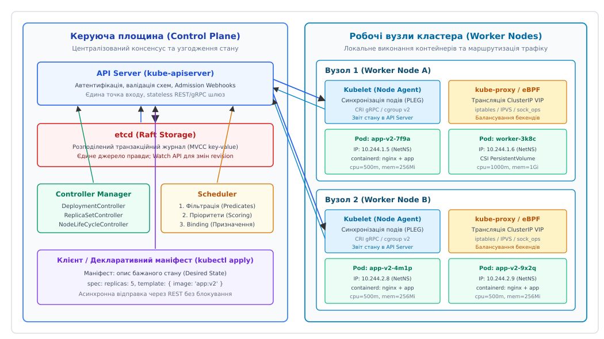
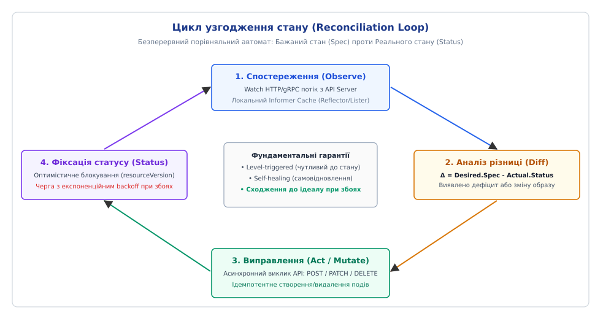
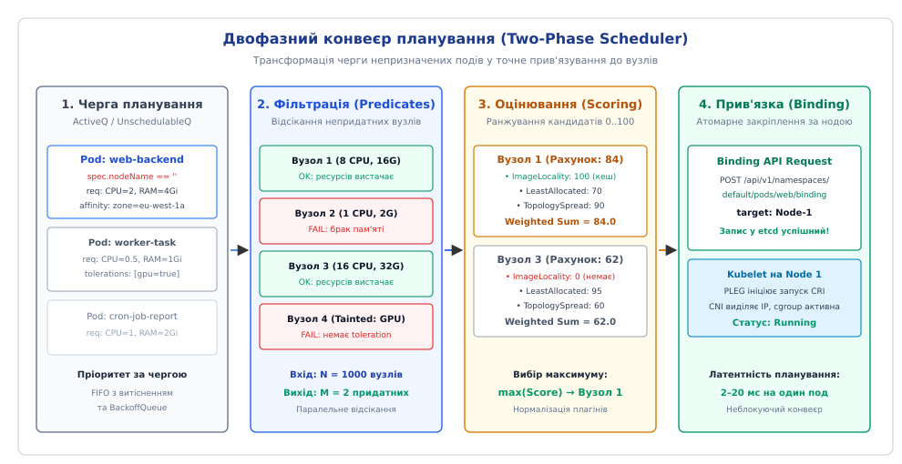
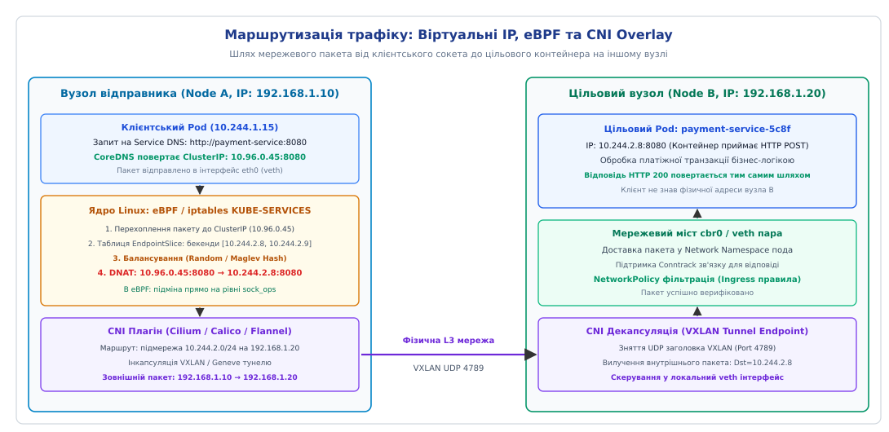

# Оркестрація

<preknowlist>
- [Контейнери](book:programming/containers) — простори імен ядра Linux (Namespaces) та контрольні групи (cgroups) для ізоляції процесів.
- [Штатне вимкнення і drain](book:programming/graceful-shutdown) — перехоплення сигналів SIGTERM, закриття з'єднань та дренаж трафіку перед зупинкою.
- [Автоскейл](book:programming/autoscaling) — динамічна зміна кількості реплік на основі метрик споживання CPU та черг запитів.
- [Стратегії деплою](book:programming/deployment-strategies) — плавні оновлення (Rolling Update), синьо-зелені перемикання та канаркові релізи.
- [SLI, SLO, SLA та бюджет помилок](book:programming/slo-sli-sla) — кількісна оцінка надійності сервісу та допустимих меж деградації.
</preknowlist>

Коли монолітний веб-сервіс розбивають на шістдесят мікросервісів, кожен із яких запускається в чотирьох примірниках, інфраструктурна команда опиняється перед необхідністю одночасно супроводжувати 240 ізольованих [контейнерів](book:programming/containers), розподілених по сорока фізичних серверах. О третій годині ночі на сервері `node-17` згорає планка оперативної пам'яті: шість критичних мікросервісів миттєво гинуть, запити на оплату починають сипати помилками `502 Bad Gateway`, а DNS-записи продовжують спрямовувати 15% клієнтського трафіку на неіснуючі IP-адреси мертвого вузла. Системний інженер, розбуджений пейджером, змушений вручну підключатися через SSH до сусідніх серверів, перевіряти залишки вільної оперативної пам'яті, з'ясовувати, чи вільний мережевий порт `8080`, вручну стартувати контейнери через `docker run`, оновлювати таблиці конфігурації NGINX та перезавантажувати проксі. Через сорок хвилин ручних маніпуляцій інший вузол вичерпує ліміт пам'яті через витік в аналітичному воркері, ядро Linux вбиває сусідній контейнер авторизації через Out-Of-Memory Killer, і система входить у стан некерованого каскадного колапсу.

Цей сценарій демонструє фундаментальну межу інструментів локальної контейнеризації: технології на кшталт Docker або containerd вміють запускати та ізолювати окремий процес на **одному конкретному хості**, але вони не мають жодного уявлення про топологію кластера, стан мережі між серверами, доступність ресурсів на сусідніх машинах та цілісність розподіленої системи в цілому.

Для вирішення цієї проблеми створено **оркестрацію (англ. *orchestration*, від грец. *orkhestra* — узгоджена координація автономних учасників задля гармонійної спільної дії)** — клас систем керування розподіленою інфраструктурою, які абстрагують сотні або тисячі фізичних серверів у єдиний віртуальний обчислювальний пул, автоматично планують розміщення задач, відстежують працездатність вузлів, маршрутизують трафік через віртуальні мережі та безперервно підтримують життєдіяльність застосунків без участі людини.

Історію того, як інженери Google створили перші системи керування кластерами Borg та Omega і як ці уроки втілилися в стандарт сучасних хмарних обчислень, викладено в історичному нарисі: [Від Borg та Omega до Kubernetes](book:programming/container-orchestration/hist-borg-omega-kubernetes.md).


*Архітектура оркестратора: керуюча площина (Control Plane) на базі консенсусу etcd та пул робочих вузлів із локальними агентами Kubelet і мережею eBPF/iptables*

---

## Парадигма декларативного стану: від імперативних команд до циклу узгодження

Головна відмінність оркестратора від систем скриптової автоматизації полягає у зміні парадигми взаємодії: **від імперативних інструкцій до декларативного бажаного стану**.

В **імперативній моделі** людина або скрипт віддає послідовність наказів: «створи контейнер A», «підключи мережу B», «якщо впаде, перезапусти двічі». Якщо на кроці «підключи мережу» виникає мережевий таймаут, скрипт зупиняється з помилкою. Система залишається у напіврозібраному проміжному стані: контейнер створено, але трафік він не отримує, а повторний запуск скрипта ламається через конфлікт імен.

В **декларативній моделі** користувач описує виключно кінцеву мету у вигляді структурованого маніфесту (YAML або JSON): «у системі завжди має працювати рівно 5 реплік образу `payment-api:v2.4`, кожна з яких споживає не більше 500 міліядер CPU і має доступ до секрету бази даних». Користувач не вказує, на яких саме серверах запускати контейнери і як саме їх туди доставляти.

Оркестратор приймає цей маніфест і запускає **цикл узгодження (англ. *reconciliation loop*)** — безперервний порівняльний автомат, що працює за формулою:

```
Δ = Бажаний_Стан (Spec) - Реальний_Стан (Status)
Якщо Δ ≠ 0:
    Виконати коригувальні дії (Act: Create / Patch / Delete)
    Зафіксувати новий статус (Status)
```


*Цикл узгодження стану: безперервне сходження спостережуваного стану до задекларованого маніфесту*

Ця модель має три фундаментальні властивості:
1. **Чутливість до стану (Level-triggered):** На відміну від чутливості до перепадів (Edge-triggered), коли система реагує лише на факт надходження сигналу «процес загинув», цикл узгодження періодично перевіряє факт: «скільки процесів живе прямо зараз?». Якщо через мережевий збій сповіщення про падіння загубилося, наступний прохід циклу все одно виявить дефіцит і відновить втрачений контейнер.
2. **Самовідновлення (Self-healing):** Якщо фізичний сервер вимикається, контролер фіксує падіння десяти подів і негайно відправляє їх на планування на вцілілі сервери кластера.
3. **Ідемпотентність:** Повторне виконання циклу з тими самими вхідними даними не змінює стан системи, якщо розбіжність уже усунуто.

Повний розбір коду та робочу багатопотокову реалізацію такого контролера мовами C та C++ наведено у практичній вставці: [Реалізація циклу узгодження](book:programming/container-orchestration/proj-reconciliation-loop.md).

---

## Анатомія керуючої площини (Control Plane)

Керуюча площина (Control Plane) — це мозок оркестратора, який відповідає за збереження глобального стану кластера, прийняття рішень про розміщення навантажень та координацію всіх фонових процесів.

Керуюча площина побудована за принципом поділу обов'язків на чотири автономні компоненти, які спілкуються між собою виключно через стандартизовані мережеві виклики.

### 1. Транзакційне сховище консенсусу (etcd)

Єдиним джерелом правди в усьому кластері є розподілене key-value сховище **etcd**. Для гарантії цілісності даних etcd використовує алгоритм [консенсусу Raft](book:distributed-systems/distributed-consensus), що забезпечує лінеаризований запис (Linearizable Writes) навіть за умови падіння меншості вузлів керування (наприклад, 2 з 5).

etcd реалізує модель багатовірного контролю конкурентності (**MVCC** — Multi-Version Concurrency Control). Кожна операція мутації (створення, редагування чи видалення ресурсу) не перезаписує старі байти на місці, а створює новий запис із глобальним монотонно зростаючим 64-бітним номером ревізії (`revision`).

Це дає дві критичні можливості:
- **Watch API (Потокові сповіщення):** Будь-який компонент системи (контролер, шедулер, агент вузла) може відкрити HTTP/2 gRPC потік спостереження за ключами (`Watch(prefix="/registry/pods", start_revision=14205)`). Якщо etcd фіксує зміну, він надсилає підписнику точний дельта-пакет без необхідності постійного опитування (polling).
- **Оптимістичне блокування (Compare-And-Swap):** При оновленні статусу клієнт передає поле `resourceVersion`. Якщо за час розрахунків версія в etcd змінилася іншим потоком, запис відхиляється з кодом помилки `409 Conflict`, запобігаючи руйнуванню даних через стан перегонів (race conditions).

### 2. Шлюз API (kube-apiserver)

**API Server** — це єдиний компонент керуючої площини, який має прямий доступ до etcd. Жоден контролер, планувальник чи користувач не має права звертатися до бази даних напряму.

API Server є повністю stateless-процесом і масштабується горизонтально за звичайним балансувальником навантаження. Кожен вхідний HTTP REST-запит проходить суворий шестиетапний конвеєр обробки:
1. **Автентифікація (Authentication):** Перевірка особи клієнта (X.509 сертифікати TLS, OpenID Connect токени, Bearer-токени сервісних акаунтів).
2. **Авторизація (Authorization):** Перевірка прав доступу до конкретного ресурсу через рольову модель **RBAC** (Role-Based Access Control) або перевірку атрибутів ABAC.
3. **Мутуючі вебхуки (Mutating Admission Webhooks):** Модифікація маніфесту на льоту (наприклад, автоматичне додавання sidecar-контейнера проксі або проставлення дефолтних лімітів пам'яті).
4. **Валідація схеми (Schema Validation):** Перевірка типів даних, обов'язкових полів та синтаксичної коректності згідно зі специфікацією OpenAPI v3.
5. **Валідуючі вебхуки (Validating Admission Webhooks):** Перевірка бізнес-правил безпеки (наприклад, заборона запуску контейнерів із привілеями `root` або блокування образів із публічних репозиторіїв).
6. **Запис у сховище:** Серіалізація структури в бінарний протокол Protocol Buffers та атомарний запис в etcd.

Повний опис контрактів конверта метаданих, правил валідації та параметрів специфікації наведено в окремому довіднику: [Специфікація декларативних примітивів та інтерфейсів оркестратора](book:programming/container-orchestration/api-orchestrator-primitives.md).

### 3. Менеджер контролерів (kube-controller-manager)

Менеджер контролерів — це єдиний системний процес, всередині якого працюють десятки незалежних циклів узгодження:
- `DeploymentController` — керує декларативним оновленням версій застосунків;
- `ReplicaSetController` — підтримує задану кількість однакових екземплярів подів;
- `NodeLifecycleController` — відстежує сигнали життя від агентів серверів (Node Leases) і запускає евакуацію при збоях;
- `EndpointSliceController` — підтримує актуальний список IP-адрес готових до роботи контейнерів для балансування трафіку.

Для запобігання конфліктам при паралельній роботі кількох інстансів Control Plane використовується механізм виборів лідера (**Leader Election**): контролери створюють у сховищі об'єкт блокування (`Lease`). Лише той процес, який володіє орендою, виконує цикли мутацій; інші перебувають у стані гарячого очікування (Hot Standby).

### 4. Планувальник (kube-scheduler) та Scheduling Framework

Планувальник відповідає за розподіл нових подів, у яких поле `spec.nodeName` є порожнім, по фізичних або віртуальних машинах кластера. Сучасний планувальник побудований на модульній архітектурі **Scheduling Framework**, яка надає одинадцять точок розширення (Extension Points) для вбудовування користувацьких плагінів:
- `QueueSort` — визначає порядок вилучення подів із черги очікування;
- `PreFilter` та `Filter` — перевіряють придатність вузла (Predicates);
- `PostFilter` — запускається при нестачі ресурсів і виконує процедуру витіснення (Preemption) менш пріоритетних подів;
- `PreScore`, `Score` та `NormalizeScore` — ранжують кандидатів за шкалою від 0 до 100;
- `Reserve` — тимчасово резервує ресурси в локальному кеші шедулера до завершення асинхронного запису в etcd;
- `Permit` — затримує прив'язку для групового планування (Gang Scheduling);
- `PreBind`, `Bind` та `PostBind` — виконують фізичну прив'язку пода до вузла через REST API.


*Двофазний конвеєр планування: паралельне відсікання непридатних вузлів та багатокритеріальне ранжування кандидатів*

Процес планування виконується у дві строго розділені фази:

#### Фаза 1: Фільтрація (Filtering / Predicates)
Планувальник перевіряє весь список вузлів кластера і відсікає ті, які фізично не здатні прийняти под:
- **NodeResourcesFit:** Чи достатньо на вузлі неалокованих ресурсів (CPU, пам'ять, GPU, вільні слоти подів) для задоволення `spec.containers[*].resources.requests`.
- **NodeName / NodeSelector:** Чи збігаються системні мітки вузла з вимогами маніфесту.
- **Taints and Tolerations:** Якщо на вузол накладено «пляму» (Taint, наприклад `gpu=true:NoSchedule` або `node.kubernetes.io/unreachable:NoExecute`), под буде відхилено, якщо у його специфікації немає відповідного «дозволу» (Toleration).
- **NodeAffinity / PodAntiAffinity:** Перевірка правил топологічного тяжіння або відштовхування (наприклад, заборона розміщувати дві репліки однієї бази даних на одному фізичному хості).

#### Фаза 2: Оцінювання та ранжування (Scoring / Priorities)
Серед усіх вузлів, що пройшли фільтрацію, планувальник обчислює вагову суму балів (від 0 до 100) за допомогою набору математичних плагінів:
- `ImageLocalityPriority` — нараховує додаткові бали вузлам, які вже мають викачані шари Docker-образу в локальному кеші диска (прискорює холодний старт із 40 секунд до 200 мілісекунд).
- `LeastAllocatedPriority` — віддає перевагу найменш завантаженим серверам для рівномірного розподілу навантаження.
- `BalancedResourceAllocation` — обирає вузол, на якому пропорція споживання CPU та пам'яті буде найбільш гармонійною, запобігаючи утворенню «заблокованої місткості» (Stranded Capacity).
- `TopologySpreadConstraints` — максимізує відмовостійкість шляхом рівномірного розподілу реплік по зонах доступності (Availability Zones) та стійках живлення.

Вузол із максимальним підсумковим балом обирається переможцем, після чого шедулер надсилає до API Server об'єкт **Binding**, атомарно записуючи ім'я вузла в маніфест пода.

Математичне виведення цільових функцій оптимізації, доведення NP-повноти задачі пакування та розрахунок дисперсії ресурсів наведено у спеціалізованій вставці: [Математичні основи планування: векторний Bin Packing та евристики ранжування](book:programming/container-orchestration/math-bin-packing-scheduling.md).

---

## Архітектура робочого вузла (Worker Node)

Робочий вузол — це безпосереднє обчислювальне середовище, де під контролем операційної системи Linux виконуються користувацькі контейнери.

### 1. Агент вузла (Kubelet)

**Kubelet** — це системний демон, що працює безпосередньо в просторі користувача хостової ОС. Він підписується на події API Server стосовно подів, призначених саме цьому вузлу, і керує їхнім життєвим циклом.

Ключовим внутрішнім механізмом Kubelet є **генератор подій життєвого циклу подів (PLEG — Pod Lifecycle Event Generator)**. PLEG періодично (за замовчуванням кожну 1 секунду) опитує рантайм контейнерів, порівнює поточний стан процесів із внутрішнім кешем, генерує події змін станів (`ContainerStarted`, `ContainerDied`) і запускає процедури синхронізації.

Kubelet відповідає за:
- Монтування томів сховищ за допомогою CSI-драйверів;
- Завантаження секретів (Secrets) та конфігурацій (ConfigMaps) у тимчасову файлову систему RAM (`tmpfs`);
- Виконання періодичних перевірок здоров'я (Liveness, Readiness, Startup Probes);
- Відстеження тиску на ресурси (Eviction Manager): якщо на вузлі залишається менше 10% вільного дискового простору або менше 100 МіБ доступної RAM, Kubelet починає примусове витіснення подів класу `BestEffort`.

### 2. Тріада модульних інтерфейсів: CRI, CNI, CSI

Для запобігання монолітній прив'язці до конкретних технологій оркестратор взаємодіє з операційною системою через три стандартизовані відкриті інтерфейси:

```
                    ┌─────────────────────────────────────────┐
                    │                 Kubelet                 │
                    └────┬─────────────────┬────────────────┬─┘
                         │ gRPC            │ JSON/CLI       │ gRPC
                         ▼                 ▼                ▼
                  ┌─────────────┐   ┌─────────────┐  ┌─────────────┐
                  │     CRI     │   │     CNI     │  │     CSI     │
                  │ containerd  │   │   Cilium    │  │ AWS EBS CSI │
                  │   CRI-O     │   │   Calico    │  │ Ceph CSI    │
                  └─────────────┘   └─────────────┘  └─────────────┘
```

1. **CRI (Container Runtime Interface):** gRPC-інтерфейс між Kubelet та демоном контейнеризації (containerd, CRI-O). CRI керує низькорівневим життєвим циклом пісочниць (Pod Sandbox), викликаючи стандартизовані OCI-рантайми (runc, crun) для створення просторів імен та налаштування cgroups.
2. **CNI (Container Network Interface):** Плагінний контракт конфігурації мережі. Коли створюється под, Kubelet викликає бінарний файл CNI (Calico, Cilium, Flannel), який створює пару віртуальних інтерфейсів (`veth pair`), переносить один кінець у мережевий простір імен пода (`NetNS`), виділяє унікальну IP-адресу з підмережі кластера (IPAM) та налаштовує маршрутизацію.
3. **CSI (Container Storage Interface):** Стандарт підключення блочних та файлових сховищ. CSI-плагіни дозволяють динамічно замовляти мережеві томи (Persistent Volumes) у хмарних провайдерів (AWS EBS, GCP Persistent Disk) або локальних SAN/NAS сховищ (Ceph, iSCSI) і прозоро монтувати їх у контейнер.

---

## Мережева маршрутизація та виявлення сервісів (Service Discovery)

Контейнери в кластері є ефемерними об'єктами: вони регулярно перезапускаються, масштабуються та переміщуються між серверами, отримуючи щоразу **нову динамічну IP-адресу**. Якщо фронтенд-сервіс намагатиметься звертатися до бекенду за прямими IP-адресами подів, зв'язок розпадеться під час першого ж планового релізу.

Для ізоляції споживачів від мінливості IP-адрес оркестратор вводить абстракцію **Service** — стабільну віртуальну кінцеву точку, що об'єднує групу подів за допомогою селектора міток (`selector: app=payment`).


*Маршрутизація трафіку: від стабільного DNS-імені через трансляцію віртуального IP (ClusterIP) у ядрі Linux до цільового контейнера через CNI VXLAN-тунель*

### Модель площини даних: ClusterIP та балансування

Кожному об'єкту Service виділяється віртуальна IP-адреса (**ClusterIP**), яка обирається зі спеціального діапазону (наприклад, `10.96.0.0/12`) і ніколи не присвоюється жодному фізичному мережевому інтерфейсу.

Трансляцію пакетів, що надходять на ClusterIP, виконує мережевий проксі вузла (**kube-proxy**) або BPF-драйвер ядра (Cilium):

1. **Режим iptables:**
   kube-proxy відстежує об'єкти `EndpointSlice` і записує в таблицю `nat` ядра Linux ланцюжки правил `KUBE-SERVICES`. Коли клієнтський процес надсилає TCP SYN пакет на ClusterIP, ядро перехоплює його через механізм Netfilter і за допомогою модуля `statistic` із рівною ймовірністю (random balance) виконує операцію **DNAT (Destination NAT)**, підміняючи віртуальний IP на реальний IP одного з живих подів.
2. **Режим IPVS (IP Virtual Server):**
   Використовує вбудований у ядро Linux транспортний балансувальник L4. Замість лінійного пошуку по тисячах правил iptables (який деградує при масштабуванні понад 5000 сервісів), IPVS організовує маршрути в ефективні хеш-таблиці з часовою складністю пошуку `O(1)` та підтримує розширені алгоритми балансування (Least Connections, Weighted Round-Robin).
3. **Режим eBPF (Extended Berkeley Packet Filter):**
   Сучасні CNI-плагіни (Cilium) повністю замінюють Netfilter програмами eBPF, які монтуються безпосередньо на сокети ядра (`sock_ops`) та мережевий драйвер (XDP). Трафік транслюється в момент виконання системного виклику `connect()` у просторі користувача, усуваючи накладні витрати на проходження мережевого стека ядра і зменшуючи мережеву латентність на 25–40%.

### Виявлення сервісів через CoreDNS

Усередині кластера працює внутрішній відмовостійкий DNS-сервер (**CoreDNS**). Для кожного сервісу автоматично генерується канонічне доменне ім'я:
```
<ім'я-сервісу>.<простір-імен>.svc.cluster.local
```
Коли контейнер звертається за адресою `http://payment-service:8080`, вбудований резолвер Linux через конфігурацію `/etc/resolv.conf` звертається до CoreDNS, отримує стабільний ClusterIP, після чого мережевий стек ядра прозоро маршрутизує пакет на найближчий здоровий под.

---

## Абстракції робочих навантажень (Workload Controllers)

Оркестратор надає спеціалізовані типи контролерів під різні моделі обчислень:

```
                            ┌───────────────────────────────┐
                            │    Типи робочих навантажень   │
                            └───────────────┬───────────────┘
                                            │
         ┌──────────────────┬───────────────┴───────────────┬──────────────────┐
         ▼                  ▼                               ▼                  ▼
  ┌──────────────┐   ┌──────────────┐                ┌──────────────┐   ┌──────────────┐
  │  Deployment  │   │  StatefulSet │                │  DaemonSet   │   │     Job      │
  │  Stateless   │   │   Stateful   │                │ Вузлові ноди │   │  Одноразові  │
  │ Web, API, GW │   │  БД, Kafka   │                │ Логи, CNI    │   │  Міграції    │
  └──────────────┘   └──────────────┘                └──────────────┘   └──────────────┘
```

1. **Deployment (Безстатусні мікросервіси):**
   Керує безстатусними веб-застосунками. Створює та версіонує підпорядковані об'єкти `ReplicaSet`. Забезпечує плавні релізи за стратегією [Rolling Update](book:programming/deployment-strategies), дозволяючи оновлювати код без простою (Zero-Downtime Deployment) шляхом поступової заміни старих подів на нові.
2. **StatefulSet (Стан та персистентність):**
   Призначений для розподілених баз даних (PostgreSQL, Cassandra) та брокерів повідомлень (Kafka, ZooKeeper). Гарантує:
   - Стабільні, передбачувані мережеві ідентифікатори (хостнейми `db-0`, `db-1`, `db-2`);
   - Послідовний запуск та зупинку (строго від `0` до `N-1`);
   - Автоматичне персональне прив'язування виділеного диска (PersistentVolumeClaim) до конкретного порядкового індексу, що зберігається при перенесенні пода на інший вузол.
3. **DaemonSet (Системні демони хоста):**
   Гарантує запуск рівно однієї репліки пода на кожному вузлі кластера (або на вибраній підмножині). Використовується для інфраструктурних сервісів: збирачів журналів (Fluentbit, Promtail), агентів моніторингу (Node Exporter) та мережевих драйверів CNI.
4. **Job та CronJob (Пакетні задачі):**
   На відміну від довгоживучих сервісів, `Job` запускає контейнери до успішного завершення процесу (код повернення `exit(0)`). Використовується для виконання міграцій баз даних, генерації звітів та періодичних бекапів за розкладом cron.

---

## Взаємодія з механізмами автоскейлу (Autoscaling)

Оркестратор тісно інтегрується з багаторівневою підсистемою [автоматичного масштабування](book:programming/autoscaling), яка динамічно адаптує ресурси під навантаження:

1. **Горизонтальне масштабування подів (HPA — Horizontal Pod Autoscaler):**
   Контролер HPA періодично (кожні 15 секунд) опитує метрики споживання CPU, пам'яті або користувацькі бізнес-метрики (наприклад, довжину черги в RabbitMQ чи RPS у сервіс-меші) і розраховує необхідну кількість реплік за формулою:
   ```
   Бажані_Репліки = ⌈ Поточні_Репліки · ( Поточне_Значення_Метрики / Цільове_Значення_Метрики ) ⌉
   ```
   Якщо середнє завантаження процесора складає 80% при цільовому значенні 50%, HPA збільшує поле `spec.replicas` у Deployment, запускаючи цикл узгодження для створення нових подів.

2. **Вертикальне масштабування подів (VPA — Vertical Pod Autoscaler):**
   Аналізує історичні профілі реального споживання пам'яті та процесора контейнерами й автоматично коригує значення `requests` та `limits`. Оскільки зміна ресурсів у cgroups раніше вимагала перезапуску контейнера, сучасні рантайми (In-Place Resource Resize) дозволяють оновлювати `cpu.max` та `memory.max` на льоту без переривання роботи процесу.

3. **Автомасштабування кластера (Cluster Autoscaler / Karpenter):**
   Працює на рівні віртуальних машин хмарних провайдерів. Якщо планувальник не може розмістити под через брак ресурсів (`PodScheduled: False`, Reason: `Unschedulable`), Cluster Autoscaler негайно надсилає команду в хмарний API на замовлення нового сервера потрібного типу (наприклад, інстансу з GPU).

---

## Відмови, мережеві розділення та аварійне відновлення

Розподілені кластери проектуються за принципом постійної готовності до збоїв (**Designed for Failure**). Оркестратор реалізує автоматичні механізми виявлення та ізоляції аварійних ситуацій.

### 1. Збій робочого вузла та евакуація

Кожен робочий вузол кластера кожні кілька секунд надсилає сигнал життя, оновлюючи об'єкт `Lease` у просторі імен `kube-node-lease`.

Якщо Control Plane не отримує оновлення оренди протягом визначеного тайм-ауту (за замовчуванням 40 секунд):
1. `NodeLifecycleController` переводить вузол у стан `NotReady`.
2. Контролер накладає на вузол системний Taint: `node.kubernetes.io/unreachable:NoExecute`.
3. Поди, які не мають толерантності до цього Taint (або термін толерантності яких вичерпано, за замовчуванням `tolerationSeconds = 300`), примусово видаляються зі списку вузла.
4. Контролери `Deployment` фіксують зменшення кількості активних реплік і створюють нові поди на вцілілих серверах.

### 2. Небезпека розділення мережі (Network Partition та Split-Brain)

Якщо мережевий лінк між стійками дата-центру розривається, виникає небезпека розколу кластера (Split-Brain).

Завдяки кворумній моделі Raft в etcd:
- Та частина кластера, яка зберегла доступ до **більшості вузлів etcd** (наприклад, 2 з 3 або 3 з 5), продовжує приймати операції запису.
- Ізольована меншість (Minority partition) переходить у режим «тільки читання» (Read-Only) або повністю блокує мутації, унеможливлюючи появу двох суперечливих станів системи.

Для StatefulSet подібні розділення несуть ризик подвійного запису в базу даних. Якщо вузол `node-1` із подом `db-0` втрачає зв'язок із Control Plane, оркестратор **не має права автоматично створювати `db-0` на іншому вузлі**, доки старий процес не буде гарантовано примусово завершений. Для цього застосовуються протоколи огорожі (Fencing / STONITH — Shoot The Other Node In The Head) через інтелектуальні контролери сховищ (CSI Volume Fencing).

---

> 🔧 **Навіщо це.**
>
> У сучасній інженерії оркестрація є фундаментом концепції незмінної інфраструктури (Immutable Infrastructure). Вона вилучає потребу ручного втручання в операційні системи серверів (SSH-доступ на сервери промислового контуру повністю блокується за політиками безпеки).
>
> Завдяки абстракції API розробники отримують можливість описувати весь ландшафт застосунку (обчислення, мережеві маршрути, правила балансування, політику безпеки та сховища) у вигляді коду у Git-репозиторії (**GitOps**). Будь-яка зміна версії або конфігурації автоматично синхронізується з кластером інструментами безперервної доставки, а повернення до попередньої стабільної версії (Rollback) займає лічені секунди.
>
> Автоматизація утилізації обладнання дозволяє змішувати на однакових серверах критичні веб-сервіси та фонові аналітичні задачі, підвищуючи середнє використання апаратних ресурсів компанії з 15% до 65–70%, що скорочує витрати на хмарну інфраструктуру в рази.

---

## Системна ціна та експлуатаційні накладні витрати

Оркестрація не є безкоштовною абстракцією: за масштабованість та самовідновлення система розплачується внутрішньою складністю та споживанням системних ресурсів.

| Компонент / Механізм | Джерело накладних витрат | Кількісна оцінка ціни | Вплив на систему при масштабуванні |
| :--- | :--- | :--- | :--- |
| **Керуюча площина (etcd)** | Дисковий ввід-вивід (fsync) та розмір оперативної пам'яті | Потребує виділених NVMe SSD із затримкою `fsync < 10ms`; пам'ять etcd: 2–8 ГБ | При перевищенні 100 000 об'єктів розмір бази сягає ліміту (8 ГБ), вимагаючи дефрагментації та compaction. |
| **Шлюз API Server** | Серіалізація/десеріалізація JSON/Protobuf, Webhook-затримки | Споживання 2–16 ядер CPU на кожен інстанс; пам'ять: 4–32 ГБ | Шторм подій від тисяч Kubelet може викликати насичення черги обробки (API Priority and Fairness). |
| **Агент вузла (Kubelet)** | Цикл PLEG (періодичний опрос cgroups та рантайму) | Споживає 0.1–0.5 CPU та 200–500 МіБ RAM на кожному вузлі | При запуску понад 100 подів на одному сервері PLEG починає відставати (PLEG Relist Latency > 1s). |
| **Мережевий оверлей (CNI)** | Інкапсуляція пакетів (VXLAN/Geneve заголовки) | Зменшення MTU на 50 байтів; 1–3% накладних витрат CPU ядра | При відсутності налаштування Jumbo Frames виникає фрагментація великих TCP-пакетів. |
| **Таблиці маршрутизації** | Кількість правил iptables / IPVS | iptables: `O(N)` час проходження пакету при зростанні кількості Endpoint | При масштабуванні понад 10 000 сервісів скидання iptables блокує ядро; вимагає міграції на eBPF. |

Розуміння цих внутрішніх механізмів дозволяє проєктувати надійні високонавантажені платформи, ефективно налаштовувати ресурси та швидко локалізувати кореневі причини інфраструктурних інцидентів.
