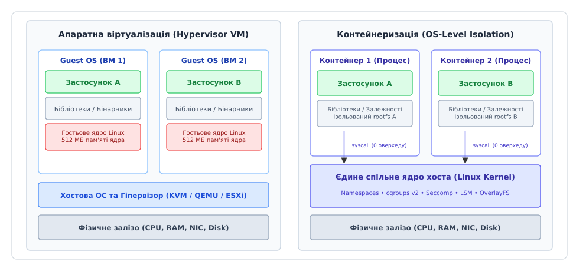
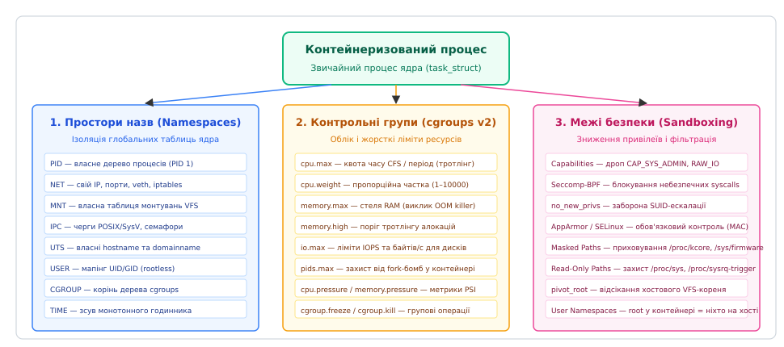
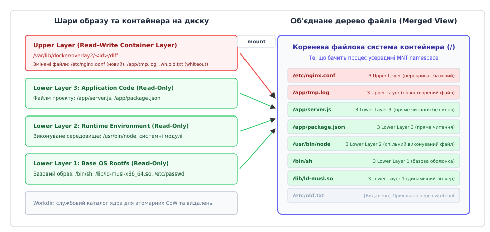
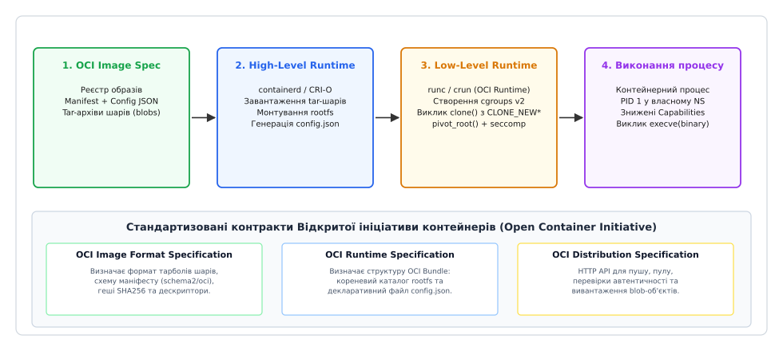

# Контейнери

<preknowlist>
- [Системний виклик](book:programming/system-call) — як процес простору користувача переходить у простір ядра для взаємодії з системними ресурсами.
- [Апаратна віртуалізація](book:programming/hardware-virtualization) — як гіпервізори емулюють повне залізо та чим вони відрізняються від ізоляції рівня ОС.
- [Штатне вимкнення і drain](book:programming/graceful-shutdown) — життєвий цикл зупинки процесу та безпечне завершення з'єднань.
- [Віртуальна пам'ять](book:programming/virtual-memory) — розділення адресних просторів та сторінковий облік пам'яті в ядрі.
</preknowlist>

Коли на одному фізичному сервері під керуванням Linux потрібно одночасно розгорнути два мікросервіси — наприклад, платіжний шлюз на застарілій версії Python із компільованими C-розширеннями під OpenSSL 1.1 та аналітичний сервіс на сучасному Node.js, що вимагає системної бібліотеки `glibc 2.38` — класичне розгортання в межах єдиної файлової системи хоста зазнає краху. Спроба оновити системну `glibc` ламає бінарники старого бекенду, а встановлення бібліотек у нестандартні шляхи створює крихкі ланцюжки `LD_LIBRARY_PATH`, які розсипаються під час першого ж планового оновлення безпеки.

Історично цю проблему вирішували запуском повноцінних віртуальних машин (ВМ) під керуванням гіпервізора (KVM, VMware ESXi, Xen). Проте ціна виявляється надто високою: на хості із 64 ГБ оперативної пам'яті запуск 40 віртуальних машин витрачає понад 20 ГБ пам'яті виключно на дублювання 40 окремих екземплярів ядра ОС, їхніх дискових кешів та системних демонів `systemd`. Холодний запуск або автоматичне масштабування нової ВМ під час сплеску трафіку займає від 30 до 90 секунд, поки гостьова ОС пройде стадії ініціалізації BIOS, завантаження ядра та підняття мережевих служб.

Розв'язанням цієї дилеми стала **ізоляція на рівні операційної системи (англ. *operating-system-level virtualization*)**, відома як **контейнеризація (англ. *containerization*)**. Замість емуляції віртуального заліза контейнери дозволяють запускати процеси безпосередньо на спільному ядрі хоста, відокремлюючи їхній огляд системних таблиць, обмежуючи споживання ресурсів та ізолюючи файлове оточення.


*Порівняння моделей віртуалізації: апаратна емуляція з копіями гостьових ядер проти прямого виконання процесів на спільному ядрі Linux*

---

## Деконструкція міфу: чим насправді є контейнер у Linux

У вихідному коді ядра Linux (`linux-src`) не існує структури з назвою `struct container`, як не існує і системного виклику `create_container()`. Контейнер — це не віртуальна машина в мініатюрі, не окремий емулятор і не спеціальний бінарний формат.

**Контейнер у Linux — це звичайний процес простору користувача (структура `task_struct`), оточений чотирма незалежними підсистемами ядра:**
1. **Простори назв (Namespaces):** визначають, **що саме процес може бачити** в системі (ізолюють ідентифікатори процесів, мережеві сокети, точки монтування VFS, користувачів та міжпроцесну взаємодію).
2. **Контрольні групи (cgroups v2):** визначають, **скільки ресурсів процесу дозволено використати** (жорстко лімітують час процесора, обсяг оперативної пам'яті, дискове введення/виведення та кількість потоків).
3. **Файлові системи з копіюванням під час запису (OverlayFS):** надають процесу **власне ізольоване кореневе дерево файлів (`rootfs`)**, зібране з незмінних шарів образу без витрат пам'яті на дублювання спільних файлів.
4. **Межі безпеки та пісочниці (Capabilities, Seccomp-BPF, LSM):** визначають, **які системні виклики та привілеї процес має право виконати** у просторі ядра.

Оскільки процес контейнера виконує машинні інструкції безпосередньо на фізичному процесорі хоста й викликає ті самі системні виклики ядра, накладні витрати контейнеризації на процесорний час та пам'ять прямують до нуля, а запуск контейнера триває лічені мілісекунди — рівно стільки, скільки потрібно ядру для виконання системного виклику `clone(2)` та `execve(2)`.

[Еволюція ізоляції процесів: від chroot до стандартів OCI](book:programming/containers/hist-chroot-to-oci.md) — про те, як індустрія пройшла шлях від ранніх експериментів із `chroot` у сьомій версії Unix та в'язниць FreeBSD Jails до єдиного відкритого стандарту OCI.


*Три складові контейнерної пісочниці: ізоляція видимості через Namespaces, бюджетування через cgroups v2 та обмеження привілеїв через Seccomp і Capabilities*

---

## 1. Простори назв (Namespaces): ізоляція видимості системи

Механізм просторів назв (англ. *namespaces*) трансформує глобальні системні таблиці та ідентифікатори ядра Linux на віртуалізовані екземпляри. Кожен процес у ядрі володіє набором покажчиків на відповідні структури просторів назв у своїй дескрипторній таблиці `task_struct->nsproxy`.

У сучасному ядрі Linux існує вісім незалежних просторів назв:

### 1.1. PID Namespace (Простір процесів)

Традиційно в Linux дерево процесів єдине: найперший процес системи (`systemd` або `init`) має `PID 1`, а всі інші процеси є його прямими або непрямими нащадками.

Простір назв PID створює вкладену ієрархію дерев:
- Перший процес, створений всередині нового PID namespace, отримує внутрішній ідентифікатор **`PID 1`**.
- Для цього процесу ядро активує особливу семантику супервізора: якщо дочірні процеси контейнера завершуються, а їхні батьки гинуть раніше, саме внутрішній `PID 1` стає їхнім прийомним батьком і зобов'язаний збирати їхні статуси виходу через виклик `waitpid()`.
- На хостовій системі цей самий процес має звичайний глобальний ідентифікатор (наприклад, `PID 48291`). Процеси всередині контейнера бачать виключно сусідів по своєму дереву і не мають жодного уявлення про процеси хоста чи сусідніх контейнерів. Системний виклик `kill(1, SIGTERM)` із хоста надішле сигнал контейнеру, проте спроба процесу контейнера надіслати сигнал на `PID 1` хоста завершиться помилкою `ESRCH` (No such process).

### 1.2. Mount Namespace (Простір точок монтування)

Історично перший простір назв (`CLONE_NEWNS`, доданий у Linux 2.4.19), що надає процесу власну копію таблиці точок монтування віртуальної файлової системи (VFS).

Будь-які операції монтування файлових систем (`mount`), демонтування (`umount`) або підключення віртуальних пристроїв залишаються локальними для контейнера. Для запобігання випадковому поширенню монтувань із контейнера на хост ядро підтримує семантику поширення точок монтування (Mount Propagation):
- `MS_SHARED`: монтування, виконані в одному просторі, автоматично дзеркалюються в інші.
- `MS_PRIVATE`: усі зміни точок монтування залишаються суворо локальними для поточного простору назв.

Контейнерні рантайми обов'язково переводять корінь контейнера в режим `MS_PRIVATE`, після чого проводять підміну кореневої файлової системи за допомогою системного виклику `pivot_root`.

### 1.3. Network Namespace (Мережевий простір)

Повністю віртуалізує мережевий стек ядра Linux. Всередині Network namespace процес отримує:
- Власний ізольований список мережевих інтерфейсів (первинно містить лише вимкнений інтерфейс зворотного зв'язку `lo`);
- Власну незалежну таблицю маршрутизації (Routing Table);
- Власні таблиці правил фільтрації пакетів `iptables` та `nftables`;
- Власну таблицю відкритих сокетів TCP та UDP.

Завдяки цьому два різні контейнери на одному хості можуть одночасно відкрити слухаючий TCP-сокет на порті `:80` без жодних колізій. Зв'язок між контейнером та зовнішньою мережею забезпечується парою віртуальних Ethernet-кабелів (**veth pair**): один кінець кабелю поміщається в простір контейнера (перейменовуючись на `eth0`), а інший підключається до хостового віртуального комутатора (Linux Bridge `docker0` або `cbr0`).

### 1.4. UTS Namespace (Імена хоста та домену)

Ізолює два системні ідентифікатори, що повертаються системним викликом `uname(2)`: ім'я хоста (`nodename`) та ім'я домену NIS (`domainname`). Це дозволяє кожному контейнеру мати унікальне мережеве ім'я (наприклад, `app-worker-7f8a`), яке використовується сервісними реєстраторами та системами логування без зміни імені фізичного сервера.

### 1.5. IPC Namespace (Міжпроцесна взаємодія)

Ізолює черги повідомлень POSIX, черги повідомлень System V, семафори та сегменти спільної пам'яті (Shared Memory). Процеси з різних IPC namespaces не можуть відкрити спільний блок пам'яті через `shmget()` або обмінюватися даними через черги повідомлень хоста, запобігаючи несанкціонованому витоку пам'яті між орендарями.

### 1.6. User Namespace (Простір користувачів)

Найбільш потужний із погляду безпеки простір назв, який дозволяє відображати ідентифікатори користувачів (UID) та груп (GID) між контейнером і хостом.

Усередині User namespace процес може володіти ідентифікатором **`UID 0` (root)**, мати повні права на адміністрування контейнера, установку пакетів та відкриття привілейованих портів (нижче 1024). Проте на рівні ядра хоста цей самий процес відображається на абсолютно непривілейований ідентифікатор (наприклад, `UID 100000`). Якщо скомпрометований застосунок здійснить аварійний вихід за межі файлової системи контейнера, ядро сприйме його як рядового користувача без доступу до файлів конфігурації хоста `/etc/shadow` чи системних пристроїв.

### 1.7. Cgroup та Time Namespaces

- **Cgroup Namespace:** віртуалізує вміст псевдофайлу `/proc/self/cgroup`. Замість повного шляху хостової ієрархії (`/system.slice/docker-xyz.scope`) процес бачить свій підкаталог як корінь `/`, що необхідно для коректної роботи вкладених систем ініціалізації (Systemd in Container).
- **Time Namespace:** дозволяє кожному контейнеру мати індивідуальне зміщення монотонного годинника (`CLOCK_MONOTONIC`) та часу завантаження (`CLOCK_BOOTTIME`). Це критично для технологій живої міграції та детермінованого тестування чутливих до часу систем.

---

## 2. Контрольні групи (cgroups v2): бюджетування та облік ресурсів

Якщо простори назв ізолюють те, **що процес бачить**, то контрольні групи (англ. *Control Groups*) обмежують те, **скільки ресурсів він може спожити**. Без cgroups один контейнер із нескінченним циклом виділення пам'яті або математичних обчислень міг би захопити весь процесор і виснажити пам'ять хоста, спричинивши падіння критичних системних демонів.

У сучасному ядрі Linux реалізовано єдину уніфіковану ієрархію **cgroups v2** (змонтовану у `/sys/fs/cgroup`), яка прийшла на зміну хаотичній мультиієрархічній моделі cgroups v1.

```
/sys/fs/cgroup/
├── cgroup.controllers          # Доступні контролери ядра (cpu, memory, io, pids)
├── cgroup.procs                # Список PID процесів поточної групи
├── cgroup.subtree_control      # Активовані контролери для дочірніх груп
└── docker-container-abc.scope/ # Контрольна група конкретного контейнера
    ├── cpu.max                 # Квота CFS / період (наприклад: 200000 100000)
    ├── cpu.weight              # Відносна вага під час конкуренції (1–10000)
    ├── cpu.stat                # Статистика використання та тротлінгу
    ├── memory.max              # Жорсткий ліміт пам'яті (виклик OOM)
    ├── memory.high             # М'який поріг активації reclaim/throttle
    ├── memory.current          # Фактичне поточне споживання RAM у байтах
    ├── memory.events           # Лічильники oom та oom_kill
    ├── io.max                  # Ліміти швидкості читання/запису дисків
    └── pids.max                # Максимальна кількість процесів (захист від fork-бомб)
```

### 2.1. Контролер процесора: квоти CFS та тротлінг

Контролер `cpu` у cgroups v2 регулює доступ до обчислювальних ядер двома методами:

1. **Гарантовані пропорційні частки (`cpu.weight`):** задає відносну вагу процесу від `1` до `10000` (за замовчуванням `100`). Якщо процесор завантажений на 100%, планувальник Completely Fair Scheduler (CFS) розподіляє кванти часу пропорційно до ваги груп. Якщо конкуренції немає, група з малою вагою може тимчасово зайняти всі 100% CPU хоста.
2. **Жорсткі квоти часу (`cpu.max`):** складається з двох чисел — квоти (`quota`) та періоду (`period`) у мікросекундах.
   Наприклад, значення `200000 100000` означає: за кожні 100 мілісекунд астрономічного часу сумарні потоки контейнера мають право виконуватися на ядрах процесора сумарно не більше ніж 200 мілісекунд (що еквівалентно рівно 2.0 обчислювальним ядрам).

#### Прихована пастка CFS: мікротротлінг та сплески затримок (p99 Latency)

Якщо багатонитковий застосунок (наприклад, Java або Go сервіс із 16 потоками воркерів) запускається з лімітом `cpu.max = 100000 100000` (1 ядро), у момент прибуття пачки запитів усі 16 потоків одночасно починають обробку. Вони вичерпують виділений ліміт у 100 мс процесорного часу всього за:
```
100 мс / 16 потоків = 6.25 мілісекунди
```
Решту **93.75 мілісекунди** поточного періоду ядро повністю блокує виконання контейнера (стан тротлінгу). Зовнішній моніторинг може показувати утилізацію процесора на рівні всього 30%, але клієнти раптово стикаються з 99-м процентилем затримки понад 100 мс. Інформація про кількість заблокованих періодів та сумарний час простою фіксується в лічильниках `nr_throttled` та `throttled_usec` файлу `cpu.stat`.

### 2.2. Контролер оперативної пам'яті: OOM Killer та рівні захисту

Контролер пам'яті керує всіма типами алокацій: анонімною пам'яттю процесу (куча, стек), сторінковим кешем файлів (Page Cache) та структурами ядра (дескриптори сокетів, таблиці сторінок).

У cgroups v2 реалізовано багаторівневу модель лімітів:
- **`memory.min`:** жорстко захищений обсяг RAM. Ядро ніколи не витісняє сторінки цієї групи під час глобального дефіциту пам'яті на хості.
- **`memory.low`:** м'який резерв. Витіснення сторінок відбувається лише тоді, коли пам'ять не вдається звільнити з незахищених груп.
- **`memory.high`:** поріг раннього попередження. При його перевищенні процес не знищується, але ядро починає примусово сповільнювати швидкість алокацій (throttling) та агресивно скидати дискові кеші у фоновому режимі.
- **`memory.max`:** абсолютна верхня межа. Якщо споживання досягає цього значення і вивільнити пам'ять через скидання кешів не вдається, ядро активує внутрішній **Out-Of-Memory (OOM) Killer**.

Коли спрацьовує OOM Killer контрольної групи, ядро обирає процес із найвищим значенням `oom_score` всередині цієї cgroup та надсилає йому невідворотний сигнал `SIGKILL` (код завершення процесу 137). Подія фіксується збільшенням лічильника `oom_kill` у файлі `memory.events`.

### 2.3. Метрики голодування ресурсів PSI (Pressure Stall Information)

cgroups v2 надає революційний механізм діагностики — **PSI (`cpu.pressure`, `memory.pressure`, `io.pressure`)**. Замість того, щоб судити про навантаження за непрямими відсотками утилізації, PSI вимірює точну частку часу, протягом якої потоки контейнера перебували в стані вимушеного простою через очікування звільнення пам'яті, дискового I/O або черги до процесора. Це дозволяє системам автоматичного масштабування фіксувати деградацію сервісу задовго до виникнення OOM-аварій.

---

## 3. Файлові системи з копіюванням під час запису (OverlayFS)

Якщо для запуску 50 контейнерів просто копіювати кореневу файлову систему Ubuntu (розміром 1 ГБ) у 50 окремих каталогів на диску, це вимагатиме 50 ГБ дискового простору, а копіювання триватиме кілька хвилин.

Контейнеризація вирішує цю проблему за допомогою каскадних файлових систем об'єднання (Union Filesystems), стандартом для яких у Linux є **OverlayFS**.


*Принцип роботи OverlayFS: об'єднання незмінних шарів образу з ефемерним шаром запису контейнера за механізмом Copy-on-Write*

### 3.1. Анатомія шарів OverlayFS

OverlayFS монтує віртуальне файлове дерево, об'єднуючи кілька реальних каталогів на диску:

```bash
mount -t overlay overlay -o \
  lowerdir=/layers/app:/layers/runtime:/layers/base-os,\
  upperdir=/container/upper,\
  workdir=/container/work \
  /container/merged
```

1. **Нижні шари (`lowerdir`):** набір каталогів, які містять розпаковані шари образу контейнера. Вони відкриваються ядром у режимі **лише для читання (Read-Only)** і можуть одночасно використовуватися сотнями запущених контейнерів на хості без додаткових витрат пам'яті.
2. **Верхній шар (`upperdir`):** індивідуальний каталог контейнера, доступний для читання та запису (Read-Write). Усі новостворені файли, логи та змінені конфігурації потрапляють виключно в цей каталог.
3. **Службовий каталог (`workdir`):** порожній каталог на тій самій файловій системі, що й `upperdir`, який використовується ядром Linux для підготовки атомарних операцій копіювання та створення спеціальних маркерів видалення.
4. **Об'єднане дерево (`merged`):** фінальна точка монтування, яку бачить процес контейнера як свій корінь `/`.

### 3.2. Алгоритм Copy-on-Write (Копіювання під час запису)

- **Операція читання (`open(..., O_RDONLY)`):** ядро шукає файл зверху вниз: спочатку в `upperdir`, потім по черзі в шарах `lowerdir`. Перший знайдений файл повертається застосунку. Дані читаються напряму з дискових блоків образу без жодного дублювання пам'яті.
- **Перша модифікація файлу (`open(..., O_WRONLY)`):** якщо файл існує лише в нижньому шарі `lowerdir`, ядро перехоплює системний виклик, атомарно копіює весь файл із `lowerdir` у каталог `upperdir` (механізм Copy-on-Write, CoW) і лише після цього дозволяє процесу записати зміни в нову копію. Базовий шар образу залишається абсолютно недоторканим.
- **Видалення файлу (`unlink()`):** оскільки нижні шари неможливо змінити, ядро створює в каталозі `upperdir` спеціальний символьний файл-заглушку із мажорним/мінорним номером `0/0` — так званий **whiteout-файл** (`.wh.<ім'я_файлу>`). Під час генерації об'єднаного дерева `merged` драйвер OverlayFS, бачачи whiteout-маркер, повністю приховує однойменний файл із нижніх шарів.

---

## 4. Межі безпеки, пісочниці та загрози виходу (Container Breakouts)

Спільне використання ядра хоста створює фундаментальну відмінність контейнерів від віртуальних машин: якщо ядро має вразливість нульового дня в реалізації якогось системного виклику, процес контейнера може спробувати атакувати це ядро безпосередньо.

Для створення надійної пісочниці сучасні рантайми застосовують багаторівневий ешелонований захист (Defense in Depth):

### 4.1. Зниження привілеїв: Linux Capabilities

Замість монолітного всесилля адміністратора (`UID 0`) ядро Linux розбиває привілеї на 41 незалежний бітовий прапорець (Linux Capabilities).

Під час запуску контейнера рантайм примусово скидає небезпечні привілеї з набору `Bounding Set`:
- `CAP_SYS_ADMIN`: забороняє монтування файлових систем, конфігурацію cgroups та завантаження BPF-програм;
- `CAP_SYS_MODULE`: унеможливлює завантаження шкідливих модулів ядра (`.ko`);
- `CAP_SYS_RAWIO`: блокує пряме звернення до фізичної пам'яті хоста (`/dev/mem`) та портів введення/виведення;
- `CAP_NET_ADMIN`: забороняє переналаштування маршрутів та мережевих карт хоста;
- `CAP_SYS_PTRACE`: блокує перехоплення та підміну пам'яті сусідніх процесів хоста через `ptrace(2)`.

### 4.2. Фільтрація системних викликів Seccomp-BPF

Підсистема **Seccomp-BPF (Secure Computing Mode)** дозволяє завантажити в ядро програму-фільтр на базі віртуальної машини cBPF, яка перехоплює кожен системний виклик процесу до його виконання.

Із понад 450 системних викликів ядра Linux стандартний профіль Seccomp (застосовуваний у Docker та containerd) блокує близько 50 потенційно небезпечних викликів, серед яких:
- `kexec_load` та `reboot` (заміна ядра та вимкнення сервера);
- `sysfs` та `uselib` (застарілі небезпечні інтерфейси);
- `bpf` (створення неперевірених програм eBPF);
- `acct` та `swapon` (маніпуляція системним обліком та файлами підкачки).

Якщо застосунок спробує викликати заблокований виклик, ядро негайно повертає помилку `EPERM` або завершує процес аварійним сигналом `SIGSYS`.

### 4.3. Обов'язковий контроль доступу (LSM: AppArmor та SELinux)

Модулі безпеки Linux (Linux Security Modules) накладають контекстні обмеження на рівні інод файлової системи:
- **AppArmor:** застосовує профіль (наприклад, `docker-default`), який забороняє процесам контейнера писати в системні файли `/proc/sysrq-trigger`, створювати сирі сокети або перемонтовувати корінь.
- **SELinux:** призначає контейнерам унікальні категорії MCS (Multi-Category Security, наприклад, `system_u:system_r:container_t:s0:c123,c456`). Навіть якщо процес отримав прямий доступ до дескриптора файлу хоста, ядро блокує читання, оскільки мітка файлу хоста не збігається з категорією контейнера.

### 4.4. Анатомія атак та вектори втечі з контейнера (Container Breakouts)

Розуміння меж безпеки контейнеризації неможливе без аналізу реальних векторів компрометації:

1. **Вразливість `runc` через `/proc/self/exe` (CVE-2019-5736):** класичний приклад небезпеки спільного простору ядра. Під час виконання команди `docker exec` процес рантайму `runc` тимчасово входив у простір назв контейнера, маючи привілеї хостового суперкористувача. Зловмисник міг замінити системний бінарник усередині контейнера (наприклад, `/bin/sh`) на скрипт, який відкривав дескриптор `/proc/self/exe` (який вказував на бінарник `runc` на хості) у режимі запису (`O_WRONLY`), перезаписуючи хостовий рантайм довільним шкідливим кодом. Сучасні рантайми усунули цю вразливість через створення анонімних копій у пам'яті за допомогою системного виклику `memfd_create()`.
2. **Атака Dirty COW (CVE-2016-5195):** стан перегонів у механізмі Copy-on-Write сторінкового алокатора ядра Linux. Процес усередині контейнера міг модифікувати сторінки спільних динамічних бібліотек ядра або хоста, які були відображені в режимі лише для читання (`PROT_READ`), що давало змогу змінювати системні файли хоста.
3. **Небезпека монтування хостового сокета Docker (`/var/run/docker.sock`):** поширена архітектурна помилка, коли сокет демона монтується всередину контейнера CI/CD для збірки образів. Оскільки демон Docker працює з правами `root` на хості, будь-який процес із доступом до сокета може надіслати команду створити привілейований контейнер із монтуванням хостового кореня `/` у каталог `/host`, отримуючи миттєвий і повний контроль над усім фізичним сервером.

Повний звід специфікацій OCI `config.json`, бінарних структур Seccomp-BPF, прапорців системних викликів та файлів контролерів cgroups наведено в окремій довідці: [Системні інтерфейси та специфікації контейнерних рантаймів](book:programming/containers/api-container-runtime.md).

---

## 5. Архітектура та екосистема стандартів OCI

Сучасна контейнерна інфраструктура стандартизована Відкритою ініціативою контейнерів (Open Container Initiative, OCI) і розділена на два функціональні рівні:


*Конвеєр виконання OCI: від завантаження tar-архівів реєстру до низькорівневих системних викликів OCI Runtime*

### 5.1. Високорівневі рантайми (High-Level Runtimes: containerd, CRI-O)

Високорівневий рантайм виступає оркестратором хостового вузла. Він реалізує інтерфейс Kubernetes CRI (Container Runtime Interface):
1. Отримує команду на запуск поду або контейнера через gRPC;
2. Звертається до реєстру образів (OCI Distribution Spec) та викачує захешовані tar-архіви шарів;
3. Збирає кореневе дерево за допомогою OverlayFS;
4. Генерує канонічний конфігураційний файл `config.json` (OCI Bundle);
5. Викликає низькорівневий рантайм для безпосереднього старту процесу.

### 5.2. Низькорівневі рантайми (Low-Level OCI Runtimes: runc, crun)

Низькорівневий рантайм — це одноразова утиліта командного рядка (CLI). Вона отримує шлях до каталогу OCI Bundle, зчитує `config.json`, викликає ядрові системні виклики (`clone`, `unshare`, `pivot_root`, `sethostname`, налаштовує `/sys/fs/cgroup`, завантажує seccomp), виконує `execve` цільової програми й негайно завершує власну роботу, передаючи контроль супервізору.

Еталонною реалізацією є `runc` (написаний мовою Go), а високопродуктивною альтернативою для високонавантажених серверів — `crun` (написаний на C), що забезпечує значно менший час ініціалізації та мінімальне використання пам'яті.

### 5.3. Апаратні мікропісочниці (MicroVM: Kata Containers, Firecracker, gVisor)

У сценаріях публічних хмарних сервісів із багатоорендністю (Multi-tenant Clouds, коли на одному фізичному сервері виконується неперевірений код різних клієнтів), ізоляції лише на рівні ядра Linux може бути недостатньо через ризик вразливостей нульового дня в ядрі.

Для таких завдань використовують гібридні технології:
- **Kata Containers / AWS Firecracker:** запускають кожен OCI-контейнер всередині мініатюрної віртуальної машини з власним гостьовим ядром Linux (MicroVM), час завантаження якої завдяки апаратній оптимізації KVM складає лише 5–30 мілісекунд.
- **gVisor (Google):** реалізує перехоплювач системних викликів у просторі користувача (ядро-пісочниця Sentry на мові Go), яке повністю емулює поведінку ядра Linux, не даючи неперевіреному коду доступу до справжнього ядра хоста.

Практичний приклад створення власного працюючого контейнерного рушія мовами C та C++ наведено у практичній вставці: [Створення мінімалістичного контейнерного рушія на C та C++](book:programming/containers/proj-mini-container.md).

---

## 6. Виробничі пастки експлуатації та правила проектування

Розробка та експлуатація програмного забезпечення в контейнеризованих середовищах підпорядковується фундаментальним принципам хмарної архітектури:

### 6.1. Правило одного процесу та очищення зомбі

Контейнер створюється для виконання **рівно одного логічного сервісу**. Запуск усередині одного контейнера веб-сервера NGINX, бази даних PostgreSQL та демона Cron через скрипти-ініціалізатори ламає механізми моніторингу оркестратора: якщо PostgreSQL впаде, а NGINX продовжить працювати, оркестратор вважатиме контейнер повністю здоровим.

Якщо застосунок створює дочірні підпроцеси, які можуть завершуватися асинхронно, застосунок зобов'язаний самостійно обробляти сигнал `SIGCHLD` та збирати коди завершення через `waitpid()`, або використовувати легковагові ініціалізатори (`tini`), призначені для ролі PID 1.

### 6.2. Потоки стандартного введення/виведення (stdout/stderr)

Контейнеризований процес ніколи не повинен самостійно писати логи у файли всередині свого тимчасового шару `upperdir` файлової системи OverlayFS:
- Це призводить до неконтрольованого зростання дискового шару контейнера та виснаження дискового простору хоста;
- Це створює накладні витрати на механізм Copy-on-Write у файловій системі.

За принципами методології «Дванадцять факторів» процес направляє всі логи виключно в стандартні потоки виводу `stdout` та `stderr`. Демон контейнеризації (через утиліту `conmon` або рантайм) перехоплює ці потоки з дескрипторів FIFO/PTY, ротує їх на хості та передає централізованим агентам збору логів (Fluentbit, Vector, Promtail).

### 6.3. Коректний розрахунок ресурсних лімітів (Limits vs Requests)

1. **Небезпека встановлення надмірно жорсткого Memory Limit:** при вичерпанні ліміту пам'яті процес миттєво гине від OOM-кілера без можливості зберегти стан. Ліміт пам'яті повинен розраховуватися з урахуванням пікових навантажень та можливого розміру внутрішніх буферів.
2. **Небезпека встановлення штучних CPU Limits:** через дискретність квантів планувальника CFS жорстке обмеження процесора часто призводить до паразитного мікротротлінгу та зростання 99-го процентиля затримки. У сучасних кластерах Kubernetes поширеною практикою є завдання виключно `cpu.requests` (гарантовані ресурси через `cpu.weight`), уникаючи жорсткого `cpu.limits`, якщо застосунок не вимагає суворої тарифікації.

### 6.4. Багатоетапні збірки (Multi-Stage Builds) та мінімізація поверхні атаки

Розмір образу безпосередньо впливає на швидкість холодного старту контейнера в кластері та його захищеність:
- Якщо контейнер містить компілятори (`gcc`, `clang`), налагоджувальні утиліти (`gdb`, `strace`) та заголовні файли ядра, будь-який зловмисник, що отримав доступ до віддаленого виконання коду (RCE), може скомпілювати експлойт безпосередньо всередині контейнера.
- Використання **багатоетапних збірок (Multi-stage builds)** дозволяє розділити процес збірки на стадію білду (де залучаються важкі SDK та інструменти компіляції) та фінальну робочу стадію. У фінальний образ копіюється виключно скомпільований бінарний файл та мінімальний набір динамічних бібліотек на базі дистрибутивів `alpine` або порожнього базового образу `scratch`.
- Такий підхід скорочує розмір фінального артефакту з 1.5 ГБ до 15–30 МБ, зменшує час завантаження шарів по мережі до часток секунди та кардинально звужує поверхню атаки, усуваючи вразливості в системних утилітах.

Контейнеризація змінила ландшафт сучасної інженерії, об'єднавши примітиви низькорівневої ізоляції ядра Linux у стандартизований, високоефективний та незмінний будівельний блок глобальної хмарної інфраструктури.
