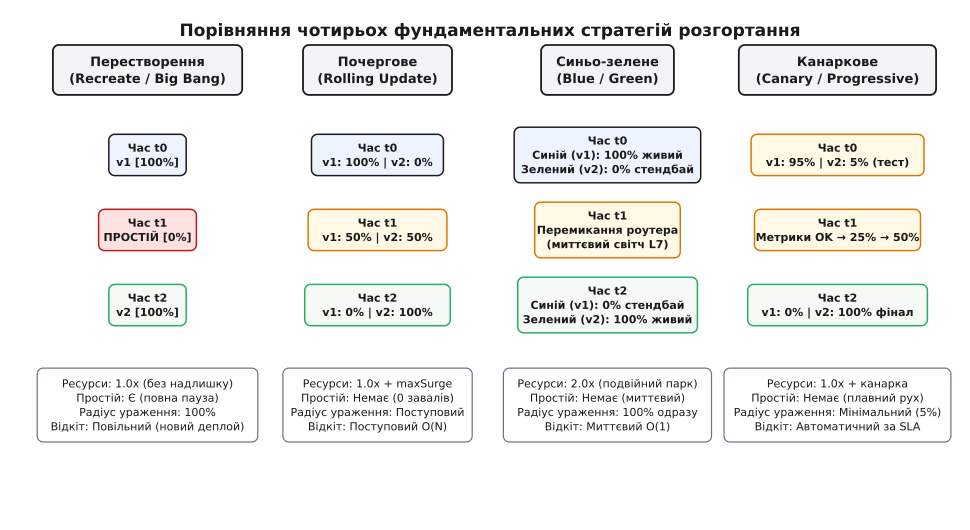
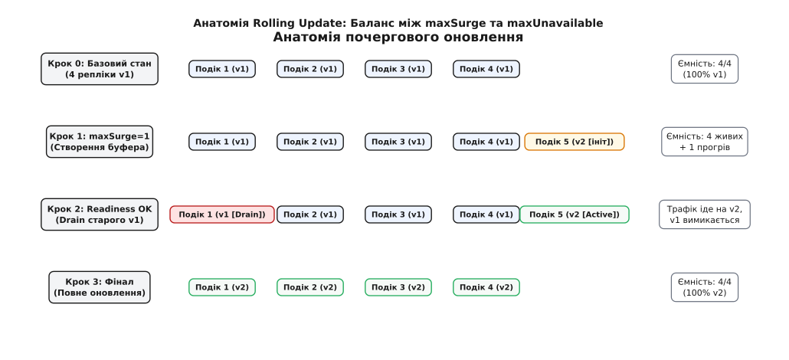
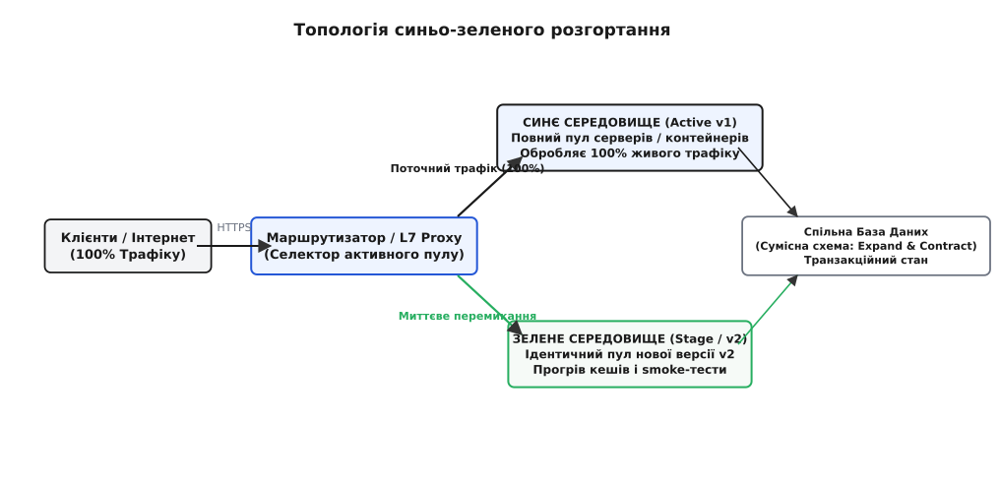
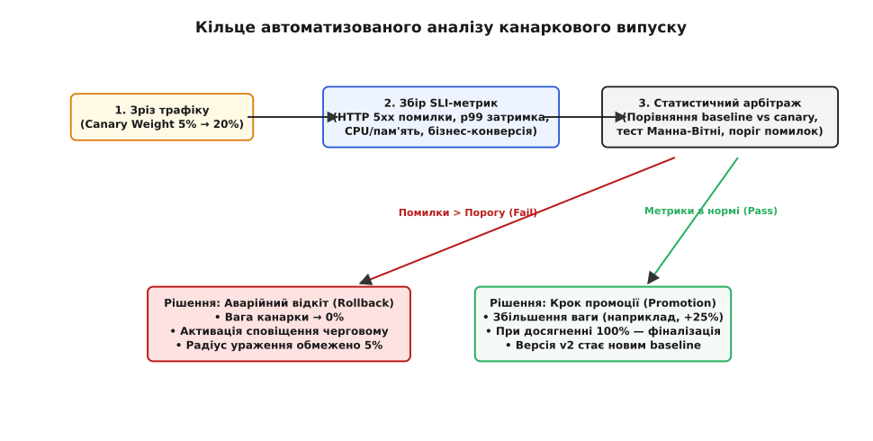

# Стратегії деплою: відтворюване оновлення, синьо-зелений, канарковий та rolling-випуск

<preknowlist>
- [Тактики експлуатованості й розгортуваності](topic:programming/operability-tactics) — якісні атрибути, що визначають легкість доставки змін і спостереження за живою системою.
- [Штатне вимкнення і drain](topic:programming/graceful-shutdown) — коректне завершення активних з'єднань і виведення вузлів з пулу балансування без втрати запитів.
- [Прапорці функцій](topic:programming/feature-flags) — відокремлення фізичного розгортання артефакту від активації бізнес-логіки.
- [Темний запуск і feature-flag-міграція](topic:programming/dark-launch) — асинхронне клонування реального трафіку для перевірки нового коду в тіні.
- [Метрики](topic:programming/metrics-monitoring) — числовий збір показників частоти помилок, затримок і насиченості в режимі реального часу.
- [CI/CD](topic:programming/ci-cd) — конвеєр автоматизованої перевірки, складання та розгортання змін на єдиному стовбурі.
</preknowlist>

Кластер із двадцяти вузлів обслуговує потік у 50 000 HTTP-запитів на секунду для платіжного шлюзу електронної комерції. Системний адміністратор ініціює оновлення сервісу шляхом одночасного виконання команди перезапуску служб (`systemctl restart payment-service`) на всіх серверах. У ту саму мілісекунду операційна система надсилає процесам фатальні сигнали, миттєво обриваючи понад 4 200 відкритих TCP-з'єднань, у яких клієнти вже передали кошти, але ще не отримали підтвердження транзакції. Мережевий балансувальник навантаження фіксує раптову недоступність усього пулу бекендів і починає генерувати шторм із тисяч відповідей `HTTP 502 Bad Gateway`.

Коли через вісім секунд нові процеси завершують завантаження, сотні мікросервісів одночасно намагаються встановити нові TCP-з'єднання з базою даних, створюючи сплеск із 15 000 паралельних підключень (англ. *thundering herd problem*), що переповнює пул бази даних і викликає відмову ядра транзакцій. Ті запити, які все ж пробиваються до нового коду, стикаються з нерозігрітим JIT-компілятором та порожніми локальними кешами: затримка обробки (перцентиль p99) підскакує з нормальних 25 мілісекунд до 9.4 секунди, спричиняючи каскадний колапс усіх залежних підсистем компанії.

Ця катастрофа демонструє наслідки наївного перезапуску програмного забезпечення на живій системі. Щоб змінювати виконуваний код під безперервним навантаженням без втрати жодного байта клієнтських даних і без деградації затримок, інженерія розробила спеціалізовані **стратегії розгортання** (англ. *deployment strategies*, від фр. *déployer* / лат. *displicare* — розгортати, розміщувати, виводити сили на позицію).

## Чотири вектори конфлікту: фундаментальний компроміс розгортання

Кожна стратегія розгортання є інженерною відповіддю на фундаментальний конфлікт чотирьох протилежних вимог:

```text
                        Доступність (Zero Downtime)
                                     ▲
                                     │
                                     │
         Швидкість відкочування ◄────┼────► Вартість ресурсів
         (MTTR: O(1) vs O(N))        │      (1.0x vs 2.0x Overhead)
                                     │
                                     ▼
                        Радіус ураження (Blast Radius)
```

1. **Доступність (Zero Downtime):** здатність системи безперервно приймати та коректно обслуговувати вхідний трафік клієнтів протягом усього періоду заміни програмного коду.
2. **Накладні витрати інфраструктури (Infrastructure Overhead):** додатковий обсяг обчислювальних потужностей (процесори, оперативна пам'ять, диски, IP-адреси), необхідний для паралельного розміщення нової версії поруч зі старою. Коефіцієнт варіюється від `1.0x` (оновлення на місці без запасу) до `2.0x` (повне подвоєння серверного парку).
3. **Радіус ураження (Blast Radius):** частка користувачів або запитів, які зіткнуться з помилками, якщо у випущеному релізі виявиться критичний прихований дефект (від 100% усієї аудиторії до 1–2% контрольованої вибірки).
4. **Швидкість аварійного відкочування (Mean Time to Rollback, MTTR):** час, необхідний для повного усунення збійної версії та повернення до попереднього стабільного стану (від миттєвого перемикання вказівника за мілісекунди `O(1)` до тривалого повторного розгортання старого коду `O(N)`).

[Історію того, як індустрія пройшла шлях від нічних вікон технічного обслуговування з магнітними стрічками до щогодинних релізів без зупинки систем](topic:programming/deployment-strategies/hist-deployment-evolution.md), варто вивчити окремо — вона показує, як боротьба з цими чотирма обмеженнями сформувала сучасний підхід до безперервної доставки.

> 🔧 **Навіщо це.** Жодна стратегія не є абсолютно універсальною. Якщо фінансовий бекенд вимагає суворого синьо-зеленого розгортання для миттєвого захисту від збоїв ціною подвоєння бюджету на сервери, то для внутрішнього аналітичного воркера обробки логів достатньо простого почергового або навіть перестворюваного оновлення.

## Інфраструктурні примітиви стратегій розгортання

Реалізація будь-якої стратегії розгортання спирається на три незалежні інфраструктурні площини:

```text
Площина маршрутизації: [ Вхідний трафік ] ──> [ L7 Балансувальник / Ingress ]
                                                        │ (Динамічна селекція)
                                                        ▼
Площина готовності:    [ Контролер ] ───(Зонди)───> [ Поди / Вузли v1 & v2 ]
                                                        │ (Startup / Readiness)
                                                        ▼
Площина завершення:    [ Ядро ОС ] ────(SIGTERM)──> [ Тіньовий дренаж з'єднань ]
```

### 1. Площина динамічної маршрутизації (Dynamic Routing Plane)
Щоб спрямовувати запити між старою (v1) та новою (v2) версіями, система потребує керованого шару перемикання. 

* **Рівень DNS (Domain Name System):** зміна A- або CNAME-записів домену. Найменш надійний метод для динамічного керування через агресивне кешування відповідей проміжними провайдерами та клієнтськими резолверами з ігноруванням значення TTL (англ. *Time to Live*). Перемикання через DNS може розтягуватися на години, що робить його непридатним для швидкого відкочування.
* **Рівень L4-балансувальників (IPVS, AWS NLB, Linux IP Virtual Server):** оперує сирими TCP/UDP-пакетами. Дозволяє миттєво підключати або відключати IP-адреси цільових серверів, проте не здатний аналізувати HTTP-заголовки, шляхи URL чи куки клієнтів.
* **Рівень L7-проксі (Envoy, NGINX, HAProxy, AWS ALB):** прикладний шар, що завершує TLS-з'єднання, аналізує структуру HTTP-запитів і виконує зважену маршрутизацію (наприклад, рівно 5% запитів на канарковий вузол) або маршрутизацію на основі заголовків авторизації.

#### Пастка довгоживучих з'єднань HTTP/2 та gRPC
При використанні сучасних бінарних протоколів (HTTP/2, HTTP/3, gRPC) клієнт відкриває єдине довгоживуче TCP-з'єднання і мультиплексує в ньому тисячі паралельних запитів. 

Якщо балансування виконується на рівні L4, балансувальник розподіляє лише сам факт встановлення TCP-сесії. Коли в кластері з'являються нові поди v2, існуючі клієнти не відкривають нових TCP-з'єднань і продовжують надсилати всі наступні RPC-виклики виключно на старі вузли v1. Щоб оновлення запрацювало, мережевий шар повинен функціонувати на рівні L7, розбираючи окремі HTTP/2 фрейми (`HEADERS` / `DATA`) та маршрутизуючи кожен логічний RPC-виклик окремо, або періодично відправляти клієнтам керівний кадр `GOAWAY` для примусового перевідкриття з'єднань.

### 2. Ієрархія зондів працездатності (Health Check Hierarchy)
Контролер розгортання не має права спрямовувати трафік на новий процес лише на тій підставі, що операційна система виділила йому PID. Процес проходить строгу трирівневу верифікацію:

* **Зонд запуску (Startup Probe):** захищає повільні процеси. Поки застосунок зчитує конфігурацію, компілює шаблони чи завантажує структури даних у пам'ять, цей зонд блокує виконання інших перевірок.
* **Зонд готовності (Readiness Probe):** виступає шлюзовим бар'єром для вхідного трафіку. Як тільки застосунок сигналізує про готовність приймати запити (наприклад, повертає `HTTP 200 OK` на маршруті `/healthz/ready`), балансувальник додає його IP-адресу в таблицю активних цілей. Провал зонда тимчасово виключає вузол із балансування без зупинки процесу.
* **Зонд живучості (Liveness Probe):** контролює факт відсутності зависань (deadlock) у працюючому процесі. Якщо застосунок перестав відповідати на перевірки, середовище виконання примусово перезапускає контейнер.

### 3. Механіка штатного завершення та дренажу (Graceful Drain)
Коли старий вузол підлягає знищенню, балансувальник переводить його в режим дренажу (англ. *connection draining*):
1. IP-адреса вузла негайно видаляється з реєстру активних бекендів, щоб нові запити на нього більше не надходили.
2. Процес отримує сигнал `SIGTERM` і перестає приймати нові з'єднання на сокеті `listen()`.
3. Усі відкриті TCP-з'єднання, які перебували в процесі обробки, отримують гарантоване часове вікно (наприклад, 30–60 секунд) для завершення відповіді та надсилання клієнту заголовка `Connection: close`.
4. Лише після вичерпання активних дескрипторів або закінчення тайм-ауту процес завершує роботу або знищується сигналом `SIGKILL`.

#### Затримка поширення маршрутних таблиць (Propagation Lag) та preStop Hook
У розподілених середовищах (зокрема Kubernetes) існує часовий лаг між моментом, коли контролер приймає рішення про видалення пода, і моментом, коли інформація про це доходить до всіх балансувальників:

```text
1. API-сервер: статус пода змінюється на Terminating.
2. kube-controller-manager: видаляє IP з об'єкта EndpointSlice (займає 100–500 мс).
3. kube-proxy / Envoy Ingress: зчитують новий EndpointSlice і оновлюють правила iptables / xDS (займає 500–2000 мс).
4. Клієнтський трафік: продовжує надходити на старий под протягом цих 2 секунд!
```

Якщо контейнер після отримання `SIGTERM` миттєво закриває сокет, ті запити, які балансувальник ще встиг відправити за старою маршрутною таблицею, обірвуться з помилкою `Connection Refused`. 

Щоб усунути цей стан перегонів, у конфігурацію контейнера додають життєвий гачок `preStop`:

```yaml
lifecycle:
  preStop:
    exec:
      command: ["/bin/sh", "-c", "sleep 5"]
```

Команда `sleep 5` затримує відправку сигналу `SIGTERM` на 5 секунд. За цей час мережеві балансувальники гарантовано встигають видалити IP-адресу пода з усіх таблиць маршрутизації, і лише після цього процес починає штатно вимикатися без втрати жодного запиту.

## Систематика чотирьох класичних стратегій розгортання

Розглянемо чотири фундаментальні моделі оновлення програмного забезпечення в розподілених системах:



*Порівняння чотирьох фундаментальних стратегій розгортання: перерозподіл ємності, наявність простою, динаміка перемикання трафіку та ресурсні вимоги на кожному етапі життєвого циклу.*

### 1. Стратегія перестворення (Recreate / Big Bang)
Найпростіший підхід: усі екземпляри версії v1 зупиняються одночасно. Після того як усі старі процеси завершили роботу, запускаються екземпляри нової версії v2.

```text
Час t0: [ v1 ] [ v1 ] [ v1 ] [ v1 ] ──> 100% Трафіку
Час t1: [  ЗУПИНКА  ] [  ЗУПИНКА  ] ──> 0% Трафіку (ПОВНИЙ ПРОСТІЙ СИСТЕМИ)
Час t2: [ v2 ] [ v2 ] [ v2 ] [ v2 ] ──> 100% Трафіку відновлено
```

Тривалість простою (англ. *downtime window*) визначається сумою чотирьох послідовних інтервалів:

```text
T_downtime = T_drain(v1) + T_stop(v1) + T_boot(v2) + T_warmup(v2)
```

Де:
* `T_drain(v1)` — час завершення активних запитів старої версії.
* `T_stop(v1)` — час зупинки процесів та звільнення портів операційної системи.
* `T_boot(v2)` — час завантаження бінарного файлу нової версії, ініціалізації середовища виконання та завантаження бібліотек.
* `T_warmup(v2)` — час проходження перших зондів готовності та прогріву кешів.

**Коли застосування неминуче:**
* **Монопольні апаратні блокування:** сервіс безпосередньо керує фізичним пристроєм (наприклад, послідовним портом COM/tty, апаратним криптографічним модулем HSM або контролером верстата), який підтримує суворо одне відкрите системне з'єднання.
* **Несумісні руйнівні міграції бази даних:** нова версія змінює первинні ключі таблиці з ексклюзивним блокуванням `ALTER TABLE ... ACCESS EXCLUSIVE`, що унеможливлює паралельне читання старою версією.
* **Singleton State Machines:** сервіс виконує роль єдиного лідера або координатора розподіленого консенсусу, одночасне існування двох копій якого призводить до роздвоєння свідомості (англ. *split-brain*).

### 2. Почергове оновлення (Rolling Update / Ramped)
Почергове оновлення замінює старі вузли новими поступово, невеликими пачками (англ. *batches*), гарантуючи збереження працездатності кластера.



*Анатомія почергового оновлення: керування буфером maxSurge та лімітом недоступності maxUnavailable забезпечує безперервну ємність кластера під час заміни подів.*

Математика процесу спирається на два граничні параметри:
1. `maxSurge` — додатковий буфер тимчасових подів понад базову кількість `N`.
2. `maxUnavailable` — ліміт допустимого тимчасового зниження робочої ємності відносно `N`.

Мінімальна та максимальна ємність кластера в будь-який момент часу обмежена нерівністю:

```text
N - maxUnavailable ≤ Current_Active_Pods ≤ N + maxSurge
```

#### Покрокова механіка кроку:
1. Контролер створює нові поди v2 у кількості `maxSurge`.
2. Нові поди проходять ініціалізацію та зонд `startupProbe`.
3. Коли зонд `readinessProbe` підтверджує готовність нових подів, балансувальник підключає їх до живого трафіку.
4. Контролер обирає еквівалентну кількість подів старої версії v1, надсилає їм сигнал `SIGTERM` і запускає процедуру дренажу.
5. Після повного завершення старих процесів цикл повторюється для наступної пачки, доки частка версії v2 не досягне 100%.

**Небезпека співіснування двох версій (Dual-Version Hazard):**
Протягом усього часу розгортання в одному пулі балансування одночасно працюють сервери v1 та v2. Користувач, який здійснює послідовні переходи між сторінками сайту, може перший запит виконати на версії v1, другий — на v2, а третій — знову на v1.

Це породжує такі ризики:
* **Несумісність форматів серіалізації:** якщо версія v2 записує дані в спільний Redis-кеш або сесійне сховище в новому бінарному форматі, сусідній сервер v1 при спробі десеріалізації зазнає падіння з помилкою `UnmarshalException`.
* **API Drift:** зміна схеми JSON-відповіді змушує фронтенд отримувати різні структури даних на сусідніх кліках користувача.
* **Повільний відкіт:** якщо на 90% завершення розгортання виявляється критична помилка, повернення назад вимагає зворотного почергового деплою версії v1, що займає час `O(N / batch_size)`.

### 3. Синьо-зелене розгортання (Blue-Green / Red-Black)
Синьо-зелений підхід повністю усуває проблему одночасного співіснування двох версій під трафіком.



*Топологія синьо-зеленого розгортання: два повністю ізольовані пули серверів; балансувальник миттєво перемикає 100% трафіку після завершення перевірок у фоновому середовищі.*

#### Механізм роботи:
1. **Синє середовище (Blue):** повністю укомплектований робочий кластер, на який маршрутизатор спрямовує 100% клієнтського трафіку (версія v1).
2. **Зелене середовище (Green):** ідентичний незалежний кластер, на який розгортається нова версія v2. На цьому етапі Зелене середовище отримує 0% користувацького трафіку.
3. **Верифікація та прогрів:** інженери та автоматизовані конвеєри запускають комплексні наскрізні тести (E2E / Smoke Tests) проти Зеленого середовища через службовий внутрішній домен (наприклад, `preview.example.com`). Виконується прогрів внутрішніх пулів, компіляція кешів та перевірка зв'язку з базами даних.
4. **Миттєвий світч (Cutover):** L7-балансувальник або Ingress-контролер атомарно перемикає вказівник активного пулу з Blue на Green за кілька мілісекунд.
5. **Миттєвий відкіт `O(1)`:** якщо після перемикання графік моніторингу фіксує аномалії, балансувальник негайно повертає вказівник назад на Синій кластер. Старий код не знищується протягом кількох годин (параметр `scaleDownDelaySeconds`), забезпечуючи миттєвий захист системи.

#### Фізика холодного кешу та стратегії попереднього прогріву (Pre-warming)
У момент перемикання 100% реального трафіку (наприклад, 50 000 RPS) миттєво обрушується на Зелене середовище. Якщо нова версія стартує з «холодним» станом, виникають три критичні проблеми:

1. **JIT-компіляція (JVM / V8 / .NET):** середовище виконання починає компілювати гарячі методи байткоду в машинний код безпосередньо під піковим навантаженням. Усі процесорні ядра завантажуються на 100% фоновими завданнями компілятора, а час обробки запитів зростає в 10–20 разів.
2. **Шторм запитів до бази даних (Cache Stampede):** оскільки локальні кеші в оперативній пам'яті (L1 Cache) порожні, кожен вхідний запит змушений звертатися до первинної бази даних, викликаючи вичерпання пулу з'єднань.
3. **Холодні пули TCP-з'єднань:** встановлення тисяч нових SSL/TLS сесій до зовнішніх платіжних шлюзів створює додаткову затримку криптографічних рукостискань.

Щоб запобігти колапсу, застосовують режим **повільного старту** (англ. *Slow Start Mode* в Envoy/NGINX) або синтетичний прогрів: перед перемиканням основного селектора на Зелений пул подається 100% клонованого тіньового трафіку або спеціальний генератор навантаження проганяє типові сценарії користувачів протягом 5–10 хвилин.

### 4. Канарковий випуск та прогресивна доставка (Canary Release & Progressive Delivery)
Канарковий випуск мінімізує радіус ураження шляхом поступового, строго контрольованого переведення невеликої частки живого трафіку на нову версію.



*Кільце автоматизованого аналізу канаркового випуску: замкнений цикл зваженого зрізу трафіку, збору метрик, статистичного арбітражу та прийняття рішення про промоцію або відкіт.*

#### Способи виділення канаркового трафіку:
* **Зважений зріз (Weighted Splitting):** генератор псевдовипадкових чисел або консистентний геш спрямовує фіксований відсоток (наприклад, 1%, потім 5%, 25%, 50%) усіх вхідних запитів на канарковий набір реплік.
* **Сегментація за HTTP-заголовками:** запити спрямовуються на канарку лише за наявності спеціального заголовка (наприклад, `X-Canary-Test: true`), що дозволяє внутрішнім співробітникам компанії тестувати нову версію в реальному продакшені.
* **Когортна маршрутизація:** канарковий реліз відкривається для жителів конкретного регіону, користувачів певної версії мобільного застосунку або за списком тестових організацій (англ. *beta testers cohort*).

#### Автоматизований аналіз канарки (Automated Canary Analysis, ACA):
Сучасна прогресивна доставка не покладається на ручний погляд чергового інженера. Спеціальний контролер безперервно збирає показники якості обслуговування (SLI) одночасно з двох пулів: **Baseline (контрольна версія v1)** та **Canary (тестована версія v2)**.

Аналізуються такі метрики:
1. **Частка помилок (Error Rate):** співвідношення відповідей `HTTP 5xx` до загальної кількості запитів.
2. **Хвостові затримки (Tail Latency):** перцентилі затримки `p95` та `p99`.
3. **Насиченість ресурсів:** утилізація CPU, споживання оперативної пам'яті та частота циклів збирача сміття (GC Pause Time).
4. **Бізнес-показники:** конверсія оформлення замовлень, успішність авторизацій користувачів.

Для порівняння метрик застосовують непараметричні статистичні тести (зокрема ранговий критерій Манна-Вітні, англ. *Mann-Whitney U test*), що дозволяє відрізнити реальну деградацію коду від випадкових статистичних коливань мережі. Якщо метрики канарки статистично гірші за базову лінію, контролер негайно обнуляє вагу трафіку та ініціює аварійний відкіт.

[Практичну реалізацію високопродуктивного контролера маршрутизації з кільцевим буфером ковзного вікна та автоматичним відкочуванням](topic:programming/deployment-strategies/proj-deployment-router.md) варто розглянути як приклад того, як цей алгоритм вбудовується безпосередньо у мережеві шлюзи.

## Спектр споріднених практик: Канарка, Темний запуск та A/B тестування

В інженерній практиці часто виникає термінологічна плутанина між трьома близькими, але принципово різними підходами до випуску змін:

| Характеристика | Темний запуск (Dark Launch) | Канарковий випуск (Canary) | A/B Тестування (A/B Testing) |
| :--- | :--- | :--- | :--- |
| **Головна мета** | Перевірка навантаження та стабільності бекенду | Мінімізація радіуса ураження від технічних збоїв | Перевірка бізнес-гіпотез та поведінки користувачів |
| **Хто бачить результат** | **Ніхто (відповідь кандидата знищується)** | 1–5% реальних користувачів | 50% користувачів бачать варіант А, 50% — варіант Б |
| **Рівень реалізації** | L7 Reverse Proxy (дублювання запитів) | Мережевий контролер маршрутизації (L7 Proxy / Ingress) | Код застосунку (прапорці функцій `if/else`) |
| **Критерій успіху** | Побітна ідентичність даних та стабільність CPU | Низька частка помилок 5xx та нормальні затримки | Зростання конверсії, кліків, прибутку чи часу на сайті |
| **Тривалість фази** | Години або дні | Хвилини або години | Тижні або місяці (досягнення статзначущості) |

**Темний запуск** перевіряє код «у темряві»: користувач гарантовано захищений від будь-яких помилок, оскільки результат нової версії відкидається. **Канарковий випуск** спрямовує невелику частку реальних користувачів на новий код для технічної перевірки системи. **A/B тестування** вивчає психологію та реакцію користувачів на нову функціональність (наприклад, колір кнопки оформлення замовлення).

## Станційні застосунки та дискові томи (StatefulSet Deployments)

Оновлення безстанційних вебсерверів кардинально відрізняється від оновлення станційних систем (баз даних PostgreSQL, кластерів Cassandra, Elasticsearch, брокерів Kafka). Станційні вузли мають індивідуальну ідентичність (`db-0`, `db-1`, `db-2`) і прив'язані до конкретних блокових пристроїв збереження даних (PersistentVolumeClaim).

Під час оновлення об'єктів `StatefulSet` у Kubernetes діють специфічні правила:
1. **Суворий зворотний порядок (Strict Reverse Order):** поди оновлюються строго по одному, починаючи з найбільшого порядкового номера (`db-N-1 → ... → db-0`). Наступний под не починає оновлюватися, поки попередній не перейде в стан `Running` та `Ready`.
2. **Затримка перемонтажу дисків (Volume Detach/Attach Latency):** хмарні провайдери (AWS EBS, Google Persistent Disk) вимагають до 30–90 секунд на операцію відключення дискового тому від старого фізичного сервера та підключення до нового.
3. **Збереження кворуму розподіленого консенсусу (Quorum Invariant):** для кластерів із консенсусом Raft або Paxos (etcd, ZooKeeper) неприпустимо одночасно перезапускати більше, ніж `(N - 1) / 2` вузлів, інакше кластер втратить здатність обирати лідера та заблокує запис.

## Специфіка розгортання асинхронних обробників і черг повідомлень

Якщо HTTP-сервіси перебувають під прямим захистом балансувальника навантаження, то фонові обробники повідомлень (воркери Kafka, RabbitMQ, Amazon SQS) не мають проміжного маршрутизатора. Вони самостійно витягують завдання з брокера (англ. *pull model*).

Оновлення таких систем вимагає особливих інженерних технік:

```text
Брокер повідомлень (Kafka) ──┬──> [ Воркер 1 (v1) ] ──> Читає формат V1
                             └──> [ Воркер 2 (v2) ] ──> Читає формати V1 та V2
```

1. **Паузи ребалансування (Kafka Group Rebalance):** При зупинці подів воркера v1 кластер Kafka фіксує втрату споживача та запускає протокол ребалансування партицій. У застарілих версіях протоколу це викликало повну зупинку обробки повідомлень (Stop-the-World) для всіх інших воркерів на десятки секунд. Сучасні оркестрації вимагають застосування кооперативного ліпкого розподілу (англ. *Cooperative Sticky Assignor*) та статичного членства в групі (англ. *Static Group Membership*), що дозволяє перезапускати воркери без глобального ребалансування.
2. **Дренаж повідомлень без підтвердження (In-Flight Messages Drain):** Отримавши сигнал `SIGTERM`, воркер перестає брати нові повідомлення з черги, завершує обробку вже взятих завдань, фіксує зміщення (англ. *commit offset* або `ACK`) і лише після цього завершує процес. Якщо воркер вбито примусово до завершення завдання, брокер повторно віддасть це повідомлення іншому воркеру після закінчення тайм-ауту видимості, що може викликати подвійне списання коштів за відсутності ідемпотентності бізнес-логіки.
3. **Маршрутизація отруйних повідомлень (Dead Letter Queues, DLQ):** Якщо нова версія воркера v2 не здатна розпарсити старий формат повідомлення, спроба нескінченного повтору (retry loop) призводить до блокування черги. Повідомлення після трьох невдалих спроб автоматично скидається в ізольовану чергу аварійних повідомлень (DLQ) для подальшого ручного аудиту інженерами.

## Мультирегіональне хвильове розгортання (Phased Wave Rollout)

У глобально розподілених системах із десятками датацентрів реліз виконується поетапними географічними хвилями (англ. *phased rings*):

```text
[ Ring 0: Внутрішній стенд (Dogfooding) ] ──> 1 доба спостереження
                   │
                   ▼
[ Ring 1: Регіон з найменшим трафіком (Canary Region) ] ──> 12 годин аналізу
                   │
                   ▼
[ Ring 2: Основні робочі регіони (50% глобального парку) ] ──> 6 годин
                   │
                   ▼
[ Ring 3: Повне глобальне розгортання (100%) ]
```

Така ешелонована схема захищає бізнес від глобального блекауту: якщо нова версія містить дефект, який проявляється лише через кілька годин роботи (наприклад, повільний витік файлових дескрипторів), збій буде локалізовано в межах одного невеликого регіону, а глобальний трафік автоматично перенаправиться на сусідні робочі кластери через протокол Anycast BGP або глобальний GeoDNS.

## Проблема сумісності стану: база даних і патерн паралельних змін

Жодна стратегія розгортання — навіть найдосконаліший канарковий випуск — не здатна захистити систему від збою, якщо розробники спробують виконати руйнівну зміну схеми бази даних (наприклад, перейменувати колонку таблиці) одночасно з релізом коду.

Якщо колонка `phone` перейменовується на `phone_number` за допомогою команди `ALTER TABLE`, стара версія коду v1, яка все ще обробляє 95% трафіку, негайно почне завершуватися помилками `ColumnNotFoundException`, оскільки очікує старе ім'я поля.

Для вирішення цієї проблеми застосовують **патерн паралельних змін** (англ. *Parallel Change*, або *Expand and Contract Pattern*):

```text
Фаза 1: РОЗШИРЕННЯ (Expand)
  [ БД: phone (стара) + phone_number (нова, nullable) ]
  [ Код v1: читає phone, пише в phone ]
  [ Тригер БД або фоновий процес: копіює дані з phone у phone_number ]

Фаза 2: ПЕРЕХІД (Transition & Deploy v2)
  [ Деплой коду v2 через Rolling / Blue-Green / Canary ]
  [ Код v2: читає phone_number, пише в ОБИДВІ колонки phone та phone_number ]
  [ Код v1: читає phone, пише в ОБИДВІ колонки ]

Фаза 3: СТИСКАННЯ (Contract)
  [ Бекфіл: перенесення 100% історичних даних у phone_number ]
  [ Код v3: читає і пише виключно в phone_number ]
  [ БД: видалення застарілої колонки phone через DROP COLUMN ]
```

Правило сумісності формулюється категорично: **будь-яка зміна схеми бази даних повинна підтримувати одночасну роботу коду версії `N` та коду версії `N+1`**. Лише за дотримання двофазного розширення та стискання схеми можливий безперебійний деплой за будь-якою стратегією.

## Декларативні специфікації та керування політиками

У сучасних платформах оркестрації (Kubernetes, Argo Rollouts, Flagger, Istio) конфігурація стратегій описується у вигляді декларативних маніфестів. Інженери задають часові бар'єри стабілізації (`minReadySeconds`), допустимі перевищення потужностей (`maxSurge`), PromQL-запити для перевірки частоти помилок та затримок, а також інтеграційні вебхуки для автоматизованого навантажувального тестування.

[Повний довідник декларативних специфікацій, структур даних та контрактів валідації для Kubernetes, Argo Rollouts та Istio](topic:programming/deployment-strategies/api-deployment-spec.md) надає детальний розбір усіх полів конфігурації та прикладів виробничих маніфестів.

## Матриця прийняття рішень: критерії вибору стратегії

Вибір оптимальної стратегії здійснюється на основі аналізу технічних обмежень системи та вимог бізнесу до надійності:

| Критерій | Перестворення (Recreate) | Почергове (Rolling Update) | Синьо-зелене (Blue-Green) | Канаркове (Canary) |
| :--- | :--- | :--- | :--- | :--- |
| **Допустимість простою** | Допустимий (нічні вікна) | **Неприпустимий (Zero Downtime)** | **Неприпустимий (Zero Downtime)** | **Неприпустимий (Zero Downtime)** |
| **Накладні витрати ресурсів** | **0% (коефіцієнт 1.0x)** | Малі (коефіцієнт `1.0x + maxSurge`) | **Високі (+100%, коефіцієнт 2.0x)** | Малі (+5–10% на канарковий вузол) |
| **Радіус ураження багом** | 100% користувачів | Поступовий (пачками по 10–25%) | 100% користувачів (після світчу) | **Мінімальний (1–5% вибірки)** |
| **Швидкість відкочування** | Повільна (повторний деплой) | Поступова `O(N / batch)` | **Миттєва `O(1)` (перемикання L7)** | **Автоматична та швидка (скидання ваги)** |
| **Співіснування v1 та v2** | Ні (суворо розділені в часі) | **Так (працюють в одному пулі)** | Ні (ізольовані кластери) | **Так (одночасна обробка трафіку)** |
| **Складність інфраструктури**| Мінімальна (простий перезапуск)| Середня (вбудована в Kubernetes) | Висока (дублювання стеків) | Найвища (Service Mesh / ACA арбітри) |

### Типові інженерні пастки та способи захисту

1. **Мерехтіння готовності під навантаженням (Probe Flapping):** Якщо зонд готовності `/healthz/ready` виконує важкі SQL-запити до бази даних, під піковим навантаженням він починає повертати тайм-аути. Оркестратор видаляє под із балансування, навантаження на решту вузлів зростає, викликаючи лавиноподібне відключення всього кластера. Зонди готовності повинні перевіряти виключно локальний стан процесу в пам'яті за константний час `O(1)`.
2. **Тупикова ситуація з квотами ресурсів (Quota Deadlock):** Якщо кластер не має запасу CPU/RAM для створення нових подів за параметром `maxSurge`, а параметр `maxUnavailable: 0` забороняє знищувати старі поди, оновлення назавжди зависає у стані блокування.
3. **Шторм перепідключень до бази даних (Connection Burst):** При масовому одночасному запуску нових контейнерів кожен із них створює пул із 50 з'єднань до бази. Якщо оновлюється 100 подів, база даних отримує 5 000 одночасних рукостискань TCP/TLS. Для захисту застосовують проміжні пулери з'єднань (PgBouncer, ProxySQL) та експоненційну затримку ініціалізації (англ. *jittered backoff*).
4. **Зависання DNS-кешу при аварійному відкочуванні:** Якщо синьо-зелене перемикання реалізовано через зміну DNS-записів замість L7-проксі, провайдери з порушенням стандарту RFC можуть кешувати адресу збійного Зеленого кластера на 24 години, зводячи нанівець спроби термінового відкочування.
