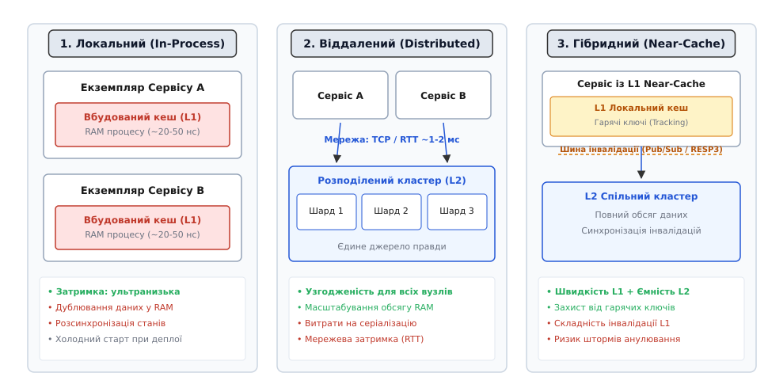
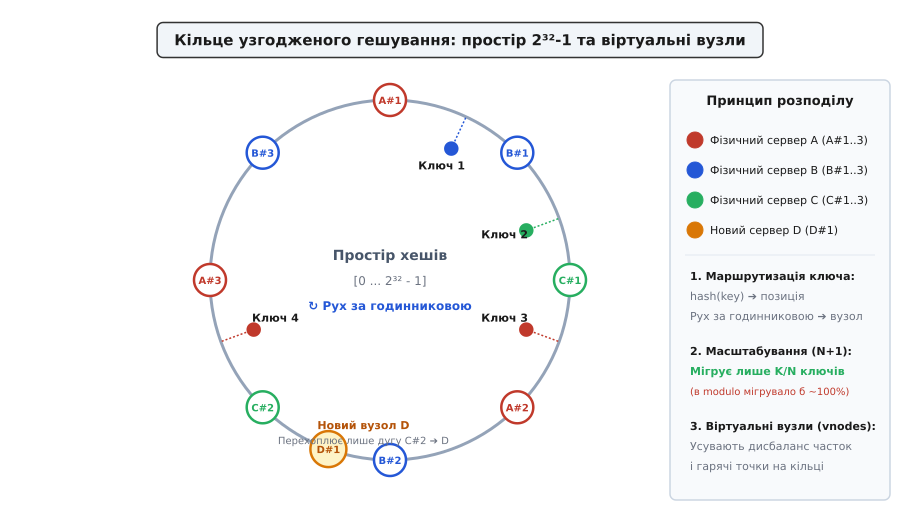
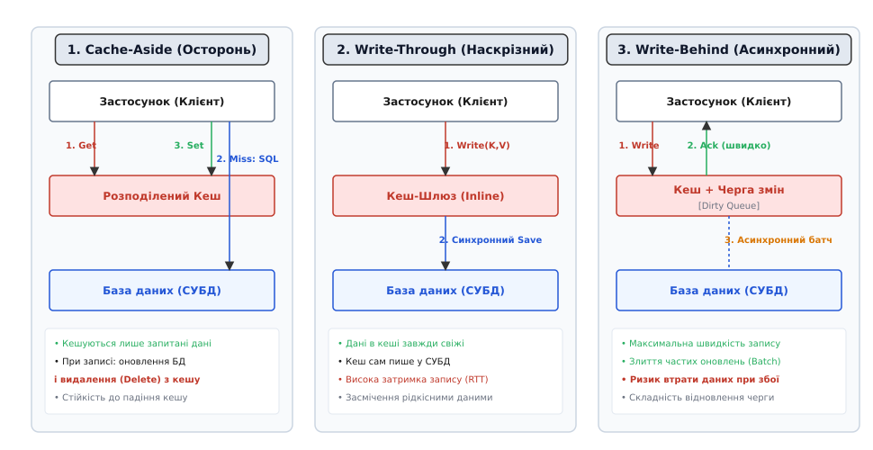
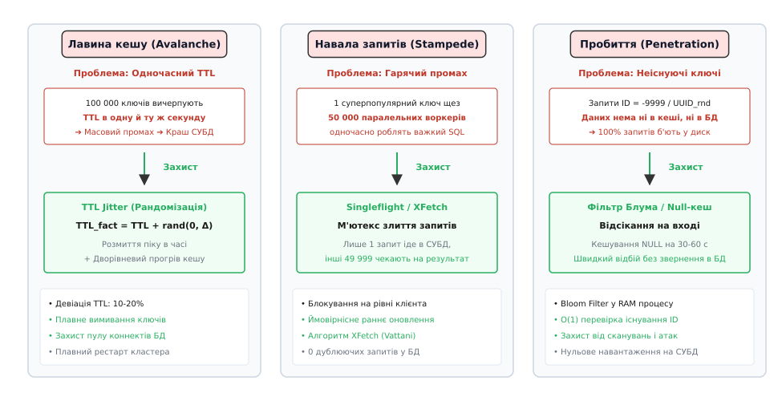
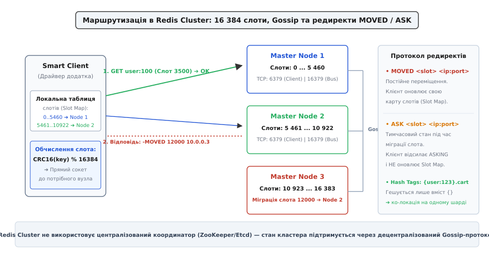

# Розподілені архітектури кешування: топології, шардинг, узгоджене гешування, протоколи інвалідації та стійкість під навантаженням

<preknowlist>
- [Кеш](book:programming/cache) — ієрархія пам'яті, принципи часової та просторової локальності даних.
- [Шардинг](book:programming/partitioning-sharding) — горизонтальне розбиття масивів даних на незалежні вузли за ключем.
- [Метрики](book:programming/metrics-monitoring) — числовий моніторинг затримок p99, частоти запитів і коефіцієнтів утилізації пам'яті.
- [Свіжість проти навантаження](book:programming/cache-consistency-tradeoff) — фундаментальний компроміс між узгодженістю кешованої копії та тиском на первинне сховище.
- [Тактики продуктивності](book:programming/performance-tactics) — архітектурні механізми зниження часу очікування та підвищення пропускної здатності.
</preknowlist>

Сервіс бронювання квитків на стадіонний концерт відкриває продажі: за перші сорок секунд надходить понад 180 000 одночасних запитів від користувачів, які намагаються переглянути інтерактивну карту вільних місць. Кожен веб-сервер застосунку тримає локальну копію стану секторів у власній оперативній пам'яті процесу (`In-Process Cache`). Під час оформлення перших замовлень веб-сервер A успішно резервує ряд крісел і оновлює свій локальний стан у пам'яті, проте інші тридцять серверів за балансувальником навантаження не отримують жодного сповіщення про цю зміну через відсутність міжпроцесної синхронізації.

Користувачі, підключені до інших серверів, бачать ті самі місця вільними та ініціюють паралельну оплату. За десять секунд у системі виникає понад 4 200 конфліктних транзакцій подвійного продажу (англ. *double booking*). Коли додатки намагаються скинути локальні кеші й напряму прочитати актуальний стан із реляційної СУБД, 180 000 паралельних важких SQL-запитів миттєво вичерпують пул підключень бази даних. Навантаження на дискову підсистему зростає до 100%, час очікування відповіді перевищує 30 секунд, і вся транзакційна система зазнає каскадного колапсу.

Ця аварія демонструє межу локального кешування: ізольовані екземпляри процесів у розподіленому середовищі неминуче розсинхронізуються, а спроба відмовитися від кешу на користь прямого звернення до СУБД перевантажує базу даних. Щоб поєднати швидкість доступу оперативної пам'яті з гарантією єдиного узгодженого джерела правди для сотень незалежних серверів, застосовують **розподілені архітектури кешування** (англ. *distributed caching architectures*, від лат. *distribuere* — розділяти, наділяти частинами, та фр. *cacher* — ховати, зберігати запас).

[Еволюцію розподіленого кешування від перших скриптів LiveJournal до кластерів Facebook і Redis](book:programming/operations/distributed-caching-architectures/hist-caching-evolution.md) варто розглянути окремо — вона пояснює, як інженерна боротьба з дисковими затримками баз даних сформувала сучасні протоколи швидкої пам'яті.

## Фізична природа та три базові топології кешування

Кешування спирається на два емпіричні закони комп'ютерних систем: часову локальність (англ. *temporal locality*, дані, до яких зверталися щойно, з високою ймовірністю знадобляться знову найближчим часом) та просторову локальність (англ. *spatial locality*, звернення до суміжних елементів пам'яті). Проте в розподілених системах до законів локальності додається фактор мережевих затримок і розподіленого консенсусу.

Вибір архітектурного розташування кешу визначає компроміс між затримкою зчитування (Latency), споживанням пам'яті (Memory Overhead) та складністю підтримання узгодженості (Cache Consistency).


*Три фундаментальні топології кешування: ізольований локальний кеш у процесі, виділений віддалений кластер та дворівневий Near-Cache із шиною інвалідації.*

### 1. Локальний кеш у пам'яті процесу (In-Process / Embedded Cache)

Кеш реалізується як структура даних (`std::unordered_map`, `ConcurrentHashMap`, `LRU-cache` на базі геш-таблиці та двобічно зв'язаного списку) безпосередньо в адресному просторі кожного екземпляра мікросервісу.

```text
Переваги:
  • Мінімальна затримка: доступ за 10–50 наносекунд (пряме читання покажчика в RAM).
  • Нульові витрати на серіалізацію та десеріалізацію об'єктів (Zero-Copy).
  • Відсутність мережевих збоїв, таймаутів та дескрипторів сокетів.

Недоліки:
  • Дублювання даних: якщо розгорнуто 50 реплік сервісу, одна й та сама сутність
    зберігається в оперативній пам'яті 50 разів, зменшуючи корисну ємність кластера.
  • Розсинхронізація станів: запис у сервісі A залишає старі дані в пам'яті сервісів B, C, D.
  • Холодний старт при деплої: кожне оновлення версії сервісу (Rolling Restart)
    повністю знищує локальний кеш, спрямовуючи шквал запитів на первинну СУБД.
  • Тиск на Garbage Collector: мільйони довгоживучих об'єктів у Heap-пам'яті кешу
    викликають тривалі паузи збирання сміття (Stop-the-World GC Pauses на секунди).
```

### 2. Виділений віддалений кластер (Distributed Remote Cache)

Кеш виноситься в окремий незалежний шар серверів оперативної пам'яті (кластери Redis, Memcached, Dragonfly, KeyDB, Hazelcast, Apache Ignite). Усі мікросервіси застосунку звертаються до кешу через мережеві TCP-сокети за стандартизованими бінарними або текстовими протоколами (RESP, Memcached binary).

```text
Переваги:
  • Єдине джерело правди: оновлення або видалення ключа миттєво стає видимим для всіх вузлів.
  • Еластичне горизонтальне масштабування: обсяг пам'яті кешу не обмежений RAM однієї машини.
  • Переживає деплої застосунків: перезапуск мікросервісів не очищає прогріті дані в кеші.
  • Ізоляція від GC застосунку: процеси кешу мають власні оптимізовані механізми пам'яті (Jemalloc).

Недоліки:
  • Мережева затримка: RTT (Round Trip Time) становить 0.5–2.0 мілісекунди (у 10 000 разів довше за RAM).
  • Накладні витрати на серіалізацію: сервіси змушені пакувати об'єкти в JSON, Protobuf або RESP.
  • Мережеве вузьке місце: вичерпання пропускної здатності мережевих карт (NIC Saturation).
```

### 3. Дворівневий гібридний кеш (Near-Cache / L1 + L2 Cache)

Поєднує переваги обох підходів: найбільш гарячі ключі зберігаються локально в пам'яті процесу (L1), а повний обсяг терабайтного масиву даних живе у віддаленому розподіленому кластері (L2).

Зчитування виконується за схемою послідовного каскаду:
1. Запит шукає ключ у локальному кеші L1 (`~20 нс`).
2. У разі промаху запит іде у віддалений кластер L2 (`~1 мс`).
3. Якщо ключ знайдено в L2, він повертається клієнту і зберігається в локальному L1 із коротким терміном життя.
4. Якщо ключа немає і в L2, відбувається звернення до первинної реляційної чи документної бази даних.

Головним інженерним викликом топології Near-Cache є **інвалідація першого рівня**: коли вузол A змінює дані в базі даних та L2-кластері, він зобов'язаний надіслати повідомлення про інвалідацію всім іншим вузлам. Якщо зв'язок втрачено, виникає шторм застарілих читань (Stale Reads). Для координації застосовують шину публікації/підписки (Pub/Sub) або вбудований протокол асиметричного відстеження на стороні клієнта (RESP3 Client-Side Tracking).

> 🔧 **Навіщо це.** Дворівневий Near-Cache є єдиним архітектурним рішенням для обробки ультрагарячих ключів (англ. *Hotspot Keys*, наприклад, конфігурації системи, каталогу топових товарів або профілю світової знаменитості). Якщо 200 000 клієнтів одночасно зчитують один і той самий ключ, віддалений шард Redis вичерпає пропускну здатність процесорного ядра; локальний L1-кеш відсікає 99.9% цих запитів усередині оперативної пам'яті клієнтських мікросервісів.

## Шардинг та узгоджене гешування

Коли загальний обсяг даних кешу перевищує фізичний обсяг оперативної пам'яті одного сервера (наприклад, 500 ГБ даних при максимальному модулі пам'яті сервера 128 ГБ) або частота запитів перевищує пропускну здатність одного процесорного ядра (у Redis одне ядро обробляє близько 100 000–150 000 операцій на секунду), дані розбиваються на незалежні фрагменти — **шарди** (англ. *shards*).

### Катастрофа наївного гешування за модулем

Найпростіший спосіб розподілити ключі між `N` серверами — обчислити хеш ключа та взяти залишок від ділення на кількість серверів:

```text
node_index = hash(key) mod N
```

Ця формула має фатальний дефект масштабування. Якщо в кластері з `N = 10` вузлів один сервер зазнає аварії (`N = 9`) або додається новий сервер під пікове навантаження (`N = 11`), знаменник змінюється. У результаті залишок від ділення змінюється для **більш ніж 90% усіх наявних ключів**.

Майже весь обсяг кластера кешу раптово стає марним: клієнти починають шукати старі ключі на інших вузлах, де їх немає. Виникає миттєвий масовий промах кешу (Cold Cache Drop), і весь потік запитів падає на базу даних, викликаючи її повне відключення.

### Кільце узгодженого гешування (Consistent Hashing Ring)

Для вирішення проблеми динамічного масштабування Девід Каргер та співавтори у 1997 році запропонували алгоритм **узгодженого гешування** (англ. *Consistent Hashing*).


*Кільце узгодженого гешування: простір хешів 2³²-1, прив'язка ключів за годинниковою стрілкою, віртуальні вузли та локалізована міграція при додаванні нового сервера.*

Механізм функціонує наступним чином:
1. Простір значень геш-функції уявляється у вигляді замкненого кільця від `0` до `2³² - 1` (або `2⁶⁴ - 1`).
2. Кожен фізичний сервер кешу гешується за своєю IP-адресою чи ідентифікатором і розміщується у певній точці на кільці.
3. Коли потрібно записати чи прочитати ключ `k`, клієнт обчислює `hash(k)` і шукає першу точку сервера на кільці, рухаючись **за годинниковою стрілкою**.

При додаванні нового сервера `N+1` він перехоплює лише невеликий сегмент кільця між собою та попереднім вузлом. Усі інші сегменти кільця залишаються недоторканими. Математично доведено, що частка ключів, які змінюють своє розташування, становить рівно:

```text
Частка міграції = 1 / (N + 1)
```

Для кластера з 10 серверів при додаванні одинадцятого мігрує лише `1 / 11 ≈ 9.09%` ключів, тоді як решта 90.91% продовжують обслуговуватися без промахів.

### Віртуальні вузли (Virtual Nodes / Vnodes)

Якщо розмістити на кільці лише фізичні сервери, випадковий розподіл створить нерівномірні інтервали: один сервер отримає 60% простору кільця, а інший — 5%.

Щоб усунути дисбаланс, кожен фізичний сервер проєктується на кільце як множина з `V` **віртуальних вузлів** (зазвичай `V = 100 ... 256` точок з іменами `ServerA#1`, `ServerA#2`, ..., `ServerA#V`). Віртуальні вузли рівномірно перемішуються на кільці, знижуючи статистичне відхилення навантаження між фізичними серверами до менш ніж 3–5%.

[Математичні доведення мінімальної міграції ключів та стохастичний аналіз алгоритму XFetch](book:programming/operations/distributed-caching-architectures/math-consistent-hashing.md) містять строге виведення формул розподілу інтервалів та оцінку дисперсії навантаження на кільці.

### Архітектура фіксованих геш-слотів (Hash Slots)

Альтернативою неперервному кільцю Каргера є підхід фіксованих слотів, реалізований у **Redis Cluster**.

Замість плаваючого кільця простір ключів розбивається на фіксовану кількість — рівно **16 384 геш-слоти** (`0 ... 16383`):
- Слот обчислюється за формулою: `slot = CRC16(key) mod 16384`.
- Кожен фізичний Master-вузол кластера бере на себе відповідальність за певний діапазон слотів (наприклад, Вузол 1 обслуговує слоти `0–5460`, Вузол 2 — `5461–10922`, Вузол 3 — `10923–16383`).
- При зміні розміру кластера слоти мігрують між вузлами разом із ключами, які в них зберігаються.

```text
Геш-теги (Hash Tags):
Якщо ключ містить фігурні дужки `{...}`, для розрахунку слота використовується
лише підрядок усередині дужок:
  • CRC16("{user:100}:profile") ➔ обчислюється від "user:100" ➔ Слот 4520
  • CRC16("{user:100}:orders")  ➔ обчислюється від "user:100" ➔ Слот 4520
  
Це гарантує, що різні сутності одного користувача фізично потраплять на один і той самий
шард, дозволяючи виконувати над ними швидкі атомарні транзакції та пайплайни.
```

## Патерни доступу до даних та синхронізації зі сховищем

Взаємодія між застосунком, розподіленим кешем та первинною базою даних організовується за однією з чотирьох архітектурних моделей.


*Потоки даних для трьох ключових патернів: Cache-Aside (ліниве завантаження), Write-Through (синхронний запис через кеш) та Write-Behind (асинхронне фонове скидання черги в СУБД).*

### 1. Cache-Aside (Lazy Loading / Кешування осторонь)

Найпоширеніший патерн, за якого застосунок самостійно координує взаємодію з кешем та базою даних.

```text
Алгоритм читання (Read Path):
  1. Застосунок робить запит GET key до розподіленого кешу.
  2. Cache Hit: дані повертаються клієнту (швидкий шлях, ~1 мс).
  3. Cache Miss: дані відсутні в кеші.
  4. Застосунок виконує SQL-запит до СУБД (~20–100 мс).
  5. Застосунок записує отриманий результат у кеш із встановленням TTL: SET key value EX 300.
  6. Дані повертаються клієнту.

Алгоритм запису (Write Path):
  1. Застосунок виконує UPDATE/INSERT у первинну базу даних.
  2. Застосунок видаляє ключ із кешу: DEL key (інвалідація).
```

> ⚠️ **Чому видаляти (`DEL`), а не оновлювати (`SET`) при записі?**
> Оновлення кешованого значення під час запису створює небезпеку стану гонитви (Race Condition) між двома паралельними клієнтами. Якщо Клієнт 1 записує значення `A`, а Клієнт 2 майже одночасно записує `B`, через мережеві затримки запит оновлення кешу від Клієнта 1 може надійти до Redis **після** запиту Клієнта 2. У результаті в базі даних залишиться значення `B`, а в кеші надовго збережеться застаріле значення `A`.
> Операція видалення (`DEL`) гарантує, що наступний читач примусово звернеться до СУБД і завантажить найсвіжіший підтверджений стан.

### 2. Read-Through та Write-Through (Наскрізне кешування)

Кеш виступає проміжним шлюзом (англ. *Inline Cache*) між сервісом і базою даних:
- **Read-Through**: Застосунок звертається виключно до кеш-провайдера. Якщо даних немає, сам кеш-сервер звертається до СУБД, зберігає дані у себе та повертає клієнту.
- **Write-Through**: При оновленні даних застосунок пише в кеш. Кеш-сервер синхронно оновлює базу даних у тій самій транзакції і підтверджує успіх клієнту лише після збереження в СУБД.

Цей підхід гарантує повну свіжість даних у кеші, проте збільшує затримку операцій запису, оскільки клієнт чекає на виконання двох послідовних мережевих операцій.

### 3. Write-Behind (Write-Back / Асинхронний запис)

Застосунок записує дані лише у розподілений кеш і миттєво отримує успішну відповідь (`Ack`). Кеш додає оновлені записи до внутрішньої черги змін (Dirty Queue) і асинхронно скидає їх у СУБД пачками (Batching) через фоновий процес.

```text
Переваги:
  • Екстремальна швидкість запису: затримка скорочується до часток мілісекунди.
  • Згладжування піків навантаження (Traffic Smoothing / Buffer): СУБД захищена від сплесків.
  • Об'єднання частих оновлень (Write Coalescing): якщо одне поле лічильника оновилося
    1000 разів за секунду, в базу даних можна відправити лише одне фінальне число.

Недоліки:
  • Ризик втрати даних: якщо вузол кешу зазнає апаратного збою до того, як черга змін
    скинута на диск СУБД, непостійні транзакції втрачаються назавжди.
```

### 4. Refresh-Ahead (Завчасне фонове оновлення)

Якщо система фіксує регулярний доступ до певного ключа до закінчення його `TTL`, спеціальний фоновий воркер асинхронно перечитує свіжі дані з СУБД до того, як ключ експайриться. Це зводить кількість промахів для популярних записів майже до нуля.

## Відмовні режими та захист від перевантаження

У високонавантажених системах вихід із ладу кешу або непередбачувані патерни звернення можуть викликати аварії всієї інфраструктури.


*Три критичні відмовні режими розподіленого кешу: лавина через синхронний TTL, навала запитів за гарячим ключем та пробиття неіснуючими ID, а також архітектурні засоби їх усунення.*

### 1. Лавина кешу (Cache Avalanche)

Явище, за якого гігантський масив ключів одночасно вичерпує свій термін дії (`TTL`) в один і той самий момент часу (наприклад, якщо 500 000 товарів було закешовано опівночі на 24 години з рівним `TTL = 86400`).

У момент настання дедлайну сотні тисяч запитів отримують одночасний промах кешу і спрямовуються на СУБД.

```text
Тактики захисту:
  1. TTL Jitter (Рандомізація девіації): до базового часу життя додається випадковий шум:
       TTL_fact = TTL_base + random(0, Δ)
     де Δ становить 10–20% від базового часу. Це розмиває момент інвалідації
     на широкий часовий інтервал.
  2. Багаторівневий прогрів кешу (Pre-Warming) перед піковими подіями.
  3. Плавний перезапуск кластера з обмеженням швидкості відновлення з'єднань (Rate Limiting).
```

### 2. Навала запитів / Пробиття гарячого ключа (Cache Stampede / Thundering Herd)

Виникає, коли один надзвичайно популярний ключ (наприклад, головна новина дня з частотою читання 60 000 req/s) видаляється з кешу або експайриться.

У мікросекундний інтервал між видаленням ключа та його повторним розрахунком десятки тисяч паралельних потоків бачать `Cache Miss` і всі одночасно запускають важкий запит до бази даних.

```text
Тактики захисту:
  1. Singleflight (Дедуплікація викликів): на рівні клієнта блокування об'єднує паралельні
     запити на один ключ. Лише перший потік виконує запит до СУБД, а решта чекають на його результат.
  2. Ймовірнісне дострокове оновлення (XFetch Algorithm): клієнт випадковим чином перераховує
     значення за кілька секунд до закінчення TTL, використовуючи формулу:
       now() - β · δ · ln(U) > expiry
     де δ — час розрахунку в СУБД, U — випадкове число (0, 1), β — фактор агресивності.
  3. Розподілений м'ютекс (Mutex Locking): перший потік бере лок у Redis через SET key_lock 1 NX EX 5,
     перераховує дані й оновлює кеш; інші потоки отримують відмову в локу і роблять паузу.
```

[Практичну реалізацію стійкого клієнта кешу з кільцем гешування та Singleflight](book:programming/operations/distributed-caching-architectures/proj-resilient-cache-client.md) наведено у прикладному проєкті — там реалізовано повний цикл зв'язування узгодженого гешування, дедуплікації запитів та алгоритму XFetch.

### 3. Пробиття кешу неіснуючими даними (Cache Penetration)

Атакувальник або помилковий алгоритм генерує мільйони запитів на випадкові чи неіснуючі ідентифікатори (наприклад, `GET /user/-99999` або випадкові `UUID`).

Оскільки таких даних немає в кеші, кожен запит іде в базу даних. Оскільки їх немає і в базі даних, кеш не наповнюється, і кожен наступний запит знову б'є в дискову підсистему СУБД.

```text
Тактики захисту:
  1. Кешування порожніх значень (Null Object Pattern): якщо СУБД повернула "запис не знайдено",
     у кеш записується спеціальне порожнє значення (наприклад, "NULL" або "{}") із коротким
     терміном життя (30–60 секунд). Повторні запити повертають 404 безпосередньо з пам'яті.
  2. Фільтр Блума (Bloom Filter) або Cuckoo Filter: перед зверненням до кешу клієнт перевіряє
     наявність ID у компактній бітовій структурі Фільтра Блума. Якщо фільтр стверджує,
     що ID не існує (ймовірність хибнопозитивного результату 0%), запит відхиляється миттєво.
```

### 4. Проблема гарячого шарду (Hotspot Key Saturation)

Якщо дані розподілені між 20 шардами, але 80% усього трафіку припадає на один ключ `celebrity:profile`, сервер, на якому розташований відповідний слот, буде перевантажений за процесором і мережею на 100%, тоді як решта 19 серверів залишатимуться ненавантаженими.

```text
Тактики захисту:
  1. Розщеплення ключа (Key Salting / Replication): ключ розмножується на M копій:
     "celebrity:profile:1", "celebrity:profile:2", ..., "celebrity:profile:M".
     Читачі обирають випадковий суфікс random(1, M), рівномірно розсіюючи трафік по всьому кластеру.
  2. Активація L1 Near-Cache на клієнтах для цього типу сутностей.
```

## Маршрутизація в Redis Cluster: протокол та редиректи

У Redis Cluster відсутній централізований проксі-шар: клієнтські драйвери працюють за моделлю «розумного клієнта» (Smart Client).


*Маршрутизація в Redis Cluster: локальна таблиця слотів на розумному клієнті, пряма відправка команд до потрібного сокета та протокол редиректів MOVED / ASK під час міграцій.*

При запуску застосунку клієнтська бібліотека виконує команду `CLUSTER SLOTS` або `CLUSTER NODES`, завантажуючи повну таблицю прив'язки 16 384 слотів до IP-адрес вузлів.

Коли клієнту потрібно виконати команду `GET user:42`:
1. Клієнт локально обчислює слот: `CRC16("user:42") mod 16384 = 5462`.
2. За внутрішньою таблицею знаходить, що слот `5462` закріплений за вузлом `10.0.0.2:6379`.
3. Надсилає команду `GET user:42` напряму у відкритий TCP-сокет цього сервера.

Якщо конфігурація кластера змінилася (наприклад, відбувся Failover, або адміністратор запустив Resharding), вузол повертає спеціальний код помилки протоколу:

- **`-MOVED <slot> <ip>:<port>`**: Слот остаточно перенесено на інший вузол. Клієнт оновлює свою внутрішню карту слотів і повторює запит до нового сервера.
- **`-ASK <slot> <ip>:<port>`**: Слот знаходиться у стані міграції (частина ключів уже перенесена, частина ще тут). Клієнт повинен надіслати службову команду `ASKING` до нового вузла, після чого відправити цільову команду `GET`, але **не змінювати** свою основну карту слотів.

Вузли кластера підтримують зв'язок між собою через окремий порт (16379) за допомогою протоколу пліток (Gossip Protocol), щохвилини обмінюючись PING/PONG-пакетами з бітовою картою закріплених слотів `myslots[2048]`.

[Повний структурний опис протоколу Redis Cluster, геш-слотів та інвалідацій RESP3](book:programming/operations/distributed-caching-architectures/api-redis-cluster-protocol.md) наведено в технічній довідці API із детальним описом бінарних структур кадрів `ClusterMsg`.

## Політики витіснення пам'яті (Eviction Policies)

Оскільки оперативна пам'ять є вичерпним ресурсом, при досягненні ліміту (`maxmemory`) розподілений кеш повинен звільняти місце для нових записів.

Політики витіснення визначають стратегію вилучення ключів:
- `noeviction`: повертає системну помилку `OOM` (Out of Memory) на всі операції запису. Застосовується, коли кеш одночасно виконує роль первинного in-memory сховища і втрата навіть одного ключа неприпустима.
- `allkeys-lru`: наближений алгоритм витіснення найменш використовуваних записів (Least Recently Used) серед усієї множини ключів. Є стандартом за замовчуванням для класичного кешу.
- `volatile-lru`: витіснення за алгоритмом LRU виключно серед тих ключів, для яких встановлено термін життя (`TTL`). Дозволяє захистити постійні довідники без TTL від випадкового вилучення.
- `allkeys-lfu`: витіснення найменш часто запитуваних ключів (Least Frequently Used) на основі 8-бітного логарифмічного лічильника Морріса. Відмінно підходить, якщо в системі є постійні «суперпопулярні» сутності, які не повинні вимиватися тимчасовими сплесками випадкових ключів.
- `volatile-lfu`: витіснення за LFU лише серед ключів із встановленим `TTL`.
- `allkeys-random` та `volatile-random`: випадкове видалення ключа з мінімальними накладними витратами CPU, проте без урахування патернів доступу.
- `volatile-ttl`: вилучення ключа з найменшим залишковим часом життя, що мінімізує шкоду для даних, які незабаром і так закінчаться.

```text
Апроксимація LRU в Redis:
Для економії пам'яті Redis не створює глобальний зв'язаний список усіх мільйонів ключів
(який вимагав би 16 додаткових байтів покажчиків на кожен ключ).
Замість цього Redis використовує апроксимований алгоритм: при нестачі пам'яті обирається
випадкова вибірка з N ключів (типово N = 5 або 10), і з цієї вибірки витісняється ключ
з найбільшим часом простою (Idle Time).
При N = 10 апроксимований LRU на 99% збігається з ідеальним теоретичним LRU.
```

## Мультирегіональне кешування та активна реплікація (Active-Active)

У глобально розподілених сервісах користувачі розкидані по різних континентах (Північна Америка, Європа, Азія). Затримка трансатлантичного звернення до центрального кешу становить 70–120 мілісекунд, що нівелює головну перевагу швидкої оперативної пам'яті.

Для забезпечення низької затримки розгортають локальні регіональні кластери кешу з міжрегіональною реплікацією:

1. **Модель Read-Local / Write-Global**: Читання завжди виконується з найближчого регіонального кешу (RTT < 1 мс). Запис виконується у головний дата-центр, який асинхронно транслює зміни на репліки в інші регіони. Недоліком є лаг реплікації: користувач у Європі після публікації коментаря може протягом 200–500 мс не бачити власного повідомлення.
2. **Модель Active-Active на базі CRDT (Conflict-Free Replicated Data Types)**: Обидва регіони приймають як читання, так і запис. Для вирішення конфліктів одночасного оновлення одного й того самого ключа структури даних реалізуються як математичні напіврешітки з детермінованим сходженням:
   - `PN-Counter` (Positive-Negative Counter): лічильники переглядів чи балансу накопичують зміни локально і зливаються через суму інкрементів і декрементів без блокувань.
   - `LWW-Element-Set` (Last-Write-Wins Set): конфлікти перезапису вирішуються за найпізнішим таймстемпом гібридного логічного годинника (HLC).
   - `OR-Set` (Observed-Removed Set): дозволяє додавати та видаляти елементи множини паралельно в різних дата-центрах без ризику втрати елементів.

## Серіалізація та протоколи транспортування даних

Вибір формату представлення даних у розподіленому кеші безпосередньо впливає на затримку та пропускну здатність мережевих інтерфейсів:

1. **Текстові формати (JSON, XML)**:
   - Зручні для налагодження та читання людиною.
   - Створюють суттєву інфляцію обсягу даних (у 3–5 разів більше бінарних еквівалентів).
   - Вимагають значних обчислювальних витрат процесора на парсинг рядків і перетворення типів, що обмежує пропускну здатність мікросервісу на рівні 30 000–50 000 десеріалізацій на секунду на одне процесорне ядро.
2. **Компактні бінарні протоколи (Protocol Buffers, Avro, MessagePack)**:
   - Зменшують розмір корисного навантаження в мережі на 60–75%.
   - Забезпечують сувору типізацію та пряму зворотну сумісність схем при зміні версій сервісу.
   - Знижують затримку CPU на десеріалізацію до менш ніж 1–2 мікросекунд на об'єкт.
3. **Формати нульового копіювання (FlatBuffers, Cap'n Proto)**:
   - Дозволяють звертатися до полів внутрішніх структур безпосередньо в байтовому буфері без виділення проміжних об'єктів у Heap-пам'яті (Zero-Allocation Access). Це усуває навантаження на збирач сміття (GC) і забезпечує мікросекундні затримки при читанні складних графів об'єктів.

## Процедура прогріву та аварійного відновлення (Disaster Recovery)

Після масштабної системної аварії або введення в експлуатацію нового порожнього кластера кешу (Cold Start) одночасне перенаправлення всього користувацького трафіку призводить до негайного падіння первинних баз даних.

Для безпечного запуску застосовують регламент контрольованого прогріву:
1. **Прогрів на основі тіньового трафіку (Shadow Traffic Replay)**:
   Запити з реального продакшн-трафіку копіюються на новий кластер без очікування клієнтами результату. Протягом 10–20 хвилин новий кластер наповнюється актуальними гарячими даними.
2. **Пакетний експорт із бази даних (Pre-Warming Batch Job)**:
   Окремий фоновий воркер заздалегідь вивантажує топ-5% найбільш запитуваних сутностей (каталог товарів, конфігурації, дані активних користувачів) і формує RDB-дампи або масові конвеєри команд `MSET`, завантажуючи їх у кеш до відкриття доступу для зовнішніх користувачів.
3. **Обмеження швидкості нарощування трафіку (Rate Ramp-Up)**:
   Шлюзи API поступово збільшують частку маршрутизованого трафіку на новий сервіс (10% ➔ 25% ➔ 50% ➔ 100%) з кроком у 5 хвилин, даючи кешу можливість адаптуватися до навантаження.

## Системне налаштування ОС та спостережність у продакшні

Експлуатація високопродуктивних розподілених кластерів кешування в середовищі Linux вимагає точного конфігурування підсистем ядра:

```text
1. Виділення пам'яті (Memory Overcommit):
     sysctl vm.overcommit_memory = 1
   Під час створення бекапу RDB через fork() дочірній процес дублює адресний простір
   батьківського процесу через механізм Copy-on-Write (CoW). Якщо overcommit вимкнено,
   ОС заблокує fork() при зайнятості понад 50% фізичної пам'яті.

2. Відключення прозорих великих сторінок (Disable Transparent Huge Pages):
     echo never > /sys/kernel/mm/transparent_hugepage/enabled
   THP створює сторінки розміром 2 МБ замість 4 КБ. При модифікації навіть одного байта
   під час активного fork() механізм CoW змушений копіювати цілі 2 МБ пам'яті,
   викликаючи катастрофічні стрибки затримок (Latency Spikes до 200–500 мс).

3. Черга сокетів (TCP Listen Backlog):
     sysctl net.core.somaxconn = 65535
   Збільшує глибину черги незавершених з'єднань, запобігаючи скиданню TCP SYN-пакетів
   під час масових сплесків трафіку.
```

### Критичні метрики SLO для моніторингу

Експлуатація розподілених кластерів кешування в продакшні вимагає безперервного моніторингу ключових показників продуктивності:

1. **Коефіцієнт влучань (Cache Hit Ratio)**:
   Розраховується як відношення кількості успішних влучань до загальної кількості спроб читання: `Hit Ratio = hits / (hits + misses)`. Норма для стабільної системи становить 95–99%. Раптове падіння нижче 90% сигналізує про вимивання гарячих даних, зміну бізнес-патернів або вичерпання пам'яті та загрожує перевантаженням дискової СУБД.
2. **Затримка обробки команд (Latency Percentiles p99 / p99.9)**:
   Для віддаленого кластера норма становить `p99 < 1.5–2.0 мс`. Стрибки затримки понад 10 мс зазвичай свідчать про виконання блокуючих операцій складності `O(N)` (наприклад, небезпечних команд `KEYS *`, `SMEMBERS` над великими множинами або `HGETALL`), високу фрагментацію пам'яті або переповнення мережевих черг ядра ОС.
3. **Коефіцієнт фрагментації пам'яті (Memory Fragmentation Ratio)**:
   Визначається як відношення резидентної пам'яті процесу до фактично зайнятої структурами даних: `frag_ratio = used_memory_rss / used_memory`. Нормальним є діапазон 1.05–1.30. Значення вище 1.5 вказує на сильну фрагментацію сторінок алокатора Jemalloc і вимагає активації фонової дефрагментації (`activedefrag yes`). Значення менше 1.0 свідчить про те, що операційна система витіснила частину пам'яті Redis у Swap-розділ на диску, що призводить до падіння швидкодії на кілька порядків.
4. **Частота примусового витіснення ключів (Eviction Rate)**:
   Показник кількості вилучених ключів на секунду (`evicted_keys / sec`). Сплеск цього показника сигналізує про те, що обсяг даних досяг ліміту `maxmemory`, і нові записи витісняють корисні гарячі дані, знижуючи Hit Ratio.
5. **Лаг реплікації (Replication Lag)**:
   Зсув у байтах між позицією запису Master-вузла та позицією застосування на Replicas. Зростання лагу реплікації створює загрозу читання застарілих даних (Stale Reads), якщо в системі дозволено операції читання з реплік.

Розподілене кешування перетворює нестійку дискову підсистему баз даних на високопродуктивний масштабований шар пам'яті. Правильний вибір топології, впровадження узгодженого гешування з віртуальними вузлами та захист від відмовних режимів (Singleflight, TTL Jitter, Bloom Filters) забезпечують стабільність інформаційної системи за будь-яких пікових навантажень.
