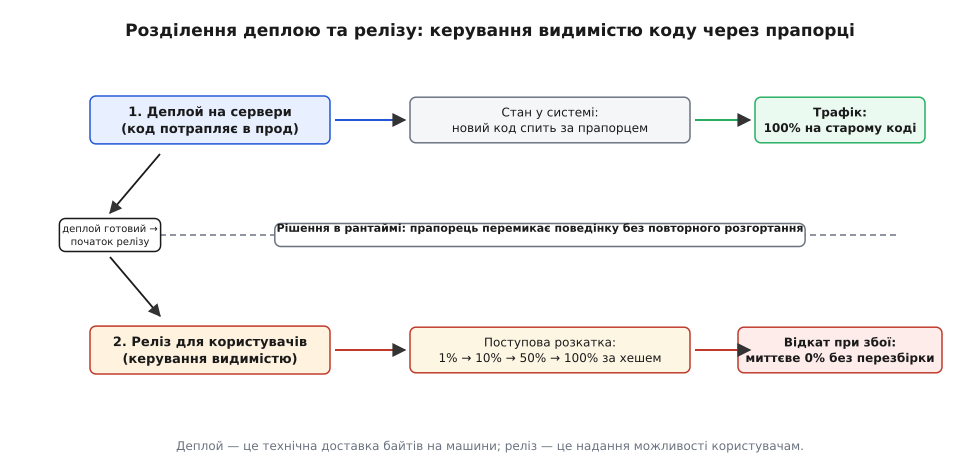
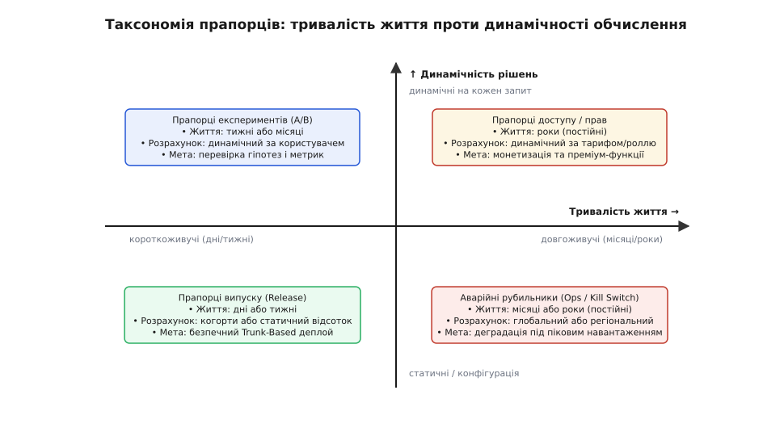
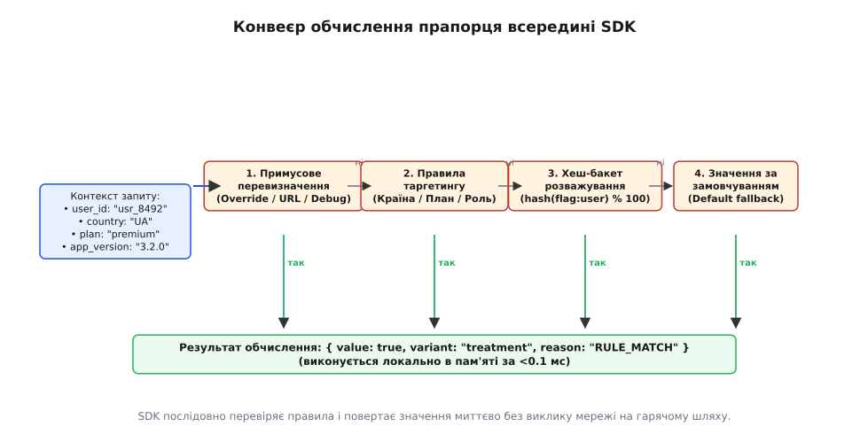
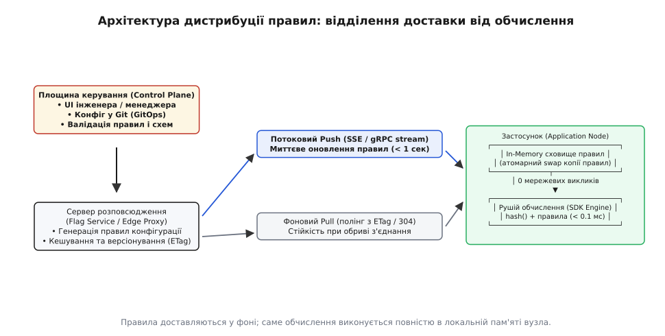
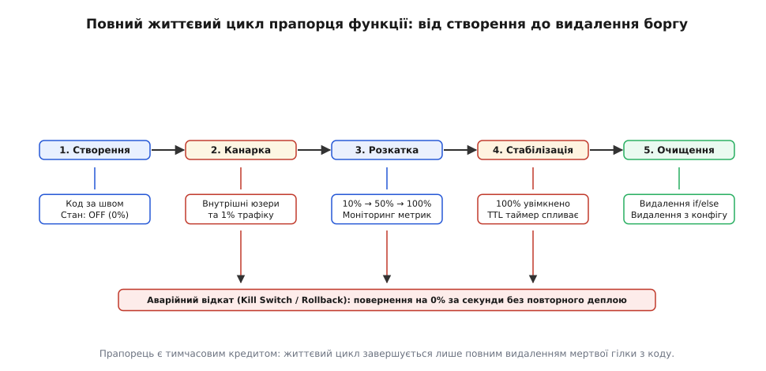

# Прапорці функцій

<preknowlist>
- [Конфігурація](topic:programming/config-design) — зовнішнє налаштування параметрів середовища застосунку без перекомпіляції коду.
- [Branch by abstraction](topic:programming/branch-by-abstraction) — техніка поступової заміни великих компонентів на єдиному стовбурі за спільним інтерфейсним швом.
- [CI/CD](topic:programming/ci-cd) — конвеєр автоматизованої перевірки, складання та розгортання змін на єдиному стовбурі.
- [Стратегії деплою](topic:programming/deployment-strategies) — методи оновлення парку серверів (канаркове, синьо-зелене, ковзне) для мінімізації простоїв.
- [Структуровані логи](topic:programming/structured-logging) — машинночитні записи подій у форматі ключ-значення для аналізу поведінки системи.
- [Метрики](topic:programming/metrics-monitoring) — числовий збір показників продуктивності, затримок та частоти помилок у режимі реального часу.
</preknowlist>

Уяви реліз нової версії інтернет-магазину напередодні масштабного святкового розпродажу. Команда пів року розробляла повністю новий платіжний шлюз для прийому оплат через Apple Pay та Google Pay. Зміна торкається серцевини бізнесу: обробки кошика, формування рахунків і транзакцій у банку. У класичній моделі розробки єдиний спосіб відкрити новий шлюз для покупців — виконати розгортання нової збірки на весь парк із сотні серверів.

І ось через десять хвилин після деплою з'ясовується, що за певних умов банківський провайдер відхиляє запити з тайм-аутом, і покупці не можуть завершити оплату. Виникає кризова дилема: або терміново запускати процедуру відкочування всього релізу (що триває пів години та скасовує ще тридцять корисних правок, випущених разом із цією версією), або тримати прод зламаним, поки інженери шукають помилку. Поки деплой жорстко прив'язаний до надання функціональності, будь-який випуск перетворюється на небезпечну лотерею «все або нічого».

## Розділення деплою та релізу

Корінь цієї проблеми лежить у змішуванні двох принципово різних понять інженерного процесу:
* **Деплой (англ. *deployment* — розміщення, дислокація):** суто технічний інфраструктурний процес копіювання бінарних артефактів, завантаження контейнерів на сервери та підключення їх до мережі.
* **Реліз (англ. *release* — звільнення, випуск у світ):** бізнес-рішення щодо надання доступу до нової поведінки кінцевим користувачам або певному сегменту аудиторії.

Коли ці два процеси злиті в один, реліз відбувається в момент завершення копіювання файлів. Якщо ж розірвати цей зв'язок, новий код потрапляє на сервери у сплячому стані. Він фізично присутній у пам'яті процесу, проходить перевірки працездатності під навантаженням, але жоден реальний покупець його не виконує, оскільки виконання контролюється динамічним умовним перемикачем у коді — **прапорцем функції (англ. *feature flag*, *feature toggle*)**.


*Деплой — це технічна доставка байтів на машини; реліз — це надання можливості користувачам.*

Прапорець перетворює момент активації фічі з важкої інфраструктурної події на зміну одного рядка конфігурації в рантаймі. Якщо новий платіжний шлюз дає збій, черговий інженер не виконує відкат образу контейнера — він просто повертає значення прапорця в стан `false` через панель керування. Система за частку секунди повертається до старої перевіреної логіки без перезапуску процесів і без втрати супутніх змін кодової бази.

Історичний шлях виникнення цього підходу від перших експериментів у Flickr і Facebook до створення відкритого інженерного стандарту детально простежено у вставці [📜 Історія виникнення прапорців і деплою без релізів](topic:programming/feature-flags/hist-feature-flags-evolution.md).

## Таксономія прапорців за Годжсоном і Фаулером

На практиці словом «прапорець» часто називають будь-який умовний оператор `if` у системі. Проте використання одного інструменту для діаметрально протилежних завдань веде до хаосу. У 2017 році Піт Годжсон та Мартін Фаулер систематизували прапорці за двома незалежними осями: **тривалістю життя** (короткоживучі чи постійні) та **динамічністю обчислення** (статична конфігурація чи динамічне рішення на кожен запит).


*Чотири квадранти за Годжсоном і Фаулером: короткоживучі прапорці випуску та експериментів проти довгоживучих рубильників та прав доступу.*

Ця класифікація виокремлює чотири ортогональні архітектурні категорії:

### 1. Прапорці випуску (Release Toggles)
* **Призначення:** дають змогу розробникам вливати незавершений або тестовий код у головну гілку репозиторію (`main`), забезпечуючи Trunk-Based Development та безперервну інтеграцію без довгих гілок фіч.
* **Тривалість життя:** короткоживучі (від кількох днів до 2–3 тижнів).
* **Динамічність:** низька або середня (статичне значення за замовчуванням `false`, увімкнення для тестувальників або 100% активація після завершення тестування).
* **Життєвий цикл:** щойно фіча успішно працює на всіх користувачах, прапорець та стара гілка коду підлягають негайному видаленню.

### 2. Прапорці експериментів (Experiment Toggles / A/B testing)
* **Призначення:** використовуються продуктовими командами для перевірки бізнес-гіпотез (наприклад, порівняння конверсії старої синьої кнопки та нової зеленої або оцінка двох алгоритмів ранжування стрічки).
* **Тривалість життя:** середньоживучі (від 2 тижнів до кількох місяців — до накопичення статистично значущої вибірки).
* **Динамічність:** висока (обчислюється індивідуально для кожного вхідного запиту на основі детермінованого хешу ідентифікатора користувача).
* **Життєвий цикл:** після завершення експерименту команда обирає варіант-переможець, фіксує його в коді та видаляє логіку експерименту.

### 3. Експлуатаційні прапорці та аварійні рубильники (Ops Toggles / Kill Switches)
* **Призначення:** забезпечення живучості та стабільності інфраструктури під час пікових навантажень або аварій у суміжних підсистемах (граціозна деградація).
* **Приклад:** під час «Чорної п'ятниці» наплив трафіку перевантажує сервіс рекомендацій товарів. Оператор умикає аварійний рубильник `disable-recommendations`, і головна сторінка відключає складні обчислення рекомендацій, показуючи статичний блок популярних товарів. База даних розвантажується, і оформлення замовлень продовжує працювати без збоїв.
* **Тривалість життя:** довгоживучі або постійні (місяці або роки).
* **Динамічність:** статичні або оновлювані оператором через панель моніторингу.

### 4. Прапорці прав та тарифних планів (Permission / Entitlement Toggles)
* **Призначення:** контроль доступу до преміум-можливостей залежно від платіжного тарифу (Free, Pro, Enterprise) або прав ролі користувача (Admin, Editor, Viewer).
* **Тривалість життя:** постійні (живуть разом із бізнес-моделлю продукту).
* **Динамічність:** висока (обчислюються для кожного запиту на основі прав та стану підписки користувача).

Головне архітектурне правило: **ніколи не змішувати типи прапорців в одному контексті**. Спроба використати короткоживучий релізний прапорець для довгострокового обмеження тарифного плану призводить до того, що інженери не наважуються видаляти старі прапорці, і кодова база заростає мертвими умовними розгалуженнями.

## Порівняння: прапорці проти конфігурації та баз даних

Щоб чітко розмежувати інструменти, порівняємо прапорці функцій з іншими формами параметризації системи:

| Характеристика | Змінні оточення (Env) | Файли конфігурації | Прапорці функцій (Flags) | Дані в базі даних |
|---|---|---|---|---|
| **Хто змінює** | DevOps / SRE інженер | Системний адміністратор | Розробник / Продукт-менеджер | Кінцевий користувач |
| **Швидкість зміни** | Вимагає перезапуску поду/сервера | Від секунд до перезапуску | Миттєво (< 1 секунди у рантаймі) | Миттєво під час транзакцій |
| **Цільова область** | Весь процес / інстанс | Весь вузол або сервіс | Окремий користувач, когорта або % | Конкретний запис у таблиці |
| **Термін життя** | Постійний (інфраструктура) | Постійний (параметри сервісу) | Тимчасовий (реліз/тест) або рубильник | Постійний стан бізнес-домену |
| **Призначення** | Реквізити підключення, порти | Таймаути, ліміти з'єднань | Увімкнення гілок коду, A/B | Замовлення, профілі, баланси |

Прапорці не замінюють конфігурацію середовища і не є сховищем бізнес-даних. Їхня єдина мета — **динамічний вибір активної гілки виконання в рантаймі**.

## Внутрішній конвеєр обчислення: від контексту до результату

Як влаштований процес обчислення прапорця всередині застосунку? Коли бізнес-код запитує стан прапорця:

```ts
const isNewSearchEnabled = flags.isEnabled("new-search-engine", userContext);
```

Рушій обчислення (Evaluation Engine) всередині SDK виконує сувору послідовність кроків конвеєра:


*SDK послідовно перевіряє правила і повертає значення миттєво без виклику мережі на гарячому шляху.*

Розглянемо кожну ланку цього конвеєра:

### 1. Перевірка списку примусового перевизначення (Overrides & Whitelists)
Найвищий пріоритет мають прямі списки винятків. Якщо в конфігурації прапорця вказано, що користувач `beta_tester_99` або `qa_automation_bot` повинні завжди бачити нову функцію, рушій негайно повертає `true` із причиною `OVERRIDE`, не перевіряючи решту правил. Сюди ж відносяться механізми перекриття прапорця через спеціальні HTTP-заголовки або параметри URL під час локального тестування.

### 2. Зіставлення правил таргетингу за атрибутами (Targeting Rules)
Якщо прямих винятків немає, рушій перевіряє предикати над атрибутами контексту користувача (`EvaluationContext`):
* Країна: `context.country == "UA"`;
* Домен пошти: `context.email.endsWith("@mycompany.com")`;
* Версія клієнта: `context.appVersion >= "3.5.0"`;
* Роль в системі: `context.roles.includes("beta-tester")`.

Якщо хоча б одне правило збігається, повертається значення, закріплене за цим правилом, із причиною `TARGETING_MATCH`.

### 3. Детерміноване розважування за хеш-бакетами (Percentage Rollout)
Якщо потрібно увімкнути функцію для певної частки випадкових користувачів (наприклад, 10% аудиторії), застосовують безстанове псевдовипадкове бакетування.

Рушій конкатенує унікальну сіль прапорця та стабільний ідентифікатор користувача і обчислює значення хешу за алгоритмом MurmurHash3:

```
bucket = MurmurHash3(flagKey + ":" + userId) mod 100
```

Отримане число `bucket ∈ [0, 99]` порівнюється з порогом розкатки: якщо `bucket < 10`, користувач отримує значення `true`, інакше — `false`.

Детальний математичний апарат, доведення монотонності (чому при переході від 10% до 20% жоден старий користувач не втрачає фічу) та формули розрахунку вибірки розібрано у вставці [🧮 Математика детермінованого хешування і монотонної розкатки](topic:programming/feature-flags/math-bucket-hashing.md).

### 4. Значення за замовчуванням (Default Fallback)
Якщо жодне правило не спрацювало або прапорець деактивовано, рушій повертає статичне базове значення, вказане розробником у конфігурації.

Увесь цей конвеєр виконується локально в оперативній пам'яті процесу менш ніж за **100 наносекунд** без звернення до бази даних і без блокування потоків.

## Архітектурні шви: де розміщувати прапорці в коді

Найпоширеніша помилка інженерів-початківців — вставляти перевірку `if (flags.isEnabled("feature"))` глибоко всередину сутностей бізнес-домену або повторювати її у десятках різних файлів. Це призводить до «забруднення домену» інфраструктурними деталями та ускладнює подальше видалення прапорця.

Правильний підхід спирається на [інверсію залежностей](topic:programming/dependency-inversion) та [branch by abstraction](topic:programming/branch-by-abstraction): прапорець повинен жити виключно на **архітектурних швах** системи (на рівні фабрики, точки збирання Composition Root або декоратора).

### Поганий дизайн: розмазування прапорця по бізнес-коду
```ts
// ПОГАНО: прапорець просочився всередину бізнес-сервісу та повторюється в багатьох методах
class OrderProcessor {
  processOrder(order: Order, user: User) {
    if (this.flags.isEnabled("new-payment-v2", user)) {
      this.stripeV2.charge(order.amount);
    } else {
      this.legacyBank.process(order.amount);
    }
  }

  refundOrder(order: Order, user: User) {
    if (this.flags.isEnabled("new-payment-v2", user)) {
      this.stripeV2.refund(order.amount);
    } else {
      this.legacyBank.refund(order.amount);
    }
  }
}
```

### Гарний дизайн: інкапсуляція вибору за швом
Створюється єдиний інтерфейс `PaymentGateway`. Вибір реалізації інкапсулюється у фабриці або динамічному маршрутизаторі, а бізнес-сервіс взагалі не знає про існування прапорця:

:::tabs
```cpp
// ГАРНО: Бізнес-сервіс працює з чистим інтерфейсом
class PaymentGateway {
public:
    virtual ~PaymentGateway() = default;
    virtual void charge(double amount) = 0;
    virtual void refund(double amount) = 0;
};

// Маршрутизатор за прапорцем як єдина точка ухвалення рішення
class FeatureFlaggedPaymentGateway : public PaymentGateway {
public:
    FeatureFlaggedPaymentGateway(
        std::shared_ptr<PaymentGateway> legacy_gw,
        std::shared_ptr<PaymentGateway> modern_gw,
        std::shared_ptr<FlagEngine> flags,
        EvaluationContext ctx
    ) : legacy_(legacy_gw), modern_(modern_gw), flags_(flags), ctx_(ctx) {}

    void charge(double amount) override {
        get_active()->charge(amount);
    }

    void refund(double amount) override {
        get_active()->refund(amount);
    }

private:
    PaymentGateway* get_active() {
        return flags_->evaluate("payment-gateway-v2", ctx_).value ? modern_.get() : legacy_.get();
    }

    std::shared_ptr<PaymentGateway> legacy_;
    std::shared_ptr<PaymentGateway> modern_;
    std::shared_ptr<FlagEngine> flags_;
    EvaluationContext ctx_;
};
```
```ts
// ГАРНО: Бізнес-сервіс не знає про прапорці
interface PaymentGateway {
  charge(amount: number): Promise<void>;
  refund(amount: number): Promise<void>;
}

class FeatureFlaggedPaymentGateway implements PaymentGateway {
  constructor(
    private legacy: PaymentGateway,
    private modern: PaymentGateway,
    private flags: FlagEngine,
    private context: EvaluationContext
  ) {}

  private get active(): PaymentGateway {
    const enabled = this.flags.evaluate("payment-gateway-v2", this.context).value;
    return enabled ? this.modern : this.legacy;
  }

  charge(amount: number) { return this.active.charge(amount); }
  refund(amount: number) { return this.active.refund(amount); }
}
```
:::

Коли нова реалізація повністю визріє, інженер видаляє клас `FeatureFlaggedPaymentGateway` і напряму підключає `modern` у точці збирання застосунку. Бізнес-клас `OrderProcessor` не змінюється взагалі.

## Співіснування зі схемами баз даних (Expand-Contract Pattern)

Коли нова функціональність вимагає зміни схеми бази даних (наприклад, перехід від одного стовпця `phone` до таблиці `user_contacts`), прапорці функцій координують міграцію даних без зупинки системи за схемою **Expand-Contract (паралельна зміна)**:

1. **Фаза розширення (Expand):** у базу додається нова таблиця `user_contacts`. Старий стовпець `phone` залишається недоторканим.
2. **Подвійний запис під прапорцем (Dual-Write):** код застосунку оновлюється: за наявності прапорця `enable-contacts-v2-write` операція збереження записує дані одночасно в старий стовпець і в нову таблицю. Читання продовжує йти зі старого стовпця.
3. **Фонове заповнення (Backfill):** фоновий скрипт мігрує історичні записи зі старого стовпця в нову таблицю.
4. **Перемикання читання (Switch Read):** вмикається прапорець `enable-contacts-v2-read`. Усі операції читання тепер звертаються до нової таблиці. Якщо виявлено невідповідність, прапорець можна миттєво повернути назад.
5. **Фаза стиснення (Contract):** після стабілізації прапорці видаляються з коду, а старий стовпець `phone` видаляється з бази даних фінальною міграцією.

## Архітектура розповсюдження конфігурацій

Як нові правила потрапляють із веб-інтерфейсу адміністратора на сотні працюючих серверів? В інженерії розподілених систем застосовують дві моделі доставки: **Push (потокова доставка)** та **Pull (фонове опитування)**.


*Правила доставляються у фоні; саме обчислення виконується повністю в локальній пам'яті вузла.*

### Модель Pull (Polling з HTTP ETag)
Вузол застосунку раз на кілька секунд (наприклад, кожні 5–10 секунд) надсилає фоновий легкий HTTP-запит до центрального сховища конфігурацій.
* Для уникнення марного передавання трафіку клієнт використовує стандартні заголовки `If-None-Match: "<hash-версії>"` або `If-Modified-Since`.
* Якщо конфігурація не змінювалася, сервер повертає статус `304 Not Modified` із порожнім тілом, що споживає мінімум ресурсів процесора та мережі.
* **Перевага:** надзвичайна простота, надійність та стійкість до збоїв. Якщо центральний сервер недоступний, застосунок продовжує спокійно працювати на локальній копії правил.

### Модель Push (Server-Sent Events / gRPC Streaming)
Вузол застосунку встановлює постійне з'єднання через протокол Server-Sent Events (SSE) або gRPC-потік до прикордонного проксі (*Edge Flag Service*).
* У момент, коли інженер змінює стан прапорця в панелі керування, сервер площини керування миттєво відправляє дельту змін усім підключеним клієнтам.
* Час доставки оновлення на всі вузли кластера скорочується до **кількох сотень мілісекунд**.
* **Резервний механізм:** у разі розриву TCP-з'єднання клієнтський SDK автоматично перемикається в режим фонового Pull-опитування з експоненційним випадковим відкатом (Exponential Backoff with Jitter) до моменту відновлення потоку.

Повноцінну реалізацію In-Memory рушія на мовах C++ та TypeScript з атомарною підміною вказівника (`std::atomic<std::shared_ptr<RuleSet>>`) наведено у практичній вставці [⚙️ Двигунець обчислення прапорців з атомарним оновленням правил](topic:programming/feature-flags/proj-flag-engine.md).

## Інтерфейсний стандарт OpenFeature

Зростання кількості мікросервісів призвело до потреби стандартизації взаємодії між кодом і системами прапорців. Проєкт **OpenFeature** під егідою Cloud Native Computing Foundation (CNCF) розділив платформу на дві незалежні частини:
1. **Client API:** уніфікований інтерфейс розробника (`getBooleanValue`, `getStringDetails`), спільний для всіх технологічних стеків.
2. **Provider API:** змінний адаптер, який підключається в точці конфігурації застосунку (Composition Root).

```
[ Бізнес-код сервісу ] ──► [ OpenFeature Client ] ──► [ Hooks (Metrics/Logs) ] ──► [ Feature Provider ]
```

Завдяки цьому підходу зміна постачальника системи прапорців (наприклад, перехід із власного файлу `flags.json` на корпоративний сервер LaunchDarkly чи Unleash) вимагає зміни рівно **одного рядка** ініціалізації в корені застосунку без редагування тисяч місць викликів прапорців у бізнес-коді.

Повну специфікацію типувань, контракт хуків, коди помилок та семантичні конвенції OpenTelemetry наведено у довідковій вставці [📋 Специфікація інтерфейсу обчислення прапорців OpenFeature](topic:programming/feature-flags/api-openfeature-contract.md).

## Безпека, аудит та управління доступом (Governance)

Оскільки прапорці функцій змінюють поведінку виробничої системи в реальному часі в обхід стандартного конвеєра релізу, вони вимагають суворої моделі безпеки та аудиту:

1. **Принцип подвійного контролю (Four-Eyes Principle):** зміна критичних прапорців (платіжні системи, безпекові перевірки, ліміти транзакцій) у виробничому середовищі блокується системою керування доти, доки другий уповноважений інженер не підтвердить зміну через Pull Request або інтерфейс схвалення.
2. **Незмінний журнал аудиту (Audit Log):** кожна зміна стану прапорця обов'язково фіксує: хто вніс зміну (`author`), точний час (`timestamp`), попереднє і нове значення (`diff`), а також посилання на інцидент або задачу (`ticket`).
3. **Захист конфіденційності (PII Protection):** правила таргетингу не повинні передавати конфіденційні персональні дані (паролі, номери карток, медичні відомості) у хмарні SaaS-провайдери. Застосовують одностороннє хешування ідентифікаторів користувачів на боці застосунку перед передачею в контекст.

## Прапорці на клієнті: фронтенд і мобільні застосунки

Робота з прапорцями у браузерах та мобільних застосунках (iOS / Android) має суттєві відмінності від бекенд-серверів:

1. **Захист конфіденційності (Security & Secret Leakage):** на фронтенд ніколи не можна передавати повний набір правил бекенду. Клієнтський SDK повинен отримувати лише фінальний результат обчислення прапорців для поточного авторизованого користувача, інакше конкуренти можуть розібрати вихідний JSON конфігурації та дізнатися про неанонсовані функції.
2. **Проблема миготіння інтерфейсу (Flash of Unstyled/Old Content, FOUC):** якщо веб-сторінка завантажує значення прапорця через асинхронний HTTP-запит після рендерингу DOM, користувач спочатку побачить стару кнопку, яка через 200 мс різко перескочить на нову. Для усунення миготіння значення прапорців або інжектують прямо в початковий HTML на етапі Server-Side Rendering (SSR), або обчислюють на рівні Edge Worker (Cloudflare Workers / Lambda@Edge) до відправки відповіді у браузер.
3. **Офлайн-режим у мобільних додатках:** мобільні клієнти повинні кешувати останній відомий стан прапорців у персистентному сховищі (SQLite / Keychain) для миттєвого старту додатку навіть за відсутності інтернет-з'єднання.

## Консистентність у розподілених мікросервісах

У складних розподілених системах один користувацький запит проходить через ланцюжок із кількох мікросервісів (API Gateway → Order Service → Payment Service → Notification Service). Якщо сервіси обчислюють прапорці незалежно, виникає небезпека **міжсервісної розсинхронізації** (англ. *inter-service split brain*):
* Шлюз API вважає, що користувач знаходиться на новій версії платежів (`v2`), і формує відповідний запит;
* Сервіс платежів через затримку оновлення конфігурації або відмінність контексту обчислює прапорець як `v1` і відхиляє операцію через невідповідність полів.

Для розв'язання цієї проблеми застосовують **прокидання контексту рішень (Evaluation Context Propagation)**. Прикордонний шлюз обчислює активні прапорці на вході в систему і додає їх у вигляді HTTP-заголовків або бінарних метаданих gRPC (`X-Feature-Flags: payment_v2=true, checkout_v3=b`) до всіх внутрішніх викликів. Сервіси нижчих рівнів довіряють цим рішенням, що гарантує наскрізну атомарність виконання на всіх етапах транзакції.

## Інтеграція зі спостережністю: логи, метрики та автоматичний відкат

Прапорці функцій стають повноцінним інструментом експлуатації лише в поєднанні з системами спостережності ([структурованими логами](topic:programming/structured-logging) та [метриками](topic:programming/metrics-monitoring)):

1. **Збагачення діагностичного контексту (MDC / OpenTelemetry Spans):** кожне обчислення прапорця автоматично додає своє значення у контекст логування:
   ```json
   {
     "timestamp": "2026-08-20T10:15:30Z",
     "level": "INFO",
     "message": "Order processed successfully",
     "user_id": "usr_8492",
     "feature_flags": {
       "payment_v2": "true",
       "discount_engine": "treatment_b"
     }
   }
   ```
2. **Розділені метрики в Prometheus:** інженери будують графіки затримок (Latency) та частоти помилок (Error Rate), розбиті за активним варіантом прапорця:
   ```promql
   sum(rate(http_requests_total{status=~"5.."}[1m])) by (flag_payment_v2) 
   / 
   sum(rate(http_requests_total[1m])) by (flag_payment_v2)
   ```
3. **Автоматичний відкат (Automated Circuit Breaker):** якщо при розкатці прапорця на 5% частота помилок у новій гілці перевищує встановлений бюджет помилок (SLO), система алертингу автоматично викликає Webhook площини керування, який миттєво скидає розкатку до 0% без участі людини впродовж 10 секунд після виникнення аномалії.

## Тестування систем із прапорцями

Впровадження прапорців ускладнює процес автоматизованого тестування. Щоб забезпечити надійність, застосовують трирівневу стратегію перевірки:

1. **Параметризовані модульні тести (Unit Tests):** кожен модуль, поведінка якого залежить від прапорця, тестується двічі — з прапорцем у стані `true` та `false`:
   ```cpp
   // Приклад параметризованого тесту Google Test у C++
   class PaymentGatewayTest : public ::testing::TestWithParam<bool> {};

   TEST_P(PaymentGatewayTest, ProcessesCorrectlyInBothModes) {
       bool flag_state = GetParam();
       auto engine = create_mock_engine("payment-v2", flag_state);
       OrderProcessor processor(engine);
       EXPECT_TRUE(processor.checkout(100.0));
   }
   INSTANTIATE_TEST_SUITE_P(FlagStates, PaymentGatewayTest, ::testing::Values(true, false));
   ```
2. **Інтеграційні тести в CI/CD:** автоматизовані тести збірки за замовчуванням ганяються проти **поточного бойового стану прапорців у проді**, а також проти майбутнього стану (де всі активні релізні прапорці активовані на 100%).
3. **Перевірка на відсутність мертвого коду:** після видалення прапорця запускається аналіз покриття коду (Code Coverage) для перевірки, що стара гілка дійсно видалена і не залишає недосяжних інструкцій.

## Канаркові деплої проти розкатки за прапорцями

Часто виникає питання: чим розкатка через прапорці відрізняється від [канаркового розгортання](topic:programming/deployment-strategies) на рівні Kubernetes або балансувальника Envoy?

Ці два механізми діють на різних рівнях і доповнюють один одного:
* **Канарковий деплой інфраструктури (Canary Pods):** балансувальник скеровує 5% випадкових TCP/HTTP-з'єднань на нові контейнери нової версії збірки. Це перевіряє **машинну стабільність**: чи не падає процес із витоком пам'яті (OOM), чи немає SegFault, чи стабільне споживання CPU. Але канарка не може прив'язати конкретного користувача до нової поведінки на різних сторінках сайту.
* **Розкатка за прапорцями (Feature Flag Rollout):** працює на рівні бізнес-сутностей всередині коду. Вона забезпечує **користувацьку консистентність**: користувач бачить нову версію на всіх серверах кластера, для нього збираються персональні продуктові метрики, а в разі збою фіча вимикається миттєво без рестарту контейнерів.

## Темний запуск і міграція даних (Dark Launch)

Один із найпотужніших паттернів використання прапорців — **темний запуск (англ. *dark launch*)**. Це техніка випробування нової системи на реальному виробничому навантаженні без відображення змін для користувачів.

Приклад: команда розробила новий сервіс рекомендацій на основі машинного навчання. Замість того, щоб увімкнути його одразу для всіх користувачів і ризикувати перевантаженням чи повільними відповідями, запити обробляються в тіньовому режимі:
1. Користувач відкриває головну сторінку;
2. Застосунок надсилає виклик до старого перевіреного сервісу рекомендацій і паралельно за прапорцем шле асинхронну копію запиту до нового сервісу (*Shadow Traffic*);
3. Відповідь нового сервісу не показується користувачеві, але її затримка, споживання пам'яті та коректність результату звіряються в логах;
4. Коли інженери переконалися, що новий сервіс витримує 100% пікового навантаження і видає правильні дані, прапорець перемикає відображення інтерфейсу на новий бекенд.

## Технічний борг прапорців: комбінаторний вибух та дисципліна прибирання

Прапорець функції — це архітектурний кредит. Він надає швидкість і безпеку сьогодні, але якщо його вчасно не повернути, він породжує важкий **технічний борг прапорців (англ. *flag debt*)**.

### 1. Комбінаторний вибух станів (2ⁿ execution paths)
Кожен бінарний прапорець `if / else` подвоює кількість можливих шляхів виконання програми. Якщо в системі одночасно живуть `N` незчищених прапорців, кількість можливих конфігурацій системи становить:

```
Кількість конфігурацій = 2ⁿ
```

При 10 прапорцях це 1 024 стани, а при 30 прапорцях — понад мільярд можливих комбінацій. Протестувати таку кількість комбінацій у CI/CD стає математично неможливо: система обов'язково опиниться в непередбаченому стані, коли прапорці `A` та `C` увімкнені, а прапорець `B` вимкнений, що призведе до рідкісних помилок, які не відтворюються локально.

### 2. Життєвий цикл прапорця та його стадії

Щоб уникнути накопичення боргу, кожен релізний прапорець повинен проходити через чіткий 5-етапний життєвий цикл:


*Прапорець є тимчасовим кредитом: життєвий цикл завершується лише повним видаленням мертвої гілки з коду.*

1. **Створення (Day 0):** код нової фічі додається під швом із прапорцем у стані `OFF` (0%);
2. **Канарковий запуск (Day 1–3):** увімкнення для внутрішніх розробників і 1% реального трафіку;
3. **Поступова розкатка (Day 4–10):** розширення когорт: 10% → 25% → 50% → 100% за умови збереження стабільності метрик і відсутності сплесків помилок;
4. **Стабілізація (Day 11–20):** функціональність працює на 100% користувачів, запускається зворотний відлік часу життя прапорця (TTL, наприклад 14 днів);
5. **Очищення та видалення (Day 21):** інженер видаляє прапорець із конфігурації, прибирає розгалуження `if / else`, видаляє стару мертву гілку коду та оновлює юніт-тести.

### 3. Автоматизація боротьби з зомбі-прапорцями

Передові інженерні команди впроваджують автоматизовані механізми контролю застарілих прапорців:
* **Атрибут TTL (Time-To-Live) та метадані:** у конфігурації прапорця обов'язково вказують автора (`owner`), задачу в трекері (`ticket`) та дату завершення терміну придатності (`expiration_date`).
* **Алерти та лінтери:** лінтери в CI/CD аналізують кодову базу та блокують злиття нових змін, якщо в коді виявлено релізний прапорець, термін життя якого перевищив 30 днів.
* **Автоматизований рефакторинг:** інструменти статичного аналізу (наприклад, Piranha від Uber) автоматично сканують репозиторій, знаходять прапорці, увімкнені на 100% понад місяць, генерують Pull Request із видаленням блоку `if (flag)` і надсилають його автору на затвердження.

## Підсумок: прапорці як основа безперервної інженерії

Прапорці функцій — це не просто зручний спосіб тестування кнопок на живих користувачах. Це фундаментальний інженерний інструмент, що перетворює монолітний і ризикований процес релізу на серію безпечних, контрольованих та повністю зворотних кроків.

Відділяючи технічну доставку коду на сервери від моменту активації можливостей, прапорці усувають необхідність тривалих гілок у системі контролю версій, захищають систему від неочікуваних збоїв за допомогою аварійних рубильників та створюють основу для швидкого експериментування в сучасному безперервному виробництві програмного забезпечення.
