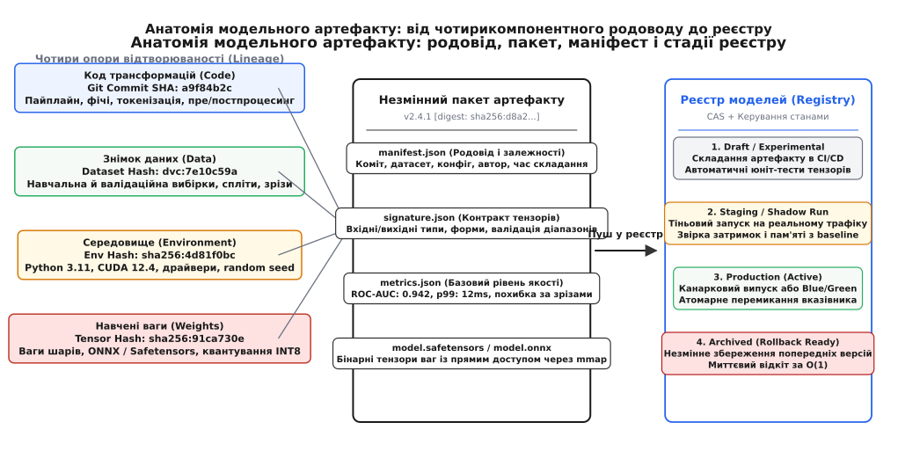
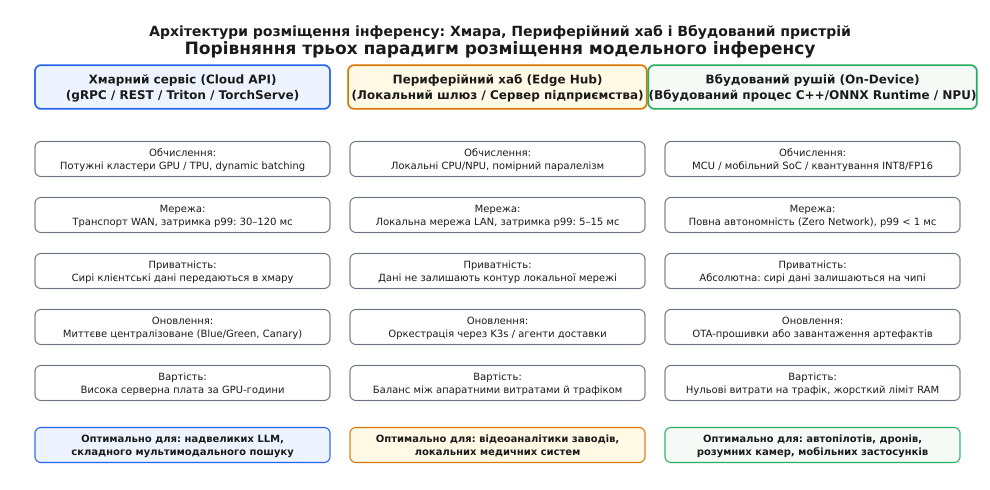
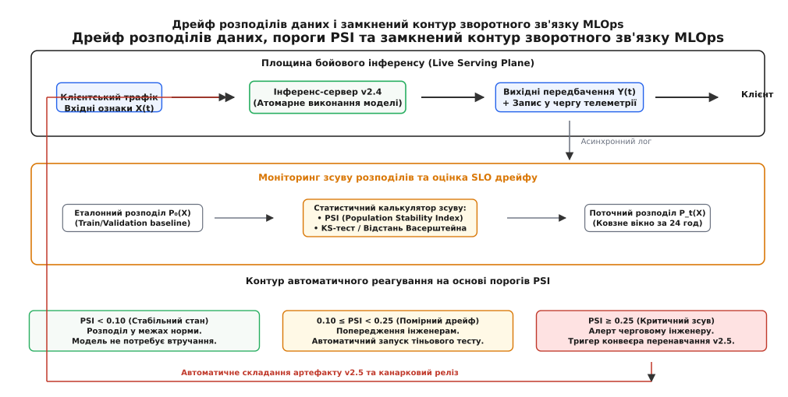

# Модель як версійований артефакт: родовід ваг, реєстр, інференс і дрейф як SLO

<preknowlist>
- [Тактики експлуатованості й розгортуваності](book:programming/operability-tactics) — якісні атрибути, що визначають легкість доставки змін і спостереження за живою системою.
- [CI/CD](book:programming/ci-cd) — конвеєр автоматизованої перевірки, складання та розгортання змін на єдиному стовбурі.
- [Контейнери](book:programming/containers) — ізоляція процесів, файлових систем та просторів імен ОС для відтворюваного запуску.
- [Стратегії деплою](book:programming/deployment-strategies) — почергове, синьо-зелене та канаркове оновлення без деградації доступності.
- [Метрики](book:programming/metrics-monitoring) — числовий збір показників частоти помилок, затримок і насиченості в режимі реального часу.
- [SLI/SLO/SLA і бюджет помилок](book:programming/slo-sli-sla) — кількісні цілі надійності та керування ризиками випуску змін.
- [Еволюція схем і schema-registry](book:programming/schema-registry) — контроль сумісності форматів повідомлень і запобігання аваріям при оновленні контрактів.
- [Межі й етика](book:algorithms/ml-limits-ethics) — обмеження статистичних моделей, ефект супутніх ознак та вимоги до відтворюваності рішень.
</preknowlist>

Високонавантажений кластер із вісімдесяти вузлів обслуговує потік у 40 000 транзакцій на секунду для платіжного шлюзу банку, оцінюючи ймовірність шахрайства в реальному часі. Дата-саєнтист після успішного експерименту вручну копіює новий файл навчених ваг `model_v2_final.pkl` на мережевий диск NFS і відправляє сигнал перезапуску інференс-демонам. За наступні чотири секунди система схвалює 1 200 шахрайських переказів на суму понад 3.4 мільйона доларів, а ще 15 000 легітимних операцій відхиляються з кодом критичної помилки.

Розслідування інциденту з'ясовує: новий файл ваг вимагав попередньої логарифмічної нормалізації суми переказу, тоді як бойовий сервіс передавав сирі значення в доларах; навчання проводилося на бібліотеці `scikit-learn 1.2`, а на серверах стояла версія `1.0`, що призвело до зсуву індексів ознак; знімок навчальної вибірки не було збережено, тому ніхто не міг відтворити обчислення; а скрипт попередньої обробки в Git не мав зв'язку зі скомпільованим файлом ваг. Спроба екстрено повернути стару версію заблокувалася, оскільки попередній файл на мережевому диску був безповоротно перезаписаний новою назвою.

Ця аварія демонструє наслідки ставлення до моделі машинного навчання як до звичайного статичного файлу числових ваг. Щоб алгоритм міг безпечно функціонувати в бойовому контурі, інженерія розглядає модель як **версійований артефакт** (лат. *artefactum* — штучно зроблене) із зафіксованим родоводом походження, строгим контрактом інтерфейсу, автоматизованим життєвим циклом та безперервним моніторингом статистичного дрейфу.

## Чотирикомпонентний родовід артефакту (Lineage)

У класичній розробці програмного забезпечення артефакт (скомпільований бінарний файл або контейнерний образ) однозначно визначається вихідним кодом: той самий коміт у Git за умови фіксованого компілятора завжди породжує однаковий бінарний файл. 

У машинному навчанні ця парадигма повністю ламається. Однаковий вихідний код нейромережі, запущений на різних зрізах бази даних або з іншим значенням генератора випадкових чисел, породжує кардинально різні набори вагових коефіцієнтів, які демонструють абсолютно різну поведінку під навантаженням.

Тому модельний артефакт є не просто файлом тензорів, а неподільним кортежем із чотирьох компонентів родоводу (англ. *lineage*, від лат. *linea* — лінія, спадковість):

```text
Модельний артефакт = ⟨ Код_SHA, Дані_Digest, Середовище_Lock, Ваги_SHA ⟩
```

```text
┌────────────────────────────────────────────────────────────────────────┐
│               Чотирикомпонентний родовід артефакту (Lineage)           │
│                                                                        │
│  [ Код (Code SHA) ] ──────────┐                                        │
│  Git commit, пайплайн, фічі   │                                        │
│                               ▼                                        │
│  [ Дані (Data Digest) ] ────> ⟨ Запечатаний пакет ⟩ ──> [ Реєстр ]     │
│  Знімок вибірки, DVC-хеш      │  • manifest.json        (Версія v2.4.1)│
│                               │  • signature.json                      │
│  [ Середовище (Env Lock) ] ──>│  • metrics.json                        │
│  CUDA, Python, флаги CPU      │  • weights.safetensors                 │
│                               ▲                                        │
│  [ Ваги (Weights SHA) ] ──────┘                                        │
│  Бінарні тензори, квантування                                          │
└────────────────────────────────────────────────────────────────────────┘
```

1. **Родовід коду (Code Lineage):**
   * Точний 40-символьний хеш коміту в Git, з якого було запущено навчання.
   * Контрольна сума скриптів попередньої обробки даних (Feature Engineering), виділення ембеддингів та постпроцесингу результатів.
   * Декларативний конфігураційний файл гіперпараметрів навчання (швидкість навчання, кількість епох, розмір батчу, архітектура шарів).

2. **Родовід даних (Data Lineage):**
   * Незмінний криптографічний знімок (хеш DVC або версія LakeFS/Iceberg) повного набору даних, використаного для навчання та валідації.
   * Зафіксовані межі розбиття на навчальну, валідаційну та тестову вибірки (`train/val/test split`).
   * Схема вхідних полів на момент навчання. Якщо колонка в реляційній базі даних пізніше була перейменована або видалена, артефакт зберігає інформацію про її початковий стан.

3. **Родовід середовища виконання (Environment Lineage):**
   * Зафіксований зліпок версій інтерпретатора Python, компілятора C++, базового образу операційної системи та драйверів відеокарти (CUDA Driver, CUDA Runtime, cuDNN).
   * Прапорці мікроархітектури процесора (наприклад, `AVX-512`, `FMA`, `NEON`), під які компілювалися оптимізовані математичні ядра бібліотек BLAS.
   * Фіксоване початкове значення генератора псевдовипадкових чисел (Random Seed) для перевірки детермінованості навчання.

4. **Бінарні ваги та структура графа (Weights & Graph):**
   * Серіалізовані масиви числових коефіцієнтів у безпечному форматі (ONNX або Safetensors), позбавленому виконуваного коду.
   * Параметри квантування (масштабні коефіцієнти для FP16, INT8 або BFLOAT16).
   * Криптографічний підпис SHA-256 та Ed25519, що гарантує відсутність несанкціонованої підміни файлу на шляху від конвеєра CI/CD до бойового сервера.

### Проблема розсинхронізації онлайн- та офлайн-ознак (Train/Serve Skew)
Одним із найнебезпечніших джерел збоїв у машинному навчанні є розбіжність між логікою обробки ознак під час офлайн-навчання та під час онлайн-інференсу. Наприклад, дата-саєнтист під час експериментів у Jupyter Notebook виконує нормалізацію числових полів за допомогою функції `pandas.DataFrame.apply()`, яка використовує одні статистичні квантилі. Коли сервіс переносять у бойовий мікросервіс на C++ або Go, інженери переписують логіку нормалізації вручну, допускаючи дрібні розбіжності в заокругленні чисел із плаваючою комою або обробці значень `NaN`.

Ця мікроскопічна розбіжність призводить до того, що модель на сервері отримує на вхід вектори чисел, зміщені відносно простору, на якому її навчали. Для усунення цієї проблеми сучасні стандарти артефактів вимагають **вбудовування коду трансформацій безпосередньо в граф обчислень моделі** (ONNX Preprocessing Subgraphs) або використання версійованих вітрин ознак (Feature Stores). У цьому випадку операції стандартизації, токенізації тексту та обчислення категоріальних хешів виконуються тим самим бінарним кодом ядра інференсу, виключаючи людський фактор переписування логіки на іншій мові програмування.

[Історію того, як інженерна спільнота подолала шлях від вразливих файлів Python pickle до сучасних стандартів MLOps і незмінних OCI-артефактів](book:programming/model-artifact/hist-model-registry-and-mlops.md), варто вивчити окремо — вона показує, як боротьба з прихованим технічним боргом сформувала сучасні вимоги до надійності систем штучного інтелекту.



*Анатомія модельного артефакту: чотири джерела відтворюваності, структура запечатаного незмінного пакета та життєвий цикл просування стадій у централізованому реєстрі.*

> 🔧 **Навіщо це.** Якщо модель ухвалює регуляторно чутливе рішення (відмова у видачі кредиту, блокування облікового запису чи медична діагностика), компанія зобов'язана юридично довести, чому алгоритм дав саме таку відповідь пів року тому. Маючи чотирикомпонентний родовід, інженер може розгорнути ізольоване середовище, підтягнути точний знімок даних і побітно відтворити процес ухвалення рішення.

## Реєстр моделей (Model Registry) та контракт тензорного інтерфейсу

Централізований **реєстр моделей** (лат. *registrum* / *regestum* — внесене, записане) виконує для артефактів машинного навчання ту саму роль, яку репозиторії артефактів (Nexus, Artifactory, Docker Registry) виконують для класичного програмного забезпечення:

```text
Площина складання:    [ CI/CD Конвеєр ] ───(Пуш підписаного пакету)───> [ Реєстр моделей ]
                                                                               │
                                                                               ▼ (Керування стадіями:
Площина маршрутизації:[ L7 Шлюз / Ingress ] <──(Світч активної версії)─────────┤  Draft ->
                                                                               │  Staging ->
Площина інференсу:    [ Вузли інференсу ] <────(Pull ваг через mmap)───────────┘  Production)
```

1. **Незмінне сховище з адресацією за вмістом (Content-Addressable Storage, CAS):**
   Кожна версія моделі зберігається в об'єктному сховищі за унікальним SHA-256 хешем свого вмісту. Модифікація опублікованої версії неможлива: будь-яка зміна коду або даних автоматично породжує новий криптографічний хеш і новий запис версії.
2. **Керування стадіями життєвого циклу (Lifecycle Stages):**
   Реєстр керує переходом артефакту через детермінований скінченний автомат станів:
   * `Draft`: щойно зібраний у CI/CD артефакт, що проходить автоматичні тести сумісності сигнатур.
   * `Staging`: артефакт, розгорнутий у контурі інтеграційного тестування для перевірки під навантаженням або запущений у тіньовому режимі (Shadow Mode).
   * `Production`: єдина активна бойова версія, на яку спрямовується реальний трафік клієнтів.
   * `Archived`: попередні стабільні релізи, які зберігаються в гарячому резерві для забезпечення миттєвого відкочування (Rollback) за час `O(1)`.

### Автоматизовані гейти якості при просуванні версій
Перехід моделі між стадіями в реєстрі не може виконуватися простим ручним перемиканням прапорця людиною. Кожен перехід захищений строгими машинними гейтами перевірки:

* **Гейт статичної валідації (`Draft → Staging`):** автоматичний аналізатор перевіряє цілісність контрольних сум SHA-256 усіх файлів пакета, валідує відповідність JSON-документів схемам JSON Schema, сканує вшиті залежності на наявність відомих вразливостей CVE та перевіряє наявність цифрового підпису CI/CD конвеєра.
* **Гейт динамічного бенчмаркінгу (`Staging → Production`):** модель розгортається в ізольованому тестовому середовищі, де генератор навантаження проганяє синтетичний потік із 100 000 запитів. Гейт автоматично блокує реліз, якщо перцентиль затримки p99 перевищує зафіксований у `metrics.json` еталон більш ніж на 15%, або якщо споживання відеопам'яті VRAM виходить за виділену квоту контейнера.

### Контракт тензорної сигнатури (Tensor Signature)
Традиційний мікросервіс взаємодіє із зовнішнім світом через REST/JSON або gRPC-схеми, описані у файлах `OpenAPI` чи `protobuf`. Інференс-сервер потребує аналогічного строгого опису на рівні тензорів:

```text
Вхідний запит (JSON / gRPC) ──> [ Валідатор сигнатури ] ──> [ Буфер VRAM ] ──> [ Обчислювальний граф ]
                                        │
                                        ▼ (Невідповідність типу/форми)
                                [ Відхилення HTTP 400 ]
```

* **Форми та розмірності (Tensor Shapes):** фіксація кількості вимірів та правил обробки динамічного розміру пачки (Batch Dimension `-1`).
* **Типізація даних (Data Types):** явна заборона неявного приведення типів (наприклад, передача `int64` у поле `float32` відхиляється шлюзом до передачі даних на GPU).
* **Контроль допустимих меж (Range Validation):** перевірка допустимих мінімальних і максимальних значень для виявлення збоїв у датчиках або помилок клієнтського коду.

Повна декларативна схема маніфесту, специфікація сигнатур та опис REST/gRPC методів реєстру наведені в довіднику [Специфікація схеми маніфесту модельного артефакту та API реєстру](book:programming/model-artifact/api-model-metadata-schema.md).

## Архітектури виконання інференсу: Хмара, Периферійний хаб і Вбудований пристрій

Процес виконання обчислень навченої моделі над новими вхідними даними називається **інференсом** (англ. *inference* від лат. *inferre* — виводити, робити висновок). 

Вибір місця фізичного розміщення інференс-рушія є фундаментальним архітектурним компромісом між чотирма векторами: мережевою затримкою, вартістю інфраструктури, конфіденційністю даних та автономністю роботи.



*Порівняння архітектурних парадигм розміщення модельного інференсу: хмарні кластери високої потужності, локальні периферійні хаби підприємств та вбудовані мікроконтролерні пристрої.*

### 1. Хмарний сервіс (Cloud Serving API)
Модель розгортається на віддалених серверах із потужними графічними прискорювачами (GPU/TPU) за високонадійним мережевим шлюзом (Triton Inference Server, TorchServe, vLLM).
* **Переваги:** необмежені обчислювальні ресурси, можливість запускати надвеликі моделі (LLM на сотні мільярдів параметрів), миттєве централізоване оновлення артефактів для 100% аудиторії.
* **Недоліки:** значна мережева затримка транспорту WAN (додаткові 20–120 мс на передачу пакетів), пряма залежність доступності системи від якості інтернет-з'єднання, високі щомісячні витрати на хмарні сервери, передача чутливих даних користувачів третім сторонам.

#### Механізм динамічного батчингу (Dynamic Batching)
На графічних прискорювачах виконання матричного множення для одного вектора (GEMV) утилізує обчислювальні ядра тензорних блоків менш ніж на 5%, оскільки вузьким місцем стає швидкість передачі ваг із пам'яті VRAM до регістрів процесора (Memory-Bound Regime).

Щоб наситити паралельні конвеєри GPU, інференс-сервер використовує чергу динамічного батчингу:
1. Запити від сотень клієнтських потоків накопичуються у спільному буфері.
2. Обчислення запускається або при досягненні оптимального розміру пачки (`max_batch_size = 32`), або після закінчення жорсткого таймауту очікування (`max_queue_delay_ms = 4.0`).
3. Виконання однієї операції множення матриці на матрицю (GEMM) замість 32 поодиноких викликів переводить обчислення в режим Compute-Bound, підвищуючи загальну пропускну здатність сервера в 6–10 разів при збереженні контрольованої затримки p99.

#### Економіка та обчислювальна ефективність інференсу (FinOps for Inference)
Експлуатація великих моделей у хмарі створює значні фінансові витрати. Інференс-сервер на базі кластера з 8 карт NVIDIA H100 генерує рахунки в десятки тисяч доларів щомісяця незалежно від того, чи надходить клієнтський трафік, оскільки виділена відеопам'ять і тензорні ядра зарезервовані за процесом.

Для оптимізації вартості інфраструктура відстежує спеціалізовані метрики обчислювальної ефективності:
* **Вартість мільйона запитів (Cost per Million Inferences):** агрегований фінансовий показник, що зіставляє вартість серверної години з реальною пропускною здатністю.
* **Коефіцієнт простою ядер (GPU Idle Core Ratio):** частка часу, протягом якого тензорні блоки очікують передачі даних із системної пам'яті. Якщо коефіцієнт перевищує 40%, розмір динамічного батчу збільшується або модель переноситься на сервери з менш дорогими прискорювачами (L4 замість A100).
* **Автоскейлінг за довжиною черги запитів (Queue-Length Autoscaling):** замість класичного автоскейлінгу за завантаженням CPU/GPU, який реагує із запізненням у 2–3 хвилини, інференс-кластер масштабує кількість реплік на основі глибини черги очікування запитів у балансувальнику (KEDA — Kubernetes Event-driven Autoscaling).

### 2. Периферійний хаб (Edge Hub / On-Premise Gateway)
Модель виконується на локальному сервері всередині закритої корпоративної мережі підприємства (наприклад, комп'ютер керування виробничим цехом або сервер у приміщенні лікарні).
* **Переваги:** наднизька локальна затримка LAN (5–15 мс), робота за умов повної відсутності зовнішнього інтернету, збереження конфіденційних відеопотоків та медичних даних усередині фізичного периметра підприємства.
* **Недоліки:** обмежена обчислювальна потужність, складність оркестрації розподіленого парку серверів (необхідність використання K3s або легковажних агентів доставки артефактів).

### 3. Вбудований інференс (On-Device / Embedded)
Модель компілюється під цільовий мікроконтролер, мобільний процесор або спеціалізований нейрочип (NPU) і виконується безпосередньо всередині кінцевого пристрою за допомогою компактних рушіїв (ONNX Runtime, TFLite Micro, ExecuTorch).
* **Переваги:** нульова мережева затримка (менше 1 мс), абсолютна приватність (сирі аудіо- чи відеодані не залишають чип), нульові витрати на передачу трафіку, збереження працездатності в автономних роботах і дронах.
* **Недоліки:** жорсткі ліміти оперативної пам'яті (від кількох десятків кілобайтів на MCU до одиниць гігабайтів на телефонах), необхідність агресивного квантування ваг (INT8 / INT4) із потенційною втратою точності, висока складність оновлення прошивок через канали зв'язку низької пропускної здатності.

#### Математика квантування INT8 та енергетичний баланс TinyML
Для запуску моделей на вбудованих чипах без апаратного блоку роботи з плаваючою комою (FPU) вагові коефіцієнти переводяться з формату `float32` у 8-бітні цілі числа `int8` за формулою афінного квантування:

```text
q = clamp( round( r / S ) + Z, -128, 127 )      [формула афінного квантування INT8]
```

де `r` — дійсне число у форматі FP32, `S > 0` — масштабний коефіцієнт сітки квантування (Scale), а `Z` — цілочисельний зсув нульової точки (Zero-point).

Квантування зменшує розмір артефакту в 4 рази (з 400 МБ до 100 МБ) та скорочує споживання пам'яті RAM. При цьому вбудований інференс вирішує головну проблему автономних пристроїв — **енергоспоживання**. Обчислення на мікроконтролері споживають близько 1–5 міліватів потужності, у той час як активація радіопередавача (Wi-Fi, 4G LTE або 5G) для відправки сирих даних у хмару вимагає 800–1500 міліватів. Обчислення на місці дозволяють пристрою працювати від однієї батарейки роками замість кількох годин.

## Гаряче завантаження та подвійна буферизація без простою (Zero-Downtime Hot Reload)

У високонавантажених сервісах неприпустимо зупиняти процес для заміни моделі: перезапуск важкого процесу з вивантаженням і повторною ініціалізацією десятків гігабайтів ваг у відеопам'ять займає від 30 секунд до кількох хвилин.

Щоб оновлювати артефакт під безперервним навантаженням без втрати жодного байта даних, застосовується архітектура **подвійної буферизації без блокувань (Lock-Free Double Buffering)** на базі атомарних покажчиків:

```text
Крок 1 (Фон):   [ Завантажувач ] ──(Зчитування з диска / mmap)──> [ Модель v2.0 у фоновій пам'яті ]
                                                                           │
Крок 2 (Тест):  [ Імітаційний прохід / Прогрів кешів ] ───────────────────┤ (Warm-up завершено)
                                                                           │
Крок 3 (Світч): [ Атомарний вказівник ] ──(Release Store)───────────────>  v2.0 стає активною!
                                                                           │
Крок 4 (Дренаж):[ Стара версія v1.0 ] ──(Знищення після завершення)───────┘ (Після виходу всіх потоків)
```

1. **Фонова алокація та ініціалізація:** фоновий потік зчитує новий артефакт `model-v2.0.safetensors`, виділяє окремий сегмент пам'яті та ініціалізує структури даних. Робочі потоки в цей час продовжують безперервно читати активну версію `model-v1.0`.
2. **Фаза примусового прогріву (Warm-up):** фоновий потік виконує тестовий прохід на зразкових вхідних тензорах. Це примусово виділяє сторінки віртуальної пам'яті (усуваючи Page Faults), завантажує машинний код у кеші інструкцій процесора та ініціалізує пули потоків бібліотек лінійної алгебри BLAS.
3. **Атомарне перемикання (Atomic Pointer Swap):** за допомогою атомарної операції із семантикою `Release-Acquire` покажчик активної моделі змінюється на новий об'єкт v2.0. З цієї мікросекунди всі нові клієнтські запити починають обслуговуватися новим кодом.
4. **Безпечне відкладене звільнення (Deferred Reclamation):** стара модель v1.0 утримується в пам'яті завдяки лічильникам посилань `std::shared_ptr` (або патерну RCU в чистому C). Вона автоматично знищується рівно тоді, коли останній робочий потік, що почав обчислення до моменту перемикання, завершує формування відповіді.

### Системні виклики mmap та блокування сторінок у пам'яті (mlock)
Для запобігання ситуаціям, коли операційна система під навантаженням витісняє сторінки ваг моделі з оперативної пам'яті у файл підкачки (Swap), що спричиняє раптові сплески затримок до сотень мілісекунд, інференс-рушій використовує системні виклики ядра Linux:

* `mmap(NULL, size, PROT_READ, MAP_SHARED | MAP_POPULATE, fd, 0)`: відображає файл ваг безпосередньо у віртуальний адресний простір, а прапорець `MAP_POPULATE` ініціює випереджальне читання (readahead) усіх сторінок пам'яті ядром ОС під час виклику.
* `mlock(addr, size)`: блокує сторінки віртуальної пам'яті в фізичній RAM, забороняючи підсистемі керування пам'яттю ядра (kswapd) вивантажувати їх на диск.
* `madvise(addr, size, MADV_WILLNEED)`: повідомляє планувальник ядра про намір процесу негайно виконувати послідовне читання масиву ваг, що оптимізує чергу контролера пам'яті процесора.

[Повний робочий приклад реалізації потокобезпечного завантажувача з контролем SHA-256 та атомарним перемиканням пам'яті мовами C та C++](book:programming/model-artifact/proj-model-registry.md) містить покроковий аналіз синхронізації та обробки збоїв.

## Дрейф розподілів як експлуатаційний SLO: коли модель «сліпне»

На відміну від класичного коду, який після проходження інтеграційних тестів зберігає детерміновану правильність назавжди, моделі машинного навчання деградують мовчки. Зовнішній світ змінюється, розподіли вхідних даних зазнають зсуву, і алгоритм починає видавати катастрофічно хибні результати, продовжуючи повертати статуси `HTTP 200 OK` без жодних системних помилок чи падінь процесів.

Зсув характеристик вхідного потоку або внутрішніх залежностей середовища називається **дрейфом** (нід. *drijven* / англ. *drift* — відхилення від курсу).

```text
┌────────────────────────────────────────────────────────────────────────┐
│                        Класифікація видів дрейфу                       │
│                                                                        │
│  1. Дрейф коваріат:      P_t(X) ≠ P₀(X)     при P_t(Y|X) = const       │
│     (Зміна розподілу вхідних сигналів)                                 │
│                                                                        │
│  2. Дрейф концепту:      P_t(Y|X) ≠ P₀(Y|X) при P_t(X) = const         │
│     (Зміна суті правил реального світу)                                │
│                                                                        │
│  3. Зсув апріорних частот: P_t(Y) ≠ P₀(Y)   при P_t(X|Y) = const       │
│     (Зміна базової частоти подій у природі)                            │
└────────────────────────────────────────────────────────────────────────┘
```

### Механізм зимового «осліплення» моделі (Seasonal Covariate Shift)
Розглянемо систему комп'ютерного зору для безпілотного транспорту або оптичного сортування сільськогосподарської продукції, навчену на мільйоні зображень, зібраних у червні та липні за сонячної погоди:

```text
Навчання (Літо):  [ Яскраве сонце / Зелена трава ] ──> Модель: Точність 99.2% (ROC-AUC: 0.98)
                                                                │
                                                                ▼ (Настання зими)
Експлуатація:     [ Білий сніг / Сутінки / Відблиски ] ──> Модель: Сліпота! (Точність падає до 42%)
```

1. **Причина:** взимку простір вхідних ознак `X` (яскравість пікселів, колірна гама, контрастність контурів об'єктів на фоні білого снігу) повністю виходить за межі багатовимірної хмари даних, на якій оптимізувалися ваги нейромережі.
2. **Наслідок:** вихідні шари мережі екстраполюють у невідомий простір, видаючи абсолютно непередбачувані передбачення з оманливо високою математичною впевненістю (Softmax Overconfidence).
3. **Висновок:** статична офлайн-точність, отримана під час збирання артефакту, втрачає будь-який сенс без безперервного вимірювання онлайн-зсуву розподілу **коваріат** (лат. *co-* — разом + *variare* — змінювати).

### Проблема затримки істинних міток (Delayed Ground Truth Problem)
Чому моніторинг інференсу не може просто відстежувати класичні бізнес-метрики якості (Accuracy або ROC-AUC) у реальному часі?
* У багатьох предметних областях істинні мітки (Ground Truth `Y`) надходять із колосальним запізненням.
* У сфері банківського кредитування інформація про те, чи поверне позичальник кредит, з'являється через 1–3 роки після ухвалення рішення моделлю.
* У сфері виявлення шахрайства з банківськими картками підтвердження несанкціонованої транзакції (Chargeback) надходить від платіжної системи через 60–90 днів.
* Якщо чекати на надходження істинних міток, система дізнається про катастрофічну сліпоту моделі лише через місяці після того, як збитки компанії сягнуть мільйонів.

Саме тому моніторинг розподілу вхідних ознак `P(X)` та розподілу вихідних імовірностей `P(Ŷ)` є **єдиним способом виявлення деградації в режимі реального часу**, який не вимагає знання істинних міток.



*Контур моніторингу дрейфу вхідних ознак: порівняння бойового вікна з базовим еталоном, розрахунок індексу стабільності популяції (PSI) та запуск автоматизованого перенавчання.*

### Математичний апарат онлайн-детекції дрейфу
Для перетворення дрейфу на вимірюваний експлуатаційний показник якості обслуговування (SLO) система використовує три фундаментальні статистичні алгоритми:

1. **Індекс стабільності популяції (Population Stability Index, PSI):**
   Симетризована дивергенція Кульбака-Лейблера, що розраховується над квантильними бакетами ознаки:
   * `PSI < 0.10`: розподіл стабільний, втручання не потрібне.
   * `0.10 ≤ PSI < 0.25`: помірний дрейф, сповіщення для чергових інженерів, автоматична перевірка зрізів.
   * `PSI ≥ 0.25`: критичний дрейф, спалювання бюджету помилок (Error Budget Burn), автоматичний запуск конвеєра перенавчання.
2. **Двовибірковий критерій Колмогорова-Смірнова (KS-Test):**
   Непараметричний критерій для неперервних числових ознак, що вимірює максимальну вертикальну розбіжність між емпіричними кумулятивними функціями розподілу (eCDF) еталона та живого вікна трафіку.
3. **Відстань Васерштейна (Earth Mover's Distance, EMD):**
   Міра геометричної роботи, необхідної для перетворення поточного розподілу в еталонний, виражена у фізичних одиницях самої ознаки (долари, мілісекунди).

[Повне математичне виведення формул PSI, критерію Колмогорова-Смірнова та дивергенції Єнсена-Шеннона з покроковими числовими розрахунками](book:programming/model-artifact/math-drift-metrics.md) розібрано в окремому теоретичному розборі.

## Контур зворотного зв'язку (Feedback Loop), канарковий випуск і темний запуск моделей

Виявлення дрейфу або підготовка нової версії моделі ініціює замкнений автоматизований контур експлуатації MLOps:

```text
[ Бойовий трафік ] ──> [ Live Інференс v1 ] ──> [ Відповідь клієнту ]
        │
        ├──(Тіньове дублювання трафіку)──> [ Shadow Інференс v2 ] ──> [ Порівняння розбіжностей ]
        │                                                                       │
        └──(Асинхронний лог ознак)──> [ Детекція дрейфу (PSI) ]                  │
                                              │ (PSI ≥ 0.25)                    ▼
                                              ▼                         [ Канарковий випуск v2 ]
                                    [ Тригер Retraining CI ] ────────> (1% -> 10% -> 100%)
```

### 1. Тіньовий запуск моделі (Shadow Run / Dark Launch)
Перед допуском нової версії v2 до ухвалення реальних рішень мережевий шлюз асинхронно дублює вхідні запити клієнтів на ізольований тіньовий екземпляр моделі:
* Відповіді тіньової моделі не повертаються клієнту і не впливають на бізнес-логіку.
* Система моніторингу порівнює вихідні розподіли ймовірностей версій v1 та v2, заміряє реальні затримки p99 під навантаженням та контролює споживання пам'яті.
* Якщо тіньова модель демонструє непередбачувані аномалії або сплески затримок, реліз блокується автоматичним гейтом без шкоди для користувачів.

### 2. Канарковий випуск із контролем бізнес-метрик (Canary Rollout)
Після проходження тіньового тесту нова модель переводиться в режим канаркового випуску:
* 1% реальних клієнтських сесій перемикається на версію v2.
* Автоматизований контролер SLO в режимі реального часу відстежує як технічні метрики (затримка, споживання RAM, частота відповідей `HTTP 5xx`), так і бізнес-показники (відсоток конверсії, частка оскаржених операцій, час перебування на сторінці).
* Якщо протягом двох годин метрики стабільні, частка трафіку плавно зростає за схемою `1% → 5% → 25% → 100%`.

### 3. Автоматизований тригер перенавчання (Continuous Retraining Loop)
Коли моніторинг фіксує спалювання бюджету помилок через стійкий дрейф ознак (`PSI ≥ 0.25` протягом 24 годин), система автоматично:
1. Формує новий знімок даних за останній місяць у сховищі DVC.
2. Запускає конвеєр навчання в Kubernetes-кластері (Kubeflow / Argo Workflows).
3. Збирає новий запечатаний пакет артефакту з оновленими вагами та маніфестом.
4. Реєструє версію в реєстрі моделей у статусі `Draft` для проходження повного циклу верифікації.

### Небезпека замкнених петель зворотного зв'язку (Feedback Loop Pitfalls)
При автоматизації перенавчання виникає системний ризик утворення самопідсилюваних петель упередження (англ. *Self-Fulfilling Prophecy Loops*). Якщо антифрод-модель блокує транзакції з певного регіону, система перестає отримувати дані про успішні легітимні операції з цього регіону. Під час наступного автоматичного перенавчання модель «бачить» виключно заблоковані транзакції, ще більше посилюючи своє упередження.

Для запобігання колапсу розподілів інфраструктура використовує стратегію **дослідницького трафіку (Epsilon-Greedy Exploration)**: невеликий відсоток випадкових запитів (наприклад, 0.5%) обслуговується за пом'якшеними правилами або передається на ручну перевірку операторам, забезпечуючи конвеєр навчання незміщеними даними.

## Чекліст експлуатаційної зрілості модельного артефакту

Перед переведенням моделі в статус `Production` кожен артефакт проходить обов'язкову верифікацію за наступним інженерним чеклістом:

| Критерій перевірки | Вимога стандарту | Механізм контролю |
| :--- | :--- | :--- |
| **Криптографічний родовід** | Зафіксовано Git Commit SHA, DVC-хеш даних та конфігурацію середовища. | Валідація `manifest.json` у CI/CD. |
| **Цілісність ваг** | Контрольна сума SHA-256 бінарного файлу збігається з підписом. | Автоматична звірка хешу при `mmap`. |
| **Контракт сигнатури** | Описано форми всіх тензорів, типи даних та обмеження значень. | Валідація схеми `signature.json`. |
| **Еталонний профіль** | Зафіксовано базові метрики точності за зрізами та затримки p99. | Верифікація `metrics.json`. |
| **Безпека формату** | Відсутність виконуваного коду в бінарних файлах (Safetensors / ONNX). | Заборона використання `pickle` у репозиторії. |
| **Гаряче оновлення** | Підтримка заміни моделі в пам'яті без зупинки процесу. | Атомарний RCU-буфер на базі `std::atomic`. |
| **Моніторинг дрейфу** | Налаштовано збір гістограм вхідних ознак та розрахунок PSI/KS. | Асинхронний експорт телеметрії в Prometheus. |
| **План відкочування** | Попередня стабільна версія збережена в реєстрі для перемикання за час `O(1)`. | Наявність артефакту в стадії `Archived`. |

Дотримання цих правил перетворює машинне навчання з ненадійного наукового експерименту на передбачувану інженерну систему з гарантованою якістю обслуговування.
