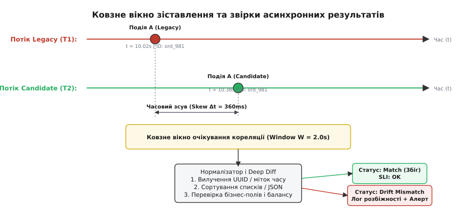

# ⚙️ Асинхронний конвеєр звірки подвійного прогону зі ковзним вікном

Коли дві складні системи працюють у режимі паралельного прогону (Parallel Run), вони рідко обробляють запити з мікросекундною синхронністю. Стара монолітна система може відповісти за 45 мілісекунд, а нова мікросервісна черга через асинхронний брокер подій надішле свій результат через 280 мілісекунд. Буває й навпаки: оптимізований кандидат випереджає стару базу даних на сотні мілісекунд через відсутність застарілих синхронних блокувань таблиць.

Якщо спробувати звіряти результати наївно в синхронному потоці обробки клієнтського запиту, система заплатить подвійною латентністю (очікуванням найповільнішої гілки) і ризикує заблокувати користувача через внутрішній збій у кандидата. Єдиний масштабований підхід для високонавантаженої експлуатації — **повне винесення звірки в асинхронний фоновий конвеєр (англ. *out-of-band reconciliation stream*)**.

Нижче наведено повний розбір побудови такого конвеєра: від обробки часового зсуву за допомогою ковзного вікна до канонізації недетермінізму, партиціювання потоків, регулювання зворотного тиску (backpressure), ідемпотентності повторів та повної інтеграції з метриками спостережуваності.

## Анатомія потокової звірки

Потоковий звіряч споживає два незалежні потоки подій аудиту (наприклад, із двох топіків Apache Kafka або черг RabbitMQ): потік еталонних відповідей старої системи `control` та потік тіньових результатів нової системи `candidate`.

Кожне повідомлення містить три ключові атрибути:
1. `correlation_id` — наскрізний детермінований ідентифікатор бізнес-операції (наприклад, номер замовлення, ID банківської транзакції або хеш платежу), спільний для обох гілок.
2. `timestamp` — фізичний час фіксації результату системою (UTC з точністю до мікросекунд).
3. `payload` — структурований стан, сформований обробником (JSON, Protobuf або Avro).


*Ковзне вікно очікування: події надходять із часовим зсувом (skew). Звіряч утримує першу подію в буфері до надходження другої, виконує канонізацію полів і класифікує збіг або розбіжність.*

Головне завдання буфера — компенсувати **часовий зсув (англ. *clock/processing skew*)**. Якщо для транзакції `tx_1042` першою надійшла відповідь старої системи, вона зберігається в пам'яті всередині вікна очікування (наприклад, із таймаутом `W = 5.0` с). Коли надходить результат від кандидата з тим самим `correlation_id`, обидва об'єкти вилучаються з буфера й передаються на аналіз. Якщо ж вікно вичерпано, а парної події немає, це фіксується як критична аномалія: «кандидат загубив операцію або зазнав аварійного збою».

## Математика й фізика ковзного вікна

Часовий зсув між приходом двох подій `Δt = |t_cand - t_ctrl|` підпорядковується логнормальному розподілу з довгим «хвостом» (long tail). У нормальних умовах медіанний зсув становить 20–80 мілісекунд, однак на 99.9-му процентилі через збирання сміття (GC pause), мережеві ретрансмісії або затримки реплікації `Δt` може сягати кількох секунд.

Розмір вікна `W` є фундаментальним компромісом:
- **Надто мале вікно (`W < 1.0` с):** штучно генерує шторм фальшивих сповіщень про втрату подій (`MissingPartner`), коли кандидат просто затримався на 1.2 секунди під час пікового навантаження.
- **Надто велике вікно (`W > 60` с):** призводить до накопичення мільйонів слотів у оперативній пам'яті, створюючи ризик аварійного падіння процесу звірки через вичерпання пам'яті (OOM).

Оптимальний розмір вікна розраховується емпірично за формулою:

```
W = p99.99(Δt) · 1.5
```

Для типового мікросервісного середовища це значення становить від 3 до 10 секунд.

## Партиціювання та збереження локальності стану

У високонавантажених системах (десятки тисяч операцій на секунду) один процес звірки не здатен утримати весь обсяг подій у локальній пам'яті. Використання зовнішньої розподіленої бази даних типу Redis для кожного кроку очікування вносить додаткові мережеві затримки й значно здорожчує інфраструктуру.

Архітектурний вихід полягає в **детермінованому шардингу за ключем кореляції**. Обидва вхідні топіки подій (і старий, і новий) налаштовуються з однаковою кількістю партицій (наприклад, 64 партиції). Події в обидва топіки відправляються з використанням `correlation_id` як ключа повідомлення Kafka.

Завдяки хешуванню `hash(correlation_id) % 64` і стара, і нова події з однаковим ID гарантовано потрапляють у ту саму партицію й обробляються тим самим екземпляром процесу звірки. Це дозволяє кожному воркеру тримати швидкий in-memory буфер без необхідності розподілених блокувань між вузлами.

## Наскрізний трейсинг і метадані контексту

Кожне повідомлення в обох потоках зобов'язане переносити стандартизовані заголовки контексту трасування (W3C Trace Context / B3 Propagation). Зокрема, заголовок `traceparent` передає версію протоколу, 16-байтний ідентифікатор траси `Trace ID`, 8-байтний ідентифікатор батьківського спану та бітові прапорці вибірки трасування. Коли вхідний шлюз клонує бойовий запит у тіньову гілку кандидата, він генерує новий `Span ID` для тіньового піддерева, але зберігає первинний `Trace ID` незмінним.

Це дає змогу звірячу не лише порівнювати кінцевий payload, а й прикріплювати точні посилання на розподілені трейси обох систем безпосередньо до звіту про розбіжність. Інженер, який розслідує розбіжність за алертом, переходить за лінком у Jaeger або Zipkin і бачить паралельне виконання старої та нової гілок на єдиній часовій шкалі.

## Реалізація: ядро ковзного вікна та аналізатора

Нижче наведено робочу реалізацію ядра звірки на C++ та Go, розраховану на високонавантажену паралельну обробку.

:::tabs
```cpp
#include <iostream>
#include <string>
#include <string_view>
#include <unordered_map>
#include <chrono>
#include <mutex>
#include <memory>
#include <vector>
#include <sstream>
#include <cmath>
#include <functional>

using namespace std::chrono_literals;

// Тип джерела події
enum class SourceBranch { Control, Candidate };

// Структура нормалізованого платіжного результату
struct TransactionResult {
    std::string correlation_id;
    std::string account_id;
    int64_t amount_cents;
    std::string currency;
    std::string status_code;
    std::chrono::system_clock::time_point emitted_at;
};

// Результат порівняння двох гілок
enum class DiffVerdict {
    ExactMatch,
    ToleratedVariance,
    SemanticMismatch,
    StructuralMissing
};

struct DiffReport {
    std::string correlation_id;
    DiffVerdict verdict;
    std::string details;
    std::chrono::milliseconds processing_skew;
};

// Нормалізатор: вилучає недетермінізм і перевіряє строгі бізнес-інваріанти
class LedgerNormalizer {
public:
    static DiffReport compare(const TransactionResult& ctrl, const TransactionResult& cand) {
        DiffReport report;
        report.correlation_id = ctrl.correlation_id;
        
        auto skew = std::chrono::duration_cast<std::chrono::milliseconds>(
            cand.emitted_at > ctrl.emitted_at ? (cand.emitted_at - ctrl.emitted_at) 
                                              : (ctrl.emitted_at - cand.emitted_at));
        report.processing_skew = skew;

        // 1. Перевірка базових контрактних полів
        if (ctrl.account_id != cand.account_id) {
            report.verdict = DiffVerdict::SemanticMismatch;
            report.details = "Account mismatch: ctrl=" + ctrl.account_id + ", cand=" + cand.account_id;
            return report;
        }

        if (ctrl.currency != cand.currency) {
            report.verdict = DiffVerdict::SemanticMismatch;
            report.details = "Currency mismatch: ctrl=" + ctrl.currency + ", cand=" + cand.currency;
            return report;
        }

        if (ctrl.status_code != cand.status_code) {
            report.verdict = DiffVerdict::SemanticMismatch;
            report.details = "Status mismatch: ctrl=" + ctrl.status_code + ", cand=" + cand.status_code;
            return report;
        }

        // 2. Перевірка балансу / суми операції
        if (ctrl.amount_cents != cand.amount_cents) {
            report.verdict = DiffVerdict::SemanticMismatch;
            report.details = "Amount mismatch: ctrl=" + std::to_string(ctrl.amount_cents) +
                             " != cand=" + std::to_string(cand.amount_cents);
            return report;
        }

        report.verdict = DiffVerdict::ExactMatch;
        report.details = "OK";
        return report;
    }
};

// Буфер ковзного вікна звірки
class SlidingReconciliationWindow {
private:
    struct PendingSlot {
        std::unique_ptr<TransactionResult> control_payload;
        std::unique_ptr<TransactionResult> candidate_payload;
        std::chrono::steady_clock::time_point first_seen;
    };

    mutable std::mutex mutex_;
    std::unordered_map<std::string, PendingSlot> slots_;
    std::chrono::milliseconds window_ttl_;

public:
    explicit SlidingReconciliationWindow(std::chrono::milliseconds ttl = 5000ms)
        : window_ttl_(ttl) {}

    // Додати подію з однієї з гілок
    void ingest(SourceBranch branch, TransactionResult result, 
                const std::function<void(const DiffReport&)>& on_diff) {
        std::unique_ptr<TransactionResult> pair_to_compare_ctrl;
        std::unique_ptr<TransactionResult> pair_to_compare_cand;
        std::string cid = result.correlation_id;

        {
            std::lock_guard<std::mutex> lock(mutex_);
            auto now = std::chrono::steady_clock::now();
            auto& slot = slots_[cid];

            if (!slot.control_payload && !slot.candidate_payload) {
                slot.first_seen = now;
            }

            if (branch == SourceBranch::Control) {
                slot.control_payload = std::make_unique<TransactionResult>(std::move(result));
            } else {
                slot.candidate_payload = std::make_unique<TransactionResult>(std::move(result));
            }

            // Якщо обидві половинки надійшли — забираємо на порівняння
            if (slot.control_payload && slot.candidate_payload) {
                pair_to_compare_ctrl = std::move(slot.control_payload);
                pair_to_compare_cand = std::move(slot.candidate_payload);
                slots_.erase(cid);
            }
        }

        // Порівняння робиться ПОЗА локом, щоб не гальмувати паралельні потоки
        if (pair_to_compare_ctrl && pair_to_compare_cand) {
            DiffReport report = LedgerNormalizer::compare(*pair_to_compare_ctrl, *pair_to_compare_cand);
            on_diff(report);
        }
    }

    // Фонова очистка прострочених слотів (події, для яких пара не прийшла)
    void sweep_expired(const std::function<void(const std::string&, SourceBranch)>& on_timeout) {
        std::vector<std::pair<std::string, SourceBranch>> timed_out;
        auto now = std::chrono::steady_clock::now();

        {
            std::lock_guard<std::mutex> lock(mutex_);
            for (auto it = slots_.begin(); it != slots_.end(); ) {
                if (now - it->second.first_seen > window_ttl_) {
                    SourceBranch missing = it->second.control_payload ? SourceBranch::Candidate 
                                                                       : SourceBranch::Control;
                    timed_out.emplace_back(it->first, missing);
                    it = slots_.erase(it);
                } else {
                    ++it;
                }
            }
        }

        for (const auto& [cid, missing_branch] : timed_out) {
            on_timeout(cid, missing_branch);
        }
    }

    size_t pending_count() const {
        std::lock_guard<std::mutex> lock(mutex_);
        return slots_.size();
    }
};
```
```go
package main

import (
	"fmt"
	"sync"
	"time"
)

type SourceBranch int

const (
	BranchControl SourceBranch = iota
	BranchCandidate
)

type TransactionResult struct {
	CorrelationID string
	AccountID     string
	AmountCents   int64
	Currency      string
	StatusCode    string
	EmittedAt     time.Time
}

type DiffVerdict int

const (
	VerdictExactMatch DiffVerdict = iota
	VerdictSemanticMismatch
	VerdictMissingPartner
)

type DiffReport struct {
	CorrelationID  string
	Verdict        DiffVerdict
	Details        string
	ProcessingSkew time.Duration
}

func CompareTransactions(ctrl, cand TransactionResult) DiffReport {
	skew := cand.EmittedAt.Sub(ctrl.EmittedAt)
	if skew < 0 {
		skew = -skew
	}

	report := DiffReport{
		CorrelationID:  ctrl.CorrelationID,
		ProcessingSkew: skew,
	}

	if ctrl.AccountID != cand.AccountID {
		report.Verdict = VerdictSemanticMismatch
		report.Details = fmt.Sprintf("Account mismatch: %s != %s", ctrl.AccountID, cand.AccountID)
		return report
	}

	if ctrl.Currency != cand.Currency {
		report.Verdict = VerdictSemanticMismatch
		report.Details = fmt.Sprintf("Currency mismatch: %s != %s", ctrl.Currency, cand.Currency)
		return report
	}

	if ctrl.StatusCode != cand.StatusCode {
		report.Verdict = VerdictSemanticMismatch
		report.Details = fmt.Sprintf("Status mismatch: %s != %s", ctrl.StatusCode, cand.StatusCode)
		return report
	}

	if ctrl.AmountCents != cand.AmountCents {
		report.Verdict = VerdictSemanticMismatch
		report.Details = fmt.Sprintf("Amount mismatch: %d != %d", ctrl.AmountCents, cand.AmountCents)
		return report
	}

	report.Verdict = VerdictExactMatch
	report.Details = "OK"
	return report
}

type pendingSlot struct {
	control   *TransactionResult
	candidate *TransactionResult
	firstSeen time.Time
}

type SlidingReconciliationWindow struct {
	mu        sync.Mutex
	slots     map[string]*pendingSlot
	windowTTL time.Duration
}

func NewSlidingWindow(ttl time.Duration) *SlidingReconciliationWindow {
	return &SlidingReconciliationWindow{
		slots:     make(map[string]*pendingSlot),
		windowTTL: ttl,
	}
}

func (w *SlidingReconciliationWindow) Ingest(
	branch SourceBranch,
	res TransactionResult,
	onDiff func(DiffReport),
) {
	var readyCtrl, readyCand *TransactionResult
	cid := res.CorrelationID

	w.mu.Lock()
	slot, exists := w.slots[cid]
	if !exists {
		slot = &pendingSlot{firstSeen: time.Now()}
		w.slots[cid] = slot
	}

	if branch == BranchControl {
		slot.control = &res
	} else {
		slot.candidate = &res
	}

	if slot.control != nil && slot.candidate != nil {
		readyCtrl = slot.control
		readyCand = slot.candidate
		delete(w.slots, cid)
	}
	w.mu.Unlock()

	// Звірка без утримання м'ютекса
	if readyCtrl != nil && readyCand != nil {
		report := CompareTransactions(*readyCtrl, *readyCand)
		onDiff(report)
	}
}

func (w *SlidingReconciliationWindow) SweepExpired(
	onTimeout func(cid string, missing SourceBranch),
) {
	now := time.Now()
	var timedOut []struct {
		cid     string
		missing SourceBranch
	}

	w.mu.Lock()
	for cid, slot := range w.slots {
		if now.Sub(slot.firstSeen) > w.windowTTL {
			missing := BranchCandidate
			if slot.candidate != nil && slot.control == nil {
				missing = BranchControl
			}
			timedOut = append(timedOut, struct {
				cid     string
				missing SourceBranch
			}{cid, missing})
			delete(w.slots, cid)
		}
	}
	w.mu.Unlock()

	for _, item := range timedOut {
		onTimeout(item.cid, item.missing)
	}
}
```
:::

## Покроковий розбір ключових механізмів

Розгляньмо, які саме інженерні рішення роблять цей конвеєр стійким у промисловому середовищі:

### 1. Зняття блокування перед важким обчисленням

Зверніть увагу на організацію методу `ingest`. Взяття блокування `std::lock_guard<std::mutex>` (або `w.mu.Lock()`) охоплює **лише** операції з мапою слотів: пошук слота за ключем, запис вказівника та видалення заповненого слота.

Саме порівняння `LedgerNormalizer::compare` винесене за межі критичної секції. Якби важке рекурсивне порівняння полів, розбирання JSON чи нормалізація рядків виконувалися під м'ютексом, конвеєр миттєво перетворився б на вузьке горло. У пікові години один повільний diff на 5 мілісекунд заблокував би паралельне додавання тисяч інших транзакцій. Передача володіння через `std::unique_ptr` дозволяє повністю ізолювати пам'ять об'єктів для безпечної багатопотокової звірки.

### 2. Нормалізація та усунення недетермінізму

У реальних системах сирі байти відповідей ніколи не збігаються на 100%. Нормалізатор зобов'язаний розрізняти нешкідливу технічну варіацію та семантичну помилку розрахунку:

- **Мітки часу (Timestamps):** фізичний час генерації відповіді старою та новою системами завжди відрізняється. Нормалізатор відкидає фізичні мітки часу генерації повідомлення або перевіряє, чи лежить різниця в межах допустимого вікна.
- **Згенеровані ідентифікатори (UUIDs):** внутрішні сурогатні первинні ключі записів у базі даних (наприклад, `log_id = uuid_v4()`) генеруються незалежно кожною системою. Вони виключаються з порівняння; перевіряються лише бізнес-ключі (`account_id`, `order_id`).
- **Сортування колекцій:** якщо старий сервіс повертає список транзакцій у випадковому порядку хеш-таблиці, а новий — відсортованим за часом, перед викликом порівняння обидва масиви приводяться до канонічного порядку (наприклад, сортуються за `transaction_id`).
- **Дробові числа з плаваючою комою:** для фінансових розрахунків використання `double` заборонено — всі суми передаються в мінімальних неподільних одиницях (центах, копійках) як `int64_t`. Якщо ж у нефінансових доменах звіряються дійсні числа, нормалізатор використовує перевірку близькості `std::abs(a - b) < 1e-6`.

### 3. Очищення завислих слотів та виявлення збоїв (Garbage Collection)

Якщо нова система зазнає аварійного падіння на певному типі вхідних даних (наприклад, падає з `NullPointerException` при обробці замовлення без поштового індексу), вона ніколи не надішле відповідь у потік кандидата.

Подія старої системи залишиться в мапі `slots_`. Якщо в системі проходить 5 000 транзакцій на секунду, то 1% втрачених відповідей кандидата призведе до осідання 50 мертвих слотів щосекунди. За добу це створить понад 4.3 мільйона висячих об'єктів, що гарантовано спричинить OOM-аварію процесу звірки.

Метод `sweep_expired` виконує роль спеціалізованого збирача сміття:
1. Фоновий таймер кожні кілька секунд проходить по таблиці слотів.
2. Знаходить записи, чий вік перевищує `window_ttl_`.
3. Вилучає їх із пам'яті та емітує алерт `VerdictMissingPartner` із зазначенням того, яка саме гілка не надала відповіді.
4. Збільшує метрику `reconciliation_dropped_events_total`.

### 4. Регулювання зворотного тиску (Backpressure)

Якщо потік кандидатів починає відставати від основного потоку через тимчасове перевантаження нової бази даних, буфер очікування починає стрімко зростати. Без активного захисту це призведе до каскадного падіння звіряча.

Для запобігання переповненню впроваджуються два рівні захисту:
- **М'який поріг (Soft Limit — 70% ємності буфера):** звіряч тимчасово знижує частоту перевірки некритичних читань за допомогою динамічного семплінгу (наприклад, перевіряє кожне 10-те читання), зберігаючи при цьому 100% перевірок для всіх операцій запису й фінансових мутацій.
- **Жорсткий поріг (Hard Limit — 90% ємності буфера):** вмикається аварійний вимикач (Circuit Breaker). Тіньовий потік кандидата тимчасово призупиняється на вхідному шлюзі, а інженерам надсилається алерт високого пріоритету про деградацію пропускної здатності нової системи.

### 5. Ідемпотентність і захист від повторних повідомлень (At-Least-Once Replays)

Мережеві збої брокера або перезапуски споживачів Kafka можуть викликати повторну доставку (redelivery) пачки подій. Якщо подія `tx_1042` для старої системи надійде вдруге після того, як пара вже була звірена й видалена, вона створить новий самотній слот і через `W` секунд спричинить хибний алерт `MissingPartner`.

Щоб цього уникнути, звіряч використовує фільтр нещодавно завершених операцій (дедуплікаційне кільце або фільтр Блума з часом життя `2W`). Якщо приходить подія з `correlation_id`, яка вже була успішно звірена протягом останніх кількох хвилин, вона мовчки відкидається на рівні споживача як запізнілий дублікат.

### 6. Керування зміщеннями (Offsets) та безпечна зупинка (Graceful Shutdown)

У конвеєрах на базі Apache Kafka наївний підхід автоматичного підтвердження зміщень (`enable.auto.commit = true`) є категорично неприйнятним. Якщо воркер звірки впаде під час утримання в буфері 5 000 непарних подій, автоматично зафіксований офсет призведе до тихої втрати всієї цієї черги аудиту після перезапуску.

Звіряч реалізує ручне керування водяними лініями (Watermark Offset Committing):
- Воркер відстежує мінімальне зміщення (Low Watermark) серед усіх транзакцій, які наразі перебувають у стані очікування в мапі `slots_`.
- Зміщення в Kafka комітяться лише до цієї водяної лінії, тобто фіксуються виключно ті позиції, для яких звірка повністю завершена або які були безпечно видалені за таймаутом.
- Для запобігання втрати буфера при плановому розгортанні нових версій воркерів використовується кооперативний стратегічний розподілювач партицій (`CooperativeStickyAssignor`). На відміну від класичного патерну «stop-the-world» ребалансування, кооперативний підхід не відкликає всі партиції одночасно, а перепризначає лише змінені слоти, дозволяючи процесам завершити звірку наявних даних без скидання стану.
- При отриманні сигналу `SIGTERM` воркер переходить у режим drain: припиняє споживання нових подій, чекає протягом `window_ttl_` на завершення парних операцій, скидає залишок незавершених слотів у персистентну чергу незвірених подій (Dead-Letter Topic) і фіксує фінальні офсети.

### 7. Синхронізація часу між дата-центрами та NTP-дрейф

Якщо стара система працює у власному онпреміс-датацентрі, а кандидат розгорнутий у хмарі (AWS / GCP), різниця фізичних системних годинників через несинхронізовані демони NTP може складати від десятків мілісекунд до кількох секунд.

Використання `system_clock::now()` на кожному вузлі вносить системне викривлення в розрахунок часового зсуву `Δt`. Промисловий стандарт вимагає, щоб мітка часу операції `emitted_at` фіксувалася **єдиним вхідним шлюзом (Ingress Router)** у момент розгалуження трафіку і записувалася в заголовок повідомлення. Звіряч аналізує виключно цю детерміновану точку відліку, нейтралізуючи будь-який міжсерверний годинниковий дрейф.

## Розібраний випадок: розслідування розбіжності за логом

Розгляньмо конкретний інцидент на бойовому потоці: стара система нарахувала комісію $12.50, а нова — $12.49. У консоль оператора надходить структурований звіт розбіжності:

```json
{
  "event": "reconciliation_mismatch",
  "correlation_id": "tx_ord_984128",
  "trace_id": "4bf92f3577b34da6a3ce929d0e0e4736",
  "skew_ms": 142,
  "verdict": "SemanticMismatch",
  "diff": {
    "field": "amount_cents",
    "control": 1250,
    "candidate": 1249
  },
  "context": {
    "gross_amount": 24990,
    "fee_rate": 0.05,
    "account_tier": "STANDARD"
  }
}
```

Аналіз контексту показує першопричину: стара система на мові Perl використовувала банківське округлення до найближчого парного (round-to-even), а нова на Go — математичне округлення з відсіканням (truncation).

Виявлення цієї невідповідності на стадії паралельного прогону дозволило скоригувати бібліотеку округлення кандидата до того, як вона спричинила каскадні дисбаланси в головній бухгалтерській книзі.

## Телеметрія, SLO та інтеграція в продакшн

Результати кожного виклику `on_diff` агрегуються в системі моніторингу (Prometheus / OpenTelemetry) у вигляді стандартних індикаторів рівня обслуговування (SLI):

```
# Кількість перевірених операцій за категоріями вердиктів
reconciliation_verdicts_total{status="exact_match"} 4982103
reconciliation_verdicts_total{status="semantic_mismatch", field="amount"} 0
reconciliation_verdicts_total{status="semantic_mismatch", field="status_code"} 2
reconciliation_verdicts_total{status="missing_partner", branch="candidate"} 5

# Гістограма часового зсуву між системами
reconciliation_processing_skew_seconds_bucket{le="0.05"} 4100200
reconciliation_processing_skew_seconds_bucket{le="0.5"}  4950100
reconciliation_processing_skew_seconds_bucket{le="2.0"}  4982100
reconciliation_processing_skew_seconds_bucket{le="+Inf"} 4982110
```

Кожна знайдена розбіжність (`SemanticMismatch`) негайно записується в захищений лог розбіжностей у форматі структурованого JSON із маскуванням конфіденційних персональних даних (PII). Лог містить повний знімок стану обох гілок (`control_payload` та `candidate_payload`), що дозволяє інженерам локалізувати дефект у коді кандидата за лічені хвилини без необхідності відтворювати бойовий трафік вручну.

## Операційний регламент при виявленні розбіжностей (SRE Playbook)

Коли метрика `reconciliation_verdicts_total{status="semantic_mismatch"}` починає зростати під час чергового етапу паралельного прогону, черговий інженер дотримується чіткого чотирикрокового алгоритму:

1. **Оцінка швидкості вичерпання бюджету помилок (Burn Rate):** якщо темп розбіжностей перевищує 0.01% від загального потоку, автоматичний тригер заморожує процес розкочування і зупиняє переведення нових клієнтських когорт у тіньовий контур.
2. **Класифікація характеру розбіжності за логом:** інженер визначає, чи є помилка дефектом бізнес-логіки нової системи (наприклад, пропущена податкова ставка), чи це наслідок недокументованої особливості старої системи (bug-for-bug compatibility).
3. **Формування винятку або виправлення:** якщо стара система містила баг, який у новій свідомо виправлено, у конфігурацію нормалізатора додається тимчасове правило толерантності (Waiver Rule), яке явно маркує цю різницю як допустиму з посиланням на відповідне архітектурне рішення (ADR). Якщо ж помилка сидить у кандидаті — створюється блокуючий дефект на виправлення коду нової гілки.
4. **Контрольний прогін після виправлення:** після деплою виправленої версії кандидата лічильник розбіжностей обнуляється, і система має відпрацювати щонайменше 72 години в чистому стані на 100% бойового навантаження, перш ніж переходити до наступної фази перемикання авторитетності.
