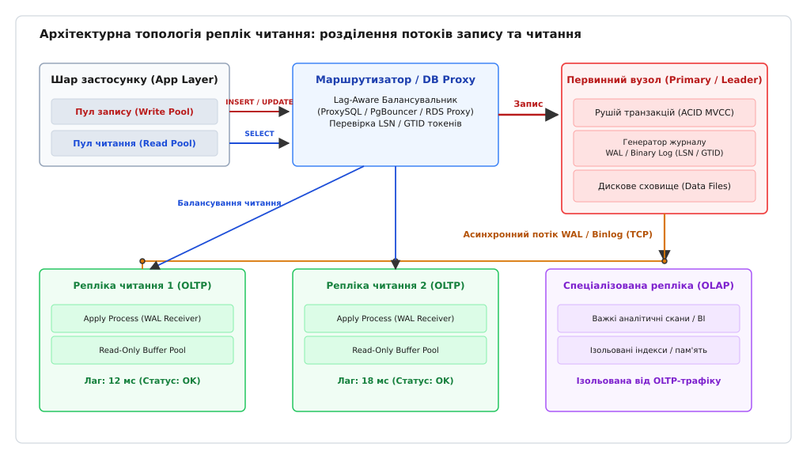
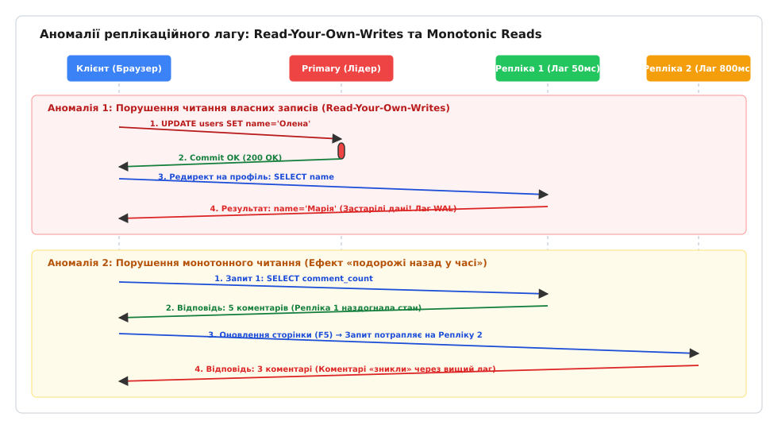
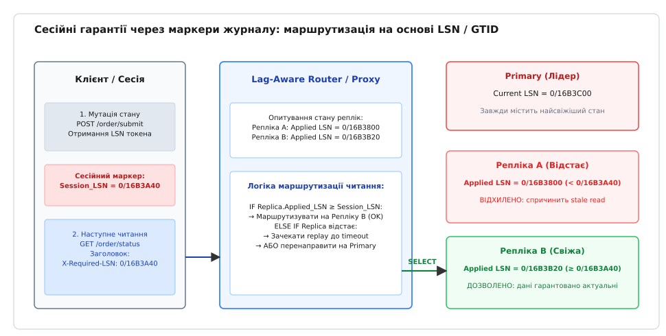
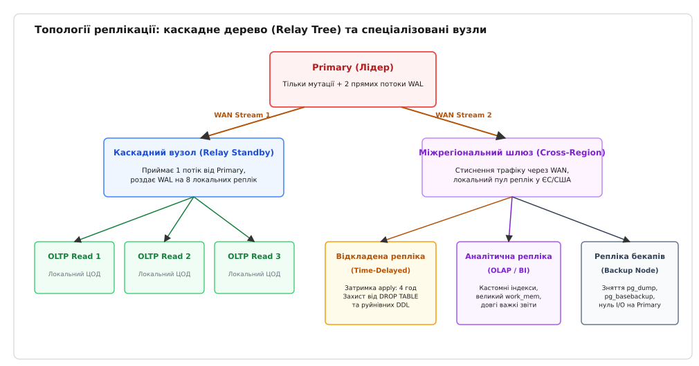

# Репліки читання та реплікація

<preknowlist>
- [Журнал попереднього запису (WAL)](book:programming/write-ahead-log) — принцип послідовної фіксації байтових змін на диску до модифікації сторінок у пам'яті.
- [Лідер-фоловер / мультилідер / leaderless](book:programming/replication-leader-follower) — базові топології розподілу ролей між вузлами розподіленого сховища.
- [Реплікаційний лаг і сесійні гарантії](book:programming/replication-lag) — природа часового відставання вторинних вузлів та моделі сесійної узгодженості.
- [Балансування та зворотний проксі](book:programming/reverse-proxy-load-balancing) — розподіл клієнтського трафіку між пулами обчислювальних серверів.
</preknowlist>

У листопаді 2020 року під час масштабного святкового розпродажу «Чорна п'ятниця» онлайн-ритейлер зіткнувся з лавиноподібним зростанням трафіку: інтенсивність запитів підскочила з 3 500 до 48 000 на секунду. Профіль навантаження був типовим для електронної комерції — 94% становили операції читання (перегляд карток товарів, пошук, фільтрація, перевірка залишків) і лише 6% — операції запису (оформлення замовлень, оновлення кошика, резервування на складі). Єдиний монолітний сервер бази даних PostgreSQL на 64 процесорних ядрах увійшов у стан 100% утилізації CPU: важкі аналітичні запити пошуку витіснили з буферного пулу оперативної пам'яті гарячі індекси, а дисковий масив NVMe захлинувся від операцій випадкового читання сторінок. Затримка запису транзакцій у журнал WAL зросла з 0.8 мс до 85 мс. Пул підключень на 500 клієнтів заповнився за 12 секунд, спричинивши каскадне падіння веб-серверів та масові помилки `HTTP 504 Gateway Timeout` по всій системі.

Спроба розв'язати проблему вертикальним масштабуванням (купівлею сервера на 128 або 256 ядер) натрапляє на стіну економічної та фізичної невигідності: ціна «залізного» сервера зростає експоненційно, а внутрішня конкуренція процесорних потоків за глобальні блокування пам'яті (`shared_buffers`) та чергу скидання журналу WAL нівелює приріст ядер. Єдиним фундаментальним інженерним рішенням є архітектурне розділення потоків мутації та читання даних.

**Реплікація (від лат. *replicatio* — повторення, відбиток)** даних на вторинні сервери — **репліки читання (англ. *Read Replicas*; від лат. *replicare* — розгортати назад, повторювати)** — дозволяє зняти до 99% навантаження з первинного вузла, транслюючи потік змін через асинхронний мережевий протокол. Проте така децентралізація кардинально змінює модель узгодженості системи, породжуючи реплікаційний лаг, аномалії читання власних записів та виклики маршрутизації трафіку.


*Архітектурна топологія реплік читання: розділення трафіку запису на Primary та балансування SQL-запитів читання через проксі-маршрутизатор на пул реплік*

## Анатомія конфлікту ресурсів на монолітному вузлі

Щоб зрозуміти, чому один сервер бази даних не здатен ефективно поєднувати запис і масове читання, необхідно простежити конфлікти апаратних ресурсів на рівні ядра СКБД.

Коли реляційна або документоорієнтована база даних виконує транзакцію запису (`INSERT`, `UPDATE`, `DELETE`), вона здійснює дві обов'язкові дії:
1. Записує бінарні дельти змін у послідовний журнал транзакцій на диску (WAL у PostgreSQL, Redo Log / Binlog у MySQL) та викликає системний виклик `fsync()` для гарантії довговічності (Durability за стандартом ACID).
2. Модифікує відповідні сторінки таблиць та дерев B-Tree в оперативній пам'яті (у буферному пулі `shared_buffers` або `innodb_buffer_pool`), позначаючи їх як «брудні» (англ. *dirty pages*).

Паралельно з цим на сервер надходять сотні запитів `SELECT`. Кожен складний запит на читання (наприклад, фільтрація товарів за категорією з сортуванням за ціною) вимагає зчитування тисяч сторінок даних. Якщо ці сторінки відсутні в оперативній пам'яті, СКБД виконує алгоритм витіснення (наприклад, Clock Sweep у PostgreSQL або LRU в MySQL). В результаті активні операції читання вимивають з кешу сторінки гарячих таблиць, змушуючи фонові процеси скидання брудних сторінок (`checkpointer` або `page cleaner`) частіше писати на диск.

Виникає **дискова інтерференція (англ. *I/O Contention*)**: послідовний швидкісний запис журналу WAL конкурує на рівні черги дискового контролера з масивним потоком випадкового читання даних. Час відгуку системного виклику `write()` для транзакцій запису зростає, блокуючи клієнтські потоки на очікуванні `WALWriteLock`.

Другим вузьким місцем є **конкуренція блокувань у пам'яті (Lock Contention)**. Навіть у сучасних рушіях із багатоверсійною паралельністю (MVCC), де читачі не блокують письменників на рівні рядків даних, залишаються системні блокування структур пам'яті: штифти буферів (Buffer Pins), блокування сторінок індексів B-Tree та легкозважні блокування (LWLocks) списків вільного простору. Чим більше читачів сканують дерево індексу, тим довше транзакція запису очікує права на розщеплення вузла індексу (`page split`).

Розділення бази даних на **первинний вузол (Primary / Leader / Source)**, який займається виключно обробкою мутацій та генерацією журналу, та пул **реплік читання (Read Replicas / Standby)**, які працюють у режимі «лише для читання» (Read-Only), повністю ліквідує внутрішню інтерференцію ресурсів.

Детальний історичний шлях розвитку реплікації — від дзеркалювання дисків у мейнфреймах Tandem NonStop до розподілених журналів у хмарі — викладено в історичному нарисі: [Історія реплікації баз даних: від дзеркальних дисків Tandem NonStop до розподілених журналів і хмарних рушіїв](book:programming/read-replicas-replication/hist-replication-origins.md).

## Механізми трансляції змін: від SQL до фізичних байтів

Поширення стану від первинного вузла до реплік спирається на один із чотирьох фундаментальних механізмів передачі журналу. Кожен механізм формує власний баланс між пропускною здатністю, навантаженням на CPU та гнучкістю топології.

### 1. Реплікація інструкцій (Statement-Based Replication, SBR)

Первинний вузол записує в бінарний лог безпосередній текст виконаного SQL-запиту: `UPDATE accounts SET balance = balance + 100 WHERE id = 42`. Репліка зчитує текст запиту і заново виконує його через власний SQL-парсер, планувальник та рушій виконання.

*Перевага:* Надзвичайно компактний журнал. Запит, що оновлює 1 000 000 рядків, займає в журналі лише 80 байтів тексту.

*Фатальна вада (Недетермінізм):* Будь-який запит, що використовує недетерміністичні функції часу (`NOW()`), генератори випадкових чисел (`RAND()`), унікальні ідентифікатори (`UUID()`) або умови `LIMIT` без жорсткого `ORDER BY`, виконається на репліці з іншим результатом. Це призводить до прихованого розходження даних (англ. *Silent Data Corruption*). У сучасних продакшн-системах чистий SBR заборонений.

### 2. Рядкова логічна реплікація (Row-Based Replication, RBR)

Primary записує в журнал не текст SQL-команди, а бінарні дельти змінених рядків: образ рядка до мутації (Before-Image) та образ після мутації (After-Image). Репліка не парсить SQL, а безпосередньо застосовує нові байти до локальних таблиць за первинним ключем.

*Перевага:* 100% математичний детермінізм. Усуваються помилки функцій часу, тригерів та генераторів послідовностей.

*Недолік:* Вибухове зростання обсягу журналу при масових операціях. Запит `UPDATE logs SET archived = true` над 10 мільйонами рядків згенерує гігабайти бінарного логу, що призведе до сплеску мережевого трафіку та перевантаження диска репліки.

### 3. Фізичний блоковий стримінг (Physical Streaming Replication)

Стандарт для PostgreSQL (починаючи з версії 9.0) та Oracle Data Guard. Первинний вузол передає потік байтів журналу попереднього запису (WAL), який описує фізичні зміни сторінок пам'яті та дискових блоків на рівні байтових зміщень LSN (Log Sequence Number).

Процес реалізується через пару процесів:
- `walsender` на Primary читає згенеровані байти з пам'яті WAL-буферів і відправляє їх відкритим TCP-сокетом.
- `walreceiver` на репліці приймає байти, записує їх у локальний WAL і передає процесу відновлення (`startup process`), який безпосередньо перезаписує 8-кілобайтні сторінки в пам'яті та на диску.

*Перевага:* Найвища можлива швидкість. Відсутні накладні витрати на парсинг SQL, пошук рядків чи перевірку обмежень цілісності. Репліка є точною побітовою копією лідера.

*Недолік:* Жорстка прив'язка до архітектури. Primary та Replica повинні мати однакову версію СКБД, однаковий розмір сторінки диска (8 КБ), однаковий порядок байтів процесора (Endianness) та однакові системні бібліотеки кодування. Неможливо створити репліку лише для однієї таблиці чи реплікувати дані між PostgreSQL 12 та PostgreSQL 16.

### 4. Логічне декодування та захоплення змін (Logical Decoding / CDC)

Спеціальний плагін на Primary (наприклад, `pgoutput` у PostgreSQL або Debezium для Apache Kafka) зчитує фізичний потік WAL і декодує його в абстрактні логічні події рівня кортежів: `INSERT table_name (col1, col2) VALUES (...)`.

*Перевага:* Максимальна гнучкість. Дозволяє оновлювати версії СКБД без простою (Zero-Downtime Major Version Upgrade), реплікувати дані між різними типами баз (з PostgreSQL у ClickHouse чи Elasticsearch) та фільтрувати окремі таблиці чи колонки.

*Недолік:* Вищі витрати процесора Primary на декодування журналу та повільніше накатування змін на репліці порівняно з фізичним стримінгом.

---

## Спектр синхронності: Durability проти Latency

Передача журналу між вузлами може здійснюватися в одному з трьох режимів синхронності. Цей вибір визначає, чим ризикує система при аварії лідера: втратою даних чи падінням продуктивності запису.

```
Асинхронна           Напівсинхронна (Semi-Sync)          Повністю синхронна (2PC / Quorum)
─────────────────────────────────────────────────────────────────────────────────────────────
Primary ──[WAL]──> Репліка     Primary ──[WAL]──> Репліка         Primary ──[WAL]──> Репліка 1
  │                             │                  │                │                  │
Commit OK                       │                Flush ACK          │                Flush ACK
(миттєво)                       ▼                  │                │                  │
                           Commit OK <─────────────┘                │                  ▼
                           (очікує 1 репліку)                       │             Репліка 2
                                                                    │                  │
                                                                    │                Flush ACK
                                                                    ▼                  │
                                                               Commit OK <─────────────┘
                                                               (очікує всі / кворум)
─────────────────────────────────────────────────────────────────────────────────────────────
Латентність:  Мінімальна       Латентність: Помірна (+1 RTT)      Латентність: Найвища (max RTT)
Втрата даних: RPO > 0          Втрата даних: RPO ≈ 0 (1 вузол)    Втрата даних: RPO = 0
```

### 1. Асинхронна реплікація (Asynchronous Replication)

Первинний вузол записує транзакцію у свій локальний WAL, викликає `fsync()` і негайно повертає клієнту статус успішної фіксації (`200 OK` / `COMMIT`). Трансляція журналу реплікам відбувається у фоновому режимі.

- *Плюси:* Максимальна пропускна здатність запису. Затримка мережі чи зависання реплік жодним чином не впливають на швидкість транзакцій лідера.
- *Мінуси:* Точка відновлення `RPO > 0`. Якщо сервер лідера фізично згорить до того, як байти журналу дійдуть мережею до репліки, останні підтверджені клієнтам транзакції буде втрачено назавжди. Крім того, неминуче виникає реплікаційний лаг.

### 2. Повністю синхронна реплікація (Synchronous Replication)

Лідер не підтверджує клієнту фіксацію транзакції, доки всі зареєстровані репліки не отримають байти журналу, не запишуть їх на свій диск і не надішлють мережеве підтвердження (ACK).

- *Плюси:* Гарантія нульової втрати даних (`RPO = 0`). Будь-яка репліка містить абсолютно актуальний стан.
- *Мінуси:* Латентність кожного запису зростає на величину найповільнішого мережевого раунду (RTT) серед усіх реплік. Якщо хоча б одна репліка зависне через нестачу пам'яті або мережевий збій, усі операції запису в системі повністю заблокуються, руйнуючи доступність (Availability).

### 3. Напівсинхронна реплікація (Semi-Synchronous Replication)

Компромісний інженерний стандарт (наприклад, `rpl_semi_sync` у MySQL або `synchronous_commit = on` із параметром `synchronous_standby_names = 'FIRST 1 (rep1, rep2)'` у PostgreSQL). Лідер очікує підтвердження запису у журнал щонайменше від *однієї* активної репліки з пулу. Якщо виділена репліка не відповідає протягом таймауту (наприклад, 1000 мс), первинний вузол автоматично деградує до асинхронного режиму, зберігаючи доступність системи для запису.

Повний перелік параметрів ядра СКБД, системних запитів та директив налаштування зібрано в довіднику: [Параметри конфігурації, системні виклики та метрики реплікації](book:programming/read-replicas-replication/api-replication-configs-and-metrics.md).

---

## Реплікаційний лаг: Фізичні причини та конфлікти відновлення

**Реплікаційний лаг (англ. *Replication Lag*)** — це часова або байтова затримка між моментом фіксації зміни на первинному вузлі та моментом, коли ця зміна стає видимою для запитів читання на репліці.

Лаг вимірюється у двох вимірах:
1. **Байтовий лаг (Byte Lag / LSN Lag):** Різниця між поточною позицією запису журналу лідера `pg_current_wal_lsn()` та останньою позицією, застосованою реплікою `pg_last_wal_replay_lsn()`.
2. **Часовий лаг (Time Lag):** Різниця в часі між позначкою створення транзакції на лідері та моментом її фактичного відтворення на репліці (метрика `Seconds_Behind_Source` у MySQL або `replay_lag` у PostgreSQL).

### Чотири кореневі причини відставання реплік

1. **Асиметрія паралелізму (Однопотоковий Apply Bottleneck):**
На первинному вузлі 64 процесорних ядра паралельно обробляють транзакції від тисяч клієнтів. Усі їхні зміни записуються в один лінійний потік журналу. Якщо на репліці процес відновлення працює в один потік (класичний `SQL_THREAD` у MySQL до версії 5.7 або `startup process` у PostgreSQL), одне ядро репліки фізично не встигає відтворювати обсяг роботи, згенерований 64 ядрами лідера. Сучасні версії MySQL вирішують це через багатопотокову реплікацію (MTS, `replica_parallel_workers = 8`, `replica_parallel_type = LOGICAL_CLOCK`), яка аналізує групи одночасно зафіксованих транзакцій і виконує їх паралельно.

2. **Пакетні операції та масивні DDL:**
Виконання команд на кшталт `ALTER TABLE orders ADD COLUMN status_code INT;` або видалення старих даних `DELETE FROM events WHERE created_at < '2023-01-01';` на лідері генерує гігабайти записів журналу або вимагає ексклюзивного блокування таблиці. Коли цей сегмент журналу доходить до репліки, процес накатування блокує всі інші операції, викликаючи стрибок лагу на хвилини або години.

3. **Дефіцит операцій вводу-виводу (IOPS Starvation):**
У хмарних середовищах (AWS EBS, GCP Persistent Disk) реплікам часто виділяють менше гарантованих IOPS, ніж лідеру, заради економії. Коли лідер виконує інтенсивний запис, репліка вичерпує баланс burst-кредитів диска, швидкість накатування WAL падає до кілобайтів на секунду, а черга журналу зростає.

4. **Конфлікти відновлення у режимі Hot Standby (Replication Conflicts):**
Найбільш підступна проблема PostgreSQL. Уявімо, що клієнт підключився до репліки читання і запустив важкий аналітичний звіт, який виконується 40 секунд. Запит відкриває знімок даних (Snapshot) і утримує блокування сторінок або штифти буферів (`Buffer Pins`). У цей же час процес `VACUUM` на Primary очищає старі версії рядків у тій самій таблиці й транслює інструкцію очищення сторінки через WAL на репліку.

Процес відновлення на репліці зобов'язаний застосувати очищення сторінки, але не може цього зробити, оскільки активний аналітичний звіт клієнта читає ці самі версії рядків.

У СКБД виникає дилема:
- Якщо почекати завершення запиту клієнта — репліка заморожує накатування WAL, і її реплікаційний лаг починає рости.
- Якщо негайно застосувати WAL — СКБД зобов'язана примусово вбити SQL-запит клієнта з фатальною помилкою: `ERROR: canceling statement due to conflict with recovery`.

За цей компроміс відповідає параметр `max_standby_streaming_delay` (замовчуванням 30 секунд). Якщо конфлікт триває довше 30 секунд, PostgreSQL вбиває запит клієнта заради збереження свіжості репліки. Увімкнення `hot_standby_feedback = on` змушує репліку повідомляти Primary про свої активні читання, забороняючи лідеру видаляти старі версії рядків, але це неминуче викликає роздування таблиць (Table Bloat) на первинному вузлі.

Математичне моделювання динаміки черги реплікації через системи M/M/1 та розрахунок часу розсмоктування спалахів лагу наведено у статті: [Математична модель пропускної здатності, лагу черги реплікації та ймовірності застарілого читання](book:programming/read-replicas-replication/math-replication-capacity-and-lag.md).

---

## Аномалії узгодженості на рівні застосунку

Коли застосунок починає асинхронно читати дані з реплік, розробники стикаються з трьома класичними аномаліями розподілених систем, які неможливо виявити під час локального тестування на одному сервері.


*Часова шкала виникнення аномалій реплікаційного лагу: відкат даних після оновлення профілю (Read-Your-Own-Writes) та ефект «подорожі назад у часі» (Monotonic Reads)*

### 1. Порушення читання власних записів (Read-Your-Own-Writes Anomaly)

Користувач заходить на сторінку налаштувань профілю, змінює своє ім'я з «Марія» на «Олена» і натискає кнопку «Зберегти»:
1. Веб-застосунок відправляє `POST /profile/update` на первинний вузол: `UPDATE users SET name = 'Олена' WHERE id = 10; COMMIT;`.
2. Первинний вузол успішно зберігає запис і повертає відповідь `HTTP 302 Redirect` на адресу `/profile`.
3. Браузер негайно виконує `GET /profile`.
4. Балансувальник направляє цей `GET`-запит на репліку читання, яка має лаг усього 150 мілісекунд.
5. Репліка ще не отримала відповідний WAL-пакет і повертає старий стан: `name = 'Марія'`.

Користувач бачить, що його зміна нібито зникла, натискає «Зберегти» ще раз або звертається до служби підтримки зі скаргою на збій системи.

### 2. Порушення монотонного читання (Monotonic Reads Violation / Time Travel)

Користувач переглядає стрічку новин чи форум із коментарями, де балансування розподіляє запити між двома репліками: Реплікою 1 (лаг 20 мс) та Реплікою 2 (лаг 800 мс).
1. Перший запит користувача потрапляє на свіжу Репліку 1: користувач бачить новий коментар №42.
2. Через 2 секунди користувач оновлює сторінку (натискає `F5`).
3. Балансувальник `Round-Robin` направляє другий запит на відстаючу Репліку 2.
4. Коментар №42 раптово зникає зі сторінки.
5. На наступне оновлення сторінки запит знову йде на Репліку 1 — коментар знову з'являється.

Виникає ефект «мерехтіння стану» або подорожі назад у часі, що руйнує довіру до системи.

### 3. Порушення каузального порядку (Causal Consistency / Consistent Prefix Violation)

У системі існує логічний причинно-наслідковий зв'язок: Питання викликає Відповідь.
1. Користувач А публікує запитання: «Хто завтра черговий?».
2. Користувач Б бачить запитання і пише відповідь: «Я черговий».
3. Через різні затримки реплікації окремих партицій або кешу користувач В зчитує стан і бачить відповідь «Я черговий», але не бачить самого запитання. Порушується префікс причинності.

---

## Архітектури маршрутизації та відновлення сесійних гарантій

Щоб подолати ці аномалії, інфраструктура повинна забезпечувати інтелектуальну маршрутизацію SQL-трафіку.


*Маршрутизація читання на основі сесійних маркерів LSN: клієнт передає токен останнього запису, а проксі обирає лише репліки, які наздогнали цей стан*

Існує три архітектурні підходи до вирішення цієї задачі:

### 1. Розділення пулів з'єднань на рівні коду застосунку

Застосунок ініціалізує два незалежні пули з'єднань: `PrimaryDataSource` та `ReplicaDataSource`.
Розробник явно вказує контекст виконання:
- За замовчуванням методи бізнес-сервісів помічаються анотацією `@Transactional(readOnly = true)` і беруть з'єднання з пулу реплік.
- Методи мутацій помічаються `@Transactional(readOnly = false)` і працюють із лідером.

*Перевага:* Нуль додаткових проміжних вузлів в інфраструктурі, мінімальна латентність.
*Недолік:* Людський фактор. Розробник може випадково виконати важкий звіт у транзакції запису на лідері або прочитати щойно змінені дані з пулу реплік, отримавши аномалію *Read-Your-Own-Writes*.

### 2. Проміжний SQL-проксі (ProxySQL, RDS Proxy, PgBouncer)

Застосунок підключається до єдиного порту проксі-сервера (наприклад, ProxySQL для MySQL або Pgpool-II для PostgreSQL). Проксі інспектує вхідний SQL-потік:
- Запити, що починаються з `SELECT` (і не містять `FOR UPDATE`), автоматично направляються у групу хостів реплік.
- Запити `INSERT`, `UPDATE`, `DELETE`, `BEGIN` скеровуються на первинний вузол.
- Проксі постійно виконує health-check запити і автоматично виключає з пулу репліки, у яких лаг перевищує поріг `max_replication_lag`.

### 3. Техніка сесійного закріплення (Session Pinning / Read-After-Write Window)

Найпростіший спосіб гарантувати *Read-Your-Own-Writes*:
Коли користувач виконує будь-яку мутацію даних (`POST`, `PUT`, `DELETE`), бекенд встановлює у сесії користувача мітку часу останнього запису: `last_write_timestamp = now()`.
Протягом захисного вікна (наприклад, `T_grace = 5–10 секунд`) усі наступні `GET`-запити цього користувача примусово направляються виключно на Primary. Після завершення 10 секунд (коли репліки гарантовано наздогнали стан) маршрутизація повертається до звичайного пулу реплік.

### 4. Каузальне відстеження за маркерами LSN / GTID (Causal Consistency Tokens)

Найбільш математично елегантний та масштабований підхід:
1. Коли Primary фіксує транзакцію, він повертає застосунку точну позицію в журналі: `Commit_LSN` (PostgreSQL) або `GTID` (MySQL).
2. Бекенд повертає цей маркер клієнту в HTTP-заголовку або cookie: `X-Database-LSN: 1/4A8B3C10`.
3. Під час наступного `GET`-запиту клієнт передає заголовок `X-Database-LSN` назад.
4. Маршрутизатор опитує репліки:
   - Якщо `Replica.Applied_LSN ≥ Request.Required_LSN` — репліка гарантовано містить зміни клієнта, запит виконується на репліці.
   - Якщо репліка відстає (`Applied_LSN < Required_LSN`), вона або короткочасно очікує накатування потрібного LSN через виклик `WAIT_FOR_EXECUTED_GTID_SET()`, або запит прозоро перенаправляється на лідера.

Повну реалізацію такого маршрутизатора мовами C++, Go та Python наведено у практичному проєкті: [Реалізація маршрутизатора читання з контролем лагу та сесійними маркерами LSN](book:programming/read-replicas-replication/proj-lag-aware-read-router.md).

---

## Спеціалізовані та каскадні топології реплікації

У великих розподілених системах репліки читання перестають бути однорідним пулом однакових машин. Їх спеціалізують під конкретні бізнес-задачі та будують у каскадні дерева.


*Топології реплікації: каскадне дерево передачі журналу (Relay Tree) та виділені вузли (аналітика, бекапи, часова затримка)*

### 1. Каскадна реплікація (Cascading / Relay Replication)

Якщо підключити до первинного вузла 30 реплік читання напряму, лідер витрачатиме гігабіти мережевої смуги лише на дублювання WAL-потоку (Fan-out problem).
У каскадній топології Primary відправляє потік журналу лише на 2 проміжні репліки (**Relay Nodes / Standby Masters**). Кожен Relay-вузол роздає потік 15 кінцевим листовим реплікам. Це зменшує навантаження на мережевий інтерфейс лідера в рази.

### 2. Аналітичні репліки (OLAP / Reporting Standby)

Окремі репліки виділяються виключно під важкі генерації фінансових звітів, бізнес-аналітику (BI) або експорт даних у сховища Data Lake:
- Вони повністю ізольовані від клієнтського OLTP-трафіку (користувачі магазину не деградують, коли аналітик запускає звіт на 10 хвилин).
- На них конфігурують збільшений обсяг пам'яті для сортування (`work_mem = 2GB`), вимикають `max_standby_streaming_delay` (`-1`) і створюють додаткові специфічні індекси, яких немає на Primary.

### 3. Відкладені репліки (Time-Delayed Standby)

Репліка навмисно налаштовується на відставання від лідера на фіксований час (наприклад, `recovery_min_apply_delay = '4h'` у PostgreSQL).
Якщо опівдні розробник або баг у скрипті міграції випадково виконає `DROP TABLE users;` або `UPDATE orders SET status = 'CANCELLED';` без умови `WHERE`, ця команда за 2 мілісекунди виконається на всіх звичайних репліках високої доступності.
Проте відкладена репліка матиме 4-годинний запас часу. Інженери просто зупиняють процес відновлення на відкладеній репліці, вивантажують втрачену таблицю і відновлюють працездатність бізнесу без довготривалого розгортання бекапів із холодного сховища.

### 4. Міжрегіональні репліки (Cross-Region Read Replicas)

Репліка розгортається в іншому географічному регіоні або на іншому континенті (наприклад, Primary у Франкфурті, а репліка читання — у Сінгапурі чи Вірджинії).
- Забезпечує мінімальний пінг (RTT < 5 мс) для місцевих користувачів, які лише переглядають каталог.
- Слугує гарячим резервом для плану аварійного відновлення [Бекапи і DR](book:programming/disaster-recovery) у разі тотальної загибелі європейського дата-центру.

---

## Failover, промоція та запобігання Split-Brain

Коли первинний вузол виходить з ладу (апаратний збій, паніка ядра ОС, знеструмлення стійки), кластер повинен обрати одну з реплік читання і **підвищити (англ. *Promote*)** її до ролі нового лідера.

Цей процес супроводжується трьома критичними фазами:
1. **Виявлення аварії та консенсус:** Оркестратор кластера (наприклад, **Patroni** з розподіленим сховищем консенсусу etcd/Consul або **Orchestrator** для MySQL) за допомогою регулярних сигналів перевірки доступності (Heartbeats) виявляє втрату лідера. Лідер вважається загиблим лише тоді, коли більшість (кворум) агентів підтверджує його недоступність.
2. **Вибір найбільш актуальної репліки:** Оркестратор опитує всі доступні репліки і знаходить ту, яка встигла отримати найбільший LSN / GTID. Тільки цей вузол може бути підвищений без втрати транзакцій.
3. **Ізоляція старого лідера (Fencing / STONITH):** Найнебезпечніший сценарій у розподілених системах — **розщеплення мозку (англ. *Split-Brain*)**. Якщо старий Primary не помер, а лише тимчасово втратив мережевий зв'язок з оркестратором (Network Partition), він продовжує вважати себе лідером і приймати локальні записи. Одночасно оркестратор призначає новим лідером репліку. Виникає дві паралельні гілки історії транзакцій, які неможливо об'єднати автоматично.

Для запобігання Split-Brain застосовують метод **STONITH (Shoot The Other Node In The Head)**: перш ніж підвищити репліку, оркестратор через інтерфейс апаратного керування живленням (IPMI, PDU або API хмарного провайдера) фізично вимикає живлення старого сервера або блокує його дисковий том.

Після промоції нового Primary решта реплік перемикаються на отримання журналу від нового лідера за допомогою механізму розгалуження ліній часу (**Timeline ID** у PostgreSQL) або автоматичного позиціонування GTID.

---

## Інженерний підсумок

Реплікація та репліки читання — це фундаментальний інструмент масштабування сучасних баз даних, який перетворює монолітне сховище на розподілений кластер.

Ключові інваріанти експлуатації:
- **Ціна масштабування:** Розділення читання та запису знімає навантаження з Primary, але переводить систему з моделі суворої лінеаризовності в модель кінцевої узгодженості (Eventual Consistency).
- **Свідомий вибір протоколу:** Фізичний блоковий стримінг забезпечує найвищу швидкість і нульовий дрейф даних, тоді як логічне декодування відкриває шлях до міжверсійних міграцій та шин подій (CDC).
- **Захист від аномалій:** Застосунок повинен усвідомлювати природу реплікаційного лагу: критичні фінансові перевірки, процедури автентифікації та операції після мутацій вимагають сесійного закріплення (Read-After-Write Window) або верифікації LSN/GTID маркерів.
- **Стійкість до відмов:** Автоматичний failover неможливий без розподіленого консенсусу (etcd/Consul) та надійної ізоляції збійних вузлів (Fencing), що гарантує збереження цілісності даних у будь-яких нештатних ситуаціях.
