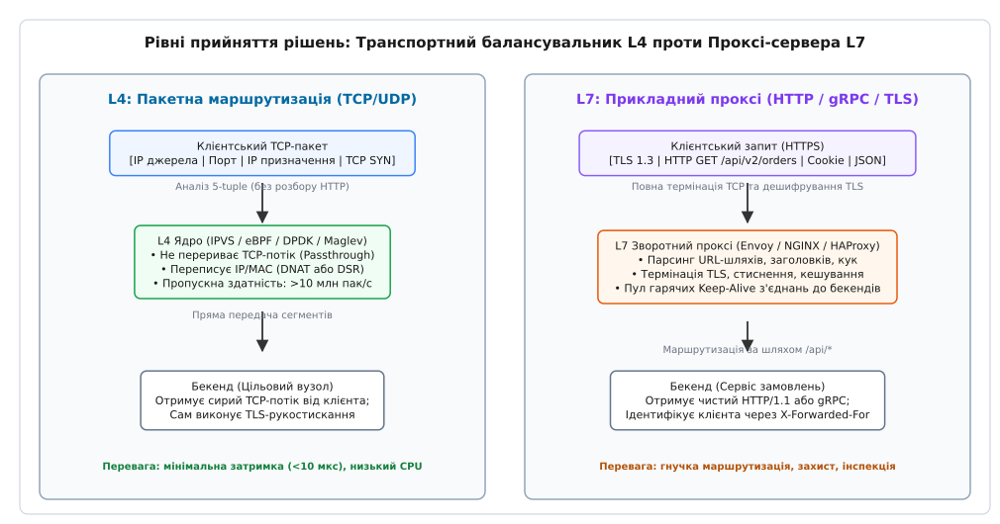
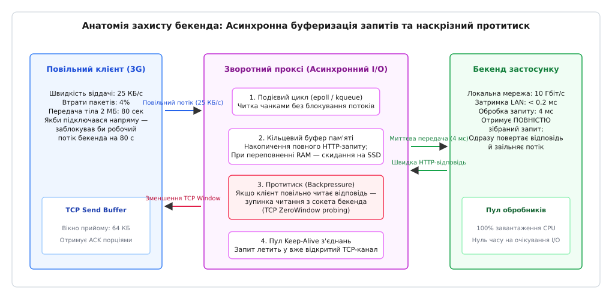
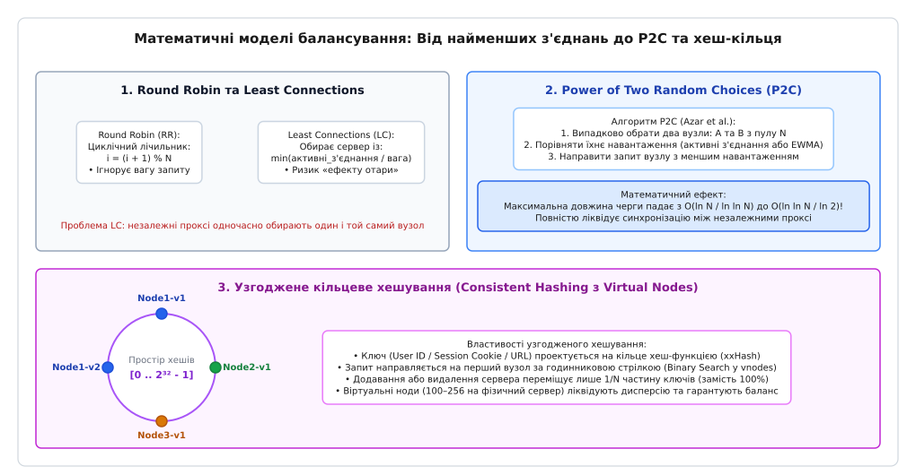
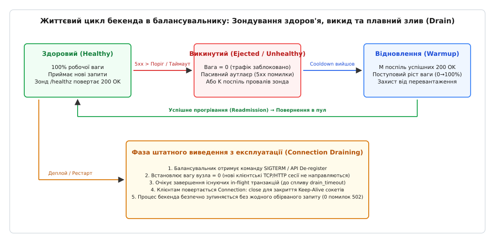

# Зворотні проксі та балансування навантаження

<preknowlist>
* [Мережеві сокети TCP та UDP](book:programming/sockets-tcp-udp) — життєвий цикл сокета, системні виклики listen/accept/connect, блокуючі та неблокуючі сокети.
* [Фреймування повідомлень TCP](book:programming/tcp-message-framing) — потокова природа TCP, виділення меж повідомлень у потоці байтів, парсинг довжини та роздільників.
* [HTTP кешування](book:programming/http-caching) — заголовки Cache-Control, умовні запити ETag/If-None-Match, локальне та проміжне кешування.
* [Штатне завершення роботи сервісів](book:programming/graceful-shutdown) — перехоплення сигналів SIGTERM/SIGINT, обробка поточних запитів і злив пулів з'єднань.
* [Перевірки працездатності (Health Checks)](book:programming/health-checks) — активне та пасивне зондування, liveness та readiness перевірки, захист від каскадних збоїв.
* [Автоматичне масштабування (Autoscaling)](book:programming/autoscaling) — динамічне додавання вузлів, горизонтальне масштабування під навантаженням.
</preknowlist>

Коли мобільний клієнт через нестабільну мережу 3G відправляє HTTP POST-запит із тілом розміром 2 мегабайти на швидкості 20 кілобайтів за секунду, передача даних триває 100 секунд. Якщо сервер застосунку (наприклад, типовий сервіс на Python WSGI, Ruby Puma чи Java Tomcat) виділяє окремий потік операційної системи на кожне відкрите TCP-з'єднання, цей робочий потік блокується на системному виклику `read()` протягом усіх ста секунд, утримуючи стек пам'яті розміром від 2 до 8 мегабайтів і не виконуючи жодної корисної роботи. Пул із двохсот робочих потоків повністю паралізується всього двома сотнями повільних клієнтів (класична атака повільного читання Slowloris), після чого тисячі інших користувачів починають отримувати помилки відмови в обслуговуванні `504 Gateway Timeout`.

Пряме підключення користувачів до серверів застосунку унеможливлює виконання безперервного розгортання коду (Zero-downtime Deployment), змушує кожен мікросервіс самостійно обчислювати важке асиметричне шифрування TLS і позбавляє інфраструктуру можливості динамічно розподіляти запити між обчислювальними вузлами кластера. Для ізоляції серверів застосунку від зовнішнього середовища, асинхронного накопичення байтів і розподілу навантаження використовується спеціалізований проміжний шар — зворотні проксі (Reverse Proxies) та балансувальники навантаження (Load Balancers). Детальний шлях розвитку цих рішень від перших кешувальних прискорювачів до Envoy викладено в огляді [історії еволюції зворотних проксі від Squid до сучасних NGINX та Envoy](book:programming/operations/reverse-proxy-load-balancing/hist-reverse-proxy-evolution.md).

## Архітектурна дихотомія: Балансування на рівні L4 проти L7

Усі системи розподілу мережевого трафіку фундаментально поділяються на два класи залежно від найвищого рівня моделі OSI, на якому приймається рішення про маршрутизацію пакетів: транспортний рівень L4 (Layer 4) та прикладний рівень L7 (Layer 7).


*Архітектурне порівняння L4 та L7 балансування навантаження: комутація пакетів на основі 5-tuple без термінації TCP проти повного розбору HTTP-фреймів із термінацією TLS*

### Балансування на рівні L4 (Транспортний шар)

Балансувальник рівня L4 (наприклад, Linux IPVS, Meta Katran, Google Maglev або AWS Network Load Balancer) працює виключно з заголовками IP та TCP/UDP пакетів. Рішення про призначення цільового сервера приймається на основі мережевого 5-кортежу (5-tuple):

```
5-tuple = { IP джерела, Порт джерела, IP призначення, Порт призначення, Протокол }
```

Балансувальник L4 **не термінує** клієнтську TCP-сесію: він не бере участі у тристоронньому рукостисканні (3-Way Handshake) і не розшифровує криптографічний потік TLS. Натомість він виконує одну з трьох технік перенаправлення пакетів:
1. **Мережева трансляція адрес (NAT / SNAT-DNAT):** Балансувальник переписує IP-адресу призначення в заголовку вхідного IP-пакета на IP-адресу обраного бекенда і перераховує контрольну суму IP-заголовка. Відповідні пакети від бекенда обов'язково проходять зворотний шлях через балансувальник.
2. **Пряме повернення сервера (Direct Server Return, DSR):** Балансувальник не змінює IP-адреси, а змінює лише MAC-адресу канального рівня L2 або загортає пакет у тунель IP-in-IP (Generic Routing Encapsulation, GRE). Бекенди налаштовані зі спільною віртуальною IP-адресою (VIP) на петльовому інтерфейсі `lo`. Бекенд обробляє пакет і надсилає важку відповідь клієнту **напряму через маршрутизатор**, оминаючи балансувальник. Оскільки вихідний трафік вебсервісів зазвичай у 10–50 разів перевищує вхідний, DSR дозволяє одному балансувальнику L4 обслуговувати смугу пропускання у сотні гігабітів на секунду.
3. **Обробка в ядрі через eBPF / XDP:** Пакети перехоплюються на рівні мережевого драйвера мережевої карти (XDP, eXpress Data Path) до виділення структур `sk_buff` у ядрі Linux, що забезпечує швидкість комутації понад 10 мільйонів пакетів на секунду на одне процесорне ядро.

### Балансування на рівні L7 (Прикладний шар)

Балансувальник рівня L7 (NGINX, HAProxy, Envoy, Traefik, AWS Application Load Balancer) є повноцінним проксі-сервером. Він створює **два незалежних TCP-з'єднання**:
- Перше TCP-з'єднання встановлюється між зовнішнім клієнтом і балансувальником;
- Друге TCP-з'єднання встановлюється між балансувальником і внутрішнім сервером застосунку.

Балансувальник L7 повністю розшифровує TLS, розбирає потік байтів на рівні протоколів HTTP/1.1, HTTP/2 або HTTP/3, парсить метод, URL-шлях, заголовки та cookie.

| Характеристика | Балансування L4 (IPVS / eBPF) | Балансування L7 (NGINX / Envoy) |
| :--- | :--- | :--- |
| **Одиниця маршрутизації** | IP-пакет / TCP-сегмент | HTTP-запит / gRPC-виклик / WebSocket кадр |
| **Термінація TCP та TLS** | Відсутня (наскрізний потік) | Повна (термінація та перешифрування) |
| **Критерії маршрутизації** | IP-адреси та TCP/UDP порти | URL-шлях, HTTP-заголовки, Cookie, вагові коефіцієнти |
| **Пропускна здатність** | 10–100 Гбіт/с на вузол (мільйони PPS) | 1–10 Гбіт/с на вузол (десятки тисяч RPS) |
| **Використання пам'яті CPU** | Константне (кілька байтів на запис стану сокета) | Пропорційне обсягу тіла запитів (МБ на клієнта) |
| **Модифікація трафіку** | Неможлива | Вставка заголовків, стиснення Gzip/Brotli, ін'єкція cookie |
| **Захист від Slowloris** | Мінімальний (не буферизує L7 дані) | Повний (асинхронна буферизація всього запиту) |

Сучасні високонавантажені інфраструктури комбінують обидва підходи у дворівневу архітектуру: на межі дата-центру розгортається шар L4 (DSR на базі eBPF/Katran), який рівномірно розподіляє мільйони сирих TCP-пакетів між фермою L7-проксі (NGINX/Envoy), де вже виконується термінація TLS, перевірка авторизації та маршрутизація до конкретних сервісів.

## Анатомія зворотного проксі: буферизація, epoll та управління протитиском

Головна захисна функція зворотного проксі полягає у фізичному розриві та ізоляції повільної глобальної мережі клієнта (Wide Area Network, WAN) від високошвидкісної внутрішньої мережі дата-центру (Local Area Network, LAN).


*Анатомія зворотного проксі: асинхронне накопичення запитів через epoll, розігрітий пул з'єднань LAN та протитиск TCP Zero-Window*

### Асинхронне введення-виведення через epoll

Замість створення блокуючих потоків, зворотний проксі запускає невелику кількість неблокуючих робочих процесів (воркерів), зазвичай рівну кількості фізичних ядер CPU. Кожен воркер реєструє тисячі відкритих файлових дескрипторів сокетів у системному мультиплексорі `epoll` ядра Linux:

```
epoll_create1() → epoll_ctl(EPOLL_CTL_ADD, client_fd, EPOLLIN | EPOLLET) → epoll_wait()
```

Коли повільний мобільний клієнт надсилає байти порціями по 512 байтів раз на кілька секунд, ядро складає їх у буфер прийому сокета (`SO_RCVBUF`). Воркер проксі пробуджується системним викликом `epoll_wait()` лише в ті мілісекунди, коли в сокеті з'явилися готові дані, вичитує їх у внутрішній кільцевий буфер пам'яті й негайно перемикається на обслуговування інших користувачів. Сервер бекенда навіть не підозрює про існування клієнта, поки проксі повністю не отримає всі байти тіла HTTP-запиту.

Щойно останній байт клієнтського запиту записано у буфер, проксі відкриває підключення до бекенда через LAN (де час кругового обігу RTT становить менше 0.2 мілісекунди) і передає весь двомегабайтний запит монолітним пакетом за 2–3 мілісекунди. Робочий потік бекенда активується рівно на 2 мілісекунди замість 100 секунд, виконує обчислення і повертає відповідь.

### Дворівнева буферизація та скидання на диск

Пам'ять процесу проксі обмежена. Якщо одночасно тисяча клієнтів почнуть завантажувати файли розміром по 50 мегабайтів, розміщення їх у RAM призведе до аварійного знищення процесу механізмом Out-Of-Memory Killer (`oom-killer`) ядра Linux.

Для запобігання цьому використовується дворежимна буферизація:
1. Якщо розмір тіла менший за поріг `client_body_buffer_size` (зазвичай 16–128 КБ), воно зберігається виключно в оперативній пам'яті;
2. Якщо розмір перевищує оперативний поріг, проксі асинхронно відкриває тимчасовий анонімний файл за допомогою прапорця `O_TMPFILE` у ядрі Linux (`open("/tmp", O_TMPFILE | O_RDWR, 0600)`). Тіло запиту скидається на диск потоковими блоками без утворення запису у файловій таблиці каталогу.

### Механізм протитиску (Backpressure) та TCP Zero-Window

Зворотна ситуація виникає під час передачі відповіді: швидкий сервер застосунку генерує HTML-звіт або JSON-масив розміром 10 мегабайтів за 5 мілісекунд, але клієнт читає його через повільний мобільний канал.

Якщо проксі буде безупинно зчитувати відповідь із сокета бекенда, оперативна пам'ять проксі переповниться невідправленими даними. Для запобігання переповненню спрацьовує ланцюжок протитиску (Backpressure):
1. Проксі заповнює внутрішній буфер сокета відправки клієнту (`SO_SNDBUF`);
2. Коли клієнт не встигає підтверджувати отримані TCP-сегменти, розмір вікна прийому клієнта (TCP Receive Window, `rcv_wnd`) у заголовках пакетів ACK зменшується до 0;
3. Отримавши `TCP Zero Window`, ядро операційної системи проксі зупиняє передачу байтів у мережеву карту;
4. Внутрішній буфер відправки проксі заповнюється, і системний виклик `write(client_fd)` починає повертати помилку `EAGAIN` / `EWOULDBLOCK`;
5. Проксі фіксує блокування клієнтського сокета і **припиняє вичитувати дані** з сокета бекенда (видаляє подію `EPOLLIN` для `backend_fd`);
6. Буфер прийому сокета бекенда в ядрі заповнюється, ядро надсилає `TCP Zero Window` назад бекенду, змушуючи процес бекенда заблокуватися на виклику `write()` або призупинити генерацію даних у сокет.

Цей механізм автоматично узгоджує швидкість генерації даних сервером застосунку з реальною фізичною швидкістю клієнтського каналу зв'язку без витоків оперативної пам'яті.

## Термінація TLS та трансляція контексту клієнтської сесії

Виконання асиметричної криптографії під час встановлення захищеного з'єднання (TLS Handshake на базі алгоритмів RSA-2048, ECDSA P-256 або X25519) є надзвичайно ресурсомісткою операцією: один серверний процесор здатен виконати не більше 1 500–3 000 повних рукостискань TLS на секунду на одне процесорне ядро.

Зворотний проксі бере цей тягар на себе (TLS Termination / SSL Offloading). Сертифікати та закриті ключі розміщуються централізовано на проксі. Проксі підтримує кешування TLS-сесій (Session ID) та криптографічні квитки сесій (Session Tickets, RFC 5077), що дозволяє клієнтам відновлювати зашифровані сесії без повторного виконання важкого асиметричного обчислення (Abbreviated Handshake). Між проксі та бекендами у внутрішній захищеній мережі трафік передається або відкритим текстом, або за допомогою полегшеного TLS із постійними пулами з'єднань.

### Проблема втрати метаданих клієнта

Коли проксі термінує TCP-з'єднання, виникає фундаментальна втрата контексту: системний виклик `getpeername()` на боці бекенда повертає внутрішню IP-адресу комутатора проксі (наприклад, `10.0.1.5`), а не публічну адресу користувача. Крім того, бекенд не знає, чи був оригінальний запит надісланий через HTTPS, чи надав клієнт персональний mTLS-сертифікат і яке доменне ім'я було вказано в полі SNI (Server Name Indication).

Для передачі цього контексту використовуються спеціалізовані транспортні та прикладні протоколи, детально специфіковані в [довіднику з трансляції контексту: заголовки проксі та бінарний PROXY Protocol](book:programming/operations/reverse-proxy-load-balancing/api-proxy-protocol-headers.md):
- **HTTP-заголовки L7:** `X-Forwarded-For` (ланцюжок IP-адрес), `X-Forwarded-Proto` (схема `https`), `X-Forwarded-Host` (оригінальний домен) та єдиний стандартизований заголовок `Forwarded` (RFC 7239 `for=192.0.2.60;proto=https;by=203.0.113.43`).
- **Бінарний PROXY Protocol v2 (L4/L7):** 16-байтний двійковий префікс із магічною сигнатурою `\x0D\x0A\x0D\x0A\x00\x0D\x0A\x51\x55\x49\x54\x0A`, який вставляється в самий початок TCP-потоку до передачі будь-яких даних і передає вихідні IP-адреси, порти та розширення TLV із сертифікатами клієнта.

## Алгоритми розподілу трафіку: від Round Robin до узгодженого хешування

Коли запит готовий до маршрутизації, балансувальник обирає конкретний вузол із пулу доступних бекендів на основі математичних евристик.


*Геометрія алгоритмів розподілу навантаження: послідовний Round Robin, адаптивний Least Connections, Power-of-Two Choices (P2C) та узгоджене хеш-кільце з віртуальними вузлами*

### 1. Циклічний перебір (Round Robin та Weighted Round Robin)

Найпростіший алгоритм послідовно призначає кожен наступний запит наступному серверу за кільцевим списком: `1 → 2 → 3 → 1`.

У зваженій версії (Weighted Round Robin) серверам присвоюються статичні ваги `w[i]`, пропорційні їхній обчислювальній потужності (наприклад, 8-ядерний сервер отримує вагу 4, а 2-ядерний — вагу 1). Алгоритм гладкого зваженого перебору (Smooth Weighted Round Robin, розроблений в NGINX) запобігає пакетному накопиченню запитів на потужному сервері на початку циклу, рівномірно чергуючи вузли в часі.

**Головний недолік Round Robin:** Алгоритм сліпий до реального стану системи. Якщо один запит вимагає 10 мілісекунд обчислень (простий пошук за ключем у кеші), а інший — 5 000 мілісекунд (важка генерація PDF-звіту), Round Robin розподілить їх порівну, спричинивши катастрофічне накопичення черг на вузлах, яким випадково дісталися кілька важких завдань.

### 2. Найменша кількість з'єднань (Least Connections та Peak-EWMA)

Алгоритм Least Connections відстежує точну кількість активних транзакцій `in_flight`, які наразі обслуговуються кожним сервером. Новий запит направляється вузлу з мінімальним значенням `active_conns / weight`. Якщо вузол сповільнюється через блокування бази даних або збирання сміття (Garbage Collection Pause), його кількість активних з'єднань миттєво зростає, і балансувальник автоматично відхиляє від нього новий трафік.

Удосконалений варіант **Peak-EWMA (Peak Exponentially Weighted Moving Average)** додатково вимірює затримку відгуку сервера (Latency) і перераховує комбіновану вагу за формулою експоненційного згладжування. Це дозволяє оперативно реагувати на деградацію продуктивності окремих машин до того, як на них утвориться черга.

### 3. Сила двох випадкових виборів (Power of Two Choices, P2C)

У великих розподілених системах із сотнями балансувальників централізоване відстеження лічильника з'єднань усіх бекендів створює надмірні накладні витрати на міжсерверну синхронізацію. Якщо ж кожен балансувальник обирає найменш завантажений сервер незалежно, виникає ефект «стадного перевантаження» (Herd Effect): усі балансувальники одночасно бачать один найменш завантажений сервер і спрямовують весь новий трафік на нього, миттєво переводячи його в стан перевантаження.

Алгоритм P2C розв'язує цю дилему: балансувальник незалежно й випадково обирає **два випадкових кандидати** з пулу бекендів, порівнює їхнє поточне навантаження і призначає запит кращому з двох.

Як строго доведено в дослідженні Азара, Бродера, Карлін та Упфала, вибір із двох випадкових вузлів експоненційно зменшує максимальну довжину черги в кластері з сублогарифмічного значення `O(ln N / ln ln N)` до подвійного логарифма `O(ln ln N / ln 2)`. Для кластера з мільйона машин максимальна черга на будь-якому сервері не перевищує 4–5 елементів. Повне математичне доведення, аналіз марковських ланцюгів динамічної моделі супермаркету та оцінки зваженого P2C наведено в [математичному виведенні теореми Power-of-Two та аналізі дисперсії узгодженого хешування](book:programming/operations/reverse-proxy-load-balancing/math-load-balancing-power-of-two.md).

### 4. Узгоджене хешування (Consistent Hashing)

Коли запити повинні маршрутизуватися детерміновано (наприклад, для забезпечення потрапляння в локальний кеш бекенда або підтримки клієнтських сесій без спільного сховища), запити адресуються за ключем (ID користувача, IP або cookie).

Класичне наївне хешування `Server = Hash(Key) mod N` руйнується при масштабуванні: додавання або видалення одного сервера з пулу змінює дільник `N`, внаслідок чого практично всі ключі (`N / (N + 1) ≈ 100%`) змінюють своє призначення. Це спричиняє масове скидання кешів (Cache Stampede) і падіння баз даних.

Узгоджене хешування Каргера відображає сервери та ключі на кільцевий простір `[0, 2³² - 1]`. Запит направляється на перший сервер за годинниковою стрілкою після точки ключа:
- При додаванні або видаленні одного сервера змінюється призначення лише мінімально можливої частки ключів: `1 / (N + 1)`;
- Для ліквідації нерівномірності сегментів на кільці кожен фізичний сервер розмножується на `V = 100..256` **віртуальних вузлів** (vnodes), що знижує дисперсію завантаження до менш ніж 5%.

## Телеметрія здоров'я, виявлення викидів та плавний злив з'єднань

Жоден алгоритм балансування не здатний запобігти помилкам, якщо трафік надсилається на завислий або аварійно завершений сервер.


*Кінцевий автомат станів вузла: активні перевірки здоров'я, виявлення аномальних викидів (Outlier Ejection), інтервал охолодження, розігрів та штатний злив з'єднань (Graceful Drain)*

### Активне зондування (Active Health Checking)

Балансувальник запускає фоновий таймер, який кожні `T` секунд (наприклад, `interval = 5s`) надсилає легковажний запит `GET /healthz` на виділений діагностичний порт бекенда.

Для захисту від мережевого флапінгу (Flapping), коли вузол постійно перемикається між активним і неактивним станами через поодинокі втрати пакетів, застосовується лічильник із гістерезисом:
- Вузол маркується як несправний (Down) лише після отримання `unhealthy_threshold = 3` помилок поспіль або таймаутів;
- Вузол повертається в робочий пул лише після `healthy_threshold = 2` успішних відповідей із кодом `200 OK`.

### Пасивне виявлення викидів (Passive Outlier Detection / Circuit Breaking)

Активне зондування має критичний часовий лаг: якщо сервер виходить із ладу посеред 5-секундного інтервалу між зондами, сотні реальних користувацьких запитів завершаться помилками, перш ніж наступний зонд зафіксує аварію.

Пасивне виявлення викидів аналізує реальний бойовий трафік у ковзному вікні часу. Якщо сервер повертає 5 поспіль помилок 5xx (502/503/504) або розриває TCP-з'єднання:
1. Вузол негайно викидається з пулу балансування (Ejection);
2. Встановлюється таймер охолодження (`ejection_time = 30s`), протягом якого жоден новий запит не надсилається на цей вузол;
3. Після завершення охолодження вузол повертається в пул у режимі **повільного старту (Warmup / Slow Start)**: балансувальник поступово збільшує частку трафіку від 5% до 100% протягом хвилини, щоб сервер застосунку встиг прогріти JIT-компілятор, заповнити локальні кеші та розігріти пули з'єднань із базою даних.

### Плавний злив з'єднань (Graceful Connection Draining)

Під час планового оновлення версії сервісу або зняття вузла на технічне обслуговування неприпустимо переривати активні запити. Процес зливу (Draining / Deregistration Delay) виконується за 4 фази:
1. Балансувальник переводить вузол у стан `DRAINING`: вузол негайно вилучається зі списку для нових вхідних запитів;
2. На всі відкриті клієнтські HTTP-потоки у відповідь додається заголовок `Connection: close`, що змушує клієнтські бібліотеки штатно закрити TCP-сокети після завершення поточної транзакції;
3. Балансувальник очікує завершення всіх оброблюваних наразі транзакцій (`in_flight == 0`), але не довше максимального ліміту часу зливу (`drain_timeout = 30s`);
4. Тільки після повного обнулення лічильника активних з'єднань сервер застосунку зупиняється.

Повна практична реалізація всіх описаних автоматів станів, буферизації сокетів та алгоритму Least Connections мовами C, C++ та Go представлена в [практичному проекті реалізації зворотного проксі та балансувальника навантаження з пулом з'єднань](book:programming/operations/reverse-proxy-load-balancing/proj-reverse-proxy-balancer.md).

## Пул довготривалих з'єднань (Keep-Alive Connection Pooling)

Встановлення нового TCP-з'єднання між проксі та бекендом вимагає одного мережевого кругового обігу (RTT) на виконання 3-Way Handshake, а при використанні внутрішнього TLS — додатково ще двох RTT на узгодження криптографічних ключів. Якщо балансувальник закриває TCP-сокет після кожного обслугованого запиту, продуктивність системи катастрофічно деградує:
- Затримка кожного запиту зростає на величину RTT рукостискань;
- Процесор витрачає до 30% часу на виділення та очищення структур сокетів у ядрі;
- Виникає вичерпання локальних динамічних портів ядра через накопичення сокетів у стані `TIME_WAIT`.

Для усунення цих накладних витрат зворотний проксі підтримує пул довготривалих з'єднань (HTTP/1.1 Persistent Connections / HTTP/2 Multiplexing).

```
Клієнт A ──(HTTP Req 1)──> [ Зворотний проксі ] ──(Сокет #1 з пулу)──> [ Бекенд 1 ]
Клієнт B ──(HTTP Req 2)──> [ Зворотний проксі ] ──(Сокет #1 з пулу)──> [ Бекенд 1 ]
```

Після передачі відповіді бекенда проксі **не закриває** сокет, а повертає його у внутрішній пул вільних з'єднань (`idle_pool`). Коли надходить наступний запит для цього ж бекенда, проксі миттєво вилучає готовий сокет із пулу й записує в нього HTTP-запит з нульовою затримкою на встановлення з'єднання.

### Правило узгодження таймаутів Keep-Alive

Критичною виробничою пасткою пулу з'єднань є гонка закриття сокетів (Keep-Alive Race Condition). Якщо бекенд налаштований закривати простоюючі з'єднання через 60 секунд (`idle_timeout = 60s`), а на проксі таймаут утримання встановлено в 65 секунд, рівно на 60-й секунді виникає розсинхронізація:
1. Бекенд надсилає пакет TCP FIN для закриття застарілого сокета;
2. У цей самий момент проксі вибирає цей сокет із пулу для нового клієнтського запиту і відправляє в нього байти;
3. Пакети розминаються в мережевому комутаторі: бекенд отримує байти в уже закритий сокет і відповідає апаратним скиданням TCP RST;
4. Проксі фіксує розрив з'єднання і повертає кінцевому користувачу помилку `502 Bad Gateway`.

**Золоте правило архітектури:** Таймаут простою з'єднань на серверах бекенда (`keepalive_timeout`) завжди повинен бути на 5–10 секунд **більшим**, ніж таймаут утримання з'єднань у пулі зворотного проксі.

## Виробнича діагностика та аналіз затримок у журналах доступу

Для точного виявлення вузьких місць у ланцюжку передачі трафіку журнал доступу зворотного проксі (наприклад, `access.log` в NGINX чи розширений журнал Envoy) розбиває загальний час обробки кожного запиту на чотири незалежні часові фази:

```nginx
log_format upstream_timing '$remote_addr - [$time_local] "$request" '
                           'status=$status bytes=$body_bytes_sent '
                           'request_time=$request_time '
                           'up_connect_time=$upstream_connect_time '
                           'up_header_time=$upstream_header_time '
                           'up_response_time=$upstream_response_time';
```

Розбір метрик часового розщеплення:
- **`$upstream_connect_time` (Час підключення):** Час у секундах, витрачений на виконання TCP 3-Way Handshake (та опціонального TLS Handshake) до бекенда. Значення більше 0.005 с у локальній мережі сигналізує про переповнення черги `backlog` на сервері застосунку або втрати SYN-пакетів на комутаторі;
- **`$upstream_header_time` (Time To First Byte, TTFB):** Час від початку відправки запиту бекенду до отримання першого байта заголовків відповіді. Високе значення вказує на внутрішнє гальмування коду бекенда (повільні SQL-запити, блокування на зовнішніх API чи високе завантаження CPU);
- **`$upstream_response_time` (Повний час бекенда):** Час від першого байта відправки до повного вичитування останнього байта тіла відповіді з сокета бекенда;
- **`$request_time` (Загальний користувацький час):** Час від отримання першого байта від клієнта до відправки останнього байта відповіді в клієнтський сокет.

### Діагностична матриця аномалій:

| Симптом метрик | Локалізація проблеми | Першопричина та розв'язок |
| :--- | :--- | :--- |
| `request_time` великий, `up_response_time` малий | Клієнтська мережа | Повільний мобільний клієнт повільно зчитує відповідь. Проксі відпрацював штатно, бекенд не навантажувався. |
| `up_connect_time` великий, `up_header_time` малий | Мережа LAN / Черга бекенда | Переповнення черги сокета на бекенді (`net.core.somaxconn`). Збільшити пул воркерів бекенда. |
| `up_header_time` великий (TTFB) | Обчислення бекенда | Повільний SQL-запит або блокування процесора на серверах застосунку. Оптимізувати код бекенда. |
| `status=502`, `up_connect_time=0.000` | Конфігурація пулу | Усі бекенди в кластері позначені як `Unhealthy` за результатами активного зондування. |
| `status=504`, `up_response_time` перевищив ліміт | Таймаут шлюзу | Бекенд завис і не відповів протягом `proxy_read_timeout` (наприклад, 60 секунд). |

Грамотне налаштування та моніторинг цих часових метрик дозволяє розробникам і системним інженерам миттєво локалізувати деградації продуктивності розподілених систем, ізолювати повільних клієнтів і гарантувати безперебійне функціонування кластера під екстремальними навантаженнями.
