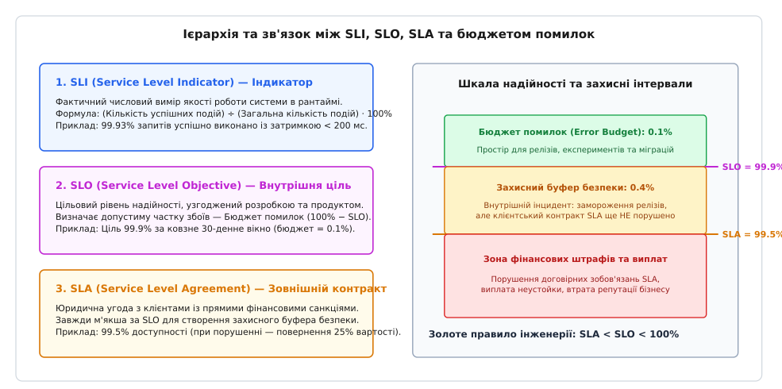
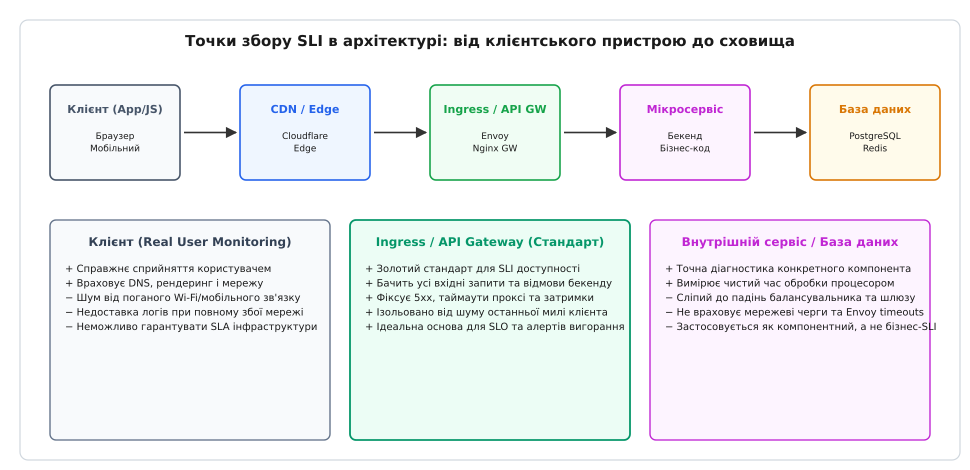
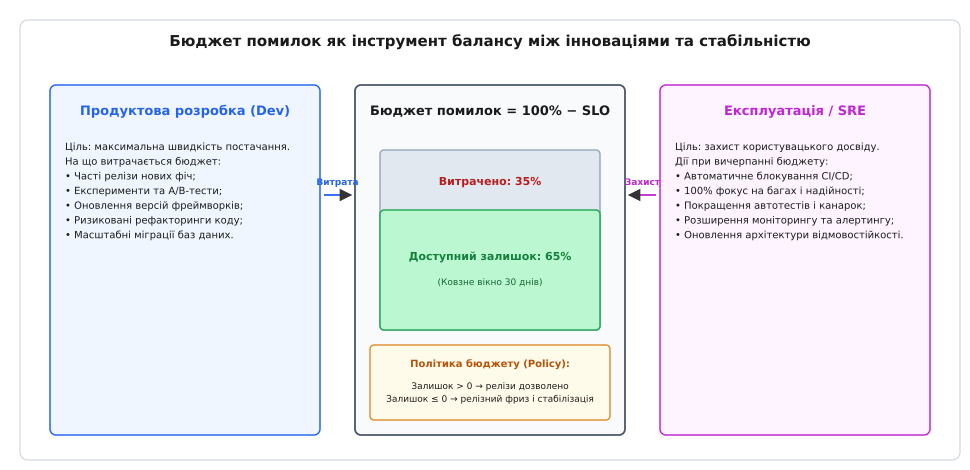
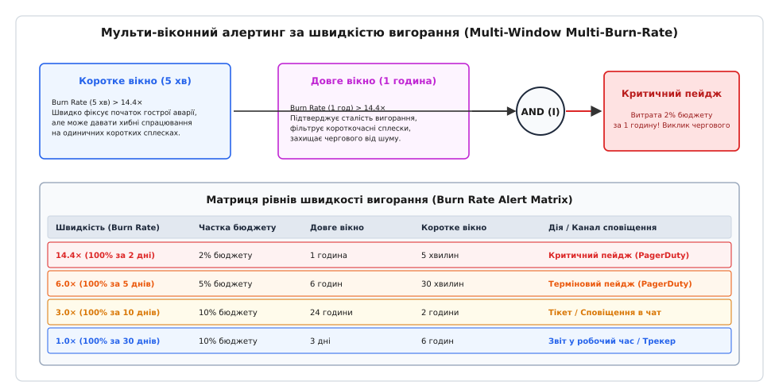

# SLI, SLO, SLA та бюджет помилок

<preknowlist>
- [Метрики](topic:programming/metrics-monitoring) — числовий збір лічильників, гістограм та затримок у рантаймі.
- [Структуровані логи](topic:programming/structured-logging) — машинночитні події для аналізу контексту та кодів відповідей.
- [Розподілений трейсинг](topic:programming/distributed-tracing) — відстеження шляху запиту через ланцюжок мікросервісів.
- [Алерти](topic:programming/alerting) — сповіщення чергових інженерів про аномалії та деградацію системи.
- [CI/CD](topic:programming/ci-cd) — автоматизовані конвеєри тестування, збирання та випуску змін.
- [Стратегії деплою](topic:programming/deployment-strategies) — методи оновлення парку сервісів (канаркове, ковзне) для безпечного постачання коду.
</preknowlist>

Команда розробки платіжного шлюзу інтернет-магазину стикається з типовою кризою: у п'ятницю ввечері через приховану помилку в новій версії мікросервісу авторизації карток транзакції клієнтів починають масово відхилятися. Протягом сорока хвилин магазин втрачає сотні тисяч гривень виторгу, доки черговий інженер не виконує ручний відкат образу контейнера.

Керівництво компанії скликає термінову нараду і вимагає: «Відсьогодні наша система повинна працювати зі 100.000% надійності, без жодного збою, а кожен реліз має проходити триденне ручне тестування та затвердження комітетом змін».

Через три місяці частота релізів падає з п'ятнадцяти на день до одного на місяць, інженери витрачають половину робочого часу на бюрократичні звіти, продуктова конкурентоспроможність зупиняється, але наступний же великий реліз спричиняє ще важчу тригодинну аварію, оскільки гігантський пакунок змін неможливо перевірити вручну.

Вимога стовідсоткової надійності паралізує інженерний процес, не даючи жодних реальних гарантій стабільності.

## Ілюзія стовідсоткової надійності та конфлікт інтересів

Корінь цієї проблеми криється в ігноруванні фундаментальних економічних та фізичних законів функціонування розподілених систем:

1. **Експоненційне зростання вартості надійності:**
   Підвищення доступності сервісу з 99% (до двох днів простою на рік) до 99.9% (до 8.7 годин простою) вимагає дублювання процесів і базового балансування навантаження. Перехід від 99.9% до 99.99% (до 52 хвилин простою) вимагає автоматичного перемикання між зонами доступності та географічно розподілених баз даних. Перехід до 99.999% («п'ять дев'яток», менше 5 хвилин простою на рік) вимагає синхронної мультирегіональної реплікації, власних резервних ліній живлення та дублювання оптичних каналів. Кожна наступна дев'ятка після коми збільшує вартість інфраструктури в 5–10 разів, що швидко перевищує весь сукупний прибуток бізнесу.

2. **Ненадійність клієнтського середовища (Last-Mile Problem):**
   Кінцевий користувач взаємодіє із сервером через публічний інтернет: мобільний зв'язок 4G/5G, домашній Wi-Fi, локальні провайдери та операційну систему власного смартфона. Середня надійність цього фізичного ланцюжка рідко перевищує 98.5–99.5%. Якщо у користувача періодично зникає мобільна мережа в дорозі, він фізично не здатний помітити різницю між сервером із надійністю 99.9% та сервером із надійністю 99.999%. Інвестувати мільйони доларів у стійкість, яку користувач не може відчути, є економічним марнотратством.

3. **Організаційний конфлікт між Dev та Ops:**
   У традиційних компаніях розробники (Dev) мотивовані якнайшвидше випускати нові функції, тоді як команда експлуатації (Ops) мотивована зберігати систему недоторканою, оскільки будь-яка зміна коду чи конфігурації несе ризик падіння. Без об'єктивного спільного арбітра цей конфлікт перетворюється на нескінченні політичні суперечки та взаємні звинувачення.

Для виходу з цього глухого кута інженерія виробила строгу трирівневу систему метрик і домовленостей: **SLI**, **SLO**, **SLA** та концепцію **бюджету помилок (Error Budget)**.

## Тріада надійності: SLI, SLO, SLA

Щоб керувати надійністю на основі даних, а не емоцій, необхідно чітко розмежувати три взаємопов'язані рівні понять:


*Піраміда рівнів обслуговування: SLI як вимір, SLO як внутрішня ціль, SLA як зовнішній контракт.*

Розглянемо походження, призначення та відмінності кожного елемента цієї піраміди:

### 1. SLI (Service Level Indicator, лат. *indicare* — вказувати)
Це фактичний числовий показник роботи системи в реальному часі. SLI дає відповідь на питання: *«Як саме система працює прямо зараз?»*.
* **Приклад:** 99.94% HTTP-запитів до платіжного сервісу за останні 30 днів повернули успішну відповідь (`2xx/3xx`) за час, менший за 250 мс.

### 2. SLO (Service Level Objective, лат. *objectum* — мета, ціль)
Це внутрішній цільовий рівень якості, офіційно узгоджений між командою розробки, експлуатацією та продуктовими менеджерами. SLO дає відповідь на питання: *«Наскільки надійною повинна бути система, щоб користувачі залишалися задоволеними?»*.
* **Приклад:** Цільовий рівень доступності сервісу становить 99.9% за ковзне 30-денне вікно.
* **Зв'язок із бюджетом помилок:** SLO формалізує допустиму частку відмов: `100% − 99.9% = 0.1%`. Цей залишок і є бюджетом помилок, який команда має право витрачати на розвиток продукту.

### 3. SLA (Service Level Agreement, англ. *agreement* — договір, угода)
Це зовнішній офіційний контракт між постачальником сервісу та зовнішніми клієнтами, який має юридичну силу та передбачає прямі фінансові наслідки (повернення коштів, нарахування бонусних кредитів або штрафи) у разі порушення. SLA дає відповідь на питання: *«Що станеться з бізнесом, якщо надійність впаде нижче критичної межі?»*.
* **Приклад:** Якщо місячна доступність API впаде нижче 99.5%, компанія повертає клієнту 25% вартості місячної підписки.

### Золоте правило інженерного захисту: SLA < SLO < 100%

Критичним правилом проектування є сувора нерівність: **цільовий SLO завжди повинен бути жорсткішим за договірний SLA**.

Різниця між SLO (наприклад, 99.9%) та SLA (наприклад, 99.5%) створює **захисний буфер безпеки (Safety Buffer)** у 0.4%. Якщо в системі трапляється важка аварія і внутрішній індикатор SLI падає нижче 99.9%, команда SRE фіксує вичерпання бюджету помилок і застосовує інженерні заходи стабілізації. Проте зовнішній клієнтський договір SLA (99.5%) ще не порушено: інженери мають час локалізувати та ліквідувати проблему без настання фінансових штрафів і судових позовів.

Історичні витоки цієї концепції та перехід від традиційного системного адміністрування до інженерії надійності детально описано у вставці [📜 Історія SRE та народження концепції бюджету помилок](topic:programming/slo-sli-sla/hist-sre-and-error-budget.md).

## Анатомія SLI: що, як і де вимірювати

Не кожен технічний параметр підходить на роль SLI. Поширена помилка початківців — обирати як індикатор утилізацію процесора (CPU) або використання оперативної пам'яті. Якщо процесор завантажений на 98%, але всі запити користувачів обробляються швидко та без помилок, користувач задоволений, і система виконує своє призначення.

Справжній SLI завжди вимірює систему **з точки зору користувацького досвіду (User-Centric Metric)**.

### Зв'язок із чотирма золотими сигналами (The Four Golden Signals)

В інженерії моніторингу Google виділяють чотири ключові сигнали спостережності:
1. **Затримка (Latency):** час, необхідний для обробки запиту (основа для Latency SLI);
2. **Трафік (Traffic):** кількість вхідних запитів або транзакцій (знаменник для Request-based SLI);
3. **Помилки (Errors):** частка запитів, що завершилися невдало (чисельник для Availability SLI);
4. **Насичення (Saturation):** ступінь завантаженості обмежених ресурсів системи (пам'ять, черги, дескриптори файлів).

Сигнали 1–3 прямо трансформуються у клієнтські SLI. Насичення ніколи не використовується як зовнішній SLI, оскільки воно є внутрішньою провідною метрикою (Leading Indicator) для планування місткості (Capacity Planning), а не результатом роботи сервісу для клієнта.

### Універсальна формула подійного SLI

Більшість сучасних сервісів використовують **подійну модель (Request-based SLI)**, яка розраховується за універсальною формулою:

```
SLI = (Кількість хороших подій) / (Загальна кількість валідних подій) · 100%
```

Розглянемо головні класи подійних індикаторів:

1. **SLI доступності (Availability SLI):**
   ```
   SLI_avail = (Кількість валідних HTTP-відповідей із кодом 2xx та 3xx) / (Загальна кількість валідних HTTP-запитів) · 100%
   ```
   * *Що вважати валідною подією:* Запити із синтаксичними помилками клієнта (`400 Bad Request`, `401 Unauthorized`, `404 Not Found` через неіснуючий URL) не свідчать про дефект сервера і повинні виключатися зі знаменника валідних подій. Відмови сервера (`500 Internal Server Error`, `502 Bad Gateway`, `503 Service Unavailable`, `504 Gateway Timeout`) є прямими збоями і враховуються як погані події.

2. **SLI затримки (Latency SLI):**
   ```
   SLI_latency = (Кількість валідних запитів із часом обробки ≤ 200 мс) / (Загальна кількість валідних запитів) · 100%
   ```
   * *Чому не середнє арифметичне:* Середнє значення маскує критичні аномалії. Якщо 999 запитів виконалися за 10 мс, а один завис на 10 000 мс, середній час складе ~20 мс, що створює ілюзію стабільності, хоча один користувач зазнав неприпустимої затримки. SLI затримок завжди будується як частка запитів, що вклалися у фіксований часовий поріг.

### Часові SLI для черг та фонових процесів (Window-based & Freshness SLI)

Для систем асинхронної обробки (потокова обробка Kafka, споживання повідомлень з черг RabbitMQ, нічні білінгові CRON-задачі) запитовий підхід не завжди застосовний. Для таких систем використовують часові індикатори:

1. **SLI свіжості даних (Freshness SLI):**
   ```
   SLI_fresh = (Кількість хвилин, коли затримка читання з черги lag < 30 секунд) / (Загальна кількість хвилин у періоді) · 100%
   ```
2. **SLI своєчасності завершення (Timeliness SLI):**
   ```
   SLI_time = (Кількість білінгових пакетів, завершених до 06:00 UTC) / (Загальна кількість запланованих запусків) · 100%
   ```

### Топологія точок вимірювання SLI

Місце збору телеметрії кардинально впливає на точність та інформативність показника:


*Топологія точок вимірювання SLI: від клієнтського браузера через шлюз до внутрішніх сервісів.*

Порівняємо основні архітектурні точки збору:

1. **Клієнтська сторона (Real User Monitoring / Mobile SDK):**
   * *Плюси:* Фіксує реальний користувацький досвід, включно з DNS-резолвінгом, TLS-рукостисканням та рендерингом інтерфейсу.
   * *Мінуси:* Високий шум через нестабільність мобільного зв'язку клієнтів. Якщо в користувача зник інтернет, мобільний додаток навіть не зможе відправити лог про збій.
2. **Точка входу інфраструктури (Load Balancer / API Gateway) — ЗОЛОТИЙ СТАНДАРТ:**
   * *Плюси:* Бачить усі вхідні з'єднання, фіксує падіння бекендів, таймаути проксі та відмови маршрутизації. Ізольований від шуму поганого Wi-Fi клієнтів.
   * *Висновок:* Найкраща точка для формування офіційних бізнес-SLO та контрактів SLA.
3. **Внутрішній мікросервіс або база даних:**
   * *Плюси:* Точна діагностика конкретної бізнес-функції або повільних SQL-запитів.
   * *Мінуси:* Сліпий до мережевих аварій на рівні балансувальника та падінь шлюзу. Застосовується як компонентний SLI для інженерів, але не як контракт із користувачем.

## Формулювання реалістичних SLO

Визначення цільового SLO не повинно бути випадковою цифрою, взятою зі стелі. Завищений SLO виснажує команду та блокує релізи; занижений SLO призводить до відтоку розчарованих користувачів.

### Методологія вибору цілі

1. **Опиратися на поріг болю користувача (User Happiness):**
   SLO повинен знаходитися на тій межі, де користувач починає відчувати роздратування і звертатися в службу підтримки. Якщо користувачі пошуку готові чекати до 300 мс, встановлення цілі 50 мс не принесе додаткової бізнес-цінності, але вимагатиме переписування всієї архітектури.
2. **Орієнтуватися на історичні дані з поправкою на запас:**
   Якщо за останні пів року сервіс стабільно демонстрував доступність 99.95%, встановлення SLO на рівні 99.9% дасть здоровий запас міцності (0.05% бюджету) для сміливих експериментів.
3. **Використовувати ковзні вікна замість календарних:**
   Календарні місяці створюють шкідливу поведінку: 1-го числа кожного місяця бюджет обнуляється, розробники випускають масу сирого коду, швидко спалюють бюджет і наступні три тижні сидять у режимі блокування релізів. **Ковзне вікно в 28 або 30 днів (Rolling Window)** усуває стрибки, плавно враховуючи надійність за останні 720 годин у кожну секунду часу.

### Особливості низьконавантажених сервісів (Low-Volume Edge Case)

Якщо сервіс отримує лише кілька сотень запитів на добу (наприклад, внутрішній портал адміністрування або B2B API рідкісних білінгових операцій), подійний SLI стає вкрай чутливим до одиничних збоїв:
* 1 збійний запит зранку зі 100 одразу дає SLI `99.0%`, спалюючи весь місячний бюджет три дев'ятки (`99.9%`);
* Для вирішення цієї проблеми застосовують комбінований підхід: збільшують ковзне вікно до 90 днів, або додають синтетичні періодичні перевірки (Synthetic Probing через Blackbox Exporter кожні 30 секунд), створюючи стабільний фон валідних подій.

### Таблиця дев'яток: ціна простою

| Рівень SLO | Допустимий збійний трафік | Допустимий простій за 30 днів | Допустимий простій за 365 днів | Характерні архітектурні вимоги |
|---|---|---|---|---|
| **99.0%** («дві дев'ятки») | 1 на 100 запитів | 7 годин 12 хвилин | 3 доби 15 годин | Один сервер, ручний перезапуск |
| **99.9%** («три дев'ятки») | 1 на 1 000 запитів | 43 хвилини 12 секунд | 8 годин 45 хвилин | Кластер із кількох подів, балансувальник |
| **99.95%** | 1 на 2 000 запитів | 21 хвилина 36 секунд | 4 години 22 хвилини | Автоскейл, Health Checks, швидкий drain |
| **99.99%** («чотири дев'ятки») | 1 на 10 000 запитів | 4 хвилини 19 секунд | 52 хвилини 33 секунди | Мультизональний кластер, автоматичний failover |
| **99.999%** («п'ять дев'яток») | 1 на 100 000 запитів | 25.9 секунди | 5 хвилин 15 секунд | Мультирегіональний Active-Active, надлишковість |

## Композиція SLO у розподілених графах викликів

Сучасні додатки рідко складаються з одного монолітного процесу. Зазвичай обробка клієнтського запиту проходить через спрямований ациклічний граф (DAG) мікросервісів: від API Gateway до сервісу авторизації, білінгу, каталогу та бази даних.

При проєктуванні системи важливо розуміти, як цільові показники окремих компонентів складаються у підсумковий наскрізний SLO:

### 1. Послідовна композиція (Серійний ланцюг)
Якщо для завершення транзакції сервіс `A` повинен послідовно викликати залежні сервіси `B` та `C`, збій у будь-якій ланці руйнує весь ланцюг. Підсумкова доступність дорівнює добутку доступностей кожного компонента:

```
SLO_total = SLO_A · SLO_B · SLO_C
```

* **Приклад:** Якщо сервіс `A` має SLO 99.9%, сервіс `B` — 99.9%, а база даних `C` — 99.9%, то підсумковий наскрізний SLO користувача складе: `0.999 · 0.999 · 0.999 ≈ 0.997` (99.7%). Ланцюжок із трьох сервісів із доступністю 99.9% не здатний надати клієнту доступність у 99.9%.

### 2. Паралельна надлишкова композиція (Резервування та Fallback)
Якщо система викликає основний платіжний шлюз `P_1`, а в разі таймауту автоматично перемикається на резервний шлюз `P_2` (патерн Circuit Breaker з Fallback), підсумкова ймовірність відмови дорівнює добутку ймовірностей відмов обох компонентів:

```
Unavailability_total = (1 − SLO_P1) · (1 − SLO_P2)
SLO_total = 1 − (1 − SLO_P1) · (1 − SLO_P2)
```

* **Приклад:** Якщо обидва шлюзи мають скромну надійність 99.0% (відмова 1%), паралельне резервування забезпечує наскрізну надійність: `1 − (0.01 · 0.01) = 1 − 0.0001 = 0.9999` (99.99%).

## Бюджет помилок (Error Budget) як інженерна валюта

Бюджет помилок перевертає парадигму мислення розробників. Допустима ненадійність перестає бути показником дефекту — вона стає **законною валютою для купівлі швидкості інновацій**.

```
Error Budget = 100% − SLO
```


*Бюджет помилок як спільна валюта узгодження швидкості постачання та надійності.*

### На що витрачається бюджет помилок

Бюджет витрачається на будь-які інженерні активності, що несуть контрольований ризик:
* Розгортання нових версій бізнес-логіки;
* Проведення A/B-тестування та продуктових експериментів;
* Оновлення версій мов програмування, фреймворків і бібліотек;
* Масштабні міграції баз даних та зміна схем таблиць;
* Навчання та експерименти з хаос-інженерією (Chaos Engineering) у продакшені;
* Непередбачені апаратні аварії та короткочасні мережеві збої дата-центрів.

### Політика бюджету помилок (Error Budget Policy)

Щоб бюджет помилок працював, компанія повинна укласти письмовий договір між керівництвом розробки та продуктовим відділом — **політику бюджету помилок**:

* **Сценарій 1: Залишок бюджету > 0 (Зелена зона):**
  Команда розробки має повну автономію. Релізи постачаються автоматично через конвеєр CI/CD, проводяться експерименти, заохочується сміливий рефакторинг. SRE не мають права блокувати деплої.
* **Сценарій 2: Залишок бюджету зменшується занадто швидко (Жовта зона):**
  Активуються додаткові запобіжні заходи: обов'язкове канаркове розгортання з дрібними кроками (1% → 5% → 25% → 100%), збільшення часу спостереження за канаркою, посилення вимог до покриття інтеграційними тестами.
* **Сценарій 3: Бюджет вичерпано повністю (Червона зона, 100% витрати):**
  Вмикається автоматичний **релізний фриз (Release Freeze)**. Продуктові релізи повністю блокуються в CI/CD. Увесь інженерний штат на 100% переключається на задачі стабільності: виправлення багів, рефакторинг збійних модулів, оптимізацію повільних SQL-запитів, розширення спостережності та відновлення надійності, доки ковзне вікно не відновить запас бюджету.

### Управління бюджетом під час пікових навантажень (Black Friday & Flash Sales)

Під час критичних комерційних подій (наприклад, щорічний розпродаж Black Friday або національні рекламні кампанії) компанії застосовують спеціальний режим:
* За 14 днів до події вводиться добровільний продуктовий мораторій, щоб сервіс увійшов у пік навантаження з **100% запасом бюджету помилок**;
* Будь-які екстрені зміни (Hotfixes) у цей період вимагають письмового затвердження CTO (Exceptions Policy) та розгортаються виключно за наявності плану миттєвого відкату.

## Алертинг за швидкістю вигорання (Burn Rate Alerting)

Традиційний підхід до налаштування алертів спирався на статичні порогові правила: наприклад, «якщо частка помилок за 5 хвилин > 1%, надіслати сповіщення».

Такий підхід має два критичні недоліки:
1. **Хибні нічні тривоги (Alert Fatigue):** Короткочасний сплеск помилок під час перезапуску одного пода підніме частку помилок вище 1% на дві хвилини. Черговий прокинеться серед ночі, хоча загальна втрата місячного бюджету склала мізерні `0.005%`.
2. **Пропущені хронічні витоки:** Якщо після деплою частота помилок стабільно тримається на рівні 0.5%, 5-хвилинний алерт промовчить. Проте за кілька днів такий непомітний витік спалить увесь місячний бюджет до нуля.

### Концепція коефіцієнта швидкості вигорання (Burn Rate)

**Швидкість вигорання (Burn Rate, `b`)** показує, у скільки разів швидше витрачається бюджет порівняно з нормальним плановим темпом:

```
Burn Rate = (Фактична частка помилок) / (Допустима частка помилок 1 - SLO)
```

* `Burn Rate = 1.0:` Бюджет вигорає строго за планом і закінчиться рівно за 30 днів;
* `Burn Rate = 14.4:` Бюджет вигорає настільки швидко, що 100% місячного ліміту зникне за `720 / 14.4 = 50 годин` (~2 доби). За 1 годину згорає рівно 2% бюджету. Це вимагає негайного виклику чергового інженера;
* `Burn Rate = 6.0:` 100% бюджету згорає за 5 діб (5% за 6 годин). Вимагає термінового реагування;
* `Burn Rate = 1.0:` 10% бюджету згорає за 3 дні. Не потребує нічних дзвінків — задача реєструється в трекері для розгляду в робочий час.

### Мульти-віконний алертинг (Multi-Window Multi-Burn-Rate)

Для ліквідації хибних спрацювань Google SRE розробили стандарт **мульти-віконного сповіщення**: алерт активується лише тоді, коли поріг швидкості вигорання перевищено **одночасно у двох часових вікнах: короткому та довгому**.


*Мульти-віконна схема оцінки швидкості вигорання для захисту чергових інженерів від хибних тривог.*

Співвідношення вікон розраховується як `w_short = w_long / 12`:
* Для довгого вікна в `1 годину` коротке вікно становить `5 хвилин`;
* Для довгого вікна в `6 годин` коротке вікно становить `30 хвилин`.

Ця схема має три фундаментальні переваги:
1. **Швидка реакція:** При масштабній аварії алерт спрацьовує за 5 хвилин;
2. **Фільтрація шуму:** Одиничний 2-хвилинний сплеск не підніме 1-годинне вікно, тому тривога не увімкнеться;
3. **Миттєве автоскидання (Auto-Reset):** Щойно аварію усунуто, за 5 хвилин коротке вікно очищується, і алерт автоматично вимикається без очікування добігання годинного вікна.

Математичне виведення формул імовірності виявлення, детальні розрахунки вікон та доведення адитивності метрик наведено у вставці [🧮 Математика швидкості вигорання та мульти-віконних алертів](topic:programming/slo-sli-sla/math-burn-rate-and-windows.md).

## Специфікація SLO-as-Code та стандарт OpenSLO

Зберігання домовленостей про рівні обслуговування у внутрішніх вікі-документах або таблицях часто призводить до їх застарівання. Інженерний підхід вимагає декларативного опису цілей надійності поруч із вихідним кодом у репозиторії — концепція **SLO-as-Code**.

Індустріальним відкритим стандартом для такого опису є специфікація **OpenSLO**:

```yaml
apiVersion: openslo/v1
kind: SLO
metadata:
  name: checkout-payment-availability
  displayName: Доступність API оплати замовлень
spec:
  service: checkout-service
  description: 99.9% валідних запитів на списання коштів повинні повертати успішний статус
  budgetingMethod: Occurrences
  timeWindow:
    - duration: 30d
      isRolling: true
  indicator:
    metadata:
      name: payment-success-ratio
    spec:
      ratioMetric:
        good:
          metricSource:
            type: Prometheus
            spec:
              query: sum(rate(http_requests_total{service="checkout", status=~"2..|3.."}[5m]))
        total:
          metricSource:
            type: Prometheus
            spec:
              query: sum(rate(http_requests_total{service="checkout"}[5m]))
  objectives:
    - target: 0.999
      displayName: Ціль надійності 99.9%
  alertPolicies:
    - metadata:
        name: page-critical-burn-rate
      spec:
        conditions:
          - kind: BurnRate
            op: gte
            value: 14.4
            duration: 1h
```

Спеціалізовані GitOps-оператори (наприклад, `pyrra` або `sloth`) автоматично компілюють такі декларативні файли у готові правила моніторингу `PrometheusRule` та генерують уніфіковані дашборди в Grafana, усуваючи необхідність ручного написання складних багатовіконних PromQL-запитів.

## Інтеграція в конвеєри CI/CD та інженерну практику

Найвищий рівень зрілості SRE досягається тоді, коли бюджет помилок керує розгортанням коду автоматично, без участі людини.

### Автоматичні шлюзи допуску (Admission Gates)

Перед початком розгортання нової версії конвеєр CI/CD надсилає запит до рушія надійності:
1. Якщо залишок бюджету за 30 днів додатний і поточний `Burn Rate < 1.0`, конвеєр запускає канаркове розгортання;
2. Якщо під час розкатки канарки (наприклад, на 5% трафіку) локальний короткостроковий `Burn Rate` перевищує `14.4×`, оркестратор негайно зупиняє розгортання і повертає 100% трафіку на стару стабільну версію;
3. Якщо місячний бюджет вичерпано, конвеєр автоматично відхиляє будь-які збірки у гілку `main`, доки показники не відновляться.

Практичну реалізацію такого автономного рушія з повною підтримкою кільцевих буферів, логарифмічних гістограм затримок та мовними вкладками C++ і C наведено у вставці [⚙️ Програмний рушій обчислення SLI та контролю бюджету помилок](topic:programming/slo-sli-sla/proj-slo-burn-engine.md).

### Покроковий чекліст впровадження SLI/SLO для нової команди

Для успішного запуску культури надійності в проєкті рекомендується наступна послідовність кроків:
1. **Ідентифікація критичних користувацьких шляхів (Critical User Journeys, CUJ):**
   Виділіть 3–5 головних сценаріїв, заради яких користувачі відкривають сервіс (наприклад, «Пошук товару», «Додавання в кошик», «Оплата замовлення»).
2. **Визначення специфікацій SLI для кожного CUJ:**
   Для кожного шляху сформулюйте чіткі критерії: що є валідною подією, який статус відповіді вважається хорошим і який часовий поріг затримки є прийнятним.
3. **Вимірювання базової лінії (Baseline) без штрафів:**
   Збирайте телеметрію протягом 30–60 днів у пасивному режимі. Це дозволить дізнатися реальні можливості поточної архітектури.
4. **Узгодження початкового SLO з продуктовим менеджером:**
   Встановіть цільовий показник трохи нижчим за історичну базову лінію, щоб створити стартовий запас бюджету помилок.
5. **Налаштування сповіщень за швидкістю вигорання:**
   Замініть статичні порогові алерти на мульти-віконні правила Google MWMBR.
6. **Офіційне затвердження Error Budget Policy:**
   Зафіксуйте письмову згоду про те, що при вичерпанні бюджету команда зупиняє фічі та займається надійністю.

### Організаційний процес перегляду цілей (SLO Review)

SLO — це не застигла догма, а живий інструмент калібрування продукту. Раз на квартал команда розробки, SRE-інженери та продуктовий менеджер проводять спільний перегляд метрик:

* **Випадок 1: Бюджет ніколи не витрачається (Витрата < 10% за квартал):**
  Це ознака того, що команда рухається занадто повільно і надмірно обережна. Рекомендація: або підвищити швидкість релізів та впровадження сміливих експериментів, або свідомо знизити витрати на надлишкову інфраструктуру.
* **Випадок 2: Бюджет постійно вигорає, але клієнти задоволені (False Critical SLO):**
  Цільовий SLO встановлено занадто жорстко (наприклад, 99.99% для внутрішнього звіту, яким користуються раз на тиждень). Рекомендація: офіційно послабити SLO до 99.5%, усунувши безглузді релізні блокування.
* **Випадок 3: Бюджет у нормі, але служба підтримки завалена скаргами (Blind Spot):**
  Обраний SLI не відображає реального болю користувача (наприклад, вимірюється доступність головної сторінки, тоді як ламається форма відновлення пароля). Рекомендація: додати новий SLI для критичного користувацького сценарію.

### Культура постмортемів без винних (Blameless Culture)

Бюджет помилок не може ефективно функціонувати в атмосфері покарань і страху. Якщо інженери бояться зізнатися в помилці або приховують дрібні інциденти, система телеметрії спотворюється.

Культура SRE базується на аксіомі: **помилка людини — це не першопричина, а наслідок недосконалості архітектури чи автоматизації**. Постмортем після інциденту фокусується не на тому, *хто* ввів неправильну команду, а на тому, *чому* система дозволила цій команді покласти продакшен і *які* автоматичні бар'єри (канарочні перевірки, ліміти ресурсів, валідаційні вебхуки) необхідно впровадити, щоб унеможливити повторення подібного збою в майбутньому.

> 🔧 **Навіщо це.**
> SLI, SLO та бюджет помилок перетворюють абстрактні суперечки про якість коду на чіткі інженерні правила з числовими межами. Вони захищають розробників від бюрократичних заборон на релізи, коли система здорова, і захищають бізнес від катастрофічних збитків, коли система вичерпує запас стійкості.
