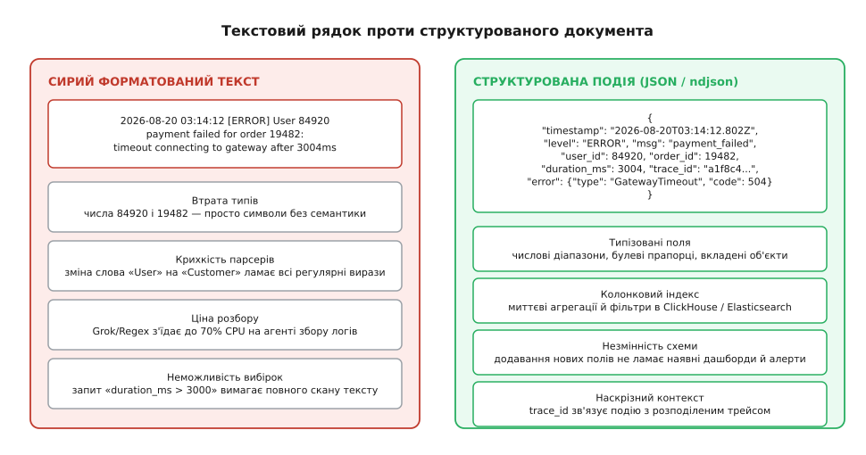
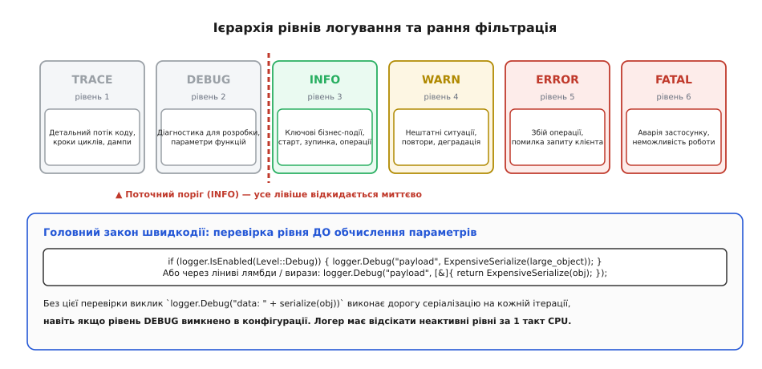
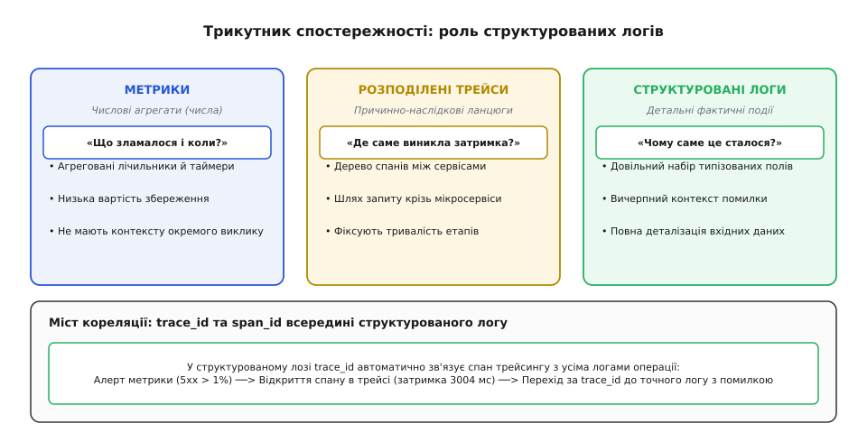
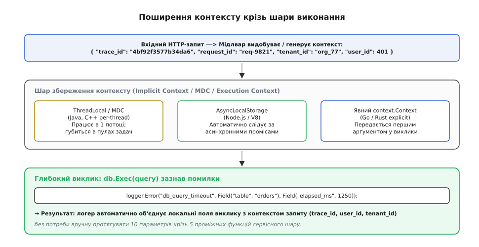
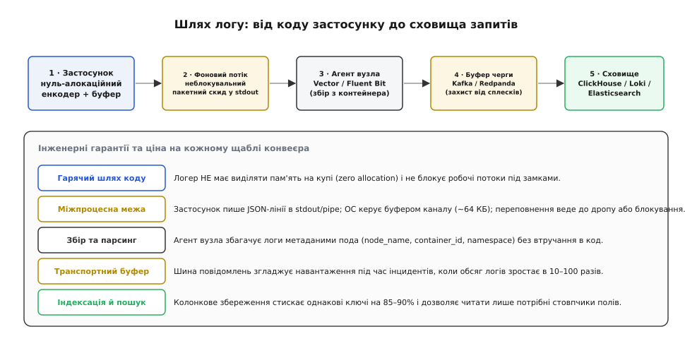
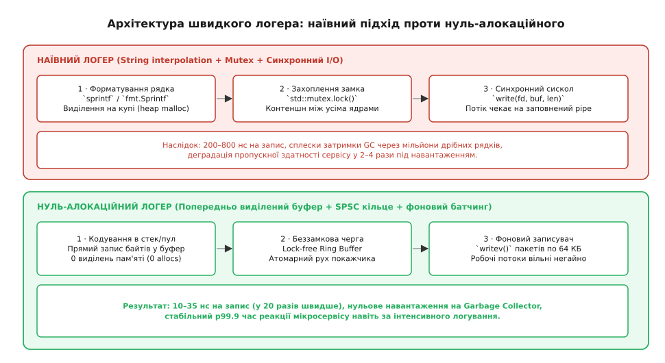

<preknowlist>
* [Розподілене трасування](topic:programming/distributed-tracing)
* [Моніторинг та метрики](topic:programming/metrics-monitoring)
* [Кільцевий буфер](topic:algorithms/ring-buffer)
* [Реагування на інциденти](topic:programming/incident-response)
* [Формат даних JSON](topic:programming/json-format)
</preknowlist>

# 🪵 Структуроване логування у розподілених системах

О третій годині ночі 14 листопада платіжний шлюз інтернет-магазину почав масово відхиляти транзакції користувачів із помилкою внутрішнього збою. Черговий інженер відкрив термінал і ввів звичну команду:

```bash
grep "ERROR" /var/log/payment-service.log | grep "failed" | awk '{print $4}' | sort | uniq -c
```

Результат виявився порожнім. Причиною став збій у сторонньому сервісі автентифікації, який повернув повідомлення про помилку з неек Spike-перенесенням рядка та лапками всередині тексту: `Error: failed to authorize user "John\nDoe" on gateway 12`. 

Рядок не вклався у регулярний вираз парсера Logstash. Агент збору логів завис у нескінченних спробах розібрати пошкоджений фрагмент тексту через механізм Grok, черга буферизації переповнилася, а завантаження процесора на колекторі підскочило до 100%. Поки інженери вручну складали новий регулярний вираз для фільтрації нестандартного формату, сервіс втратив тисячі замовлень.

Ця ситуація демонструє фундаментальну проблему традиційного текстового логування: коли програма формує журнал за допомогою вільної конкатенації рядків, вона перетворює точні цифрові дані на неструктуровану людську прозу. Будь-яка спроба машинного аналізу такого тексту вимагає зворотного вгадування структури за допомогою крихких регулярних виразів.


*Порівняння неструктурованого тексту з регулярними виразами та машиночитних структурованих пар ключ-значення.*

Структуроване логування розв'язує цю кризу, перетворюючи кожне діагностичне повідомлення на самодостатній типізований об'єкт (словник пар ключ-значення), оптимізований для автоматичного збору, індексації та миттєвої фільтрації у масштабі мільйонів подій на секунду.

Докладніше про те, як індустрія перейшла від перших викликів `printf` у PDP-11 до сучасних стандартів телеметрії, описано у вставці [Історія еволюції логування](topic:programming/structured-logging/hist-unstructured-to-structured.md).

---

## Анатомія збою: криза неструктурованого тексту

Щоб зрозуміти, чому традиційне текстове логування руйнує конвеєри збору даних, необхідно простежити шлях неструктурованого повідомлення крізь підсистеми парсингу.

Коли розробник пише код форматування рядка:

```cpp
logger.error("User " + user_id + " failed to checkout cart " + cart_id + " after " + std::to_string(latency) + "ms: " + err_msg);
```

у пам'яті формується довільний ланцюжок символів. Щоб зберегти ці дані в аналітичній базі даних для побудови графіків та сповіщень, централізований агент збору логів (Logstash, Fluentd або Promtail) змушений пропускати кожен рядок крізь нетермінований скінченний автомат (NFA) регулярного виразу Grok:

```text
^User %{DATA:user_id} failed to checkout cart %{DATA:cart_id} after %{NUMBER:latency:int}ms: %{GREEDYDATA:err_msg}$
```

У цій точці виникають чотири системні дефекти архітектури:

### 1. Катастрофічний бектрекінг (Catastrophic Regex Backtracking)
Якщо текст повідомлення зазнає незначних змін (наприклад, через виняток у сторонній бібліотеці повідомлення містить додаткові лапки або неочікуване перенесення рядка), рушій регулярних виразів не може зіставити шаблон з першої спроби. Автомат починає перебирати всі можливі комбінації символів, здійснюючи відкат назад (*backtracking*). Обчислювальна складність розбору одного рядка зростає експоненційно, поглинаючи 100% ресурсів процесора на вузлі збору логів.

### 2. Втрата числових типів та неможливість агрегації
У текстовому рядку число `142` є послідовністю трьох ASCII-символів (`0x31`, `0x34`, `0x32`). База даних логів без попереднього виснажливого парсингу не знає, що це тривалість операції. Інженер не може виконати простий SQL-запит `SELECT avg(latency) WHERE service = 'checkout'`, оскільки для бази даних весь запис є єдиним суцільним текстовим полем.

### 3. Крихкість контрактів між командами
Якщо команда розробки змінює текст повідомлення з `"User X failed..."` на `"Customer X failed..."`, ні компілятор, ні тести розробника не виявляють помилки. Проте всі наявні інформаційні панелі в Grafana та автоматичні сповіщення про збої в Datadog тихо перестають отримувати дані, оскільки старий регулярний вираз більше не відповідає новому тексту.

---

## Фундаментальні принципи структурованого логу

Головна відмінність структурованого підходу полягає в тому, що подія логу розглядається не як рядок тексту, а як незмінний типізований документ.

У структурованому підході виклик логера чітко відокремлює **статичний семантичний шаблон події** від її **динамічних параметрів**:

```cpp
logger.Error("checkout_failed",
    "user_id", 84920,
    "cart_id", 19482,
    "duration_ms", 142,
    "error_code", "GATEWAY_TIMEOUT"
);
```

На виході формується валідний машинний документ у форматі JSON Lines (ndjson):

```json
{"timestamp":"2026-08-20T03:14:02.802Z","level":"ERROR","msg":"checkout_failed","user_id":84920,"cart_id":19482,"duration_ms":142,"error_code":"GATEWAY_TIMEOUT"}
```

### Ключові інженерні переваги структурованого запису

1. **Константна кардинальність ключа повідомлення (`msg`):**
   Поле `msg` (або `body`) містить фіксовану назву операції (`"checkout_failed"`). Сховище логів може миттєво згрупувати мільйон подій за цим полем без застосування регулярних виразів:
   ```sql
   SELECT count(), avg(duration_ms) 
   FROM logs 
   WHERE msg = 'checkout_failed' AND timestamp > now() - INTERVAL 1 HOUR
   GROUP BY error_code;
   ```
2. **Збереження нативних типів даних:**
   Числа залишаються цілими числами або числами з рухомою комою, булеві прапорці — логічними значеннями. Це дозволяє виконувати математичну фільтрацію та обчислення процентилів p95 і p99 безпосередньо в базі даних.
3. **Гнучка розширюваність без порушення сумісності:**
   Додавання нових атрибутів (наприклад, `payment_method: "apple_pay"`) не ламає існуючі аналітичні запити та конвеєри доставки.

Повні специфікації стандартних конвертів та формальні схеми валідації наведено у вставці [Канонічна схема структурованого логу та специфікація форматів](topic:programming/structured-logging/api-structured-log-schema.md).

---

## Формати структурованих логів: JSON Lines проти Logfmt проти Protobuf

У промисловій практиці застосовують три основні формати представлення структурованих подій, кожен з яких оптимізований під конкретне середовище:

```
Характеристика            JSON Lines (ndjson)             Logfmt                          Protobuf (OTLP)
----------------------------------------------------------------------------------------------------------------------
Синтаксис                 {"k":"v","n":1}                 k=v n=1                         Двійкові теги + довжини
Людиночитність            Висока (в утилітах типу jq)     Дуже висока в терміналі         Низька (потрібен декодер)
Підтримка вкладеності     Повна (масиви, об'єкти)         Обмежена (лише пласкі пари)     Повна ієрархічна
Розмір на дроті (байти)   ~500 байтів / запис             ~350 байтів / запис             ~90 байтів / запис
Швидкість парсингу        Середня (парсинг лапок, чисел)  Висока (пошук пробілів)         Екстремальна (O(1) пряме читання)
Основне застосування      Хмарні контейнери, бази даних   CLI-інструменти, мікросервіси   Міжсерверний транспорт OTel
```

- **JSON Lines (ndjson)** став загальновизнаним стандартом для виводу у стандартний потік контейнерів (`stdout`), оскільки будь-яка мова програмування та будь-який агент збору мають нативні оптимізовані JSON-парсери.
- **Logfmt** вирізняється максимальною зручністю для читання очима в терміналі розробника, оскільки позбавлений надлишкового синтаксичного шуму (дужок, лапок навколо простих ключів).
- **Protobuf OTLP** застосовується винятково для високонавантаженої передачі телеметрії між колекторами, оскільки двійкове кодування економить до 75% мережевого трафіку.

---

## Ієрархія та семантика рівнів логування

Рівень логування (*Log Level*) визначає критичність події та слугує першим фільтром для відсікання зайвого шуму в промисловому середовищі. Неправильне використання рівнів призводить або до переповнення дисків гігабайтами непотрібних налагоджувальних даних, або до пропуску критичних аварій.


*Семантична ієрархія рівнів логування та поріг фільтрації подій у виробничому середовищі.*

### Семантичні правила вибору рівня

1. **TRACE (Наддетальний потік):**
   Трасування кроків виконання всередині складних алгоритмів, побайтові дампи мережевих пакетів, стан внутрішніх регістрів. Вмикається локально або на окремому інстансі на лічені хвилини під час розслідування складних багів.
2. **DEBUG (Налагодження):**
   Діагностичні повідомлення для розробників: вхідні параметри функцій, проміжні результати обчислень, стан кешу. Активний на тестових стендах (staging); у production зазвичай вимкнений.
3. **INFO (Інформаційний):**
   Ключові бізнес-події та зміни стану системи: запуск або зупинка сервісу, успішно оброблені HTTP-запити, завершення міграції бази даних. Частота повідомлень повинна бути пропорційною бізнес-транзакціям.
4. **WARN (Попередження):**
   Нештатні ситуації, які сервіс зміг обробити самостійно без порушення роботи користувача: автоматичний повтор невдалого HTTP-запиту (*retry*), деградація другорядного кешу, вичерпання 80% пулу з'єднань, використання застарілого API.
5. **ERROR (Помилка):**
   Збій конкретної операції або запиту користувача, який не вдалося усунути автоматично: помилка валідації платежу, таймаут запиту до основної бази даних, відсутність обов'язкового файлу конфігурації. Вимагає розслідування черговим інженером.
6. **FATAL / CRITICAL (Аварія):**
   Непоправна катастрофа, яка унеможливлює подальше функціонування всього процесу: пошкодження файлової системи, неможливість підключення до бази даних під час старту, вичерпання дескрипторів файлів. За викликом `Fatal` зазвичай слідує аварійне завершення процесу `exit(1)`.

---

## Логи в екосистемі спостережності (Observability Triangle)

Сучасна діагностика розподілених систем спирається на три взаємопов'язані стовпи телеметрії: **метрики**, **розподілені трейси** та **структуровані логи**.


*Три стовпи спостережності (Observability): метрики, трейси та структуровані логи навколо спільного контексту.*

Кожен інструмент виконує свою роль у процесі розслідування інцидентів:
- **Метрики** сигналізують, *що* саме зламалося (наприклад, графік показує стрибок 5xx помилок на сервісі замовлень з 0.1% до 15%).
- **Трейси** локалізують, *де* саме виник збій у ланцюжку мікросервісів (спан показує, що запит завис на виклику `PaymentGateway.Authorize`).
- **Структуровані логи** пояснюють, *чому* стався збій, надаючи повний контекст помилки (стектрейс, параметри запиту, код відповіді платіжної системи).

### Наскрізне прокидання контексту (Context Propagation)

Щоб логи можна було безшовно зіставити з трейсами, кожен логер повинен автоматично додавати до подій ідентифікатори розподіленого контексту: `trace_id` та `span_id`.


*Наскрізне прокидання trace_id та span_id крізь мережеві виклики між сервісами та брокерами.*

Коли клієнт робить запит до API Gateway, шлюз генерує унікальний 16-байтний `trace_id` (наприклад, `4bf92f3577b34da6a3ce929d0e0e4736`) та передає його у заголовку стандарту W3C Trace Context:

```http
traceparent: 00-4bf92f3577b34da6a3ce929d0e0e4736-00f067aa0ba902b7-01
```

Кожен наступний мікросервіс у ланцюжку (API Gateway -> Orders Service -> Payment Service) вичитує цей заголовок і прив'язує його до локального сховища контексту потоку.

### Механіка контексту потоку: MDC та Context Baggage
У багатопотокових серверах (наприклад, Java / Go / C++) контекст запиту закріплюється за потоком обробки. У Java для цього використовують Mapped Diagnostic Context (MDC):

```java
try (MDC.MDCCloseable c = MDC.putCloseable("trace_id", traceId)) {
    MDC.put("user_id", String.valueOf(userId));
    orderService.process(order);
} // Автоматичне очищення контексту при виході з блоку
```

**Крайовий випадок з пулами потоків:** Якщо потік із пулу (`ThreadPoolExecutor`) не очистить свій MDC після завершення обробки клієнта, наступний клієнт, що отримає цей потік, успадкує чужий `user_id`, що спричинить фатальне спотворення телеметрії та витік конфіденційних даних у логи. Використання конструкцій типу `try-with-resources` або RAII-вартових є обов'язковим інженерним правилом.

---

## Архітектура конвеєра збору та доставки логів

У хмарних та мікросервісних середовищах застосунки ніколи не повинні самостійно займатися відправкою логів через мережу до віддаленої бази даних або записом у специфічні дискові каталоги.


*Конвеєр доставки логів: від генерації у процесі до маршрутизації агентом у централізоване сховище.*

### Концепція Twelve-Factor App: логи як потік подій

Згідно з принципами розробки хмарних застосунків (*Twelve-Factor App, розділ XI*), програма розглядає свій журнал як неперервний потік подій, що записується у стандартний вивід:

```text
Application Process  ───>  stdout / stderr (ndjson)
                                │
                                ▼
                      Container Runtime / k8s
                                │
                                ▼
                       Local Node Agent
                     (Vector / Fluent Bit)
                                │
                                ▼
                       Analytical Storage
                    (ClickHouse / OpenSearch)
```

Така архітектура надає три фундаментальні переваги:

1. **Повна ізоляція відмов (Fault Tolerance):** Якщо мережа до центрального сховища логів зникає або база даних перезавантажується, застосунок продовжує працювати без затримок. Буферизацією, повторними спробами відправки та скиданням на диск займається спеціалізований локальний агент (Vector або Fluent Bit).
2. **Зниження накладних витрат процесу:** Застосунок не витрачає пам'ять та потоки процесора на підтримку важких TLS-з'єднань, стиснення GZIP чи складну логіку бектрекінгу.
3. **Гнучкість маршрутизації:** Інфраструктурні інженери можуть змінювати цільове сховище логів (наприклад, мігрувати з Elasticsearch на ClickHouse або додавати резервне збереження в AWS S3), не змінюючи жодного рядка коду та конфігурації самих застосунків.

---

## Механізм зворотного тиску та переповнення буферів (Backpressure)

Коли диск сервера перевантажений або мережевий канал до сховища телеметрії насичений, конвеєр збору логів зазнає явища зворотного тиску (*Backpressure*).

### Ланцюжок буферизації ядра та відмова
Коли процес пише в `stdout`, байти потрапляють у системний буфер каналу ядра Linux (pipe buffer), розмір якого за замовчуванням становить 64 КБ (16 сторінок пам'яті по 4 КБ). Якщо агент збору логів не встигає вичитувати дані з іншого кінця каналу, буфер заповнюється за лічені мілісекунди.

Наступний виклик `write(STDOUT_FILENO, ...)` у синхронному логері переходить у блокуючий стан на рівні ядра операційної системи. Робочий потік сервера зависає в черзі очікування ядра, зупиняючи обробку клієнтських запитів.

### Діагностика через Procfs та eBPF
Інженер може виявити зависання конвеєра логування, перевіривши стан дескриптора через віртуальну файлову систему ядра Linux:

```bash
# Перевірка заповненості буфера каналу stdout для процесу 4120
cat /proc/4120/fdinfo/1
```

Якщо розмір черги каналу дорівнює максимальній місткості (65536 байтів), процес знаходиться у стані блокування затримки введення-виведення (*I/O wait*). 

За допомогою інструментів динамічного трасування ядра eBPF (`bpftrace`) інженер може виміряти точний час і розподіл затримок, які робочі потоки сервісу проводять у системних викликах запису на дескриптор:

```bash
bpftrace -e 'tracepoint:syscalls:sys_enter_write /pid == 4120 && args->fd == 1/ { @start[tid] = nsecs; } 
             tracepoint:syscalls:sys_exit_write /@start[tid]/ { @latency_us = hist((nsecs - @start[tid]) / 1000); delete(@start[tid]); }'
```

Такий аналіз дозволяє однозначно локалізувати проблему в конвеєрі виводу без необхідності модифікувати та перезапускати скомпільований бінарний файл сервісу.

### Порівняння стратегій виходу з переповнення

```
Стратегія                 Поведінка під навантаженням          Вплив на сервіс             Втрата даних
----------------------------------------------------------------------------------------------------------------------
Блокування (Block)        Потік чекає на звільнення буфера     Різке зростання p99 latency  0% (всі логи збережено)
Скидання найстаріших (Drop Oldest)  Новий лог витісняє старі   Затримка стабільна (0 нс)    Втрата старих подій
Скидання найновіших (Drop Newest)   Новий лог відкидається     Затримка стабільна (0 нс)    Втрата свіжих подій
```

Для бізнес-сервісів стандартом є **Drop Newest** із веденням атомарного лічильника втрат `dropped_count`. Застосунок зобов'язаний стабільно обслуговувати користувачів навіть за умов повної відмови системи збору телеметрії.

---

## Патерни кореляції логів: Saga та Transactional Outbox

У складних транзакційних мікросервісних архітектурах логи повинні не лише фіксувати факт помилки, але й відображати стан розподіленого автомату перебігу бізнес-процесу.

### 1. Розподілена Сага (Saga Pattern)
Коли замовлення проходить через 4 мікросервіси (Створення замовлення -> Резервування коштів -> Списання товару зі складу -> Доставка), кожен крок генерує лог зі спільним `saga_id` та `saga_step`:

```json
{
  "timestamp": "2026-08-20T03:14:02.802Z",
  "level": "INFO",
  "service": "warehouse-service",
  "saga_id": "saga_984210",
  "saga_step": "reserve_inventory",
  "saga_status": "COMPENSATING",
  "msg": "inventory_insufficient_triggering_refund",
  "sku": "IPHONE-15-PRO",
  "trace_id": "4bf92f3577b34da6a3ce929d0e0e4736"
}
```

Наявність полів `saga_id` та `saga_status` дозволяє аналітичному сховищу за один запит реконструювати повну хронологію транзакції включно з компенсаційними діями (скасуванням платежу при нестачі товару).

### 2. Transactional Outbox
Для надійної публікації подій у Kafka застосовують патерн Transactional Outbox. Сервіс записує бізнес-сутність та подію в базу даних у єдиній транзакції, а ретранслятор (Debezium або фоновий воркер) зчитує її та логує результат:

```json
{
  "timestamp": "2026-08-20T03:14:02.910Z",
  "level": "INFO",
  "service": "outbox-relay",
  "msg": "outbox_message_published",
  "outbox_id": 481920,
  "destination_topic": "orders.v1.events",
  "partition": 3,
  "offset": 149204,
  "lag_ms": 12
}
```

---

## Особливості логування у Serverless та Cloud Functions

У середовищах із короткоживучими контейнерами (AWS Lambda, Google Cloud Run, Azure Functions) класичні асинхронні логери стикаються з проблемою «заморожування» процесора (*CPU Freeze*).

Коли обробник Serverless-функції повертає фінальну HTTP-відповідь клієнту, хмарна платформа негайно призупиняє виконання контейнера, вимикаючи виділення процесорного часу для фонових потоків. Якщо логер тримав останні 50 повідомлень у черзі кільцевого буфера, вони зависають у пам'яті та будуть записані на диск лише під час наступного виклику через кілька хвилин, або будуть безповоротно втрачені при утилізації контейнера.

Для усунення цієї проблеми в Serverless застосовують:
1. **Синхронний скид при виході (Flush on return):** Виклик функції `logger.Flush()` перед поверненням результату з обробника.
2. **Розширення телеметрії платформи (AWS Lambda Telemetry API):** Спеціальний sidecar-процес перехоплює потік логів напряму з середовища виконання через локальний сокет без участі основного коду.

---

## Ціна логування та нуль-алокаційна інженерія

Логування є операцією, яка виконується на критичному шляху кожного запиту. Якщо система обробляє 100 000 запитів на секунду, а кожна подія логу породжує виділення пам'яті на купі, блокування м'ютекса та посимвольний парсинг форматної строки, накладні витрати на діагностику перевищать вартість самої бізнес-логіки.


*Внутрішня будова нуль-алокаційного логера з кільцевим буфером і фоновим пакетним скидом.*

### Механізми досягнення максимальної швидкодії

1. **Нуль динамічних алокацій (Zero-Heap Allocations):**
   Подія формується безпосередньо у фіксованому буфері стекового кадру (`stack buffer`). Для швидкого кодування цілих чисел використовуються спеціалізовані алгоритми прямого запису цифр без виклику важких функцій на зразок `sprintf`.
2. **Беззамкова черга передачі подій (Lock-Free Ring Buffer):**
   Робочі потоки передають серіалізовані байти у фоновий потік-записувач через кільцевий буфер фіксованого розміру за допомогою атомарних покажчиків з пам'яттю `std::memory_order_acquire` та `std::memory_order_release`.
3. **Захист від хибного розділення ліній кешу (False Sharing Prevention):**
   Покажчики `head` та `tail` кільцевого буфера розносяться у пам'яті на різні 64-байтні лінії кешу процесора директивою `alignas(64)`, усуваючи апаратне блокування шини пам'яті між ядрами процесора.
4. **Векторний пакетний скид (Vectorized Batching):**
   Фоновий потік накопичує події та скидає їх у стандартний вивід великими пачками за допомогою системного виклику `writev()` (у POSIX), зменшуючи кількість дорогих переходів між простором користувача та ядром операційної системи (syscalls) у десятки разів.

Повний вихідний код автономного нуль-алокаційного асинхронного логера на C++ та C з детальним аналізом апаратних моделей пам'яті x86 та ARM наведено у вставці [Практична реалізація нуль-алокаційного асинхронного логера](topic:programming/structured-logging/proj-zero-alloc-logger.md).

---

## Типові антипатерни структурованого логування

Перехід до структурованого логування вимагає дисципліни проєктування полів. Нижче наведено чотири найпоширеніші антипатерни та способи їх усунення:

### 1. Антипатерн «Динамічний ключ» (Key Cardinality Explosion)
Розробники часто намагаються додати контекстні дані безпосередньо в ім'я ключа:

```json
// АНТИПАТЕРН: генерує 1 000 000 унікальних стовпців у базі даних
{"user_84920_login_attempts": 3}

// ВИПРАВЛЕННЯ: фіксований ключ стовпця, динамічне значення
{"user_id": 84920, "login_attempts": 3}
```

У колонкових базах (ClickHouse) та індексах Elasticsearch створення мільйонів динамічних ключів призводить до падіння кластера через вичерпання пам'яті на зберігання метаданих (*Mapping Explosion*).

### 2. Антипатерн «Логування всередині інтенсивних циклів»
Логування кожного обробленого рядка масиву в циклі з 50 000 елементів створює шторм логів, забиваючи буфери виводу:

```json
// АНТИПАТЕРН: 50 000 викликів логера на один запит
for (item in cart.items) {
    logger.info("processed_item", "sku", item.sku)
}

// ВИПРАВЛЕННЯ: один підсумковий лог наприкінці операції
logger.info("cart_processed", "items_count", cart.items.size(), "total_price", cart.total)
```

### 3. Антипатерн «Подвійне логування винятків» (Log-and-Rethrow)
Коли кожен шар програми перехоплює виняток, записує його в логер і повторно викидає нагору:

```java
// АНТИПАТЕРН: породить 3 дублікати стектрейсу в сховищі
catch (SQLException e) {
    logger.error("db error", e);
    throw new ServiceException(e);
}
```

У результаті одна й та сама помилка записується в лог тричі на різних рівнях абстракції, роздуваючи обсяг сховища та створюючи хибне враження про лавину збоїв. *Правило:* помилка логується рівно один раз у точці її остаточної обробки.

### 4. Антипатерн «Дамп неперевірених об'єктів»
Передача повного об'єкта запиту клієнта `logger.info("request", "payload", request.body)` призводить до витоку персональних даних (паролів, CVV-кодів) у відкритий текст логів.

---

## Динамічне перемикання рівнів без перезапуску (Hot Level Switching)

У виробничому середовищі рівень `DEBUG` зазвичай вимкнений для економії ресурсів. Проте під час нетривіального збою інженерам необхідно отримати детальний потік діагностики конкретного мікросервісу без перезапуску контейнерів.

Сучасні логери підтримують динамічну зміну активного рівня через виклики панелі адміністрування:

```bash
# Тимчасове увімкнення DEBUG на 10 хвилин для екземпляра
curl -X POST http://localhost:8081/admin/log-level -d '{"level": "DEBUG", "ttl_seconds": 600}'
```

Всередині процесу поріг логування зберігається в атомарній змінній:

```cpp
std::atomic<LogLevel> active_level_{LogLevel::Info};
```

Коли запит адміністрування приходить, значення оновлюється через `active_level_.store(LogLevel::Debug, std::memory_order_relaxed)`. Робочі потоки негайно починають пропускати налагоджувальні повідомлення без зупинки обробки бізнес-трафіку.

Для високонавантажених сервісів застосовують **контекстне семплювання**: логер умикає `DEBUG` лише для тих запитів, які містять спеціальний діагностичний заголовок (`X-Debug-Session: true`) або належать конкретному тестовому акаунту.

---

## Автоматизований аналіз аномалій (Log Anomaly Detection)

Структурований формат дозволяє застосовувати алгоритми машинного навчання для автоматичного виявлення збоїв до того, як вони призведуть до аварії сервісу.

Оскільки кожне повідомлення має чіткий ідентифікатор події (`msg`) та набір атрибутів, система моніторингу будує статистичні профілі поведінки:
1. **Виявлення нових типів помилок (Zero-Day Errors):** Якщо в потоці з'являється подія `{"msg": "unexpected_null_pointer"}` від сервісу, який ніколи раніше її не генерував, система негайно створює інцидент для команди чергових.
2. **Контроль ентропії статус-кодів:** Стрибок ентропії у розподілі значень `http.response.status_code` сигналізує про деградацію мережевого шлюзу або витік ресурсів.

---

## Зберігання та індексація: ClickHouse, Elasticsearch та Loki

Вибір архітектури сховища логів визначає вартість збереження терабайтів телеметрії та швидкість виконання аналітичних запитів під час розслідування інцидентів.

```
Критерій                  Elasticsearch / OpenSearch      ClickHouse / VictoriaLogs       Grafana Loki
----------------------------------------------------------------------------------------------------------------------
Тип сховища               Документоорієнтоване            Колонкова аналітична СКБД       Індекс міток + сирі чанки
Індексація                Повний інвертований індекс      Sparse-індекси + Bloom filters  Лише службові мітки потоку
Коефіцієнт стиснення      1.5x – 2.5x                     8x – 15x (ZSTD / LZ4)           5x – 8x (Snappy)
Швидкість агрегацій       Середня (високе споживання RAM) Екстремально висока (векторизація) Повільна на великих вікнах
Вартість зберігання       Висока                          Низька                          Дуже низька
Ідеальний сценарій        Повнотекстовий нечіткий пошук   Аналітика високої інтенсивності Масштабний хмарний Kubernetes
```

### Колонковий підхід ClickHouse
У сучасних високонавантажених системах домінує колонковий підхід. Завдяки структурованому формату кожне поле логу (`user_id`, `status_code`, `service`) записується у власний окремий масив на диску. 

Оскільки сусідні значення одного стовпця мають однаковий тип і часто повторюються, алгоритми стиснення (ZSTD) зменшують обсяг логів на 90%, дозволяючи зберігати місяці історії на дешевих дисках і сканувати мільярди рядків за секунди.

Реальна виробнича DDL-схема таблиці логів у ClickHouse:

```sql
CREATE TABLE telemetry.logs
(
    timestamp DateTime64(6, 'UTC') CODEC(DoubleDelta, ZSTD(1)),
    service_name LowCardinality(String) CODEC(ZSTD(1)),
    environment LowCardinality(String) CODEC(ZSTD(1)),
    severity_number UInt8 CODEC(ZSTD(1)),
    severity_text LowCardinality(String) CODEC(ZSTD(1)),
    body String CODEC(ZSTD(3)),
    trace_id FixedString(32) CODEC(ZSTD(1)),
    span_id FixedString(16) CODEC(ZSTD(1)),
    attributes Map(String, String) CODEC(ZSTD(1)),
    INDEX idx_trace trace_id TYPE bloom_filter(0.01) GRANULARITY 1
)
ENGINE = MergeTree()
PARTITION BY toYYYYMM(timestamp)
PRIMARY KEY (service_name, severity_number, timestamp)
ORDER BY (service_name, severity_number, timestamp, trace_id);
```

Така організація забезпечує миттєву фільтрацію за часовими діапазонами та рівнями помилок, а фільтр Блума по `trace_id` дозволяє знайти всі логи конкретного розподіленого запиту за лічені мілісекунди серед мільярдів записів.

---

## Розрахунок вартості володіння (TCO) та оптимізація витрат

Щоб оцінити економічну доцільність структурованого логування, порахуємо фінансові витрати на збір телеметрії для платформи з потоком у 100 000 бізнес-запитів на секунду.

Якщо кожен запит породжує в середньому 3 повідомлення, система генерує 300 000 логів щосекунди, або приблизно 25.9 мільярда подій на добу.

### Калькуляція обсягів даних:
1. **Нестиснений обсяг (ndjson):** За середнього розміру структурованого повідомлення у 500 байтів, добовий потік становить близько 12.95 ТБ на добу.
2. **Зберігання в Elasticsearch:** Через повнотекстовий інвертований індекс та службові структури індексу, коефіцієнт зберігання становить близько 1.5x, що вимагає 19.4 ТБ дискового простору на добу. За місяць (30 діб) це 582 ТБ дорогої сховищної пам'яті NVMe.
3. **Зберігання в ClickHouse (колонкове стиснення ZSTD):** Колонкова компресія зменшує обсяг у 10 разів до 1.3 ТБ на добу (39 ТБ на місяць), скорочуючи рахунок за хмарну інфраструктуру у 15 разів.

### Стратегії багаторівневого зберігання (Tiered Storage)
Для мінімізації TCO застосовують автоматичну міграцію даних за життєвим циклом:
- **Гарячий рівень (Hot Tier, 0–7 днів):** Зберігається на локальних швидких SSD у ClickHouse для миттєвого інтерактивного пошуку інженерами під час інцидентів.
- **Холодний рівень (Cold Tier, 8–90 днів):** Автоматично експортується у стисненому форматі Parquet на об'єктне сховище (AWS S3 / Google Cloud Storage), де вартість гігабайта вдесятеро нижча за блокові SSD-диски.
- **Архівний рівень (Archive / WORM, 91–365+ днів):** Тільки аудиторські та фінансові логи в S3 Glacier для аудиту регуляторів.

---

## Тестування та валідація структурованих логів у CI/CD

Логи є критичною частиною інженерного контракту системи, тому їхню коректність необхідно перевіряти в автоматизованих тестах на етапі CI/CD так само ретельно, як і бізнес-функціонал.

Типовий юніт-тест перевіряє наявність обов'язкових полів та відсутність неструктурованих конкатенацій:

```cpp
TEST(OrderServiceTest, EmitsStructuredLogOnPaymentFailure) {
    MemoryLogSink sink;
    OrderService service(sink);

    service.ProcessOrder(OrderParams{.id = 19482, .should_fail = true});

    ASSERT_EQ(sink.Events().size(), 1);
    const auto& log = sink.Events()[0];

    EXPECT_EQ(log.Get("msg"), "payment_failed");
    EXPECT_EQ(log.Get("order_id"), 19482);
    EXPECT_TRUE(log.Has("trace_id"));
    EXPECT_EQ(log.Get("level"), "ERROR");
}
```

У великих репозиторіях статичні аналізатори коду (лінтери) забороняють використання сирого `printf` або строкової конкатенації всередині викликів логера, гарантуючи чистоту та стандартизацію схеми на рівні компіляції.

---

## Безпека та захист персональних даних (PII)

Логи не повинні перетворюватися на вектор витоку конфіденційної інформації. Попадання паролів, токенів авторизації чи номерів банківських карток у сховище логів є грубим порушенням стандартів безпеки (GDPR, PCI-DSS, SOC 2).

### Рівні маскування даних

1. **Повне видалення на рівні коду:**
   Чутливі структури даних (наприклад, `UserCredentials` або `PaymentPayload`) повинні перевантажувати власні методи серіалізації або реалізовувати спеціальний інтерфейс `RedactedString()`, щоб уникнути автоматичного дампу полів у логер.
2. **Фільтрація на шлюзі агента збору:**
   Агенти збору логів (Vector, Fluent Bit) застосовують декларативні правила трансформації, що видаляють заголовки `Authorization` та маскують номери карток регулярними виразами до того, як пакет вийде за межі захищеного вузла.
3. **Незворотна псевдонімізація:**
   Якщо для аналітики необхідно відстежувати послідовність дій одного користувача, його персональний ідентифікатор хешується за допомогою алгоритму `HMAC-SHA256` із секретною сіллю, унеможливлюючи відновлення особи навіть за умови повного витоку бази даних логів.

---

## Підсумковий інженерний синтез

Структуроване логування є фундаментальним інженерним мостом, який перетворює хаотичні текстові журнали на стандартизовану, машиночитну площину телеметрії. 

Відокремлення фіксованого імені події від динамічних типізованих полів усуває крихкість регулярних виразів, наскрізне прокидання `trace_id` об'єднує логи з розподіленим трасуванням в єдину систему спостережності, а нуль-алокаційні асинхронні буфери забезпечують максимальну продуктивність сервісу під будь-яким навантаженням.
