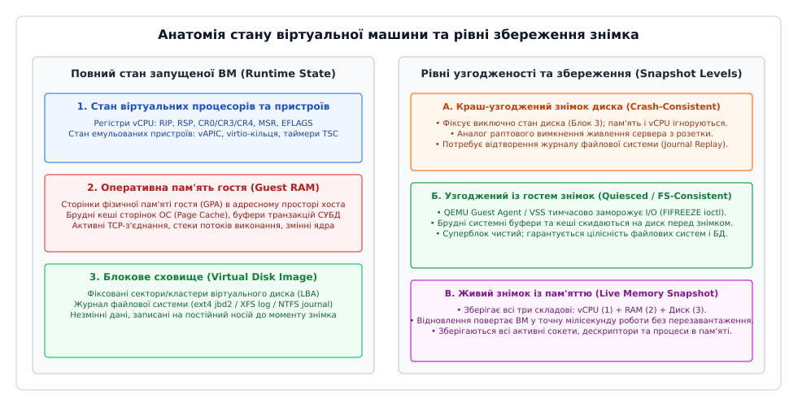
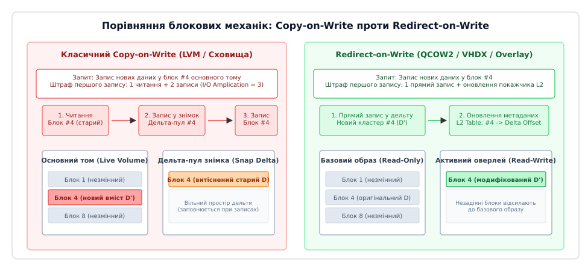
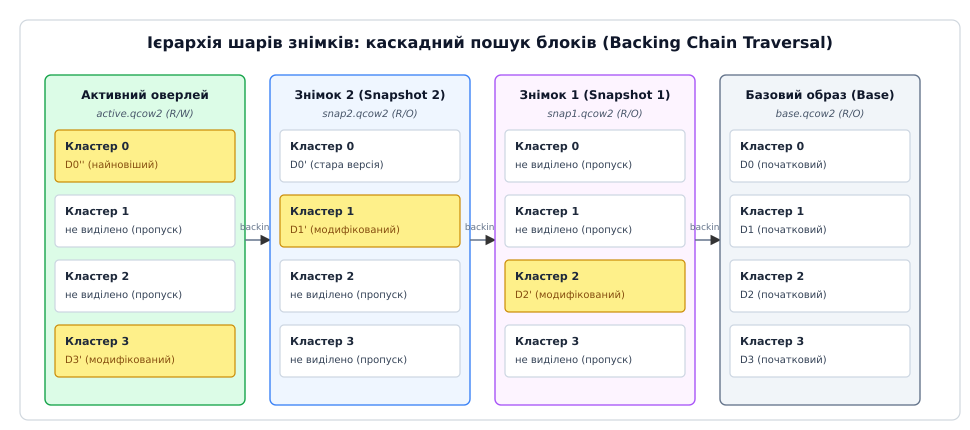
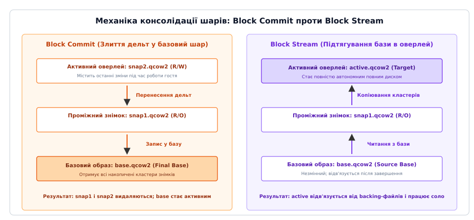
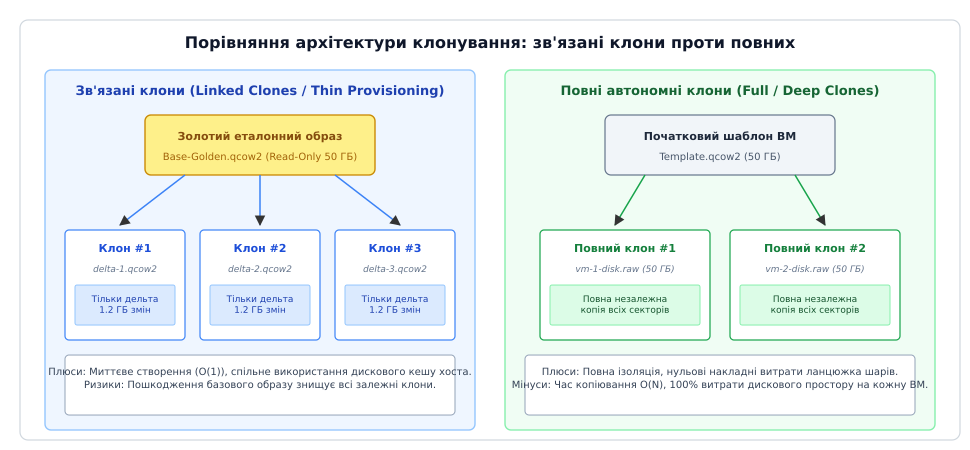

# Знімок і клон віртуальної машини: збереження стану, відкіт і роздвоєння історії

<preknowlist>
- [Апаратна віртуалізація](topic:programming/hardware-virtualization) — як гіпервізор керує гостьовими процесорами, пам'яттю та перехопленням операцій вводу-виводу.
- [Віртуальна пам'ять](topic:programming/virtual-memory) — сторінкова трансляція адрес, відображення адресних просторів та механізм відкладеного виділення сторінок.
- [Копіювання при записі](topic:algorithms/copy-on-write-structures) — алгоритмічний принцип розділення спільних ресурсів до моменту першої мутації даних.
- [Бекапи і DR](topic:programming/disaster-recovery) — цілі RPO/RTO, стратегії створення резервних копій та відновлення після катастроф.
- [Ідентифікатор покоління віртуальної машини](topic:unix-linux/vm-generation-id) — ACPI-повідомлення ядра гостя про повернення знімка в часі чи роздвоєння клону.
</preknowlist>

Коли на сервері бази даних під керуванням PostgreSQL виконується оновлення схеми та міграція терабайтної таблиці замовлень, збій у скрипті міграції на 95% виконання загрожує багатогодинним простоєм виробничої системи. Спроба створити попередню резервну копію простим пофайловим копіюванням образу диска розміром 500 ГБ на локальному NVMe-накопичувачі вимагає щонайменше 8–10 хвилин інтенсивного навантаження на шину вводу-виводу і змушує або повністю зупинити віртуальну машину (downtime), або змиритися з неузгодженим станом файлів, які продовжують змінюватися під час копіювання. Водночас у середовищі динамічного тестування чи CI/CD потреба розгорнути 50 ідентичних ізольованих екземплярів операційної системи для паралельного прогону тестів шляхом повного встановлення ОС вимагає понад 45 хвилин і понад 2 терабайти дискового простору.

Цю дилему розв'язують механізми **знімків (англ. *snapshots*, від англ. *snap* — миттєве клацання / фіксація)** та **клонування (англ. *cloning*, від грец. *κλών* — паросток / гілка)**. Вони дозволяють за лічені мілісекунди заморозити стан віртуальної машини на блоковому рівні, створити точку повернення без зупинки гостьових сервісів та миттєво відгалузити десятки незалежних дочірніх машин із нульовими початковими витратами дискової ємності.


*Складові обчислювального стану ВМ та класифікація рівнів збереження: від «холодного» зрізу блоків диска до повного збереження контексту пам'яті й регістрів vCPU*

---

## Анатомія стану віртуальної машини: що саме фіксує знімок

Віртуальна машина під керуванням гіпервізора (KVM/QEMU, VMware ESXi, Hyper-V, Xen) — це сукупність трьох незалежних площин обчислювального стану, кожна з яких має власну швидкість зміни даних та вимоги до збереження:

1. **Блоковий стан накопичувачів (Storage State):** вміст віртуальних дисків у форматах QCOW2, RAW, VMDK або VHDX. Це масив секторів або кластерів із логічною адресацією (LBA), у якому живуть структури файлових систем, суперблоки, журнали (ext4 jbd2, XFS journal, NTFS log) та таблиці розміщення файлів.
2. **Стан оперативної пам'яті (RAM State):** набір фізичних сторінок гостя (GPA — Guest Physical Address), відображених у віртуальний адресний простір процесу гіпервізора на хості (HVA — Host Virtual Address). Пам'ять містить актуальний стек виконання кожного процесу, сокети TCP із номерами послідовностей (Sequence Numbers), відкриті дескриптори файлів, ключі сесій TLS, брудні сторінки кешу файлової системи (`dirty page cache`) та незбережені буфери транзакцій СУБД.
3. **Архітектурний стан процесорів та пристроїв (vCPU and Virtual Device State):** значення регістрів загального призначення (RAX, RBX, RCX), вказівника інструкцій (RIP), верхівки стека (RSP), регістрів керування (CR0, CR3, CR4), моделезалежних регістрів (MSR), лічильників тактів TSC, а також внутрішній стан емульованих контролерів переривань (vAPIC), черг передачі пакетів віртуальних мережевих карт (`virtio-net`) і блокових контролерів (`virtio-blk`).

Залежно від того, які саме шари стану охоплює операція, знімки поділяються на три фундаментальні рівні узгодженості.

### 1. Краш-узгоджений знімок диска (Crash-Consistent Snapshot)

Краш-узгоджений знімок фіксує виключно блоковий стан віртуального диска в конкретну мілісекунду, повністю ігноруючи вміст оперативної пам'яті та стан регістрів vCPU. Для гостьової операційної системи ця операція виглядає точно так само, як раптове аварійне вимкнення живлення фізичного сервера («висмикування шнура з розетки»).

Під час відновлення машини з такого знімка відбувається повноцінне завантаження гостьового ядра через BIOS/UEFI. Ядро фіксує аварійне завершення роботи, зчитує журнали файлових систем (`fsck`, відновлення журналу jbd2 в ext4) і повертає метадані розділів до останнього безпечного стану транзакції. Усі модифікації файлів, які на момент знімка перебували виключно в оперативній пам'яті або кеші запису ядра і ще не були скинуті системним викликом `fsync(2)` на постійний носій, безповоротно втрачаються.

### 2. Узгоджений із гостем знімок (Quiesced / File-System-Consistent Snapshot)

Щоб уникнути пошкодження файлових структур і втрати даних із системних кешів, гіпервізор перед фіксацією блокового стану диска встановлює зв'язок із допоміжною службою всередині гостьової ОС — **гостьовим агентом (англ. *guest agent*, наприклад `qemu-guest-agent` у Linux або VSS-провайдер VMware Tools у Windows)**.

Процес створення узгодженого знімка проходить строгий чотириетапний конвеєр:

```
[Гіпервізор]  ──(1. QMP guest-fsfreeze-freeze)──>  [Guest Agent]
                                                         │
                                                    (2. ioctl FIFREEZE)
                                                         │
                                                   [Ядро гостя: VFS]
                                                         │
                                                   (Скидання dirty pages + блок I/O)
                                                         │
[Гіпервізор]  <──(3. Підтвердження заморозки)─────  [Guest Agent]
     │
(Створення знімка диску: CoW/RoW)
     │
[Гіпервізор]  ──(4. QMP guest-fsfreeze-thaw)────>  [Guest Agent] -> ioctl FITHAW
```

Гостьовий агент отримує від гіпервізора команду через віртуалізований послідовний порт (`virtio-serial`) і надсилає ядру гостьової ОС системний виклик `ioctl(fd, FIFREEZE)`. Ядро Linux у відповідь примусово скидає всі брудні сторінки буферного кешу на диск, записує транзакції журналу файлової системи, позначає суперблок як чистий і тимчасово блокує виконання будь-яких нових операцій запису у просторі користувача. Після успішного скидання гіпервізор створює знімок диска за лічені частки мілісекунди і надсилає команду `ioctl(fd, FITHAW)`, повертаючи гостьову ОС до штатної обробки дискових операцій.

У середовищі Microsoft Windows аналогічну функцію виконує служба тіньового копіювання томів (англ. *Volume Shadow Copy Service, VSS*). VSS не лише заморожує рівень файлової системи NTFS, а й опитує зареєстровані обробники застосунків (*VSS Writers* — Microsoft SQL Server, Exchange, Active Directory), змушуючи їх скинути буфери журналів попереджувального запису (WAL) до фіксації тіньового шару.

Детальний опис системних викликів, керуючих команд QMP та взаємодії з агентом наведено в довіднику [Програмний та системний інтерфейс керування знімками й клонами](topic:programming/vm-snapshot-and-clone/api-snapshot-control.md).

### 3. Живий знімок із пам'яттю (Live Memory Snapshot)

Живий знімок зберігає абсолютну повноту обчислювального стану: диск, оперативну пам'ять та контекст віртуальних процесорів. На коротку мить (зазвичай 10–50 мілісекунд) гіпервізор призупиняє виконання коду гостьовими vCPU, скидає їхні регістри та буфери емульованих пристроїв у дескриптор знімка, фіксує поточний базовий шар диска через дельта-оверлей, після чого продовжує виконання ВМ, одночасно вивантажуючи сторінки оперативної пам'яті у файл образу стану на хості.

Під час повернення до живого знімка гостьова ОС не проходить етап завантаження ядра BIOS. Гіпервізор завантажує збережені сторінки RAM безпосередньо в адресний простір процесу, відновлює регістри vCPU і передає керування процесору. Гостьова машина продовжує виконання коду з тієї самої мікросекунди, зберігаючи всі запущені програми, відкриті файлові дескриптори та мережеві з'єднання в пам'яті.

---

## Блокова механіка збереження: Copy-on-Write проти Redirect-on-Write

Головна вимога до створення знімка накопичувача — миттєве виконання операції за час `O(1)`, незалежно від того, чи має віртуальний диск розмір 10 гігабайтів чи 10 терабайтів. Копіювання реальних байтів усього диска неприпустиме. Тому всі гіпервізори та дискові підсистеми спираються на механізми віртуалізації блокових адрес і відкладеного виділення місця.


*Блокова арифметика запису: трикратний I/O-штраф класичного Copy-on-Write проти прямого запису в дельта-шар при Redirect-on-Write*

### Класичний Copy-on-Write (CoW): збереження на місці

Історично першим підходом до створення знімків на рівні блокових пристроїв (зокрема в LVM у Linux та класичних дискових масивах SAN) став механізм **копіювання під час запису (англ. *Copy-on-Write, CoW*)**.

Принцип роботи CoW полягає в тому, що основний том залишається активним і продовжує записуватися «на місці» (in-place). У момент створення знімка виділяється додатковий пустий дельта-пул (диференційний простір). Метадані фіксують стан тому.

Коли гостьова операційна система намагається перезаписати блок даних, який існував до моменту знімка і ще жодного разу не модифікувався, дисковий контролер виконує обов'язковий триетапний цикл:
1. **Зчитування:** оригінальний старий блок зчитується з основного тому в оперативну пам'ять контролера.
2. **Збереження:** старий блок записується у виділений простір дельта-пулу знімка.
3. **Мутація:** новий блок даних від гостьової ОС записується на своє початкове місце в основному томі.

Цей процес породжує явище **I/O-ампліфікації (штраф першого запису)**: один логічний запис від програми трансформується в **три фізичні операції з накопичувачем (1 читання + 2 записи)**. Якщо на томі створено не один, а `N` незалежних знімків CoW, старий блок перед зміною має бути скопійований у дельта-пули всіх `N` знімків, збільшуючи коефіцієнт штрафу до `1 читання + N записів + 1 фінальний запис`. Це призводить до катастрофічної деградації продуктивності дискової підсистеми під час інтенсивного випадкового запису.

### Redirect-on-Write (RoW) та дельта-оверлеї

Щоб позбутися штрафу ампліфікації запису, сучасні формати віртуальних дисків (зокрема QCOW2 у QEMU/KVM, VHDX у Hyper-V, Redo-логи VMDK у VMware ESXi та копії на файлових системах ZFS/Btrfs) використовують архітектуру **перенаправлення під час запису (англ. *Redirect-on-Write, RoW*)**.

При створенні знімка за схемою RoW:
- Поточний образ диска (наприклад, `base.qcow2`) **миттєво блокується від будь-яких подальших змін і переводиться в режим «лише для читання» (Read-Only)**.
- Створюється новий тонкий файл оверлею (наприклад, `snap1.qcow2`), який реєструє `base.qcow2` як свій батьківський базовий шар (англ. *backing file*).
- Усі нові операції запису гостя безумовно перенаправляються в новий файл оверлею.

При першому записі в будь-який блок дискова підсистема виконує **рівно один прямий запис** нового кластера у файл оверлею та оновлює локальну таблицю трансляції адрес. Старий батьківський блок залишається недоторканим на своєму первинному місці. Штраф ампліфікації запису повністю зникає, а швидкість створення знімка зводиться до часу створення дескриптора нового порожнього файлу оверлею розміром у кілька десятків кілобайтів.

Математичний аналіз кривих деградації швидкості та виведення формул I/O-ампліфікації розібрано у вставці [Математика I/O-ампліфікації, глибини ланцюжка та зростання обсягу при CoW і RoW](topic:programming/vm-snapshot-and-clone/math-snapshot-io-amplification.md).

---

## Ієрархія шарів (Backing Chain) та трансляція кластерів

Використання схеми Redirect-on-Write перетворює диск віртуальної машини на багаторівневий спрямований ациклічний граф — **ланцюжок шарів (англ. *backing chain*)**.

Кожен шар оверлею містить власну дворівневу таблицю трансляції адрес (в архітектурі QCOW2 це таблиці першого та другого рівнів: L1 Table і L2 Tables), що відображають віртуальні адреси секторів гостя на фізичні зміщення кластерів усередині файлу образу.


*Каскадне розв'язання читання блоків: пошук зміщення в активному шарі з послідовним спуском по ланцюжку backing-файлів до базового образу*

### Алгоритм каскадного читання блоків

Коли гостьова операційна система виконує операцію читання сектора за логічною адресою `LBA`, блоковий драйвер гіпервізора запускає рекурсивний пошук:

1. Драйвер обчислює індекс кластера: `Cluster_Index = LBA / Cluster_Size` (за замовчуванням у QCOW2 розмір кластера становить 64 КБ = 128 секторів).
2. Драйвер звертається до таблиці L2 **найвищого (активного) оверлею** `active.qcow2`.
3. **Перевірка наявності (Allocation Check):**
   - Якщо запис у таблиці L2 містить валідне ненульове фізичне зміщення, кластер було модифіковано в цьому шарі. Драйвер зчитує байти безпосередньо з файлу `active.qcow2` і повертає їх гостю.
   - Якщо запис у таблиці дорівнює нулю (кластер не виділено, `unallocated`), це означає, що цей фрагмент диска не зазнавав змін після створення останнього знімка.
4. **Спуск по ланцюжку:** Драйвер відкриває батьківський шар, вказаний у полі заголовка `backing_file` (наприклад, `snap2.qcow2`), і повторює пошук у його таблицях трансляції.
5. Процес повторюється вглиб ланцюжка, доки шуканий кластер не буде знайдено в одному з проміжних знімків або в найнижчому базовому образі `base.qcow2`.

Робочу низькорівневу реалізацію драйвера оверлею з бітовою картою та таблицею трансляції секторів на мовах C та C++ наведено у проекті [Реалізація блокового CoW-оверлею та розв'язання ланцюжка шарів](topic:programming/vm-snapshot-and-clone/proj-cow-overlay.md).

### Внутрішні та зовнішні знімки: межа архітектурної надійності

Гіпервізори підтримують дві форми організації дельта-шарів:

- **Внутрішні знімки (Internal Snapshots):** усі таблиці L2, дельта-кластери та збережений дампи оперативної пам'яті упаковуються в єдиний файл `.qcow2`. Базовий файл містить каталог знімків (`QCowSnapshotHeader`). Головна перевага — самодостатність: віртуальна машина з усією історією станів представлена одним монолітним файлом. Головний недолік — ризик повної втрати даних: будь-яке пошкодження заголовка чи структур метаданих файлу знищує не лише поточний стан машини, а й усі накопичені історичні точки відновлення. Крім того, монолітний файл страждає від високої внутрішньої фрагментації та повільного вивільнення простору.
- **Зовнішні знімки (External Snapshots):** кожен знімок створюється як абсолютно окремий автономний файл на файловій системі хоста, пов'язаний із попередниками виключно через рядок шляху `backing_file`. Зовнішні знімки є стандартом для промислових хмарних інфраструктур (OpenStack, oVirt, libvirt, Proxmox VE), оскільки вони дозволяють підключати базові образи у режимі суворого Read-Only, використовувати мережеві сховища Ceph RBD / SAN та виконувати паралельне резервне копіювання заморожених файлів сторонніми утилітами.

---

## Деградація ланцюжка та жива консолідація (Merge / Commit / Stream)

Хоча створення знімків через Redirect-on-Write є миттєвим, накопичення довгого ланцюжка шарів (`Base -> Snap1 -> Snap2 -> ... -> SnapN -> Active`) несе серйозну загрозу продуктивності та стабільності промислової системи:

1. **Зростання латентності читання:** під час холодного читання немодифікованих секторів драйвер змушений виконувати `N` послідовних звернень до файлових метаданих кожного шару, що збільшує затримку доступу в рази.
2. **Фрагментація дискового простору:** блоки однієї й тієї самої файлової системи виявляються хаотично розкиданими по різних фізичних файлах накопичувача, руйнуючи послідовність читання.
3. **Крихкість зв'язків:** випадкове перейменування, зміна прав доступу або оновлення мітки часу батьківського базового файлу унеможливлює його валідацію дочірніми оверлеями, перетворюючи всю історію на нечитабельний масив даних.

Щоб позбутися проміжних знімків та повернути віртуальний диск до монолітного стану без зупинки гостьової ОС, застосовують операцію **консолідації (злиття) шарів**.


*Два вектори консолідації дискових шарів: Block Commit (скидання змін у базовий образ) проти Block Stream (підтягування базових кластерів в активний оверлей)*

Консолідація реалізується двома протилежними напрямками передачі блоків:

### 1. Злиття в базу (Block Commit / Зверху вниз)

Команда `blockcommit` бере модифіковані кластери з верхніх оверлеїв і записує їх у нижчий базовий образ `base.qcow2`:
- Процес копіює кластери з проміжних знімків у базовий шар.
- **Дзеркалювання активного запису:** поки триває передача гігабайтів даних, гіпервізор відстежує нові операції запису гостя за допомогою бітової карти брудних блоків (`dirty bitmap`), паралельно записуючи зміни як в активний шар, так і в цільову базу.
- **Атомарне перемикання:** коли різниця між шарами наближається до нуля, гіпервізор на мікросекунду призупиняє чергу I/O, остаточно скидає фінальні байти і атомарно перемикає віртуальний дисковий контролер на пряму роботу з `base.qcow2`. Файли проміжних оверлеїв безпечно видаляються з файлової системи.

### 2. Підтягування в оверлей (Block Stream / Знизу вгору)

Команда `blockstream` (або `blockpull`) працює у зворотному напрямку: вона зчитує всі немодифіковані кластери з батьківського `base.qcow2` і записує їх безпосередньо в поточний верхній оверлей `active.qcow2`.
- Коли всі кластери базового образу скопійовано у верхній файл, оверлей стає повністю автономним диском.
- Гіпервізор очищає поле `backing_file` у заголовку активного файлу.
- Зв'язок із батьківською базою розривається, після чого старий базовий образ можна видалити або перенести в архів.

---

## Архітектура клонування: зв'язані клони проти повних

Клонування віртуальної машини — це створення нового незалежного обчислювального екземпляра на основі існуючого еталонного стану. Залежно від вимог до ізоляції, швидкості створення та споживання сховища застосовують два принципово різні підходи.


*Архітектура розгортання: зв'язані клони зі спільним золотим образом (миттєве масштабування) проти автономних повних копій*

### Зв'язані клони (Linked Clones / Тонке клонування)

Зв'язаний клон створюється шляхом накладання нового тонкого дельта-оверлею поверх єдиного незмінного **золотого еталонного образу (англ. *Golden Master Image*)**.

```
                           ┌──> [Клон 1: delta1.qcow2] (1.5 ГБ змін)
                           │
[Golden Master: base.qcow2]├──> [Клон 2: delta2.qcow2] (0.8 ГБ змін)
  (Read-Only, 50 ГБ)       │
                           └──> [Клон 3: delta3.qcow2] (2.1 ГБ змін)
```

**Переваги зв'язаних клонів:**
- **Миттєве розгортання `O(1)`:** створення нової віртуальної машини полягає виключно у виклику команди створення файлу оверлею (`qemu-img create -f qcow2 -b base.qcow2 -F qcow2 clone.qcow2`) і триває менше 50 мілісекунд.
- **Колосальна економія пам'яті та диска:** 100 віртуальних машин з базовим диском 50 ГБ кожна потребують не 5 000 ГБ, а лише початкові 50 ГБ золотого образу плюс невеликі індивідуальні дельти (по 1–2 ГБ на машину).
- **Ефективність дискового кешу хоста:** оскільки всі 100 машин зчитують системні бінарні файли (`/usr/lib`, `/bin`) з одного й того самого фізичного файлу `base.qcow2`, ядро хостової операційної системи кешує ці сторінки в оперативній пам'яті лише один раз. 100 гостьових машин спільно використовують єдиний пул кешу сторінок хоста (Page Cache).

**Недоліки та ризики:**
- **Єдина точка відмови (Single Point of Failure):** якщо файл `base.qcow2` буде випадково видалено, пошкоджено або змінено, всі 100 зв'язаних віртуальних машин миттєво втратять працездатність і будуть зруйновані.
- **Вузьке місце дискової шини:** під час масового одночасного запуску машин («завантажувальний шторм», англ. *boot storm*) сотні потоків вводу-виводу одночасно звертаються до одного базового файлу, що вимагає використання надшвидких NVMe-накопичувачів.

### Повні клони (Full Clones / Автономне копіювання)

Повний клон — це повністю незалежна, структурно відокремлена глибока копія віртуальної машини, що включає всі блоки накопичувачів, розгорнуті в автономний монолітний файл.

**Особливості повного клону:**
- **Повна ізоляція життєвого циклу:** видалення чи модифікація початкового шаблону жодним чином не впливає на функціонування створеного клону.
- **Максимальна продуктивність I/O:** відсутність будь-яких ланцюжків `backing_file` гарантує прямий доступ до секторів без накладних витрат на каскадну трансляцію метаданих.
- **Висока ціна створення:** копіювання 100 ГБ диска вимагає лінійного часу `O(N)` і повного виділення 100 ГБ фізичного дискового простору для кожної нової машини.

### Сучасна оптимізація: миттєві повні клони через Reflink та Storage Offload

Сучасні файлові системи (Btrfs, XFS з підтримкою reflink) та хмарні блокові сховища (Ceph RBD, SAN-масиви з протоколами VAAI / SCSI XCOPY) стирають жорстку межу між зв'язаними та повними клонами завдяки **апаратному перепосиланню екстентів (reflink)**.

Під час виконання команди копіювання з прапорцем `cp --reflink=always template.raw clone.raw` файлова система не дублює фізичні блоки на диску. Вона створює новий незалежний дескриптор файлу (`inode`), покажчики якого посилаються на ті самі фізичні блоки сховища, що й оригінал. Подальша модифікація блоків як у шаблоні, так і в клоні обслуговується самою файловою системою за прозорим алгоритмом CoW. У результаті адміністратор отримує швидкість створення зв'язаного клону (`O(1)`) за повної структурної незалежності та автономності файлів.

---

## Пастки клонування та відкоту: конфлікти ідентичності та розщеплення часу

Операція повернення віртуальної машини до збереженого знімка або одночасний запуск кількох копій одного образу — це грубе порушення фундаментального припущення операційної системи про **неперервність і монотонність фізичного часу**.

У реальному світі апаратний сервер не може за одну мікросекунду переміститися на три дні назад або розділитися на два паралельні фізичні світи з однаковим вмістом пам'яті. Непідготовлене виконання цих операцій породжує тяжкі збої системного рівня:

### 1. Мережеві конфлікти та колізії ідентифікаторів ОС

Якщо клон запускається в тому самому мережевому сегменті без попередньої спеціалізації, виникають неминучі апаратні та системні колізії:
- **Дублювання MAC-адрес:** два віртуальні мережеві адаптери мають однаковий MAC. Мережеві комутатори починають штормити таблиці комутації (ARP Flapping), пакетний трафік хаотично розпадається між двома вузлами.
- **Конфлікт системного ідентифікатора машини (`/etc/machine-id` у Linux):** `systemd`, D-Bus та сервіси журналювання спираються на 128-бітний ідентифікатор хоста. Якщо два сервери мають однаковий `machine-id`, агенти збору метрик (Prometheus, Datadog), брокери повідомлень та кластерні менеджери (Kubernetes Kubelet) сприймають їх як один і той самий вузол, перезаписуючи стан один одного.
- **Дублювання хостових ключів SSH (`/etc/ssh/ssh_host_*_key`):** усі клони мають однакові закриті ключі авторизації сервера, відкриваючи можливість для атак перехоплення трафіку (Man-in-the-Middle).

Для запобігання цим колізіям розгортання клонів обов'язково супроводжується процедурою **генералізації та спеціалізації (Sysprep у Windows, `virt-sysprep` або `cloud-init` у Linux)**: скиданням MAC-адрес, очищенням `machine-id`, регенерацією SSH-ключів та призначенням нових імен хостів (hostname).

### 2. Клонування генераторів випадкових чисел (CSPRNG State Duplication)

Найбільш критична з точки зору інформаційної безпеки загроза виникає при клонуванні або відновленні ВМ із живого знімка пам'яті.

Криптографічні генератори псевдовипадкових чисел операційної системи (CSPRNG, підсистема ядра `/dev/urandom`, алгоритми ChaCha20) спираються на внутрішній стан ентропійного пулу. Якщо віртуальну машину роздвоїти в момент часу `T`, **обидва клони отримають абсолютно ідентичний бітовий стан ентропійного пулу в пам'яті**.

У результаті обидві незалежні машини почнуть генерувати **абсолютно однакові послідовності псевдовипадкових чисел**:
- Створюються однакові сесійні ключі TLS для клієнтських підключень.
- Генеруються однакові ідентифікатори транзакцій, солі паролів та токени авторизації.
- Будь-який криптографічний протокол, що розраховує на унікальність одноразових чисел (nonce), повністю компрометується.

### 3. Відкіт послідовностей у розподілених базах (USN Rollback)

Якщо віртуальна машина входить до складу кластера розподіленої бази даних або служби каталогів (Microsoft Active Directory Domain Controller, кластери etcd, Apache Cassandra, Raft), відкіт її диска до попереднього знімка призводить до катастрофічного **роздвоєння стану (Split-Brain) та пошкодження реплікації**:
- Вузол повертається до номера послідовності транзакцій `USN = 1000`, тоді як решта кластера вже обробляє `USN = 1500`.
- Відновлений вузол починає записувати нові локальні транзакції з тими самими номерами `USN = 1001, 1002...`, які він уже колись відправляв сусідам з іншими даними.
- Вбудовані механізми виявлення конфліктів реплікації ламаються, оскільки система вважає ці транзакції застарілими або вже підтвердженими.

### Архітектурне вирішення: ACPI VM Generation ID (VMGenID)

Для захисту операційних систем від парадоксів роздвоєння та повернення часу консорціум розробників гіпервізорів та операційних систем створив відкритий апаратний стандарт — **ідентифікатор покоління віртуальної машини (англ. *Virtual Machine Generation ID, VMGenID*)**.

Гіпервізор експортує гостьовій системі спеціальний віртуальний пристрій через таблиці ACPI (`ACPI0013`). Цей пристрій містить 128-бітний числовий GUID, розміщений у виділеній сторінці пам'яті гостя.

```
+-----------------------------------------------------------------------------+
|                               Гіпервізор                                    |
|                                                                             |
|  1. Revert Snapshot / Fork Clone                                            |
|  2. Генерація нового 128-бітного GUID (UUIDv4)                             |
|  3. Запис GUID у сторінку ACPI ADDR гостя                                   |
|  4. Надсилання ACPI Notification (0x80) переривання                         |
+-----------------------------------------------------------------------------+
                                       │
                                       ▼
+-----------------------------------------------------------------------------+
|                            Гостьове ядро Linux / Windows                    |
|                                                                             |
|  1. ACPI-переривання викликає драйвер vmgenid (drivers/virt/vmgenid.c)       |
|  2. Драйвер порівнює збережений GUID з новим: GUID_old != GUID_new           |
|  3. Ядро негайно ПОВНІСТЮ ЗНЕПРАВЛЮЄ поточний пул ентропії                  |
|  4. Змішування свіжої ентропії з таймерів та RDRAND у CSPRNG (/dev/urandom)  |
|  5. Оповіщення зареєстрованих підсистем (Active Directory, СУБД, etcd)      |
+-----------------------------------------------------------------------------+
```

Щоразу, коли адміністратор відновлює знімок ВМ або запускає новий клон із збереженого образу, гіпервізор генерує новий унікальний 128-бітний GUID, записує його в пам'ять пристрою і надсилає гостьовій ОС ACPI-сповіщення `Notify(VMGI, 0x80)`. Драйвер гостьового ядра `vmgenid` перехоплює це сповіщення, фіксує зміну покоління і негайно оновлює криптографічний пул випадковості свіжою ентропією апаратного таймера та інструкцій RDRAND, а також інформує служби баз даних про необхідність переініціалізації номерів транзакцій.

Повний механізм роботи драйвера `vmgenid` у просторі ядра детально розібрано в темі [Ідентифікатор покоління віртуальної машини](topic:unix-linux/vm-generation-id).

---

## Експлуатаційна матриця: вибір стратегії збереження та клонування

Для швидкого вибору оптимальної моделі в інженерній практиці використовують співвідношення вимог до цілісності даних, допустимого часу простою (RTO) та витрат дискового простору:

| Завдання та робочий сценарій | Рекомендований тип знімка | Механізм клонування | Метод узгодженості |
| :--- | :--- | :--- | :--- |
| **Оновлення ПЗ / Схеми БД на продакшені** | Зовнішній знімок RoW (QCOW2 / VHDX) | Не застосовується (тимчасова точка відкату) | Quiesced (FSFreeze через Guest Agent / VSS) |
| **Ефемерні тестові стенди CI/CD** | Незмінний золотий базовий образ | Зв'язаний клон (Linked Clone) | Crash-consistent (швидкість `O(1)`) |
| **Створення нового продакшн-сервера з шаблону** | Автономний шаблон | Повний клон через Reflink / Fast Copy | Генералізація (`cloud-init` / `virt-sysprep`) |
| **Гаряче резервне копіювання ВМ (Backup)** | Тимчасовий зовнішній знімок оверлею | Читання замороженої бази стороннім бекапером | Quiesced + послідовний Block Commit після завершення |
| **Налагодження плаваючих помилок у пам'яті (Debug)**| Живий знімок із RAM і регістрами vCPU | Не застосовується | Live Memory Snapshot (збереження vCPU + RAM) |

> 🔧 **Навіщо це в реальній розробці.**
> Розуміння низькорівневої механіки знімків та клонування захищає інфраструктуру від трьох найнебезпечніших операційних помилок:
> 1. **Забуті знімки в продакшені:** залишений на місяць знімок розростається до сотень гігабайтів, вичерпує вільне місце на сховищі гіпервізора, блокує чергу I/O через деградацію глибини ланцюжка і змушує проводити ризиковану багатогодинну консолідацію під навантаженням.
> 2. **Ілюзія резервної копії:** знімок — це не бекап. Знімок є диференційною залежністю від батьківського диска; вихід із ладу фізичного носія базового образу знищує всі знімки разом із ним. Справжній бекап вимагає вивантаження консолідованих блоків на ізольоване зовнішнє сховище.
> 3. **Клонування без генералізації:** масовий запуск зв'язаних клонів без очищення `machine-id` та оновлення `vmgenid` призводить до прихованого розщеплення ключів безпеки та колізій у системних реєстрах.
