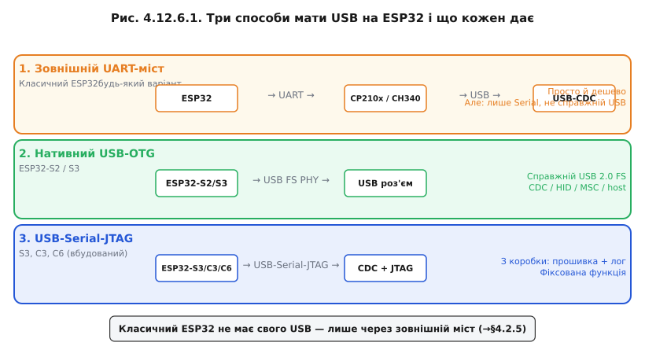

# USB в ESP32: нативний USB-OTG (S2/S3) і USB-Serial-JTAG (S3/C3/C6) проти зовнішнього моста

USB на ESP32 — це не одна функція, а кілька різних рішень, і яким саме шляхом чип отримує USB, залежить від моделі. [Сімейство ESP32 різноманітне](book:programming/esp32-family), і щодо USB картина суттєво відрізняється від чипа до чипа: одні моделі мають повноцінний апаратний USB-контролер, інші — лише спрощений фіксований блок, треті взагалі покладаються на зовнішній перетворювач. Розберімо, чим саме оснащена кожна модель і яке рішення підходить для якої задачі.

### Три способи мати USB на ESP32



*Рис. Зліва: ESP32 + зовнішній міст. У центрі: S2/S3 з нативним OTG. Праворуч: S3/C3/C6 з USB-Serial-JTAG.*

**Зовнішній USB-UART-міст (класичний ESP32 і будь-який інший варіант)**. Мікроконтролер спілкується через [UART](book:communications/async-serial), а окремий чип — CP210x, CH340, FT232 — перетворює UART на USB-CDC. Для ОС це виглядає як COM-порт. Метод простий, надійний і недорогий. Але важливо розуміти: USB-стек живе у зовнішньому чипі, а не в ESP32. Сам мікроконтролер нічого не «бачить» у USB і не керує ним. Тому такий ESP32 не може «прикинутися» флешкою, клавіатурою або хостом — лише текстовий Serial.

**Нативний USB-OTG (ESP32-S2 і ESP32-S3)**. У цих двох моделях є повноцінний апаратний блок USB 2.0 Full-Speed OTG. ESP32 сам є USB-контролером: формує дескриптори, відповідає на запити хоста, реалізує будь-який клас CDC/HID/MSC або навіть [виступає хостом для інших пристроїв](book:programming/usb-host). Для цього потрібен програмний USB-стек — наприклад TinyUSB, який входить до ESP-IDF. Швидкість — Full-Speed, 12 Мбіт/с; High-Speed у S2/S3 відсутня.

**USB-Serial-JTAG (ESP32-S3, C3, C6 і новіші)**. Це вбудований апаратний блок, що реалізує CDC-порт (для прошивки й Serial-логів) і JTAG (для апаратного відлагодження) «з коробки» — без зовнішнього моста і без написання USB-стека. Досить підключити кабель, і ОС бачить два нових пристрої: COM-порт і JTAG-інтерфейс. Зручно для розробки. Але це фіксована функція — змінити клас або додати HID уже неможливо. ESP32-S3 має обидва блоки: і USB-Serial-JTAG, і нативний OTG (на різних фізичних виводах).

### Яку швидкість і клас отримуєш

Нативний USB у ESP32-S2/S3 — Full-Speed (12 Мбіт/с), не High-Speed. Для більшості задач (CDC-лог, HID-пристрій, MSC-флешка) цього абсолютно достатньо; але якщо потрібна висока пропускна здатність для відео або великих файлів — 12 Мбіт/с є фактичним обмеженням. З програмним стеком TinyUSB реально підняти CDC, HID, MSC, Audio, MIDI, а також їхні композити.

### Які виводи

На ESP32-S2 і S3 лінії USB D+ і D− закріплені за конкретними GPIO і не можуть бути довільно перепризначені: D+ → GPIO20, D− → GPIO19 (у S3 — аналогічно). Ці виводи не вільні для іншого використання, якщо USB активний. Strapping-виводи і [режим завантаження](book:programming/bootloader) при цьому лишаються важливими: вибір джерела USB не скасовує логіку входу в bootloader під час скидання.

### Коли що обирати

Проста таблиця рішень:

| Задача | Рекомендований шлях |
|--------|---------------------|
| Залити прошивку, читати Serial, відлагоджувати | USB-Serial-JTAG (S3/C3/C6) або зовнішній міст |
| МК виглядає як COM-порт для власного ПЗ | CDC через нативний OTG (S2/S3) або CDC через міст |
| МК як клавіатура, геймпад, макро-пад | HID через нативний OTG (S2/S3) |
| МК надає доступ до SD-картки як до диска | MSC через нативний OTG (S2/S3) |
| МК читає USB-флешку чи клавіатуру | [Host-режим](book:programming/usb-host), лише S2/S3 |


*Рис. Позначки: що реально вміє кожна модель. Host і довільний клас — лише S2/S3.*

**Worked-приклад: один кабель — три ролі**

Один ESP32-S3 DevKit, один USB-кабель. Змінюємо тільки конфігурацію стека:

```c
/* Варіант 1: CDC (COM-порт для логів) */
/* У tusb_config.h: CFG_TUD_CDC = 1, CFG_TUD_HID = 0, CFG_TUD_MSC = 0 */
tud_cdc_write_str("Hello from CDC!\r\n");
tud_cdc_write_flush();

/* Варіант 2: HID-клавіатура (надіслати натискання 'A') */
/* CFG_TUD_HID = 1 */
uint8_t keycode[6] = { HID_KEY_A, 0, 0, 0, 0, 0 };
tud_hid_keyboard_report(REPORT_ID_KEYBOARD, 0 /*modifier*/, keycode);
tud_task(); /* обробити USB-події */
tud_hid_keyboard_report(REPORT_ID_KEYBOARD, 0, NULL); /* key up */

/* Варіант 3: MSC (флешка з SD-карткою) */
/* CFG_TUD_MSC = 1 */
/* Реалізувати tud_msc_read10_cb() / tud_msc_write10_cb() → SD через SPI */
```

Залізо те саме. Змінюється конфігурація TinyUSB і, відповідно, дескриптори, що генеруються при ініціалізації.

> 🔧 **Навіщо це**: розуміння «що в моєму чипі — справжній USB, а що лише UART-міст» рятує від типової плутанини «чому S3 може прикинутися флешкою, а класичний ESP32 ні». Це пряме інженерне рішення при виборі чипа під задачу. Якщо проєкт потребує нестандартного USB-класу або host-режиму — відразу беріть S2/S3; якщо лише Serial і відлагодження — достатньо C3/C6 або навіть класичного ESP32 з мостом.

Підсумок простий: перш ніж вибирати чип під задачу, з'ясуйте, який саме USB він має. Потрібен нестандартний клас або host — лише S2/S3 з нативним OTG; достатньо Serial і відлагодження — вистачить C3/C6 із вбудованим USB-Serial-JTAG або класичного ESP32 із зовнішнім мостом.

---
