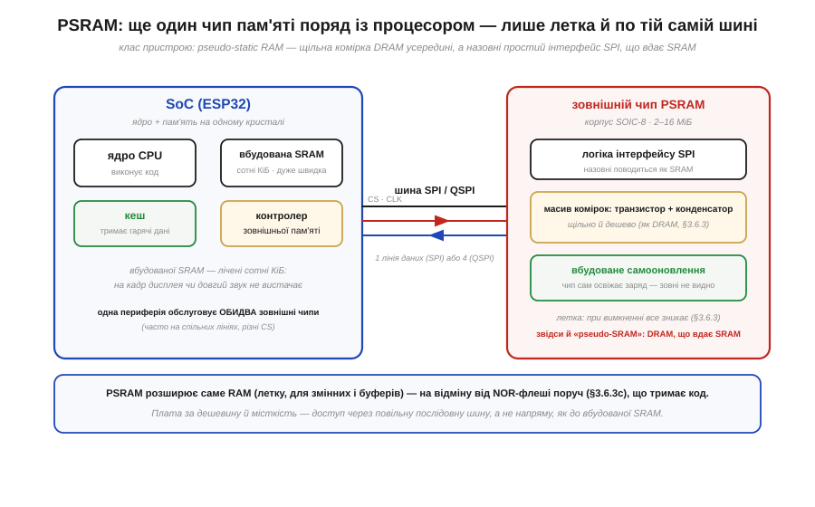
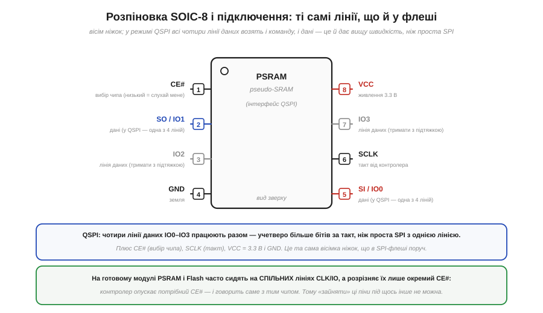
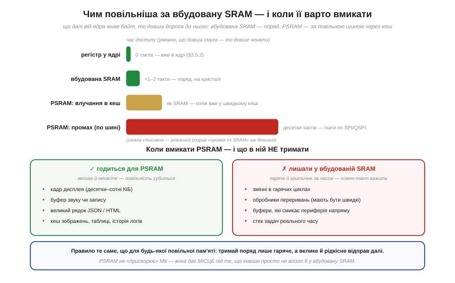

# 🔌 PSRAM: додаткові мегабайти по SPI

> Каталог «Компоненти» · сектор `memory`.

### Клас пристрою: DRAM, що вдає SRAM

**PSRAM** (*pseudo-static RAM*, псевдостатична пам'ять) — це окрема мікросхема **леткої** пам'яті на 2–16 МіБ, яку процесор бачить через ту саму шину SPI, що й флеш. Назва точно описує хитрість усередині. Комірка тут — не статичний тригер дорогої SRAM, а **транзистор із конденсатором**, як у щільної й дешевої [DRAM-комірки](book:electronics/dram-cell): саме тому мегабайти коштують копійки. А DRAM **тече** — заряд у конденсаторі стікає, і його треба раз у раз освіжати. Щоб не навантажувати цим процесор, чип ховає лічильник освіження **всередину себе**: ззовні він поводиться як простенька SRAM, до якої просто пишеш і читаєш, а возню з регенерацією бере на себе. Звідси й «псевдостатична»: динамічна за фізикою, статична на вигляд.

*Рис. PSRAM — третій чип поряд із процесором і флешшю. Усередині — масив комірок DRAM (транзистор + конденсатор) і **схований лічильник самооновлення**, а назовні — простий інтерфейс SPI, що вдає SRAM. На відміну від сусідньої [NOR-флеші](book:electronics/nor-vs-nand), яка тримає **код** і **нелетка**, PSRAM розширює саме **RAM** — летку пам'ять під змінні й буфери. Плата за щільність — доступ через повільну послідовну шину, а не напряму, як до вбудованої SRAM.*

### Розпіновка й підключення

Корпус і ніжки в PSRAM — ті самі, що в знайомої SPI-флеші: вісім виводів **SOIC-8**, з яких чотири несуть живлення та службу, а чотири — це шина даних. У найпростішому режимі **SPI** дані йдуть однією лінією, але PSRAM майже завжди заводять у режимі **QSPI** (*Quad SPI*): тоді працюють **усі чотири** лінії даних IO0–IO3 разом, по чотири біти за такт. Це найдешевший спосіб підняти швидкість послідовної шини — учетверо ширша «труба» за ту саму тактову частоту.

*Рис. Вісім ніжок: вибір чипа (CE#), такт (SCLK), чотири лінії даних IO0–IO3 у режимі QSPI, живлення 3.3 В і земля. На готовому модулі PSRAM і Flash часто сидять на **спільних** лініях такту й даних, а розрізняє їх лише окремий сигнал вибору CE#: контролер опускає потрібний CE# — і говорить саме з тим чипом. Тому зайняти ці піни під щось своє вже не вийде.*

Звідси — найперша практична засторога підключення. Якщо PSRAM розпаяна на модулі разом із процесором, її лінії **вже зайняті** й виведені окремо від звичайних виводів загального призначення: чіпляти на них свою периферію не можна, бо там цілодобово править розмова двох чипів. А якщо PSRAM немає — припаяти її пізніше зазвичай неможливо: контролер зовнішньої пам'яті та виводи мусять бути передбачені в самій мікросхемі. Тому наявність PSRAM — це властивість, яку обирають **наперед**, ще на етапі вибору модуля.

### Перший «байт»: як її увімкнути

«Заговорити» з PSRAM напряму, командами SPI, вам майже ніколи не доведеться — і це найприємніше в ній. Контролер зовнішньої пам'яті разом із [кешем](book:programming/cache) роблять так, що чип **вмонтовується у звичайний адресний простір**: ви отримуєте просто ще один великий діапазон адрес під RAM. Тому «перший байт» тут — не послідовність команд, а один рядок налаштувань складання: вмикаєте підтримку PSRAM у конфігурації проєкту, і дальша робота — це звичні [покажчики](book:programming/addresses-pointers). Системі лишається сказати, **звідки** брати велике виділення пам'яті: типово ви або просите окремою функцією блок саме із зовнішньої RAM, або дозволяєте, щоб туди потрапляли великі виділення з [купи](book:programming/heap-dynamic-memory). За адресою байта одразу видно, де він: маленький діапазон вбудованої SRAM — це швидкі дані, великий діапазон PSRAM — місткі буфери.

### Чим повільніша — і коли її вмикати

За зручність ви платите швидкістю, і розрив тут чималий. Звернення до вбудованої SRAM коштує процесору один-два такти — вона поряд, на кристалі. Звернення до PSRAM мусить проїхати шиною QSPI, тож навіть найкращий випадок — **влучання в кеш**, коли потрібні байти вже підкачані, — дає швидкість десь на рівні SRAM, а **промах** змушує чекати десятки тактів, поки блок приїде. У переведенні на пропускну здатність це означає одиниці–десятки мегабайтів за секунду проти «миттєвої» вбудованої пам'яті. PSRAM не робить мікроконтролер швидшим — вона дає **місце** під те, що інакше не влізло б.

*Рис. Ліворуч — драбина затримки: [регістр у ядрі](book:programming/processor-parts) → вбудована SRAM (1–2 такти) → влучання в кеш PSRAM (як SRAM) → промах у PSRAM (десятки тактів, по шині). Праворуч — правило, що з цього випливає. У PSRAM добре лягає **велике й нечасте**, де повільність губиться: кадр дисплея, буфер звуку, довгий рядок, кеш зображень. А **гаряче й критичне за часом** лишають у вбудованій SRAM: змінні гарячих циклів, обробники переривань, буфери, які напряму смикає периферія.*

Тому критерій увімкнення простий і той самий, що для будь-якої повільної пам'яті: відправляй у PSRAM лише те, що **велике й до чого звертаєшся рідко**, а гаряче тримай поряд. Розкидати по PSRAM дрібні часто змінювані змінні — певний спосіб уповільнити програму, нічого не вигравши.

### Варіації класу

PSRAM різниться передусім **обсягом** (типово від 2 до 16 МіБ) і **шириною доступу**: проста SPI з однією лінією — повільніша, QSPI з чотирма — швидша; найновіші чипи додають ще ширший восьмилінійний режим заради вищої пропускної здатності. Трапляється PSRAM і прихованою в самому корпусі мікросхеми процесора, поряд із кристалом, — тоді шукати окремий чип на платі не треба, він уже всередині. Як саме така зовнішня пам'ять влаштована глибше — [інтерфейси SDRAM і DDR](book:electronics/sdram-ddr), контролери, таймінги, родина флешей — це вже окрема велика тема; тут досить розуміти, що PSRAM — це летка пам'ять «на виріст», яку дешево чіпляють тією самою шиною, коли вбудованої SRAM забракло.
