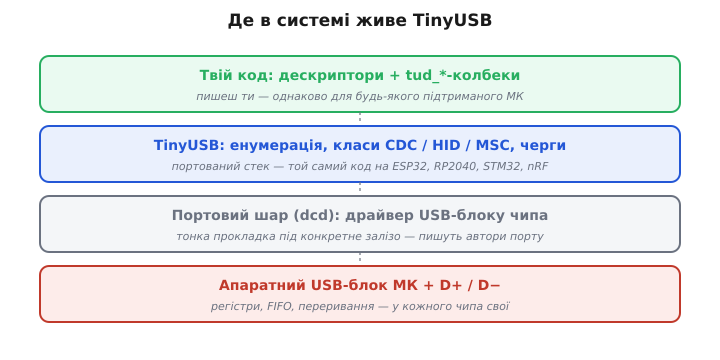
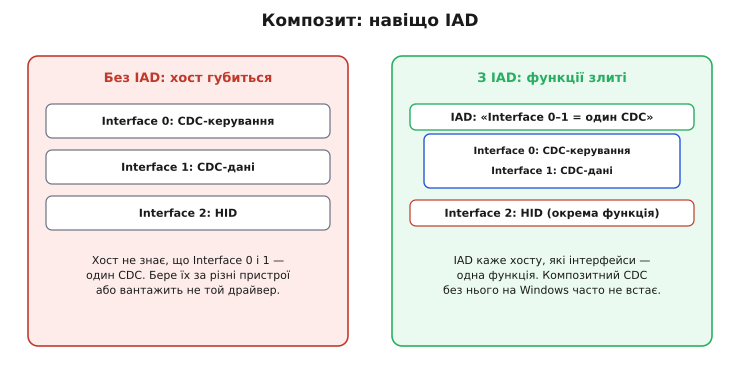

# TinyUSB: пристрій — докладно

Зробити мікроконтролер USB-пристроєм здається задачею про залізо: є USB-блок, є дві лінії D+/D−, лишилось «підняти периферію». Та щойно під'єднуєш плату до комп'ютера, виявляється, що питання зовсім не в дротах. Хост починає допит — низку суворо впорядкованих запитів із жорсткими таймінгами, — і пристрій мусить відповісти правильними бінарними структурами в правильному порядку, інакше для системи його просто немає. TinyUSB бере цей протокол на себе, але щоб упевнено з ним працювати — і особливо щоб лагодити, коли «не визначається», — треба розуміти, що саме він робить за лаштунками. Розберімо по шарах: дескриптори байт за байтом, повну енумерацію, композитні пристрої, типи кінцевих точок, чергу колбеків і пастки живлення й такту.

## Чому стек, а не регістри: межа переносності

Почнімо з причини існування TinyUSB, бо вона визначає всю його будову. Апаратний USB-блок у кожного сімейства мікроконтролерів свій: інші регістри, інша організація буферів кінцевих точок, інша модель переривань. Код, що піднімає USB «в лоб» на одному чипі, на іншому не значить нічого. А логіка самого протоколу USB — енумерація, формат дескрипторів, поведінка класів — стандартна й однакова скрізь, бо її диктує специфікація USB, а не виробник чипа.

Звідси природний поділ, на якому стоїть TinyUSB. **Портовий шар** (у термінах стека — `dcd`, *device controller driver*) знає регістри конкретного блоку: як увімкнути живлення USB, як налаштувати кінцеву точку, як прийняти переривання. Цей шар тонкий і написаний окремо під кожен підтриманий чип. Над ним — **переносне ядро**: автомат енумерації, розбір запитів, реалізації класів CDC/HID/MSC. Ядро говорить із портовим шаром через вузький внутрішній інтерфейс і не знає, на якому залізі працює.



*Різниця заліза замкнена в найнижчому шарі. Портовий драйвер ховає її за спільним інтерфейсом; ядро й твій код над ним не змінюються при переході між чипами. Це і є технічна суть переносності — не магія, а чітка межа відповідальності.*

Практичний наслідок: твій код торкається лише двох верхніх шарів — пишеш дескриптори й тіла `tud_`-колбеків. Усе нижче вже є. Тому той самий проєкт збирається під [ESP32](book:programming/esp32-usb), RP2040, STM32, nRF зміною одного складального таргета. Парк підтриманих чипів широкий саме тому, що додати новий — означає написати лише портовий шар, а не весь стек.

> 🔧 **Навіщо це.** Коли обираєш чип під виріб, USB перестає бути аргументом «прив'язки» до однієї платформи. Прототип на дешевому Pico, серія на ESP32-S3 із Wi-Fi — USB-частина переноситься без переписування. На голому регістровому коді кожна така міграція коштувала б повного циклу «вивчити блок — написати — відлагодити».

## Дескриптори байт за байтом

Дескриптор — це бінарна структура фіксованого формату, яку пристрій віддає хосту у відповідь на запит. Кожен дескриптор починається однаково: перший байт `bLength` — його довжина, другий `bDescriptorType` — його тип. Це дозволяє хосту читати ланцюг дескрипторів поспіль, навіть не знаючи наперед, що далі: прочитав довжину — відлічив стільки байтів — глянув тип наступного. Префікс `b` у назвах полів означає *byte* (один байт), `w` — *word* (два байти, little-endian), `bcd` — двійково-десяткове кодування версії (`0x0200` читається як «2.00»).

Найвищий — **Device Descriptor**, 18 байтів. Його ключові поля:

```
зміщення  поле                 розмір  призначення
  0       bLength              1       = 18
  1       bDescriptorType      1       = 0x01 (DEVICE)
  2       bcdUSB               2       версія USB, напр. 0x0200
  4       bDeviceClass         1       клас на рівні пристрою (0 = «дивись у Interface»)
  7       bMaxPacketSize0      1       розмір пакета EP0: 8/16/32/64
  8       idVendor             2       VID — хто виробник
 10       idProduct            2       PID — який продукт
 14       iManufacturer        1       індекс рядкового опису виробника
 17       bNumConfigurations   1       скільки конфігурацій (майже завжди 1)
```

Поле `bDeviceClass` варте уваги. Якщо пристрій однокласовий (лише HID), клас часто оголошують тут. Та для композита тут ставлять не конкретний клас, а спеціальне значення `0xEF` (Miscellaneous) з підкласом і протоколом, що кажуть хосту: «клас шукай нижче, в інтерфейсах, і чекай групувального дескриптора». Без цього композит з CDC на Windows часто не збирається — до цього ще повернемось.

Нижче — **Configuration Descriptor**, 9 байтів, але читається він разом з усім, що в нього вкладене, як один безперервний блок:

```
  0  bLength              = 9
  1  bDescriptorType      = 0x02 (CONFIGURATION)
  2  wTotalLength         2  ДОВЖИНА ВСЬОГО блоку: конфіг + усі інтерфейси + точки
  4  bNumInterfaces       1  скільки інтерфейсів усередині
  8  bMaxPower            1  струм у одиницях по 2 мА (50 = 100 мА)
```

Поле `wTotalLength` — джерело частих помилок. Це не довжина самого Configuration Descriptor (вона завжди 9), а сумарна довжина всього вкладеного дерева. Хост спершу читає 9 байтів, дізнається `wTotalLength`, а тоді просить рівно стільки байтів одним запитом. Помилився в сумі — хост або недочитає інтерфейси, або спробує прочитати зайве, і енумерація зірветься.

Далі йдуть **Interface Descriptor** (9 байтів, по одному на функцію; поле `bInterfaceClass` і визначає клас) і **Endpoint Descriptor** (7 байтів на канал). У точки два важливих поля: `bEndpointAddress` — номер із бітом напрямку у старшому розряді (`0x81` = точка 1, напрям IN; `0x02` = точка 2, напрям OUT), і `bmAttributes` — тип точки (контрольна, bulk, interrupt, ізохронна). Невідповідність адрес точок у дескрипторі тому, що реально налаштовано в портовому шарі чи в `tusb_config.h`, — друга за частотою причина «не визначається».

TinyUSB рятує від ручного складання цих байтів **макросами-шаблонами**: `TUD_CDC_DESCRIPTOR(...)`, `TUD_HID_DESCRIPTOR(...)`, `TUD_MSC_DESCRIPTOR(...)`. Кожен розгортається у правильну послідовність Interface + Endpoint дескрипторів із вірними довжинами й типами; ти лише підставляєш номери інтерфейсів, адреси точок і розміри. Це знімає майже весь клас байтових помилок — лишається правильно порахувати `wTotalLength` (його збирають із констант `TUD_*_DESC_LEN`) і не переплутати адреси точок.

> 🔧 **Навіщо це.** Розуміючи структуру, читаєш `lsusb -v` як відкриту книгу: видно, на якому рівні дерева щось не так — чи бракує інтерфейсу, чи в точки неправильний напрям, чи `wTotalLength` не б'ється з реальним розміром. Без цього розуміння налагодження дескрипторів перетворюється на ворожіння.

## Енумерація крок за кроком

Тепер найважливіше для налагодження: що саме коїться між під'єднанням і робочим пристроєм. Це строга послідовність, і майже кожен збій «не визначається» падає на конкретний її крок. Знаючи порядок, ти за симптомом одразу знаєш, куди дивитися.


*Енумерація — стрічка кроків з жорстким порядком. «Пристрій не визначається» завжди означає обрив на якомусь одному з них; діагноз ставиться за тим, де саме урвалось, а не наосліп.*

**Крок 1 — фізичне виявлення.** На лінії D+ у пристрої стоїть підтяжний резистор 1.5 кОм до 3.3 В. Хост читає, який рядок підтягнуто: D+ означає Full-Speed (12 Мбіт/с), D− — Low-Speed. TinyUSB на повношвидкісному блоці підтягує D+, тож хост одразу бачить Full-Speed-пристрій. Поки підтяжки немає — порт для хоста порожній. Якщо при розведенні переплутати D+ і D−, пристрій або не з'явиться зовсім, або визначиться не на тій швидкості.

**Крок 2 — reset.** Хост заганяє лінію в стан reset (обидва дроти в нуль на ~10 мс), щоб привести пристрій у відомий початковий стан. Після reset пристрій має умовну адресу 0.

**Крок 3 — перші 8 байтів з адреси 0.** Хост посилає `GET_DESCRIPTOR(Device)` на **нульову адресу** — спільну для всіх щойно ввімкнених пристроїв — і читає лише перші 8 байтів. Йому потрібне одне поле: `bMaxPacketSize0`, розмір пакета контрольної точки. Лише знаючи його, хост може правильно вести подальший діалог. Тут криється тонкий клас збоїв: якщо контрольна точка налаштована неправильно або прошивка не встигає відповісти в строк, хост обриває діалог саме на цьому кроці — у `dmesg` це класичне `device descriptor read/64, error -71`.

**Крок 4 — призначення адреси.** Хост командою `SET_ADDRESS` дає пристрою унікальний номер (від 1 до 127) і далі говорить уже на нього. З цієї миті нульова адреса звільнена для наступних пристроїв.

**Крок 5 — повне читання дескрипторів.** На нову адресу хост читає Device Descriptor цілком, потім Configuration Descriptor: спершу 9 байтів, потім — за `wTotalLength` — усе вкладене дерево інтерфейсів і точок одним запитом. Тут спливають помилки в довжинах і в описі інтерфейсів.

**Крок 6 — вибір конфігурації.** Командою `SET_CONFIGURATION` хост активує конфігурацію. Лише після цього пристрій вважається налаштованим, кінцеві точки (крім контрольної) оживають, і TinyUSB кличе колбек `tud_mount_cb()` — сигнал «нас під'єднано й готово до роботи». До цього кроку жодних даних класів іще не ходить.

> 🔧 **Навіщо це.** Знаючи кроки, читаєш системний журнал як історію хвороби. `error -71` на першому читанні — обрив на кроці 3, майже завжди живлення або переплутані D+/D−. `unable to enumerate USB device` після кількох спроб — пристрій не вкладається в таймінги відповіді (часто `tud_task()` кличуть надто рідко). `SET_CONFIGURATION` пройшов, а класовий обмін не йде — шукай уже у власних колбеках, не в дескрипторах.

## Композитний пристрій і навіщо IAD

Композит — це один фізичний пристрій із кількома функціями: скажімо, водночас COM-порт і клавіатура. На рівні дескрипторів це просто кілька Interface Descriptor під одним Configuration. Поки кожна функція — це один інтерфейс (HID, MSC), усе просто: хост бачить інтерфейс, по його класу вантажить драйвер.

Проблема в тому, що деякі класи займають **не один інтерфейс, а кілька**. CDC — найхарактерніший: він складається з двох інтерфейсів, керувального (Communications) і даних (Data), які працюють у парі. І ось тут хост сам по собі не здогадається, що ці два інтерфейси — одна функція, а не два окремі пристрої.



*Без групувального дескриптора керувальний і даних інтерфейси CDC виглядають для хоста як незв'язані. IAD каже прямо: «ці інтерфейси належать одній функції» — і composite CDC збирається правильно.*

Розв'язок — **IAD** (англ. *Interface Association Descriptor* — «дескриптор асоціації інтерфейсів»). Це невеликий дескриптор, що ставиться перед групою інтерфейсів і каже хосту: «інтерфейси з такого по такий — одна функція цього класу». Саме тому в Device Descriptor композита клас ставлять `0xEF` (Miscellaneous) з протоколом, що сигналить про наявність IAD: це попереджає хост, що далі будуть групувальні дескриптори, і він має їх врахувати.

На практиці без IAD композитний CDC найболючіше поводиться на Windows: COM-порт або не встає зовсім, або встає, але «розривається» з даними. На Linux ядро частіше прощає це, тому помилку легко не помітити на своїй машині й упіймати вже в користувача. TinyUSB вставляє IAD автоматично, коли збираєш дескриптор композита його макросами й правильно виставляєш клас пристрою — тобто знову-таки шаблони знімають ручну роботу, але **тільки якщо** Device Descriptor оголошений як композит-сумісний (`0xEF`), а не як конкретний клас.

> 🔧 **Навіщо це.** «На моєму Linux усе працює, у замовника на Windows COM-порт не з'являється» — майже завжди це відсутній або неправильний IAD у композиті з CDC. Знаючи механізм, не шукаєш проблему в драйверах і кабелях, а одразу перевіряєш клас пристрою (`0xEF`) і наявність групувального дескриптора в `lsusb -v`.

## Типи кінцевих точок і їхні буфери

Кінцева точка — це односпрямований канал даних між хостом і пристроєм. Та не всі канали однакові: USB визначає чотири типи, кожен під свій характер трафіку, і вибір типу — частина дизайну класу, а не дрібниця.


*Тип точки добирають під природу даних. Контрольна веде діалог; bulk тягне обсяг без гарантій часу; interrupt доставляє дрібне регулярно; ізохронна жене потік без повторної передачі. Кожна точка коштує буфера в пам'яті чипа.*

**Контрольна** (Control, завжди точка 0) — двоспрямований канал для самого протоколу: уся енумерація, стандартні запити, керувальні команди йдуть через неї. Вона є на кожному пристрої й створюється стеком автоматично; ти її прямо не чіпаєш.

**Bulk** — для великого обсягу даних без гарантії часу доставки. Хост віддає bulk-трафіку смугу, що лишилась від решти, тож затримка непередбачувана, зате цілісність гарантована повторною передачею при помилці. Це канал для MSC (читання-запис диска) і для даних CDC.

**Interrupt** — попри назву, це не апаратне переривання, а домовленість про **регулярність**: хост сам опитує таку точку через заданий інтервал (наприклад, кожні 10 мс) і гарантує, що дрібна порція даних дійде вчасно. Це канал HID: натискання клавіш має доходити без помітної затримки, хоча даних там крихта.

**Ізохронна** (Isochronous) — сталий потік із гарантованою смугою, але **без повторної передачі**: загублений пакет не перепосилається. Це навмисно — для звуку чи відео краще пропустити кадр, ніж зупинити потік заради повтору застарілих даних. Цілісність тут принесена в жертву безперервності.

Тепер головне про ціну. Кожна активна кінцева точка тримає **буфер у пам'яті чипа** — FIFO, через який ідуть дані. Ці буфери не безкоштовні: що більше класів і точок ти вмикаєш, то більше RAM з'їдає USB-частина. На чипі зі скромною пам'яттю композит із багатьох класів може відчутно врізати вільну RAM. Розміри буферів задаються в `tusb_config.h` (`CFG_TUD_CDC_RX_BUFSIZE`, `CFG_TUD_MSC_EP_BUFSIZE` тощо), і це реальний інженерний компроміс: більший буфер — плавніший потік, але менше пам'яті на решту програми.

> 🔧 **Навіщо це.** Коли пристрій із кількома USB-класами раптом не лізе в пам'ять або поводиться нестабільно під навантаженням, причина часто в буферах точок. Розуміючи, що кожна точка коштує RAM, ти свідомо ріжеш буфери рідко вживаних класів і не ставиш ізохронну точку там, де вистачило б interrupt.

## Колбек-модель і черги

Уся обробка подій у TinyUSB крутиться навколо однієї функції — **`tud_task()`**. Це не фоновий потік, а явний насос: ти кличеш його сам, і саме всередині нього стек розбирає накопичені події й викликає твої колбеки. Це навмисний дизайн для мікроконтролера: жодних прихованих потоків, повний контроль над тим, коли витрачається процесорний час на USB.

Механіка така. Коли по шині приходить пакет, апаратний USB-блок ловить його в буфер кінцевої точки й піднімає переривання. Обробник переривання TinyUSB **не виконує там логіку класів** — він лише фіксує подію (наприклад, «у точку 2 прийшли байти») у внутрішній черзі й виходить. Логіка ж виконується пізніше, коли ти викличеш `tud_task()`: він вибирає події з черги й кличе відповідні колбеки — `tud_cdc_rx_cb()`, `tud_hid_get_report_cb()`, `tud_msc_read10_cb()` тощо. Цей поділ — короткий обробник переривання плюс відкладена обробка в `tud_task()` — і робить стек неблокувальним і передбачуваним.

```c
/* Колбек: прийшли байти по CDC. Виконується ВСЕРЕДИНІ tud_task(),
   не в перериванні — тут можна спокійно працювати з даними. */
void tud_cdc_rx_cb(uint8_t itf) {
    uint8_t buf[64];
    uint32_t n = tud_cdc_n_read(itf, buf, sizeof(buf));
    /* ...обробити n байтів... */
    tud_cdc_n_write(itf, buf, n);
    tud_cdc_n_write_flush(itf);
}
```

Звідси два практичні правила. Перше: **`tud_task()` мусить крутитися часто**. У супер-циклі це означає кликати його щоразу, без довгих блокувань між викликами; в [RTOS](book:programming/freertos) — виділити йому окрему задачу з пристойним пріоритетом. Рідкі виклики розтягують чергу подій, ростуть затримки, а на кроці енумерації пристрій узагалі не вкладається в таймінги й не визначається.

Друге: **колбек має повертатися швидко**. Він виконується в контексті `tud_task()`, тож поки ти сидиш у колбеку, стек не обробляє інших подій. Важку роботу з колбека віддають далі — у чергу на обробку основним кодом, — а сам колбек лишають коротким. Якщо ж колбек, навпаки, не встигає прийняти дані (наприклад, у CDC прийшло більше, ніж вмістив буфер), стек застосовує зворотний тиск: повідомляє апаратурі не приймати наступний пакет, поки місце не звільниться. Це захищає від втрати даних, але якщо твій колбек хронічно повільний — обмін просідає.

> 🔧 **Навіщо це.** Симптом «USB то працює, то гальмує» майже завжди впирається в ці два правила: або `tud_task()` кличуть рідко (десь у циклі сидить блокувальна затримка), або колбек робить усередині себе щось важке. Перевіряєш їх першими — і не лізеш дарма в дескриптори чи драйвери.

## Пастки живлення й такту

Два класи проблем стоять осібно, бо вони не в коді й не в дескрипторах, а у фізиці, — і саме тому їх найважче запідозрити.

**Живлення й енумерація пов'язані.** У Configuration Descriptor поле `bMaxPower` каже, скільки струму пристрій просить. Та до завершення енумерації хост гарантує лише ~100 мА; повний струм (типово до 500 мА для USB 2.0) пристрій дістає аж після `SET_CONFIGURATION`. Якщо мікроконтролер із активним радіо вже на старті споживає більше, ніж дають ці стартові 100 мА, або якщо живлення «впритул», напруга може просісти **ще до того**, як хост дозволив повний струм. Наслідок підступний: зривається не просто робота, а саме розпізнавання — пристрій миготить у системі й зникає. Тому слабке живлення проявляється як «пристрій не визначається», і причину легко шукати не там.

**Такт USB має бути точним.** Full-Speed USB іде на 12 Мбіт/с, і приймач хоста підлаштовується під фронти сигналу лише в певних межах. Якщо тактова частота USB-блоку відхиляється забагато, хост читає біти з помилками й енумерація рветься. На повношвидкісному USB допустиме відхилення — близько ±0,25 %, і його не дає звичайний внутрішній RC-генератор: він «гуляє» з температурою помітно більше. Тому USB майже завжди тактують від кварцу або каліброваного джерела. На багатьох чипах є й окрема пастка: USB-блок вимагає, щоб певне джерело такту (наприклад, PLL на 48 МГц) було ввімкнене й стабільне до ініціалізації стека; забув налаштувати — USB просто не підніметься, хоч код виглядає правильним.

Ці дві пастки разом дають більшість «незрозумілих» збоїв, що не лікуються правкою коду. Лік — інженерний, не програмний: достатня ємність конденсаторів на лініях живлення проти просідань на піках струму (особливо коли активне радіо), LDO із запасом по струму, і точне, заздалегідь стабілізоване джерело такту для USB-блоку.

> 🔧 **Навіщо це.** Коли дескриптори правильні, `tud_task()` крутиться, а пристрій усе одно «миготить» чи зовсім не з'являється — час подивитися на осцилограф і схему живлення, а не на код. Просідання шини на старті радіо й брудний такт USB не видно в коді взагалі; знаючи про них, не витрачаєш дні на пошук неіснуючої помилки в прошивці.

## Як це збирається докупи

Пройдений шлях зводиться до простої картини. Ти описуєш дескриптори — вкладене дерево Device → Configuration → Interface → Endpoint, де кожен байт має місце й сенс. TinyUSB при під'єднанні веде за тебе всю енумерацію, віддаючи ці дескриптори хосту в потрібному порядку й у потрібні таймінги. Коли пристрій налаштовано, події по шині приходять у твої `tud_`-колбеки через насос `tud_task()`, а короткі обробники переривань і черга подій тримають усе неблокувальним. Композити, типи кінцевих точок, IAD — це деталі того ж дерева дескрипторів і тієї ж колбек-моделі.

Найцінніше тут — карта, де шукати при збоях. «Не визначається» — це майже завжди дескриптор або фізика: дивишся, на якому кроці енумерації урвалось (`dmesg`, `lsusb -v`), і за кроком розумієш, чи це довжина/адреса в дескрипторі, чи живлення, чи такт. «Визначається, але обмін не йде або гальмує» — це вже колбек-модель: чи крутиться `tud_task()`, чи не застряг колбек. А переносність — не випадковість, а наслідок чіткої межі між портовим шаром і ядром: той самий код працює на [ESP32](book:programming/esp32-usb), RP2040, STM32 і nRF, бо все залежне від заліза замкнене в найнижчому шарі, якого ти не торкаєшся. Коли Full-Speed справді стає вузьким місцем, переходять на чип із High-Speed-блоком на кшталт [ESP32-P4](book:programming/esp32-p4) — і вся ця модель лишається тією самою, змінюється тільки стеля швидкості.
