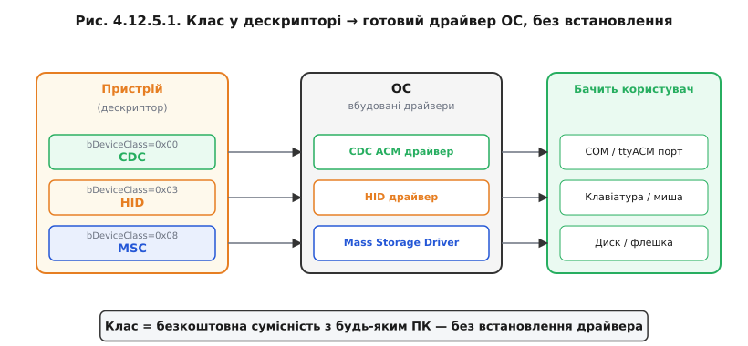
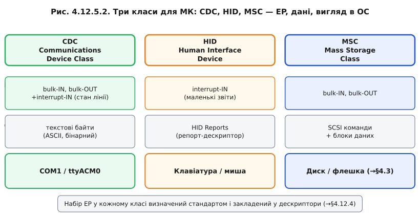
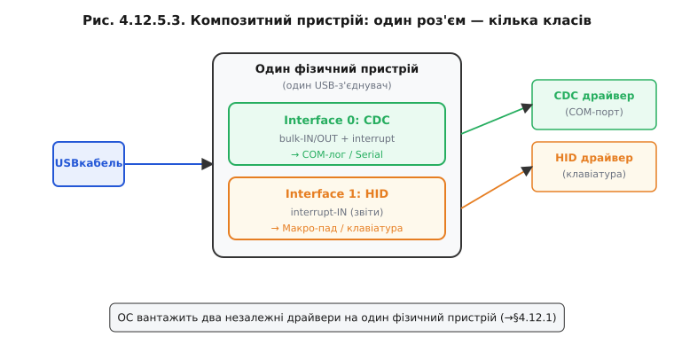

# Класи пристроїв: CDC, HID, MSC

Якби кожен виробник обирав власні кінцеві точки, власний формат даних і власний протокол спілкування з хостом, для кожного нового пристрою потрібен був би унікальний драйвер. Інсталяція з диска, пошук у мережі, проблеми сумісності з версіями ОС — знайома картина з кінця 1990-х. USB розв'язав цю проблему класами: визначив кілька стандартних категорій пристроїв із фіксованим набором кінцевих точок і форматом даних, а ОС постачається з вже вбудованими драйверами для кожного класу. Підключили пристрій → ОС побачила код класу у дескрипторі → завантажила вбудований драйвер → все одразу працює.

### Що таке клас і де він оголошений

Код **класу** (class code) зберігається у Device Descriptor або в Interface Descriptor — залежно від архітектури (чи пристрій має один клас, чи він композитний із кількома). Операційна система читає цей код під час [енумерації](book:programming/usb-enumeration) і обирає відповідний вбудований драйвер. Клас визначає не лише драйвер, а й очікуваний набір кінцевих точок і формат трафіку. Тому «зробити клас» означає не просто вписати потрібний байт у дескриптор — треба реалізувати рівно той набір кінцевих точок і той протокол, який описує стандарт класу.



*Рис. CDC → COM-порт; HID → клавіатура/миша; MSC → диск. Без завантаження додаткових драйверів.*

### CDC — віртуальний COM-порт

**CDC** (Communications Device Class) — клас, що дозволяє пристрою виглядати для ОС як звичайний **послідовний порт** (COM-порт у Windows, /dev/ttyACM у Linux). Це найзручніший спосіб для МК «розмовляти текстом» із ПК без власного драйвера.

Те, що раніше давав зовнішній USB-UART-міст (CP210x, CH340) — окремий чип, через який ПК [прошивав](book:programming/flashing) і слухав логи плати, — нативний USB-контролер у ESP32-S2/S3 може робити сам, без зайвого посередника. ESP32 «відкривається» в ОС новим COM-портом так само, як колись відкривався міст. З погляду коду на ПК нічого не змінюється.

Набір кінцевих точок для CDC: **bulk-IN** і **bulk-OUT** (потік даних) плюс **interrupt-IN** (для сигналізації про стан лінії — CTS, DCD тощо). Саме тому COM-порт через CDC підходить для передачі даних довільного розміру, де важлива цілісність, але не жорсткий реальний час.

### HID — людино-машинний інтерфейс

**HID** (Human Interface Device) — клас для пристроїв взаємодії людини з комп'ютером: клавіатур, мишей, геймпадів, сенсорних екранів, графічних планшетів. Ключова особливість HID — **report descriptor**: окрема структура (не частина стандартних дескрипторів), яка описує формат «звітів» — пакетів даних, якими пристрій спілкується з хостом. Завдяки report descriptor'у хост може розуміти значення кожного байта у звіті без прив'язки до конкретного виробника.

ОС приймає будь-який HID-пристрій без встановлення додаткового драйвера, тому клас HID — найпростіший спосіб зробити ESP32 клавіатурою, мишею або ігровим контролером.

> ⚙️ **HID-звіти: МК прикидається клавіатурою (макро-пад)** — [`r12-s5-a-hid-reports.md`]: як описати report descriptor, щоб ОС побачила нашу плату як стандартну клавіатуру; мінімальний C-фрагмент для відправки натискань клавіш.

### MSC — накопичувач

**MSC** (Mass Storage Class) — клас для пристроїв зберігання даних: флешок, зовнішніх дисків, карт пам'яті. Поверх USB MSC пристрій реалізує підмножину команд **SCSI** — стандарту, що жив ще до USB і визначає операції читання/запису блоків, отримання інформації про диск тощо. Операційна система бачить такий пристрій як звичайний диск і монтує його файлову систему.

MSC цікавий тим, що ESP32 з [SD-карткою](book:electronics/sd-card) може надати ПК доступ до цієї картки як до знімного диска — без жодного додаткового програмного забезпечення. Це зручно для завантаження даних або оновлення конфігураційних файлів без термінального з'єднання.



*Рис. Кожен клас — свій набір [кінцевих точок](book:programming/usb-endpoints) і свій вигляд у ОС.*

### Композит і чому це потужно

Один фізичний пристрій може нести кілька класів-інтерфейсів одночасно — це [**композитний пристрій**](book:programming/usb-overview) (composite device). Наприклад, ESP32 може одночасно відкриватися як CDC-порт (для логів і команд) і як HID-клавіатура (макро-пад). Операційна система завантажує два незалежні драйвери для одного фізичного з'єднання. Для кінцевого пристрою — один кабель, а за ним — цілий арсенал функцій.



*Рис. Interface 0 = CDC (COM-лог), Interface 1 = HID (макро-пад). ОС бачить два незалежні пристрої.*

> 📜 **BadUSB і Rubber Ducky** — [`r12-s5-history-badusb.md`]: коли клас HID без необхідності драйвера стає зброєю; чому «безневинна» флешка може ввести команди адміністратора; що з цим робити з боку захисту.

**Worked-приклад: чому ваша плата — це COM-порт**

Мінімальна конфігурація CDC у стилі TinyUSB/ESP-IDF:

```c
/* Клас CDC у дескрипторі інтерфейсу */
/* Interface 0: CDC Communication Interface */
uint8_t const desc_configuration[] = {
    /* Config descriptor */
    9, TUSB_DESC_CONFIGURATION,
    U16_TO_U8S_LE(67), /* wTotalLength */
    2,                  /* bNumInterfaces: 2 (CDC = 2 інтерфейси) */
    1,                  /* bConfigurationValue */
    0, 0x80, 250,       /* iConfiguration, bmAttributes, bMaxPower=500mA */

    /* Interface Association: CDC */
    8, TUSB_DESC_INTERFACE_ASSOCIATION,
    0, 2,               /* bFirstInterface=0, bInterfaceCount=2 */
    TUSB_CLASS_CDC, 2, 0, 0,   /* клас CDC, підклас Abstract Control Model */

    /* Interface 0: CDC Control */
    9, TUSB_DESC_INTERFACE,
    0, 0, 1,            /* номер=0, alt=0, EP=1 */
    TUSB_CLASS_CDC, 2, 0, 0,   /* bInterfaceClass=CDC(0x02) */

    /* EP interrupt-IN для управління CDC */
    7, TUSB_DESC_ENDPOINT,
    0x81,               /* EP 1 IN */
    TUSB_XFER_INTERRUPT, U16_TO_U8S_LE(8), 16,

    /* Interface 1: CDC Data */
    9, TUSB_DESC_INTERFACE,
    1, 0, 2,            /* номер=1, alt=0, EP=2 */
    TUSB_CLASS_CDC_DATA, 0, 0, 0,

    /* EP 2 OUT (bulk, дані від хоста) */
    7, TUSB_DESC_ENDPOINT, 0x02, TUSB_XFER_BULK, U16_TO_U8S_LE(64), 0,
    /* EP 2 IN  (bulk, дані до хоста) */
    7, TUSB_DESC_ENDPOINT, 0x82, TUSB_XFER_BULK, U16_TO_U8S_LE(64), 0,
};
/* ОС побачить новий COM / ttyACM пристрій */
```

> 🔧 **Навіщо це**: клас — це обіцянка «для мене вже є готовий драйвер». Обираючи CDC, HID або MSC, ви отримуєте сумісність з будь-яким ПК безкоштовно. Це головна причина, чому USB на МК такий зручний: не потрібно писати й підтримувати власний драйвер для ОС, достатньо правильно заповнити дескриптори.

---
