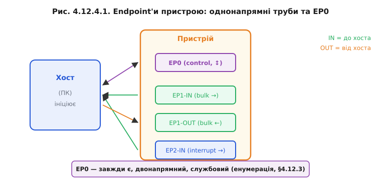
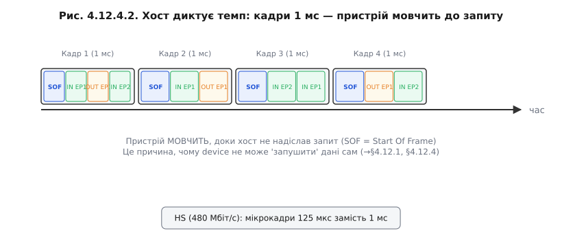

# Кінцеві точки й типи передач

Після [енумерації](book:programming/usb-enumeration) хост знає, які канали є в пристрої. Лишається зрозуміти, що такий канал являє собою фізично і чому для різних завдань — аудіо, клавіатура, флешка — використовуються різні типи каналів із принципово різними гарантіями.

### Кінцева точка — труба в один бік

**Кінцева точка** (endpoint, EP) — це однонапрямний буфер у пристрої. Кожна кінцева точка має номер (0–15) і напрям: **IN** означає «від пристрою до хоста», **OUT** — «від хоста до пристрою». Терміни «IN» і «OUT» завжди беруться з погляду хоста.

EP0 — виняток: він двонапрямний і службовий (control); через нього йде вся [енумерація](book:programming/usb-enumeration). Пара IN-EP і OUT-EP з однаковим номером (наприклад, EP1-IN і EP1-OUT) часто утворює логічний **канал**.



*Рис. Хост ліворуч, пристрій праворуч. EP0 двонапрямний (службовий канал [енумерації](book:programming/usb-enumeration)). EP1-IN/OUT — bulk; EP2-IN — interrupt.*

### Хост диктує темп: кадри 1 мс

USB-шина Full-Speed розбита на **кадри** (frame) тривалістю **1 мс** кожен. Хост починає кожен кадр спеціальним пакетом SOF (Start Of Frame) і далі по черзі опитує потрібні кінцеві точки — надсилає запит IN або дані OUT. Пристрій мовчить, поки хост не звернувся до нього. Тому пристрій «реактивний» — він не може ініціювати передачу даних самостійно, навіть якщо в нього є щось термінове. Це пряме наслідування [архітектури «один головний»](book:programming/usb-overview), на якій збудована вся шина.



*Рис. SOF відкриває кожен кадр; пристрій відповідає лише на запит хоста. Деталі — ⚙️ r12-s4-a-frames.*

> ⚙️ **Розклад шини: кадри 1 мс і чому миша 125 Гц** — [`r12-s4-a-frames.md`]: як саме хост розподіляє пропускну здатність кадру між різними кінцевими точками і чому interrupt-EP опитується найчастіше.

### Чотири типи передач — ядро теми

Усі кінцеві точки, крім EP0, можуть належати до одного з трьох нестандартних типів. Разом із control на EP0 маємо чотири характери трафіку:

**Control** — двофазні (або трифазні) транзакції через EP0; гарантована доставка з повтором при помилці; низька пропускна здатність, але надійність на 100%. Використовується виключно для службового обміну: GET_DESCRIPTOR, SET_ADDRESS, команди класу. Хост резервує до 10–20% смуги кадру для control-трафіку.

**Bulk** — передача великих обсягів без гарантії часу доставки, але з гарантією цілісності: якщо пакет не доставлено, його надсилають повторно. Bulk займає ту смугу, що лишилась після control, interrupt й isochronous. Типовий приклад — USB-флешка ([клас MSC](book:programming/usb-device-classes)) і CDC-порт для обміну текстом або двійковими даними. Для фонового об'ємного обміну, де важлива цілісність, а не миттєвість, bulk — ідеальний вибір.

**Interrupt** — невеликі порції даних із гарантованою **максимальною затримкою**. Хост опитує interrupt-EP не рідше, ніж задано параметром `bInterval` у дескрипторі. Назва «interrupt» може плутати: це не [апаратне переривання мікропроцесора](book:programming/interrupts) — це лише гарантія, що хост опитає кінцеву точку у визначений інтервал. Типові застосування: миші, клавіатури, HID-пристрої будь-якого роду.

**Isochronous** — потік реального часу. Хост гарантує **фіксовану смугу** в кожному кадрі, але відмовляється від повторних передач: якщо пакет загублено, його не повторюють, просто пропускають. Чому? Тому що для аудіо або відео запізніла порція гірша за відсутню: краще виникне легкий клацок у звуці, ніж буфер переповниться застарілими семплами. Типові застосування: USB-мікрофони, колонки, ізохронні камери.


*Рис. Матриця: Control і Bulk гарантують доставку; Interrupt і Isochronous — час. Тільки Isochronous не має ретрансмісії.*

### Скільки кінцевих точок має типовий пристрій

Набір кінцевих точок пристрою залежить від його класу. Для орієнтиру:

| Клас   | EP0  | Додаткові кінцеві точки            |
|--------|------|------------------------------------|
| CDC    | ✓    | bulk-IN, bulk-OUT, interrupt-IN    |
| HID    | ✓    | interrupt-IN (і interrupt-OUT опц) |
| MSC    | ✓    | bulk-IN, bulk-OUT                  |

**Worked-приклад: чому миша «125 Гц»**

У дескрипторі interrupt-EP є поле `bInterval` — мінімальний інтервал між опитуваннями у мілісекундах (для Full-Speed). Частота опитування = 1000 / bInterval.

```
Звичайна USB-миша:
  bInterval = 8 мс
  Частота опитування = 1000 / 8 = 125 Гц

«Gaming» миша 1000 Гц:
  bInterval = 1 мс
  Частота опитування = 1000 / 1 = 1000 Гц

Компроміс:
  Чим менший bInterval, тим менша затримка руху курсора.
  Але хост мусить виділити слот у КОЖНОМУ кадрі (кожні 1 мс),
  що збільшує накладні витрати на шині й у драйвері.
```


*Рис. bInterval=8 мс → 125 опит./с; bInterval=1 мс → 1000 опит./с. Частіше = менша затримка, більше навантаження.*

> 🔧 **Навіщо це**: тип передачі — інженерне рішення, яке приймається при розробці дескриптора. Якщо взяти bulk для аудіо (де потрібна гарантована смуга), отримаєте джиттер і підстрибування звуку. Якщо взяти isochronous для команд керування (де потрібна гарантована доставка), втрачені команди нікуди не підуть. Вибір типу передачі — це обіцянка щодо часу й надійності.

Кінцеві точки задають канали, а типи передач — характер трафіку в кожному. Але якби кожен пристрій вимагав свого драйвера, USB не злетів би; від цього рятують стандартні [класи пристроїв](book:programming/usb-device-classes).

---
