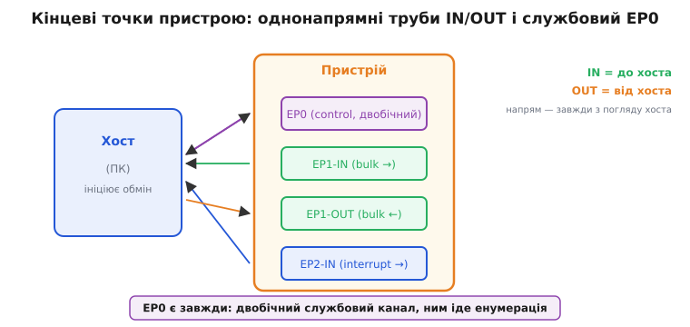
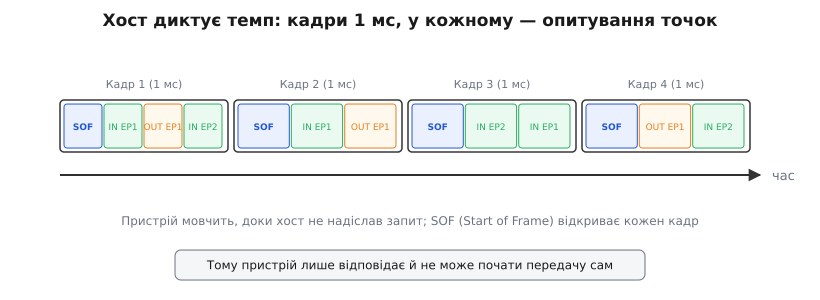
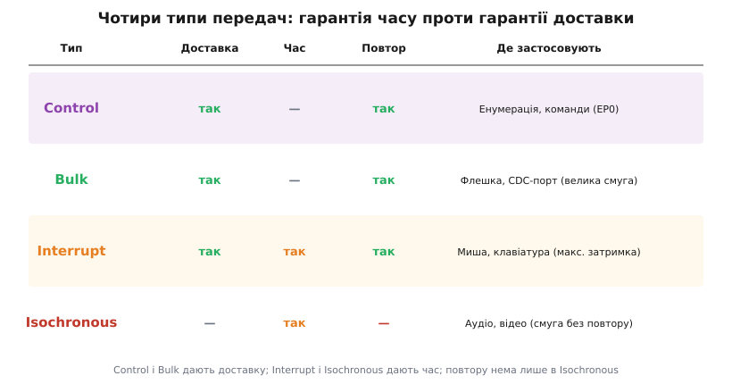
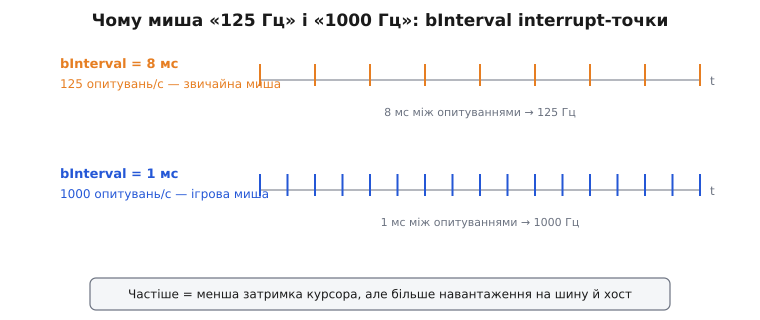

# Кінцеві точки USB

Коли хост спілкується з USB-пристроєм, він шле дані не «в пристрій» загалом, а в конкретний буфер усередині нього. Такий буфер називають **кінцевою точкою** (англ. *endpoint* — «кінець» каналу, бо це той кінець, до якого хост звертається). Розібратися, що така точка являє собою фізично і чому для аудіо, клавіатури й флешки потрібні точки з принципово різними гарантіями, — і означає зрозуміти, як влаштований обмін на шині.

### Кінцева точка — труба в один бік

**Кінцева точка** (endpoint, EP) — це однонапрямний буфер у пристрої. Кожна кінцева точка має номер (0–15) і напрям. **IN** означає «від пристрою до хоста», **OUT** — «від хоста до пристрою». Обидва слова беруться **з погляду хоста**: IN — це те, що входить у хост; OUT — те, що з нього виходить. Якщо тримати цю систему відліку в голові, плутанини не буде ніколи.

Чому буфер однонапрямний, а не «дріт у два боки»? Бо так простіше і для заліза, і для логіки: кожна точка має власну адресу (номер + напрям), власний стан і власний буфер у пам'яті контролера. Хочеш обмін в обидва боки — заводь дві точки. Пара IN-EP і OUT-EP з однаковим номером (наприклад, EP1-IN і EP1-OUT) часто й утворює один логічний **канал** до пристрою.

EP0 стоїть осібно: він **двонапрямний** і службовий (тип control). Через нього хост робить [енумерацію](book:programming/usb-enumeration) — читає дескриптори, призначає адресу, вмикає конфігурацію. EP0 є **в кожного** USB-пристрою без винятку: поки решта точок ще не оголошені, хост уже мусить мати канал, щоб про них спитати.



*Хост ліворуч, пристрій праворуч. EP0 двонапрямний — це канал [енумерації](book:programming/usb-enumeration). EP1-IN/OUT — bulk-канал; EP2-IN — interrupt. Напрями IN/OUT підписані з погляду хоста.*

### Хост диктує темп: кадри 1 мс

USB-шина Full-Speed розбита на **кадри** (англ. *frame*) тривалістю **1 мс** кожен. Хост починає кожен кадр спеціальним пакетом SOF (Start Of Frame), а далі по черзі опитує потрібні кінцеві точки — надсилає запит IN або дані OUT. Пристрій мовчить, доки хост до нього не звернувся. Тому пристрій **реактивний**: він не може почати передачу сам, навіть якщо має щось термінове, — лише відповідає на запит. Це прямий наслідок [архітектури «один головний»](book:programming/usb-overview), на якій збудована вся шина: ініціатива завжди в хоста.



*SOF відкриває кожен кадр; пристрій відповідає лише на запит хоста. Як саме хост розподіляє час кадру між точками — розбирає вставка про розклад шини.*

> ⚙️ Як хост вкладає опитування в час кадру і звідки береться «125 Гц» миші — окрема алгоритмічна вставка. [Розклад шини: кадри 1 мс і чому миша 125 Гц](book:programming/usb-endpoints/proj-frames.md).

### Чотири типи передач — ядро теми

Будь-яка кінцева точка, крім EP0, належить до одного з трьох типів; разом із control на EP0 маємо **чотири характери трафіку**. Кожен тип — це інженерний компроміс між двома обіцянками, які не можна дати одночасно: **гарантія доставки** (загублений пакет повторюють) і **гарантія часу** (точку обслужать у відведене вікно). Звідси й чотири варіанти.

**Control** — двофазні або трифазні транзакції через EP0. Гарантована доставка з повтором при помилці; пропускна здатність невелика, зате надійність повна. Використовується для службового обміну: GET_DESCRIPTOR, SET_ADDRESS, команди класу. Специфікація резервує **10% часу кожного кадру** саме під control — щоб службовий канал ніколи не лишився без смуги, хоч би як шину завантажили інші передачі.

**Bulk** — передача великих обсягів **без гарантії часу**, зате з гарантією цілісності: не доставлений пакет надсилають повторно. Bulk бере ту смугу, що лишилась після control, interrupt та isochronous; якщо шина зайнята, дані «течуть» повільно, але дійдуть усі. Типовий приклад — USB-флешка ([клас MSC](book:programming/usb-device-classes)) і CDC-порт для обміну текстом чи двійковими даними. Для фонового об'ємного обміну, де важлива цілісність, а не миттєвість, bulk — ідеальний вибір.

**Interrupt** — невеликі порції з гарантованою **максимальною затримкою**. Хост опитує interrupt-точку не рідше, ніж задано полем `bInterval` у дескрипторі. Назва збиває з пантелику: це **не** [апаратне переривання мікропроцесора](book:programming/interrupts) — пристрій нікого не «перериває» по дроту. Це лише обіцянка хоста опитати точку у визначений інтервал. Типові застосування: миші, клавіатури, HID-пристрої будь-якого роду.

**Isochronous** (грец. *isos* — «рівний», *chronos* — «час»; тобто «рівночасний») — потік реального часу. Хост гарантує **фіксовану смугу** в кожному кадрі, але відмовляється від повторів: загублений пакет не надсилають удруге, його просто пропускають. Чому так? Для аудіо чи відео запізніла порція гірша за відсутню: краще ледь чутний клацок у звуці, ніж переповнений буфер застарілих семплів. Типові застосування: USB-мікрофони, колонки, камери.



*Control і Bulk гарантують доставку; Interrupt і Isochronous — час. Повтору немає лише в Isochronous — це ціна за сталу смугу.*

### Скільки даних поміщається в один пакет

У дескрипторі кожної точки є поле `wMaxPacketSize` — скільки байтів вона приймає чи віддає за одну транзакцію. На Full-Speed стелі різні саме за типом, і це не дрібниця, а пряма межа пропускної здатності:

```
Тип            wMaxPacketSize (Full-Speed, максимум)
control        8, 16, 32 або 64 байти
bulk           8, 16, 32 або 64 байти
interrupt      до 64 байтів
isochronous    до 1023 байтів
```

Звідси видно логіку: isochronous дозволяє найбільший пакет, бо переганяє потік (звук, відео) і мусить вкласти багато семплів у єдине вікно кадру. Bulk обмежений 64 байтами на пакет, тому великий файл їде сотнями послідовних транзакцій — повільно, зате надійно. Якщо передачу більшу за `wMaxPacketSize` хост б'є на пакети повного розміру, а останній (коротший за максимум) сигналить про кінець.

### Канал між хостом і точкою — pipe

Коли драйвер на хості хоче говорити з конкретною точкою, він відкриває до неї **канал** (англ. *pipe* — «труба»). Канал — це логічна асоціація «драйвер хоста ↔ кінцева точка пристрою»; він успадковує тип і напрям своєї точки. EP0 обслуговує особливий канал — **control pipe** (його ще звуть «default pipe»), який існує від моменту під'єднання; решта каналів хост відкриває після конфігурації пристрою. Практично «канал» і «кінцева точка» в розмові часто плутають, але різниця проста: точка живе **в пристрої**, а канал — це **зв'язок** хоста з нею.

### Скільки кінцевих точок має типовий пристрій

Набір точок залежить від класу пристрою. Для орієнтиру:

| Клас   | EP0  | Додаткові точки                    |
|--------|------|------------------------------------|
| CDC    | ✓    | bulk-IN, bulk-OUT, interrupt-IN    |
| HID    | ✓    | interrupt-IN (і interrupt-OUT опц.)|
| MSC    | ✓    | bulk-IN, bulk-OUT                  |

Номери точок (1, 2, 3…) призначає розробник пристрою у дескрипторах — вони довільні в межах 1–15, аби лиш не повторювалися в одному напрямі. Нуль зарезервований під EP0 завжди.

**Worked-приклад: чому миша «125 Гц»**

У дескрипторі interrupt-точки поле `bInterval` задає мінімальний інтервал між опитуваннями в мілісекундах (для Full-Speed). Частота опитування = 1000 / bInterval.

```c
// Фрагмент дескриптора endpoint у прошивці (TinyUSB)
.bEndpointAddress = 0x81,        // EP1, напрям IN (старший біт = 1)
.bmAttributes     = 0x03,        // тип = interrupt
.wMaxPacketSize   = 8,           // 8 байтів у звіті миші
.bInterval        = 8,           // 8 кадрів = 8 мс

// Звідси темп звітів:
//   звичайна миша:  bInterval = 8  →  1000 / 8 = 125 Гц
//   ігрова миша:    bInterval = 1  →  1000 / 1 = 1000 Гц
```

Компроміс прямий: менший `bInterval` — менша затримка руху курсора, але хост мусить виділяти цій точці слот **у кожному** кадрі (кожні 1 мс), а це більше навантаження на шину й на драйвер. Для давача, що міняється рідко, такий темп — марна трата смуги.



*bInterval = 8 мс дає 125 опитувань/с; bInterval = 1 мс — 1000. Частіше означає меншу затримку, але більше навантаження.*

> 🔧 **Навіщо це.** Тип передачі — інженерне рішення, яке закладають у дескриптор при розробці пристрою. Візьмеш bulk для аудіо (де потрібна стала смуга) — отримаєш джиттер і підстрибування звуку. Візьмеш isochronous для команд керування (де потрібна доставка) — втрачені команди зникнуть безслідно. Вибір типу точки — це обіцянка щодо часу й надійності, і змінити її після випуску прошивки можна лише новим дескриптором.

Кінцеві точки задають канали, а типи передач — характер трафіку в кожному. Та якби кожен пристрій вимагав свого драйвера, USB не злетів би; від цього рятують стандартні [класи пристроїв](book:programming/usb-device-classes), де набір точок і формат даних уже домовлені наперед.
