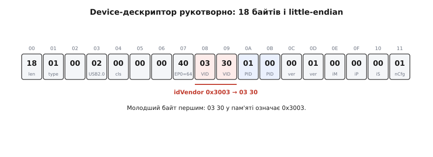
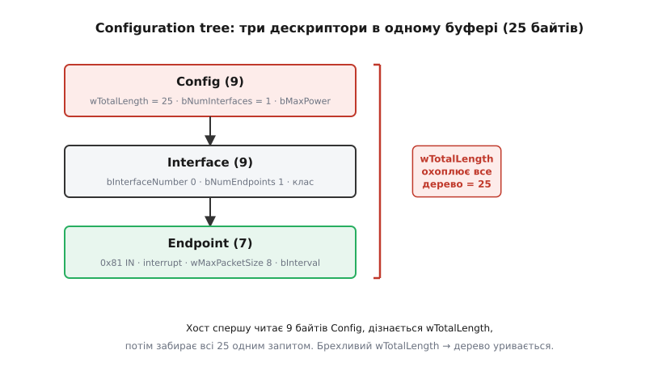

# ⚙️ Мінімальний дескриптор своїми руками: байти, які бачить хост

> ⚙️ **Про що це.** Під час [енумерації](book:programming/usb-enumeration) хост надсилає пристрою запит GET_DESCRIPTOR і за отриманими дескрипторами призначає драйвер. Розгорнемо ці дескриптори у реальні байти і напишемо їх власноруч — саме так, як їх віддає прошивка ESP32. Жодного ASCII, жодної «назви пристрою» — лише пакет чисел за жорстким форматом; зрозуміти ці 18+ байтів означає зрозуміти, як хост узагалі дізнається, що саме до нього під'єднали.

## Задача

Пристрій щойно фізично під'єднали: підтяжка D+ повідомила шину про [Full Speed](book:programming/usb-physical), хост скинув шину імпульсом Reset і тепер надсилає перший керувальний запит на адресу 0 — GET_DESCRIPTOR, Device. Прошивка мусить відповісти байтами. Не будь-якими — рівно в тому форматі, якого очікує драйвер хоста. Помилка в одному полі довжини, одна перестановка байтів — і пристрій отримує статус «Unknown device» або взагалі не завершує енумерацію.

Фокус цієї вставки вузький: не весь USB-стек, а саме «рукотворний» вміст двох ключових дескрипторів — Device і Configuration-дерево. Мета — щоб читач бачив кожен байт і знав, звідки він узявся. [Типи передач](book:programming/usb-endpoints) і [USB-класи](book:programming/usb-device-classes) (CDC, HID) лишаємо осторонь; тут — лише кістяк.

## Ідея: дескриптор — це TLV-пакет із жорстким форматом

Кожен дескриптор починається однаково: перший байт — `bLength` (скільки байтів у цій структурі), другий — `bDescriptorType` (що це за структура). Це самоописний потік: хост читає перший байт, знає довжину, відрізає рівно стільки, дивиться другий байт — знає тип. Це та сама знайома ідея TLV (type-length-value): структура сама розповідає про себе без зовнішньої схеми.

Усі багатобайтові числа — little-endian: молодший байт іде першим. Це джерело помилок номер один. Значення `bcdUSB = 0x0200` (USB 2.0) лягає в пам'ять як два байти `0x00 0x02`. Поля `idVendor` і `idProduct` — так само: значення `0x3003` передається як `0x03 0x30`. Переплутав порядок — хост бачить інший VID і не знаходить потрібного драйвера.

> 🔧 **Навіщо це: чому байти, а не структура C.** На хост по проводу іде потік байтів, тож порядок і розмір кожного поля фіксовані специфікацією, а не компілятором. Структура C із тими самими полями може мати внутрішній паддінг або інше вирівнювання й «поїхати» на деяких платформах. Саме тому дескриптори описують або як сирий масив байтів, або як `__attribute__((packed))` struct. Розуміючи байти, розумієш, що насправді летить у пакеті.

Поле `bcdUSB` — двійково-десяткова (BCD) версія протоколу: `0x0200` означає «USB 2.0», `0x0110` — «USB 1.1». Так само `bcdDevice` позначає версію прошивки самого пристрою. Обидва числа — little-endian-пари.

Пара `idVendor`/`idProduct` — це те, за чим ОС шукає драйвер. VID (Vendor ID) видає організація USB-IF за гроші, тому в аматорських проектах зазвичай беруть VID чипмейкера (Espressif) або тестові значення. Той самий «ідентифікатор пристрою», про який хост дізнається при [енумерації](book:programming/usb-enumeration), тут постає конкретними байтами в конкретних позиціях.


*18 байтів Device-дескриптора стрічкою: зони полів, зміщення й приклад little-endian на idVendor — значення 0x3003 лягає як пара 03 30.*

Device-дескриптор не містить усього. Він лише повідомляє: «конфігурацій у мене N». Решту — інтерфейси, кінцеві точки — хост забирає окремим запитом GET_DESCRIPTOR(Configuration), і у відповідь надходить ціле дерево, склеєне в один буфер: Config → Interface → Endpoint(и). Звідси й назва «Configuration tree».

Зберемо обидва дескриптори вручну як `static const` масиви — рівно так їх кладе прошивка ESP32 (TinyUSB/ESP-IDF), тільки тут кожен байт підписаний.

## Код: два дескриптори байт-у-байт (реальний C для ESP32)

Нижче — те, що прошивка повертає у відповідь на два запити хоста; коментар біля кожного поля «перекладає» байт із числа в зміст.

**Блок 1 — Device Descriptor (18 байтів)**

```c
// Device Descriptor — відповідь на GET_DESCRIPTOR(Device, 0)
static const uint8_t desc_device[18] = {
    18,           // bLength          = 18 (розмір цього дескриптора)
    0x01,         // bDescriptorType  = DEVICE (0x01)
    0x00, 0x02,   // bcdUSB           = 0x0200 → USB 2.0 (LE: low, high)
    0x00,         // bDeviceClass     = 0x00 (клас задається в інтерфейсі)
    0x00,         // bDeviceSubClass  = 0
    0x00,         // bDeviceProtocol  = 0
    64,           // bMaxPacketSize0  = 64 (EP0 max packet, Full Speed)
    0x03, 0x30,   // idVendor         = 0x3003 (LE: low, high) — тестовий / Espressif
    0x01, 0x00,   // idProduct        = 0x0001 (LE: low, high)
    0x00, 0x01,   // bcdDevice        = 0x0100 → версія прошивки 1.0 (LE: low, high)
    0x00,         // iManufacturer    = 0 (рядкового дескриптора нема)
    0x00,         // iProduct         = 0
    0x00,         // iSerialNumber    = 0
    1,            // bNumConfigurations = 1
};
```

Зверніть увагу на `idVendor`: значення `0x3003` лягає як `0x03 0x30` — молодший байт першим. Саме так це показано на фігурі вище. Поле `bMaxPacketSize0 = 64` — особливе: хост читає перші 8 байтів Device-дескриптора ще до того, як дізнається повний розмір структури, і саме за `bMaxPacketSize0` налаштовує EP0 для подальшого обміну.

**Блок 2 — Configuration tree (9 + 9 + 7 = 25 байтів)**

```c
// Configuration + Interface + Endpoint — відповідь на GET_DESCRIPTOR(Configuration, 0)
// Три дескриптори склеєні в один буфер; хост читає все за один запит
static const uint8_t desc_config[] = {

    // ── Config Descriptor (9 байтів) ──────────────────────────────────────
    9,            // bLength              = 9
    0x02,         // bDescriptorType      = CONFIGURATION (0x02)
    0x19, 0x00,   // wTotalLength         = 25 (LE: 0x19, 0x00) = 9+9+7
    1,            // bNumInterfaces       = 1
    1,            // bConfigurationValue  = 1 (індекс конфігурації)
    0x00,         // iConfiguration       = 0 (рядка нема)
    0x80,         // bmAttributes         = 0x80 (bus-powered, без remote-wakeup)
    50,           // bMaxPower            = 50 × 2 мА = 100 мА (живлення по USB)

    // ── Interface Descriptor (9 байтів) ────────────────────────────────────
    9,            // bLength              = 9
    0x04,         // bDescriptorType      = INTERFACE (0x04)
    0,            // bInterfaceNumber     = 0
    0,            // bAlternateSetting    = 0
    1,            // bNumEndpoints        = 1 (крім EP0)
    0xFF,         // bInterfaceClass      = 0xFF vendor-specific (клас інтерфейсу)
    0x00,         // bInterfaceSubClass   = 0
    0x00,         // bInterfaceProtocol   = 0
    0x00,         // iInterface           = 0

    // ── Endpoint Descriptor (7 байтів) ─────────────────────────────────────
    7,            // bLength              = 7
    0x05,         // bDescriptorType      = ENDPOINT (0x05)
    0x81,         // bEndpointAddress     = 0x81 (IN, endpoint 1)
    0x03,         // bmAttributes         = 0x03 (interrupt; тип передачі)
    0x08, 0x00,   // wMaxPacketSize       = 8 (LE: low, high)
    10,           // bInterval            = 10 мс (інтервал опитування)
};
```

Поле `wTotalLength = 25` — ключове: хост читає Config-дескриптор першого разу лише на 9 байтів, дізнається `wTotalLength`, потім робить ще один запит вже на всі 25 байтів і отримує ціле дерево. Якщо `wTotalLength` не відповідає фактичному розміру буфера, хост або урізає дерево, або отримує сміттєві байти — інтерфейс і кінцева точка «зникають».


*Дерево конфігурації в одному буфері: Config → Interface → Endpoint і охоплювальна роль wTotalLength, яке хост читає першим.*

**Колбеки TinyUSB — де масиви «віддаються» хосту**

```c
// TinyUSB викликає ці функції під час енумерації;
// ми лише повертаємо вказівник на static const буфер у Flash

uint8_t const *tud_descriptor_device_cb(void) {
    return desc_device;
}

uint8_t const *tud_descriptor_configuration_cb(uint8_t index) {
    (void)index;        // у нас одна конфігурація
    return desc_config;
}
```

Це функції, які USB-стек викликає під час енумерації. Ми лише повертаємо байти; NRZI-кодування, біт-стафінг і квитування виконує [апаратний USB-блок](book:programming/esp32-usb) ESP32-S2/S3 разом зі стеком на [фізичному рівні шини](book:programming/usb-physical).

## Складність і пастки на МК

- **Little-endian усюди.** Кожне `w…`/`bcd…` поле — два байти молодшим уперед. Переплутав — хост бачить інший VID або версію. Найпоширеніша причина помилки «Unknown USB device» у диспетчері пристроїв.

- **`bLength` і `wTotalLength` мусять збігатися з фактом.** Хост довіряє цим числам і ріже буфер саме за ними. Брехливий `wTotalLength` — урізане дерево, відсутня кінцева точка, непрацездатний інтерфейс. У нашому прикладі: 9 + 9 + 7 = 25, `wTotalLength = 0x19`.

- **Перший контрольний запит іде на `bMaxPacketSize0`.** Хост спершу читає лише перші 8 байтів Device-дескриптора, щоб дізнатися розмір пакета endpoint 0, і лише після цього повторює запит на всі 18. Якщо `bMaxPacketSize0` неправильний — друга фаза читання ламається. Це і є той «перший байт, який бачить хост» у заголовку вставки.

- **Рядкові дескриптори — пастка кодування.** `iManufacturer/iProduct = 0` означає «рядків нема» і є цілком допустимим для мінімального пристрою. Щойно даєш ненульовий індекс — мусиш підготувати String Descriptor у кодуванні UTF-16LE з власним `bLength`. Забув — менеджер пристроїв показує порожнечу або помилку. Мінімальний варіант без рядків — найбезпечніший старт.

- **`const` і розташування в пам'яті.** Тримай дескриптори `static const` — вони лягають у `.rodata`/Flash, не їдять RAM і не псуються між викликами. Передати вказівник на них у колбек безпечно: вони живуть увесь час роботи прошивки. Не складай дескриптор на стеку функції — повернеш «висячий» вказівник на знищені дані.

- **`bMaxPower` — не косметика.** Значення × 2 мА мусить відповідати реальному споживанню пристрою. Хост (особливо через хаб) може відмовити, якщо пристрій запитує більше, ніж порт здатен дати; детально — у [живленні по USB](book:programming/usb-power).

- **Не плутати рівні.** Ці байти — лише вміст відповіді. Саму передачу — квитування, повтори, кадри по 1 мс — виконує [апаратний USB-блок](book:programming/esp32-usb) ESP32-S2/S3 разом зі стеком, а самі [типи передач](book:programming/usb-endpoints) описано окремо. Наше завдання тут — правильно заповнити буфер.
