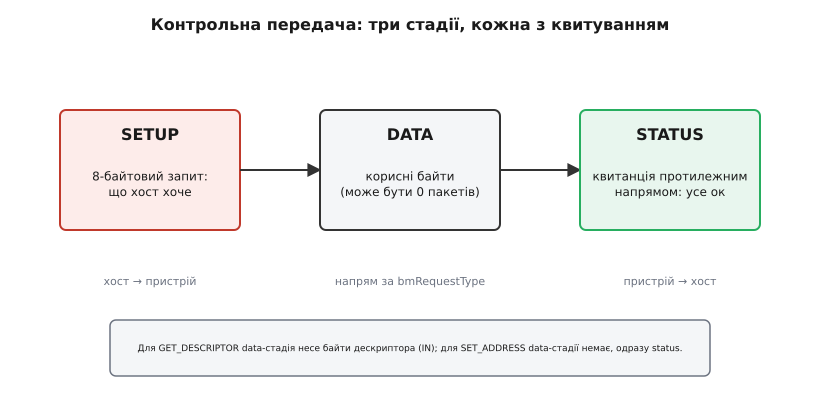
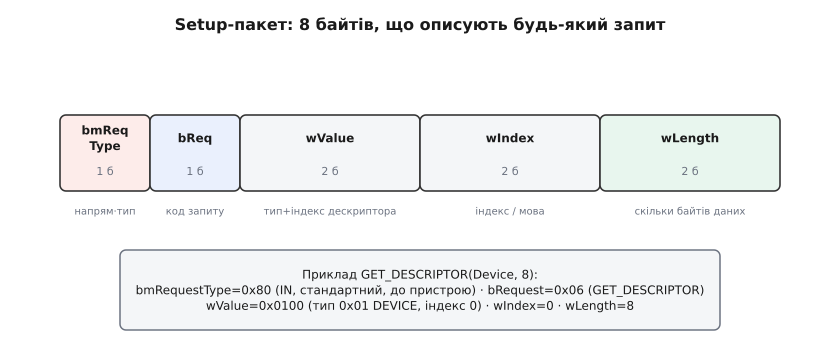

# Енумерація USB — докладно

Базова картина енумерації проста: хост скидає пристрій, опитує його на адресі 0, призначає власну адресу, читає дескриптори, вмикає конфігурацію. Але між цими кроками ховається механізм, без якого жоден із них не працює, — **контрольна передача** (control transfer). Кожен запит енумерації — це не один пакет, а маленька транзакція з кількох стадій, із власним квитуванням і власними правилами на кожному кроці. Розберімо цей механізм до дна: з чого складається setup-пакет, як влаштовані три стадії передачі, які точні значення летять по дроту на кожному кроці знайомства, скільки часу хост на що дає і коли пристрій змушений енумеруватися повторно.

Усе це їде через [кінцеву точку 0](topic:programming/usb-endpoints) — двонапрямний службовий канал типу control, єдиний, що працює ще до призначення адреси.

## Контрольна передача: setup → data → status

[Тип передачі control](topic:programming/usb-endpoints) — особливий серед чотирьох: лише він має жорстко визначену внутрішню структуру з трьох **стадій**. Решта типів (bulk, interrupt, isochronous) — це просто потік пакетів даних; control же завжди починається з запиту фіксованого формату.

Три стадії такі:

- **Setup-стадія.** Хост надсилає рівно 8 байтів — *setup-пакет*, що повністю описує запит: що хост хоче, у який бік підуть дані і скільки їх буде. Ці 8 байтів — серце всього механізму, і нижче ми розберемо кожне поле.
- **Data-стадія.** Якщо запит передбачає дані, вони йдуть тут — одним або кількома пакетами, у напрямі, який задав setup-пакет. Деякі запити (як-от `SET_ADDRESS`) даних не несуть зовсім — тоді цієї стадії немає.
- **Status-стадія.** Протилежний бік надсилає коротку квитанцію: запит виконано (або сталася помилка). Напрям квитанції завжди протилежний напряму даних — це дає обом сторонам однозначно зрозуміти, що транзакція завершена.



*Setup завжди йде від хоста; data-стадія може бути відсутня; status-квитанція йде протилежним напрямом до даних. Так обидві сторони однозначно знають, що транзакцію закрито.*

Чому саме три стадії, а не один пакет «запит-відповідь»? Бо хост і пристрій мусять погодити дві незалежні речі: *що* передається (це setup) і *чи дійшло* (це status). Якби квитанція їхала в тому ж напрямі, що й дані, пристрій не зміг би повідомити хост про помилку в data-стадії, яку сам же й приймав. Розведення напрямів робить кожну транзакцію самоперевірною.

> 🔧 **Навіщо це.** Коли в логові USB-аналізатора ти бачиш «control transfer» з порожньою data-стадією й одразу status — це не збій, а нормальна форма запитів без даних (`SET_ADDRESS`, `SET_CONFIGURATION`). А от якщо status-стадія приходить зі станом STALL — пристрій відхилив запит: або не підтримує його, або заповнив дескриптор так, що хост попросив несумісне. Уміння читати стадії економить години відлагодження прошивки.

## Анатомія setup-пакета: 8 байтів, що описують усе

Будь-який запит на EP0 починається з тих самих 8 байтів. Їхня структура фіксована специфікацією й однакова для всіх пристроїв:

```c
struct __attribute__((packed)) usb_setup_packet {
    uint8_t  bmRequestType;  /* напрям + тип + отримувач         */
    uint8_t  bRequest;       /* код запиту (GET_DESCRIPTOR тощо)  */
    uint16_t wValue;         /* параметр: часто тип+індекс        */
    uint16_t wIndex;         /* індекс/мова/номер інтерфейсу      */
    uint16_t wLength;        /* скільки байтів даних у data-стадії */
};
```



*Ширина кожного поля — пропорційна його розміру в байтах. Унизу — конкретні значення для запиту перших 8 байтів Device-дескриптора.*

Розберімо поля по черзі.

**bmRequestType** — один байт, спакований із трьох частин:
- старший біт — *напрям даних*: 1 означає IN (пристрій → хост), 0 означає OUT (хост → пристрій);
- два біти — *тип запиту*: стандартний (як усі запити енумерації), специфічний для класу чи для виробника;
- п'ять молодших бітів — *отримувач*: пристрій, інтерфейс чи кінцева точка.

Для `GET_DESCRIPTOR` цей байт дорівнює `0x80`: старший біт 1 (дані йдуть IN, від пристрою), тип стандартний, отримувач — пристрій.

**bRequest** — код самого запиту. Найважливіші під час енумерації:

```
bRequest  Запит              Призначення
0x05      SET_ADDRESS        призначити пристрою адресу
0x06      GET_DESCRIPTOR     прочитати дескриптор
0x09      SET_CONFIGURATION  увімкнути конфігурацію
```

**wValue** — параметр запиту, зміст якого залежить від `bRequest`. Для `GET_DESCRIPTOR` старший байт `wValue` — це *тип дескриптора* (0x01 — Device, 0x02 — Configuration, 0x03 — String), а молодший — *індекс* (який саме з кількох однотипних). Для `SET_ADDRESS` у `wValue` лежить сама нова адреса. Для `SET_CONFIGURATION` — номер конфігурації (`bConfigurationValue`).

**wIndex** — додатковий індекс: номер мови для String-дескрипторів, номер інтерфейсу чи кінцевої точки для запитів, адресованих не пристрою загалом.

**wLength** — скільки байтів хост готовий прийняти (або надіслати) у data-стадії. Саме завдяки цьому полю один і той самий `GET_DESCRIPTOR(Device)` може попросити то 8 байтів, то всі 18: змінюється лише `wLength`.

Зверни увагу: усі двобайтові поля (`wValue`, `wIndex`, `wLength`) — little-endian, молодшим байтом уперед, як і решта чисел у USB.

## Знайомство крок за кроком — із точними значеннями

Тепер пройдімо всю енумерацію ще раз, але вже не словами «хост читає дескриптор», а конкретними setup-пакетами. Це дасть точну картину того, що видно в аналізаторі.

**Крок 0. Під'єднання і reset.** Пристрій підтяжкою на лінії даних повідомив про присутність і швидкість. Хост (точніше — хаб, до якого під'єднано пристрій) витримує паузу на стабілізацію живлення, тоді подає на порт **reset** — утримує лінії D+ і D− у стані SE0 (обидві низькі) щонайменше **10 мс**. Після reset пристрій у стані Default: відповідає на адресу 0, EP0 готовий, решта точок ще ні.

**Крок 1. Перші 8 байтів Device-дескриптора.** Хост шле setup-пакет:

```
bmRequestType = 0x80   // IN, стандартний, до пристрою
bRequest      = 0x06   // GET_DESCRIPTOR
wValue        = 0x0100 // тип 0x01 (DEVICE), індекс 0
wIndex        = 0x0000
wLength       = 0x0008 // лише перші 8 байтів
```

Чому саме 8? Бо хост ще не знає `bMaxPacketSize0` — розміру буфера EP0. А 8 байтів гарантовано вміщуються в один пакет за будь-якого легального розміру EP0 (мінімум — 8). У data-стадії пристрій повертає перші 8 байтів дескриптора, серед яких на зсуві 7 лежить той самий `bMaxPacketSize0`. Тепер хост знає, якими порціями вести подальший обмін.

**Крок 2. Ще один reset.** Багато хостів (зокрема Windows) скидають порт удруге між першим і другим читанням дескриптора. Це історична обережність: гарантувати, що пристрій почне зміну адреси з чистого, передбачуваного стану. Пристрій після цього знову в Default-стані на адресі 0.

**Крок 3. SET_ADDRESS.** Хост призначає адресу — скажімо, 5:

```
bmRequestType = 0x00   // OUT, стандартний, до пристрою
bRequest      = 0x05   // SET_ADDRESS
wValue        = 0x0005 // нова адреса = 5
wIndex        = 0x0000
wLength       = 0x0000 // даних немає
```

Тут немає data-стадії — `wLength = 0`. Транзакція складається лише з setup і status. Тонкість, через яку спотикаються самописні стеки: пристрій мусить *завершити status-стадію на старій адресі 0*, і лише **після** неї перемкнутися на нову адресу. Якщо змінити адресу зарано — хост не отримає квитанції й вважатиме крок невдалим. Після успіху хост дає пристрою на перемикання щонайменше **2 мс** (на практиці тримає паузу близько 10 мс).

**Крок 4. Повний Device-дескриптор.** Той самий запит, що й на кроці 1, але вже на нову адресу й на всі 18 байтів (`wLength = 0x0012`). Тепер хост має повну анкету: версію USB, клас, [VID:PID](topic:programming/usb-enumeration), кількість конфігурацій.

**Крок 5. Configuration-дерево у два заходи.** Configuration-дескриптор читають хитрі́ше за Device, бо хост наперед не знає, наскільки велике дерево під ним. Спершу він просить **9 байтів** — самий Configuration-дескриптор:

```
wValue  = 0x0200 // тип 0x02 (CONFIGURATION), індекс 0
wLength = 0x0009 // лише шапка дерева
```

У цих 9 байтах є поле `wTotalLength` — повний розмір усього дерева (Configuration разом з усіма Interface та Endpoint, склеєними в один буфер). Дізнавшись це число, хост робить **другий** запит — уже на `wTotalLength` байтів — і забирає все дерево одним махом. Цей двозахідний прийом докладно розібрано на прикладі рукотворних байтів у вставці [Мінімальний дескриптор своїми руками](topic:programming/usb-enumeration/proj-descriptors.md).

**Крок 6. Драйвер і SET_CONFIGURATION.** За зібраними дескрипторами — насамперед за [VID:PID](topic:programming/usb-enumeration) і [кодом класу](topic:programming/usb-device-classes) — ОС підбирає драйвер. Далі хост шле:

```
bmRequestType = 0x00   // OUT, стандартний, до пристрою
bRequest      = 0x09   // SET_CONFIGURATION
wValue        = 0x0001 // bConfigurationValue обраної конфігурації
wLength       = 0x0000
```

Прийнявши цей запит, пристрій переходить зі стану Address у стан **Configured**: тепер усі оголошені в обраній конфігурації [кінцеві точки](topic:programming/usb-endpoints) активні й готові нести трафік. До цього моменту працював лише EP0.

```
Стани пристрою під час енумерації:
  Attached  → живлення є, але хост ще не звертався
  Default   → після reset; відповідає на адресу 0, лише EP0
  Address   → після SET_ADDRESS; має власну адресу, лише EP0
  Configured→ після SET_CONFIGURATION; усі точки активні
```

## String-дескриптори: текст там, де решта — числа

Device, Configuration, Interface, Endpoint — це голі числа. Але людина хоче бачити «STMicroelectronics», а не `0x0483:0x5711`. За читабельні рядки відповідають **String-дескриптори**, і влаштовані вони не так, як решта дерева.

По-перше, рядки **необов'язкові**. У Device-дескрипторі поля `iManufacturer`, `iProduct`, `iSerialNumber` — це *індекси* String-дескрипторів. Нуль означає «рядка немає»: цілком допустимо для мінімального пристрою. Ненульовий індекс N означає «щоб дізнатися назву, спитай String-дескриптор номер N».

По-друге, текст у них — у кодуванні **UTF-16LE**, а не ASCII. Кожна літера — два байти, молодшим уперед. Тож рядок «Hi» їде як `48 00 69 00`, а `bLength` String-дескриптора дорівнює `2 + 2 × (кількість символів)` (два байти на шапку плюс по два на символ).

По-третє, є особливий **String-дескриптор з індексом 0** — він не містить тексту зовсім, а перелічує *коди мов*, якими пристрій уміє віддавати рядки (наприклад, `0x0409` — англійська США). Хост спершу читає цей нульовий рядок, обирає мову й лише тоді просить решту рядків, передаючи обраний код мови в полі `wIndex` запиту `GET_DESCRIPTOR(String)`.

Послідовність читання рядка виходить така: хост бачить у Device-дескрипторі `iProduct = 2` → читає String 0, дістає список мов → читає String 2 із потрібним `wIndex` = код мови → отримує UTF-16LE-байти назви. Якщо пристрій оголосив ненульовий індекс, але на запит цього рядка відповідає помилкою чи сміттям — менеджер пристроїв покаже порожню назву або значок помилки. Тому мінімальний пристрій без рядків (усі індекси 0) — найбезпечніший старт, і саме так зроблено в [рукотворному прикладі](topic:programming/usb-enumeration/proj-descriptors.md).

> 🔧 **Навіщо це.** Коли пристрій визначається, але показує загадкову чи порожню назву, винні майже завжди String-дескриптори: переплутаний порядок байтів (забули UTF-16LE), неправильний `bLength`, або ненульовий індекс без самого рядка. Числова частина (VID:PID, клас) при цьому працює — драйвер стає, — а текст «ламається» окремо, бо їде окремими запитами.

## Коли пристрій каже «ні»: STALL, таймаут і карантин хоста

Дотепер ми йшли щасливим шляхом, де пристрій на все відповідає згодою. Але status-стадія контрольної передачі може повернути не лише «гаразд». Хост розрізняє три кінцівки транзакції на EP0:

- **ACK** — усе прийнято, крок успішний.
- **STALL** — пристрій *відмовляє*: запит він не підтримує або зараз виконати не може. Для EP0 це не фатальна помилка точки, а нормальний спосіб сказати «такого не вмію». Наприклад, хост може спекулятивно спитати дескриптор, якого в пристрою немає (скажімо, окремий дескриптор кваліфікатора пристрою), і STALL у відповідь — штатна, очікувана подія. Наступний setup-пакет автоматично знімає стан STALL з EP0.
- **Мовчання (тайм-аут).** Пристрій не відповів зовсім: завис, не встиг, або взагалі не дійшов до обробки запиту. Це найгірша кінцівка, бо хост не знає, чи пристрій живий.

На тайм-аут і збій хост реагує не здаванням, а **повтором**. Типово він робить кілька спроб тієї самої транзакції; якщо й вони мовчать — скидає порт і починає енумерацію спочатку. Скільки разів — залежить від хоста, але терпіння в нього скінченне: після кількох невдалих повних спроб поспіль багато хостів (зокрема Windows) ставлять порт у своєрідний **карантин** — позначають пристрій як такий, що не зміг енумеруватися, і перестають його чіпати до фізичного перетикання. Звідси й знайомий жовтий значок «Unknown USB Device (Device Descriptor Request Failed)»: це не один збій, а вирок після серії невдалих спроб.

```
Кінцівка status-стадії  Що означає            Реакція хоста
ACK                     успіх                 наступний крок
STALL                   «не підтримую»        пропустити / спробувати інакше
тайм-аут (мовчання)     завис / не встиг      повтор → reset → карантин
```

Практичний висновок для прошивки: відмовляти треба **чесним STALL**, а не мовчанням. Якщо твій control-обробник отримав запит, якого не знає, він мусить відповісти STALL — тоді хост спокійно піде далі. Мовчазний обробник, що просто ігнорує незнайомий запит, заганяє хост у цикл повторів і зрештою в карантин, хоча сам пристрій цілком справний.

## Таймінги: де хост дає паузи й чому

Енумерація рясніє часовими вимогами, і недотримання навіть однієї з них дає «пристрій то працює, то ні» — найгірший різновид дефекту. Зведімо ключові:

```
Подія                              Вимога специфікації
Дебаунс після під'єднання          ~100 мс на стабілізацію перед reset
Тривалість reset (SE0)             ≥ 10 мс
Відновлення після reset            ≥ 10 мс перш ніж слати запити
Перемикання на нову адресу         ≤ 2 мс на саме перемикання
Пауза після SET_ADDRESS            ~10 мс на стабілізацію
Відповідь на запит енумерації      ≤ 5 с на повну транзакцію
```

Найпідступніший рядок тут — час на перемикання адреси. Прошивка мусить устигнути завершити status-стадію `SET_ADDRESS` і перемкнутися протягом 2 мс; на повільному обробнику переривань, де control-запити обслуговує задача з низьким пріоритетом, цей бюджет легко проґавити. Симптом — пристрій безкінечно енумерується по колу: хост призначає адресу, не дістає відповіді на нову адресу, скидає порт і починає спочатку.

Друга часта пастка — `bMaxPacketSize0`. Хост читає його на кроці 1 і далі шле дані рівно такими порціями. Якщо прошивка оголосила 64, а EP0-буфер насправді менший — друга фаза читання розсиплеться на півдорозі.

## Повторна енумерація: коли все починається спочатку

Енумерація — не разова подія «під'єднав і забув». Пристрій проходить її щоразу, коли хост скидає порт, а скид трапляється частіше, ніж здається:

- **Перехід «завантажувач → застосунок».** Багато пристроїв стартують у режимі завантажувача з одним набором дескрипторів (наприклад, DFU — клас оновлення прошивки), а після прошивки перезапускаються вже як робочий пристрій із зовсім іншими VID:PID і класом. З погляду хоста зник один пристрій і з'явився інший — повна енумерація з нуля. Саме тому в диспетчері пристроїв плата «двоїться»: то як завантажувач, то як застосунок.
- **Програмне від'єднання.** Прошивка може навмисне прибрати підтяжку на лінії даних на кілька мілісекунд (так звана re-enumeration), щоб хост подумав, ніби пристрій від'єднали й під'єднали знову. Це штатний спосіб «перепредставитися» з новими дескрипторами без фізичного перетикання кабелю.
- **Вихід зі сну й помилки шини.** Після глибокого сну з утратою живлення USB-блоку або після грубої помилки на шині хост так само переграє reset і весь діалог.

> 🔧 **Навіщо це.** Розуміючи повторну енумерацію, ти правильно читаєш поведінку плати під час прошивки: коли пристрій «зникає й повертається під іншим іменем» — це не збій, а штатний перехід «завантажувач → застосунок». А якщо пристрій енумерується по колу без кінця — шукай не залізо, а порушений таймінг `SET_ADDRESS` або брехливе поле довжини в дескрипторі.

Коли ж усі стадії пройдено, таймінги витримано й дескриптори чесні — пристрій осідає в стані Configured, ОС тримає для нього потрібний драйвер, а далі починається вже звичайний обмін через [кінцеві точки](topic:programming/usb-endpoints) за правилами їхніх [типів передач](topic:programming/usb-endpoints).
