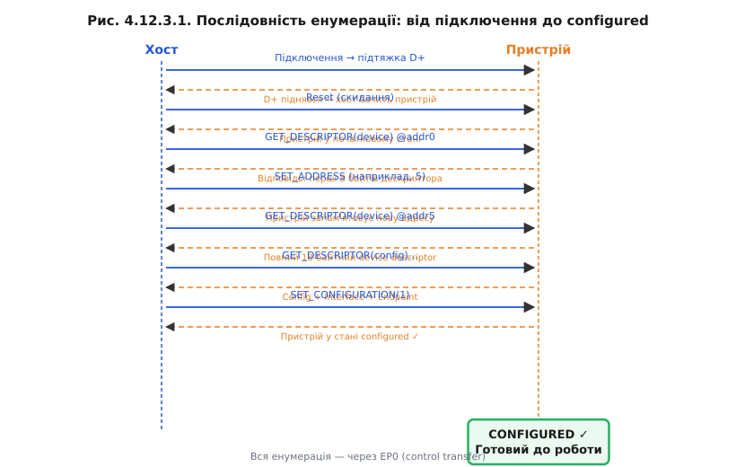
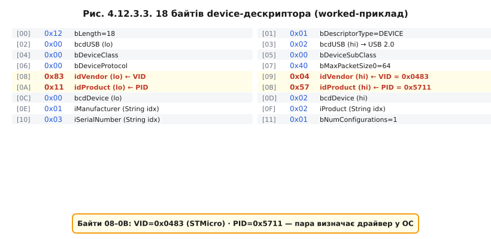

# Енумерація: як хост знайомиться з пристроєм

Підтяжка 1,5 кОм сказала хосту: «Я тут і я Full-Speed». Але хост ще нічого не знає про цей пристрій — ні що це за клас обладнання, ні яку максимальну швидкість він підтримує, ні скільки струму потребує. Весь цей діалог — **знайомство хоста з пристроєм** — називається **енумерацією** (enumeration). Вона відбувається ще до того, як ОС завантажить будь-який драйвер, і вся її суть — отримати від пристрою відповіді на стандартні запити.

### Адреса за замовчуванням 0

Щойно підключений пристрій відповідає на **USB-адресу 0**. Це єдине місце в USB, де адреса 0 легальна й зарезервована саме для цього: щойно виявленого пристрою, якому ще не призначено індивідуальну адресу. Хост спочатку скидає пристрій (подає reset на шину — певний стан D+ і D−), а потім опитує його на адресі 0. Після того як хост дізнається мінімально необхідне (хоча б розмір буфера EP0), він надсилає команду **SET_ADDRESS** і призначає пристрою унікальну адресу у діапазоні 1–127. Чому адресу дає хост, а не пристрій сам собі? Тому що в USB [хост — єдиний господар шини](book:programming/usb-overview): він бачить усе дерево і знає, які адреси вільні.

### Дескриптори — анкета пристрою

Уся інформація, яку пристрій надає хосту, зберігається у **дескрипторах** (descriptors) — бінарних структурах фіксованого формату у пам'яті самого пристрою. Дескриптори ієрархічні:

- **Device Descriptor** — загальні відомості про пристрій: версія USB-специфікації, клас/підклас/протокол, максимальний розмір пакета EP0, VID, PID, версія прошивки, кількість конфігурацій.
- **Configuration Descriptor** — одна з можливих конфігурацій пристрою (у більшості пристроїв одна). Містить кількість інтерфейсів, атрибути живлення, максимальний струм.
- **Interface Descriptor** — одна функціональна роль у межах конфігурації (клас інтерфейсу, кількість кінцевих точок).
- **Endpoint Descriptor** — конкретний канал: номер кінцевої точки, напрям, тип передачі, максимальний розмір пакета, інтервал опитування.
- **String Descriptors** — необов'язкові: назва виробника, назва пристрою, серійний номер у зручному для читання вигляді.

Хост читає дескриптори «зверху вниз»: спочатку Device, потім Configuration, потім Interface(и), потім Endpoint(и). Поступово він складає повну картину того, з ким спілкується.


*Рис. Де в ієрархії живуть VID/PID і [код класу](book:programming/usb-device-classes). String-дескриптори — збоку.*

### VID/PID — паспорт пристрою

У Device Descriptor є два поля, на які операційна система звертає особливу увагу: **idVendor (VID)** і **idProduct (PID)**. VID — це 16-бітний ідентифікатор виробника, який видає організація USB Implementers Forum (USB-IF), і він коштує грошей: реєстрація обходиться в кілька тисяч доларів. PID — 16-бітний ідентифікатор конкретного продукту, який виробник призначає сам у межах свого VID.

Пара VID:PID — це, по суті, «паспорт» пристрою: ОС використовує її для підбору потрібного драйвера з бази. Для аматорських і невеликих комерційних проєктів власний VID — розкіш. На практиці розробники нерідко використовують VID/PID, що належать розробницьким інструментам або відкритим проєктам (наприклад, Openmoko або pid.codes), на відповідних ліцензійних умовах.

### Кінцева точка 0 і setup-пакети

Уся енумерація проходить через **endpoint 0** (EP0) — він єдиний, що завжди є на будь-якому USB-пристрої, і є двонапрямним. EP0 — службовий канал типу **control** (це один із [типів передач USB](book:programming/usb-endpoints)). Через нього хост надсилає **SETUP-пакети** — структури фіксованого формату з кодом стандартного запиту. Основні запити при енумерації: `GET_DESCRIPTOR`, `SET_ADDRESS`, `SET_CONFIGURATION`.

### Хід знайомства

Послідовність кроків виглядає так:

1. Підключення → підтяжка D+ → хост реагує.
2. Хост подає **USB reset** (пристрій повертається до початкового стану).
3. `GET_DESCRIPTOR(Device, length=8)` на адресу 0 — хост читає перші 8 байтів, щоб дізнатися `bMaxPacketSize0`.
4. Ще один reset.
5. `SET_ADDRESS(N)` — пристрій отримує унікальну адресу.
6. `GET_DESCRIPTOR(Device, length=18)` на нову адресу — повний Device Descriptor.
7. `GET_DESCRIPTOR(Configuration)`, `Interface`, `Endpoint`…
8. `SET_CONFIGURATION(1)` — хост вибирає конфігурацію. Пристрій переходить у стан **configured** і готовий до роботи.



*Рис. Вся енумерація — через EP0. Хост ініціює кожен крок.*

> ⚙️ **Мінімальний дескриптор своїми руками** — [`r12-s3-a-descriptors.md`]: які саме байти пишемо у флеш, щоб хост побачив Device і Configuration; покрокова збірка без USB-стека.

**Worked-приклад: читаємо device-дескриптор побайтно**

Реальна C-структура Device Descriptor (18 байтів, packed):

```c
/* usb_descriptors.h — Device Descriptor (USB 2.0, §9.6.1) */
struct __attribute__((packed)) usb_device_descriptor {
    uint8_t  bLength;           /* [00] = 0x12 (18 байтів) */
    uint8_t  bDescriptorType;   /* [01] = 0x01 (DEVICE) */
    uint16_t bcdUSB;            /* [02-03] = 0x0200 (USB 2.0) */
    uint8_t  bDeviceClass;      /* [04] = 0x00 (клас в Interface) */
    uint8_t  bDeviceSubClass;   /* [05] = 0x00 */
    uint8_t  bDeviceProtocol;   /* [06] = 0x00 */
    uint8_t  bMaxPacketSize0;   /* [07] = 0x40 (64 байти EP0) */
    uint16_t idVendor;          /* [08-09] = 0x0483 (STMicro) — VID */
    uint16_t idProduct;         /* [0A-0B] = 0x5711 — PID */
    uint16_t bcdDevice;         /* [0C-0D] = 0x0200 */
    uint8_t  iManufacturer;     /* [0E] = 1 (індекс String) */
    uint8_t  iProduct;          /* [0F] = 2 */
    uint8_t  iSerialNumber;     /* [10] = 3 */
    uint8_t  bNumConfigurations;/* [11] = 1 */
};
```

Гекс-дамп відповідного Device Descriptor:

```
Зсув  Hex   Поле
00    12    bLength = 18
01    01    bDescriptorType = DEVICE
02    00    bcdUSB (lo)
03    02    bcdUSB (hi) → USB 2.0
04    00    bDeviceClass = 0 (клас у Interface)
05    00    bDeviceSubClass
06    00    bDeviceProtocol
07    40    bMaxPacketSize0 = 64
08    83 ← idVendor  (little-endian)
09    04 ← VID = 0x0483
0A    11 ← idProduct (little-endian)
0B    57 ← PID = 0x5711
0C    00    bcdDevice (lo)
0D    02    bcdDevice (hi)
0E    01    iManufacturer
0F    02    iProduct
10    03    iSerialNumber
11    01    bNumConfigurations = 1
```



*Рис. Байти 08–0B — VID і PID у little-endian. За цією парою ОС обирає драйвер.*

> 🔧 **Навіщо це**: коли пристрій «визначається як Unknown Device» або «невідомий USB-пристрій» — у переважній більшості випадків це збій саме під час енумерації. Або дескриптор має помилку в полі довжини, або EP0 не встиг відповісти на перший запит, або клас у дескрипторі не збігається з реальними кінцевими точками. Розуміючи кроки енумерації, ви можете читати лог USB-аналізатора (наприклад, Wireshark із USB-плагіном) і точно бачити, на якому кроці все зупинилося.

На цьому знайомство завершене: пристрій перейшов у стан configured, ОС підібрала драйвер за VID:PID, і відкриті [кінцеві точки](book:programming/usb-endpoints) готові нести корисний трафік.

---
