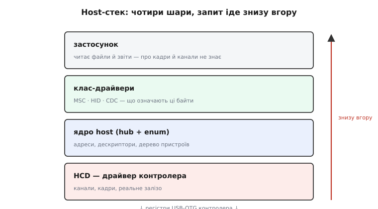

# МК як USB-host: контролер, стек і протоколи зміни ролі

<preknowlist>
- [Огляд USB](book:programming/usb-overview) — несиметрія шини: одна сторона командує (host), решта лише реагують.
- [Кінцеві точки USB](book:programming/usb-endpoints) — що таке endpoint і чотири типи передач: control, bulk, interrupt, isochronous.
- [Енумерація USB](book:programming/usb-enumeration) — як господар розпізнає нового гостя: reset, адреса, дескриптори, конфігурація.
</preknowlist>

Базовий погляд каже: господар сам дає живлення, сам енумерує, сам опитує кінцеві точки. Цього досить, щоб увімкнути флешку. Але щойно треба зрозуміти, **чому** host-стек такий важкий, звідки беруться збої під навантаженням і як один роз'єм чесно міняє роль на ходу, доводиться спуститися на шар нижче — до апаратного host-контролера, його планувальника, шарів стека й двох протоколів OTG. Цей текст — про той нижній шар.

Тримаймо орієнтир: усе, що тут описано, виростає з однієї несиметрії USB. Господар — єдине джерело ініціативи на шині; [складність живе саме в ньому](book:programming/usb-overview), бо ініціатива — це і є складність. Пристрій лише реагує, тому device-стек невеликий; господар планує, роздає, стежить — тому host-стек у рази більший.

## Апаратний host-контролер: що мусить уміти залізо

Бути господарем — це не «налаштування», а інший апаратний блок усередині того самого USB-OTG. Контролеру в ролі host доводиться робити те, чого пристрою не треба ніколи:

- **слати SOF** (Start of Frame) — маркер початку кадру кожну мілісекунду на Full Speed (і мікрокадр кожні 125 мкс на High Speed). SOF задає ритм усієї шини; без нього пристрій вважає, що господар зник, і засинає;
- **формувати пакети-ініціатори** — SETUP, IN, OUT: тільки господар вирішує, кому й коли передати слово;
- **тримати розклад передач** усередині кадру — вкладати заплановані транзакції в 1 мс так, щоб кожна встигла й ніхто не голодував;
- **видавати сигнал reset** — притиснути обидві лінії даних на потрібний час, щоб пристрій скинувся в стартовий стан;
- **керувати живленням** — піднімати й гасити VBUS, ловити перевантаження струму;
- **обробляти підключення й від'єднання** — помічати зміну рівня на лініях даних і запускати чи згортати сесію.

У світі мікроконтролерів типовий апаратний блок для цього — контролер сімейства DWC (Synopsys DesignWare USB 2.0 OTG), той самий, що стоїть у багатьох STM32, і споріднений із тим, що в ESP32-S2/S3. Він має кілька апаратних **каналів** (host channels): канал — це апаратний «двигун» однієї передачі, який сам відпрацьовує квитки-транзакції до призначеної кінцевої точки. Каналів обмежено — скажімо, вісім, — і це пряме фізичне обмеження: скільки одночасних потоків господар фізично потягне.

> 🔧 **Навіщо це.** Кількість каналів — не абстракція з даташита, а стеля, об яку б'ється реальний проєкт. Клавіатура, миша через хаб, флешка — кожен активний endpoint просить канал; коли їх більше, ніж каналів, стек мусить тасувати канали між передачами, і latency росте. Знаючи це число наперед, ти не пообіцяєш замовнику «підключимо сім пристроїв через хаб», коли залізо тягне три.

Поряд із каналами є друге фізичне обмеження — **пам'ять під передачі**. Дані, що йдуть через канал, мусять десь лежати: або в спеціальному буфері FIFO самого контролера, або в звичайному ОЗП, куди контролер ходить за прямим доступом (DMA). На мікроконтролері це болить сильніше, ніж на ПК: FIFO малий, а кожен буфер передачі, кожен дескриптор, кожне дерево пристроїв їсть ті самі десятки чи сотні кілобайт ОЗП, що й увесь застосунок. Звідси й цифри з документації ESP-IDF: host-стеку треба помітний шмат пам'яті, і на дрібному чипі його просто не вистачить. Це ще одна причина, чому host тягнуть лише ширші S2/S3, а не «затісні» варіанти, — справа не лише в наявності блоку OTG, а й у тому, чи є чим його годувати.

І третя межа — **смуга самого контролера**. Навіть якщо каналів і пам'яті досить, апаратний блок Full Speed фізично не пропустить більше за свої 12 Мбіт/с на всю шину разом. High Speed (480 Мбіт/с) піднімає стелю, але вимагає окремого фізичного шару (PHY) і більше ресурсів; багато мікроконтролерних OTG-блоків у ролі host лишаються на Full Speed. Тому реальний потік флешки тут — одиниці мегабайт за секунду, а не «як по USB 3», і це варто закладати в розрахунок ще на папері.

## Планувальник передач: де народжується 1 мілісекунда

Найцікавіше в host-контролері — **планувальник** (scheduler). Він вирішує, що саме покласти в поточний кадр, і робить це за правилами, що прямо випливають із [типів передач і кінцевих точок](book:programming/usb-endpoints/detail). Порядок усередині кадру не довільний — у нього є чітка ієрархія пріоритетів.

```
кадр 1 мс на Full Speed:
  [SOF] [isochronous] [interrupt] [ control / bulk у залишок ] ... [SOF]
   ↑       ↑              ↑            ↑
  старт  гарантована    опитування    усе, що влізе
         смуга          за періодом    у вільний час
```

Логіка така. **Ізохронні** передачі (звук, відео) першими: їм обіцяна смуга в кожному кадрі, бо запізнілий звук уже непотрібний — його не повторюють. Далі **interrupt**: клавіатура чи миша мають endpoint із періодом опитування (скажімо, «питай мене кожні 10 мс»), і планувальник зобов'язаний влучити в цей період. Те, що лишилося від кадру, віддається **control** і **bulk** — їм смуги ніхто не гарантував, вони беруть залишок. Тому масове копіювання з флешки (bulk) сповільнюється, коли в кадрі багато гарантованого трафіку, — і це не баг, а замисел: критичне за часом має пройти, некритичне зачекає.

Звідси й практичний наслідок: **bulk не має дедлайну, але має голод**. Якщо ізохронного й interrupt-трафіку стільки, що залишку майже немає, флешка ледь повзе. А якщо планувальник запланував interrupt-endpoint, але пристрій не має нових даних, він відповідає NAK — «поки нічого», — і канал звільняється для наступної спроби. Уся ця механіка — рівно те, чого немає в device-стеку: пристрій просто чекає, коли його спитають.

**Worked-приклад: чи влізе клавіатура поряд із флешкою.** Порахуймо грубо, скільки кадру з'їдає interrupt-endpoint клавіатури і скільки лишається флешці на Full Speed (12 Мбіт/с, кадр 1 мс).

```c
/* Full Speed: 12 Мбіт/с → ~1500 байт корисних на кадр (1 мс) */
const int FRAME_BYTES = 1500;

/* Клавіатура: interrupt-IN, звіт 8 байт, період опитування 10 мс.
   Отже в середньому 8 байт на 10 кадрів. Рахуємо дробом (double),
   бо ціла ділка 8/10 дала б 0 і сховала б увесь сенс. */
const double kbd_per_frame = 8.0 / 10.0;   /* = 0.8 байта/кадр, тобто майже нічого */

/* Флешка: bulk-IN, бере весь залишок кадру.
   SOF і службові поля з'їдають ~6% (≈90 байт). */
const double flash_budget = FRAME_BYTES - kbd_per_frame - 90;
/* flash_budget = 1500 - 0.8 - 90 = 1409.2 байта/кадр → ~1.4 МБ/с реального потоку */
```

Висновок очевидний: клавіатура коштує мізер — її період 10 мс і крихітний звіт майже не зачіпають флешку. А от **ізохронний** аудіопотік (скажімо, 44.1 кГц стерео — близько 176 байт **кожного** кадру) відкусив би десяту частину смуги назавжди, і копіювання помітно просіло б. Тому правило «host тягне багато пристроїв» залежить не від їхньої кількості, а від **типу** їхніх передач: interrupt-дрібнота нешкідлива, ізохронні ненажери — ні.

Глибше, ніж кадр, лежить **транзакція**. Одна передача (наприклад, прочитати сектор флешки) розпадається на пакети, що по черзі проходять через апаратний канал: токен від господаря (IN), дані від пристрою, рукостискання у відповідь (ACK / NAK / STALL). Канал відпрацьовує цю трійку сам і будить процесор перериванням лише по завершенні чи помилці — інакше дрібна метушня пакетів з'їла б увесь CPU. **STALL** тут означає не «зачекай» (як NAK), а «endpoint у помилці»: стек мусить його скинути окремою керівною передачею, перш ніж endpoint оживе. Розрізняти NAK і STALL критично — перший минеться сам, другий вимагає втручання.

## Host-стек шарами: від заліза до застосунку

Великий розмір host-стека — це не один товстий шматок коду, а **чотири шари**, кожен зі своєю роботою. Розуміти їх окремо важливо, бо помилка майже завжди живе на конкретному шарі.

```
┌─ застосунок ──────── читає файли / звіти, нічого не знає про SOF
├─ клас-драйвери ───── MSC, HID, CDC: «що означають ці байти»
├─ ядро host (hub + enum) ── адреси, дескриптори, дерево пристроїв
└─ HCD (host controller driver) ── канали, кадри, реальне залізо
```

**HCD** (Host Controller Driver) — найнижчий: він єдиний торкається регістрів контролера, роздає апаратні канали, ставить транзакції в кадр, ловить переривання завершення. Над ним — **ядро host**: воно проводить [енумерацію](book:programming/usb-enumeration/detail) (reset → адреса → дескриптори → конфігурація), веде **дерево пристроїв** і вміє говорити з хабами, бо за хабом може висіти ще пристрій, який теж треба заенумерувати. Вище — **клас-драйвери**, що перетворюють сирі передачі на зміст: «це звіт клавіатури», «це сектор флешки». І нарешті **застосунок**, який працює з файлами та звітами й щасливо не знає ні про кадри, ні про канали.

Така шаруватість пояснює, чому навіть «прочитати один байт із клавіатури» тягне за собою стільки коду: байт мусить пройти знизу вгору крізь усі чотири рівні. І чому пам'яті треба багато: кожен шар тримає свої структури — дескриптори, дерево, буфери передач, стани класів.



*Кожен шар має вузьку роботу; помилка зазвичай локалізується на одному рівні, і шукати її варто саме там, а не «в USB взагалі».*

## Енумерація очима господаря

Базовий погляд згадує енумерацію одним рядком — «reset, адреса, дескриптори, конфігурація». Зсередини це невеликий **скінченний автомат**, який ядро host веде крок за кроком, і кожен крок має свою пастку. Варто пройтися по ньому, бо саме тут найчастіше «нічого не працює».

Спершу — **виявлення й антидрязк** (debounce). Підключення проявляється як підтяжка однієї з ліній даних до робочого рівня: пристрій Full Speed тягне вгору D+, Low Speed — D−. Уже з цього господар читає швидкість пристрою, **перш ніж** сказав йому бодай слово. Але контакт у роз'ємі деренчить, тож стек витримує паузу (порядку 100 мс) і лише по стабільному рівні визнає підключення — інакше один незграбний дотик породив би шквал хибних під'єднань.

Далі — **reset**: господар притискає обидві лінії даних у нуль на задану специфікацією тривалість. Після reset пристрій **зобов'язаний** відповідати на адресу 0 — спільну стартову адресу, з якої починають усі. Тут криється класична тонкість: спершу господар читає лише початок дескриптора пристрою, щоб дізнатися **максимальний розмір пакета на endpoint 0**, і лише потім веде повний діалог; інакше він не знає, якими порціями взагалі можна говорити з цим пристроєм.

Потім — **призначення адреси**. Господар керівною передачею `SET_ADDRESS` видає пристрою унікальний номер (1…127) і відтепер звертається лише за ним; адреса 0 знову вільна для наступного новачка. Якщо за дротом висить хаб, кожен його порт умикається й енумерується **по черзі** — двоє новачків на адресі 0 одночасно конфліктували б, тому хаб-логіка суворо серіалізує підключення.

Нарешті — **дескриптори й конфігурація**. Господар вичитує дерево дескрипторів (пристрій → конфігурації → інтерфейси → endpoint-и), на підставі поля класу обирає клас-драйвер і керівною передачею `SET_CONFIGURATION` умикає пристрій у робочий стан. Лише після цього endpoint-и оживають і починається корисний обмін. Усе це — чиста ініціатива господаря; пристрій жодного кроку не починає сам. Деталі формату пакетів і дескрипторів — у [повному розборі енумерації](book:programming/usb-enumeration/detail); тут важливо побачити саме **послідовність станів**, яку веде господар, і де на ній спотикаються реальні плати: пропустив паузу-антидрязк — ловиш привидів; почав повний діалог до читання розміру пакета EP0 — отримуєш збій на першій же довгій передачі.

> 🔧 **Навіщо це.** Коли пристрій «не визначається», корисно знати, на якому саме кроці автомата все стало. Немає підтяжки на лінії — підозра на живлення чи кабель (шар HCD/живлення). Підтяжка є, але reset не дає відповіді на адресі 0 — підозра на тайминги чи розмір пакета EP0 (шар ядра). Дескриптори читаються, а клас не чіпляється — нема драйвера потрібного класу (верхній шар). Знання автомата перетворює «USB не працює» на конкретне місце пошуку.

## OTG чесно: SRP і HNP

Базовий погляд каже: контакт ID вирішує роль до першого біта. Це правда для старту. Але повна специфікація **USB OTG** має два протоколи, що дозволяють парі дуальних пристроїв поводитися розумніше — економити живлення й навіть мінятися ролями вже під час сесії. Обидва існують саме тому, що OTG задумано для роботи **без ПК, у полі**, де нема кому розрулювати конфлікти.

**SRP** (Session Request Protocol — протокол запиту сесії). Господар-A не зобов'язаний тримати VBUS увімкненим завжди — для пристроїв на батарейках це марна трата енергії. SRP дозволяє стороні-B **попросити** сторону-A підняти VBUS і почати сесію. B подає короткий імпульс по лінії даних (а в давніших реалізаціях — і по лінії VBUS), A це помічає й вмикає живлення. Сенс простий: господар спить із погашеним VBUS, а гість його будить, коли йому справді треба.

**HNP** (Host Negotiation Protocol — протокол перемовин про роль). Це і є та сама буква «host» у назві ролі, яку можна **передати, не перетикаючи кабель**. Класичний приклад зі специфікації: користувач з'єднав принтер і камеру, але встромив так, що принтер вийшов господарем (A), хоча для друку фото командувати має камера. Якщо камера вміє говорити з принтером, HNP дозволяє A **поступитися роллю** — принтер стає пристроєм, камера стає господарем, і друк іде в потрібному напрямку. Фізично роль усе ще «належить» стороні-A (вона тримає VBUS), але логічно господарем тепер інша сторона.

Технічно за всім цим стоїть невеликий **скінченний автомат ролей** усередині OTG-контролера. Стартовий стан задає ID: замкнутий — гілка A-device (відповідає за VBUS), плаваючий — гілка B-device. Далі автомат ходить між станами «очікую сесію», «сесія активна», «передаю роль» за подіями SRP і HNP та за рівнями на лініях. У сучаснішому USB-C ту саму роль-машину запускають не ID, а резистори й логіка CC, але ідея незмінна: апаратний стан вирішує, хто зараз господар, а програма лише дізнається про це з прапорців.

На практиці у вбудованих проєктах на ESP32 повний HNP трапляється рідко — найчастіше роль фіксована конструкцією, а ESP-IDF піднімає host-режим прямо, без перемовин. Але знати про SRP/HNP варто хоча б тому, що вони пояснюють, чому в специфікації OTG стільки складності понад «просто ID на землю»: стандарт проєктували під поле без ПК, де два пристрої мусять домовитися про роль і живлення самі, без третейського ПК. Без цих протоколів пара «камера + принтер» або «телефон + клавіатура» просто не знала б, хто з них головний.

## Керування живленням порту: більше, ніж «увімкнув VBUS»

Базовий текст каже головне: [VBUS подає сам господар](book:programming/usb-power) через зовнішній ключ. Детальніше — це окремий шматок логіки з кількома станами, і недбалість тут карається найболючіше, бо страждає залізо.

Першим ділом — **черговість**: enable-пін ключа VBUS треба підняти **перед** ініціалізацією host-стека. Інакше стек почне виявляти пристрій на знеструмленому порту, нічого не побачить — і помилка виглядатиме як «стек не працює», хоча проблема в живленні.

Далі — **контроль струму**. Ключ живлення (load switch) бажано брати з обмеженням струму й сигналом помилки (fault): коли гість тягне понад дозволене — старий 2.5″ HDD, потужний свисток — ключ або обмежить струм, або вимкнеться й підніме fault, а стек має це помітити й коректно згорнути сесію, а не зависнути. Без такого захисту перевантаження просадить шину живлення всього мікроконтролера, і він перезавантажиться посеред роботи.

І **inrush** — кидок струму в перший момент подачі VBUS, коли заряджаються вхідні конденсатори гостя. Якщо ключ відкривається різко, цей кидок може просадити 5 В так, що сам господар моргне. Тому хороші ключі мають кероване наростання (soft-start), а в саморобці між VBUS і землею ставлять достатній конденсатор, щоб згладити старт.

```c
/* Порядок увімкнення порту — критичний */
gpio_set_level(VBUS_EN, 1);   /* 1. підняти ключ VBUS */
/* дати кілька мс на наростання й inrush */
vTaskDelay(pdMS_TO_TICKS(5));
usb_host_install(&host_config);  /* 2. лише тепер піднімати стек */
/* fault від ключа живлення слухаємо окремим GPIO-перериванням */
```

## Клас-драйвери на боці хоста

Найвищий змістовний шар — **клас-драйвери**: вони знають, що означають байти від конкретного класу пристроїв. Сила USB саме тут: для стандартних класів драйвер один на весь клас, тож будь-яка флешка чи будь-яка клавіатура працює без окремого «драйвера під модель».

**MSC** (Mass Storage Class) — носії. Драйвер загортає команди SCSI у трифазовий протокол Bulk-Only Transport: командний блок (CBW) bulk-OUT → дані bulk-IN або bulk-OUT → статус (CSW) bulk-IN. Командою «прочитай 28 секторів від N» драйвер тягне з флешки одразу великий шматок, а не сектор по сектору — інакше накладні витрати трьох фаз на кожен сектор з'їли б швидкість. Зверху лягає [файлова система](book:programming/flash-filesystems) FAT, і застосунок працює з файлами, не знаючи про сектори. Майже весь обмін тут bulk, тож реальна швидкість впирається в залишок кадру після гарантованого трафіку — і в те, наскільки великими блоками драйвер читає.

**HID** (Human Interface Device) — клавіатури, миші, сканери. Драйвер періодично читає **звіти** (reports) з interrupt-IN endpoint-а, а формат звіту бере не з здогадки, а з **report descriptor** — машинного опису, який сам пристрій віддає при енумерації: «байт 0 — модифікатори, байти 2–7 — до шести кодів натиснутих клавіш». Розклавши звіт за [таблицями HID Usage](book:programming/usb-device-classes), драйвер знає, який байт — клавіша, кнопка чи координата. Окрема тонкість — **boot protocol**: спрощений фіксований формат, який клавіатура вміє віддавати ще до завантаження повного драйвера (ним користується BIOS); багато простих host-стеків на МК зчитують саме його, бо він не вимагає розбирати report descriptor. Періодичність опитування задає пристрій у дескрипторі, а планувальник її дотримує.

**CDC** (Communications Device Class) — модеми й USB-серійні перехідники. Драйвер дає застосунку звичний потік байтів «туди-сюди», ховаючи за собою дві bulk-труби (IN і OUT) та керівний канал для службових команд (швидкість, керівні лінії). Для мікроконтролера-господаря це спосіб поговорити з GSM-модемом AT-командами чи з іншою платою так, ніби це звичайний [UART](book:communications/uart-frame), тільки по USB — з тією різницею, що темп задає господар своїм опитуванням bulk-IN, а не асинхронний приймач.

Кожен клас-драйвер чіпляється до пристрою **після** енумерації, коли ядро вже знає його клас із дескриптора. Тому в коді це й виглядає як «callback підключення → встав драйвер потрібного класу»: уся чорна робота з адресами й дескрипторами вже позаду, лишається надати байтам зміст.

> 🔧 **Навіщо це.** Розуміння класів економить найбільше часу при виборі рішення. Питання «чи потягне мій МК цей пристрій» майже завжди зводиться до «чи є для його класу драйвер у моєму host-стеку». MSC і HID підтримані майже всюди; екзотичний клас (специфічний принтер, нестандартний пристрій) може взагалі не мати готового драйвера — і тоді host-режим на МК для нього не варіант, хоч би яким потужним був чип.
